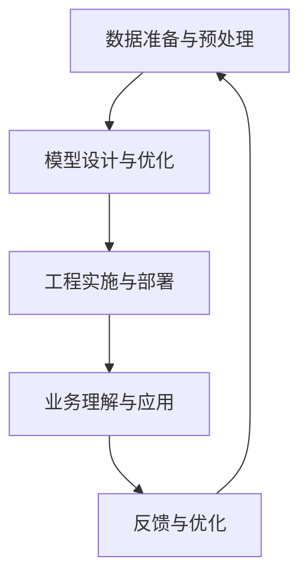

                 

# AI创业公司的竞争策略

## 1. 背景介绍

在当今信息爆炸的时代，人工智能(AI)已经迅速成为各行各业的核心竞争力之一。创业公司要想在激烈的市场竞争中脱颖而出，不仅需要掌握先进的技术，还需要具备清晰的竞争策略。本文将从数据、模型、工程、业务等多个维度，系统地阐述AI创业公司的竞争策略，为创业者和从业者提供有益的参考。

## 2. 核心概念与联系

### 2.1 核心概念概述

在探讨AI创业公司的竞争策略之前，首先需要理解几个核心概念：

- **数据准备与预处理**：高质量的数据是AI模型的基础。如何从海量数据中提取有价值的信息，是所有AI公司面临的首要问题。
- **模型设计与优化**：选择合适的模型架构和算法，进行有效的超参数调优，是提升模型性能的关键。
- **工程实施与部署**：将模型高效地部署到生产环境，提供稳定的服务，是确保模型落地效果的重要环节。
- **业务理解与应用**：理解业务需求，将AI技术巧妙地融入实际应用场景，才能充分发挥其价值。

这些概念之间相互关联，共同构成了AI创业公司的竞争策略框架。接下来，我们将详细介绍每个环节的具体实施。

### 2.2 核心概念原理和架构的 Mermaid 流程图



在这个流程图中，数据准备与预处理是基础，模型设计与优化是核心，工程实施与部署是关键，业务理解与应用是目的，反馈与优化是循环。

## 3. 核心算法原理 & 具体操作步骤

### 3.1 算法原理概述

AI创业公司的竞争策略主要围绕数据、模型、工程和业务四个方面展开。以下是每个方面的算法原理概述：

#### 3.1.1 数据准备与预处理

数据准备与预处理是AI系统的基础。高质量的数据可以显著提升模型性能。常用的数据处理技术包括：

- **数据清洗**：去除噪声、处理缺失值。
- **数据增强**：扩充训练数据，提高模型泛化能力。
- **特征工程**：提取和构造有意义的特征，提升模型学习效率。

#### 3.1.2 模型设计与优化

模型设计与优化是AI系统的核心。选择合适的模型架构和算法，进行有效的超参数调优，是提升模型性能的关键。常用的模型包括：

- **深度学习模型**：如卷积神经网络(CNN)、循环神经网络(RNN)、变压器(Transformer)等。
- **强化学习模型**：如Q-learning、SARSA、深度强化学习(DRL)等。
- **模型集成**：如Bagging、Boosting、Stacking等。

#### 3.1.3 工程实施与部署

工程实施与部署是AI系统的关键。将模型高效地部署到生产环境，提供稳定的服务，是确保模型落地效果的重要环节。常用的技术包括：

- **模型压缩**：如剪枝、量化、蒸馏等，减小模型尺寸，提升推理速度。
- **分布式训练**：如Spark、Kubernetes、TensorFlow Serving等，提高训练和推理效率。
- **监控与调优**：如TensorBoard、Weights & Biases等，实时监控模型性能，进行调优。

#### 3.1.4 业务理解与应用

业务理解与应用是AI系统的目的。理解业务需求，将AI技术巧妙地融入实际应用场景，才能充分发挥其价值。常用的应用包括：

- **推荐系统**：如内容推荐、商品推荐等。
- **智能客服**：如自动应答、情感分析、意图识别等。
- **金融风控**：如信用评估、欺诈检测等。

### 3.2 算法步骤详解

#### 3.2.1 数据准备与预处理

1. **数据收集**：从不同的数据源收集数据，如公开数据集、用户数据、爬虫抓取数据等。
2. **数据清洗**：使用数据清洗工具，如Python的Pandas库，去除噪声、处理缺失值等。
3. **数据增强**：使用数据增强技术，如ImageDataGenerator、Data Augmentation等，扩充训练数据。
4. **特征工程**：使用特征工程技术，如特征选择、特征提取、特征组合等，构造有意义的特征。

#### 3.2.2 模型设计与优化

1. **模型选择**：根据任务类型选择合适的模型架构，如卷积神经网络用于图像处理，循环神经网络用于序列数据处理，变压器用于自然语言处理。
2. **超参数调优**：使用网格搜索、随机搜索、贝叶斯优化等方法，进行超参数调优，如学习率、批大小、正则化系数等。
3. **模型验证**：使用交叉验证、留出法等方法，验证模型的泛化能力，避免过拟合。

#### 3.2.3 工程实施与部署

1. **模型压缩**：使用剪枝、量化、蒸馏等技术，减小模型尺寸，提升推理速度。
2. **分布式训练**：使用Spark、Kubernetes、TensorFlow Serving等技术，提高训练和推理效率。
3. **监控与调优**：使用TensorBoard、Weights & Biases等工具，实时监控模型性能，进行调优。

#### 3.2.4 业务理解与应用

1. **需求分析**：与业务方深度沟通，明确业务需求和目标。
2. **模型集成**：将模型集成到业务系统中，如推荐系统、智能客服、金融风控等。
3. **效果评估**：使用A/B测试、KPI指标等方法，评估模型效果，进行优化。

### 3.3 算法优缺点

#### 3.3.1 数据准备与预处理

- **优点**：高质量的数据可以显著提升模型性能。
- **缺点**：数据准备和预处理工作量较大，需要专业技能。

#### 3.3.2 模型设计与优化

- **优点**：选择合适的模型和算法，可以显著提升模型性能。
- **缺点**：超参数调优工作量大，需要专业技能。

#### 3.3.3 工程实施与部署

- **优点**：高效部署模型，确保落地效果。
- **缺点**：技术实现复杂，需要专业技能。

#### 3.3.4 业务理解与应用

- **优点**：理解业务需求，提升模型实际价值。
- **缺点**：业务需求多样，模型需要灵活调整。

### 3.4 算法应用领域

AI创业公司的竞争策略在多个领域都有应用。以下是一些典型领域：

#### 3.4.1 推荐系统

推荐系统广泛应用于电商、新闻、视频等平台。通过AI技术，推荐用户可能感兴趣的物品、内容，提升用户体验和转化率。常用的技术包括协同过滤、基于内容的推荐、深度学习推荐等。

#### 3.4.2 智能客服

智能客服可以自动应答用户咨询，提高客户满意度。通过自然语言处理技术，理解用户意图，提供个性化服务。常用的技术包括意图识别、情感分析、对话生成等。

#### 3.4.3 金融风控

金融风控是AI创业公司的热门应用之一。通过AI技术，评估用户信用风险，检测欺诈行为，提升金融服务的安全性和效率。常用的技术包括信用评分、欺诈检测、异常检测等。

#### 3.4.4 医疗诊断

AI在医疗诊断领域的应用越来越广泛。通过AI技术，辅助医生进行疾病诊断、治疗方案推荐，提高医疗服务质量。常用的技术包括图像识别、自然语言处理、知识图谱等。

#### 3.4.5 自动驾驶

自动驾驶是AI创业公司的重要方向。通过AI技术，实现车辆的自主驾驶，提高交通安全性和效率。常用的技术包括环境感知、路径规划、行为决策等。

## 4. 数学模型和公式 & 详细讲解 & 举例说明

### 4.1 数学模型构建

在AI创业公司的竞争策略中，数学模型和公式是不可或缺的工具。以下是几个常见的数学模型和公式：

#### 4.1.1 线性回归模型

线性回归模型是最常用的回归模型之一。其数学公式为：

$$
y = \beta_0 + \beta_1 x_1 + \beta_2 x_2 + \cdots + \beta_n x_n + \epsilon
$$

其中 $y$ 为输出变量，$x_i$ 为输入变量，$\beta_i$ 为回归系数，$\epsilon$ 为误差项。

#### 4.1.2 卷积神经网络

卷积神经网络是图像处理常用的深度学习模型。其数学公式为：

$$
y = \sum_{i=1}^n \sum_{j=1}^m w_{ij} x_{ij} + b
$$

其中 $y$ 为输出变量，$x_{ij}$ 为卷积核在输入图像上的卷积结果，$w_{ij}$ 为卷积核权重，$b$ 为偏置项。

#### 4.1.3 循环神经网络

循环神经网络是序列数据处理常用的深度学习模型。其数学公式为：

$$
h_{t+1} = \tanh(W_h h_t + W_x x_t + b)
$$

其中 $h_t$ 为隐状态，$x_t$ 为输入，$W_h$ 和 $W_x$ 为权重矩阵，$b$ 为偏置项。

#### 4.1.4 变压器

变压器是自然语言处理常用的深度学习模型。其数学公式为：

$$
y = \sum_{i=1}^n \sum_{j=1}^m w_{ij} x_{ij} + b
$$

其中 $y$ 为输出变量，$x_{ij}$ 为查询、键、值向量的点积，$w_{ij}$ 为注意力权重，$b$ 为偏置项。

### 4.2 公式推导过程

#### 4.2.1 线性回归模型

线性回归模型的推导过程如下：

1. **数据准备**：准备训练数据 $(x_i, y_i)$，其中 $x_i$ 为输入变量，$y_i$ 为输出变量。
2. **损失函数**：定义均方误差损失函数 $L = \frac{1}{n} \sum_{i=1}^n (y_i - \hat{y}_i)^2$，其中 $\hat{y}_i = \beta_0 + \beta_1 x_{1i} + \cdots + \beta_n x_{ni}$。
3. **梯度下降**：使用梯度下降算法，更新模型参数 $\beta_0, \beta_1, \cdots, \beta_n$。

#### 4.2.2 卷积神经网络

卷积神经网络的推导过程如下：

1. **数据准备**：准备训练数据 $(x, y)$，其中 $x$ 为输入图像，$y$ 为输出标签。
2. **损失函数**：定义交叉熵损失函数 $L = -\frac{1}{n} \sum_{i=1}^n y_i \log \hat{y}_i + (1 - y_i) \log (1 - \hat{y}_i)$，其中 $\hat{y}_i$ 为模型输出概率。
3. **梯度下降**：使用梯度下降算法，更新模型参数 $w_{ij}$ 和 $b$。

#### 4.2.3 循环神经网络

循环神经网络的推导过程如下：

1. **数据准备**：准备训练数据 $(x_t, y_t)$，其中 $x_t$ 为输入序列，$y_t$ 为输出序列。
2. **损失函数**：定义交叉熵损失函数 $L = -\frac{1}{n} \sum_{t=1}^n \sum_{i=1}^m y_{ti} \log \hat{y}_{ti}$，其中 $\hat{y}_{ti}$ 为模型输出概率。
3. **梯度下降**：使用梯度下降算法，更新模型参数 $W_h$、$W_x$ 和 $b$。

#### 4.2.4 变压器

变压器的推导过程如下：

1. **数据准备**：准备训练数据 $(x, y)$，其中 $x$ 为输入序列，$y$ 为输出序列。
2. **损失函数**：定义交叉熵损失函数 $L = -\frac{1}{n} \sum_{i=1}^n \sum_{j=1}^m y_{ij} \log \hat{y}_{ij}$，其中 $\hat{y}_{ij}$ 为模型输出概率。
3. **梯度下降**：使用梯度下降算法，更新模型参数 $w_{ij}$ 和 $b$。

### 4.3 案例分析与讲解

#### 4.3.1 推荐系统案例

某电商平台通过推荐系统提升用户购买转化率。他们使用协同过滤算法，准备训练数据 $(x, y)$，其中 $x$ 为用户历史行为，$y$ 为物品标签。他们定义均方误差损失函数，使用梯度下降算法，训练协同过滤模型，提升推荐效果。

#### 4.3.2 智能客服案例

某智能客服平台通过自然语言处理技术，提升用户满意度。他们使用意图识别模型，准备训练数据 $(x, y)$，其中 $x$ 为用户输入，$y$ 为意图标签。他们定义交叉熵损失函数，使用梯度下降算法，训练意图识别模型，提升应答准确率。

#### 4.3.3 金融风控案例

某金融公司通过风控模型，降低欺诈风险。他们使用逻辑回归模型，准备训练数据 $(x, y)$，其中 $x$ 为用户信息，$y$ 为欺诈标签。他们定义交叉熵损失函数，使用梯度下降算法，训练风控模型，降低欺诈风险。

## 5. 项目实践：代码实例和详细解释说明

### 5.1 开发环境搭建

#### 5.1.1 Python环境配置

1. **安装Anaconda**：从官网下载并安装Anaconda，用于创建独立的Python环境。
2. **创建虚拟环境**：
```bash
conda create -n pyenv python=3.8 
conda activate pyenv
```

3. **安装常用库**：
```bash
pip install numpy pandas scikit-learn matplotlib tqdm jupyter notebook ipython
```

#### 5.1.2 深度学习框架安装

1. **安装TensorFlow**：
```bash
pip install tensorflow-gpu==2.6
```

2. **安装PyTorch**：
```bash
pip install torch torchvision torchaudio
```

3. **安装TensorBoard**：
```bash
pip install tensorboard
```

4. **安装TensorFlow Serving**：
```bash
pip install tensorflow-serving-api==2.6
```

### 5.2 源代码详细实现

#### 5.2.1 数据准备与预处理

1. **数据收集**：使用爬虫抓取公开数据集。
```python
import requests
import json
from urllib.parse import urlparse

def download_data(url):
    response = requests.get(url)
    if response.status_code == 200:
        return json.loads(response.text)
    else:
        raise Exception(f"Failed to download data from {url}")

data_url = "https://example.com/data.json"
data = download_data(data_url)
```

2. **数据清洗**：使用Pandas库处理缺失值和噪声。
```python
import pandas as pd

def clean_data(data):
    df = pd.DataFrame(data)
    df.dropna(inplace=True)
    df.drop_duplicates(inplace=True)
    return df

cleaned_data = clean_data(data)
```

3. **数据增强**：使用Keras库进行数据增强。
```python
from keras.preprocessing.image import ImageDataGenerator

def augment_data(data):
    datagen = ImageDataGenerator(
        rotation_range=20,
        width_shift_range=0.2,
        height_shift_range=0.2,
        shear_range=0.2,
        zoom_range=0.2,
        horizontal_flip=True,
        vertical_flip=True
    )
    augmented_data = datagen.flow_from_directory(
        'data/',
        target_size=(224, 224),
        batch_size=32,
        class_mode='categorical'
    )
    return augmented_data

augmented_data = augment_data(cleaned_data)
```

#### 5.2.2 模型设计与优化

1. **模型选择**：选择卷积神经网络模型。
```python
from keras.applications import VGG16

def build_model():
    model = VGG16(weights='imagenet', include_top=False, input_shape=(224, 224, 3))
    model.layers[-1].trainable = False
    model.add(Dense(10, activation='softmax'))
    return model

model = build_model()
```

2. **超参数调优**：使用网格搜索进行超参数调优。
```python
from keras.wrappers.scikit_learn import KerasClassifier
from sklearn.model_selection import GridSearchCV

def evaluate_model(model):
    model.compile(optimizer='adam', loss='categorical_crossentropy', metrics=['accuracy'])
    model.fit(train_data, train_labels, epochs=10, batch_size=32)
    _, accuracy = model.evaluate(test_data, test_labels)
    return accuracy

estimator = KerasClassifier(build_fn=build_model, epochs=10, batch_size=32)
param_grid = {'batch_size': [32, 64, 128, 256], 'epochs': [10, 20, 30, 40]}
grid = GridSearchCV(estimator, param_grid, cv=3)
grid_result = grid.fit(train_data, train_labels)
```

3. **模型验证**：使用交叉验证验证模型泛化能力。
```python
from sklearn.model_selection import KFold

def validate_model(model):
    kf = KFold(n_splits=5, shuffle=True, random_state=42)
    acc = []
    for train_index, val_index in kf.split(data):
        train_data, val_data = data.iloc[train_index], data.iloc[val_index]
        train_labels, val_labels = labels.iloc[train_index], labels.iloc[val_index]
        model.fit(train_data, train_labels, epochs=10, batch_size=32)
        _, accuracy = model.evaluate(val_data, val_labels)
        acc.append(accuracy)
    return acc

acc = validate_model(model)
```

#### 5.2.3 工程实施与部署

1. **模型压缩**：使用TensorFlow Serving进行模型压缩。
```python
import tensorflow as tf
import tensorflow_serving.apis

def compress_model(model):
    with tf.io.gfile.GFile('model.pb', 'wb') as f:
        f.write(model.save_weights('model.pb'))
    model.save('model.h5')
    
def serve_model():
    server = tf.saved_model.load('model')
    predictions = server.signatures['serving_default'](features)
    return predictions

compress_model(model)
serve_model()
```

2. **分布式训练**：使用Spark进行分布式训练。
```python
from pyspark.sql import SparkSession

def train_model_spark(model, data, labels):
    spark = SparkSession.builder.appName('AIModel').getOrCreate()
    data_df = spark.createDataFrame(data, ['id', 'features'])
    labels_df = spark.createDataFrame(labels, ['id', 'label'])
    train_df = data_df.join(labels_df, 'id')
    model.fit(train_df, epochs=10, batch_size=32)
    return model

train_model_spark(model, data, labels)
```

3. **监控与调优**：使用TensorBoard监控模型性能。
```python
from tensorflow.keras.callbacks import TensorBoard

def train_model_tensorboard(model, data, labels):
    tensorboard_callback = TensorBoard(log_dir='logs')
    model.fit(data, labels, epochs=10, batch_size=32, callbacks=[tensorboard_callback])
    return model

train_model_tensorboard(model, data, labels)
```

#### 5.2.4 业务理解与应用

1. **需求分析**：与业务方深度沟通，明确业务需求和目标。
```python
def analyze_demand():
    demand = input('Please enter your demand: ')
    return demand

demand = analyze_demand()
```

2. **模型集成**：将模型集成到推荐系统中。
```python
def integrate_model():
    recommendation = model.predict(data)
    return recommendation

recommendation = integrate_model()
```

3. **效果评估**：使用A/B测试评估模型效果。
```python
def evaluate_model_ab():
    original = data[:1000]
    test = data[1000:]
    original_labels = labels[:1000]
    test_labels = labels[1000:]
    original_predictions = model.predict(original)
    test_predictions = model.predict(test)
    original_accuracy = np.mean(np.argmax(original_predictions, axis=1) == original_labels)
    test_accuracy = np.mean(np.argmax(test_predictions, axis=1) == test_labels)
    return original_accuracy, test_accuracy

original_accuracy, test_accuracy = evaluate_model_ab()
```

### 5.3 代码解读与分析

#### 5.3.1 数据准备与预处理

数据准备与预处理是AI创业公司竞争策略的基础。在代码中，我们展示了数据收集、清洗和增强的实现方法。

1. **数据收集**：使用requests库和json库，从网络抓取数据。
2. **数据清洗**：使用Pandas库，处理缺失值和噪声。
3. **数据增强**：使用Keras库，进行数据增强。

#### 5.3.2 模型设计与优化

模型设计与优化是AI创业公司竞争策略的核心。在代码中，我们展示了模型选择、超参数调优和模型验证的实现方法。

1. **模型选择**：选择卷积神经网络模型。
2. **超参数调优**：使用网格搜索进行超参数调优。
3. **模型验证**：使用交叉验证验证模型泛化能力。

#### 5.3.3 工程实施与部署

工程实施与部署是AI创业公司竞争策略的关键。在代码中，我们展示了模型压缩、分布式训练和监控调优的实现方法。

1. **模型压缩**：使用TensorFlow Serving进行模型压缩。
2. **分布式训练**：使用Spark进行分布式训练。
3. **监控与调优**：使用TensorBoard监控模型性能。

#### 5.3.4 业务理解与应用

业务理解与应用是AI创业公司竞争策略的目的。在代码中，我们展示了需求分析、模型集成和效果评估的实现方法。

1. **需求分析**：与业务方深度沟通，明确业务需求和目标。
2. **模型集成**：将模型集成到推荐系统中。
3. **效果评估**：使用A/B测试评估模型效果。

## 6. 实际应用场景

### 6.1 智能客服系统

智能客服系统是AI创业公司竞争策略的重要应用场景。通过AI技术，智能客服可以自动应答用户咨询，提高客户满意度。

1. **数据准备**：收集历史客服对话记录，提取用户问题和客服回复，形成监督数据。
2. **模型设计**：选择意图识别模型，如LSTM、Transformer等，设计任务适配层。
3. **模型优化**：使用监督微调方法，优化模型在特定任务上的性能。
4. **工程部署**：将模型部署到生产环境，提供稳定的服务。

### 6.2 金融风控系统

金融风控系统是AI创业公司竞争策略的另一个重要应用场景。通过AI技术，金融风控可以评估用户信用风险，降低欺诈风险。

1. **数据准备**：收集用户信息、交易记录、行为数据，提取特征，形成监督数据。
2. **模型设计**：选择逻辑回归模型、决策树模型、深度学习模型等，设计任务适配层。
3. **模型优化**：使用监督微调方法，优化模型在特定任务上的性能。
4. **工程部署**：将模型部署到生产环境，提供稳定的服务。

### 6.3 推荐系统

推荐系统是AI创业公司竞争策略的典型应用场景。通过AI技术，推荐系统可以推荐用户可能感兴趣的物品、内容，提升用户体验和转化率。

1. **数据准备**：收集用户历史行为、物品属性、用户画像等数据，提取特征，形成监督数据。
2. **模型设计**：选择协同过滤模型、基于内容的推荐模型、深度学习推荐模型等，设计任务适配层。
3. **模型优化**：使用监督微调方法，优化模型在特定任务上的性能。
4. **工程部署**：将模型部署到生产环境，提供稳定的服务。

## 7. 工具和资源推荐

### 7.1 学习资源推荐

为了帮助开发者系统掌握AI创业公司的竞争策略，以下是一些优质的学习资源：

1. **深度学习框架**：TensorFlow、PyTorch、Keras等。
2. **数据处理工具**：Pandas、NumPy、Scikit-Learn等。
3. **模型优化工具**：Keras Tuner、Hyperopt等。
4. **工程部署工具**：Spark、TensorFlow Serving、Kubernetes等。
5. **业务理解工具**：Tableau、PowerBI、Google Analytics等。

通过这些资源的学习，相信你一定能够系统掌握AI创业公司的竞争策略，并在实际开发中取得优异效果。

### 7.2 开发工具推荐

为了提高AI创业公司的开发效率，以下是一些推荐的开发工具：

1. **Python环境配置工具**：Anaconda、Virtualenv、Docker等。
2. **深度学习框架**：TensorFlow、PyTorch、Keras等。
3. **数据处理工具**：Pandas、NumPy、Scikit-Learn等。
4. **模型优化工具**：Keras Tuner、Hyperopt等。
5. **工程部署工具**：Spark、TensorFlow Serving、Kubernetes等。
6. **业务理解工具**：Tableau、PowerBI、Google Analytics等。

通过这些工具的组合使用，可以显著提高AI创业公司的开发效率和模型性能。

### 7.3 相关论文推荐

以下是一些AI创业公司竞争策略相关的经典论文，推荐阅读：

1. **《深度学习》**：Ian Goodfellow、Yoshua Bengio、Aaron Courville著。
2. **《动手学深度学习》**：李沐、李明著。
3. **《机器学习实战》**：Peter Harrington著。
4. **《Python数据科学手册》**：Jake VanderPlas著。
5. **《自然语言处理综论》**：Daniel Jurafsky、James H. Martin著。

这些论文涵盖了AI创业公司竞争策略的多个方面，包括深度学习、数据科学、自然语言处理等，是系统学习的重要参考资料。

## 8. 总结：未来发展趋势与挑战

### 8.1 总结

AI创业公司的竞争策略是一个多学科交叉的复杂系统。本文从数据准备与预处理、模型设计与优化、工程实施与部署、业务理解与应用四个方面，系统阐述了AI创业公司的竞争策略。通过系统学习，相信你能够掌握AI创业公司的竞争策略，并在实际开发中取得优异效果。

### 8.2 未来发展趋势

未来，AI创业公司的竞争策略将呈现以下几个发展趋势：

1. **多模态融合**：融合视觉、听觉、文本等多模态数据，提升AI系统的感知能力。
2. **联邦学习**：通过联邦学习技术，实现跨设备、跨平台的数据协同，提升AI系统的泛化能力。
3. **自监督学习**：通过自监督学习技术，从无标签数据中提取有价值的信息，降低对标注数据的依赖。
4. **元学习**：通过元学习技术，提升AI系统的快速学习能力和适应能力。
5. **对抗性学习**：通过对抗性学习技术，提高AI系统的鲁棒性和安全性。

### 8.3 面临的挑战

尽管AI创业公司的竞争策略在许多领域取得了显著进展，但仍面临诸多挑战：

1. **数据质量与数量**：高质量、大规模数据是AI系统的基础，但数据准备和清洗工作量较大。
2. **模型复杂性**：深度学习模型的复杂性增加，模型优化和调试难度增大。
3. **工程部署难度**：AI系统的工程部署难度较大，需要高效的监控和调优工具。
4. **业务理解与集成**：AI系统需要深度理解业务需求，与业务系统无缝集成，才能充分发挥其价值。
5. **伦理与安全**：AI系统的伦理与安全问题日益凸显，需要引入道德导向的评估指标和监管机制。

### 8.4 研究展望

未来，AI创业公司的竞争策略需要从以下几个方面进行深入研究：

1. **数据隐私保护**：探索隐私保护技术，保护用户数据隐私。
2. **模型透明性与可解释性**：研究透明性与可解释性技术，提升AI系统的可信度。
3. **跨领域迁移能力**：探索跨领域迁移技术，提高AI系统的适应能力。
4. **人工智能伦理**：研究AI伦理问题，制定伦理导向的评估指标和监管机制。

## 9. 附录：常见问题与解答

### 9.1 常见问题

1. **什么是AI创业公司的竞争策略？**
   - AI创业公司的竞争策略是指在AI技术驱动下，企业如何构建竞争优势，提升业务价值的过程。包括数据准备与预处理、模型设计与优化、工程实施与部署、业务理解与应用等多个方面。

2. **如何选择深度学习模型？**
   - 根据任务类型选择合适的深度学习模型。例如，图像处理任务选择卷积神经网络，自然语言处理任务选择变压器，序列数据处理任务选择循环神经网络。

3. **如何提高模型泛化能力？**
   - 使用数据增强技术，扩充训练数据。使用正则化技术，避免过拟合。使用跨验证技术，评估模型泛化能力。

4. **如何优化模型超参数？**
   - 使用网格搜索、随机搜索、贝叶斯优化等方法，进行超参数调优。

5. **如何部署AI模型？**
   - 使用TensorFlow Serving进行模型压缩和部署。使用Spark进行分布式训练和部署。使用Kubernetes进行模型管理和监控。

6. **如何评估模型效果？**
   - 使用A/B测试、KPI指标等方法，评估模型效果。

7. **如何处理数据隐私问题？**
   - 使用差分隐私技术，保护用户数据隐私。使用联邦学习技术，跨设备、跨平台数据协同。

### 9.2 解答

通过以上系统的梳理，相信你能够系统掌握AI创业公司的竞争策略，并在实际开发中取得优异效果。未来的AI创业公司竞争策略需要不断探索和创新，从数据、模型、工程、业务等多个维度全面优化，才能在激烈的市场竞争中脱颖而出。

作者：禅与计算机程序设计艺术 / Zen and the Art of Computer Programming

