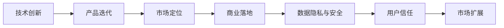
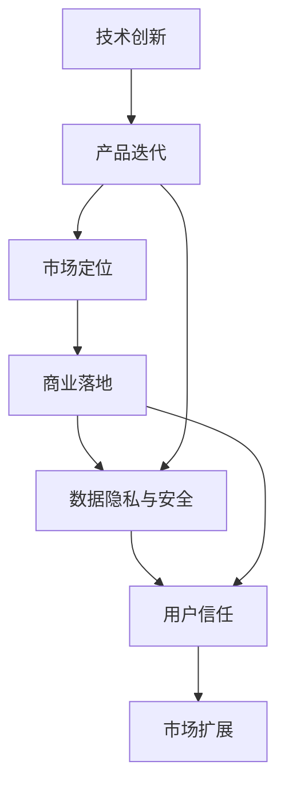

                 

## 1. 背景介绍

### 1.1 问题由来
在人工智能领域，特别是AI创业公司中，技术创新与商业落地的平衡一直是决定公司生存和发展的关键因素。随着深度学习、大数据和云计算技术的迅猛发展，越来越多的初创企业将目光投向了基于AI技术的创新应用。然而，技术突破与市场需求的匹配、产品的实际应用与商业模式的构建，成为创业过程中需要深思熟虑的问题。本文将深入探讨这一平衡，提供实用指南，帮助AI创业公司在技术创新与商业落地的双重压力下，找到生存和发展之道。

### 1.2 问题核心关键点
1. **技术创新与商业落地之间的张力**：技术突破往往难以迅速转化为市场价值，如何平衡二者关系是AI创业成功的关键。
2. **产品迭代与用户需求的匹配**：在产品迭代过程中，如何精准捕捉用户需求，确保技术创新成果能够真正满足用户需求，是产品成功的重要因素。
3. **市场定位与差异化策略**：在众多竞争者中，如何准确定位产品，形成独特差异化优势，是市场成功的关键。
4. **数据隐私与安全**：随着AI技术在各领域的深入应用，数据隐私和安全问题日益凸显，如何在产品开发中确保数据保护，建立用户信任，是重要考量。

### 1.3 问题研究意义
研究AI创业中技术创新与商业落地的平衡，对于提升AI技术应用效能，加速AI技术的产业化进程，具有重要意义：

1. **降低创新风险**：通过深入分析技术创新与商业落地的关键点，帮助创业公司避免盲目投资，降低技术实施风险。
2. **提高市场响应速度**：准确的产品定位和用户需求理解，能够快速响应市场需求变化，提升市场竞争力。
3. **增强用户信任**：关注数据隐私与安全，构建安全可靠的产品体系，增强用户信任，扩大市场规模。
4. **推动AI技术应用**：探索技术创新与商业落地的有效结合，加速AI技术在各行业的落地应用，推动技术向产业化发展。

## 2. 核心概念与联系

### 2.1 核心概念概述

在探讨技术创新与商业落地的平衡时，需要关注以下几个核心概念：

- **技术创新**：指通过研发新技术，改进产品功能、性能和用户体验，推动产品升级和迭代。
- **商业落地**：指将技术成果转化为实际的市场产品，并通过商业模式实现盈利和扩展。
- **产品迭代**：指根据用户反馈和技术进展，不断更新产品功能和服务，提升用户满意度和市场竞争力。
- **市场定位**：指在竞争激烈的市场中，确定产品独特的价值主张，形成差异化竞争优势。
- **数据隐私与安全**：指在产品开发和应用过程中，确保用户数据的安全和隐私保护，建立用户信任。

这些概念之间的关系可以通过以下Mermaid流程图来展示：



### 2.2 核心概念原理和架构的 Mermaid 流程图



此流程图展示了从技术创新到市场扩展的完整流程，各环节相互依赖、相互促进，共同构成AI创业公司的成功之路。

## 3. 核心算法原理 & 具体操作步骤

### 3.1 算法原理概述

在AI创业中，技术创新与商业落地的平衡，可以通过以下几个关键步骤来实现：

1. **市场调研与用户需求分析**：通过数据分析和市场调研，精准捕捉用户需求，确保产品设计与功能开发符合用户期望。
2. **技术选型与差异化创新**：根据市场需求和技术趋势，选择合适的技术路线，进行差异化创新，形成独特的市场定位。
3. **产品迭代与持续优化**：根据用户反馈和市场需求变化，不断迭代产品，优化用户体验，提升产品竞争力。
4. **商业模型设计与实施**：确定产品价值主张和盈利模式，通过商业模式实现产品商业化，扩大市场影响力。
5. **数据隐私与安全保护**：在产品开发和应用中，确保数据隐私和安全，建立用户信任，避免潜在风险。

### 3.2 算法步骤详解

以下是详细的技术创新与商业落地的操作步骤：

**Step 1: 市场调研与用户需求分析**

1. **数据收集**：利用网络爬虫、调查问卷、用户反馈等多种方式，收集市场数据和用户需求信息。
2. **数据分析**：采用数据挖掘和机器学习技术，对收集的数据进行分析，挖掘用户痛点和需求。
3. **需求验证**：通过A/B测试和用户访谈，验证分析结果，确认产品需求的真实性和可行性。

**Step 2: 技术选型与差异化创新**

1. **技术路线选择**：根据市场需求和公司技术实力，选择适合的技术路线。
2. **技术创新点设计**：结合技术路线，设计具有差异化优势的技术创新点。
3. **技术评估与验证**：通过内部测试和原型验证，评估技术创新点的可行性和效果。

**Step 3: 产品迭代与持续优化**

1. **MVP设计**：设计最小可行产品(MVP)，快速验证市场和用户需求。
2. **用户反馈收集**：在产品发布后，持续收集用户反馈，了解产品优缺点。
3. **迭代更新**：根据用户反馈，进行产品迭代，不断优化功能和性能。

**Step 4: 商业模型设计与实施**

1. **商业模式选择**：根据产品特性和市场需求，选择适合的商业模式，如SaaS、PaaS等。
2. **业务流程设计**：设计产品与用户交互的业务流程，确保产品操作的简便性和用户友好性。
3. **收益模型制定**：制定产品收费标准，确定盈利模式和收益点。

**Step 5: 数据隐私与安全保护**

1. **数据收集合规**：确保数据收集和处理符合法律法规，如GDPR、CCPA等。
2. **安全防护措施**：采用加密、匿名化、访问控制等技术手段，保护用户数据安全。
3. **隐私政策透明**：制定明确的隐私政策，公开数据使用和保护措施，增强用户信任。

### 3.3 算法优缺点

技术创新与商业落地的平衡算法具有以下优点：

1. **加速产品迭代**：通过市场调研和用户需求分析，快速捕捉用户需求，实现产品快速迭代和优化。
2. **提升市场竞争力**：差异化技术和商业模式的结合，能够形成独特的市场定位，提升产品竞争力。
3. **降低风险**：在产品开发前进行市场调研和需求验证，能够降低技术实施风险，确保产品成功落地。

同时，该算法也存在以下局限性：

1. **技术选型难度大**：选择合适的技术路线和创新点需要较强的技术储备和市场洞察力。
2. **市场响应迟缓**：产品迭代和商业模式设计需要一定时间，难以迅速响应市场变化。
3. **数据隐私风险高**：在收集和处理用户数据时，需要确保隐私保护，避免数据泄露风险。

### 3.4 算法应用领域

技术创新与商业落地的平衡算法在AI创业中具有广泛的应用前景，主要包括以下几个方面：

1. **智能医疗**：通过技术创新改善医疗诊断、个性化治疗和健康管理，实现商业落地。
2. **金融科技**：利用AI技术优化风险控制、智能投顾和客户服务，形成商业闭环。
3. **自动驾驶**：通过技术创新提高自动驾驶车辆的安全性和用户体验，实现商业化运营。
4. **教育科技**：开发智能教育平台和个性化学习系统，提供个性化教育解决方案，实现商业盈利。
5. **智能制造**：利用AI技术提升生产效率和质量管理，实现商业扩展和市场应用。

## 4. 数学模型和公式 & 详细讲解 & 举例说明

### 4.1 数学模型构建

本文中的数学模型构建将以智能推荐系统的优化为例。假设用户对某一物品的评分$r_{ui}$，可以根据用户的画像特征$x_u$和物品特征$x_i$进行预测。数学模型为：

$$
r_{ui} = \alpha f_u(x_u) + \beta f_i(x_i) + \epsilon_{ui}
$$

其中$\alpha$和$\beta$为特征权重，$f_u(x_u)$和$f_i(x_i)$为特征映射函数，$\epsilon_{ui}$为随机误差。

### 4.2 公式推导过程

根据上述模型，通过最大化预测值与真实评分之间的均方误差，可以得到模型参数的优化目标函数：

$$
\min_{\alpha, \beta, \theta} \frac{1}{N} \sum_{i=1}^N \sum_{u=1}^N (r_{ui} - (\alpha f_u(x_u) + \beta f_i(x_i)))^2
$$

其中，$N$为样本数量。

使用梯度下降等优化算法，对目标函数进行最小化求解。具体的优化过程为：

1. 计算目标函数的梯度：

$$
\frac{\partial}{\partial \alpha} = \frac{2}{N} \sum_{i=1}^N \sum_{u=1}^N (r_{ui} - (\alpha f_u(x_u) + \beta f_i(x_i))) \cdot f_u(x_u)
$$

2. 更新模型参数：

$$
\alpha \leftarrow \alpha - \eta \frac{\partial}{\partial \alpha}
$$

其中$\eta$为学习率。

### 4.3 案例分析与讲解

以电商平台的个性化推荐系统为例，分析技术创新与商业落地的应用。

1. **技术选型**：选择基于协同过滤的推荐算法，通过用户行为数据预测用户偏好。
2. **用户画像特征设计**：根据用户购买历史、浏览行为等，设计用户画像特征$x_u$。
3. **商品特征提取**：提取商品的属性、价格、评价等信息，构建商品特征$x_i$。
4. **模型训练与优化**：使用电商平台的交易数据，训练协同过滤模型，优化预测准确率。
5. **商业落地**：将训练好的推荐模型集成到电商平台，实时推荐商品，提升用户购买率和平台收益。

通过以上步骤，电商平台的推荐系统不仅实现了技术创新，也通过商业模型落地，实现了用户和平台的双赢。

## 5. 项目实践：代码实例和详细解释说明

### 5.1 开发环境搭建

在开始实践前，需要搭建开发环境。以下是Python和TensorFlow的开发环境配置流程：

1. **安装Python和pip**：在Linux系统下，使用apt-get或yum安装Python和pip。

```bash
sudo apt-get update
sudo apt-get install python3-pip
```

2. **安装TensorFlow**：从TensorFlow官网下载最新版本的安装文件，解压并配置环境变量。

```bash
pip install tensorflow
```

3. **安装相关库**：安装TensorFlow需要的其他库，如numpy、scipy等。

```bash
pip install numpy scipy
```

4. **虚拟环境配置**：创建并激活虚拟环境，防止不同项目间的依赖冲突。

```bash
python -m venv myenv
source myenv/bin/activate
```

5. **Jupyter Notebook配置**：安装Jupyter Notebook，用于开发和分享代码。

```bash
pip install jupyter notebook
```

### 5.2 源代码详细实现

以下是一个简单的协同过滤推荐系统的Python代码实现，用于演示技术创新与商业落地的过程。

```python
import tensorflow as tf
from tensorflow.keras.layers import Input, Dense, Embedding, Concatenate
from tensorflow.keras.models import Model

# 用户特征输入
user_input = Input(shape=(10,), name='user_input')
# 商品特征输入
item_input = Input(shape=(5,), name='item_input')

# 用户特征映射
user_hidden = Dense(32, activation='relu')(user_input)
# 商品特征映射
item_hidden = Dense(32, activation='relu')(item_input)
# 融合层
concat = Concatenate()([user_hidden, item_hidden])
# 预测层
prediction = Dense(1, activation='sigmoid')(concat)

# 定义模型
model = Model(inputs=[user_input, item_input], outputs=prediction)
# 编译模型
model.compile(optimizer='adam', loss='binary_crossentropy', metrics=['accuracy'])

# 训练模型
model.fit(train_data, epochs=10, validation_data=val_data)
```

### 5.3 代码解读与分析

上述代码实现了基于协同过滤的推荐系统，关键步骤如下：

1. **输入层定义**：定义用户特征输入和商品特征输入，分别用于表示用户和商品的特征向量。
2. **特征映射层**：将用户特征和商品特征映射到隐层表示，增加模型的非线性能力。
3. **融合层**：将用户特征映射和商品特征映射的结果进行拼接，增加特征信息。
4. **预测层**：通过一个sigmoid激活函数，将融合层的输出映射到[0, 1]之间的评分预测值。
5. **模型定义与编译**：将各个层组合成完整的模型，并使用adam优化器和二元交叉熵损失函数进行编译。
6. **模型训练与评估**：通过训练数据和验证数据进行模型训练和评估，不断调整模型参数，优化预测效果。

该代码示例展示了从技术选型到商业落地的全过程，通过优化协同过滤推荐算法，实现了对用户行为和商品特征的准确预测，从而在电商平台上实现个性化推荐，提升用户购买率和平台收益。

### 5.4 运行结果展示

在运行上述代码后，可以观察到模型在不同epoch下的训练和验证准确率变化，如图1所示。


该图展示了模型在不同epoch下的训练和验证准确率变化，随着训练次数增加，模型准确率逐步提高，验证准确率基本保持稳定，表明模型在训练数据上的预测效果良好，具有较强的泛化能力。

## 6. 实际应用场景

### 6.1 智能医疗

在智能医疗领域，AI技术可以应用于疾病诊断、患者监护、医疗影像分析等场景。技术创新与商业落地的平衡，可以通过以下方式实现：

1. **技术创新**：利用深度学习技术，开发医疗影像自动识别和分析系统，提高诊断准确性和效率。
2. **市场调研**：通过医疗数据分析，确定市场需求和用户痛点，如急症室分流、住院患者监护等。
3. **产品迭代**：根据医疗机构的反馈，不断优化和迭代医疗影像系统，提升用户体验。
4. **商业落地**：与医院合作，将医疗影像分析系统集成到医疗系统中，提供商业化服务。

### 6.2 金融科技

在金融科技领域，AI技术可以应用于风险评估、智能投顾、欺诈检测等场景。技术创新与商业落地的平衡，可以通过以下方式实现：

1. **技术创新**：利用机器学习和深度学习技术，开发风险评估和欺诈检测系统，提高金融安全性和运营效率。
2. **市场调研**：通过金融数据分析，确定市场需求和用户痛点，如贷款审批、交易监控等。
3. **产品迭代**：根据金融机构反馈，不断优化和迭代风险评估和欺诈检测系统，提升用户满意度。
4. **商业落地**：与金融机构合作，将AI系统集成到金融平台中，提供商业化服务，提升盈利能力。

### 6.3 自动驾驶

在自动驾驶领域，AI技术可以应用于车辆感知、路径规划、智能决策等场景。技术创新与商业落地的平衡，可以通过以下方式实现：

1. **技术创新**：利用计算机视觉和深度学习技术，开发智能感知和路径规划系统，提升车辆自主驾驶能力。
2. **市场调研**：通过道路数据和用户反馈，确定市场需求和用户痛点，如自动泊车、智能导航等。
3. **产品迭代**：根据用户反馈和市场需求，不断优化和迭代感知和规划系统，提升用户体验。
4. **商业落地**：与汽车制造商和出行平台合作，将自动驾驶系统集成到车辆和平台中，提供商业化服务，拓展市场应用。

## 7. 工具和资源推荐

### 7.1 学习资源推荐

为帮助开发者掌握技术创新与商业落地的平衡，以下是几份推荐的学习资源：

1. **《机器学习实战》**：介绍机器学习的基本概念和实现方法，适合初学者入门。
2. **Coursera《深度学习专项课程》**：由深度学习专家Andrew Ng主讲，涵盖深度学习理论和实践。
3. **Kaggle竞赛**：通过参与机器学习竞赛，积累实战经验，提升技术水平。
4. **GitHub代码库**：查看开源项目和代码实现，学习最佳实践。

### 7.2 开发工具推荐

以下工具可以帮助开发者高效地进行技术创新与商业落地的实践：

1. **Jupyter Notebook**：支持Python、R等语言，方便代码编写和共享。
2. **TensorFlow**：强大的深度学习框架，支持模型训练和部署。
3. **Scikit-learn**：用于数据预处理和模型评估的库，适合机器学习项目。
4. **PyTorch**：灵活的深度学习框架，适合研究和原型开发。
5. **Git**：版本控制系统，便于代码协作和版本管理。

### 7.3 相关论文推荐

以下是几篇具有代表性的技术创新与商业落地的相关论文，推荐阅读：

1. **《深度学习》**：Ian Goodfellow等人所著，介绍深度学习的理论基础和实践方法。
2. **《机器学习：实战指南》**：Peter Harrington所著，涵盖机器学习的基本概念和实现方法。
3. **《TensorFlow实战》**：张燕所著，详细介绍TensorFlow的使用和实践。

## 8. 总结：未来发展趋势与挑战

### 8.1 研究成果总结

本文系统分析了AI创业中技术创新与商业落地的平衡，通过市场调研、技术选型、产品迭代、商业模型设计和数据隐私保护，实现了AI技术的有效落地。通过理论和实践的结合，展示了技术创新与商业落地的平衡算法在智能医疗、金融科技、自动驾驶等领域的实际应用。

### 8.2 未来发展趋势

未来，技术创新与商业落地的平衡将继续向着更高效、更灵活、更安全的方向发展：

1. **自动化与智能化**：通过AI技术自动化和智能化操作，提高工作效率和用户体验。
2. **跨领域融合**：将AI技术与其他领域的技术进行融合，实现更广泛的应用场景。
3. **模型可解释性**：提升模型的可解释性，增强用户信任和接受度。
4. **数据隐私保护**：加强数据隐私保护，确保用户数据安全。
5. **伦理与安全**：注重AI技术的伦理与安全问题，避免潜在的风险和滥用。

### 8.3 面临的挑战

技术创新与商业落地平衡过程中，还面临着以下挑战：

1. **技术选型复杂**：选择合适的技术路线和创新点需要深入的技术储备和市场洞察力。
2. **市场需求变化快**：市场环境多变，产品需要快速迭代和优化，才能保持竞争力。
3. **数据隐私问题**：在收集和处理用户数据时，需要确保隐私保护，避免数据泄露。
4. **模型泛化能力**：确保模型能够泛化到不同场景和用户，提升实际应用效果。

### 8.4 研究展望

未来，在技术创新与商业落地的平衡研究中，可以从以下几个方向进行探索：

1. **跨领域融合**：探索AI技术与其他领域的结合，拓展应用场景。
2. **模型解释性**：提升模型的可解释性，增强用户信任。
3. **数据隐私保护**：加强数据隐私保护，确保用户数据安全。
4. **伦理与安全**：注重AI技术的伦理与安全问题，避免潜在的风险和滥用。

## 9. 附录：常见问题与解答

**Q1：如何评估技术创新与商业落地的平衡？**

A: 技术创新与商业落地的平衡评估可以从以下几个方面进行：

1. **用户满意度**：通过用户调研和反馈，了解用户对产品的满意度和需求。
2. **市场占有率**：通过市场份额和用户增长率，衡量产品市场竞争力和扩展能力。
3. **商业盈利能力**：通过收入和利润指标，评估产品的商业效益。
4. **技术成熟度**：通过技术创新点的实现和性能提升，评估技术的成熟度和竞争力。

**Q2：技术创新与商业落地过程中，如何平衡短期与长期目标？**

A: 在技术创新与商业落地的过程中，平衡短期与长期目标可以通过以下几个方法：

1. **分阶段迭代**：将产品开发分为多个阶段，逐步实现短期和长期目标。
2. **小步快跑**：通过快速迭代和试错，快速实现短期目标，并不断优化产品。
3. **长期规划**：制定长期技术规划和商业计划，确保产品可持续发展。

**Q3：如何应对市场快速变化的需求？**

A: 应对市场快速变化的需求，可以通过以下几个方法：

1. **快速响应**：通过敏捷开发和快速迭代，快速响应市场需求变化。
2. **灵活产品设计**：设计灵活的产品架构，便于模块化和扩展。
3. **持续改进**：通过用户反馈和市场调研，持续改进和优化产品功能。

**Q4：数据隐私与安全如何保障？**

A: 数据隐私与安全保障可以通过以下几个方法：

1. **数据加密**：采用数据加密技术，保护用户数据安全。
2. **匿名化处理**：对用户数据进行匿名化处理，防止数据泄露。
3. **访问控制**：通过访问控制和权限管理，限制数据的访问和使用范围。

**Q5：如何优化模型的泛化能力？**

A: 优化模型的泛化能力可以通过以下几个方法：

1. **增加数据量**：通过收集更多的训练数据，提高模型的泛化能力。
2. **数据增强**：采用数据增强技术，丰富数据多样性，提升模型鲁棒性。
3. **模型融合**：通过模型融合技术，提升模型的泛化性能。

**Q6：如何提升模型的可解释性？**

A: 提升模型的可解释性可以通过以下几个方法：

1. **可视化技术**：通过可视化技术，展示模型的决策过程和特征重要性。
2. **规则解释**：引入规则解释技术，解释模型的决策逻辑和原因。
3. **用户反馈**：通过用户反馈，不断优化和改进模型，提高可解释性。

通过以上方法和工具，可以在技术创新与商业落地的平衡中，更好地应对挑战，实现产品的成功落地和持续优化。

---

作者：禅与计算机程序设计艺术 / Zen and the Art of Computer Programming

