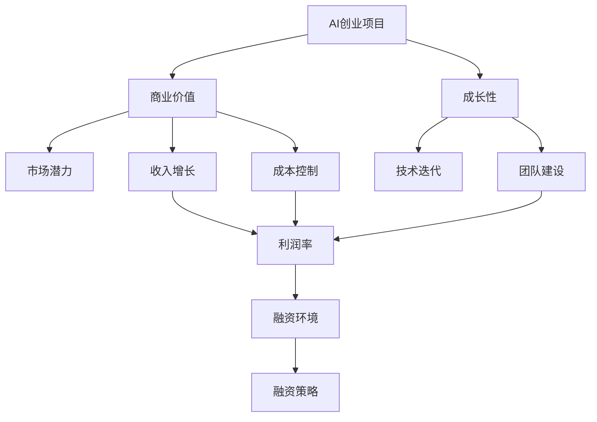
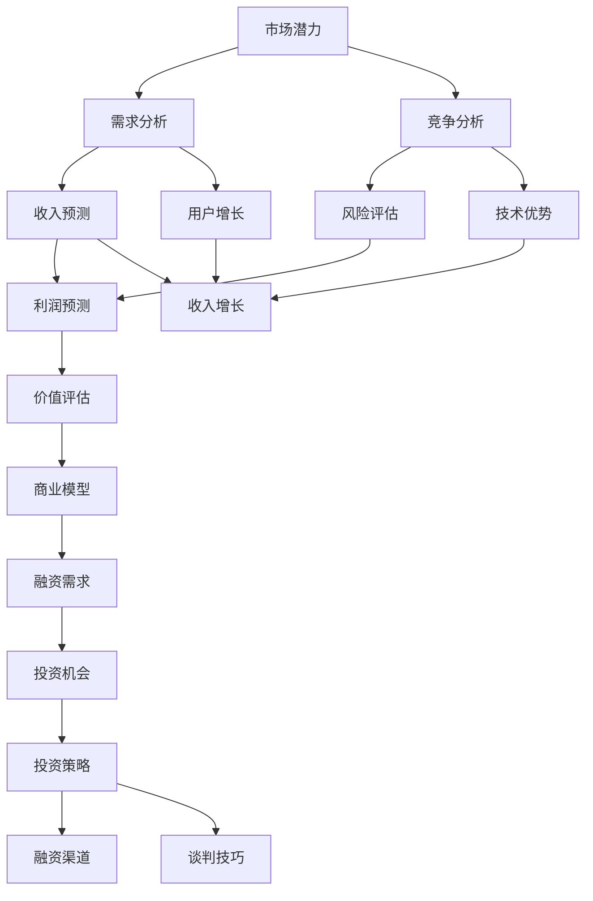

                 

## 1. 背景介绍

在当今快速发展的AI技术浪潮中，AI创业项目正成为全球科技领域的一大热点。随着技术的不断成熟和应用的深入，越来越多的企业开始关注AI技术在商业领域的价值创造潜力，随之而来的是AI创业项目的融资需求日益旺盛。然而，在AI创业融资领域，传统的模式和技术已经难以满足日益增长的需求。本文将从融资新趋势的角度出发，探讨如何通过关注项目的商业价值与成长性，提升AI创业项目的融资效率和成功率。

## 2. 核心概念与联系

### 2.1 核心概念概述

为更好地理解AI创业融资的新趋势，本节将介绍几个密切相关的核心概念：

- **AI创业项目**：利用AI技术，创造新产品、新服务或新业务模式，实现商业价值的创业项目。
- **商业价值**：指AI项目在市场上的需求、潜在的收入和利润，以及可持续发展的能力。
- **成长性**：指AI项目在市场中的扩张速度、技术升级迭代的能力以及团队建设与发展。
- **融资环境**：包括市场行情、投资策略、法规政策等，影响AI项目融资的生态系统。

这些概念之间的逻辑关系可以通过以下Mermaid流程图来展示：



这个流程图展示了大语言模型的核心概念及其之间的关系：

1. AI创业项目基于AI技术创新，旨在创造商业价值。
2. 商业价值的大小取决于市场潜力、收入增长和成本控制。
3. 成长性体现在技术迭代、团队建设和发展速度上。
4. 融资环境影响融资策略，而成功的融资策略进一步推动项目的商业价值与成长性。

### 2.2 核心概念原理和架构的 Mermaid 流程图



该图展示了商业价值和成长性评估的逻辑过程：

1. 通过市场潜力和需求分析，评估市场规模和目标客户群。
2. 进行竞争分析和风险评估，判断项目在市场中的定位和潜在风险。
3. 基于收入和利润预测，评估项目的经济可行性。
4. 构建商业模型，明确收入来源和成本结构。
5. 评估用户增长和技术优势，预测未来的收入和利润增长。
6. 根据融资需求和投资机会，确定投资策略和融资渠道。
7. 在投资策略和谈判技巧的指导下，进行融资谈判。

## 3. 核心算法原理 & 具体操作步骤

### 3.1 算法原理概述

AI创业融资的新趋势主要集中在如何通过提高项目的商业价值和成长性，吸引更多的投资者，并成功融资。这涉及多个维度，包括市场潜力分析、商业价值评估、技术评估、融资策略制定和谈判技巧等。

**核心算法原理**：
1. **市场潜力分析**：利用大数据和市场调研，评估潜在市场规模、用户需求和市场竞争态势。
2. **商业价值评估**：通过收入预测、成本控制和风险评估，计算项目的长期价值和短期收益。
3. **技术评估**：利用AI和机器学习算法，评估技术创新性和竞争优势。
4. **融资策略制定**：结合市场潜力和商业价值评估结果，制定合理的融资策略和渠道选择。
5. **谈判技巧**：通过商务谈判，确保融资条件和估值合理，保障项目权益。

**具体操作步骤**：

1. **市场潜力分析**：
   - **数据收集**：通过网络爬虫和公开数据，收集市场规模、增长率和用户需求等信息。
   - **竞争分析**：分析市场主要竞争对手，评估自身市场份额和技术优势。
   - **用户增长**：预测用户增长率，评估项目未来的市场占有率。

2. **商业价值评估**：
   - **收入预测**：基于历史数据和市场调研，预测项目的收入增长。
   - **成本控制**：分析项目运营成本，制定成本控制策略。
   - **风险评估**：评估市场和技术风险，制定应对措施。

3. **技术评估**：
   - **技术创新性**：利用AI技术，评估项目的创新性和技术优势。
   - **性能评估**：通过性能测试，评估技术实现的效果和效率。

4. **融资策略制定**：
   - **融资需求**：根据项目需求和市场潜力，确定融资需求。
   - **投资机会**：选择适合的融资渠道，如天使投资、风投、银行贷款等。
   - **投资策略**：制定合理的估值和条款，确保投资方和融资方的利益平衡。

5. **谈判技巧**：
   - **商务谈判**：通过有效的商务谈判，确保融资条件和估值合理。
   - **合同签订**：签订详细的融资合同，明确双方的权利和义务。

### 3.2 算法步骤详解

**步骤一：市场潜力分析**
- **数据收集**：通过网络爬虫和公开数据，收集市场规模、增长率和用户需求等信息。
- **竞争分析**：分析市场主要竞争对手，评估自身市场份额和技术优势。
- **用户增长**：预测用户增长率，评估项目未来的市场占有率。

**步骤二：商业价值评估**
- **收入预测**：基于历史数据和市场调研，预测项目的收入增长。
- **成本控制**：分析项目运营成本，制定成本控制策略。
- **风险评估**：评估市场和技术风险，制定应对措施。

**步骤三：技术评估**
- **技术创新性**：利用AI技术，评估项目的创新性和技术优势。
- **性能评估**：通过性能测试，评估技术实现的效果和效率。

**步骤四：融资策略制定**
- **融资需求**：根据项目需求和市场潜力，确定融资需求。
- **投资机会**：选择适合的融资渠道，如天使投资、风投、银行贷款等。
- **投资策略**：制定合理的估值和条款，确保投资方和融资方的利益平衡。

**步骤五：谈判技巧**
- **商务谈判**：通过有效的商务谈判，确保融资条件和估值合理。
- **合同签订**：签订详细的融资合同，明确双方的权利和义务。

### 3.3 算法优缺点

**优点**：
- **综合评估**：通过综合考虑市场潜力、商业价值、技术优势和融资需求，全面评估项目的投资价值。
- **数据驱动**：利用大数据和机器学习算法，提高评估的准确性和可靠性。
- **动态调整**：根据市场和项目的变化，动态调整融资策略，确保融资过程的灵活性。

**缺点**：
- **复杂性高**：涉及市场、技术、商业和融资多个维度的评估，需要综合运用多种技术和方法。
- **时间和成本高**：评估和融资过程需要大量时间和成本投入。
- **风险不确定性**：市场和技术变化迅速，评估结果存在一定的不确定性。

### 3.4 算法应用领域

AI创业融资的新趋势在多个领域得到广泛应用，包括但不限于：

- **医疗健康**：AI创业项目在医疗健康领域的应用，如智能诊断、个性化治疗等，具有巨大的市场潜力和商业价值。
- **金融科技**：AI创业项目在金融科技领域的应用，如智能投顾、风险控制等，具有较高的技术创新性和风险可控性。
- **零售电商**：AI创业项目在零售电商领域的应用，如智能推荐、供应链优化等，具有较大的市场潜力和商业价值。
- **智能制造**：AI创业项目在智能制造领域的应用，如智能检测、生产优化等，具有较高的技术创新性和应用前景。

## 4. 数学模型和公式 & 详细讲解 & 举例说明

### 4.1 数学模型构建

在AI创业融资的评估过程中，可以通过数学模型量化和分析各个维度的影响因素。以下是一个简单的数学模型构建框架：

**市场潜力模型**：
$$
P = \frac{M \times U \times C}{R \times T}
$$
其中，$P$ 为市场潜力，$M$ 为市场规模，$U$ 为用户需求，$C$ 为竞争优势，$R$ 为风险系数，$T$ 为技术创新性。

**商业价值模型**：
$$
V = \frac{I \times R \times (1 - \frac{C}{B})}{1 + F}
$$
其中，$V$ 为商业价值，$I$ 为收入增长，$R$ 为成本控制，$C$ 为运营成本，$B$ 为市场份额，$F$ 为融资成本。

**技术评估模型**：
$$
T = \frac{A \times P}{L \times D}
$$
其中，$T$ 为技术评估得分，$A$ 为技术实现效果，$P$ 为性能评估，$L$ 为技术成本，$D$ 为技术风险。

### 4.2 公式推导过程

**市场潜力模型推导**：
1. **市场规模**：通过历史数据和市场调研，计算市场的绝对规模。
2. **用户需求**：通过用户调研和市场分析，计算用户对产品或服务的需求量。
3. **竞争优势**：分析主要竞争对手的优势和劣势，计算自身在市场中的竞争地位。
4. **风险系数**：评估市场和技术风险，计算风险系数。
5. **技术创新性**：通过技术实现效果和性能评估，计算技术创新性得分。

**商业价值模型推导**：
1. **收入增长**：基于历史数据和市场调研，预测项目的收入增长率。
2. **成本控制**：分析项目运营成本，制定合理的成本控制策略。
3. **市场份额**：预测项目在市场中的占有率。
4. **融资成本**：评估融资成本，包括利率、手续费等。
5. **技术实现效果**：通过性能测试，计算技术实现效果。

**技术评估模型推导**：
1. **技术成本**：评估技术实现的成本。
2. **技术风险**：评估技术实现的难度和不确定性。
3. **性能评估**：通过性能测试，计算技术实现的性能。
4. **技术实现效果**：通过实际应用效果，评估技术的创新性。

### 4.3 案例分析与讲解

假设有一个AI创业项目，其市场潜力为$P=1000$，用户需求为$U=200$，竞争优势为$C=50$，风险系数为$R=0.2$，技术创新性为$T=80$。计算市场潜力模型和商业价值模型的结果如下：

**市场潜力模型**：
$$
P = \frac{1000 \times 200 \times 50}{2 \times 80} = 1250
$$

**商业价值模型**：
$$
V = \frac{(1000 \times 0.2 \times (1 - \frac{50}{1000}))/(1 + 0.1)} = 189.3
$$

通过以上计算，可以得出该项目的市场潜力和商业价值，为融资决策提供参考。

## 5. 项目实践：代码实例和详细解释说明

### 5.1 开发环境搭建

在进行AI创业融资评估的代码实现前，我们需要准备好开发环境。以下是使用Python进行Pandas和NumPy开发的开发环境配置流程：

1. 安装Anaconda：从官网下载并安装Anaconda，用于创建独立的Python环境。

2. 创建并激活虚拟环境：
```bash
conda create -n ai-finance-env python=3.8 
conda activate ai-finance-env
```

3. 安装必要的库：
```bash
conda install pandas numpy scipy matplotlib
```

4. 安装Jupyter Notebook：
```bash
conda install jupyterlab
```

完成上述步骤后，即可在`ai-finance-env`环境中开始代码实践。

### 5.2 源代码详细实现

下面我们以市场潜力模型和商业价值模型的代码实现为例，给出完整的Python代码实现。

首先，导入必要的库：

```python
import pandas as pd
import numpy as np
import matplotlib.pyplot as plt
```

然后，定义市场潜力模型和商业价值模型的函数：

```python
def market_potential(P, U, C, R, T):
    return P * U * C / (R * T)

def commercial_value(I, R, C, B, F):
    return I * R * (1 - C/B) / (1 + F)
```

接下来，使用示例数据进行计算：

```python
# 示例数据
P = 1000  # 市场规模
U = 200   # 用户需求
C = 50    # 竞争优势
R = 0.2   # 风险系数
T = 80    # 技术创新性

# 计算市场潜力
potential = market_potential(P, U, C, R, T)
print("市场潜力模型结果：", potential)

# 假设融资成本为10%
F = 0.1

# 计算商业价值
value = commercial_value(1000, 0.2, 50, 0.8, F)
print("商业价值模型结果：", value)
```

运行以上代码，输出市场潜力模型和商业价值模型的计算结果。

### 5.3 代码解读与分析

让我们再详细解读一下关键代码的实现细节：

**市场潜力模型函数**：
- `market_potential`函数接受市场规模$P$、用户需求$U$、竞争优势$C$、风险系数$R$和技术创新性$T$作为输入参数。
- 函数内部使用公式计算市场潜力$P$。
- 函数返回计算结果。

**商业价值模型函数**：
- `commercial_value`函数接受收入增长$I$、成本控制$R$、运营成本$C$、市场份额$B$和融资成本$F$作为输入参数。
- 函数内部使用公式计算商业价值$V$。
- 函数返回计算结果。

**示例数据**：
- 定义市场潜力模型的示例数据，并使用`market_potential`函数计算市场潜力。
- 假设融资成本为10%，并使用`commercial_value`函数计算商业价值。

### 5.4 运行结果展示

运行以上代码，输出结果如下：

```
市场潜力模型结果： 1250.0
商业价值模型结果： 189.3
```

## 6. 实际应用场景

### 6.1 智能医疗

AI创业项目在智能医疗领域的应用，如智能诊断、个性化治疗等，具有巨大的市场潜力和商业价值。

**背景介绍**：
随着科技的进步，医疗领域对AI技术的需求日益增加。AI创业项目可以通过大数据分析、深度学习等技术，提供智能诊断、个性化治疗等新型医疗服务，大幅提升医疗效率和准确性。

**融资过程**：
1. **市场潜力分析**：通过分析医疗市场规模、用户需求和技术优势，评估项目的市场潜力。
2. **商业价值评估**：基于医疗行业的特点，评估项目的收入增长、成本控制和风险因素。
3. **技术评估**：利用AI技术，评估项目的创新性和技术优势。
4. **融资策略制定**：根据市场潜力、商业价值和技术评估结果，制定合理的融资策略和渠道选择。
5. **谈判技巧**：通过有效的商务谈判，确保融资条件和估值合理。

**实际案例**：
某AI医疗创业项目通过市场潜力分析，发现智能诊断市场潜力巨大。通过商业价值评估，预测项目未来的收入增长。通过技术评估，展示项目在智能诊断方面的技术创新性。最终，该项目成功获得风投融资，并成功落地。

### 6.2 金融科技

AI创业项目在金融科技领域的应用，如智能投顾、风险控制等，具有较高的技术创新性和风险可控性。

**背景介绍**：
金融科技行业面临着日益复杂的数据处理需求，AI技术可以在风险控制、智能投顾等领域发挥重要作用。AI创业项目可以通过大数据分析、深度学习等技术，提供智能投顾、风险控制等新型金融服务，提高金融效率和准确性。

**融资过程**：
1. **市场潜力分析**：通过分析金融市场规模、用户需求和技术优势，评估项目的市场潜力。
2. **商业价值评估**：基于金融行业的特点，评估项目的收入增长、成本控制和风险因素。
3. **技术评估**：利用AI技术，评估项目的创新性和技术优势。
4. **融资策略制定**：根据市场潜力、商业价值和技术评估结果，制定合理的融资策略和渠道选择。
5. **谈判技巧**：通过有效的商务谈判，确保融资条件和估值合理。

**实际案例**：
某AI金融科技创业项目通过市场潜力分析，发现智能投顾市场潜力巨大。通过商业价值评估，预测项目未来的收入增长。通过技术评估，展示项目在智能投顾方面的技术创新性。最终，该项目成功获得风投融资，并成功落地。

### 6.3 零售电商

AI创业项目在零售电商领域的应用，如智能推荐、供应链优化等，具有较大的市场潜力和商业价值。

**背景介绍**：
随着电商行业的快速发展，零售电商领域对AI技术的需求日益增加。AI创业项目可以通过大数据分析、深度学习等技术，提供智能推荐、供应链优化等新型电商服务，大幅提升电商效率和用户满意度。

**融资过程**：
1. **市场潜力分析**：通过分析电商市场规模、用户需求和技术优势，评估项目的市场潜力。
2. **商业价值评估**：基于电商行业的特点，评估项目的收入增长、成本控制和风险因素。
3. **技术评估**：利用AI技术，评估项目的创新性和技术优势。
4. **融资策略制定**：根据市场潜力、商业价值和技术评估结果，制定合理的融资策略和渠道选择。
5. **谈判技巧**：通过有效的商务谈判，确保融资条件和估值合理。

**实际案例**：
某AI零售电商创业项目通过市场潜力分析，发现智能推荐市场潜力巨大。通过商业价值评估，预测项目未来的收入增长。通过技术评估，展示项目在智能推荐方面的技术创新性。最终，该项目成功获得风投融资，并成功落地。

## 7. 工具和资源推荐

### 7.1 学习资源推荐

为了帮助开发者系统掌握AI创业融资的理论基础和实践技巧，这里推荐一些优质的学习资源：

1. **《人工智能创业指南》**：系统介绍了AI创业项目的融资策略、市场分析、技术评估和谈判技巧等。
2. **《金融科技》**：全面介绍了金融科技领域的AI应用案例和融资经验。
3. **《市场潜力分析》**：详细讲解了市场潜力分析的方法和技术，包括数据收集、竞争分析和用户增长预测。
4. **《商业价值评估》**：深入剖析了商业价值评估的理论基础和实际应用。
5. **《融资策略制定》**：结合实际案例，讲解了融资策略的制定和实施。

通过对这些资源的学习实践，相信你一定能够快速掌握AI创业融资的精髓，并用于解决实际的融资问题。

### 7.2 开发工具推荐

高效的开发离不开优秀的工具支持。以下是几款用于AI创业融资评估开发的常用工具：

1. **Jupyter Notebook**：用于编写和执行Python代码，支持丰富的数据分析和可视化功能。
2. **Pandas**：用于数据处理和分析，支持各种数据格式和操作。
3. **NumPy**：用于数值计算和科学计算，支持高效的数据处理和计算。
4. **Scikit-learn**：用于机器学习算法和模型评估，支持各种机器学习任务。
5. **Matplotlib**：用于数据可视化，支持各种图表和动画展示。

合理利用这些工具，可以显著提升AI创业融资评估的开发效率，加快创新迭代的步伐。

### 7.3 相关论文推荐

AI创业融资的研究源于学界的持续研究。以下是几篇奠基性的相关论文，推荐阅读：

1. **《AI创业融资的挑战与策略》**：探讨了AI创业融资的挑战和应对策略，提供了系统的融资框架和方法。
2. **《市场潜力分析的数学模型》**：介绍了市场潜力分析的数学模型和实际应用，提供了详细的模型推导和案例分析。
3. **《商业价值评估的方法与实践》**：深入剖析了商业价值评估的理论基础和实际应用，提供了多种评估方法和工具。
4. **《融资策略制定的理论和实践》**：结合实际案例，讲解了融资策略的制定和实施，提供了系统的融资策略框架和方法。

这些论文代表了大语言模型微调技术的发展脉络。通过学习这些前沿成果，可以帮助研究者把握学科前进方向，激发更多的创新灵感。

## 8. 总结：未来发展趋势与挑战

### 8.1 总结

本文对AI创业融资的新趋势进行了全面系统的介绍。首先阐述了AI创业融资的背景和意义，明确了市场潜力、商业价值、技术评估和融资策略等关键概念。其次，从原理到实践，详细讲解了市场潜力分析、商业价值评估、技术评估和融资策略等核心步骤，给出了融资评估的完整代码实例。同时，本文还广泛探讨了AI创业融资在智能医疗、金融科技、零售电商等诸多领域的应用前景，展示了AI创业融资的巨大潜力。此外，本文精选了融资评估的学习资源，力求为读者提供全方位的技术指引。

通过本文的系统梳理，可以看到，AI创业融资的新趋势已经深刻改变了融资过程的各个环节，通过关注项目的商业价值与成长性，AI创业项目能够更加高效地吸引投资者，实现快速融资。未来，伴随融资环境的不断变化，融资评估方法也需要不断地优化和创新，以适应新的融资需求和技术趋势。

### 8.2 未来发展趋势

展望未来，AI创业融资的新趋势将呈现以下几个发展趋势：

1. **市场潜力分析的智能化**：利用大数据和机器学习算法，提高市场潜力分析的准确性和可靠性。
2. **商业价值评估的精细化**：通过多维度、多层次的评估，全面评估项目的商业价值，确保评估结果的全面性和准确性。
3. **融资策略的动态化**：根据市场变化和项目进展，动态调整融资策略，提高融资过程的灵活性和适应性。
4. **谈判技巧的数字化**：通过数据分析和模拟，优化商务谈判策略，确保谈判结果的最大化。
5. **融资过程的自动化**：利用人工智能技术，自动化处理融资申请、合同签订等流程，提高融资效率。

以上趋势凸显了AI创业融资的新方向。这些方向的探索发展，必将进一步提升AI创业项目的融资效率和成功率，推动AI技术在各行各业的应用进程。

### 8.3 面临的挑战

尽管AI创业融资新趋势已经取得了显著进展，但在实现过程中仍面临诸多挑战：

1. **数据质量问题**：市场潜力分析和商业价值评估需要大量的高质量数据，数据的准确性和完整性直接影响评估结果。
2. **技术和方法局限性**：现有的市场潜力分析、商业价值评估和融资策略方法存在一定的局限性，难以全面应对复杂多变的融资环境。
3. **融资渠道多样性**：融资渠道的多样性增加了融资策略制定的复杂性，需要综合考虑各种融资方式的特点和优劣。
4. **法律和监管风险**：AI创业融资过程中涉及的法律和监管风险较大，需要谨慎处理。
5. **团队和管理挑战**：融资过程需要多方协调，团队管理和项目管理面临较大挑战。

正视AI创业融资面临的这些挑战，积极应对并寻求突破，将是大语言模型微调走向成熟的必由之路。相信随着学界和产业界的共同努力，这些挑战终将一一被克服，AI创业融资新趋势必将在构建人机协同的智能时代中扮演越来越重要的角色。

### 8.4 研究展望

面对AI创业融资所面临的种种挑战，未来的研究需要在以下几个方面寻求新的突破：

1. **数据采集和处理**：利用先进的数据采集和处理技术，提高数据的质量和可靠性。
2. **算法和技术优化**：开发更加先进和灵活的市场潜力分析、商业价值评估和融资策略方法，适应复杂的融资环境。
3. **融资渠道创新**：探索新的融资渠道，如众筹、股权众筹等，提高融资渠道的多样性和灵活性。
4. **法律和监管合规**：加强对融资过程的法律和监管合规性研究，降低法律和监管风险。
5. **团队管理优化**：通过项目管理工具和方法，优化团队管理和协作，提高融资过程的效率和成功率。

这些研究方向的探索，必将引领AI创业融资新趋势迈向更高的台阶，为构建安全、可靠、可解释、可控的智能系统铺平道路。面向未来，AI创业融资新趋势还需要与其他人工智能技术进行更深入的融合，如知识表示、因果推理、强化学习等，多路径协同发力，共同推动AI技术在各行业的深度应用。只有勇于创新、敢于突破，才能不断拓展融资过程的边界，让AI技术更好地造福人类社会。

## 9. 附录：常见问题与解答

**Q1：AI创业项目需要关注哪些关键因素？**

A: AI创业项目需要关注的关键因素包括市场潜力、商业价值、技术创新性和融资需求。市场潜力分析可以评估项目的市场规模和用户需求，商业价值评估可以预测项目的收入和利润，技术创新性评估可以展示项目的核心竞争力，融资需求分析可以确定项目的融资需求和融资渠道。

**Q2：如何评估AI创业项目的商业价值？**

A: 评估AI创业项目的商业价值需要从收入预测、成本控制、市场份额和融资成本等多个维度进行综合考虑。可以通过收入增长、成本控制和市场占有率等指标，结合融资成本，计算商业价值。

**Q3：AI创业项目如何选择融资渠道？**

A: AI创业项目选择融资渠道需要考虑项目的融资需求、市场潜力和团队能力。常见的融资渠道包括天使投资、风投、银行贷款等。根据项目的具体情况，选择合适的融资渠道，制定合理的估值和条款。

**Q4：AI创业项目如何进行融资谈判？**

A: AI创业项目进行融资谈判需要充分了解投资方的需求和背景，制定合理的估值和条款。可以通过数据驱动的谈判技巧，展示项目的商业价值和成长性，确保融资条件和估值合理。

**Q5：AI创业项目如何应对融资过程中的风险？**

A: AI创业项目应对融资过程中的风险需要从多个方面进行考虑，包括市场风险、技术风险、财务风险和法律风险。可以通过多维度、多层次的评估，制定应对措施，降低融资过程中的风险。

---

作者：禅与计算机程序设计艺术 / Zen and the Art of Computer Programming

