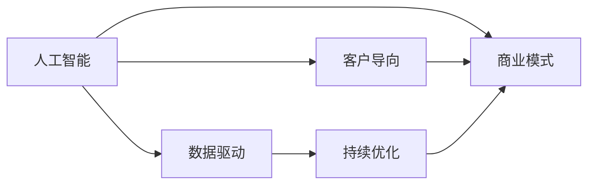

                 

# AI创业：商业模式的分析

## 1. 背景介绍

在当今信息时代，人工智能（AI）已经成为推动各行各业变革的重要力量。从智能客服到自动驾驶，从智能推荐到医疗诊断，AI的应用范围不断扩展。然而，尽管AI技术本身发展迅猛，但将其转化为商业成功的商业模式仍然是一个复杂的挑战。本文将从AI创业的角度出发，探讨AI商业模式的分析与构建，帮助读者理解如何在AI领域中创造商业价值。

## 2. 核心概念与联系

### 2.1 核心概念概述

- **人工智能（AI）**：使用算法、模型和数据集来模拟人类智能过程的技术，包括机器学习、深度学习、自然语言处理等。
- **商业模式（Business Model）**：公司如何创造、交付和捕获价值的方式，包括价值主张、价值架构、渠道、客户关系和收入模式等。
- **AI创业（AI Startup）**：基于AI技术开展创业活动，旨在通过技术创新创造商业价值。
- **数据驱动（Data-Driven）**：决策和运营基于大量数据的分析和洞察，而非直觉或经验。
- **客户导向（Customer-Centric）**：以客户需求和体验为中心，提供满足客户期望的产品和服务。
- **持续优化（Continuous Optimization）**：通过不断的反馈和迭代，不断提升产品和服务的效果。

### 2.2 核心概念原理和架构的 Mermaid 流程图



## 3. 核心算法原理 & 具体操作步骤

### 3.1 算法原理概述

AI创业的商业模式分析需要从数据驱动、客户导向和持续优化三个维度进行深入探讨。数据驱动确保商业决策基于可靠的洞察；客户导向确保产品和服务能够满足市场需求；持续优化则确保产品在市场竞争中保持领先地位。

### 3.2 算法步骤详解

1. **数据收集与分析**：收集与业务相关的数据，如用户行为数据、市场趋势数据、竞争对手数据等，使用统计分析、机器学习等方法进行分析。
2. **客户需求分析**：通过问卷调查、用户访谈、市场研究等手段，深入了解客户需求和痛点。
3. **产品设计与开发**：基于数据分析和客户需求，设计满足客户需求的产品原型，进行开发和测试。
4. **市场验证与迭代**：通过小规模试点或最小可行性产品（MVP）进行市场验证，收集反馈，进行产品迭代和优化。
5. **商业化与扩展**：成功验证产品后，进行商业化运作，通过市场营销、合作伙伴关系等方式扩大市场份额。

### 3.3 算法优缺点

- **优点**：数据驱动确保决策的科学性和可靠性；客户导向确保产品与市场需求高度匹配；持续优化保证产品竞争力和客户满意度。
- **缺点**：数据收集和分析成本较高；客户需求分析需要大量的时间和资源；市场验证和产品迭代周期较长。

### 3.4 算法应用领域

AI创业的商业模式分析适用于多个领域，包括但不限于：

- **医疗保健**：通过数据分析和机器学习，提供个性化医疗服务，如精准医疗、智能诊断等。
- **金融科技**：利用AI技术进行风险评估、信用评分、智能投顾等，提升金融服务效率和安全性。
- **零售电商**：通过推荐系统、供应链优化等AI应用，提升用户体验和运营效率。
- **智能制造**：通过AI技术进行质量控制、预测性维护、智能仓储等，提升生产效率和产品质量。

## 4. 数学模型和公式 & 详细讲解 & 举例说明

### 4.1 数学模型构建

**价值主张（Value Proposition）**：
$$
VP = \sum_{i} \alpha_i * F_i
$$
其中，$\alpha_i$为不同功能的重要性系数，$F_i$为功能的实现程度。

**客户获取成本（Customer Acquisition Cost, CAC）**：
$$
CAC = \frac{\text{Total Acquisition Cost}}{\text{Number of Acquired Customers}}
$$
其中，Total Acquisition Cost包括营销费用、销售费用、转化成本等。

**生命周期价值（Customer Lifetime Value, CLV）**：
$$
CLV = \frac{\sum_{i} F_i}{RFR}
$$
其中，$F_i$为每次交互的价值，$RFR$为复利因子。

### 4.2 公式推导过程

以金融科技领域为例，推导客户获取成本和生命周期价值的公式：

1. **客户获取成本（CAC）**：
$$
CAC = \frac{Ad + Se + Co}{N_a}
$$
其中，$Ad$为广告费用，$Se$为销售人员工资，$Co$为每次转化的固定成本，$N_a$为获取新客户的数量。

2. **生命周期价值（CLV）**：
$$
CLV = \frac{F_1 + F_2 + F_3 + ...}{1 + RFR}
$$
其中，$F_i$为第$i$次交互的价值，$RFR$为复利因子，如年利率。

### 4.3 案例分析与讲解

某金融科技公司通过数据分析发现，客户获取成本为100元，每次交互的价值为20元。假设复利因子为0.08（年利率8%），计算客户生命周期价值：
$$
CLV = \frac{20 + 20 \times 1.08 + 20 \times 1.08^2 + ...}{1 + 0.08}
$$
使用等比数列求和公式计算CLV：
$$
CLV = \frac{20}{1.08} \div 0.08 = \frac{20}{0.08} = 250
$$

## 5. 项目实践：代码实例和详细解释说明

### 5.1 开发环境搭建

- **Python**：安装Python 3.8及以上版本。
- **Pandas**：用于数据处理和分析。
- **Scikit-learn**：用于机器学习算法实现。
- **TensorFlow/Keras**：用于深度学习模型开发。
- **Jupyter Notebook**：交互式数据科学平台，方便数据探索和模型验证。

### 5.2 源代码详细实现

以下是一个使用TensorFlow进行机器学习模型开发的示例代码：

```python
import tensorflow as tf
from sklearn.datasets import load_iris
from sklearn.model_selection import train_test_split
from sklearn.preprocessing import StandardScaler

# 加载Iris数据集
iris = load_iris()
X_train, X_test, y_train, y_test = train_test_split(iris.data, iris.target, test_size=0.2)

# 数据标准化
scaler = StandardScaler()
X_train = scaler.fit_transform(X_train)
X_test = scaler.transform(X_test)

# 定义模型
model = tf.keras.Sequential([
    tf.keras.layers.Dense(64, activation='relu', input_shape=(4,)),
    tf.keras.layers.Dense(64, activation='relu'),
    tf.keras.layers.Dense(3, activation='softmax')
])

# 编译模型
model.compile(optimizer='adam', loss='sparse_categorical_crossentropy', metrics=['accuracy'])

# 训练模型
model.fit(X_train, y_train, epochs=50, batch_size=32, validation_data=(X_test, y_test))

# 评估模型
model.evaluate(X_test, y_test)
```

### 5.3 代码解读与分析

上述代码展示了使用TensorFlow构建和训练一个简单的分类模型的过程。首先，加载Iris数据集并进行标准化处理。然后，定义包含两个隐藏层的神经网络模型，并编译模型。最后，训练模型并评估其性能。

## 6. 实际应用场景

### 6.1 医疗保健

AI在医疗保健领域的应用非常广泛，包括智能诊断、个性化治疗、药物研发等。例如，IBM的Watson Health平台通过自然语言处理和机器学习技术，为医生提供基于海量医学文献的诊断建议，提升诊断准确率和效率。

### 6.2 金融科技

金融科技公司利用AI进行风险评估、信用评分、智能投顾等，如Riskified使用AI技术进行信用卡欺诈检测，提升欺诈检测的准确性和效率。

### 6.3 零售电商

电商企业通过推荐系统、供应链优化等AI应用，提升用户体验和运营效率。如Amazon的推荐系统，通过分析用户行为和购买历史，提供个性化的商品推荐，增加用户购买率和满意度。

### 6.4 智能制造

智能制造通过AI技术进行质量控制、预测性维护、智能仓储等，提升生产效率和产品质量。如Siemens的Mindsphere平台，通过机器学习和大数据分析，实现设备的预测性维护和智能仓储管理。

## 7. 工具和资源推荐

### 7.1 学习资源推荐

1. **《深度学习》（Ian Goodfellow等著）**：全面介绍深度学习理论和算法，适合初学者和进阶读者。
2. **Coursera《机器学习》课程**：由斯坦福大学Andrew Ng教授主讲，涵盖机器学习基础和实践。
3. **Kaggle**：数据科学竞赛平台，提供丰富的数据集和比赛，适合实践和提升技能。
4. **GitHub**：开源代码库，可以找到大量高质量的AI项目和代码实现。
5. **Medium**：技术文章分享平台，涵盖AI领域的最新研究和实践经验。

### 7.2 开发工具推荐

1. **Jupyter Notebook**：交互式数据科学平台，方便数据探索和模型验证。
2. **TensorFlow**：Google开发的深度学习框架，支持分布式计算和高效训练。
3. **PyTorch**：Facebook开发的深度学习框架，支持动态图和高效的GPU计算。
4. **HuggingFace Transformers**：基于Transformer架构的NLP库，提供预训练模型和API接口。
5. **Azure Machine Learning**：微软提供的云端机器学习平台，支持模型训练、部署和管理。

### 7.3 相关论文推荐

1. **《深度学习》（Ian Goodfellow等著）**：介绍深度学习的基本理论和算法，适合理论学习。
2. **《机器学习实战》（Peter Harrington著）**：基于Python实现的机器学习项目，适合实践操作。
3. **《人工智能：一种现代方法》（Stuart Russell和Peter Norvig著）**：全面介绍AI理论和应用，适合深入学习。
4. **《TensorFlow 2.0实战》（书生·浦语著）**：介绍TensorFlow 2.0的实战应用，适合快速上手。
5. **《Python深度学习》（Francois Chollet著）**：基于Keras实现的深度学习项目，适合实践操作。

## 8. 总结：未来发展趋势与挑战

### 8.1 研究成果总结

AI创业的商业模式分析需要结合数据驱动、客户导向和持续优化三个方面，通过科学决策和迭代优化，实现商业价值最大化。AI技术的应用范围不断扩展，市场潜力巨大。

### 8.2 未来发展趋势

1. **AI技术普及化**：AI技术将逐渐普及到各行各业，成为商业创新和升级的重要工具。
2. **数据驱动决策**：数据驱动决策将成为企业决策的主要方式，帮助企业更好地理解市场和客户需求。
3. **客户导向创新**：客户导向的创新将推动企业产品和服务不断优化，提升客户满意度和忠诚度。
4. **持续优化迭代**：持续优化和迭代将成为企业提升竞争力的重要手段，帮助企业保持市场领先地位。

### 8.3 面临的挑战

1. **数据隐私和安全**：AI技术的应用需要大量数据，但数据隐私和安全问题需引起重视。
2. **技术落地难度**：AI技术的复杂性和高成本可能阻碍其在部分行业的落地应用。
3. **伦理和社会责任**：AI技术的广泛应用可能带来伦理和社会责任问题，需要严格监管和引导。
4. **跨领域融合**：AI技术需要与不同领域的专业知识结合，才能实现真正的价值。

### 8.4 研究展望

未来，AI创业的商业模式分析将更多关注数据隐私、伦理和社会责任等关键问题。同时，随着AI技术的不断进步，AI创业将迎来更多的机遇和挑战。

## 9. 附录：常见问题与解答

**Q1: AI创业的商业模式分析需要哪些步骤？**

A: 1. 数据收集与分析 2. 客户需求分析 3. 产品设计与开发 4. 市场验证与迭代 5. 商业化与扩展。

**Q2: 如何使用TensorFlow构建深度学习模型？**

A: 1. 导入TensorFlow库 2. 加载数据集 3. 定义模型结构 4. 编译模型 5. 训练模型 6. 评估模型。

**Q3: AI创业面临的主要挑战是什么？**

A: 1. 数据隐私和安全 2. 技术落地难度 3. 伦理和社会责任 4. 跨领域融合。

**Q4: 如何提升AI创业的商业价值？**

A: 1. 数据驱动决策 2. 客户导向创新 3. 持续优化迭代 4. 强化技术应用。

---

作者：禅与计算机程序设计艺术 / Zen and the Art of Computer Programming

