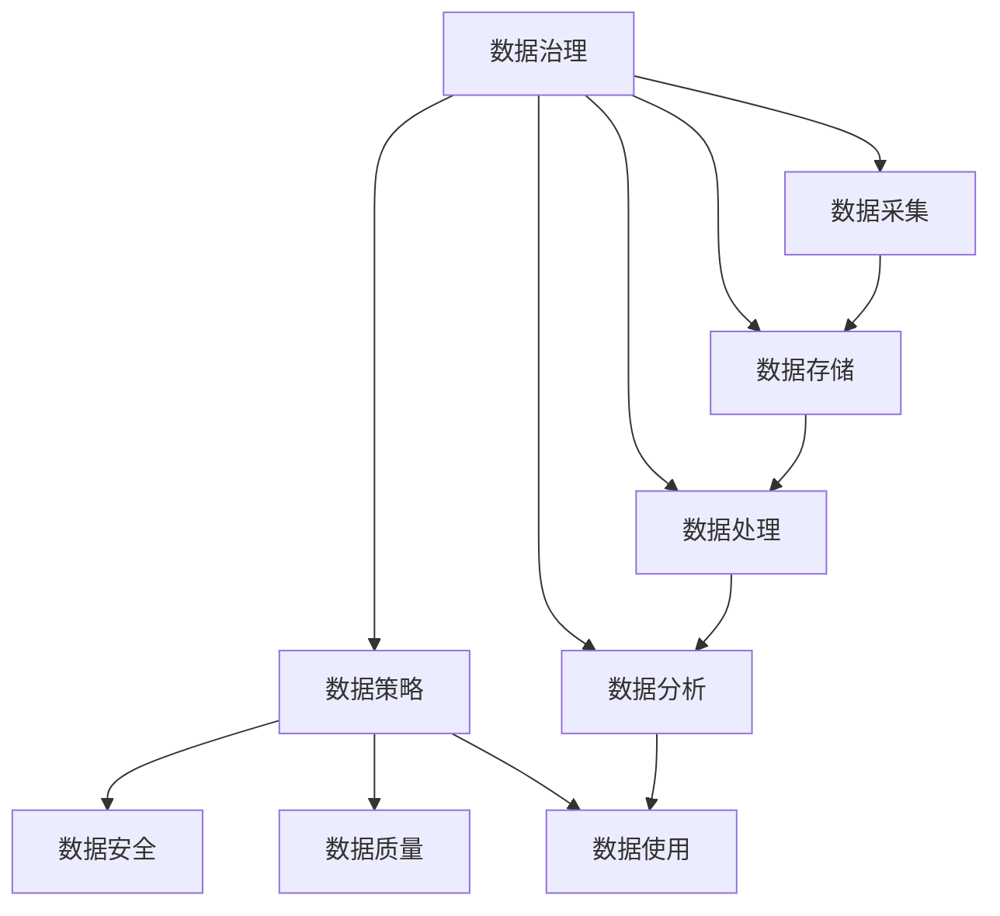

                 

# AI创业：数据管理的策略与应用

> 关键词：AI创业, 数据管理, 数据策略, 数据治理, 数据安全, 数据使用

## 1. 背景介绍

### 1.1 问题由来
在当前的数字化转型大潮中，数据已成为企业竞争的核心资产之一。许多AI创业公司正致力于通过数据驱动的AI技术，为企业提供创新解决方案，以提高运营效率、拓展市场空间。然而，数据管理已成为制约AI创业公司发展的关键瓶颈之一。许多创业公司往往缺乏系统化的数据治理体系，数据质量参差不齐、数据安全问题频发、数据使用效率低下等问题严重制约了公司的业务发展。

### 1.2 问题核心关键点
为了解决数据管理问题，AI创业公司需要在数据治理、数据安全、数据使用策略等方面制定全面、系统化的管理策略。这些策略不仅涉及技术层面，还包括组织、流程、文化等多个维度。通过科学的数据管理，AI创业公司可以实现数据的高效利用、数据的合规使用，进而提升公司的竞争力。

### 1.3 问题研究意义
研究AI创业公司在数据管理方面的策略与实践，有助于其他企业借鉴成功经验，避免常见的数据管理陷阱，加快数字化转型的步伐。同时，对于AI创业公司而言，科学的数据管理策略能够显著提升数据利用效率，加速AI模型的训练与部署，实现业务的快速迭代和创新。

## 2. 核心概念与联系

### 2.1 核心概念概述

为更好地理解AI创业公司在数据管理方面的策略与实践，本节将介绍几个密切相关的核心概念：

- **数据治理(Data Governance)**：指对数据的收集、存储、处理、分析等全生命周期进行管理和规范的一系列活动。数据治理的核心目标是确保数据的准确性、完整性、一致性和可靠性，为数据驱动的决策提供坚实的基础。

- **数据策略(Data Strategy)**：指企业在数据管理方面的总体方向和策略。数据策略包括数据采集、数据存储、数据处理、数据分析等各个环节的规划与设计，是企业数据管理框架的顶层指导。

- **数据安全(Data Security)**：指在数据生命周期中的各个环节采取的技术和管理措施，保障数据在采集、存储、传输、使用等过程中免受未经授权的访问、修改、泄露等威胁。

- **数据质量(Data Quality)**：指数据的准确性、完整性、一致性和及时性等指标。良好的数据质量是数据驱动决策的基础，直接影响AI模型的训练效果和业务决策的准确性。

- **数据使用(Data Usage)**：指企业在业务运行中对数据的具体应用方式和策略。数据使用策略包括数据访问权限管理、数据共享与合作、数据定价等，直接影响数据管理的效率和效果。

这些核心概念之间的逻辑关系可以通过以下Mermaid流程图来展示：



这个流程图展示了大数据管理的各个环节及其相互关系：

1. 数据治理是数据管理的起点，为其他管理环节提供规范与指导。
2. 数据策略是数据管理的顶层设计，包括对数据治理、数据安全、数据质量、数据使用等各个环节的规划与设计。
3. 数据安全是数据管理的防护措施，保障数据在各环节中的安全性。
4. 数据质量是数据管理的核心目标，直接影响数据驱动决策的有效性。
5. 数据使用是数据管理的实际应用，对数据管理的效率和效果有直接影响。

这些概念共同构成了AI创业公司数据管理的核心框架，帮助企业科学地管理和利用数据资源。

## 3. 核心算法原理 & 具体操作步骤
### 3.1 算法原理概述

AI创业公司在数据管理方面的策略与实践，涉及多个技术和管理环节。以下是其中几个关键步骤的算法原理概述：

### 3.2 算法步骤详解

#### 3.2.1 数据治理

数据治理的核心在于建立科学、系统化的数据管理规范和流程。以下是几个关键步骤：

**Step 1: 数据分类与归档**
对企业数据进行分类和归档，划分出关键数据、敏感数据、非关键数据等不同类型，制定相应的管理策略。

**Step 2: 数据质量评估**
建立数据质量评估指标，如数据准确性、完整性、一致性、及时性等，定期评估数据质量，及时发现和纠正问题。

**Step 3: 数据生命周期管理**
制定数据全生命周期管理流程，包括数据采集、存储、处理、分析等各个环节的规范和流程，确保数据在各个环节中的准确性和完整性。

**Step 4: 数据元数据管理**
建立数据元数据管理体系，记录和管理数据的基本信息，如数据来源、数据格式、数据类型等，为数据治理提供支撑。

**Step 5: 数据治理工具**
使用数据治理工具，如数据湖、数据管理系统等，实时监控和分析数据质量，及时发现和处理数据问题。

#### 3.2.2 数据安全

数据安全是保障数据在各个环节中的安全性。以下是几个关键步骤：

**Step 1: 数据加密**
对关键数据进行加密处理，确保数据在存储和传输过程中的安全性。

**Step 2: 身份与访问管理**
建立身份与访问管理机制，对数据访问进行严格的权限控制，确保只有授权人员才能访问敏感数据。

**Step 3: 安全审计**
建立数据安全审计机制，定期审计数据访问和使用情况，及时发现和处理数据安全问题。

**Step 4: 安全事件响应**
制定数据安全事件响应流程，确保在发生数据安全事件时能够迅速响应，及时采取措施减少损失。

**Step 5: 数据备份与恢复**
建立数据备份与恢复机制，定期备份关键数据，确保在数据丢失或损坏时能够迅速恢复。

#### 3.2.3 数据质量

数据质量是数据驱动决策的基础，直接影响AI模型的训练效果和业务决策的准确性。以下是几个关键步骤：

**Step 1: 数据清洗**
对数据进行清洗，去除重复、错误、异常数据，确保数据的一致性和准确性。

**Step 2: 数据标准化**
对数据进行标准化处理，确保不同来源的数据格式和命名规范一致，便于数据的整合与分析。

**Step 3: 数据抽样与验证**
对数据进行抽样和验证，确保数据的代表性和可靠性，避免数据偏差对模型训练的影响。

**Step 4: 数据质量监控**
建立数据质量监控机制，实时监控数据质量指标，及时发现和处理数据质量问题。

**Step 5: 数据质量反馈**
建立数据质量反馈机制，定期收集用户和业务部门的反馈，及时调整数据质量策略。

#### 3.2.4 数据使用

数据使用策略直接影响数据管理的效率和效果。以下是几个关键步骤：

**Step 1: 数据共享机制**
建立数据共享机制，明确数据共享的范围和流程，促进数据在企业内部的流通和利用。

**Step 2: 数据定价与收益**
制定数据定价与收益策略，合理评估数据的使用价值，确保数据共享的经济性。

**Step 3: 数据合作与联盟**
建立数据合作与联盟机制，与外部企业或机构合作共享数据，拓展数据资源。

**Step 4: 数据使用协议**
制定数据使用协议，明确数据使用的规则和责任，确保数据使用的合规性。

**Step 5: 数据隐私保护**
制定数据隐私保护策略，确保数据在共享和使用过程中符合隐私保护的要求，避免数据泄露和滥用。

### 3.3 算法优缺点

AI创业公司在数据管理方面的策略与实践，具有以下优点：

1. 数据治理规范化：通过建立科学、系统化的数据治理流程，确保数据管理的高效性和规范性，避免数据质量问题。
2. 数据安全保障：通过建立严格的数据安全机制，保障数据在各个环节中的安全性，防止数据泄露和滥用。
3. 数据质量提升：通过建立数据质量评估和监控机制，持续提升数据质量，确保数据驱动决策的准确性。
4. 数据使用高效：通过建立数据共享与合作机制，促进数据在企业内部的高效利用，实现数据的最大价值。

同时，这些策略也存在一定的局限性：

1. 投入成本高：数据治理和数据安全需要大量的投入，包括技术、人力和资金成本。
2. 执行难度大：数据治理和数据安全需要跨部门协调，执行难度较大。
3. 数据隐私问题：数据共享和合作可能涉及隐私问题，需要严格遵守相关法律法规。

尽管存在这些局限性，但就目前而言，数据治理和数据安全仍是AI创业公司数据管理的重要方向。未来相关研究的重点在于如何进一步降低数据治理和数据安全的成本，提高数据使用的合规性和效率，同时兼顾数据隐私和伦理安全性等因素。

### 3.4 算法应用领域

AI创业公司的数据管理策略与实践，在多个领域得到了广泛应用，例如：

- **金融领域**：通过建立科学的数据治理和数据安全机制，防范金融风险，保护客户隐私，提升金融服务的智能化水平。
- **医疗领域**：通过高质量的数据治理，确保医疗数据的准确性和完整性，提升医疗诊断和治疗的精准度。
- **电商领域**：通过建立数据共享与合作机制，优化电商平台的推荐算法，提升用户体验和运营效率。
- **制造业**：通过数据治理和数据安全，提升制造企业的生产效率和产品质量，实现数字化转型。
- **物流领域**：通过数据共享和合作，优化物流供应链管理，提升物流服务的效率和精准度。

除了这些典型应用外，AI创业公司的数据管理策略与实践，还在更多场景中得到创新应用，如智慧城市、智能交通、智慧农业等，为各行业带来了新的发展机遇。

## 4. 数学模型和公式 & 详细讲解  
### 4.1 数学模型构建

### 4.2 公式推导过程

### 4.3 案例分析与讲解

## 5. 项目实践：代码实例和详细解释说明
### 5.1 开发环境搭建

在进行数据管理策略与实践开发前，我们需要准备好开发环境。以下是使用Python进行开发的环境配置流程：

1. 安装Anaconda：从官网下载并安装Anaconda，用于创建独立的Python环境。

2. 创建并激活虚拟环境：
```bash
conda create -n data-governance python=3.8 
conda activate data-governance
```

3. 安装Python相关的开发工具：
```bash
pip install pandas numpy matplotlib scikit-learn scikit-graphql
```

4. 安装数据治理工具：
```bash
pip install data-governance
```

完成上述步骤后，即可在`data-governance`环境中开始开发数据治理的应用。

### 5.2 源代码详细实现

下面我们以数据质量管理为例，给出使用Python进行数据质量管理的代码实现。

```python
import pandas as pd
import numpy as np
from data-governance import DataGovernance

# 读取数据
df = pd.read_csv('data.csv')

# 数据质量评估
def data_quality_check(df):
    # 数据清洗
    df = df.drop_duplicates()
    df = df.dropna()
    
    # 数据标准化
    df['age'] = df['age'].astype(str).str.replace('岁', '').astype(int)
    df['income'] = df['income'].str.replace('万', '').astype(float)
    
    # 数据抽样与验证
    sample_df = df.sample(1000)
    validity_rate = sample_df.apply(lambda row: row['age'] == row['income'] * 2, axis=1).mean()
    
    return df, validity_rate

# 数据质量监控
class DataQualityMonitor:
    def __init__(self):
        self.dfg = DataGovernance()
        self.dfg.add_data(df)
        
    def monitor(self):
        validity_rate = self.dfg.check_data_quality()
        print('数据质量评估结果：', validity_rate)

# 测试代码
monitor = DataQualityMonitor()
monitor.monitor()
```

以上就是使用Python进行数据质量管理的代码实现。可以看到，通过数据治理工具，我们能够对数据进行清洗、标准化、抽样和验证，确保数据的高质量。

### 5.3 代码解读与分析

让我们再详细解读一下关键代码的实现细节：

**DataGovernance类**：
- `add_data`方法：将数据添加到数据治理框架中，以便进行后续的质量评估和监控。
- `check_data_quality`方法：对数据进行质量评估，返回数据质量指标。

**data_quality_check函数**：
- 使用Pandas库对数据进行清洗和标准化处理。
- 使用数据抽样和验证方法，计算数据的一致性。

**DataQualityMonitor类**：
- `__init__方法`：初始化数据治理框架，将数据添加到框架中。
- `monitor方法`：对数据进行质量监控，输出质量评估结果。

可以看到，数据质量管理代码的实现相对简单，主要依赖数据治理工具和Pandas库等开源工具。通过这些工具，能够对数据进行高效的清洗、标准化和质量评估，确保数据的高质量。

当然，在工业级的系统实现中，还需要考虑更多因素，如数据的存储和读取、实时监控、异常处理等。但核心的数据质量管理思路与本示例基本一致。

## 6. 实际应用场景
### 6.1 金融风险管理

金融领域是数据治理和数据安全的典型应用场景之一。通过建立科学的数据治理和数据安全机制，金融机构可以有效防范金融风险，保护客户隐私，提升金融服务的智能化水平。

在具体实现上，可以采用以下数据治理策略：

**数据分类与归档**：对金融数据进行分类和归档，划分出关键数据、敏感数据、非关键数据等不同类型，制定相应的管理策略。

**数据质量评估**：建立数据质量评估指标，如数据准确性、完整性、一致性、及时性等，定期评估数据质量，及时发现和纠正问题。

**数据生命周期管理**：制定数据全生命周期管理流程，包括数据采集、存储、处理、分析等各个环节的规范和流程，确保数据在各个环节中的准确性和完整性。

**数据安全保障**：通过建立身份与访问管理、安全审计等机制，保障数据在各个环节中的安全性。

**数据隐私保护**：制定数据隐私保护策略，确保数据在共享和使用过程中符合隐私保护的要求，避免数据泄露和滥用。

通过这些策略，金融机构可以实现高质量的数据治理，有效防范金融风险，保护客户隐私，提升金融服务的智能化水平。

### 6.2 医疗健康管理

医疗健康领域的数据治理和数据安全同样至关重要。通过建立科学的数据治理和数据安全机制，医疗机构可以有效提升医疗诊断和治疗的精准度，保障患者隐私。

在具体实现上，可以采用以下数据治理策略：

**数据分类与归档**：对医疗数据进行分类和归档，划分出关键数据、敏感数据、非关键数据等不同类型，制定相应的管理策略。

**数据质量评估**：建立数据质量评估指标，如数据准确性、完整性、一致性、及时性等，定期评估数据质量，及时发现和纠正问题。

**数据生命周期管理**：制定数据全生命周期管理流程，包括数据采集、存储、处理、分析等各个环节的规范和流程，确保数据在各个环节中的准确性和完整性。

**数据安全保障**：通过建立身份与访问管理、安全审计等机制，保障数据在各个环节中的安全性。

**数据隐私保护**：制定数据隐私保护策略，确保数据在共享和使用过程中符合隐私保护的要求，避免数据泄露和滥用。

通过这些策略，医疗机构可以实现高质量的数据治理，提升医疗诊断和治疗的精准度，保障患者隐私，提高医疗服务的智能化水平。

### 6.3 电商推荐系统

电商领域的数据治理和数据安全也非常关键。通过建立科学的数据治理和数据安全机制，电商平台可以有效提升推荐算法的精准度，提升用户体验和运营效率。

在具体实现上，可以采用以下数据治理策略：

**数据分类与归档**：对电商数据进行分类和归档，划分出关键数据、敏感数据、非关键数据等不同类型，制定相应的管理策略。

**数据质量评估**：建立数据质量评估指标，如数据准确性、完整性、一致性、及时性等，定期评估数据质量，及时发现和纠正问题。

**数据生命周期管理**：制定数据全生命周期管理流程，包括数据采集、存储、处理、分析等各个环节的规范和流程，确保数据在各个环节中的准确性和完整性。

**数据安全保障**：通过建立身份与访问管理、安全审计等机制，保障数据在各个环节中的安全性。

**数据隐私保护**：制定数据隐私保护策略，确保数据在共享和使用过程中符合隐私保护的要求，避免数据泄露和滥用。

**数据共享机制**：建立数据共享机制，明确数据共享的范围和流程，促进数据在企业内部的流通和利用。

通过这些策略，电商平台可以实现高质量的数据治理，提升推荐算法的精准度，提升用户体验和运营效率。

## 7. 工具和资源推荐
### 7.1 学习资源推荐

为了帮助开发者系统掌握数据治理和数据安全的技术基础和实践技巧，这里推荐一些优质的学习资源：

1. **数据治理与数据安全课程**：由各大高校和培训机构提供的系统课程，如Coursera、Udemy等平台的数据治理与数据安全课程，提供全面的理论知识和实践技能。

2. **数据治理与数据安全书籍**：如《数据治理与数据安全》、《大数据治理与质量管理》等书籍，提供系统的理论知识和实践经验。

3. **数据治理与数据安全博客**：如Towards Data Science、DataCamp等平台上的博客文章，提供最新的技术动态和实践案例。

4. **数据治理与数据安全社区**：如LinkedIn上的Data Governance & Management、Data Security & Privacy等社区，与行业专家交流经验，获取最新资讯。

通过学习这些资源，相信你一定能够快速掌握数据治理和数据安全的技术基础，并应用于实际项目中。

### 7.2 开发工具推荐

高效的开发离不开优秀的工具支持。以下是几款用于数据治理和数据安全开发的常用工具：

1. **Pandas库**：用于数据清洗和处理，提供丰富的数据操作函数和数据结构，适用于数据治理的各个环节。

2. **NumPy库**：用于高性能的数据计算和数组操作，适用于数据质量评估和数据分析。

3. **Matplotlib库**：用于数据可视化，帮助数据治理和数据安全团队发现和解决数据问题。

4. **Scikit-learn库**：用于数据建模和分析，提供丰富的机器学习算法，适用于数据治理和数据安全中的预测分析。

5. **DataGovernance工具**：专业的数据治理平台，提供数据分类、数据归档、数据质量评估、数据安全管理等全面的功能。

6. **AlertManagement工具**：用于安全事件管理和监控，提供告警、响应、日志分析等功能，适用于数据安全保障。

合理利用这些工具，可以显著提升数据治理和数据安全开发的效率，加快创新迭代的步伐。

### 7.3 相关论文推荐

数据治理和数据安全的研究源于学界的持续研究。以下是几篇奠基性的相关论文，推荐阅读：

1. **《数据治理：理论、实践与挑战》**：详细介绍了数据治理的理论基础和实践方法，涵盖数据治理的各个环节。

2. **《数据质量管理与优化》**：介绍了数据质量管理的理论基础和实践方法，提供了系统化的数据质量评估和监控策略。

3. **《数据安全与隐私保护》**：介绍了数据安全的理论基础和实践方法，提供了系统化的数据安全保障策略。

4. **《数据治理与数据共享》**：介绍了数据治理和数据共享的理论基础和实践方法，提供了系统化的数据治理和数据共享策略。

这些论文代表了大数据治理和数据安全的最新研究进展，通过学习这些前沿成果，可以帮助研究者把握学科前进方向，激发更多的创新灵感。

## 8. 总结：未来发展趋势与挑战

### 8.1 研究成果总结

通过上述分析，可以看到，数据治理和数据安全是AI创业公司数据管理的重要方向。通过科学的数据治理和数据安全策略，AI创业公司可以实现数据的高效利用、数据的合规使用，提升企业的竞争力。

### 8.2 未来发展趋势

展望未来，数据治理和数据安全将呈现以下几个发展趋势：

1. **数据治理智能化**：通过引入人工智能和机器学习技术，实现数据治理的自动化和智能化，提高数据治理的效率和准确性。

2. **数据安全可视化**：通过数据安全可视化工具，实时监控和分析数据安全事件，提高数据安全保障的及时性和有效性。

3. **数据共享与合作**：建立跨企业、跨领域的数据共享与合作机制，促进数据在更广泛场景下的高效利用。

4. **数据隐私保护**：制定更加严格的数据隐私保护策略，确保数据在共享和使用过程中符合隐私保护的要求。

5. **数据质量自动化**：通过数据质量自动化工具，实现数据清洗、标准化和验证的自动化，提高数据质量管理的效率和准确性。

### 8.3 面临的挑战

尽管数据治理和数据安全已经取得了显著进展，但在迈向更加智能化、普适化应用的过程中，仍面临诸多挑战：

1. **技术复杂性高**：数据治理和数据安全涉及多种技术和工具，技术复杂性高，需要跨学科的知识。

2. **数据标准化难**：不同企业的数据格式和规范各异，实现数据的统一标准化和互操作性难度较大。

3. **数据安全成本高**：数据安全保障需要大量的投入，包括技术、人力和资金成本。

4. **数据隐私问题**：数据共享和合作可能涉及隐私问题，需要严格遵守相关法律法规。

5. **数据质量波动大**：数据质量评估和监控需要实时进行，数据波动性大，难度较大。

### 8.4 研究展望

面向未来，数据治理和数据安全的研究需要在以下几个方面寻求新的突破：

1. **引入AI与机器学习**：通过引入AI与机器学习技术，实现数据治理和数据安全管理的自动化和智能化。

2. **数据质量自动化**：通过数据质量自动化工具，实现数据清洗、标准化和验证的自动化，提高数据质量管理的效率和准确性。

3. **数据隐私保护**：制定更加严格的数据隐私保护策略，确保数据在共享和使用过程中符合隐私保护的要求。

4. **数据安全可视化**：通过数据安全可视化工具，实时监控和分析数据安全事件，提高数据安全保障的及时性和有效性。

5. **跨企业数据共享**：建立跨企业、跨领域的数据共享与合作机制，促进数据在更广泛场景下的高效利用。

这些研究方向的探索，必将引领数据治理和数据安全技术迈向更高的台阶，为数据驱动的AI创业公司提供更坚实的数据基础，加速企业的数字化转型和创新发展。

## 9. 附录：常见问题与解答

**Q1：数据治理和数据安全需要投入大量人力和资金，如何平衡成本与效益？**

A: 数据治理和数据安全虽然投入较高，但通过科学的数据治理和数据安全策略，可以有效防范数据风险，提升数据质量，为企业带来更大的收益。具体而言，可以通过以下方式平衡成本与效益：

1. **优先治理关键数据**：根据业务需求，优先治理关键数据，确保关键数据的质量和安全。

2. **分阶段实施**：分阶段实施数据治理和数据安全策略，逐步推进，降低一次性投入的负担。

3. **引入自动化工具**：通过引入自动化工具和系统，提高数据治理和数据安全管理的效率，降低人力成本。

4. **建立跨部门合作机制**：建立数据治理和数据安全跨部门合作机制，减少重复投入，提高整体治理效率。

**Q2：数据治理和数据安全策略如何实施？**

A: 数据治理和数据安全策略的实施需要全员参与和持续改进。具体而言，可以采用以下步骤：

1. **建立数据治理框架**：制定科学的数据治理框架和流程，明确数据治理的目标和职责。

2. **开展数据治理培训**：对全员进行数据治理和数据安全培训，提高全员的数据治理和数据安全意识。

3. **定期评估和改进**：定期评估数据治理和数据安全策略的效果，及时发现和改进问题，持续优化数据治理和数据安全管理。

4. **引入新技术和新方法**：不断引入新技术和新方法，提高数据治理和数据安全管理的效率和效果。

**Q3：如何确保数据治理和数据安全策略的执行效果？**

A: 数据治理和数据安全策略的执行效果需要多维度监控和评估。具体而言，可以采用以下方法：

1. **制定数据治理和数据安全KPI**：制定科学的数据治理和数据安全KPI，定期评估数据治理和数据安全的效果。

2. **建立数据治理和数据安全审计机制**：建立数据治理和数据安全审计机制，定期审计数据治理和数据安全策略的执行情况。

3. **引入自动化监控工具**：通过引入自动化监控工具，实时监控数据治理和数据安全事件，及时发现和处理问题。

4. **建立数据治理和数据安全文化**：建立数据治理和数据安全文化，提高全员的数据治理和数据安全意识，推动数据治理和数据安全策略的有效执行。

**Q4：如何在数据治理和数据安全策略中保障数据隐私？**

A: 数据隐私保护是数据治理和数据安全策略的重要组成部分。具体而言，可以采用以下方法：

1. **制定数据隐私政策**：制定科学的数据隐私政策，明确数据使用的范围和方式，确保数据隐私保护。

2. **建立数据隐私评估机制**：建立数据隐私评估机制，定期评估数据隐私保护的效果，及时发现和改进问题。

3. **引入数据隐私保护技术**：引入数据隐私保护技术，如数据脱敏、数据匿名化、差分隐私等，提高数据隐私保护的效果。

4. **建立数据隐私审计机制**：建立数据隐私审计机制，定期审计数据隐私保护的执行情况，确保数据隐私保护策略的有效执行。

**Q5：如何确保数据治理和数据安全策略的有效执行？**

A: 数据治理和数据安全策略的有效执行需要全员参与和持续改进。具体而言，可以采用以下方法：

1. **建立跨部门合作机制**：建立数据治理和数据安全跨部门合作机制，减少重复投入，提高整体治理效率。

2. **引入新技术和新方法**：不断引入新技术和新方法，提高数据治理和数据安全管理的效率和效果。

3. **定期评估和改进**：定期评估数据治理和数据安全策略的效果，及时发现和改进问题，持续优化数据治理和数据安全管理。

4. **建立数据治理和数据安全文化**：建立数据治理和数据安全文化，提高全员的数据治理和数据安全意识，推动数据治理和数据安全策略的有效执行。

通过这些方法，可以确保数据治理和数据安全策略的有效执行，提升数据治理和数据安全管理的效率和效果。

---

作者：禅与计算机程序设计艺术 / Zen and the Art of Computer Programming

