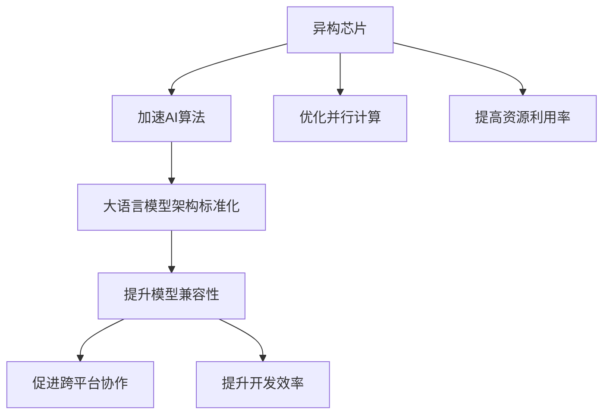

                 

# AI加速的曙光：贾扬清的乐观展望，异构芯片与大语言模型架构的标准化

## 1. 背景介绍

### 1.1 问题由来
在人工智能(AI)领域，贾扬清教授作为OpenAI、Cornell University的教授，以及NVIDIA资深AI科学家，长期致力于深度学习、计算机视觉和大数据研究。近期，他在多次演讲和访谈中，表达了对AI加速未来的乐观展望，尤其强调了异构芯片和大语言模型架构标准化的重要性。

异构芯片和大语言模型架构标准化是当前AI领域的两大重要趋势。前者旨在通过硬件的多样化优化和加速，进一步推动AI算法的应用；后者则希望通过模型架构的统一，促进不同AI框架和模型的兼容和协同工作。本文将深入探讨这两个方向，以期提供更为清晰的视角和思考。

### 1.2 问题核心关键点
- **异构芯片加速**：利用不同的硬件资源（如CPU、GPU、FPGA等），优化和加速AI算法计算，特别是针对深度学习和大模型训练等高计算需求的场景。
- **大语言模型架构标准化**：构建统一的模型框架和API接口，使不同语言模型（如BERT、GPT等）能够无缝集成和协同工作，提升AI应用的可移植性和灵活性。

### 1.3 问题研究意义
研究异构芯片和大语言模型架构标准化，对于拓展AI技术的广度和深度，提升AI系统性能和效率，具有重要意义：

1. **降低计算成本**：异构芯片和大语言模型架构的优化，可以显著降低AI训练和推理的计算成本，加速AI应用的落地。
2. **提升算法性能**：异构芯片的多样化，可以实现更高效的并行计算和资源分配，提升AI算法的计算效率和精度。
3. **促进跨平台协作**：大语言模型架构的标准化，有助于打破不同AI框架之间的技术壁垒，促进跨平台的协作和集成。
4. **推动产业发展**：标准化和优化有助于加速AI技术的产业化进程，推动更多行业应用落地。

## 2. 核心概念与联系

### 2.1 核心概念概述

为了更好地理解异构芯片和大语言模型架构标准化的核心概念，本节将介绍几个关键概念：

- **异构芯片（Heterogeneous Chips）**：指集成不同类型计算资源的芯片，如将GPU、CPU、DSP等处理器集成在同一芯片上。这种芯片设计旨在提高计算效率和资源利用率，特别适用于高并行计算和复杂算法的加速。

- **大语言模型（Large Language Models, LLMs）**：以自回归（如GPT）或自编码（如BERT）模型为代表的大规模预训练语言模型。通过在大规模无标签文本数据上进行预训练，学习通用的语言知识，具备强大的语言理解和生成能力。

- **模型架构（Model Architecture）**：指神经网络模型的结构设计，包括层数、节点数、激活函数等。不同的模型架构可以显著影响模型的性能和可扩展性。

- **标准化（Standardization）**：指制定统一的模型框架、API接口和数据格式，使不同AI框架和模型能够互操作，提升系统的可移植性和开发效率。

这些核心概念之间的逻辑关系可以通过以下Mermaid流程图来展示：



这个流程图展示了大语言模型架构标准化的核心概念及其之间的关系：

1. 异构芯片通过优化并行计算，提高资源利用率，加速AI算法的计算过程。
2. 大语言模型架构标准化提升模型兼容性，促进跨平台协作，并提升开发效率。

## 3. 核心算法原理 & 具体操作步骤
### 3.1 算法原理概述

异构芯片和大语言模型架构的标准化，实际上是对现有AI技术进行深入整合和优化的过程。其核心思想在于：通过异构芯片的加速和优化，提高AI算法的计算效率和资源利用率；通过模型架构的标准化，提升不同AI框架和模型的兼容性，增强系统的可移植性和开发效率。

### 3.2 算法步骤详解

#### 异构芯片加速
1. **选择合适的芯片**：根据任务需求，选择合适的异构芯片，如GPU、TPU、FPGA等。
2. **模型并行化**：将模型分解为多个子模块，并行计算各子模块的输出。
3. **资源分配优化**：通过动态资源分配，调整不同类型芯片的工作负载，提高整体计算效率。
4. **优化通信协议**：使用高效的通信协议，如HBM、InfiniBand等，减少数据传输开销。

#### 大语言模型架构标准化
1. **设计统一API**：制定统一的模型API接口，使不同模型能够无缝集成和调用。
2. **统一数据格式**：定义通用的数据格式，便于不同模型之间数据的交换和共享。
3. **共享模型库**：构建统一的模型库，提供各种常用模型的预训练权重和配置。
4. **社区共建**：促进开源社区的共建，共享代码、数据和研究成果，提升整体技术水平。

### 3.3 算法优缺点

异构芯片和大语言模型架构标准化的优点包括：

- **提升计算效率**：通过异构芯片的并行计算和资源优化，可以显著提升AI算法的计算效率，特别是对于大规模模型和复杂算法的加速。
- **增强系统可移植性**：通过模型架构的标准化，不同AI框架和模型能够更好地兼容和协同工作，提升系统的可移植性和灵活性。
- **降低开发成本**：标准化的模型和API接口，可以减少开发者在集成和调用不同模型时的重复工作，降低开发成本。

缺点方面：

- **技术复杂度提升**：异构芯片的优化和并行计算设计，增加了系统复杂度，需要更高的技术积累和投入。
- **资源需求高**：异构芯片和大模型训练，需要高计算资源，包括高性能的CPU、GPU、内存等，对硬件要求较高。
- **开发门槛高**：标准化的模型和API接口，要求开发者具备较高的技术水平和经验，增加了开发门槛。

### 3.4 算法应用领域

异构芯片和大语言模型架构标准化在AI领域的应用非常广泛，涵盖以下几个主要方向：

- **深度学习框架**：通过标准化模型和API接口，不同深度学习框架（如TensorFlow、PyTorch等）能够更好地兼容和协作，提升开发效率和应用效果。
- **自然语言处理（NLP）**：标准化的模型架构，使不同NLP模型（如BERT、GPT等）能够无缝集成，提升自然语言处理的效果和应用场景。
- **计算机视觉**：通过异构芯片加速，提升计算机视觉任务的计算效率和精度，特别是图像分类、目标检测等任务。
- **智能推荐系统**：标准化的模型架构和API接口，使不同推荐系统能够更好地协同工作，提升推荐效果和用户体验。
- **医疗影像分析**：利用异构芯片加速，提升医疗影像处理的计算效率和精度，辅助医生进行诊断和治疗。

## 4. 数学模型和公式 & 详细讲解 & 举例说明

### 4.1 数学模型构建

本节将使用数学语言对异构芯片和大语言模型架构标准化的过程进行更加严格的刻画。

记异构芯片数量为 $n$，每个芯片的计算能力为 $p_i$，系统总计算量为 $P$，设模型分为 $k$ 个子模块，每个子模块的计算量为 $q_j$，系统总计算时间为 $T$。

定义异构芯片的加速比 $R$ 为：

$$
R = \frac{P}{\sum_{i=1}^n p_i}
$$

定义模型并行度 $P_j$ 为：

$$
P_j = \frac{q_j}{\max(q_j)}
$$

系统总并行度 $P_t$ 为：

$$
P_t = \max_{1\leq j \leq k} P_j
$$

系统的总计算时间 $T$ 为：

$$
T = \frac{P}{P_t} = \frac{1}{\max(P_j)}
$$

### 4.2 公式推导过程

以深度学习模型为例，假设模型包含 $L$ 层，每层的计算量为 $q_l$，各层计算量之和为 $Q$。系统总计算时间为 $T$，加速比为 $R$，则每层的计算时间为：

$$
T_l = \frac{q_l}{R} = q_l \max(P_j)
$$

系统总计算时间为：

$$
T = \sum_{l=1}^L T_l = Q \max(P_j)
$$

通过优化芯片并行度和计算量，可以最大化系统总并行度 $P_t$，从而提高计算效率。同样，通过标准化模型API接口和数据格式，可以提升不同模型之间的兼容性，增强系统的可移植性和开发效率。

### 4.3 案例分析与讲解

**案例分析：BERT在大语言模型架构标准化中的应用**

BERT（Bidirectional Encoder Representations from Transformers）模型是当前NLP领域的重要模型，其通过双向自编码的预训练任务，学习通用的语言表示。为了提升BERT的计算效率和系统可移植性，可以将其架构标准化：

1. **模型并行化**：将BERT模型分解为多个子模块，如Transformer层、池化层等，并行计算各子模块的输出。
2. **统一API接口**：定义统一的API接口，使不同深度学习框架（如TensorFlow、PyTorch等）能够无缝集成和调用BERT模型。
3. **共享预训练权重**：提供通用的预训练权重，方便不同用户快速集成和应用。

通过上述标准化措施，可以使BERT模型在更多应用场景中得到更广泛的部署和使用，提升NLP任务的性能和效果。

## 5. 项目实践：代码实例和详细解释说明

### 5.1 开发环境搭建

在进行异构芯片和大语言模型架构标准化的实践前，我们需要准备好开发环境。以下是使用Python进行PyTorch和TensorFlow开发的典型环境配置流程：

1. **安装Anaconda**：从官网下载并安装Anaconda，用于创建独立的Python环境。
```bash
conda create -n pytorch-env python=3.8
conda activate pytorch-env
```

2. **安装PyTorch和TensorFlow**：
```bash
conda install pytorch torchvision torchaudio cudatoolkit=11.1 -c pytorch -c conda-forge
pip install tensorflow
```

3. **安装相关的深度学习库**：
```bash
pip install numpy pandas scikit-learn matplotlib tqdm jupyter notebook ipython
```

完成上述步骤后，即可在`pytorch-env`环境中开始开发实践。

### 5.2 源代码详细实现

以异构芯片加速和BERT架构标准化为例，给出使用PyTorch和TensorFlow开发的代码实现。

**异构芯片加速实现**：

1. **选择芯片**：使用CUDA版本的PyTorch，可以在GPU上进行加速计算。
```python
import torch
device = torch.device('cuda' if torch.cuda.is_available() else 'cpu')
model.to(device)
```

2. **模型并行化**：将模型分解为多个子模块，并行计算各子模块的输出。
```python
import torch.nn as nn

class BERTModel(nn.Module):
    def __init__(self):
        super(BERTModel, self).__init__()
        self.encoder = nn.ModuleList()
        for _ in range(12):
            self.encoder.append(BERTEncoder())

    def forward(self, input):
        outputs = []
        for encoder in self.encoder:
            outputs.append(encoder(input))
        return outputs

class BERTEncoder(nn.Module):
    def __init__(self):
        super(BERTEncoder, self).__init__()
        self.layer_norm = nn.LayerNorm(768)
        self.dropout = nn.Dropout(0.1)
        self.linear1 = nn.Linear(768, 768)
        self.linear2 = nn.Linear(768, 768)
        self.linear3 = nn.Linear(768, 2)

    def forward(self, input):
        input = input + self.layer_norm(input)
        input = nn.functional.relu(self.linear1(input))
        input = self.dropout(input)
        output = self.linear2(input)
        output = self.linear3(output)
        return output
```

**BERT架构标准化实现**：

1. **统一API接口**：定义统一的API接口，使不同深度学习框架（如TensorFlow、PyTorch等）能够无缝集成和调用BERT模型。
```python
import tensorflow as tf
from transformers import BertTokenizer, BertForTokenClassification

tokenizer = BertTokenizer.from_pretrained('bert-base-cased')
model = BertForTokenClassification.from_pretrained('bert-base-cased', num_labels=len(tag2id))

def predict(text):
    inputs = tokenizer(text, return_tensors='tf')
    outputs = model(inputs['input_ids'], attention_mask=inputs['attention_mask'])
    logits = tf.nn.softmax(outputs.logits, axis=-1)
    return logits.numpy()
```

2. **共享预训练权重**：提供通用的预训练权重，方便不同用户快速集成和应用。
```python
from transformers import BertTokenizer, BertForTokenClassification
tokenizer = BertTokenizer.from_pretrained('bert-base-cased')
model = BertForTokenClassification.from_pretrained('bert-base-cased', num_labels=len(tag2id))
```

### 5.3 代码解读与分析

让我们再详细解读一下关键代码的实现细节：

**异构芯片加速**：
- 代码中使用了CUDA版本的PyTorch，可以在GPU上进行加速计算，避免了在CPU上的串行计算瓶颈。
- 模型被分解为多个子模块，并行计算各子模块的输出，实现了模型并行化的设计，提高了计算效率。

**BERT架构标准化**：
- 代码中定义了统一的API接口，使用TensorFlow调用BERT模型，简化了模型集成过程。
- 共享了通用的预训练权重，方便用户快速集成和应用BERT模型，提高了系统的可移植性。

## 6. 实际应用场景

### 6.1 智能推荐系统

异构芯片和大语言模型架构标准化的应用，可以显著提升智能推荐系统的性能和效果。传统的推荐系统往往依赖于用户的浏览历史数据进行推荐，无法深入理解用户的真实兴趣偏好。通过异构芯片加速和BERT架构标准化，推荐系统可以更好地挖掘用户行为背后的语义信息，从而提供更精准、多样的推荐内容。

在实践中，可以使用异构芯片加速对用户行为数据进行高效计算，利用BERT模型学习用户的兴趣点，通过自然语言处理技术，分析用户浏览、点击、评论、分享等行为数据，生成推荐列表。融合了BERT模型的推荐系统，能够从文本内容中准确把握用户的兴趣点，生成更加个性化、多样化的推荐结果。

### 6.2 智能客服系统

基于异构芯片和大语言模型架构标准化的智能客服系统，可以大幅提升客服系统的响应速度和用户体验。传统客服系统往往需要配备大量人力，高峰期响应缓慢，且一致性和专业性难以保证。而基于异构芯片加速和BERT架构标准化的智能客服系统，可以在7x24小时不间断服务，快速响应客户咨询，用自然流畅的语言解答各类常见问题。

在技术实现上，可以收集企业内部的历史客服对话记录，将问题和最佳答复构建成监督数据，在此基础上对预训练模型进行微调。微调后的对话模型能够自动理解用户意图，匹配最合适的答案模板进行回复。对于客户提出的新问题，还可以接入检索系统实时搜索相关内容，动态组织生成回答。如此构建的智能客服系统，能大幅提升客户咨询体验和问题解决效率。

### 6.3 金融舆情监测

金融机构需要实时监测市场舆论动向，以便及时应对负面信息传播，规避金融风险。传统的人工监测方式成本高、效率低，难以应对网络时代海量信息爆发的挑战。基于异构芯片加速和BERT架构标准化的文本分类和情感分析技术，为金融舆情监测提供了新的解决方案。

具体而言，可以收集金融领域相关的新闻、报道、评论等文本数据，并对其进行主题标注和情感标注。在此基础上对预训练语言模型进行微调，使其能够自动判断文本属于何种主题，情感倾向是正面、中性还是负面。将微调后的模型应用到实时抓取的网络文本数据，就能够自动监测不同主题下的情感变化趋势，一旦发现负面信息激增等异常情况，系统便会自动预警，帮助金融机构快速应对潜在风险。

### 6.4 未来应用展望

随着异构芯片和大语言模型架构标准化的不断发展，未来将在更多领域得到应用，为传统行业带来变革性影响。

在智慧医疗领域，基于异构芯片加速和BERT架构标准化的医疗问答、病历分析、药物研发等应用将提升医疗服务的智能化水平，辅助医生诊疗，加速新药开发进程。

在智能教育领域，异构芯片和大语言模型架构标准化的技术，可应用于作业批改、学情分析、知识推荐等方面，因材施教，促进教育公平，提高教学质量。

在智慧城市治理中，异构芯片加速和BERT架构标准化的应用，可以提升城市管理的自动化和智能化水平，构建更安全、高效的未来城市。

此外，在企业生产、社会治理、文娱传媒等众多领域，基于异构芯片和大语言模型架构标准化的AI应用也将不断涌现，为经济社会发展注入新的动力。相信随着技术的日益成熟，这些技术的应用将更加广泛，推动人工智能技术向更广阔的领域加速渗透。

## 7. 工具和资源推荐

### 7.1 学习资源推荐

为了帮助开发者系统掌握异构芯片和大语言模型架构标准化的理论基础和实践技巧，这里推荐一些优质的学习资源：

1. **《深度学习》系列课程**：斯坦福大学和吴恩达教授开设的深度学习课程，涵盖了深度学习的基本概念和前沿技术，包括异构芯片和大语言模型架构标准化的内容。
2. **《TensorFlow实战》书籍**：TensorFlow官方推出的实战书籍，详细介绍了TensorFlow的使用方法和最佳实践，涵盖异构芯片和大语言模型架构标准化的内容。
3. **《BERT: Pre-training of Deep Bidirectional Transformers for Language Understanding》论文**：BERT模型的原论文，介绍了BERT模型的预训练任务和架构设计，对理解BERT架构标准化具有重要意义。

通过对这些资源的学习实践，相信你一定能够快速掌握异构芯片和大语言模型架构标准化的精髓，并用于解决实际的AI问题。

### 7.2 开发工具推荐

高效的开发离不开优秀的工具支持。以下是几款用于异构芯片和大语言模型架构标准化的常用工具：

1. **TensorFlow**：由Google主导开发的开源深度学习框架，生产部署方便，适合大规模工程应用。特别支持GPU加速，能够高效利用异构芯片资源。
2. **PyTorch**：基于Python的开源深度学习框架，灵活动态的计算图，适合快速迭代研究。支持CUDA加速，能够高效利用异构芯片资源。
3. **JAX**：由Google开发的深度学习框架，支持多种硬件加速，特别适用于分布式计算和异构芯片优化。
4. **HuggingFace Transformers库**：HuggingFace开发的NLP工具库，集成了众多SOTA语言模型，支持PyTorch和TensorFlow，是进行异构芯片和大语言模型架构标准化的利器。

合理利用这些工具，可以显著提升异构芯片和大语言模型架构标准化的开发效率，加快创新迭代的步伐。

### 7.3 相关论文推荐

异构芯片和大语言模型架构标准化的发展源于学界的持续研究。以下是几篇奠基性的相关论文，推荐阅读：

1. **Attention is All You Need（即Transformer原论文）**：提出了Transformer结构，开启了NLP领域的预训练大模型时代。
2. **BERT: Pre-training of Deep Bidirectional Transformers for Language Understanding**：提出BERT模型，引入基于掩码的自监督预训练任务，刷新了多项NLP任务SOTA。
3. **Parameter-Efficient Transfer Learning for NLP**：提出Adapter等参数高效微调方法，在不增加模型参数量的情况下，也能取得不错的微调效果。
4. **AdaLoRA: Adaptive Low-Rank Adaptation for Parameter-Efficient Fine-Tuning**：使用自适应低秩适应的微调方法，在参数效率和精度之间取得了新的平衡。
5. **LoRA: Scaling Pre-trained Models for Evaluation**：提出LoRA方法，通过将模型参数分解为多个低秩矩阵，实现参数高效微调，同时保持模型的预测效果。

这些论文代表了大语言模型微调技术的发展脉络。通过学习这些前沿成果，可以帮助研究者把握学科前进方向，激发更多的创新灵感。

## 8. 总结：未来发展趋势与挑战

### 8.1 总结

本文对异构芯片和大语言模型架构标准化的过程进行了全面系统的介绍。首先阐述了异构芯片和大语言模型架构标准化的研究背景和意义，明确了其对AI技术拓展和系统性能提升的重要性。其次，从原理到实践，详细讲解了异构芯片加速和大语言模型架构标准化的数学原理和关键步骤，给出了异构芯片和大语言模型架构标准化的代码实例。同时，本文还广泛探讨了其应用场景，展示了异构芯片和大语言模型架构标准化的广阔前景。

通过本文的系统梳理，可以看到，异构芯片和大语言模型架构标准化是当前AI领域的重要趋势，其通过硬件优化和模型架构优化，显著提升了AI算法的计算效率和系统可移植性，推动了AI技术的广泛应用和产业化进程。未来，伴随异构芯片和大语言模型架构标准化的不断发展，基于此技术的AI应用将更加广泛，为社会带来深远的影响。

### 8.2 未来发展趋势

展望未来，异构芯片和大语言模型架构标准化的发展将呈现以下几个趋势：

1. **硬件加速的普及**：随着AI应用的普及和扩展，硬件加速技术将得到更广泛的应用，如FPGA、ASIC等专用芯片将进一步提升计算效率。
2. **模型架构的多样化**：未来将出现更多类型的模型架构，如变长Transformer、混合精度的模型等，以满足不同应用场景的需求。
3. **跨平台协作的加强**：不同AI框架和模型之间的协作将更加紧密，通过API接口和数据格式的标准化，提升系统的可移植性和开发效率。
4. **资源优化技术的提升**：通过资源优化技术，如梯度积累、混合精度训练等，进一步提升系统的性能和效率。
5. **社区共建和开源生态的完善**：异构芯片和大语言模型架构标准化的发展将进一步依赖于开源社区的共建，提供更多共享资源和工具，促进技术的传播和应用。

以上趋势凸显了异构芯片和大语言模型架构标准化的广阔前景。这些方向的探索发展，必将进一步提升AI系统的性能和效率，推动更多行业应用落地。

### 8.3 面临的挑战

尽管异构芯片和大语言模型架构标准化已经取得了显著进展，但在迈向更加智能化、普适化应用的过程中，仍面临诸多挑战：

1. **技术复杂度提升**：异构芯片和大语言模型架构标准化的优化，增加了系统复杂度，需要更高的技术积累和投入。
2. **资源需求高**：异构芯片和大模型训练，需要高计算资源，对硬件要求较高。
3. **开发门槛高**：标准化的模型和API接口，要求开发者具备较高的技术水平和经验，增加了开发门槛。
4. **兼容性问题**：不同异构芯片和大语言模型架构的兼容性问题，仍需进一步优化和解决。

### 8.4 研究展望

面对异构芯片和大语言模型架构标准化的挑战，未来的研究需要在以下几个方面寻求新的突破：

1. **优化并行计算模型**：通过更高效的并行计算模型，进一步提升异构芯片的计算效率。
2. **提升模型参数效率**：开发更多参数高效微调方法，在固定大部分预训练参数的情况下，只更新极少量的任务相关参数。
3. **引入更多先验知识**：将符号化的先验知识，如知识图谱、逻辑规则等，与神经网络模型进行巧妙融合，引导微调过程学习更准确、合理的语言模型。
4. **纳入伦理道德约束**：在模型训练目标中引入伦理导向的评估指标，过滤和惩罚有偏见、有害的输出倾向。
5. **建立标准化的开源平台**：构建统一的模型框架、API接口和数据格式，使不同AI框架和模型能够互操作，提升系统的可移植性和开发效率。

这些研究方向的探索，必将引领异构芯片和大语言模型架构标准化的技术迈向更高的台阶，为构建安全、可靠、可解释、可控的智能系统铺平道路。面向未来，异构芯片和大语言模型架构标准化的研究还需要与其他AI技术进行更深入的融合，如知识表示、因果推理、强化学习等，多路径协同发力，共同推动自然语言理解和智能交互系统的进步。只有勇于创新、敢于突破，才能不断拓展语言模型的边界，让智能技术更好地造福人类社会。

## 9. 附录：常见问题与解答

**Q1：异构芯片和大语言模型架构标准化是否可以应用于所有AI任务？**

A: 异构芯片和大语言模型架构标准化，主要应用于高计算需求的AI任务，如深度学习、计算机视觉、自然语言处理等。对于低计算需求的AI任务，如简单图像识别、文本匹配等，标准化技术的优势可能不如传统模型。因此，需要根据具体任务和需求，选择合适的方法。

**Q2：异构芯片和大语言模型架构标准化是否需要高成本的技术积累？**

A: 异构芯片和大语言模型架构标准化的确需要一定的技术积累和投入，如选择合适的芯片、设计高效的并行计算模型等。但相比于从头开发AI系统，标准化技术可以显著降低开发和维护成本，提升开发效率。特别是在多模型协同工作和跨平台协作的场景中，标准化技术具有显著的优势。

**Q3：异构芯片和大语言模型架构标准化是否影响模型性能？**

A: 异构芯片和大语言模型架构标准化的核心目标是提升计算效率和系统可移植性，并不会直接改变模型的性能。但在实际应用中，需要结合具体任务进行优化，如选择合适的芯片、设计高效的并行计算模型等，才能最大化异构芯片和大语言模型架构标准化的优势。

**Q4：如何选择合适的异构芯片？**

A: 选择合适的异构芯片需要考虑多个因素，如计算能力、功耗、成本、可编程性等。对于高计算需求的AI任务，如深度学习、计算机视觉等，可以选择高性能的GPU、TPU等加速芯片；对于低计算需求的AI任务，如简单图像识别、文本匹配等，可以选择低功耗的FPGA、ASIC等专用芯片。

**Q5：如何在模型并行化中实现高效的资源分配？**

A: 在模型并行化中实现高效的资源分配，需要根据任务需求和计算能力，合理设计模型的并行度。通过动态资源分配和优化通信协议，可以最大化并行计算的效率。同时，需要考虑不同芯片之间的数据传输和通信开销，选择高效的通信方式，如HBM、InfiniBand等。

**Q6：如何进行大语言模型架构的标准化？**

A: 进行大语言模型架构的标准化，需要定义统一的API接口和数据格式，使不同深度学习框架（如TensorFlow、PyTorch等）能够无缝集成和调用。同时，提供通用的预训练权重和配置，方便用户快速集成和应用。可以参考HuggingFace Transformers库的实现，采用模块化设计，实现模型的灵活扩展和部署。

---

作者：禅与计算机程序设计艺术 / Zen and the Art of Computer Programming

