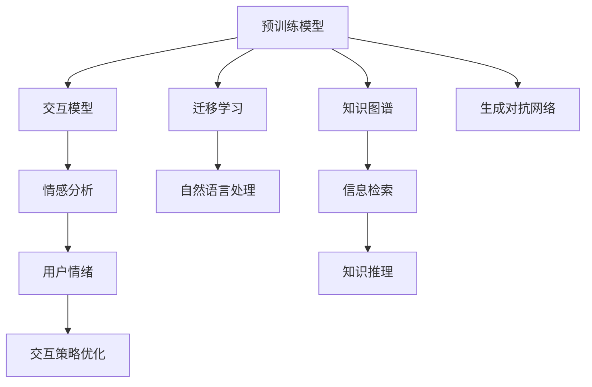

                 

# AI助理时代的企业变革

## 1. 背景介绍

### 1.1 问题由来

在当今数字化转型的浪潮中，企业正面临着前所未有的挑战与机遇。如何利用最新的人工智能(AI)技术，提升运营效率、优化客户体验、驱动业务增长，成为每个企业高管必须解答的问题。而人工智能助理(AI Assistant)，作为AI技术应用的重要形态，通过智能化的交互方式，提供精准、高效、个性化的服务，已经成为企业信息化建设的全新引擎。

企业AI助理的应用场景包括但不限于客户服务、市场营销、运营管理、人力资源等多个领域。其背后的技术支撑主要来自于自然语言处理(NLP)、机器学习、计算机视觉等前沿领域。这些技术结合企业自身业务需求，通过微调、迁移学习、生成对抗网络(GANs)等方法，构建出具备独特企业特色的智能助理系统。

### 1.2 问题核心关键点

AI助理的核心在于其交互智能、知识管理和自动化决策能力。其构建过程需要考虑以下几个关键点：

- **交互智能**：理解用户的意图，生成自然流畅的回复，并动态调整回答策略，提升用户体验。
- **知识管理**：融合企业内部知识库、外部数据源等，为智能助理提供丰富的语义信息支持，支持精准的信息检索和知识推理。
- **自动化决策**：基于算法和规则，实现对业务场景的自动化处理，提升业务处理的效率和准确性。

## 2. 核心概念与联系

### 2.1 核心概念概述

为更好地理解AI助理的构建方法，本节将介绍几个密切相关的核心概念：

- **自然语言处理(NLP)**：涉及语言的理解、生成、分析和应用，是构建AI助理的核心技术之一。通过预训练和微调等技术，NLP系统能够理解自然语言，执行复杂的语言任务。

- **预训练模型**：如BERT、GPT等，通过在海量无标签数据上进行预训练，学习通用的语言表示。预训练模型为后续的微调和应用提供了高质量的初始参数。

- **迁移学习**：指将一个领域学习到的知识，迁移到另一个不同但相关的领域，提升模型的泛化能力。在AI助理中，通过迁移学习，可以利用预训练模型处理多样化的任务。

- **生成对抗网络(GANs)**：通过两个神经网络的对抗训练，生成高质量的数据样本，如图片、文本等。在AI助理中，GANs可用于数据增强和生成新内容。

- **知识图谱**：通过将现实世界中的知识结构化，形成节点和边表示的知识图，支持信息检索和推理。在AI助理中，知识图谱可提供丰富的知识背景，提升决策的准确性。

- **交互模型**：如对话模型、推荐模型等，通过交互式设计，构建人机协同的智能系统，提升用户体验和系统性能。

- **情感分析**：分析文本中的情感倾向，用于判断用户情绪，优化交互策略。在AI助理中，情感分析可以帮助理解用户的情感状态，增强服务的情感共鸣。

这些核心概念之间的逻辑关系可以通过以下Mermaid流程图来展示：



这个流程图展示了AI助理的核心概念及其之间的关系：

1. 预训练模型是AI助理的基础，通过迁移学习与自然语言处理技术，支持任务的泛化与执行。
2. 知识图谱和生成对抗网络为AI助理提供知识背景和数据增强。
3. 交互模型和情感分析支持人机协同，提升用户体验和系统互动性。
4. 信息检索和知识推理使得AI助理能够高效处理复杂查询。

## 3. 核心算法原理 & 具体操作步骤

### 3.1 算法原理概述

AI助理的构建过程，本质上是一个多模态数据的深度学习和自然语言处理的过程。其核心在于利用预训练模型进行知识迁移，并通过微调、迁移学习等技术，适配具体企业任务，构建出具备交互智能、知识管理和自动化决策能力的智能助理。

形式化地，假设企业AI助理的任务为 $T$，输入为 $X$，输出为 $Y$。定义一个通用预训练模型 $M_{\theta}$，其中 $\theta$ 为预训练得到的模型参数。通过迁移学习，将预训练模型的知识迁移到AI助理任务中，得到适应任务的模型 $M^T_{\theta}$。

AI助理的构建过程包括：

1. **数据准备**：收集企业相关数据，包括客户服务记录、产品介绍、运营日志等，用于训练和微调。
2. **模型适配**：选择合适的预训练模型，并根据任务需求设计适配层，如对话模型中的对话层、推荐系统中的协同过滤层等。
3. **微调训练**：在适应层和预训练模型的基础上，使用标注数据进行微调，优化模型在任务 $T$ 上的性能。
4. **模型部署**：将训练好的模型部署到生产环境中，通过API接口或嵌入系统，实现与用户的交互。

### 3.2 算法步骤详解

AI助理的构建通常包括以下几个关键步骤：

**Step 1: 数据准备**
- 收集企业历史数据，如客服对话、产品文档、运营报告等。
- 对数据进行清洗、标注和预处理，准备用于训练和微调的数据集。

**Step 2: 模型适配**
- 选择合适的预训练模型，如BERT、GPT-3等。
- 根据具体任务需求，设计适配层。例如，对话模型可以使用Transformer架构，结合输入编码器和输出解码器；推荐系统可以使用协同过滤层，结合用户行为数据和物品特征。

**Step 3: 微调训练**
- 使用标注数据进行微调，选择合适的优化算法如AdamW，设定学习率、批大小等超参数。
- 监控训练过程中的性能指标，如精确度、召回率、F1分数等，确保模型效果。
- 在验证集上评估模型，调整超参数以避免过拟合。

**Step 4: 模型部署**
- 将微调后的模型封装成API服务或嵌入到应用系统中，提供给用户使用。
- 监控系统运行状态，收集反馈数据，不断优化模型性能。

### 3.3 算法优缺点

AI助理构建过程中，常见的算法包括：

- **迁移学习**：利用预训练模型的泛化能力，提升AI助理在不同任务上的性能，减少标注数据需求。
- **微调**：对特定任务进行参数优化，提升模型针对性，但需消耗计算资源和时间。
- **生成对抗网络(GANs)**：用于数据增强和生成新内容，提升数据多样性和泛化能力。
- **知识图谱**：融合结构化知识，提升信息检索和推理能力。

这些算法各有优缺点：

**优点**：
- 提升模型泛化能力，减少标注数据需求。
- 缩短模型开发周期，提升业务处理效率。
- 提供高质量的知识背景和数据增强，提升系统性能。

**缺点**：
- 对预训练模型的依赖较强，需选择适用的模型。
- 微调过程耗时较长，需消耗较多计算资源。
- 生成对抗网络数据生成质量不稳定，可能引入噪声。
- 知识图谱构建复杂，需前期投入大量精力。

### 3.4 算法应用领域

AI助理的应用领域非常广泛，包括但不限于以下几个方面：

- **客户服务**：智能客服机器人，自动回答用户咨询，提升客户满意度。
- **市场营销**：智能推荐系统，根据用户行为和偏好，推荐产品或内容，提升转化率。
- **运营管理**：智能调度系统，优化资源配置，提升运营效率。
- **人力资源**：智能招聘系统，自动筛选简历，提升招聘效率。
- **供应链管理**：智能库存管理系统，预测需求，优化库存。
- **智能制造**：智能生产线控制系统，自动化调度生产任务。

这些应用领域覆盖了企业运营的各个环节，通过AI助理技术，能够大幅提升企业的信息化水平和运营效率。

## 4. 数学模型和公式 & 详细讲解

### 4.1 数学模型构建

本节将使用数学语言对AI助理的构建过程进行更加严格的刻画。

假设企业AI助理的任务为 $T$，输入为 $X$，输出为 $Y$。定义一个通用预训练模型 $M_{\theta}$，其中 $\theta$ 为预训练得到的模型参数。通过迁移学习，将预训练模型的知识迁移到AI助理任务中，得到适应任务的模型 $M^T_{\theta}$。

定义AI助理的损失函数为 $\mathcal{L}(T, X, Y)$，表示在任务 $T$ 上，模型对输入 $X$ 的输出 $Y$ 与真实标签的差异。假设训练集为 $D=\{(x_i, y_i)\}_{i=1}^N$，则模型在训练集上的经验风险为：

$$
\mathcal{L}(D) = \frac{1}{N} \sum_{i=1}^N \mathcal{L}(T, x_i, y_i)
$$

微调的目标是最小化经验风险，即：

$$
\theta^* = \mathop{\arg\min}_{\theta} \mathcal{L}(D)
$$

在实践中，我们通常使用基于梯度的优化算法（如AdamW、SGD等）来近似求解上述最优化问题。设 $\eta$ 为学习率，$\lambda$ 为正则化系数，则参数的更新公式为：

$$
\theta \leftarrow \theta - \eta \nabla_{\theta}\mathcal{L}(\theta) - \eta\lambda\theta
$$

其中 $\nabla_{\theta}\mathcal{L}(\theta)$ 为损失函数对参数 $\theta$ 的梯度，可通过反向传播算法高效计算。

### 4.2 公式推导过程

以下我们以推荐系统为例，推导协同过滤模型的训练过程。

假设推荐系统基于用户行为数据进行推荐，输入为 $x=(u, i)$，其中 $u$ 为用户ID，$i$ 为物品ID。推荐系统的目标函数为：

$$
\min_{\theta} \mathbb{E}_{(x, y)}[\ell(x, y, \theta)]
$$

其中 $\ell(x, y, \theta)$ 为损失函数，例如均方误差损失。在预训练模型中，将用户行为数据作为输入，生成物品评分预测 $\hat{y}$。在微调过程中，根据推荐任务的定义，将用户真实评分作为标签 $y$。微调的目标是使得预测评分 $\hat{y}$ 尽可能接近真实评分 $y$。

定义预测评分与真实评分的差异函数 $f(x, y, \theta)$，例如均方误差函数 $f(x, y, \theta) = (\hat{y} - y)^2$。在预训练模型中，$f(x, y, \theta)$ 可表示为：

$$
f(x, y, \theta) = \sum_i (y_i - \hat{y}_i)^2
$$

其中 $\hat{y}_i$ 为模型预测的用户对物品 $i$ 的评分，$y_i$ 为实际评分。

在微调过程中，目标函数可表示为：

$$
\min_{\theta} \mathbb{E}_{(x, y)}[\ell(x, y, \theta)]
$$

通过反向传播算法，可计算出参数 $\theta$ 的梯度，进而更新模型参数。

### 4.3 案例分析与讲解

以智能客服系统为例，分析其构建过程和涉及的核心算法。

**输入与输出**：
- 输入为用户的自然语言问题，如“我如何退货？”。
- 输出为系统的回复，如“您好，退货流程如下...”。

**模型适配**：
- 使用对话模型架构，结合预训练的BERT模型。
- 适配层包括输入编码器、对话生成器等。

**微调训练**：
- 在历史客服对话数据上进行微调，优化模型对用户问题的理解和生成回复的能力。
- 使用BLEU、ROUGE等指标评估模型效果。
- 通过调整超参数，如学习率、批大小等，优化模型性能。

**模型部署**：
- 将微调后的模型部署到云平台，提供API接口或集成到企业系统中。
- 通过实时数据监控，不断优化模型性能，提升用户体验。

## 5. 项目实践：代码实例和详细解释说明

### 5.1 开发环境搭建

在进行AI助理构建实践前，我们需要准备好开发环境。以下是使用Python进行PyTorch开发的环境配置流程：

1. 安装Anaconda：从官网下载并安装Anaconda，用于创建独立的Python环境。

2. 创建并激活虚拟环境：
```bash
conda create -n ai_assistant_env python=3.8 
conda activate ai_assistant_env
```

3. 安装PyTorch：根据CUDA版本，从官网获取对应的安装命令。例如：
```bash
conda install pytorch torchvision torchaudio cudatoolkit=11.1 -c pytorch -c conda-forge
```

4. 安装Transformers库：
```bash
pip install transformers
```

5. 安装各类工具包：
```bash
pip install numpy pandas scikit-learn matplotlib tqdm jupyter notebook ipython
```

完成上述步骤后，即可在`ai_assistant_env`环境中开始构建实践。

### 5.2 源代码详细实现

这里我们以智能推荐系统为例，给出使用Transformers库进行微调的PyTorch代码实现。

首先，定义推荐任务的数据处理函数：

```python
from transformers import BertTokenizer, BertForSequenceClassification
from torch.utils.data import Dataset
import torch

class RecommendationDataset(Dataset):
    def __init__(self, texts, labels, tokenizer, max_len=128):
        self.texts = texts
        self.labels = labels
        self.tokenizer = tokenizer
        self.max_len = max_len
        
    def __len__(self):
        return len(self.texts)
    
    def __getitem__(self, item):
        text = self.texts[item]
        label = self.labels[item]
        
        encoding = self.tokenizer(text, return_tensors='pt', max_length=self.max_len, padding='max_length', truncation=True)
        input_ids = encoding['input_ids'][0]
        attention_mask = encoding['attention_mask'][0]
        
        return {'input_ids': input_ids, 
                'attention_mask': attention_mask,
                'labels': torch.tensor(label, dtype=torch.long)}
```

然后，定义模型和优化器：

```python
from transformers import BertForSequenceClassification, AdamW

model = BertForSequenceClassification.from_pretrained('bert-base-cased', num_labels=2)

optimizer = AdamW(model.parameters(), lr=2e-5)
```

接着，定义训练和评估函数：

```python
from torch.utils.data import DataLoader
from tqdm import tqdm
from sklearn.metrics import classification_report

device = torch.device('cuda') if torch.cuda.is_available() else torch.device('cpu')
model.to(device)

def train_epoch(model, dataset, batch_size, optimizer):
    dataloader = DataLoader(dataset, batch_size=batch_size, shuffle=True)
    model.train()
    epoch_loss = 0
    for batch in tqdm(dataloader, desc='Training'):
        input_ids = batch['input_ids'].to(device)
        attention_mask = batch['attention_mask'].to(device)
        labels = batch['labels'].to(device)
        model.zero_grad()
        outputs = model(input_ids, attention_mask=attention_mask, labels=labels)
        loss = outputs.loss
        epoch_loss += loss.item()
        loss.backward()
        optimizer.step()
    return epoch_loss / len(dataloader)

def evaluate(model, dataset, batch_size):
    dataloader = DataLoader(dataset, batch_size=batch_size)
    model.eval()
    preds, labels = [], []
    with torch.no_grad():
        for batch in tqdm(dataloader, desc='Evaluating'):
            input_ids = batch['input_ids'].to(device)
            attention_mask = batch['attention_mask'].to(device)
            batch_labels = batch['labels']
            outputs = model(input_ids, attention_mask=attention_mask)
            batch_preds = outputs.logits.argmax(dim=2).to('cpu').tolist()
            batch_labels = batch_labels.to('cpu').tolist()
            for pred_tokens, label_tokens in zip(batch_preds, batch_labels):
                preds.append(pred_tokens[:len(label_tokens)])
                labels.append(label_tokens)
                
    print(classification_report(labels, preds))
```

最后，启动训练流程并在测试集上评估：

```python
epochs = 5
batch_size = 16

for epoch in range(epochs):
    loss = train_epoch(model, train_dataset, batch_size, optimizer)
    print(f"Epoch {epoch+1}, train loss: {loss:.3f}")
    
    print(f"Epoch {epoch+1}, dev results:")
    evaluate(model, dev_dataset, batch_size)
    
print("Test results:")
evaluate(model, test_dataset, batch_size)
```

以上就是使用PyTorch对BERT进行推荐系统任务微调的完整代码实现。可以看到，得益于Transformers库的强大封装，我们可以用相对简洁的代码完成BERT模型的加载和微调。

### 5.3 代码解读与分析

让我们再详细解读一下关键代码的实现细节：

**RecommendationDataset类**：
- `__init__`方法：初始化文本、标签、分词器等关键组件。
- `__len__`方法：返回数据集的样本数量。
- `__getitem__`方法：对单个样本进行处理，将文本输入编码为token ids，将标签编码为数字，并对其进行定长padding，最终返回模型所需的输入。

**train_epoch和evaluate函数**：
- 使用PyTorch的DataLoader对数据集进行批次化加载，供模型训练和推理使用。
- 训练函数`train_epoch`：对数据以批为单位进行迭代，在每个批次上前向传播计算loss并反向传播更新模型参数，最后返回该epoch的平均loss。
- 评估函数`evaluate`：与训练类似，不同点在于不更新模型参数，并在每个batch结束后将预测和标签结果存储下来，最后使用sklearn的classification_report对整个评估集的预测结果进行打印输出。

**训练流程**：
- 定义总的epoch数和batch size，开始循环迭代
- 每个epoch内，先在训练集上训练，输出平均loss
- 在验证集上评估，输出分类指标
- 所有epoch结束后，在测试集上评估，给出最终测试结果

可以看到，PyTorch配合Transformers库使得BERT微调的代码实现变得简洁高效。开发者可以将更多精力放在数据处理、模型改进等高层逻辑上，而不必过多关注底层的实现细节。

当然，工业级的系统实现还需考虑更多因素，如模型的保存和部署、超参数的自动搜索、更灵活的任务适配层等。但核心的微调范式基本与此类似。

## 6. 实际应用场景

### 6.1 智能客服系统

智能客服系统作为AI助理的重要应用场景，通过与用户的自然语言交互，提供7x24小时不间断服务，解决用户常见问题，提升客户满意度。

在技术实现上，可以收集企业内部的历史客服对话记录，将问题和最佳答复构建成监督数据，在此基础上对预训练对话模型进行微调。微调后的对话模型能够自动理解用户意图，匹配最合适的答案模板进行回复。对于客户提出的新问题，还可以接入检索系统实时搜索相关内容，动态组织生成回答。如此构建的智能客服系统，能大幅提升客户咨询体验和问题解决效率。

### 6.2 金融舆情监测

金融机构需要实时监测市场舆论动向，以便及时应对负面信息传播，规避金融风险。传统的人工监测方式成本高、效率低，难以应对网络时代海量信息爆发的挑战。基于AI助理的文本分类和情感分析技术，为金融舆情监测提供了新的解决方案。

具体而言，可以收集金融领域相关的新闻、报道、评论等文本数据，并对其进行主题标注和情感标注。在此基础上对预训练语言模型进行微调，使其能够自动判断文本属于何种主题，情感倾向是正面、中性还是负面。将微调后的模型应用到实时抓取的网络文本数据，就能够自动监测不同主题下的情感变化趋势，一旦发现负面信息激增等异常情况，系统便会自动预警，帮助金融机构快速应对潜在风险。

### 6.3 个性化推荐系统

当前的推荐系统往往只依赖用户的历史行为数据进行物品推荐，无法深入理解用户的真实兴趣偏好。基于AI助理的推荐系统，可以通过微调模型，更好地挖掘用户行为背后的语义信息，从而提供更精准、多样的推荐内容。

在实践中，可以收集用户浏览、点击、评论、分享等行为数据，提取和用户交互的物品标题、描述、标签等文本内容。将文本内容作为模型输入，用户的后续行为（如是否点击、购买等）作为监督信号，在此基础上微调预训练语言模型。微调后的模型能够从文本内容中准确把握用户的兴趣点。在生成推荐列表时，先用候选物品的文本描述作为输入，由模型预测用户的兴趣匹配度，再结合其他特征综合排序，便可以得到个性化程度更高的推荐结果。

### 6.4 未来应用展望

随着AI助理技术的不断发展，其在更多领域的应用前景将更加广阔。

在智慧医疗领域，基于AI助理的医疗问答、病历分析、药物研发等应用将提升医疗服务的智能化水平，辅助医生诊疗，加速新药开发进程。

在智能教育领域，AI助理可用于作业批改、学情分析、知识推荐等方面，因材施教，促进教育公平，提高教学质量。

在智慧城市治理中，AI助理可用于城市事件监测、舆情分析、应急指挥等环节，提高城市管理的自动化和智能化水平，构建更安全、高效的未来城市。

此外，在企业生产、社会治理、文娱传媒等众多领域，AI助理技术也将不断涌现，为传统行业数字化转型升级提供新的技术路径。相信随着技术的日益成熟，AI助理必将在更广阔的应用领域大放异彩，深刻影响人类的生产生活方式。

## 7. 工具和资源推荐

### 7.1 学习资源推荐

为了帮助开发者系统掌握AI助理的理论基础和实践技巧，这里推荐一些优质的学习资源：

1. 《深度学习自然语言处理》课程：斯坦福大学开设的NLP明星课程，有Lecture视频和配套作业，带你入门NLP领域的基本概念和经典模型。

2. CS224N《自然语言处理与深度学习》课程：斯坦福大学开设的NLP核心课程，深入讲解NLP领域的最新进展和前沿技术。

3. 《Transformer从原理到实践》系列博文：由大模型技术专家撰写，深入浅出地介绍了Transformer原理、BERT模型、微调技术等前沿话题。

4. 《深度学习实战》书籍：手把手教你使用TensorFlow和Keras构建深度学习模型，涵盖NLP、计算机视觉等多个领域。

5. 《Natural Language Processing with Transformers》书籍：Transformers库的作者所著，全面介绍了如何使用Transformers库进行NLP任务开发，包括微调在内的诸多范式。

通过对这些资源的学习实践，相信你一定能够快速掌握AI助理的精髓，并用于解决实际的NLP问题。

### 7.2 开发工具推荐

高效的开发离不开优秀的工具支持。以下是几款用于AI助理构建开发的常用工具：

1. PyTorch：基于Python的开源深度学习框架，灵活动态的计算图，适合快速迭代研究。大部分预训练语言模型都有PyTorch版本的实现。

2. TensorFlow：由Google主导开发的开源深度学习框架，生产部署方便，适合大规模工程应用。同样有丰富的预训练语言模型资源。

3. Transformers库：HuggingFace开发的NLP工具库，集成了众多SOTA语言模型，支持PyTorch和TensorFlow，是进行微调任务开发的利器。

4. Weights & Biases：模型训练的实验跟踪工具，可以记录和可视化模型训练过程中的各项指标，方便对比和调优。与主流深度学习框架无缝集成。

5. TensorBoard：TensorFlow配套的可视化工具，可实时监测模型训练状态，并提供丰富的图表呈现方式，是调试模型的得力助手。

6. Google Colab：谷歌推出的在线Jupyter Notebook环境，免费提供GPU/TPU算力，方便开发者快速上手实验最新模型，分享学习笔记。

合理利用这些工具，可以显著提升AI助理的开发效率，加快创新迭代的步伐。

### 7.3 相关论文推荐

AI助理技术的发展得益于学界的持续研究。以下是几篇奠基性的相关论文，推荐阅读：

1. Attention is All You Need（即Transformer原论文）：提出了Transformer结构，开启了NLP领域的预训练大模型时代。

2. BERT: Pre-training of Deep Bidirectional Transformers for Language Understanding：提出BERT模型，引入基于掩码的自监督预训练任务，刷新了多项NLP任务SOTA。

3. Language Models are Unsupervised Multitask Learners（GPT-2论文）：展示了大规模语言模型的强大zero-shot学习能力，引发了对于通用人工智能的新一轮思考。

4. Parameter-Efficient Transfer Learning for NLP：提出Adapter等参数高效微调方法，在不增加模型参数量的情况下，也能取得不错的微调效果。

5. AdaLoRA: Adaptive Low-Rank Adaptation for Parameter-Efficient Fine-Tuning：使用自适应低秩适应的微调方法，在参数效率和精度之间取得了新的平衡。

这些论文代表了大语言模型微调技术的发展脉络。通过学习这些前沿成果，可以帮助研究者把握学科前进方向，激发更多的创新灵感。

## 8. 总结：未来发展趋势与挑战

### 8.1 总结

本文对AI助理的构建方法进行了全面系统的介绍。首先阐述了AI助理的研究背景和意义，明确了AI助理在提升运营效率、优化客户体验、驱动业务增长等方面的独特价值。其次，从原理到实践，详细讲解了AI助理的数学模型和关键算法，给出了微调任务开发的完整代码实例。同时，本文还广泛探讨了AI助理在智能客服、金融舆情、个性化推荐等多个行业领域的应用前景，展示了AI助理技术的巨大潜力。此外，本文精选了AI助理技术的各类学习资源，力求为开发者提供全方位的技术指引。

通过本文的系统梳理，可以看到，AI助理作为AI技术应用的重要形态，通过深度学习和自然语言处理技术的结合，已经展现出强大的交互智能、知识管理和自动化决策能力。AI助理技术的发展，不仅提升了企业的信息化水平，也深刻改变了人类的生产生活方式，带来了全新的数字化体验。

### 8.2 未来发展趋势

展望未来，AI助理技术将呈现以下几个发展趋势：

1. **多模态融合**：AI助理将融合文本、语音、图像、视频等多种模态信息，提供更丰富、更自然的交互体验。例如，智能客服机器人可以通过语音识别和合成技术，提供语音交互服务。

2. **多任务学习**：AI助理将支持多任务学习，同时处理多个自然语言任务，提升系统效率和泛化能力。例如，推荐系统可以同时进行用户兴趣建模和物品特征提取。

3. **自监督学习**：AI助理将利用自监督学习技术，从非结构化数据中自动学习知识，减少对标注数据的依赖。例如，通过预训练的Transformer模型，自动学习语言表示，进行自然语言理解和生成。

4. **个性化推荐**：AI助理将更加注重个性化推荐，通过融合用户行为数据、社交网络信息、知识图谱等多源信息，提供精准的个性化服务。例如，智能推荐系统可以根据用户的历史行为和兴趣，动态调整推荐策略。

5. **人机协同**：AI助理将更加注重人机协同，通过智能算法和人工干预相结合，提供更高效、更可靠的解决方案。例如，智能客服系统可以根据用户情绪，动态调整回答策略。

6. **情感分析**：AI助理将更加注重情感分析，通过理解用户的情感状态，提供更具同理心的服务。例如，智能客服机器人可以根据用户情绪，进行适当的情感回应。

以上趋势凸显了AI助理技术的广阔前景。这些方向的探索发展，必将进一步提升AI助理系统的性能和应用范围，为人类认知智能的进化带来深远影响。

### 8.3 面临的挑战

尽管AI助理技术已经取得了瞩目成就，但在迈向更加智能化、普适化应用的过程中，它仍面临着诸多挑战：

1. **数据依赖**：AI助理需要大量高质量的数据进行训练和微调，数据的获取、标注和处理成本较高，特别是在特定行业领域，数据获取困难。如何优化数据获取和处理流程，减少标注成本，是一个重要研究方向。

2. **模型鲁棒性**：AI助理模型面对噪声数据和异常情况时，容易出现误判。如何提高模型的鲁棒性和泛化能力，是一个重要研究方向。

3. **可解释性**：AI助理模型通常被称为"黑盒"系统，难以解释其内部工作机制和决策逻辑。如何提高模型的可解释性和可理解性，是一个重要研究方向。

4. **伦理与安全**：AI助理模型可能会学习到有偏见、有害的信息，通过交互传递给用户。如何确保模型输出符合伦理规范，避免潜在风险，是一个重要研究方向。

5. **系统效率**：AI助理模型在实时交互场景中，需要高效的推理和响应速度，以确保用户体验。如何优化模型结构和推理算法，提升系统效率，是一个重要研究方向。

6. **用户隐私**：AI助理模型需要处理大量的用户数据，如何保护用户隐私，是一个重要研究方向。

这些挑战需要在技术、伦理、政策等多个层面进行协同应对，才能真正实现AI助理技术的普适化和可持续发展。

### 8.4 研究展望

面对AI助理技术所面临的挑战，未来的研究需要在以下几个方面寻求新的突破：

1. **优化数据获取和处理流程**：通过自动化数据标注、数据增强等技术，减少数据标注成本。例如，利用生成对抗网络(GANs)生成仿真数据，增强数据多样性。

2. **提高模型鲁棒性和泛化能力**：通过引入对抗训练、正则化等技术，提升模型对噪声和异常情况的鲁棒性。例如，利用对抗样本进行模型训练，提高模型泛化能力。

3. **提升模型可解释性和可理解性**：通过可解释AI(XAI)技术，提供模型决策的可视化解释。例如，利用注意力机制、梯度解释等技术，分析模型内部决策过程。

4. **确保模型输出符合伦理规范**：在模型训练和推理过程中，引入伦理约束，避免有偏见、有害的输出。例如，在模型训练中引入公平性约束，确保模型输出无歧视。

5. **优化模型结构和推理算法**：通过模型裁剪、量化加速等技术，提升模型推理效率。例如，利用模型裁剪技术，去除不必要的网络层和参数，减小模型尺寸。

6. **保护用户隐私**：通过差分隐私、联邦学习等技术，保护用户隐私。例如，利用联邦学习技术，在本地设备上进行模型训练，避免数据泄露。

这些研究方向的探索，必将引领AI助理技术迈向更高的台阶，为人类认知智能的进化带来深远影响。面向未来，AI助理技术还需要与其他人工智能技术进行更深入的融合，如知识表示、因果推理、强化学习等，多路径协同发力，共同推动自然语言理解和智能交互系统的进步。只有勇于创新、敢于突破，才能不断拓展AI助理的边界，让智能技术更好地造福人类社会。

## 9. 附录：常见问题与解答

**Q1：AI助理需要依赖大量标注数据吗？**

A: 是的，AI助理的构建过程需要大量标注数据进行训练和微调，特别是对于某些特定的任务和场景。标注数据的质量和数量直接影响AI助理的性能。如何优化数据获取和处理流程，减少标注成本，是当前的一个重要研究方向。

**Q2：AI助理的训练时间是否过长？**

A: 对于大规模模型，如BERT、GPT-3等，训练时间确实较长。如何优化训练流程和算法，提升模型训练效率，是当前的一个重要研究方向。例如，通过分布式训练、梯度累积等技术，可以加快训练过程。

**Q3：AI助理的输出是否可以解释？**

A: AI助理模型通常被称为"黑盒"系统，难以解释其内部工作机制和决策逻辑。如何提高模型的可解释性和可理解性，是当前的一个重要研究方向。例如，利用注意力机制、梯度解释等技术，分析模型内部决策过程。

**Q4：AI助理是否会学习到有偏见、有害的信息？**

A: 是的，AI助理模型可能会学习到有偏见、有害的信息，通过交互传递给用户。如何确保模型输出符合伦理规范，避免潜在风险，是当前的一个重要研究方向。例如，在模型训练中引入公平性约束，确保模型输出无歧视。

**Q5：AI助理在实时交互场景中如何保证效率？**

A: 实时交互场景中，AI助理模型需要高效的推理和响应速度，以确保用户体验。如何优化模型结构和推理算法，提升系统效率，是当前的一个重要研究方向。例如，利用模型裁剪技术，去除不必要的网络层和参数，减小模型尺寸。

这些研究方向的探索，必将引领AI助理技术迈向更高的台阶，为人类认知智能的进化带来深远影响。面向未来，AI助理技术还需要与其他人工智能技术进行更深入的融合，如知识表示、因果推理、强化学习等，多路径协同发力，共同推动自然语言理解和智能交互系统的进步。只有勇于创新、敢于突破，才能不断拓展AI助理的边界，让智能技术更好地造福人类社会。

---

作者：禅与计算机程序设计艺术 / Zen and the Art of Computer Programming

