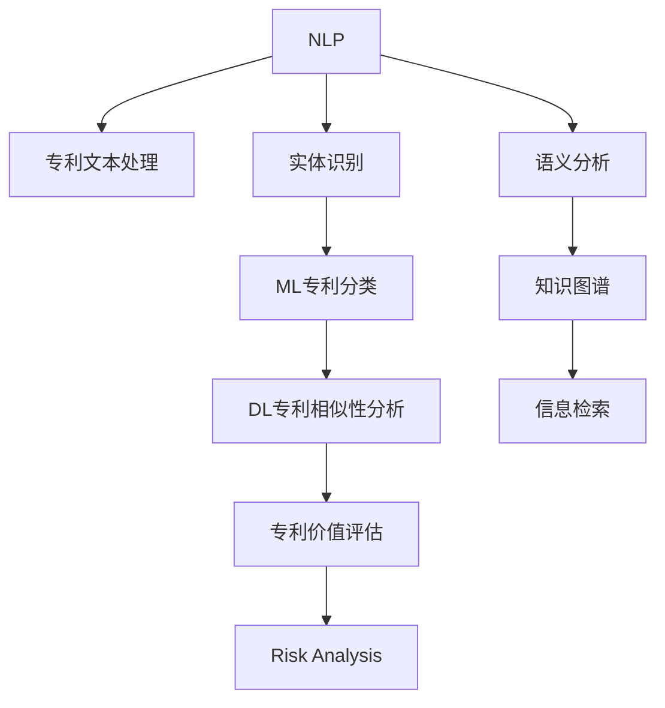

                 

# AI在专利分析与管理中的作用

## 1. 背景介绍

### 1.1 问题由来
专利是科技创新和技术进步的重要体现，对于企业而言，有效的专利管理是增强竞争力的重要手段。然而，面对海量的专利文献和复杂的专利信息，传统的人工审查和管理方式面临诸多挑战。例如，专利检索和分析效率低、信息抽取不准确、知识挖掘难以实现等。

### 1.2 问题核心关键点
AI在专利分析与管理中的作用在于通过自动化和智能化的方式，提升专利检索、分类、对比、评估等方面的效率和准确性。其核心关键点包括：

1. **高效检索**：通过自然语言处理(NLP)技术，实现对海量专利文本的高效检索和定位。
2. **精确分类**：利用机器学习算法，对专利进行自动分类和聚类，提升分类的准确性和效率。
3. **深度对比**：运用深度学习模型，实现对专利技术的精确对比和相似性分析，帮助企业快速识别竞争对手和关键技术。
4. **知识挖掘**：通过知识图谱和语义分析技术，从专利文本中挖掘出关键信息，辅助研发决策。
5. **风险评估**：利用风险分析模型，评估专利的法律风险、市场前景和技术成熟度，辅助企业做出投资决策。

AI技术的引入，使得专利分析与管理更加智能化、高效化，从而提升企业创新能力和市场竞争力。

### 1.3 问题研究意义
AI在专利分析与管理中的应用，对于提升企业研发效率、优化专利组合、评估知识产权价值具有重要意义。它能够帮助企业：

1. **加速创新**：通过智能检索和分析，快速识别技术趋势和创新点，加速新产品和新技术的研发。
2. **优化组合**：通过专利组合分析，找到最佳专利布局策略，优化知识产权组合，最大化保护企业利益。
3. **降低风险**：通过风险评估和法律分析，降低专利侵权和诉讼风险，确保技术创新的顺利进行。
4. **提升价值**：通过深入挖掘专利信息，发现潜在的技术路线和市场机会，提升专利的市场价值。

## 2. 核心概念与联系

### 2.1 核心概念概述

为更好地理解AI在专利分析与管理中的应用，本节将介绍几个密切相关的核心概念：

- **自然语言处理(NLP)**：利用计算机技术和算法，使计算机能够理解和处理人类语言。在专利分析中，NLP技术用于文本处理、语义分析、实体识别等。
- **机器学习(ML)**：通过数据训练模型，使其具备学习能力和预测能力。在专利分类、相似性分析中，ML模型用于自动分类、聚类、对比等任务。
- **深度学习(DL)**：一种特殊的机器学习方法，通过多层神经网络实现对复杂数据的处理和分析。在专利相似性分析、知识图谱构建中，DL模型用于提取隐含特征和建立知识结构。
- **知识图谱(KG)**：一种以图形结构表示的知识库，用于存储和关联各种知识实体及其关系。在专利知识挖掘中，KG用于构建专利关系网络，辅助信息检索和知识推理。
- **风险分析(RA)**：通过量化和预测方法，评估专利可能面临的法律风险、技术风险和市场风险。在专利价值评估中，RA模型用于风险预测和决策支持。

这些核心概念之间的逻辑关系可以通过以下Mermaid流程图来展示：



这个流程图展示了NLP、ML、DL、KG、RA等技术在专利分析与管理中的应用，以及它们之间的相互协作关系。

## 3. 核心算法原理 & 具体操作步骤

### 3.1 算法原理概述

AI在专利分析与管理中的核心算法原理主要包括以下几个方面：

- **文本处理**：通过NLP技术，将专利文本转化为计算机可处理的结构化数据，包括分词、命名实体识别、情感分析等。
- **相似性分析**：利用ML和DL算法，对专利技术进行相似性度量和分类，识别技术领域和竞争对手。
- **知识图谱构建**：通过KG技术，将专利信息转化为知识图谱，构建专利关系网络，辅助信息检索和知识推理。
- **风险评估**：应用RA模型，对专利的法律风险、市场前景和技术成熟度进行评估，辅助企业做出投资决策。

### 3.2 算法步骤详解

基于AI的专利分析与管理一般包括以下几个关键步骤：

**Step 1: 数据收集与预处理**
- 收集海量专利文本数据，包括专利说明书、摘要、权利要求等。
- 对专利文本进行分词、命名实体识别、情感分析等预处理，转换为结构化数据。

**Step 2: 相似性分析与分类**
- 利用ML模型，对专利进行自动分类和聚类，提升分类的准确性和效率。
- 应用DL模型，对专利技术进行相似性分析，识别关键技术点和竞争对手。

**Step 3: 知识图谱构建**
- 构建专利知识图谱，利用KG技术，关联专利之间的技术关系、发明人关系等。
- 使用语义分析技术，对专利文本进行实体抽取和关系推理，构建更深层次的知识网络。

**Step 4: 风险评估与价值评估**
- 应用RA模型，对专利的法律风险、市场前景和技术成熟度进行评估，辅助企业做出投资决策。
- 通过分析专利技术的关键点、技术链和市场价值，评估专利的价值和潜力。

**Step 5: 信息检索与决策支持**
- 利用NLP和KG技术，实现对海量专利的高效检索和定位，提供精准的信息检索结果。
- 通过分析检索结果，结合企业战略和市场需求，辅助企业做出技术研发和知识产权管理决策。

### 3.3 算法优缺点

AI在专利分析与管理中的应用具有以下优点：
1. **高效性**：自动化处理海量专利数据，提升检索和分析的效率。
2. **准确性**：利用ML和DL模型，提高分类的准确性和相似性分析的精度。
3. **深度挖掘**：通过KG和语义分析技术，深入挖掘专利文本中的隐含信息。
4. **决策支持**：结合RA模型，辅助企业进行技术研发和知识产权管理的决策。

同时，该方法也存在一定的局限性：
1. **数据依赖**：模型的效果依赖于专利数据的质量和标注情况，数据偏见可能影响模型性能。
2. **算法复杂性**：AI算法复杂度高，需要强大的计算资源和专业知识，对数据的处理要求高。
3. **解释性不足**：部分AI模型，如深度学习模型，输出结果缺乏解释性，难以理解其内部工作机制。
4. **隐私风险**：处理专利数据涉及企业机密，需要严格的数据隐私保护措施。

尽管存在这些局限性，但就目前而言，AI在专利分析与管理中的应用已经展现出了巨大的潜力和优势。未来相关研究的重点在于如何进一步降低算法复杂度，提高模型的可解释性和鲁棒性，同时兼顾数据隐私保护。

### 3.4 算法应用领域

AI在专利分析与管理中的应用领域广泛，包括但不限于以下几方面：

- **专利检索与定位**：通过自然语言处理技术，快速定位相关专利文本，提供检索结果和摘要。
- **专利分类与聚类**：利用机器学习模型，对专利进行自动分类和聚类，提升分类的准确性和效率。
- **专利对比与分析**：应用深度学习模型，实现专利技术的相似性分析和对比，识别竞争对手和关键技术点。
- **专利知识图谱**：通过知识图谱技术，构建专利关系网络，辅助信息检索和知识推理。
- **专利风险评估**：利用风险分析模型，评估专利的法律风险、市场前景和技术成熟度，辅助企业做出投资决策。
- **专利价值评估**：通过分析专利技术的关键点、技术链和市场价值，评估专利的价值和潜力。

## 4. 数学模型和公式 & 详细讲解 & 举例说明

### 4.1 数学模型构建

本节将使用数学语言对AI在专利分析与管理中的应用进行更加严格的刻画。

记专利文本为 $D=\{x_i\}_{i=1}^N$，其中 $x_i$ 表示第 $i$ 个专利文本。假设文本处理后，将每个专利文本转换为向量表示 $X_i \in \mathbb{R}^d$，其中 $d$ 为向量维度。

定义专利相似度函数为 $\sigma(X_i, X_j)$，其中 $X_i, X_j$ 分别表示两个专利文本的向量表示。

定义专利分类函数为 $c(X_i)$，将专利文本 $X_i$ 分类到第 $c_i$ 类中。

定义专利风险评估函数为 $r(X_i)$，对专利 $X_i$ 进行风险评估，生成风险指数。

定义专利价值评估函数为 $v(X_i)$，对专利 $X_i$ 进行价值评估，生成价值指数。

### 4.2 公式推导过程

以下我们以专利分类任务为例，推导分类模型的训练和预测过程。

假设训练集为 $D_{train}=\{(X_i, c_i)\}_{i=1}^M$，其中 $X_i$ 为专利文本向量，$c_i$ 为对应的分类标签。模型采用多层感知器(MLP)结构，其输入为 $X$，输出为 $y$。模型定义如下：

$$
y = \sigma(W_h \cdot X + b_h + W_l \cdot y_h + b_l)
$$

其中 $W_h$ 和 $b_h$ 为隐藏层的权重和偏置，$y_h$ 为隐藏层的输出，$W_l$ 和 $b_l$ 为输出层的权重和偏置，$\sigma$ 为激活函数。

模型的损失函数为交叉熵损失：

$$
L(y, \hat{y}) = -\sum_{i=1}^M c_i \log \hat{y}_i
$$

其中 $\hat{y}_i$ 为模型对第 $i$ 个样本的分类预测结果。

模型训练的优化目标是最小化损失函数，即：

$$
\theta^* = \mathop{\arg\min}_{\theta} L(y, \hat{y})
$$

其中 $\theta$ 为模型参数，包括权重和偏置。

在得到分类模型后，对测试集 $D_{test}$ 中的每个专利文本 $X_i$ 进行预测，生成分类结果 $\hat{y}_i$，具体过程如下：

1. 将 $X_i$ 输入模型，得到隐藏层输出 $y_h$。
2. 将 $y_h$ 输入输出层，得到分类预测结果 $\hat{y}_i$。
3. 根据 $\hat{y}_i$ 和真实标签 $c_i$，计算损失，更新模型参数。

在得到模型预测结果后，利用混淆矩阵、F1分数等指标评估模型的分类性能。

## 5. 项目实践：代码实例和详细解释说明

### 5.1 开发环境搭建

在进行专利分析与管理项目的开发前，我们需要准备好开发环境。以下是使用Python进行项目开发的完整环境配置流程：

1. 安装Python：从官网下载并安装Python，建议使用3.8及以上版本。
2. 安装Pandas：用于数据处理和存储，是进行文本处理和数据分析的基础库。
3. 安装Numpy：用于高效的数组运算和数学计算，在深度学习模型中广泛使用。
4. 安装Scikit-Learn：用于机器学习和数据挖掘，提供丰富的算法和工具。
5. 安装TensorFlow或PyTorch：用于构建和训练深度学习模型，是目前主流的深度学习框架。
6. 安装Keras：用于简化深度学习模型的构建和训练，提供高层API，易于上手。

完成上述步骤后，即可在Python环境中开始项目开发。

### 5.2 源代码详细实现

这里我们以专利分类任务为例，使用TensorFlow构建多层感知器模型，并应用到专利文本数据集上。

```python
import tensorflow as tf
from sklearn.model_selection import train_test_split
from sklearn.preprocessing import LabelEncoder
from sklearn.metrics import confusion_matrix, f1_score
import pandas as pd
import numpy as np

# 读取专利数据集
data = pd.read_csv('patents.csv')

# 数据预处理：文本分词和向量表示
# 假设已经使用NLTK等库完成分词，并将文本转换为向量表示X
X = ...

# 标签编码
encoder = LabelEncoder()
y = encoder.fit_transform(data['category'])

# 划分训练集和测试集
X_train, X_test, y_train, y_test = train_test_split(X, y, test_size=0.2, random_state=42)

# 定义模型
model = tf.keras.Sequential([
    tf.keras.layers.Dense(64, activation='relu', input_shape=(X.shape[1],)),
    tf.keras.layers.Dense(32, activation='relu'),
    tf.keras.layers.Dense(8, activation='softmax')
])

# 编译模型
model.compile(optimizer='adam', loss='sparse_categorical_crossentropy', metrics=['accuracy'])

# 训练模型
model.fit(X_train, y_train, epochs=10, batch_size=32, validation_data=(X_test, y_test))

# 预测和评估
y_pred = model.predict(X_test)
y_pred = np.argmax(y_pred, axis=1)

print('Confusion Matrix:')
print(confusion_matrix(y_test, y_pred))

print('F1 Score:')
print(f1_score(y_test, y_pred, average='macro'))
```

### 5.3 代码解读与分析

让我们再详细解读一下关键代码的实现细节：

**数据预处理**：
- `LabelEncoder`：用于将分类标签转换为整数编码，方便模型训练。
- `train_test_split`：用于划分训练集和测试集。

**模型定义**：
- `Sequential`：用于定义序列模型，添加多个层。
- `Dense`：全连接层，用于实现多层感知器模型。

**模型训练**：
- `compile`：定义模型的优化器、损失函数和评估指标。
- `fit`：用于训练模型，输入训练集和测试集。

**预测与评估**：
- `predict`：用于对测试集进行预测。
- `argmax`：用于将预测结果转换为分类标签。

在实际应用中，需要根据具体任务对代码进行适当调整和优化。例如，对于深度学习模型，可以使用更复杂的模型结构和更多的训练技巧，如批量标准化、正则化、梯度积累等，以提升模型性能。

## 6. 实际应用场景

### 6.1 专利检索与定位

AI在专利检索与定位中的应用，可以通过自然语言处理技术实现。例如，利用关键词匹配、语义相似度等方法，对海量专利文本进行快速定位和筛选，找到最相关的专利文献。

在实际应用中，可以构建一个在线的专利检索系统，用户输入查询关键词或技术描述，系统自动从专利数据库中匹配和排序，返回相关的专利列表。

### 6.2 专利分类与聚类

通过机器学习模型，对专利进行自动分类和聚类，提升分类的准确性和效率。例如，利用支持向量机(SVM)、随机森林(Random Forest)等算法，对专利进行多类别分类。利用K-Means、层次聚类等算法，对专利进行聚类分析，找到专利之间的相似性和共性。

在实际应用中，可以构建一个专利分类和聚类系统，对企业内部和外部的大量专利数据进行自动分类和聚类，帮助企业了解技术领域和竞争对手。

### 6.3 专利对比与分析

应用深度学习模型，对专利技术进行相似性分析和对比，识别关键技术点和竞争对手。例如，利用CNN、RNN、LSTM等模型，提取专利文本的特征向量，计算相似度矩阵，找到最相似的专利文献。利用图神经网络(GNN)，构建专利技术关系图，分析专利之间的技术依赖和创新链条。

在实际应用中，可以构建一个专利对比和分析系统，对企业内部的专利文献进行相似性分析，找到重要的技术创新点和竞争对手，为技术研发提供决策支持。

### 6.4 专利知识图谱

通过知识图谱技术，构建专利关系网络，辅助信息检索和知识推理。例如，利用RDF、Turtle等语义表示语言，构建专利知识图谱，存储专利文本、发明人、引用关系等信息。利用语义分析技术，对专利文本进行实体抽取和关系推理，构建更深层次的知识网络。

在实际应用中，可以构建一个专利知识图谱系统，对企业内部的专利数据进行知识图谱构建和查询，帮助企业发现技术创新点和新知识，推动技术创新和知识传播。

### 6.5 专利风险评估

利用风险分析模型，对专利的法律风险、市场前景和技术成熟度进行评估，辅助企业做出投资决策。例如，利用逻辑回归模型、决策树等算法，对专利的法律风险进行预测，评估专利是否存在侵权风险。利用回归模型、时间序列模型等算法，对专利的市场前景进行预测，评估专利的市场潜力和商业价值。利用聚类模型、神经网络等算法，对专利的技术成熟度进行评估，评估专利的技术先进性和创新性。

在实际应用中，可以构建一个专利风险评估系统，对企业的专利组合进行风险评估，帮助企业规避专利侵权和诉讼风险，最大化知识产权保护。

### 6.6 专利价值评估

通过分析专利技术的关键点、技术链和市场价值，评估专利的价值和潜力。例如，利用神经网络模型、决策树等算法，对专利的技术关键点进行挖掘，评估专利的技术创新性和价值。利用市场数据、竞争分析等手段，对专利的市场前景进行预测，评估专利的市场潜力和商业价值。利用技术依赖分析、技术链分析等手段，评估专利的技术关联性和创新链条。

在实际应用中，可以构建一个专利价值评估系统，对企业的专利组合进行价值评估，帮助企业优化专利组合，最大化专利的市场价值和经济效益。

## 7. 工具和资源推荐

### 7.1 学习资源推荐

为了帮助开发者系统掌握AI在专利分析与管理中的应用，这里推荐一些优质的学习资源：

1. 《深度学习》课程：斯坦福大学开设的深度学习课程，系统介绍深度学习的基本概念和算法。
2. 《自然语言处理》课程：斯坦福大学开设的自然语言处理课程，涵盖自然语言处理的基本技术和方法。
3. 《机器学习实战》书籍：一本实战性很强的机器学习书籍，介绍各种机器学习算法的实现和应用。
4. 《TensorFlow实战》书籍：一本介绍TensorFlow的实战书籍，涵盖TensorFlow的架构和应用。
5. 《专利信息检索与分析》书籍：一本专注于专利信息检索和分析的书籍，介绍各种专利分析技术。

通过对这些资源的学习实践，相信你一定能够快速掌握AI在专利分析与管理中的应用，并用于解决实际的专利问题。

### 7.2 开发工具推荐

高效的开发离不开优秀的工具支持。以下是几款用于AI在专利分析与管理开发的常用工具：

1. Jupyter Notebook：开源的交互式笔记本环境，支持Python代码的编写和运行。
2. PyTorch：基于Python的深度学习框架，灵活高效，易于使用。
3. TensorFlow：由Google主导的深度学习框架，生产部署方便，支持分布式计算。
4. Keras：高层次的深度学习框架，易于上手，提供丰富的预训练模型。
5. Scikit-Learn：开源的机器学习库，提供丰富的算法和工具，易于使用。

合理利用这些工具，可以显著提升AI在专利分析与管理任务的开发效率，加快创新迭代的步伐。

### 7.3 相关论文推荐

AI在专利分析与管理中的应用源于学界的持续研究。以下是几篇奠基性的相关论文，推荐阅读：

1. "A Survey of Patent Retrieval: Concepts and Practices"：综述了专利检索的技术和实践，介绍了各种检索方法。
2. "Classification of Patent Documents by Machine Learning"：介绍利用机器学习算法对专利进行分类的研究。
3. "Semantic Analysis of Patent Abstracts Using Deep Learning"：介绍利用深度学习模型对专利文本进行语义分析的研究。
4. "Knowledge Graphs for Patent Analysis"：介绍利用知识图谱技术对专利信息进行分析和推理的研究。
5. "Risk Assessment of Patent Infringement"：介绍利用风险分析模型对专利侵权风险进行评估的研究。

这些论文代表了大语言模型微调技术的发展脉络。通过学习这些前沿成果，可以帮助研究者把握学科前进方向，激发更多的创新灵感。

## 8. 总结：未来发展趋势与挑战

### 8.1 总结

本文对AI在专利分析与管理中的应用进行了全面系统的介绍。首先阐述了AI在专利分析与管理中的研究背景和意义，明确了AI技术在提升专利检索、分类、对比、评估等方面的独特价值。其次，从原理到实践，详细讲解了AI在专利分析与管理中的应用，给出了实际应用的代码实现。同时，本文还广泛探讨了AI在专利检索、分类、对比、聚类、知识图谱构建、风险评估等方面的应用前景，展示了AI技术的广泛潜力。最后，本文精选了AI在专利分析与管理领域的学习资源、开发工具和相关论文，力求为读者提供全方位的技术指引。

通过本文的系统梳理，可以看到，AI在专利分析与管理中的应用已经展现出了巨大的潜力和优势。AI技术能够高效处理海量专利数据，提升专利检索、分类、对比和评估的效率和准确性，为企业的技术研发和知识产权管理提供强大的支持。未来，伴随AI技术的不断演进，专利分析与管理将迈向更加智能化、高效化和精准化，助力企业在竞争激烈的科技市场中取得更大优势。

### 8.2 未来发展趋势

展望未来，AI在专利分析与管理中的应用将呈现以下几个发展趋势：

1. **多模态分析**：结合文本、图像、音频等多模态数据，进行更全面、深入的技术分析，提升专利分析的深度和广度。
2. **跨领域应用**：将AI技术应用于不同领域的专利分析，如医疗、法律、金融等，提升各领域的专利管理水平。
3. **实时分析**：利用实时数据流处理技术，进行专利信息的实时分析和处理，提升企业对技术趋势的把握能力。
4. **个性化推荐**：利用推荐系统技术，对专利数据进行个性化推荐，辅助企业选择合适的专利文献和技术。
5. **联邦学习**：利用联邦学习技术，保护数据隐私的同时，实现分布式数据下的专利分析与学习。

以上趋势凸显了AI在专利分析与管理领域的广阔前景。这些方向的探索发展，必将进一步提升专利分析与管理系统的效率和效果，为企业的技术创新和知识产权保护提供更强大的支持。

### 8.3 面临的挑战

尽管AI在专利分析与管理中的应用已经取得显著进展，但在迈向更加智能化、普适化应用的过程中，它仍面临诸多挑战：

1. **数据质量问题**：专利数据质量参差不齐，数据偏见和噪声可能影响模型效果。
2. **模型鲁棒性不足**：模型在不同领域、不同任务上的鲁棒性和泛化能力有待提升。
3. **隐私与安全问题**：专利数据涉及企业机密，数据隐私和安全问题需要严格保护。
4. **算法复杂性**：AI算法复杂度高，需要强大的计算资源和专业知识，对数据的处理要求高。
5. **模型可解释性不足**：部分AI模型，如深度学习模型，输出结果缺乏解释性，难以理解其内部工作机制。

尽管存在这些挑战，但通过不断的技术创新和算法优化，AI在专利分析与管理中的应用将会进一步提升和完善，助力企业在技术创新和知识产权保护方面取得更大成就。

### 8.4 研究展望

未来，研究需要在以下几个方面寻求新的突破：

1. **数据增强**：利用数据增强技术，提升模型对专利数据的处理能力和鲁棒性。
2. **模型压缩**：采用模型压缩技术，减小模型规模，提升模型推理速度和资源效率。
3. **跨领域学习**：利用跨领域学习技术，提升模型在不同领域的泛化能力和适应性。
4. **联邦学习**：利用联邦学习技术，保护数据隐私的同时，实现分布式数据下的专利分析与学习。
5. **可解释性**：研究可解释性技术，提升AI模型的透明性和可解释性，增强用户对模型的信任。

这些研究方向的探索，必将引领AI在专利分析与管理领域的技术进步，为企业的技术研发和知识产权保护提供更加全面和高效的支持。总之，AI在专利分析与管理中的研究与应用，将在推动技术创新、优化知识产权保护、提升企业竞争力等方面发挥越来越重要的作用。

## 9. 附录：常见问题与解答

**Q1：如何评估AI在专利分析与管理中的效果？**

A: AI在专利分析与管理中的效果评估可以从以下几个方面进行：
1. **检索准确率**：评估AI系统在专利检索中的准确率和召回率。
2. **分类准确率**：评估AI系统对专利分类的准确率和召回率。
3. **相似度匹配率**：评估AI系统在专利相似性分析中的匹配率和精确度。
4. **知识图谱构建质量**：评估AI系统构建的知识图谱的质量和完整性。
5. **风险评估精度**：评估AI系统对专利风险的预测精度和可靠性。
6. **价值评估精度**：评估AI系统对专利价值的评估精度和合理性。

通过这些指标的评估，可以全面了解AI在专利分析与管理中的表现，发现问题并进行改进。

**Q2：在专利分析与管理中，如何选择和训练AI模型？**

A: 在专利分析与管理中，选择和训练AI模型需要考虑以下几个因素：
1. **数据量与质量**：根据数据量和质量选择适合的数据处理方法和模型算法。
2. **任务类型**：根据专利检索、分类、对比等不同任务类型，选择适合的模型结构和训练方法。
3. **计算资源**：根据计算资源和设备条件，选择合适的模型复杂度和训练策略。
4. **模型性能**：根据模型的准确率、召回率、鲁棒性等性能指标，评估模型的效果并进行优化。
5. **应用场景**：根据实际应用场景，考虑模型的可解释性、可部署性和可维护性，选择适合的模型和工具。

在训练模型时，可以采用常见的深度学习框架（如TensorFlow、PyTorch等），利用开源机器学习库（如Scikit-Learn等），选择适合的算法和模型，进行数据预处理、模型训练、评估和优化，最终得到满足实际需求的AI模型。

**Q3：在专利分析与管理中，如何保护数据隐私？**

A: 在专利分析与管理中，保护数据隐私是至关重要的。以下是几种常用的数据隐私保护方法：
1. **数据匿名化**：对专利数据进行匿名化处理，去除敏感信息，保护企业机密。
2. **差分隐私**：在模型训练和推理过程中，引入差分隐私机制，保护数据隐私。
3. **联邦学习**：利用联邦学习技术，在分布式数据环境下进行模型训练和推理，保护数据隐私。
4. **访问控制**：对数据访问进行严格控制，限制数据的读写权限，防止数据泄露。
5. **加密技术**：对数据进行加密处理，保护数据在传输和存储过程中的安全性。

通过这些方法，可以在保证数据隐私和安全性的前提下，进行专利数据的分析和处理，提升AI在专利分析与管理中的应用效果。

**Q4：在专利分析与管理中，如何优化AI模型的性能？**

A: 在专利分析与管理中，优化AI模型的性能可以从以下几个方面进行：
1. **模型结构优化**：通过调整模型结构和层数，提高模型的精度和效率。
2. **超参数调优**：通过调整学习率、批大小、迭代次数等超参数，优化模型的训练效果。
3. **数据增强**：通过数据增强技术，扩充训练数据集，提高模型的泛化能力和鲁棒性。
4. **正则化技术**：通过引入L2正则、Dropout等正则化技术，防止过拟合，提高模型泛化能力。
5. **迁移学习**：通过迁移学习技术，利用预训练模型的知识和经验，提升模型的训练效果和泛化能力。
6. **模型压缩**：通过模型压缩技术，减小模型规模，提高模型推理速度和资源效率。

通过这些优化方法，可以显著提升AI模型在专利分析与管理中的性能，提高模型的准确率和鲁棒性，满足实际应用的需求。

**Q5：在专利分析与管理中，如何选择和评估算法？**

A: 在专利分析与管理中，选择和评估算法需要考虑以下几个因素：
1. **任务类型**：根据专利检索、分类、对比等不同任务类型，选择适合的算法和模型。
2. **数据特性**：根据专利数据的分布特性和质量情况，选择适合的算法和模型。
3. **性能指标**：根据模型的准确率、召回率、F1分数等性能指标，评估算法的表现。
4. **资源要求**：根据计算资源和设备条件，选择适合的算法和模型，优化计算效率。
5. **可解释性**：根据实际应用需求，选择可解释性高、易维护的算法和模型。

在选择算法时，可以参考最新的学术研究和工业实践，选择适合的算法和模型。在评估算法时，可以通过交叉验证、AUC曲线、ROC曲线等方法，全面评估算法的性能和效果。

**Q6：在专利分析与管理中，如何处理数据偏见？**

A: 在专利分析与管理中，处理数据偏见可以从以下几个方面进行：
1. **数据清洗**：对数据进行清洗，去除数据中的偏见和噪声，提高数据质量。
2. **数据增强**：通过数据增强技术，扩充训练数据集，减少数据偏见的影响。
3. **公平性约束**：在模型训练和推理过程中，引入公平性约束，减少模型的偏见和歧视。
4. **数据多样性**：收集多样化的数据，提高模型的泛化能力和鲁棒性。
5. **算法优化**：通过优化算法，提高模型的公平性和准确性。

通过这些方法，可以有效处理专利数据中的偏见，提升AI模型的公平性和准确性，确保模型的公正性和可靠性。

**Q7：在专利分析与管理中，如何构建知识图谱？**

A: 在专利分析与管理中，构建知识图谱需要以下步骤：
1. **数据收集**：收集专利文本、发明人、引用关系等信息，构建知识图谱的基础数据。
2. **实体识别**：利用自然语言处理技术，对专利文本进行实体识别，提取专利的关键信息。
3. **关系抽取**：利用关系抽取技术，识别专利之间的技术依赖和关联关系，构建知识图谱的关系网络。
4. **知识推理**：利用知识推理技术，对知识图谱进行推理和分析，提取更深层次的知识信息。
5. **可视化展示**：利用可视化工具，展示知识图谱的结构和信息，辅助专利分析与管理。

通过这些步骤，可以构建一个完整的专利知识图谱，辅助专利信息检索和知识推理，提升专利分析与管理的效果和效率。

---

作者：禅与计算机程序设计艺术 / Zen and the Art of Computer Programming

