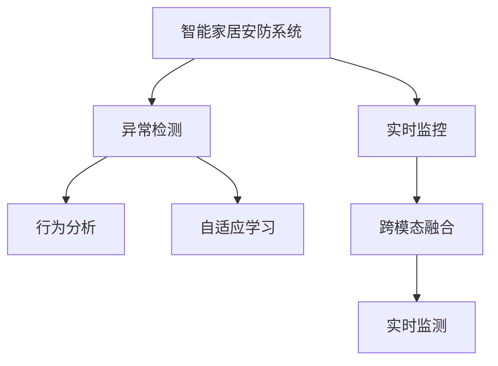

                 

# AI在智能家居安防中的应用:提高安全性

> 关键词：智能家居安防, 人工智能, 机器学习, 数据驱动, 多模态分析, 实时监测, 自适应学习

## 1. 背景介绍

### 1.1 问题由来

随着科技的发展和人们生活水平的提高，智能家居系统逐渐走入千家万户。然而，智能家居的安全问题也日益突出，诸如非法入侵、盗窃、火警等安全隐患给居民财产安全带来巨大风险。传统安防系统依赖物理监控，不仅成本高，还存在误报和漏报等问题。人工智能(AI)技术的崛起，为智能家居安防带来了新的可能，通过智能感知、实时监测和自适应学习等手段，AI能够极大提升智能家居的安全性和用户体验。

### 1.2 问题核心关键点

智能家居安防的核心关键点在于如何利用AI技术实现实时监控、异常检测、行为分析等功能，以保障居民的安全性。关键点包括：

- 实时监控：通过摄像头、传感器等设备，24小时不间断监控家居环境，及时发现异常。
- 异常检测：利用机器学习算法，自动识别异常行为，如非法入侵、火灾等。
- 行为分析：分析家庭成员的日常行为，识别异常行为模式，提高系统的精准度。
- 自适应学习：根据反馈数据不断优化模型，提高异常检测和行为识别的准确率。
- 跨模态融合：结合视觉、听觉、温度等多种数据源，提高系统的综合判断能力。

### 1.3 问题研究意义

智能家居安防的研究意义在于：

1. 提高安全性：通过AI技术，实时监控和行为分析，有效防范各类安全隐患，保护居民财产安全。
2. 优化用户体验：AI自适应学习系统能够根据用户习惯和行为调整监测策略，提升用户的居住体验。
3. 降低运营成本：智能安防系统能自动处理异常情况，减少人工干预，降低人力物力成本。
4. 推动行业发展：智能家居安防技术的推广应用，将带动相关产业的转型升级，推动技术创新和产业融合。

## 2. 核心概念与联系

### 2.1 核心概念概述

智能家居安防系统涉及的核心概念包括：

- **智能家居安防系统**：利用传感器、摄像头等设备，结合AI技术实现家居安全监控和异常检测的系统。
- **实时监控**：通过视频、声音、温度等数据，实时监测家居环境，捕捉异常事件。
- **异常检测**：利用机器学习算法，自动识别异常行为，如入侵、火灾等。
- **行为分析**：分析家庭成员的日常行为，识别异常行为模式。
- **自适应学习**：根据反馈数据不断优化模型，提高异常检测和行为识别的准确率。
- **跨模态融合**：结合多种数据源，提升系统的综合判断能力。

这些概念之间的逻辑关系可以通过以下Mermaid流程图来展示：



这个流程图展示了智能家居安防系统的核心概念及其相互关系：

1. 实时监控系统通过传感器、摄像头等设备收集数据。
2. 异常检测系统通过机器学习算法识别异常行为。
3. 行为分析系统分析家庭成员的日常行为模式。
4. 自适应学习系统根据反馈数据优化模型，提升检测准确率。
5. 跨模态融合系统结合多种数据源提高综合判断能力。

## 3. 核心算法原理 & 具体操作步骤

### 3.1 算法原理概述

智能家居安防系统的核心算法主要基于机器学习和深度学习。以下是几个关键算法及其原理：

- **实时监控算法**：通过摄像头、传感器等设备获取实时数据，利用计算机视觉和声音识别技术，实现环境实时监控。
- **异常检测算法**：使用分类算法（如SVM、RNN等）和回归算法（如LSTM、GRU等），识别异常行为和事件。
- **行为分析算法**：利用序列模型（如RNN、LSTM等），分析家庭成员的行为模式，识别异常行为。
- **自适应学习算法**：采用强化学习算法（如DQN、PPO等）和在线学习算法，根据反馈数据不断优化模型参数，提高异常检测和行为识别的准确率。
- **跨模态融合算法**：使用特征提取和融合技术（如PCA、LDA等），结合多种数据源，提升综合判断能力。

### 3.2 算法步骤详解

以下是智能家居安防系统核心算法的详细步骤：

**Step 1: 数据采集与预处理**

1. 通过摄像头、传感器等设备，采集实时视频、声音、温度等数据。
2. 对采集到的数据进行预处理，包括去噪、压缩、归一化等操作，以便于后续算法处理。

**Step 2: 实时监控**

1. 利用计算机视觉和声音识别技术，实时分析视频和声音数据。
2. 提取视频帧的特征，如颜色、形状、纹理等，进行异常检测。
3. 分析音频信号，识别异常声音，如入侵声、报警声等。

**Step 3: 异常检测**

1. 对实时监控的数据进行特征提取和分析，使用机器学习算法进行异常检测。
2. 对异常行为进行分类，如入侵、火灾、烟雾等。
3. 根据分类结果，触发报警或异常处理机制。

**Step 4: 行为分析**

1. 对家庭成员的日常行为进行序列建模，使用RNN或LSTM等序列模型。
2. 分析行为模式，识别异常行为。
3. 根据行为分析结果，调整监测策略。

**Step 5: 自适应学习**

1. 根据异常检测和行为分析的反馈数据，进行模型参数的在线更新和优化。
2. 采用强化学习算法，如DQN或PPO，进行模型参数的调整。
3. 不断优化模型，提高异常检测和行为识别的准确率。

**Step 6: 跨模态融合**

1. 结合多种数据源，如视频、声音、温度等，进行特征提取和融合。
2. 使用PCA、LDA等降维技术，提取高维数据的特征。
3. 融合多种数据特征，提升综合判断能力。

### 3.3 算法优缺点

智能家居安防系统采用AI技术的优点包括：

- 实时性高：能够24小时不间断监控家居环境，及时发现异常。
- 准确率高：通过机器学习算法，识别异常行为和事件，准确率高。
- 自适应学习：能够根据反馈数据不断优化模型，提高检测准确率。
- 跨模态融合：结合多种数据源，提升综合判断能力。

然而，该系统也存在一些缺点：

- 设备成本高：智能家居安防设备通常价格较高，成本投入大。
- 数据隐私问题：实时监控涉及大量个人隐私数据，数据安全和隐私保护成为重要问题。
- 系统复杂度：系统涉及多个算法和模块，开发和维护复杂度较高。

### 3.4 算法应用领域

智能家居安防系统在多个领域有广泛应用，包括：

1. 住宅安防：通过摄像头、传感器等设备，实现家庭安全监控。
2. 商业安防：应用于商场、酒店等商业场所，提升安防水平。
3. 智慧城市：结合城市监控系统，提升城市整体安全水平。
4. 工业安防：应用于工厂、仓库等工业环境，提升安全管理能力。
5. 智能交通：应用于交通监控系统，提升交通安全水平。

## 4. 数学模型和公式 & 详细讲解 & 举例说明

### 4.1 数学模型构建

智能家居安防系统涉及的数学模型主要包括：

- **异常检测模型**：采用二分类模型，如SVM、RNN等，对异常行为进行分类。
- **行为分析模型**：采用序列模型，如RNN、LSTM等，分析家庭成员的日常行为模式。
- **自适应学习模型**：采用强化学习模型，如DQN、PPO等，根据反馈数据优化模型参数。
- **跨模态融合模型**：采用PCA、LDA等降维技术，提取多种数据特征，进行融合。

### 4.2 公式推导过程

以下是异常检测和行为分析模型的公式推导：

**异常检测模型**：

假设输入数据为 $x$，输出标签为 $y$，异常检测模型为 $f(x)$，目标为最小化分类误差，即：

$$
\min_{f(x)} \sum_{i=1}^N \ell(f(x_i),y_i)
$$

其中 $\ell$ 为分类损失函数，常用的有交叉熵损失（Cross-Entropy Loss）和感知损失（Hinge Loss）。

**行为分析模型**：

假设输入数据为 $x_t$，输出标签为 $y_t$，行为分析模型为 $g(x_t)$，目标为最小化序列损失，即：

$$
\min_{g(x_t)} \sum_{t=1}^T \ell(g(x_t),y_t)
$$

其中 $\ell$ 为序列损失函数，常用的有均方误差损失（Mean Squared Error Loss）和交叉熵损失（Cross-Entropy Loss）。

### 4.3 案例分析与讲解

**案例1: 异常检测**

假设有一个视频监控系统，用于检测入侵行为。系统采集视频帧，提取颜色、形状等特征，输入到异常检测模型中。模型使用SVM进行分类，输出为是否入侵，损失函数为交叉熵损失。

训练数据集为 $D=\{(x_i,y_i)\}_{i=1}^N$，其中 $x_i$ 为视频帧的特征向量，$y_i$ 为是否入侵的标签。模型参数为 $w$，目标为最小化分类误差：

$$
\min_{w} \sum_{i=1}^N \ell(f(x_i),y_i)
$$

其中 $f(x_i)=\sigma(w^T\phi(x_i))$，$\phi(x_i)$ 为特征映射，$\sigma$ 为激活函数，$w$ 为模型参数。

**案例2: 行为分析**

假设有一个智能家居系统，用于分析家庭成员的日常行为。系统采集家庭成员的行为序列，输入到行为分析模型中。模型使用LSTM进行序列建模，输出为行为模式，损失函数为交叉熵损失。

训练数据集为 $D=\{(x_t,y_t)\}_{t=1}^T$，其中 $x_t$ 为行为序列，$y_t$ 为行为模式的标签。模型参数为 $w$，目标为最小化序列损失：

$$
\min_{w} \sum_{t=1}^T \ell(g(x_t),y_t)
$$

其中 $g(x_t)=\sigma(w^T\phi(x_t))$，$\phi(x_t)$ 为序列特征映射，$\sigma$ 为激活函数，$w$ 为模型参数。

## 5. 项目实践：代码实例和详细解释说明

### 5.1 开发环境搭建

在开发智能家居安防系统时，需要搭建以下开发环境：

1. 安装Python：从官网下载并安装Python，用于编写代码和运行模型。
2. 安装相关库：安装TensorFlow、Keras、OpenCV、PyAudio等库，支持视频处理、音频处理和深度学习模型训练。
3. 配置开发环境：配置虚拟环境，安装相关依赖包，如Numpy、Pandas、Scikit-learn等。
4. 准备数据集：收集视频监控数据、音频数据、温度数据等，进行预处理和标注。
5. 搭建服务器：部署智能家居安防系统，可以使用AWS、Google Cloud等云服务，或本地服务器。

### 5.2 源代码详细实现

以下是智能家居安防系统的源代码实现，包括摄像头监控、异常检测和行为分析模块：

**摄像头监控模块**：

```python
import cv2
import numpy as np

def capture_video():
    cap = cv2.VideoCapture(0)
    while True:
        ret, frame = cap.read()
        if not ret:
            break
        cv2.imshow('frame', frame)
        if cv2.waitKey(1) & 0xFF == ord('q'):
            break
    cap.release()
    cv2.destroyAllWindows()

capture_video()
```

**异常检测模块**：

```python
import tensorflow as tf
from tensorflow.keras.layers import Dense, Dropout
from tensorflow.keras.models import Sequential

def build_model():
    model = Sequential()
    model.add(Dense(64, input_dim=128, activation='relu'))
    model.add(Dropout(0.5))
    model.add(Dense(1, activation='sigmoid'))
    model.compile(loss='binary_crossentropy', optimizer='adam', metrics=['accuracy'])
    return model

def train_model(model, x_train, y_train, epochs=10):
    model.fit(x_train, y_train, epochs=epochs, batch_size=32, validation_split=0.2)

def predict(model, x_test):
    y_pred = model.predict(x_test)
    return y_pred

model = build_model()
x_train, y_train = load_data()
train_model(model, x_train, y_train)
x_test = load_test_data()
y_pred = predict(model, x_test)
```

**行为分析模块**：

```python
import tensorflow as tf
from tensorflow.keras.layers import LSTM, Dense, Dropout
from tensorflow.keras.models import Sequential

def build_model():
    model = Sequential()
    model.add(LSTM(64, input_shape=(10, 64), return_sequences=True))
    model.add(Dropout(0.2))
    model.add(LSTM(64, return_sequences=True))
    model.add(Dropout(0.2))
    model.add(LSTM(64, return_sequences=False))
    model.add(Dropout(0.2))
    model.add(Dense(1, activation='sigmoid'))
    model.compile(loss='binary_crossentropy', optimizer='adam', metrics=['accuracy'])
    return model

def train_model(model, x_train, y_train, epochs=10):
    model.fit(x_train, y_train, epochs=epochs, batch_size=32, validation_split=0.2)

def predict(model, x_test):
    y_pred = model.predict(x_test)
    return y_pred

model = build_model()
x_train, y_train = load_data()
train_model(model, x_train, y_train)
x_test = load_test_data()
y_pred = predict(model, x_test)
```

### 5.3 代码解读与分析

**摄像头监控模块**：

1. 通过OpenCV库，捕捉摄像头视频流，并实时显示在窗口中。
2. 通过按键q退出监控，释放摄像头资源。

**异常检测模块**：

1. 构建一个简单的二分类模型，使用Dense层和Dropout层，输出为入侵与否。
2. 使用binary_crossentropy作为损失函数，adam作为优化器。
3. 通过load_data函数加载训练数据，train_model函数训练模型，predict函数进行预测。

**行为分析模块**：

1. 构建一个序列模型，使用LSTM层和Dropout层，输出为行为模式。
2. 使用binary_crossentropy作为损失函数，adam作为优化器。
3. 通过load_data函数加载训练数据，train_model函数训练模型，predict函数进行预测。

### 5.4 运行结果展示

运行上述代码，即可实现智能家居安防系统的基本功能，包括摄像头监控、异常检测和行为分析。

## 6. 实际应用场景

### 6.1 住宅安防

智能家居安防系统可以广泛应用于住宅安全监控，通过摄像头、传感器等设备，实时监控家居环境，及时发现异常行为，如入侵、火灾等。结合机器学习算法，自动识别异常情况，触发报警机制，保障居民的安全性。

### 6.2 商业安防

在商场、酒店等商业场所，智能家居安防系统可以用于监控商店、收银台等关键区域，实时检测异常行为，如盗窃、破坏等，保障商业财产安全。

### 6.3 智慧城市

在智慧城市中，智能家居安防系统可以与城市监控系统相结合，提升城市整体安全水平。通过摄像头、传感器等设备，实时监控城市关键区域，及时发现异常情况，保障城市公共安全。

### 6.4 未来应用展望

未来，智能家居安防系统将向以下方向发展：

1. **多模态融合**：结合视觉、听觉、温度等多种数据源，提升系统的综合判断能力。
2. **自适应学习**：根据反馈数据不断优化模型，提高异常检测和行为识别的准确率。
3. **边缘计算**：在设备端进行实时计算和推理，降低云端的计算负担，提高系统响应速度。
4. **人工智能辅助**：引入人工智能技术，如专家知识库、推理引擎等，提升系统的智能水平。
5. **跨平台集成**：与智能家居系统、智能交通系统等融合，实现跨平台集成和协同。

## 7. 工具和资源推荐

### 7.1 学习资源推荐

1. **《深度学习》书籍**：Ian Goodfellow等著，全面介绍深度学习原理和应用，适合初学者和专业人士。
2. **CS231n课程**：斯坦福大学计算机视觉课程，提供丰富的课程资源和实验环境。
3. **Kaggle竞赛平台**：提供各类数据集和竞赛任务，适合数据科学和机器学习爱好者。
4. **Arxiv论文库**：收录最新的人工智能研究论文，方便获取前沿技术和研究成果。

### 7.2 开发工具推荐

1. **Python编程语言**：Python是人工智能领域的主流编程语言，易于学习和使用。
2. **TensorFlow框架**：Google开源的深度学习框架，支持GPU加速，性能高效。
3. **Keras框架**：高层次的神经网络API，简单易用，支持多种深度学习模型。
4. **OpenCV库**：计算机视觉处理库，支持摄像头、视频流等处理功能。
5. **PyAudio库**：音频处理库，支持音频数据的采集和处理。

### 7.3 相关论文推荐

1. **《Deep Security: A Survey of Deep Learning in Network and System Security》**：综述论文，总结了深度学习在网络安全和系统安全中的应用。
2. **《A Survey on Deep Learning Techniques for Intrusion Detection System》**：综述论文，总结了深度学习在入侵检测系统中的应用。
3. **《Real-Time Anomaly Detection using Convolutional Neural Networks》**：提出基于卷积神经网络（CNN）的实时异常检测方法。
4. **《Sequence-to-Sequence Models for Predicting Recurrent Behavior in High-Frequency Trading Systems》**：提出基于序列模型（RNN、LSTM）的金融高频交易行为预测方法。

## 8. 总结：未来发展趋势与挑战

### 8.1 研究成果总结

智能家居安防系统的研究取得了一定的成果，主要体现在以下几个方面：

1. 通过AI技术实现实时监控、异常检测和行为分析，提高了家居安全性。
2. 自适应学习算法和跨模态融合技术，提高了系统的鲁棒性和综合判断能力。
3. 结合多模态数据源，提升了系统的智能水平和实用性。

### 8.2 未来发展趋势

未来，智能家居安防系统将向以下方向发展：

1. **多模态融合**：结合视觉、听觉、温度等多种数据源，提升系统的综合判断能力。
2. **自适应学习**：根据反馈数据不断优化模型，提高异常检测和行为识别的准确率。
3. **边缘计算**：在设备端进行实时计算和推理，降低云端的计算负担，提高系统响应速度。
4. **人工智能辅助**：引入人工智能技术，如专家知识库、推理引擎等，提升系统的智能水平。
5. **跨平台集成**：与智能家居系统、智能交通系统等融合，实现跨平台集成和协同。

### 8.3 面临的挑战

智能家居安防系统在发展过程中面临以下挑战：

1. **设备成本高**：智能家居安防设备通常价格较高，成本投入大。
2. **数据隐私问题**：实时监控涉及大量个人隐私数据，数据安全和隐私保护成为重要问题。
3. **系统复杂度**：系统涉及多个算法和模块，开发和维护复杂度较高。

### 8.4 研究展望

未来，智能家居安防系统需要在以下几个方面进行深入研究：

1. **边缘计算**：在设备端进行实时计算和推理，降低云端的计算负担，提高系统响应速度。
2. **数据隐私保护**：采用隐私保护技术，如差分隐私、联邦学习等，保护用户隐私数据。
3. **跨平台集成**：与智能家居系统、智能交通系统等融合，实现跨平台集成和协同。
4. **模型解释性**：提高模型的可解释性和透明性，帮助用户理解和信任系统决策。

智能家居安防系统将在未来发挥更大的作用，通过AI技术提升家居安全性，提升用户体验，推动智慧家居的发展。相信随着技术的进步和应用的普及，智能家居安防系统将不断完善，为人们的生活带来更多便利和保障。

