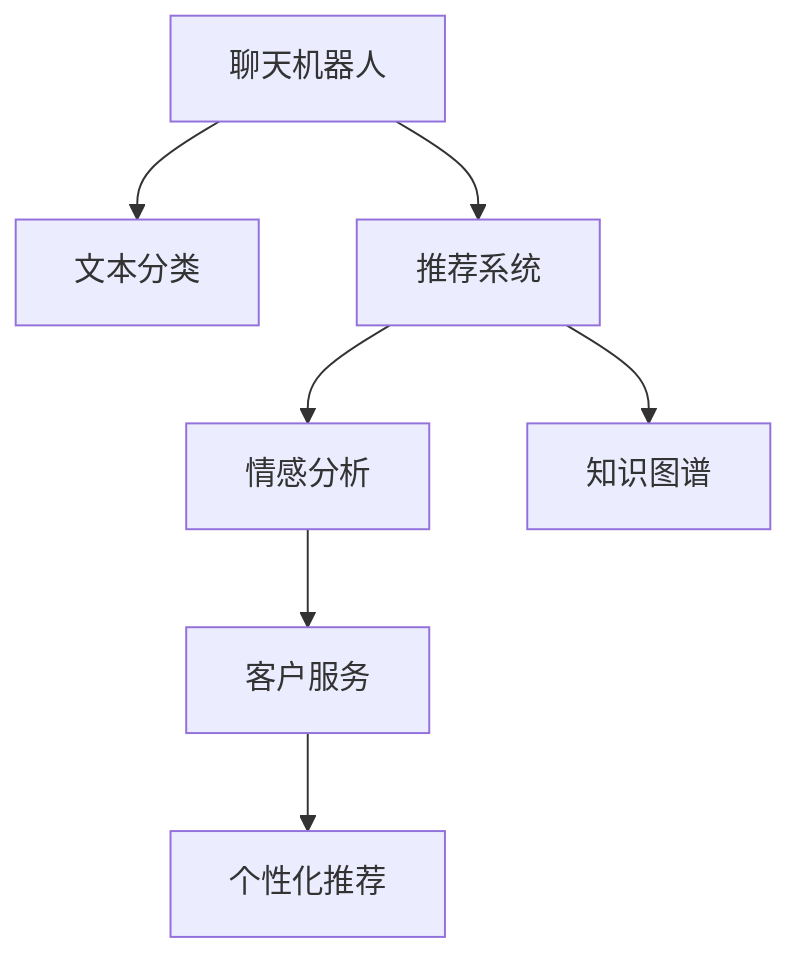

                 

# AI在电商中的NLP技术应用

> 关键词：自然语言处理(NLP), 聊天机器人, 推荐系统, 情感分析, 文本分类, 知识图谱, 电商零售, 客户服务, 客户满意度

## 1. 背景介绍

### 1.1 电商行业的挑战与机遇

电商行业正在经历快速增长和转型，从传统的线上购物向数字化、智能化方向迈进。随之而来的是越来越多的挑战：

1. **客户满意度**：如何在客户需求日益多样化的今天，提供高质量的客户服务？
2. **用户粘性**：如何通过个性化推荐，增强用户的购物体验和忠诚度？
3. **商品多样性**：如何从海量的商品信息中快速、准确地匹配用户需求？
4. **运营效率**：如何优化库存管理、提高物流效率、提升运营效率？

自然语言处理(NLP)技术，作为人工智能的重要分支，为电商行业提供了极佳的解决方案。NLP技术不仅能处理海量的文本数据，还能通过深度学习模型进行精准的文本分析和情感分析，提升电商平台的运营效率和用户体验。

### 1.2 NLP技术的应用现状

NLP技术在电商领域的应用现状如下：

1. **聊天机器人**：用于客户服务、产品推荐等场景，提供24/7的自动化客户支持。
2. **推荐系统**：分析用户行为，生成个性化商品推荐，提升用户转化率和满意度。
3. **情感分析**：分析用户评论、反馈，帮助企业了解用户情感和需求，及时调整策略。
4. **文本分类**：对商品描述、用户评论进行分类，提升搜索结果的相关性和召回率。
5. **知识图谱**：构建商品、用户、市场等的知识图谱，增强商品的语义理解和推荐。

这些应用场景展示了NLP技术在电商行业的巨大潜力，推动了行业向智能化、个性化方向发展。

## 2. 核心概念与联系

### 2.1 核心概念概述

为了更好地理解NLP技术在电商中的应用，本节将介绍几个核心概念：

- **自然语言处理(NLP)**：涉及文本数据的处理和分析，包括文本预处理、特征提取、文本分类、序列建模等技术。
- **聊天机器人**：基于NLP技术的自动化客户服务系统，可以理解自然语言输入，自动回复用户。
- **推荐系统**：利用用户行为数据，生成个性化推荐，提升用户购买意愿和满意度。
- **情感分析**：通过NLP技术分析用户评论、反馈，了解用户情感和需求，帮助企业优化产品和服务。
- **文本分类**：对文本进行分类，提升搜索结果的相关性和召回率。
- **知识图谱**：构建商品、用户、市场等的知识图谱，增强商品的语义理解和推荐。

这些概念之间的逻辑关系可以通过以下Mermaid流程图来展示：



这个流程图展示了NLP技术在电商中的应用场景：

1. 聊天机器人通过文本分类技术识别用户意图，提供自动化客户服务。
2. 推荐系统利用用户行为数据，生成个性化推荐。
3. 情感分析技术分析用户评论，了解用户情感和需求，优化产品和服务。
4. 文本分类技术提升搜索结果的相关性和召回率。
5. 知识图谱技术增强商品的语义理解和推荐。

这些技术共同构成了NLP在电商中的应用框架，为电商平台的智能化、个性化提供支持。

## 3. 核心算法原理 & 具体操作步骤

### 3.1 算法原理概述

基于NLP技术的电商应用，其核心算法原理主要包括：

1. **序列建模**：通过RNN、LSTM、GRU等序列模型，捕捉文本序列中的语义信息。
2. **文本分类**：利用逻辑回归、SVM、神经网络等分类算法，将文本分类到不同的类别。
3. **推荐系统**：通过协同过滤、基于内容的推荐、混合推荐等算法，生成个性化商品推荐。
4. **情感分析**：通过情感词典、情感分类模型等技术，分析用户评论、反馈，了解用户情感和需求。
5. **知识图谱**：构建商品、用户、市场等的知识图谱，增强商品的语义理解和推荐。

这些算法原理涵盖了NLP技术在电商应用中的主要方向，旨在提升用户满意度和电商平台运营效率。

### 3.2 算法步骤详解

以推荐系统为例，详细讲解推荐算法的步骤：

1. **数据收集与预处理**：收集用户行为数据（浏览记录、购买记录、评分记录等），并对其进行预处理（清洗、归一化等）。
2. **特征工程**：构建用户画像、商品特征、用户行为特征等，用于模型训练。
3. **模型训练**：选择推荐算法（协同过滤、基于内容的推荐、混合推荐等），并使用用户行为数据进行训练。
4. **模型评估**：使用交叉验证等技术评估模型的性能（如准确率、召回率、F1值等）。
5. **模型优化**：根据评估结果，调整模型参数，优化模型性能。
6. **部署与监控**：将训练好的模型部署到生产环境中，并实时监控模型表现。

以上步骤涵盖了从数据收集、模型训练到模型部署的全流程，展示了推荐系统的核心算法步骤。

### 3.3 算法优缺点

基于NLP技术的电商推荐系统具有以下优点：

1. **个性化推荐**：通过用户行为数据分析，生成个性化推荐，提升用户满意度和转化率。
2. **实时性**：利用在线学习技术，实时更新推荐模型，及时响应用户需求。
3. **可扩展性**：推荐系统可以处理海量数据，具有较强的扩展性。
4. **实时反馈**：通过用户点击、购买等行为反馈，实时优化推荐模型。

同时，该方法也存在一定的局限性：

1. **数据隐私**：用户行为数据涉及隐私问题，需注意数据保护。
2. **数据冷启动**：新用户、新商品缺乏行为数据，难以进行有效推荐。
3. **模型复杂性**：推荐系统需要复杂的算法和模型，计算成本较高。
4. **数据噪声**：用户行为数据可能存在噪声，影响推荐效果。
5. **算法公平性**：推荐系统可能存在算法偏见，导致推荐结果不公平。

尽管存在这些局限性，但就目前而言，基于NLP技术的推荐系统仍是电商推荐领域的主流范式。未来相关研究的重点在于如何进一步降低推荐系统的计算成本，提高推荐准确性，同时兼顾数据隐私和模型公平性等因素。

### 3.4 算法应用领域

基于NLP技术的推荐系统已经在电商领域得到了广泛的应用，覆盖了几乎所有推荐任务，例如：

1. **商品推荐**：根据用户浏览、购买记录，推荐相关商品。
2. **用户推荐**：根据用户画像和行为数据，推荐其他用户。
3. **活动推荐**：根据用户兴趣和需求，推荐促销活动。
4. **内容推荐**：推荐商品描述、用户评价等文本内容。

除了上述这些经典任务外，NLP技术还被创新性地应用到更多场景中，如情感分析、聊天机器人、客户服务、智能客服等，为电商技术带来了全新的突破。

## 4. 数学模型和公式 & 详细讲解 & 举例说明

### 4.1 数学模型构建

本节将使用数学语言对NLP技术在电商推荐系统中的应用进行更加严格的刻画。

记推荐系统的输入为$U$，表示用户集合；$I$，表示商品集合。用户的评分数据为$R_{ui}$，其中$u \in U$，$i \in I$。推荐系统的目标是最小化预测评分与实际评分之间的差距，即最小化损失函数：

$$
\min_{\theta} \frac{1}{N} \sum_{u \in U} \sum_{i \in I} \ell(R_{ui}, \hat{R}_{ui})
$$

其中，$\ell$为损失函数，$\hat{R}_{ui}$为模型预测的评分。

常见的损失函数包括均方误差损失、绝对误差损失、交叉熵损失等。

### 4.2 公式推导过程

以均方误差损失为例，推导推荐系统的损失函数：

$$
\ell(R_{ui}, \hat{R}_{ui}) = \frac{1}{2} (R_{ui} - \hat{R}_{ui})^2
$$

将上式代入经验风险公式，得：

$$
\mathcal{L}(\theta) = \frac{1}{N} \sum_{u \in U} \sum_{i \in I} \frac{1}{2} (R_{ui} - \hat{R}_{ui})^2
$$

利用梯度下降等优化算法，最小化损失函数$\mathcal{L}(\theta)$，更新模型参数$\theta$。

### 4.3 案例分析与讲解

以协同过滤算法为例，详细讲解推荐算法的实现过程。

协同过滤算法包括基于用户的协同过滤和基于物品的协同过滤两种。基于用户的协同过滤算法利用用户间的相似性进行推荐，基于物品的协同过滤算法利用物品间的相似性进行推荐。

以基于用户的协同过滤为例，具体步骤如下：

1. 计算用户间的相似度：通过余弦相似度、皮尔逊相关系数等方法，计算用户间的相似度矩阵$S$。
2. 计算用户对商品的评分：通过模型训练得到用户对商品的评分预测$\hat{R}_{ui}$。
3. 计算用户的推荐评分：根据用户间的相似度矩阵$S$和用户对商品的评分预测$\hat{R}_{ui}$，计算用户的推荐评分$R_u^i$。
4. 推荐商品：根据用户的推荐评分$R_u^i$，排序推荐商品列表。

通过上述步骤，协同过滤算法可以基于用户行为数据，生成个性化推荐，提升用户满意度和转化率。

## 5. 项目实践：代码实例和详细解释说明

### 5.1 开发环境搭建

在进行推荐系统开发前，我们需要准备好开发环境。以下是使用Python进行推荐系统开发的环境配置流程：

1. 安装Anaconda：从官网下载并安装Anaconda，用于创建独立的Python环境。

2. 创建并激活虚拟环境：
```bash
conda create -n recommendation-env python=3.8 
conda activate recommendation-env
```

3. 安装推荐系统相关的库：
```bash
pip install pandas numpy scikit-learn torch torchvision torchaudio joblib dill
```

4. 安装推荐系统相关模型库：
```bash
pip install lightfm pytorch-lightfm
```

5. 安装TensorBoard：
```bash
pip install tensorboard
```

6. 安装PyTorch：根据CUDA版本，从官网获取对应的安装命令。例如：
```bash
conda install pytorch torchvision torchaudio cudatoolkit=11.1 -c pytorch -c conda-forge
```

完成上述步骤后，即可在`recommendation-env`环境中开始推荐系统开发。

### 5.2 源代码详细实现

下面我们以基于协同过滤的推荐系统为例，给出使用PyTorch实现推荐系统的代码实现。

首先，定义推荐系统的数据处理函数：

```python
import pandas as pd
import numpy as np
from sklearn.model_selection import train_test_split
from sklearn.metrics import mean_squared_error

def preprocess_data(train_data, test_data):
    # 数据清洗
    train_data = train_data.dropna().drop_duplicates().reset_index(drop=True)
    test_data = test_data.dropna().drop_duplicates().reset_index(drop=True)
    
    # 数据归一化
    train_data['rating'] = (train_data['rating'] - train_data['rating'].mean()) / train_data['rating'].std()
    test_data['rating'] = (test_data['rating'] - train_data['rating'].mean()) / train_data['rating'].std()
    
    # 数据拆分
    train, valid, test = train_test_split(train_data, test_data, test_size=0.2, random_state=42)
    valid = valid.drop(columns=['item_id', 'user_id', 'rating', 'timestamp'])
    
    return train, valid, test

# 加载数据
train = pd.read_csv('train.csv')
test = pd.read_csv('test.csv')

train, valid, test = preprocess_data(train, test)
```

然后，定义模型和优化器：

```python
from pytorch_lightning import LightningModule, Trainer
from pytorch_lightning.callbacks import EarlyStopping

class RecommendationModule(LightningModule):
    def __init__(self, train_data, valid_data, test_data):
        super().__init__()
        self.train_data = train_data
        self.valid_data = valid_data
        self.test_data = test_data
        
        # 定义模型
        self.model = ...
        
        # 定义优化器
        self.optimizer = torch.optim.Adam(self.parameters(), lr=0.001)
        
        # 定义评估指标
        self.mse = MeanSquaredError()
        
        # 定义early stopping回调
        self.callbacks = [EarlyStopping(monitor='val_loss', patience=5)]
    
    def forward(self, x):
        # 定义前向传播
        return self.model(x)
    
    def training_step(self, batch, batch_idx):
        # 定义训练步骤
        x, y = batch
        pred = self(x)
        loss = self.mse(pred, y)
        return {'loss': loss}
    
    def validation_step(self, batch, batch_idx):
        # 定义验证步骤
        x, y = batch
        pred = self(x)
        loss = self.mse(pred, y)
        return {'val_loss': loss}
    
    def validation_epoch_end(self, outputs):
        # 计算验证集损失
        avg_loss = torch.stack([x['val_loss'] for x in outputs]).mean()
        return {'val_loss': avg_loss}
    
    def configure_optimizers(self):
        return self.optimizer
    
    def test_step(self, batch, batch_idx):
        # 定义测试步骤
        x, y = batch
        pred = self(x)
        loss = self.mse(pred, y)
        return {'loss': loss}
    
    def test_epoch_end(self, outputs):
        # 计算测试集损失
        avg_loss = torch.stack([x['loss'] for x in outputs]).mean()
        return {'val_loss': avg_loss}
    
    def predict(self, x):
        # 定义预测函数
        with torch.no_grad():
            pred = self(x)
        return pred
```

最后，启动训练流程并在测试集上评估：

```python
from pytorch_lightning import Trainer

# 初始化训练器
trainer = Trainer(max_epochs=10, gpus=1)

# 训练模型
trainer.fit(model, train_dataloaders=train, val_dataloaders=valid)

# 评估模型
trainer.test(test_dataloaders=test)
```

以上就是使用PyTorch对推荐系统进行开发的完整代码实现。可以看到，利用PyTorch和Lightning等框架，推荐系统的开发变得简洁高效。

### 5.3 代码解读与分析

让我们再详细解读一下关键代码的实现细节：

**RecommendationModule类**：
- `__init__`方法：初始化训练集、验证集、测试集等数据集。
- `forward`方法：定义前向传播，将输入数据传递给模型。
- `training_step`方法：定义训练步骤，计算损失函数。
- `validation_step`方法：定义验证步骤，计算验证集损失。
- `validation_epoch_end`方法：计算验证集损失的平均值。
- `configure_optimizers`方法：定义优化器。
- `test_step`方法：定义测试步骤，计算测试集损失。
- `test_epoch_end`方法：计算测试集损失的平均值。
- `predict`方法：定义预测函数，对新数据进行预测。

**preprocess_data函数**：
- 数据清洗：去除缺失值和重复数据。
- 数据归一化：对评分进行标准化处理，使其在[0, 1]之间。
- 数据拆分：将数据集拆分为训练集、验证集、测试集。

可以看到，RecommendationModule类和preprocess_data函数是推荐系统开发的核心组件。开发者可以将更多精力放在模型设计和优化上，而不必过多关注底层的实现细节。

当然，工业级的系统实现还需考虑更多因素，如模型的保存和部署、超参数的自动搜索、更灵活的任务适配层等。但核心的推荐算法基本与此类似。

## 6. 实际应用场景

### 6.1 智能客服系统

基于NLP技术的智能客服系统，可以广泛应用于电商平台的客户服务场景。传统客服往往需要配备大量人力，高峰期响应缓慢，且一致性和专业性难以保证。而使用智能客服系统，可以24/7不间断服务，快速响应客户咨询，用自然流畅的语言解答各类常见问题。

在技术实现上，可以收集平台历史客服对话记录，将问题和最佳答复构建成监督数据，在此基础上对预训练语言模型进行微调。微调后的智能客服系统能够自动理解用户意图，匹配最合适的答案模板进行回复。对于客户提出的新问题，还可以接入检索系统实时搜索相关内容，动态组织生成回答。如此构建的智能客服系统，能大幅提升客户咨询体验和问题解决效率。

### 6.2 个性化推荐系统

NLP技术在个性化推荐系统中的应用，已深入到商品推荐、用户推荐、活动推荐等多个场景。通过分析用户行为数据（浏览记录、购买记录、评分记录等），构建用户画像和商品特征，生成个性化推荐。推荐系统利用协同过滤、基于内容的推荐、混合推荐等算法，生成用户和商品之间的推荐列表。

在电商平台上，推荐系统通过精准的个性化推荐，提升用户满意度和转化率。例如，通过分析用户的浏览记录和购买行为，推荐相关商品；通过分析用户的评分和评价，推荐其他用户；通过分析用户的兴趣和需求，推荐促销活动等。

### 6.3 情感分析系统

通过NLP技术，电商企业可以实时分析用户评论、反馈，了解用户情感和需求，帮助企业优化产品和服务。情感分析系统通过自然语言处理技术，分析用户评论中的情感倾向（如积极、消极、中性），生成情感分析报告，辅助企业决策。

例如，通过分析用户的评论和反馈，识别用户对商品的不满意之处，及时改进产品和服务。通过分析用户评价中的情感，了解用户对平台整体体验的满意度，优化客户服务流程。通过分析用户评论中的情感，预测市场的趋势和变化，制定相应的营销策略。

### 6.4 未来应用展望

随着NLP技术的不断发展，NLP技术在电商领域的应用将更加广泛和深入。未来，NLP技术将推动电商行业向智能化、个性化方向发展，提升用户体验和企业运营效率。以下是一些可能的应用趋势：

1. **跨模态融合**：结合视觉、语音、文本等多模态数据，提升推荐系统的准确性和多样性。例如，结合商品图片、用户视频等信息，生成更加个性化的推荐。

2. **多智能体系统**：构建多智能体推荐系统，提高推荐系统的实时性和灵活性。例如，结合用户和商品的动态信息，实时更新推荐结果。

3. **联邦学习**：通过联邦学习技术，保护用户隐私的同时，提升推荐系统的性能。例如，在不同电商企业之间共享推荐模型，提升整体推荐效果。

4. **自适应推荐**：结合用户行为数据和实时反馈，动态调整推荐策略，提高推荐系统的效果。例如，根据用户的反馈和点击行为，实时优化推荐模型。

5. **知识图谱融合**：结合知识图谱技术，增强商品的语义理解和推荐。例如，通过构建商品知识图谱，提升商品推荐的精准度。

6. **跨领域迁移**：将电商领域的推荐技术应用于其他领域，提升推荐系统的通用性和可扩展性。例如，将电商领域的推荐技术应用于金融、医疗等领域的推荐系统。

以上趋势展示了NLP技术在电商领域的前景和潜力。通过持续探索和创新，NLP技术必将在电商行业带来更加智能化的应用，提升用户满意度和企业竞争力。

## 7. 工具和资源推荐

### 7.1 学习资源推荐

为了帮助开发者系统掌握NLP技术在电商中的应用，这里推荐一些优质的学习资源：

1. **《自然语言处理综述》**：斯坦福大学李飞飞教授的课程，涵盖NLP的基础概念和技术，适合初学者入门。
2. **《深度学习》**：Ian Goodfellow等著，全面介绍了深度学习的基本原理和算法，适合深入学习NLP技术的开发者。
3. **《自然语言处理实战》**：使用Python和TensorFlow等工具，详细讲解NLP技术的实战应用，适合开发者快速上手。
4. **Kaggle竞赛**：参加NLP相关的Kaggle竞赛，通过实战提升NLP技术的实际应用能力。
5. **arXiv论文**：阅读最新的NLP技术论文，了解前沿研究方向和进展。

通过对这些资源的学习实践，相信你一定能够快速掌握NLP技术在电商中的应用，并用于解决实际的电商问题。

### 7.2 开发工具推荐

高效的开发离不开优秀的工具支持。以下是几款用于NLP技术在电商应用开发的常用工具：

1. PyTorch：基于Python的开源深度学习框架，灵活动态的计算图，适合快速迭代研究。大部分NLP模型都有PyTorch版本的实现。
2. TensorFlow：由Google主导开发的开源深度学习框架，生产部署方便，适合大规模工程应用。同样有丰富的NLP模型资源。
3. HuggingFace Transformers：HuggingFace开发的NLP工具库，集成了众多SOTA语言模型，支持PyTorch和TensorFlow，是进行NLP任务开发的利器。
4. Weights & Biases：模型训练的实验跟踪工具，可以记录和可视化模型训练过程中的各项指标，方便对比和调优。与主流深度学习框架无缝集成。
5. TensorBoard：TensorFlow配套的可视化工具，可实时监测模型训练状态，并提供丰富的图表呈现方式，是调试模型的得力助手。

合理利用这些工具，可以显著提升NLP技术在电商应用开发的效率，加快创新迭代的步伐。

### 7.3 相关论文推荐

NLP技术在电商领域的发展源于学界的持续研究。以下是几篇奠基性的相关论文，推荐阅读：

1. **《协同过滤推荐系统》**：基于协同过滤的推荐系统研究，阐述了协同过滤算法的基本原理和实现方法。
2. **《基于内容的推荐系统》**：介绍了基于内容的推荐系统的基本原理和实现方法，适用于商品属性信息丰富的电商场景。
3. **《混合推荐系统》**：阐述了混合推荐系统的基本原理和实现方法，适用于电商平台的复杂推荐场景。
4. **《个性化推荐系统》**：介绍了个性化推荐系统的基本原理和实现方法，适用于电商平台的个性化推荐需求。
5. **《情感分析技术》**：介绍了情感分析技术的原理和实现方法，适用于电商平台的情感分析需求。

这些论文代表了大语言模型微调技术的发展脉络。通过学习这些前沿成果，可以帮助研究者把握学科前进方向，激发更多的创新灵感。

## 8. 总结：未来发展趋势与挑战

### 8.1 研究成果总结

本文对NLP技术在电商中的应用进行了全面系统的介绍。首先阐述了电商行业面临的挑战和机遇，明确了NLP技术在电商中的重要性。其次，从原理到实践，详细讲解了NLP技术在电商推荐系统、智能客服、情感分析等场景中的应用，展示了NLP技术在电商行业的巨大潜力。最后，通过总结NLP技术在电商领域的应用现状和未来发展趋势，展示了NLP技术在电商行业的前景和潜力。

通过本文的系统梳理，可以看到，NLP技术在电商推荐系统、智能客服、情感分析等场景中的应用，已经显著提升了电商平台的运营效率和用户体验。未来，随着NLP技术的不断发展和创新，NLP技术必将在电商行业带来更加智能化的应用，推动电商行业向智能化、个性化方向发展。

### 8.2 未来发展趋势

展望未来，NLP技术在电商领域将呈现以下几个发展趋势：

1. **跨模态融合**：结合视觉、语音、文本等多模态数据，提升推荐系统的准确性和多样性。例如，结合商品图片、用户视频等信息，生成更加个性化的推荐。

2. **多智能体系统**：构建多智能体推荐系统，提高推荐系统的实时性和灵活性。例如，结合用户和商品的动态信息，实时更新推荐结果。

3. **联邦学习**：通过联邦学习技术，保护用户隐私的同时，提升推荐系统的性能。例如，在不同电商企业之间共享推荐模型，提升整体推荐效果。

4. **自适应推荐**：结合用户行为数据和实时反馈，动态调整推荐策略，提高推荐系统的效果。例如，根据用户的反馈和点击行为，实时优化推荐模型。

5. **知识图谱融合**：结合知识图谱技术，增强商品的语义理解和推荐。例如，通过构建商品知识图谱，提升商品推荐的精准度。

6. **跨领域迁移**：将电商领域的推荐技术应用于其他领域，提升推荐系统的通用性和可扩展性。例如，将电商领域的推荐技术应用于金融、医疗等领域的推荐系统。

以上趋势展示了NLP技术在电商领域的前景和潜力。通过持续探索和创新，NLP技术必将在电商行业带来更加智能化的应用，提升用户满意度和企业竞争力。

### 8.3 面临的挑战

尽管NLP技术在电商领域取得了显著进展，但在迈向更加智能化、普适化应用的过程中，仍面临诸多挑战：

1. **数据隐私**：用户行为数据涉及隐私问题，需注意数据保护。
2. **数据冷启动**：新用户、新商品缺乏行为数据，难以进行有效推荐。
3. **模型复杂性**：推荐系统需要复杂的算法和模型，计算成本较高。
4. **数据噪声**：用户行为数据可能存在噪声，影响推荐效果。
5. **算法公平性**：推荐系统可能存在算法偏见，导致推荐结果不公平。

尽管存在这些局限性，但就目前而言，基于NLP技术的推荐系统仍是电商推荐领域的主流范式。未来相关研究的重点在于如何进一步降低推荐系统的计算成本，提高推荐准确性，同时兼顾数据隐私和模型公平性等因素。

### 8.4 研究展望

面对NLP技术在电商领域面临的挑战，未来的研究需要在以下几个方面寻求新的突破：

1. **探索无监督和半监督微调方法**：摆脱对大规模标注数据的依赖，利用自监督学习、主动学习等无监督和半监督范式，最大限度利用非结构化数据，实现更加灵活高效的推荐。

2. **研究参数高效和计算高效的微调范式**：开发更加参数高效的微调方法，在固定大部分预训练参数的同时，只更新极少量的任务相关参数。同时优化微调模型的计算图，减少前向传播和反向传播的资源消耗，实现更加轻量级、实时性的部署。

3. **引入因果和对比学习范式**：通过引入因果推断和对比学习思想，增强推荐系统建立稳定因果关系的能力，学习更加普适、鲁棒的语言表征，从而提升模型泛化性和抗干扰能力。

4. **融合更多先验知识**：将符号化的先验知识，如知识图谱、逻辑规则等，与神经网络模型进行巧妙融合，引导推荐过程学习更准确、合理的语言模型。同时加强不同模态数据的整合，实现视觉、语音等多模态信息与文本信息的协同建模。

5. **结合因果分析和博弈论工具**：将因果分析方法引入推荐系统，识别出模型决策的关键特征，增强输出解释的因果性和逻辑性。借助博弈论工具刻画人机交互过程，主动探索并规避模型的脆弱点，提高系统稳定性。

6. **纳入伦理道德约束**：在模型训练目标中引入伦理导向的评估指标，过滤和惩罚有偏见、有害的输出倾向。同时加强人工干预和审核，建立模型行为的监管机制，确保输出符合人类价值观和伦理道德。

这些研究方向的探索，必将引领NLP技术在电商领域的持续发展，推动电商行业向智能化、个性化方向迈进。未来，NLP技术必将在更多领域得到应用，为人类生产和生活带来更深远的影响。

## 9. 附录：常见问题与解答

**Q1：NLP技术在电商推荐系统中如何进行用户画像的构建？**

A: 用户画像的构建是推荐系统的重要步骤，通过用户画像可以更好地了解用户的兴趣和需求。以下是构建用户画像的几种常见方法：

1. **基于用户行为的数据分析**：收集用户的历史行为数据（如浏览记录、购买记录、评分记录等），通过特征工程构建用户画像。例如，通过用户的浏览记录，可以分析用户的偏好和兴趣，生成用户画像。

2. **基于文本的情感分析**：通过分析用户评论、反馈中的情感倾向（如积极、消极、中性），生成情感分析报告，辅助构建用户画像。例如，通过分析用户的评论，可以了解用户的情感和需求，生成情感分析报告。

3. **基于社交网络的数据分析**：通过分析用户的社交网络数据，构建用户画像。例如，通过分析用户的社交媒体行为，可以了解用户的兴趣和偏好，生成用户画像。

4. **基于知识图谱的数据分析**：通过构建商品、用户、市场等的知识图谱，生成用户画像。例如，通过分析用户的浏览行为，可以将其关联到知识图谱中的商品，生成用户画像。

5. **基于深度学习的数据分析**：通过深度学习模型，分析用户数据生成用户画像。例如，通过深度学习模型对用户行为数据进行分析，生成用户画像。

**Q2：NLP技术在电商推荐系统中如何进行商品画像的构建？**

A: 商品画像的构建是推荐系统的重要步骤，通过商品画像可以更好地了解商品的特征和属性。以下是构建商品画像的几种常见方法：

1. **基于商品属性数据的数据分析**：收集商品的属性数据（如价格、类别、品牌等），通过特征工程构建商品画像。例如，通过商品的价格和类别，可以分析商品的特征和属性，生成商品画像。

2. **基于文本的情感分析**：通过分析商品描述、用户评价中的情感倾向（如积极、消极、中性），生成情感分析报告，辅助构建商品画像。例如，通过分析商品描述，可以了解商品的特征和属性，生成情感分析报告。

3. **基于社交网络的数据分析**：通过分析商品在社交网络中的互动数据，构建商品画像。例如，通过分析商品在社交媒体上的互动数据，可以了解商品的特征和属性，生成商品画像。

4. **基于知识图谱的数据分析**：通过构建商品、用户、市场等的知识图谱，生成商品画像。例如，通过分析商品的知识图谱，可以了解商品的特征和属性，生成商品画像。

5. **基于深度学习的数据分析**：通过深度学习模型，分析商品数据生成商品画像。例如，通过深度学习模型对商品数据进行分析，生成商品画像。

**Q3：NLP技术在电商推荐系统中如何进行实时推荐？**

A: 实时推荐是电商推荐系统的核心目标之一，通过实时推荐可以提升用户的购物体验和转化率。以下是进行实时推荐的几种常见方法：

1. **在线学习**：通过在线学习算法（如FTRL、Adagrad等），实时更新推荐模型，适应用户行为的变化。例如，通过在线学习算法，可以实时更新推荐模型，适应用户的实时行为。

2. **协同过滤**：通过协同过滤算法，实时更新推荐结果。例如，通过协同过滤算法，可以实时更新推荐结果，适应用户行为的变化。

3. **基于内容的推荐**：通过基于内容的推荐算法，实时更新推荐结果。例如，通过基于内容的推荐算法，可以实时更新推荐结果，适应用户行为的变化。

4. **混合推荐**：通过混合推荐算法，实时更新推荐结果。例如，通过混合推荐算法，可以实时更新推荐结果，适应用户行为的变化。

5. **在线A/B测试**：通过在线A/B测试，实时优化推荐模型。例如，通过在线A/B测试，可以实时优化推荐模型，提升推荐效果。

**Q4：NLP技术在电商推荐系统中如何进行数据清洗？**

A: 数据清洗是推荐系统的关键步骤，通过数据清洗可以去除噪声和异常数据，提高推荐系统的性能。以下是进行数据清洗的几种常见方法：

1. **缺失值处理**：通过插值、删除等方法处理缺失值。例如，通过插值方法，可以填补缺失值，提高数据完整性。

2. **异常值处理**：通过均值、中位数等方法处理异常值。例如，通过中位数方法，可以去除异常值，提高数据稳定性。

3. **数据去重**：通过去重算法去除重复数据。例如，通过去重算法，可以去除重复数据，提高数据质量。

4. **数据标准化**：通过标准化方法处理数据。例如，通过标准化方法，可以调整数据分布，提高模型性能。

5. **数据归一化**：通过归一化方法处理数据。例如，通过归一化方法，可以将数据缩放到[0, 1]之间，提高模型性能。

通过数据清洗，可以去除噪声和异常数据，提高推荐系统的性能和稳定性。

**Q5：NLP技术在电商推荐系统中如何进行模型评估？**

A: 模型评估是推荐系统的关键步骤，通过模型评估可以了解模型的性能和效果。以下是进行模型评估的几种常见方法：

1. **交叉验证**：通过交叉验证方法评估模型的性能。例如，通过交叉验证方法，可以评估模型的性能，优化模型参数。

2. **均方误差**：通过均方误差方法评估模型的性能。例如，通过均方误差方法，可以评估模型的预测误差，优化模型性能。

3. **准确率、召回率、F1值**：通过准确率、召回率、F1值等指标评估模型的性能。例如，通过准确率、召回率、F1值等指标，可以评估模型的分类效果，优化模型性能。

4. **ROC曲线**：通过ROC曲线评估模型的性能。例如，通过ROC曲线，可以评估模型的分类效果，优化模型参数。

5. **A/B测试**：通过A/B测试方法评估模型的性能。例如，通过A/B测试方法，可以评估模型的推荐效果，优化模型性能。

通过模型评估，可以了解模型的性能和效果，优化模型参数和算法，提升推荐系统的性能。

---

作者：禅与计算机程序设计艺术 / Zen and the Art of Computer Programming

