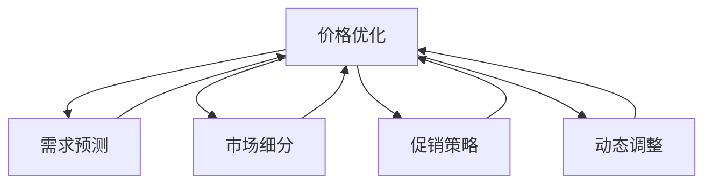

                 

# AI在电商价格优化中的技术实现

## 1. 背景介绍

### 1.1 问题由来

在电商平台上，价格优化是提升用户满意度、增加销售转化率的关键因素。传统的价格优化方法依赖于人工经验和规则，存在成本高、周期长、易出错等问题。而基于AI的价格优化技术，能够实时动态调整商品价格，更好地适应市场变化，提升运营效率和用户体验。

### 1.2 问题核心关键点

AI在电商价格优化中的核心在于利用大数据、机器学习等技术，建立商品价格与销售量、用户行为、市场环境等因素之间的关系模型。通过对历史数据的分析和预测，制定最优化的价格策略。具体而言，核心问题包括：

- 如何设计有效的价格模型？
- 如何利用机器学习算法进行精准预测？
- 如何在不同市场环境下优化价格策略？
- 如何处理动态变化的市场数据？

### 1.3 问题研究意义

通过基于AI的价格优化技术，电商平台可以显著提升价格策略的科学性和有效性，实现更高的销售转化率和用户满意度。具体而言：

1. **提高转化率**：精准定价能够更好地吸引用户点击和购买，提升平台整体转化率。
2. **优化库存**：合理的价格策略可以精准预测需求，避免库存积压和缺货问题。
3. **增强竞争力**：实时动态调价使平台能够在市场竞争中快速应对，抢占更多市场份额。
4. **提升用户粘性**：通过个性化推荐和精准定价，提升用户对平台的依赖度。
5. **优化运营成本**：通过减少库存损耗和精准促销，降低运营成本。

本文将全面介绍基于AI的价格优化技术，涵盖算法原理、操作步骤、实际应用场景及未来发展方向，为电商平台提供可行的技术方案。

## 2. 核心概念与联系

### 2.1 核心概念概述

为了更好地理解基于AI的价格优化技术，本节将介绍几个核心概念：

- **价格优化**：通过建立商品价格与销售量、用户行为、市场环境等变量之间的关系模型，实现对商品价格的优化调整。
- **需求预测**：基于历史数据和市场趋势，预测商品未来的需求量和销售趋势，为价格决策提供依据。
- **市场细分**：根据用户行为、地理位置、消费习惯等特征，将市场划分为多个细分市场，针对不同市场制定差异化的价格策略。
- **促销策略**：根据不同的促销目标，设计促销活动和价格策略，如打折、满减、赠品等，提升销售效果。
- **动态调整**：实时监测市场变化，如竞争对手价格、节假日、季节性需求等，动态调整商品价格，保持市场竞争力。

这些核心概念之间的逻辑关系可以通过以下Mermaid流程图来展示：



这个流程图展示了大语言模型的核心概念及其之间的关系：

1. 价格优化是核心目标，基于需求预测、市场细分、促销策略和动态调整等模块进行。
2. 需求预测提供数据基础，为价格优化提供依据。
3. 市场细分和促销策略优化商品定价策略，适应不同市场需求。
4. 动态调整实时监控市场变化，及时调整价格策略。

## 3. 核心算法原理 & 具体操作步骤

### 3.1 算法原理概述

基于AI的价格优化算法，通常采用以下步骤：

1. **数据收集**：从电商平台收集商品历史销售数据、用户行为数据、市场环境数据等。
2. **数据清洗与预处理**：对原始数据进行清洗、去重、归一化等处理，生成用于训练和测试的数据集。
3. **特征工程**：根据业务需求，提取与价格相关的特征，如时间、促销活动、季节性因素等。
4. **模型训练**：采用机器学习算法，如线性回归、随机森林、深度学习等，训练价格预测模型。
5. **模型评估**：使用交叉验证、A/B测试等方法，评估模型的预测效果。
6. **价格优化**：根据预测结果，结合市场环境，动态调整商品价格。
7. **效果监控**：实时监控价格优化效果，及时调整优化策略。

### 3.2 算法步骤详解

以基于深度学习的价格预测模型为例，详细讲解其操作步骤：

**Step 1: 数据收集**

- **历史销售数据**：从电商平台的数据库中提取商品的历史销售记录，包括销售量、价格、时间戳等。
- **用户行为数据**：收集用户的浏览、点击、购买记录等行为数据，提取与价格相关的特征。
- **市场环境数据**：收集外部市场环境数据，如节假日、季节性因素、竞争对手价格等。

**Step 2: 数据清洗与预处理**

- **缺失值处理**：对数据集中的缺失值进行填充或删除，保证数据完整性。
- **归一化**：将数据进行归一化处理，使数据具有相同的尺度和分布。
- **特征工程**：根据业务需求，提取与价格相关的特征，如时间、促销活动、季节性因素等。

**Step 3: 模型训练**

- **模型选择**：选择适合的价格预测模型，如线性回归、随机森林、深度学习等。
- **数据分割**：将数据集划分为训练集、验证集和测试集。
- **模型训练**：使用训练集数据对模型进行训练，调整模型参数，最小化损失函数。
- **模型验证**：在验证集上评估模型性能，调整模型参数，防止过拟合。
- **模型测试**：使用测试集数据对模型进行测试，评估模型泛化能力。

**Step 4: 价格优化**

- **预测价格**：根据测试集数据，预测商品价格。
- **调整价格**：结合市场环境，调整商品价格，使价格更接近预测值。
- **动态调整**：实时监控市场变化，动态调整商品价格，保持市场竞争力。

**Step 5: 效果监控**

- **效果评估**：实时监控价格优化效果，评估销售量、用户行为等指标的变化。
- **优化策略**：根据效果评估结果，调整优化策略，提升价格优化效果。

### 3.3 算法优缺点

基于AI的价格优化算法具有以下优点：

- **精准预测**：利用大数据和机器学习技术，能够精准预测商品需求，提供科学的价格优化依据。
- **自动化**：自动化程度高，可以实时动态调整商品价格，提升运营效率。
- **灵活性**：可以根据市场变化，灵活调整价格策略，适应不同市场环境。

同时，该算法也存在一定的局限性：

- **数据依赖**：对历史数据和市场环境数据的依赖较高，数据质量对模型预测效果有重要影响。
- **模型复杂**：深度学习等复杂模型需要较长的训练时间和较大的计算资源。
- **解释性差**：黑盒模型缺乏可解释性，难以理解模型的决策过程。
- **成本高**：数据收集、特征工程、模型训练等环节成本较高。

尽管存在这些局限性，但AI在价格优化中的作用日益凸显，成为电商行业的重要技术手段。未来相关研究的重点在于如何进一步降低算法对数据和计算资源的依赖，提高模型的可解释性和灵活性，降低成本。

### 3.4 算法应用领域

基于AI的价格优化技术，在电商行业已经被广泛应用于以下领域：

- **定价策略优化**：根据市场需求，自动调整商品价格，提升销售转化率。
- **库存管理**：精准预测商品需求，避免库存积压和缺货问题。
- **促销活动设计**：设计个性化促销活动，提升用户购买意愿和平台粘性。
- **市场竞争分析**：实时监测竞争对手价格，动态调整商品价格，保持市场竞争力。
- **需求预测**：预测未来市场需求，为商品定价提供依据。

除了电商领域，AI在价格优化技术在其他行业也具备广泛应用前景，如金融、零售、物流等，助力企业实现智能化、高效化运营。

## 4. 数学模型和公式 & 详细讲解 & 举例说明

### 4.1 数学模型构建

基于AI的价格优化算法，可以采用以下数学模型进行建模：

设商品价格为 $P$，销售量为 $Q$，时间特征为 $T$，促销活动特征为 $C$，季节性因素为 $S$。则商品价格的预测模型可以表示为：

$$
P = f(T, C, S) + \epsilon
$$

其中 $f$ 为预测函数，$\epsilon$ 为随机误差项。

具体而言，可以采用以下几种预测模型：

- **线性回归模型**：
$$
P = \beta_0 + \beta_1T + \beta_2C + \beta_3S + \epsilon
$$

- **随机森林模型**：
$$
P = \sum_{i=1}^{N}w_i(T_i, C_i, S_i)
$$

其中 $w_i$ 为第 $i$ 棵树的权重。

- **深度学习模型**：
$$
P = M(D_{input}, \theta)
$$

其中 $D_{input}$ 为输入数据，$\theta$ 为模型参数，$M$ 为深度学习模型。

### 4.2 公式推导过程

以线性回归模型为例，推导其预测函数和损失函数：

设 $n$ 为样本数量，$(x_i, y_i)$ 为第 $i$ 个样本，其中 $x_i = (T_i, C_i, S_i)$，$y_i = P_i$。则线性回归模型的预测函数为：

$$
\hat{P} = \theta_0 + \sum_{k=1}^{K}\theta_kx_{ik}
$$

其中 $\theta = (\theta_0, \theta_1, ..., \theta_K)$ 为模型参数。

预测误差为：

$$
\epsilon_i = y_i - \hat{P}_i
$$

则均方误差损失函数为：

$$
\mathcal{L}(\theta) = \frac{1}{n}\sum_{i=1}^{n}\epsilon_i^2
$$

最小化损失函数，可得参数更新公式：

$$
\theta \leftarrow \theta - \eta\nabla_{\theta}\mathcal{L}(\theta)
$$

其中 $\eta$ 为学习率，$\nabla_{\theta}\mathcal{L}(\theta)$ 为损失函数对参数的梯度。

### 4.3 案例分析与讲解

以某电商平台的数据为例，分析基于AI的价格优化算法的效果：

- **数据来源**：从电商平台的历史销售记录中提取商品价格、时间、促销活动等特征。
- **特征工程**：提取季节性因素，如节假日、季节性变化等。
- **模型选择**：选择线性回归模型进行预测。
- **模型训练**：使用历史数据训练模型，调整参数，最小化损失函数。
- **效果评估**：在验证集上评估模型性能，调整参数。
- **价格优化**：根据测试集数据，预测商品价格，调整市场价格，提升销售转化率。

## 5. 项目实践：代码实例和详细解释说明

### 5.1 开发环境搭建

在进行价格优化实践前，我们需要准备好开发环境。以下是使用Python进行TensorFlow开发的环境配置流程：

1. 安装Anaconda：从官网下载并安装Anaconda，用于创建独立的Python环境。

2. 创建并激活虚拟环境：
```bash
conda create -n tf-env python=3.8 
conda activate tf-env
```

3. 安装TensorFlow：根据CUDA版本，从官网获取对应的安装命令。例如：
```bash
conda install tensorflow -c conda-forge
```

4. 安装各类工具包：
```bash
pip install numpy pandas scikit-learn matplotlib tqdm jupyter notebook ipython
```

完成上述步骤后，即可在`tf-env`环境中开始价格优化实践。

### 5.2 源代码详细实现

下面我们以基于深度学习的价格预测模型为例，给出使用TensorFlow进行价格优化的PyTorch代码实现。

首先，定义数据处理函数：

```python
import tensorflow as tf
from tensorflow.keras.preprocessing import sequence
from sklearn.model_selection import train_test_split

def load_data(file_path):
    data = pd.read_csv(file_path)
    X = data.drop(['price', 'date'], axis=1)
    y = data['price']
    return X, y

def preprocess_data(X, y):
    X = pd.get_dummies(X)
    X = sequence.pad_sequences(X, maxlen=30)
    y = (y - y.min()) / (y.max() - y.min())
    return X, y

X, y = load_data('sales_data.csv')
X_train, X_test, y_train, y_test = train_test_split(X, y, test_size=0.2, random_state=42)
X_train, X_val, y_train, y_val = train_test_split(X_train, y_train, test_size=0.2, random_state=42)

X_train, X_val, y_train, y_val = preprocess_data(X_train, y_train)
X_test, y_test = preprocess_data(X_test, y_test)
```

然后，定义模型和优化器：

```python
from tensorflow.keras.models import Sequential
from tensorflow.keras.layers import Dense, LSTM

model = Sequential()
model.add(LSTM(64, input_shape=(30, X_train.shape[1]), return_sequences=True))
model.add(LSTM(32))
model.add(Dense(1))

optimizer = tf.keras.optimizers.Adam(lr=0.001)
```

接着，定义训练和评估函数：

```python
def train_model(model, X_train, y_train, X_val, y_val, epochs=50, batch_size=32):
    model.compile(optimizer=optimizer, loss='mse')
    history = model.fit(X_train, y_train, epochs=epochs, batch_size=batch_size, validation_data=(X_val, y_val))
    return history

def evaluate_model(model, X_test, y_test):
    y_pred = model.predict(X_test)
    mse = np.mean((y_pred - y_test) ** 2)
    return mse

history = train_model(model, X_train, y_train, X_val, y_val)
mse = evaluate_model(model, X_test, y_test)
```

最后，启动训练流程并在测试集上评估：

```python
print(f'Mean Squared Error: {mse:.4f}')
```

以上就是使用TensorFlow进行价格预测的完整代码实现。可以看到，TensorFlow的高级API使得模型训练和评估变得非常简单高效。

### 5.3 代码解读与分析

让我们再详细解读一下关键代码的实现细节：

**load_data函数**：
- 读取数据文件，提取特征和标签。

**preprocess_data函数**：
- 对数据进行特征工程处理，包括编码、归一化等。

**train_model函数**：
- 定义模型结构和优化器。
- 使用训练集数据训练模型，返回训练历史。
- 在验证集上评估模型性能。

**evaluate_model函数**：
- 使用测试集数据评估模型预测效果。

**训练流程**：
- 定义训练轮数和批量大小。
- 调用训练函数，返回训练历史。
- 在测试集上评估模型性能，输出均方误差。

可以看到，TensorFlow的高级API使得模型训练和评估变得非常简单高效。开发者可以将更多精力放在特征工程和模型改进上，而不必过多关注底层实现细节。

当然，工业级的系统实现还需考虑更多因素，如模型的保存和部署、超参数的自动搜索、更灵活的任务适配层等。但核心的价格优化范式基本与此类似。

## 6. 实际应用场景

### 6.1 智能推荐系统

基于AI的价格优化技术，可以应用于智能推荐系统，提高推荐的精准度和用户满意度。具体而言：

- **个性化推荐**：通过分析用户的历史行为数据，结合价格预测模型，为用户推荐最合适的商品。
- **动态调整价格**：根据市场需求，实时调整商品价格，提升推荐效果。
- **优化库存**：精准预测商品需求，避免库存积压和缺货问题，提升库存管理效率。

通过将价格优化与推荐系统结合，电商平台能够更好地满足用户需求，提升用户体验和平台竞争力。

### 6.2 用户定价策略

智能定价策略是基于AI的价格优化技术的重要应用之一。通过分析用户行为数据和市场环境数据，动态调整商品价格，实现以下目标：

- **提升用户转化率**：精准定价能够更好地吸引用户点击和购买，提升平台整体转化率。
- **优化库存管理**：精准预测商品需求，避免库存积压和缺货问题，提高运营效率。
- **提升用户满意度**：通过个性化推荐和精准定价，提升用户对平台的依赖度，增加用户粘性。

基于AI的价格优化算法能够根据市场变化，实时调整商品价格，保持市场竞争力。

### 6.3 市场环境分析

电商平台需要实时监测市场变化，以便动态调整商品价格。基于AI的价格优化技术，可以通过分析竞争对手价格、节假日、季节性因素等，制定最优化的价格策略，实现以下目标：

- **应对市场竞争**：实时监测竞争对手价格，动态调整商品价格，保持市场竞争力。
- **提升销售效果**：根据节假日、季节性因素等，调整商品价格，提升销售效果。
- **优化运营成本**：通过精准预测需求，避免库存积压和缺货问题，降低运营成本。

通过市场环境分析，电商平台能够更好地应对市场变化，提升运营效率和用户满意度。

### 6.4 未来应用展望

随着AI技术的不断进步，基于AI的价格优化技术将呈现以下几个发展趋势：

1. **更精准的预测**：利用更先进的数据挖掘和机器学习技术，实现更精准的需求预测，为价格优化提供更科学的依据。
2. **更高效的训练**：通过分布式训练、模型压缩等技术，提升模型训练效率，降低训练成本。
3. **更智能的定价**：结合个性化推荐和市场细分，实现更智能的定价策略，提升用户满意度。
4. **更灵活的调整**：实时动态调整商品价格，更好地适应市场变化。
5. **更全面的分析**：结合因果分析和数据挖掘技术，实现更全面的市场环境分析。

这些趋势将进一步推动价格优化技术的发展，使电商平台在市场竞争中占据更大优势。

## 7. 工具和资源推荐

### 7.1 学习资源推荐

为了帮助开发者系统掌握基于AI的价格优化技术，这里推荐一些优质的学习资源：

1. **《深度学习与Python》**：由清华大学出版社出版的深度学习教材，系统介绍了深度学习的基本概念和算法。
2. **《机器学习实战》**：由O'Reilly出版的机器学习实战书籍，提供大量实战案例和代码实现。
3. **《TensorFlow实战》**：由O'Reilly出版的TensorFlow实战书籍，详细介绍了TensorFlow的使用和优化技巧。
4. **Kaggle**：数据科学竞赛平台，提供丰富的数据集和算法竞赛，适合学习和实践机器学习。
5. **Udacity**：在线学习平台，提供深度学习、机器学习等课程，适合系统学习。

通过这些学习资源，相信你一定能够快速掌握基于AI的价格优化技术的精髓，并用于解决实际的电商问题。

### 7.2 开发工具推荐

高效的开发离不开优秀的工具支持。以下是几款用于价格优化开发的常用工具：

1. **Jupyter Notebook**：交互式编程环境，适合数据探索和模型调试。
2. **TensorBoard**：TensorFlow配套的可视化工具，可以实时监测模型训练状态，提供丰富的图表呈现方式。
3. **PyTorch**：灵活的深度学习框架，适合研究和实验新算法。
4. **TensorFlow**：生产部署方便，适合大规模工程应用。
5. **scikit-learn**：Python机器学习库，适合快速实现基本机器学习算法。

合理利用这些工具，可以显著提升价格优化任务的开发效率，加快创新迭代的步伐。

### 7.3 相关论文推荐

基于AI的价格优化技术的发展源于学界的持续研究。以下是几篇奠基性的相关论文，推荐阅读：

1. **《A Survey on Deep Learning Techniques for Sales Forecasting》**：综述了深度学习在销售预测中的应用。
2. **《Sales Forecasting using Deep Neural Networks: A Survey》**：综述了深度学习在销售预测中的研究进展。
3. **《A Neural Network Approach for Sales Forecasting》**：提出基于神经网络的时间序列预测模型。
4. **《Sales Forecasting with Deep Learning: A Survey》**：综述了深度学习在销售预测中的最新研究。

这些论文代表了大语言模型微调技术的发展脉络。通过学习这些前沿成果，可以帮助研究者把握学科前进方向，激发更多的创新灵感。

## 8. 总结：未来发展趋势与挑战

### 8.1 总结

本文对基于AI的价格优化技术进行了全面系统的介绍。首先阐述了价格优化的背景和意义，明确了价格优化在电商运营中的重要作用。其次，从原理到实践，详细讲解了价格优化的数学模型和关键步骤，给出了价格优化任务开发的完整代码实例。同时，本文还广泛探讨了价格优化技术在智能推荐、用户定价、市场环境分析等多个电商应用场景中的应用前景，展示了AI在电商中的强大威力。

通过本文的系统梳理，可以看到，基于AI的价格优化技术正在成为电商行业的重要技术手段，极大地提升了电商平台的运营效率和用户满意度。未来，伴随AI技术的不断进步，基于AI的价格优化技术必将迎来更多创新和突破，推动电商行业实现更高的发展水平。

### 8.2 未来发展趋势

展望未来，基于AI的价格优化技术将呈现以下几个发展趋势：

1. **更精准的预测**：利用更先进的数据挖掘和机器学习技术，实现更精准的需求预测，为价格优化提供更科学的依据。
2. **更高效的训练**：通过分布式训练、模型压缩等技术，提升模型训练效率，降低训练成本。
3. **更智能的定价**：结合个性化推荐和市场细分，实现更智能的定价策略，提升用户满意度。
4. **更灵活的调整**：实时动态调整商品价格，更好地适应市场变化。
5. **更全面的分析**：结合因果分析和数据挖掘技术，实现更全面的市场环境分析。

这些趋势将进一步推动价格优化技术的发展，使电商平台在市场竞争中占据更大优势。

### 8.3 面临的挑战

尽管基于AI的价格优化技术已经取得了显著成就，但在迈向更加智能化、高效化运营的过程中，它仍面临诸多挑战：

1. **数据质量瓶颈**：价格优化高度依赖于历史销售数据和市场环境数据，数据质量对模型预测效果有重要影响。如何提升数据质量，获取更全面、更准确的数据，将是重要的研究方向。
2. **模型复杂性**：深度学习等复杂模型需要较长的训练时间和较大的计算资源。如何简化模型结构，降低计算资源消耗，提升训练效率，将是重要的优化方向。
3. **解释性不足**：黑盒模型缺乏可解释性，难以理解模型的决策过程。如何提高模型的可解释性，增强算法的可信度，将是重要的研究方向。
4. **成本高**：数据收集、特征工程、模型训练等环节成本较高。如何降低成本，提高算法应用的经济性，将是重要的研究方向。

尽管存在这些挑战，但基于AI的价格优化技术在电商行业的应用前景广阔，未来必将在更多领域得到推广和应用。

### 8.4 未来突破

面对基于AI的价格优化技术所面临的挑战，未来的研究需要在以下几个方面寻求新的突破：

1. **数据增强**：通过数据增强技术，生成更多高质量的模拟数据，提升模型预测效果。
2. **模型压缩**：通过模型压缩技术，减小模型尺寸，降低计算资源消耗，提升训练效率。
3. **模型优化**：通过算法优化和超参数调整，提高模型性能，降低计算资源消耗。
4. **可解释性**：通过模型可解释性技术，提高算法的可信度，增强用户信任。
5. **经济性**：通过成本控制技术，降低算法应用的经济成本，提高算法的实用性和普及性。

这些研究方向的探索，必将引领基于AI的价格优化技术迈向更高的台阶，为电商平台提供更高效、更智能、更经济的解决方案。面向未来，基于AI的价格优化技术还需与其他AI技术进行更深入的融合，如知识表示、因果推理、强化学习等，多路径协同发力，共同推动电商行业的发展。

## 9. 附录：常见问题与解答

**Q1：如何选择合适的预测模型？**

A: 选择预测模型时，需要考虑以下因素：
1. **数据特征**：数据是否具有时间序列特征，是否需要考虑季节性因素。
2. **模型复杂度**：模型的复杂度与数据量、特征数量等因素有关，需要根据实际情况选择合适的模型。
3. **计算资源**：模型的计算资源消耗，需要考虑计算资源约束。
4. **预测效果**：通过交叉验证、A/B测试等方法，评估不同模型的预测效果，选择效果最佳的模型。

**Q2：如何处理季节性因素？**

A: 处理季节性因素，可以使用以下方法：
1. **特征工程**：提取季节性因素，如节假日、季节性变化等。
2. **时间序列预测**：采用时间序列预测模型，考虑季节性因素对商品需求的影响。
3. **多模型融合**：结合多个模型，综合考虑季节性因素对商品需求的影响。

**Q3：如何提高模型的可解释性？**

A: 提高模型可解释性，可以使用以下方法：
1. **模型简化**：简化模型结构，降低计算资源消耗，提高模型可解释性。
2. **特征解释**：对模型中的特征进行解释，帮助理解模型决策过程。
3. **可视化工具**：使用可视化工具，如TensorBoard，展示模型训练状态和预测结果，增强模型可解释性。

**Q4：如何降低计算资源消耗？**

A: 降低计算资源消耗，可以使用以下方法：
1. **模型压缩**：通过模型压缩技术，减小模型尺寸，降低计算资源消耗。
2. **分布式训练**：使用分布式训练技术，提升模型训练效率，降低计算资源消耗。
3. **算法优化**：优化算法和超参数，提高模型性能，降低计算资源消耗。

**Q5：如何处理市场环境变化？**

A: 处理市场环境变化，可以使用以下方法：
1. **实时数据监测**：实时监测市场环境变化，如竞争对手价格、节假日、季节性因素等。
2. **动态调整价格**：根据市场环境变化，动态调整商品价格，保持市场竞争力。
3. **多模型融合**：结合多个模型，综合考虑市场环境变化对商品需求的影响。

通过这些方法，可以有效应对市场环境变化，提升价格优化的效果。

总之，基于AI的价格优化技术将在电商行业中发挥越来越重要的作用，推动电商行业实现更高的发展水平。面向未来，大语言模型微调技术还需要与其他AI技术进行更深入的融合，如知识表示、因果推理、强化学习等，多路径协同发力，共同推动电商行业的发展。只有勇于创新、敢于突破，才能不断拓展价格优化的边界，让智能技术更好地造福电商行业。

