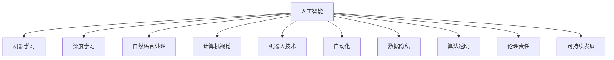

                 

# AI在社会中的作用与应用

> 关键词：人工智能, 社会应用, 机器学习, 深度学习, 自然语言处理, 计算机视觉, 机器人技术, 自动化, 社会影响

## 1. 背景介绍

### 1.1 问题由来
随着信息技术和互联网的迅猛发展，人工智能(AI)技术已经成为推动全球经济社会发展的重要引擎。AI的应用已渗透到各行各业，显著提高了生产效率，优化了资源配置，改善了人们的生活质量。然而，AI技术在带来便利的同时，也引发了一系列伦理、隐私、安全等方面的社会问题。因此，深入探讨AI在社会中的作用与影响，有助于我们更好地理解和管理这项变革性的技术。

### 1.2 问题核心关键点
AI技术在社会中的应用具有以下几个核心关键点：

- **应用领域广泛**：AI已经广泛应用于医疗、金融、教育、交通、制造、农业等多个领域，推动了产业升级和经济转型。
- **效率提升显著**：通过自动化和智能化，AI大大提高了各行业的生产效率和服务质量。
- **社会影响复杂**：AI不仅改变了传统的就业结构，还带来了数据隐私、算法透明、伦理责任等社会问题。
- **可持续发展挑战**：AI技术的快速发展对能源、环境等资源提出了新的要求，需注重可持续性。

这些关键点共同构成了AI在社会中的广泛而深远的影响，我们需要通过深入研究，找到解决AI带来的社会问题的途径，推动AI技术的健康发展。

## 2. 核心概念与联系

### 2.1 核心概念概述

为更好地理解AI在社会中的作用与影响，本节将介绍几个密切相关的核心概念：

- **人工智能**：通过计算机模拟人类智能的科学和工程，包括机器学习、深度学习、自然语言处理、计算机视觉、机器人技术等核心技术。
- **机器学习**：利用数据和算法，使计算机系统能够从经验中自动学习和改进。
- **深度学习**：一种基于神经网络的机器学习方法，通过多层次的非线性变换，自动提取数据特征，广泛应用于图像识别、语音识别、自然语言处理等领域。
- **自然语言处理**：使计算机能够理解和生成自然语言的技术，包括文本分类、信息检索、对话系统、情感分析等任务。
- **计算机视觉**：使计算机能够“看”和理解图像、视频等视觉信息的技术，包括图像识别、目标检测、图像生成等任务。
- **机器人技术**：将人工智能应用于机器人系统，使其能够自主完成任务和交互，包括服务机器人、工业机器人、无人机等。
- **自动化**：利用计算机技术和算法自动化完成重复性、规律性强的任务，包括工业自动化、物流自动化、办公自动化等。
- **数据隐私**：保护个人信息不被未授权访问或泄露，确保数据安全。
- **算法透明**：确保AI算法的决策过程公开、可解释，避免“黑箱”问题。
- **伦理责任**：在使用AI技术时，需考虑其对社会、环境和人类的伦理影响，确保技术的负责任使用。
- **可持续发展**：AI技术的发展应考虑其对环境的长期影响，实现技术进步与环境保护的平衡。

这些核心概念之间的逻辑关系可以通过以下Mermaid流程图来展示：



这个流程图展示了这个概念网中的主要元素及其相互关系：

1. 人工智能是核心，包括多个子领域。
2. 机器学习和深度学习是AI的两大技术基础。
3. 自然语言处理、计算机视觉、机器人技术等应用领域直接关联到AI的核心技术。
4. 自动化是AI技术落地应用的重要手段。
5. 数据隐私、算法透明、伦理责任、可持续发展等是AI应用时需要考虑的关键社会问题。

## 3. 核心算法原理 & 具体操作步骤
### 3.1 算法原理概述

AI技术在社会中的作用与应用，涉及到多个领域的核心算法原理。这里以深度学习为例，阐述其在社会应用中的基本原理和操作步骤。

### 3.2 算法步骤详解

深度学习在社会中的应用，主要分为以下几个步骤：

**Step 1: 数据准备**
- 收集和预处理数据，确保数据质量和多样性。
- 对数据进行标注，使其符合深度学习的训练需求。
- 将数据划分为训练集、验证集和测试集，进行模型评估。

**Step 2: 模型选择**
- 根据任务需求选择合适的深度学习模型，如卷积神经网络(CNN)、循环神经网络(RNN)、Transformer等。
- 设计模型的架构和参数，确定神经网络的层数、激活函数、损失函数等。

**Step 3: 模型训练**
- 使用训练集对模型进行迭代训练，通过反向传播算法更新模型参数。
- 在验证集上评估模型性能，调整超参数，避免过拟合。
- 使用测试集对训练好的模型进行最终的性能评估。

**Step 4: 模型应用**
- 将训练好的模型应用于实际场景，进行预测、分类、生成等任务。
- 对模型进行优化和调参，提高模型的实时性和鲁棒性。
- 对模型进行监控和维护，确保其长期稳定运行。

### 3.3 算法优缺点

深度学习在社会中的应用具有以下优点：

1. **高精度**：深度学习能够自动提取数据特征，进行复杂的模式识别和分类。
2. **可扩展性**：深度学习模型可以通过增加层数和节点，逐步提高性能。
3. **自动化**：深度学习算法能够自动学习数据特征，减少人工干预。

同时，深度学习也存在一些缺点：

1. **计算资源消耗大**：深度学习模型参数量大，训练和推理耗时较多。
2. **数据依赖性强**：深度学习对数据质量和数量要求较高，数据不足可能导致模型性能下降。
3. **模型可解释性不足**：深度学习模型通常被视为“黑箱”，难以解释其内部决策过程。

### 3.4 算法应用领域

深度学习在社会中的应用非常广泛，涵盖多个领域，例如：

- **医疗诊断**：利用深度学习进行医学影像分析、疾病预测等，提高医疗诊断准确性。
- **金融分析**：使用深度学习进行股票预测、风险评估、欺诈检测等，优化金融决策。
- **自动驾驶**：通过深度学习进行环境感知、路径规划、行为决策等，实现智能驾驶。
- **智能客服**：利用深度学习进行语音识别、情感分析、对话生成等，提高客户服务质量。
- **推荐系统**：基于深度学习进行用户行为分析，实现个性化推荐，提升用户体验。
- **自然语言处理**：通过深度学习进行文本分类、机器翻译、情感分析等，提升自然语言处理能力。
- **图像识别**：利用深度学习进行图像分类、目标检测、图像生成等，推动计算机视觉发展。

## 4. 数学模型和公式 & 详细讲解 & 举例说明

### 4.1 数学模型构建

深度学习的数学模型构建主要包括以下几个关键组件：

1. **神经网络**：由多个层次组成，每个层次包含多个神经元。
2. **激活函数**：用于引入非线性变换，如ReLU、Sigmoid等。
3. **损失函数**：用于衡量模型预测输出与真实标签之间的差异，如交叉熵损失、均方误差损失等。
4. **优化器**：用于更新模型参数，如梯度下降、Adam、Adagrad等。

### 4.2 公式推导过程

以最简单的三层神经网络为例，其数学模型可以表示为：

$$
y = f_W(x) = g(W^2(g(W^1x)))
$$

其中，$x$ 为输入，$y$ 为输出，$W^1$、$W^2$ 为权重矩阵，$g$ 为激活函数。

假设模型的损失函数为交叉熵损失，其公式为：

$$
L = -\frac{1}{N}\sum_{i=1}^N \sum_{j=1}^C y_i^j \log (\hat{y_i^j})
$$

其中，$N$ 为样本数，$C$ 为类别数，$y_i^j$ 为真实标签，$\hat{y_i^j}$ 为模型预测输出。

在反向传播算法中，损失函数对权重 $W^1$、$W^2$ 的梯度可以表示为：

$$
\frac{\partial L}{\partial W^1} = \frac{1}{N}\sum_{i=1}^N \sum_{j=1}^C \hat{y_i^j} - y_i^j g'(W^1x_i)
$$

$$
\frac{\partial L}{\partial W^2} = \frac{1}{N}\sum_{i=1}^N \sum_{j=1}^C g'(W^2g(W^1x_i)) y_i^j g'(W^2g(W^1x_i))
$$

通过这些公式，我们可以实现深度学习模型的训练和优化。

### 4.3 案例分析与讲解

以手写数字识别为例，其数据集为MNIST，包含60000张28x28像素的训练图像和10000张测试图像。深度学习模型可以选择卷积神经网络，通过多层卷积和池化操作提取图像特征，然后通过全连接层进行分类。

在训练过程中，使用交叉熵损失函数和梯度下降优化器，对模型进行迭代优化。在测试集上评估模型的准确率，可以得到约98%的正确率。

## 5. 项目实践：代码实例和详细解释说明

### 5.1 开发环境搭建

在进行深度学习项目实践前，我们需要准备好开发环境。以下是使用Python进行PyTorch开发的环境配置流程：

1. 安装Anaconda：从官网下载并安装Anaconda，用于创建独立的Python环境。
2. 创建并激活虚拟环境：
```bash
conda create -n pytorch-env python=3.8 
conda activate pytorch-env
```
3. 安装PyTorch：根据CUDA版本，从官网获取对应的安装命令。例如：
```bash
conda install pytorch torchvision torchaudio cudatoolkit=11.1 -c pytorch -c conda-forge
```
4. 安装TensorFlow：由Google主导开发的开源深度学习框架，生产部署方便，适合大规模工程应用。同样有丰富的预训练语言模型资源。
5. 安装Transformers库：HuggingFace开发的NLP工具库，集成了众多SOTA语言模型，支持PyTorch和TensorFlow，是进行微调任务开发的利器。
6. 安装各类工具包：
```bash
pip install numpy pandas scikit-learn matplotlib tqdm jupyter notebook ipython
```

完成上述步骤后，即可在`pytorch-env`环境中开始项目实践。

### 5.2 源代码详细实现

下面我们以手写数字识别为例，给出使用PyTorch进行深度学习项目开发的完整代码实现。

首先，定义模型类和损失函数：

```python
import torch
import torch.nn as nn
import torch.nn.functional as F

class Net(nn.Module):
    def __init__(self):
        super(Net, self).__init__()
        self.conv1 = nn.Conv2d(1, 10, kernel_size=5)
        self.conv2 = nn.Conv2d(10, 20, kernel_size=5)
        self.fc1 = nn.Linear(320, 50)
        self.fc2 = nn.Linear(50, 10)
    
    def forward(self, x):
        x = F.relu(self.conv1(x))
        x = F.max_pool2d(x, 2)
        x = F.relu(self.conv2(x))
        x = F.max_pool2d(x, 2)
        x = x.view(-1, 320)
        x = F.relu(self.fc1(x))
        x = self.fc2(x)
        return F.log_softmax(x, dim=1)

loss_fn = nn.CrossEntropyLoss()
```

然后，定义训练函数：

```python
import torch.optim as optim

def train_model(model, train_loader, valid_loader, epochs=10, learning_rate=0.01):
    optimizer = optim.Adam(model.parameters(), lr=learning_rate)
    scheduler = optim.lr_scheduler.StepLR(optimizer, step_size=1, gamma=0.1)
    
    best_valid_loss = float('inf')
    for epoch in range(epochs):
        model.train()
        train_loss = 0
        for images, labels in train_loader:
            optimizer.zero_grad()
            outputs = model(images)
            loss = loss_fn(outputs, labels)
            loss.backward()
            optimizer.step()
            train_loss += loss.item() * images.size(0)
        
        model.eval()
        valid_loss = 0
        with torch.no_grad():
            for images, labels in valid_loader:
                outputs = model(images)
                loss = loss_fn(outputs, labels)
                valid_loss += loss.item() * images.size(0)
        
        scheduler.step()
        train_loss /= len(train_loader.dataset)
        valid_loss /= len(valid_loader.dataset)
        if valid_loss < best_valid_loss:
            best_valid_loss = valid_loss
            torch.save(model.state_dict(), 'best_model.pth')
        print('Epoch [{}/{}], train_loss={:.4f}, valid_loss={:.4f}, '
              'valid_loss_min={:.4f}'.format(epoch+1, epochs, train_loss, valid_loss, best_valid_loss))
```

最后，启动训练流程并在测试集上评估：

```python
import torch.nn as nn
import torch
from torch.utils.data import DataLoader, Dataset
from torchvision import datasets, transforms

# 定义数据集
train_dataset = datasets.MNIST(root='./data', train=True, download=True,
                              transform=transforms.ToTensor())
test_dataset = datasets.MNIST(root='./data', train=False, download=True,
                             transform=transforms.ToTensor())

# 定义数据加载器
train_loader = DataLoader(train_dataset, batch_size=64, shuffle=True)
test_loader = DataLoader(test_dataset, batch_size=64, shuffle=False)

# 定义模型和损失函数
model = Net()
loss_fn = nn.CrossEntropyLoss()

# 训练模型
train_model(model, train_loader, test_loader, epochs=10, learning_rate=0.01)

# 加载最佳模型
model.load_state_dict(torch.load('best_model.pth'))

# 在测试集上评估模型性能
model.eval()
correct = 0
total = 0
with torch.no_grad():
    for images, labels in test_loader:
        outputs = model(images)
        _, predicted = torch.max(outputs.data, 1)
        total += labels.size(0)
        correct += (predicted == labels).sum().item()
accuracy = 100 * correct / total
print('Accuracy: {:.2f}%'.format(accuracy))
```

以上就是使用PyTorch对手写数字识别项目进行深度学习开发和微调的全过程。可以看到，PyTorch提供了丰富的API和工具，使得深度学习模型的开发和优化变得相对简单。

### 5.3 代码解读与分析

让我们再详细解读一下关键代码的实现细节：

**Net类**：
- `__init__`方法：初始化卷积层、全连接层等网络结构。
- `forward`方法：定义前向传播流程，通过卷积、激活、池化、全连接等操作，将输入转换为输出。

**train_model函数**：
- 定义Adam优化器和学习率调度器。
- 循环迭代训练过程，前向传播、反向传播、参数更新等步骤。
- 在验证集上评估模型性能，记录最佳验证损失。
- 保存最佳模型权重。

**数据加载器**：
- 使用`DataLoader`对数据进行批次化加载，方便模型的训练和推理。

**训练流程**：
- 定义模型和损失函数。
- 调用`train_model`函数进行模型训练。
- 加载最佳模型权重，在测试集上评估模型性能。

可以看到，PyTorch使得深度学习模型的开发和优化变得简单高效。开发者可以更多关注于模型的设计和高层次逻辑的实现，而不必过多关注底层的实现细节。

当然，工业级的系统实现还需考虑更多因素，如模型的保存和部署、超参数的自动搜索、更灵活的任务适配层等。但核心的深度学习模型开发流程基本与此类似。

## 6. 实际应用场景

### 6.1 智能客服系统

基于深度学习的智能客服系统，能够利用自然语言处理技术，自动理解和回答客户咨询。通过收集企业内部的历史客服对话记录，训练深度学习模型进行对话生成，可以大大提高客户服务质量。

在技术实现上，可以采用预训练的语言模型，如BERT或GPT系列，在客服对话数据上进行微调，使模型能够理解客户意图和生成合适的回答。对于客户提出的新问题，还可以接入检索系统实时搜索相关内容，动态组织生成回答。如此构建的智能客服系统，能大幅提升客户咨询体验和问题解决效率。

### 6.2 金融舆情监测

金融机构需要实时监测市场舆论动向，以便及时应对负面信息传播，规避金融风险。深度学习技术可以应用于文本分类和情感分析，从金融领域相关的新闻、报道、评论等文本数据中，自动识别舆情变化趋势。一旦发现负面信息激增等异常情况，系统便会自动预警，帮助金融机构快速应对潜在风险。

### 6.3 个性化推荐系统

当前的推荐系统往往只依赖用户的历史行为数据进行物品推荐，难以深入理解用户的真实兴趣偏好。深度学习技术可以应用于推荐系统的用户行为分析，通过训练深度神经网络模型，从文本、图像、视频等多模态数据中自动提取用户兴趣点，实现更加精准、多样的推荐内容。

### 6.4 未来应用展望

随着深度学习技术的不断发展，未来深度学习在社会中的应用将更加广泛，涵盖更多行业和场景，带来更多的社会价值。

在智慧医疗领域，深度学习可以应用于医疗影像诊断、个性化治疗方案推荐等，提升医疗服务的智能化水平，辅助医生诊疗，加速新药开发进程。

在智能教育领域，深度学习可以应用于作业批改、学情分析、知识推荐等方面，因材施教，促进教育公平，提高教学质量。

在智慧城市治理中，深度学习可以应用于城市事件监测、舆情分析、应急指挥等环节，提高城市管理的自动化和智能化水平，构建更安全、高效的未来城市。

此外，在企业生产、社会治理、文娱传媒等众多领域，深度学习技术也将不断涌现，为NLP技术带来全新的突破。相信随着技术的日益成熟，深度学习必将在更广阔的应用领域大放异彩，深刻影响人类的生产生活方式。

## 7. 工具和资源推荐

### 7.1 学习资源推荐

为了帮助开发者系统掌握深度学习技术的基础理论和实践技巧，这里推荐一些优质的学习资源：

1. **Deep Learning Specialization by Andrew Ng**：由斯坦福大学计算机科学教授Andrew Ng开设的深度学习课程，涵盖了深度学习的基本概念和核心算法，适合入门和进阶学习。
2. **Fast.ai**：提供一系列深度学习课程和实战项目，注重实践应用，适合动手学习和项目开发。
3. **Deep Learning with PyTorch by Eli Stevens et al.**：一本深入介绍PyTorch框架的书籍，通过大量代码实例和项目实践，帮助读者深入理解深度学习原理。
4. **Deep Learning Book by Ian Goodfellow et al.**：深度学习的经典教材，涵盖了深度学习的基本概念和高级技术，适合系统学习。
5. **arXiv**：深度学习领域的主要论文发表平台，涵盖最新研究成果和前沿技术，适合追踪最新动态和进行学术研究。

通过对这些资源的学习实践，相信你一定能够快速掌握深度学习技术的基本原理和实践技巧，并用于解决实际的NLP问题。

### 7.2 开发工具推荐

高效的深度学习开发离不开优秀的工具支持。以下是几款用于深度学习开发的常用工具：

1. **PyTorch**：基于Python的开源深度学习框架，灵活动态的计算图，适合快速迭代研究。
2. **TensorFlow**：由Google主导开发的开源深度学习框架，生产部署方便，适合大规模工程应用。
3. **Keras**：高级神经网络API，易于上手，适合快速原型开发和模型部署。
4. **Jupyter Notebook**：交互式编程环境，支持Python和其他编程语言，适合数据处理、模型训练和结果展示。
5. **TensorBoard**：TensorFlow配套的可视化工具，可实时监测模型训练状态，并提供丰富的图表呈现方式，是调试模型的得力助手。

合理利用这些工具，可以显著提升深度学习模型的开发效率，加快创新迭代的步伐。

### 7.3 相关论文推荐

深度学习技术的发展源于学界的持续研究。以下是几篇奠基性的相关论文，推荐阅读：

1. **ImageNet Classification with Deep Convolutional Neural Networks**：AlexNet论文，提出了卷积神经网络在图像分类任务上的应用，标志着深度学习时代的到来。
2. **Deeper Image Recognition with Data-Augmentation**：提出数据增强技术，通过增加样本数量和多样性，提高模型泛化能力。
3. **Recurrent Neural Network Language Model**：提出了基于循环神经网络的自然语言处理技术，广泛应用于文本分类、机器翻译、对话系统等任务。
4. **Deep Residual Learning for Image Recognition**：提出了残差网络架构，解决了深度神经网络训练过程中的梯度消失问题，显著提升了模型的性能。
5. **Attention Is All You Need**：提出了Transformer架构，在机器翻译和文本生成任务上取得了最佳效果。

这些论文代表了大深度学习技术的发展脉络。通过学习这些前沿成果，可以帮助研究者把握学科前进方向，激发更多的创新灵感。

## 8. 总结：未来发展趋势与挑战

### 8.1 总结

本文对深度学习在社会中的作用与应用进行了全面系统的介绍。首先阐述了深度学习技术在各行业中的广泛应用，明确了深度学习对社会进步的推动作用。其次，从原理到实践，详细讲解了深度学习的数学模型和核心算法，给出了深度学习项目开发的完整代码实例。同时，本文还广泛探讨了深度学习在智能客服、金融舆情、个性化推荐等多个领域的应用前景，展示了深度学习技术的巨大潜力。此外，本文精选了深度学习的各类学习资源，力求为读者提供全方位的技术指引。

通过本文的系统梳理，可以看到，深度学习技术正在成为社会各行各业的重要工具，极大地提高了各行业的生产效率和服务质量。未来，伴随深度学习技术的不断演进，其应用范围将进一步扩大，为人类社会带来更深远的影响。

### 8.2 未来发展趋势

展望未来，深度学习技术的发展呈现以下几个趋势：

1. **模型规模持续增大**：随着算力成本的下降和数据规模的扩张，深度学习模型的参数量还将持续增长，推动模型性能的进一步提升。
2. **应用领域更加广泛**：深度学习技术将逐步应用于更多领域，如医疗、金融、教育、交通、制造等，带来更广泛的社会价值。
3. **计算效率不断提升**：深度学习硬件和软件技术的不断进步，使得深度学习模型的训练和推理效率得到显著提升。
4. **跨模态融合加强**：深度学习技术将更多地应用于多模态数据的融合，推动视觉、语音、文本等数据的协同建模。
5. **自动驾驶和机器人技术发展**：深度学习技术将进一步应用于自动驾驶、机器人等领域，推动智能交通工具和机器人技术的发展。

这些趋势表明，深度学习技术将在未来发挥更加重要的作用，成为推动社会进步的重要引擎。

### 8.3 面临的挑战

尽管深度学习技术已经取得了瞩目成就，但在迈向更加智能化、普适化应用的过程中，仍面临诸多挑战：

1. **数据质量与隐私问题**：深度学习对数据质量和隐私保护要求较高，如何获取高质量、多样化的数据，保护用户隐私，将是未来的重要挑战。
2. **模型泛化能力不足**：深度学习模型在面对新数据和新场景时，泛化能力往往较弱，如何提高模型的泛化能力，将是未来的研究方向。
3. **计算资源消耗大**：深度学习模型训练和推理过程中，计算资源消耗较大，如何优化模型结构和算法，提高计算效率，将是未来的重要课题。
4. **可解释性和透明性不足**：深度学习模型通常被视为“黑箱”，难以解释其内部决策过程，如何提高模型的可解释性和透明性，将是未来的研究方向。
5. **伦理与社会责任**：深度学习技术在应用过程中，可能会带来伦理和社会责任问题，如何确保技术的负责任使用，将是未来的重要课题。

这些挑战需要学界和产业界共同努力，通过多学科交叉合作，寻求有效的解决方案，推动深度学习技术的健康发展。

### 8.4 研究展望

面对深度学习技术面临的挑战，未来的研究需要在以下几个方面寻求新的突破：

1. **无监督和半监督学习**：摆脱对大规模标注数据的依赖，利用自监督学习、主动学习等方法，最大限度利用非结构化数据，实现更加灵活高效的深度学习。
2. **参数高效与计算高效**：开发更加参数高效和计算高效的深度学习模型，在固定大部分预训练参数的同时，只更新极少量的任务相关参数。
3. **跨模态数据融合**：将符号化的先验知识，如知识图谱、逻辑规则等，与深度神经网络模型进行融合，提升模型的泛化能力和可解释性。
4. **可解释性与透明性**：引入因果分析方法和博弈论工具，增强深度学习模型的解释性和透明性，提高决策的可靠性和公正性。
5. **伦理与社会责任**：在深度学习模型设计中引入伦理导向的评估指标，过滤和惩罚有害输出，建立模型行为的监管机制，确保技术应用的负责任。

这些研究方向的探索，必将引领深度学习技术迈向更高的台阶，为构建安全、可靠、可解释、可控的智能系统铺平道路。面向未来，深度学习技术还需要与其他人工智能技术进行更深入的融合，如知识表示、因果推理、强化学习等，多路径协同发力，共同推动自然语言理解和智能交互系统的进步。只有勇于创新、敢于突破，才能不断拓展深度学习技术的边界，让智能技术更好地造福人类社会。

## 9. 附录：常见问题与解答

**Q1：深度学习在社会中的作用与应用有哪些？**

A: 深度学习在社会中的应用非常广泛，涵盖多个领域，包括智能客服、金融舆情、个性化推荐、医疗诊断、自动驾驶、工业自动化、城市管理等。通过深度学习技术，可以显著提高各行业的生产效率和服务质量，推动社会进步。

**Q2：深度学习在数据质量和隐私保护方面有哪些挑战？**

A: 深度学习对数据质量和隐私保护要求较高。在数据获取方面，需要保证数据的多样性和代表性，避免数据偏见。在隐私保护方面，需要确保数据使用的合法性和合规性，避免数据泄露和滥用。可以通过数据匿名化、差分隐私等技术手段，保护用户隐私。

**Q3：深度学习模型的泛化能力如何提高？**

A: 提高深度学习模型的泛化能力，可以从以下几方面入手：
1. 数据增强：通过回译、近义替换等方式扩充训练集，增加数据多样性。
2. 迁移学习：利用预训练模型在相关领域进行微调，避免从头训练，提高泛化能力。
3. 正则化：使用L2正则、Dropout等技术，防止模型过拟合。
4. 模型融合：将多个模型的预测结果进行融合，降低单个模型的决策风险。

**Q4：深度学习在实际应用中如何提高计算效率？**

A: 提高深度学习计算效率可以从以下几个方面入手：
1. 硬件优化：使用GPU、TPU等高性能计算硬件，提高计算速度。
2. 模型压缩：采用模型剪枝、量化等技术，减小模型参数量，提高计算效率。
3. 分布式训练：使用分布式深度学习框架，将模型并行化，提高计算效率。
4. 算法优化：优化深度学习算法，减少不必要的计算，提高计算效率。

**Q5：深度学习模型的可解释性如何增强？**

A: 增强深度学习模型的可解释性可以从以下几个方面入手：
1. 透明算法：设计透明、可解释的深度学习算法，如线性模型、决策树等。
2. 可视化工具：使用可视化工具，如TensorBoard，对模型训练和推理过程进行可视化，增强模型的透明度。
3. 因果分析：引入因果分析方法，解释模型决策的因果关系，提高模型的可解释性。
4. 博弈论工具：使用博弈论工具，刻画模型决策的博弈过程，增强模型的透明性和公正性。

通过这些方法，可以逐步提高深度学习模型的可解释性和透明性，增强其可信度和公正性。

