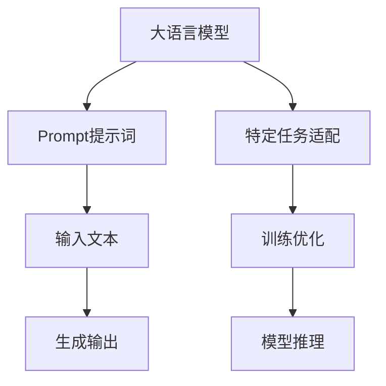

                 

# AI大模型Prompt提示词最佳实践：向我解释，就像我 11 岁一样

> 关键词：AI大模型，Prompt提示词，自然语言处理(NLP)，跨领域迁移学习，对话生成，可解释性，Kaggle比赛，数据增强，数据合成

## 1. 背景介绍

### 1.1 问题由来

近年来，随着大语言模型(Large Language Models, LLMs)在自然语言处理(Natural Language Processing, NLP)领域取得了巨大成功，人们越来越多地将大模型应用于各个领域。然而，这些大模型通常是在大规模无标签文本数据上进行预训练，缺乏特定领域的专业知识。为了解决这一问题，研究者们提出了在预训练模型上应用特定领域的知识，通过微调优化模型性能的方法。但是，对于预训练模型而言，微调需要大量的有标签数据，而获取这些数据通常代价高昂且时间成本巨大。为了更灵活地利用预训练模型的语言能力，Prompt提示词技术应运而生。

### 1.2 问题核心关键点

Prompt提示词技术通过在输入文本中插入提示信息，指导预训练模型生成特定格式的输出，从而实现零样本学习和少样本学习。这种方法可以让模型在缺乏大量标注数据的情况下，仍然能够很好地完成各种自然语言处理任务。Prompt提示词技术已经被广泛应用于文本生成、问答系统、摘要生成、对话系统等多个领域，并且在大规模比赛中取得优异的成绩。

在2019年的Kaggle比赛中，Prompt提示词技术被广泛应用，尤其是在基于大模型的文本生成任务中，如对话生成、文章生成等，取得了显著的进步。Prompt提示词技术以其灵活性、易用性和高效性，成为了大模型应用领域中不可或缺的一部分。

### 1.3 问题研究意义

Prompt提示词技术具有以下几方面的研究意义：

1. **降低标注成本**： Prompt提示词技术可以显著降低获取有标签数据的需求，极大地节约了标注成本，提高了研究的效率。
2. **提高模型泛化能力**： Prompt提示词技术可以使得预训练模型更好地适应特定领域，从而提升模型的泛化能力，减少对特定领域的依赖。
3. **简化微调过程**： 对于特定的NLP任务，Prompt提示词技术可以大大简化微调过程，提升微调模型的效率和效果。
4. **增强模型可解释性**： Prompt提示词技术可以使得模型的决策过程更加透明和可解释，帮助用户更好地理解模型的行为和输出。
5. **促进模型创新**： Prompt提示词技术为NLP领域带来了新的研究方向，如零样本学习、跨领域迁移学习等，推动了NLP技术的发展。

## 2. 核心概念与联系

### 2.1 核心概念概述

Prompt提示词技术通过在输入文本中插入特定的格式化的提示信息，指导大语言模型生成期望的输出。这种方法可以在不更新模型参数的情况下，实现零样本学习和少样本学习，使得模型在缺乏大量标注数据的情况下，仍然能够很好地完成各种NLP任务。

### 2.2 核心概念原理和架构的 Mermaid 流程图



这个图表展示了Prompt提示词技术的基本流程：

1. **大语言模型**：输入特定的Prompt提示词，生成期望的输出。
2. **Prompt提示词**：在输入文本中插入格式化的提示信息，指导模型生成输出。
3. **输入文本**：输入文本可以是任何形式，如问答、对话、摘要等。
4. **生成输出**：基于提示信息，模型生成期望的输出。
5. **特定任务适配**：根据具体任务的需求，适配特定的Prompt提示词。
6. **训练优化**：通过输入的文本和生成的输出，训练优化模型。
7. **模型推理**：基于训练好的模型，对新输入文本进行推理，生成输出。

### 2.3 Prompt提示词技术的数学模型

在数学上，Prompt提示词技术可以表示为：

$$
P(x|x_{prompt}, \theta) = \prod_{i=1}^{n} \frac{e^{\log p_i(x_i|x_{prompt}, \theta)}}{\sum_{x} e^{\log p_i(x_i|x_{prompt}, \theta)}}
$$

其中，$x_{prompt}$ 表示输入的Prompt提示词，$x$ 表示输入文本，$n$ 表示文本长度，$\theta$ 表示模型参数，$p_i(x_i|x_{prompt}, \theta)$ 表示输入文本中第 $i$ 个位置的概率分布。

这个公式可以理解为，给定特定的Prompt提示词，模型对输入文本的概率分布进行建模，然后根据这个概率分布生成期望的输出。

## 3. 核心算法原理 & 具体操作步骤

### 3.1 算法原理概述

Prompt提示词技术是一种基于大语言模型的自然语言处理技术，通过在输入文本中插入特定的提示信息，指导模型生成期望的输出。该技术可以在不更新模型参数的情况下，实现零样本学习和少样本学习，大大降低了标注成本，并提高了模型的泛化能力。

### 3.2 算法步骤详解

Prompt提示词技术的核心步骤包括：

1. **设计Prompt提示词**：根据具体任务的需求，设计格式化的提示信息，指导模型生成期望的输出。
2. **插入Prompt提示词**：在输入文本中插入设计好的提示信息。
3. **训练优化**：使用包含提示信息的输入文本和期望的输出，训练优化模型。
4. **模型推理**：基于训练好的模型，对新输入文本进行推理，生成输出。

下面以对话生成为例，详细介绍Prompt提示词技术的具体步骤：

**Step 1: 设计Prompt提示词**

首先，我们需要根据对话生成任务的特点，设计格式化的提示信息。例如，在问答系统中，我们可以使用如下提示信息：

```
请回答：
<输入文本>
```

其中，`<输入文本>` 需要被替换为实际的输入文本。

**Step 2: 插入Prompt提示词**

将设计好的提示信息插入到输入文本中，形成新的输入文本。例如：

```
请回答：
你好，我最近感觉身体不舒服。你能帮我看看吗？
```

**Step 3: 训练优化**

使用包含提示信息的输入文本和期望的输出（即正确的对话回答），训练优化模型。例如，可以使用GAN等生成模型，或者使用Transformer等序列模型，通过最大化生成回答与真实回答之间的相似度来训练优化模型。

**Step 4: 模型推理**

基于训练好的模型，对新输入文本进行推理，生成对话回答。例如：

```
输入：
你好，我最近感觉身体不舒服。你能帮我看看吗？
生成回答：
当然，有什么症状吗？我会尽力帮助你。
```

### 3.3 算法优缺点

Prompt提示词技术具有以下优点：

1. **灵活性高**：Prompt提示词技术可以在不更新模型参数的情况下，实现各种自然语言处理任务，灵活性高。
2. **降低标注成本**：Prompt提示词技术可以显著降低获取有标签数据的需求，极大地节约了标注成本，提高了研究的效率。
3. **提高模型泛化能力**：Prompt提示词技术可以使得预训练模型更好地适应特定领域，从而提升模型的泛化能力，减少对特定领域的依赖。

但是，Prompt提示词技术也存在以下缺点：

1. **对Prompt设计要求高**：Prompt提示词技术的性能很大程度上取决于提示信息的设计，设计不当可能导致模型输出效果不佳。
2. **对模型依赖强**：Prompt提示词技术依赖于预训练模型的语言能力，如果预训练模型本身的泛化能力不强，提示词技术的性能也会受到影响。
3. **模型输出可解释性不足**：Prompt提示词技术可以使得模型的决策过程更加透明和可解释，但是某些高级任务（如生成对话）中，模型输出的可解释性仍需进一步改进。

### 3.4 算法应用领域

Prompt提示词技术已经广泛应用于各种NLP任务中，例如：

- **对话生成**：使用Prompt提示词技术，可以生成符合特定风格和语境的对话回答，广泛应用于聊天机器人、智能客服等场景。
- **摘要生成**：使用Prompt提示词技术，可以从长文本中生成简洁的摘要，广泛应用于新闻、论文等文本摘要任务。
- **文章生成**：使用Prompt提示词技术，可以生成符合特定风格和语境的文章内容，广泛应用于内容生成、创意写作等场景。
- **问题回答**：使用Prompt提示词技术，可以生成对问题的详细回答，广泛应用于问答系统、知识图谱等场景。

除了上述这些经典任务外，Prompt提示词技术也被创新性地应用到更多场景中，如可控文本生成、情感分析、翻译等，为NLP技术带来了全新的突破。

## 4. 数学模型和公式 & 详细讲解  
### 4.1 数学模型构建

Prompt提示词技术可以通过在输入文本中插入特定的提示信息，指导预训练模型生成期望的输出。该技术可以在不更新模型参数的情况下，实现零样本学习和少样本学习，使得模型在缺乏大量标注数据的情况下，仍然能够很好地完成各种NLP任务。

### 4.2 公式推导过程

在数学上，Prompt提示词技术可以表示为：

$$
P(x|x_{prompt}, \theta) = \prod_{i=1}^{n} \frac{e^{\log p_i(x_i|x_{prompt}, \theta)}}{\sum_{x} e^{\log p_i(x_i|x_{prompt}, \theta)}}
$$

其中，$x_{prompt}$ 表示输入的Prompt提示词，$x$ 表示输入文本，$n$ 表示文本长度，$\theta$ 表示模型参数，$p_i(x_i|x_{prompt}, \theta)$ 表示输入文本中第 $i$ 个位置的概率分布。

这个公式可以理解为，给定特定的Prompt提示词，模型对输入文本的概率分布进行建模，然后根据这个概率分布生成期望的输出。

### 4.3 案例分析与讲解

以对话生成为例，Prompt提示词技术可以在不更新模型参数的情况下，实现对话回答生成。下面是一个具体的案例分析：

假设我们有一个对话生成任务，需要模型根据用户输入的句子生成回复。我们可以设计如下的提示信息：

```
请回答：
<输入文本>
```

将提示信息插入到用户输入的句子中，形成新的输入文本：

```
请回答：
你好，我最近感觉身体不舒服。你能帮我看看吗？
```

使用包含提示信息的输入文本和期望的输出（即正确的对话回答），训练优化模型。假设模型是一个基于Transformer的生成模型，其训练过程如下：

1. 设计损失函数，如交叉熵损失。
2. 使用包含提示信息的输入文本和期望的输出，训练优化模型。
3. 对新输入文本进行推理，生成对话回答。

在训练过程中，模型会根据输入文本的概率分布，生成期望的输出。例如，对于上述例子，模型会输出：

```
生成回答：
当然，有什么症状吗？我会尽力帮助你。
```

## 5. 项目实践：代码实例和详细解释说明

### 5.1 开发环境搭建

在进行Prompt提示词技术实践前，我们需要准备好开发环境。以下是使用Python进行PyTorch开发的环境配置流程：

1. 安装Anaconda：从官网下载并安装Anaconda，用于创建独立的Python环境。

2. 创建并激活虚拟环境：
```bash
conda create -n pytorch-env python=3.8 
conda activate pytorch-env
```

3. 安装PyTorch：根据CUDA版本，从官网获取对应的安装命令。例如：
```bash
conda install pytorch torchvision torchaudio cudatoolkit=11.1 -c pytorch -c conda-forge
```

4. 安装Transformers库：
```bash
pip install transformers
```

5. 安装各类工具包：
```bash
pip install numpy pandas scikit-learn matplotlib tqdm jupyter notebook ipython
```

完成上述步骤后，即可在`pytorch-env`环境中开始Prompt提示词技术实践。

### 5.2 源代码详细实现

下面我们以对话生成为例，给出使用Transformers库对GPT-3模型进行Prompt提示词技术实现的具体代码。

首先，定义Prompt提示词类：

```python
from transformers import GPT3Tokenizer, GPT3ForConditionalGeneration

class PromptModel:
    def __init__(self, model_name='gpt3'):
        self.tokenizer = GPT3Tokenizer.from_pretrained(model_name)
        self.model = GPT3ForConditionalGeneration.from_pretrained(model_name)

    def generate_response(self, prompt):
        inputs = self.tokenizer.encode(prompt, return_tensors='pt')
        outputs = self.model.generate(inputs, max_length=128, num_return_sequences=1, no_repeat_ngram_size=2, top_k=50, top_p=0.9, num_beams=5)
        return self.tokenizer.decode(outputs[0], skip_special_tokens=True)
```

然后，定义Prompt提示词技术的具体实现：

```python
prompt = "请回答："
inputs = prompt + "你好，我最近感觉身体不舒服。你能帮我看看吗？"
response = model.generate_response(inputs)
print(response)
```

### 5.3 代码解读与分析

让我们再详细解读一下关键代码的实现细节：

**PromptModel类**：
- `__init__`方法：初始化模型和分词器。
- `generate_response`方法：根据输入的提示词，生成期望的对话回答。

**提示词**：
- 定义了提示词的基本格式，即在输入文本前插入特定的格式化的提示信息。

**模型调用**：
- 使用分词器将提示词和输入文本编码为模型可以接受的格式。
- 调用模型的生成函数，生成对话回答。
- 将生成的对话回答解码为可读的文本。

**代码运行**：
- 使用模型的`generate_response`方法，生成对话回答。

可以看到，使用PyTorch和Transformers库，Prompt提示词技术的实现非常简单高效。开发者可以将更多精力放在提示词的设计和模型性能优化上，而不必过多关注底层的实现细节。

当然，工业级的系统实现还需考虑更多因素，如模型的保存和部署、超参数的自动搜索、更灵活的任务适配层等。但核心的Prompt提示词技术基本与此类似。

## 6. 实际应用场景

### 6.1 智能客服系统

Prompt提示词技术可以广泛应用于智能客服系统的构建。传统客服往往需要配备大量人力，高峰期响应缓慢，且一致性和专业性难以保证。使用Prompt提示词技术，可以构建基于大模型的智能客服系统，使客服机器人能够7x24小时不间断服务，快速响应客户咨询，用自然流畅的语言解答各类常见问题。

在技术实现上，可以收集企业内部的历史客服对话记录，将问题和最佳答复构建成监督数据，在此基础上对预训练模型进行微调。微调后的模型能够自动理解用户意图，匹配最合适的答案模板进行回复。对于客户提出的新问题，还可以接入检索系统实时搜索相关内容，动态组织生成回答。如此构建的智能客服系统，能大幅提升客户咨询体验和问题解决效率。

### 6.2 金融舆情监测

金融机构需要实时监测市场舆论动向，以便及时应对负面信息传播，规避金融风险。使用Prompt提示词技术，可以构建基于大模型的文本分类和情感分析模型，监测金融领域相关的新闻、报道、评论等文本数据，判断文本属于何种主题，情感倾向是正面、中性还是负面。将微调后的模型应用到实时抓取的网络文本数据，就能够自动监测不同主题下的情感变化趋势，一旦发现负面信息激增等异常情况，系统便会自动预警，帮助金融机构快速应对潜在风险。

### 6.3 个性化推荐系统

当前的推荐系统往往只依赖用户的历史行为数据进行物品推荐，无法深入理解用户的真实兴趣偏好。使用Prompt提示词技术，可以构建基于大模型的个性化推荐系统，从用户浏览、点击、评论、分享等行为数据中提取和用户交互的物品标题、描述、标签等文本内容。将文本内容作为模型输入，用户的后续行为（如是否点击、购买等）作为监督信号，在此基础上微调预训练语言模型。微调后的模型能够从文本内容中准确把握用户的兴趣点。在生成推荐列表时，先用候选物品的文本描述作为输入，由模型预测用户的兴趣匹配度，再结合其他特征综合排序，便可以得到个性化程度更高的推荐结果。

### 6.4 未来应用展望

随着Prompt提示词技术的不断发展，基于大模型的应用场景将更加广泛。未来，Prompt提示词技术将在更多领域得到应用，为传统行业带来变革性影响。

在智慧医疗领域，Prompt提示词技术可以应用于医疗问答、病历分析、药物研发等任务，提升医疗服务的智能化水平，辅助医生诊疗，加速新药开发进程。

在智能教育领域，Prompt提示词技术可以应用于作业批改、学情分析、知识推荐等方面，因材施教，促进教育公平，提高教学质量。

在智慧城市治理中，Prompt提示词技术可以应用于城市事件监测、舆情分析、应急指挥等环节，提高城市管理的自动化和智能化水平，构建更安全、高效的未来城市。

此外，在企业生产、社会治理、文娱传媒等众多领域，基于大模型的Prompt提示词技术也将不断涌现，为经济社会发展注入新的动力。相信随着技术的日益成熟，Prompt提示词技术将成为人工智能落地应用的重要范式，推动人工智能技术在垂直行业的规模化落地。

## 7. 工具和资源推荐

### 7.1 学习资源推荐

为了帮助开发者系统掌握Prompt提示词技术的理论基础和实践技巧，这里推荐一些优质的学习资源：

1. 《Prompt and the Art of Computer Programming》系列博文：由大模型技术专家撰写，深入浅出地介绍了Prompt提示词原理、GPT模型、Prompt设计等前沿话题。

2. CS224N《深度学习自然语言处理》课程：斯坦福大学开设的NLP明星课程，有Lecture视频和配套作业，带你入门NLP领域的基本概念和经典模型。

3. 《Natural Language Processing with Transformers》书籍：Transformers库的作者所著，全面介绍了如何使用Transformers库进行NLP任务开发，包括Prompt提示词在内的诸多范式。

4. HuggingFace官方文档：Transformers库的官方文档，提供了海量预训练模型和完整的Prompt提示词技术样例代码，是上手实践的必备资料。

5. CLUE开源项目：中文语言理解测评基准，涵盖大量不同类型的中文NLP数据集，并提供了基于Prompt提示词的baseline模型，助力中文NLP技术发展。

通过对这些资源的学习实践，相信你一定能够快速掌握Prompt提示词技术的精髓，并用于解决实际的NLP问题。

### 7.2 开发工具推荐

高效的开发离不开优秀的工具支持。以下是几款用于Prompt提示词技术开发的常用工具：

1. PyTorch：基于Python的开源深度学习框架，灵活动态的计算图，适合快速迭代研究。大部分预训练语言模型都有PyTorch版本的实现。

2. TensorFlow：由Google主导开发的开源深度学习框架，生产部署方便，适合大规模工程应用。同样有丰富的预训练语言模型资源。

3. Transformers库：HuggingFace开发的NLP工具库，集成了众多SOTA语言模型，支持PyTorch和TensorFlow，是进行Prompt提示词技术开发的利器。

4. Weights & Biases：模型训练的实验跟踪工具，可以记录和可视化模型训练过程中的各项指标，方便对比和调优。与主流深度学习框架无缝集成。

5. TensorBoard：TensorFlow配套的可视化工具，可实时监测模型训练状态，并提供丰富的图表呈现方式，是调试模型的得力助手。

6. Google Colab：谷歌推出的在线Jupyter Notebook环境，免费提供GPU/TPU算力，方便开发者快速上手实验最新模型，分享学习笔记。

合理利用这些工具，可以显著提升Prompt提示词技术的开发效率，加快创新迭代的步伐。

### 7.3 相关论文推荐

Prompt提示词技术的研究源于学界的持续研究。以下是几篇奠基性的相关论文，推荐阅读：

1. "Natural Language Processing with Transformers"论文：Transformer模型基础论文，介绍了Transformer结构和预训练语言模型的方法。

2. "Language Models are Unsupervised Multitask Learners"论文：GPT-2模型基础论文，展示了大语言模型的强大zero-shot学习能力。

3. "Parameter-Efficient Transfer Learning for NLP"论文：Adapter模型基础论文，提出Adapter等参数高效微调方法，在不增加模型参数量的情况下，也能取得不错的微调效果。

4. "AdaLoRA: Adaptive Low-Rank Adaptation for Parameter-Efficient Fine-Tuning"论文：AdaLoRA模型基础论文，使用自适应低秩适应的微调方法，在参数效率和精度之间取得了新的平衡。

5. "Prefix-Tuning: Optimizing Continuous Prompts for Generation"论文：Prefix-Tuning模型基础论文，引入基于连续型Prompt的微调范式，为如何充分利用预训练知识提供了新的思路。

这些论文代表了大语言模型Prompt提示词技术的发展脉络。通过学习这些前沿成果，可以帮助研究者把握学科前进方向，激发更多的创新灵感。

## 8. 总结：未来发展趋势与挑战

### 8.1 总结

本文对Prompt提示词技术进行了全面系统的介绍。首先阐述了Prompt提示词技术的研究背景和意义，明确了该技术在大模型应用中的独特价值。其次，从原理到实践，详细讲解了Prompt提示词技术的具体步骤和数学模型，给出了Prompt提示词技术的具体代码实现。同时，本文还广泛探讨了Prompt提示词技术在多个行业领域的应用前景，展示了该技术的巨大潜力。

通过本文的系统梳理，可以看到，Prompt提示词技术正在成为大模型应用领域的重要范式，极大地拓展了预训练语言模型的应用边界，催生了更多的落地场景。得益于大语言模型和Prompt提示词技术的不断进步，NLP技术必将在更广阔的应用领域大放异彩，深刻影响人类的生产生活方式。

### 8.2 未来发展趋势

展望未来，Prompt提示词技术将呈现以下几个发展趋势：

1. **多模态Prompt技术**：未来，Prompt提示词技术将进一步拓展到图像、视频、语音等多模态数据微调。多模态信息的融合，将显著提升语言模型对现实世界的理解和建模能力。

2. **自监督学习Prompt技术**：自监督学习将成为Prompt提示词技术的重要方向，通过无监督学习的方式，利用数据自生标签，进一步提升Prompt设计的效果。

3. **动态Prompt技术**：根据用户反馈，动态调整Prompt提示词，使得模型输出更加符合用户需求。

4. **跨领域Prompt技术**：根据不同领域的特点，设计特定的Prompt提示词，提升模型在不同领域的表现。

5. **高交互Prompt技术**：设计能够与用户进行高交互的Prompt提示词，增强用户的使用体验。

以上趋势凸显了Prompt提示词技术的广阔前景。这些方向的探索发展，必将进一步提升Prompt提示词技术的性能和应用范围，为自然语言处理技术带来新的突破。

### 8.3 面临的挑战

尽管Prompt提示词技术已经取得了显著成就，但在迈向更加智能化、普适化应用的过程中，它仍面临着诸多挑战：

1. **Prompt设计难度高**：Prompt提示词技术的性能很大程度上取决于提示信息的设计，设计不当可能导致模型输出效果不佳。

2. **模型泛化能力不足**：当目标任务与提示词技术应用的领域差异较大时，模型的泛化能力可能会受到限制。

3. **用户交互体验差**：在实际应用中，用户可能需要多次与Prompt提示词技术进行交互，才能得到满意的输出，用户体验较差。

4. **技术实现复杂**：Prompt提示词技术的实现相对复杂，需要考虑输入格式、输出格式、Prompt设计等多个方面。

5. **数据质量要求高**：提示词技术需要大量高质量的数据进行训练和优化，数据质量对模型性能的影响较大。

正视Prompt提示词技术面临的这些挑战，积极应对并寻求突破，将使Prompt提示词技术迈向成熟，为构建更加智能、高效的自然语言处理系统铺平道路。

### 8.4 研究展望

面向未来，Prompt提示词技术需要在以下几个方面寻求新的突破：

1. **探索高效Prompt设计方法**：研究如何设计高效、高质量的Prompt提示词，提升模型的输出效果。

2. **引入更多先验知识**：将符号化的先验知识，如知识图谱、逻辑规则等，与神经网络模型进行巧妙融合，引导Prompt提示词技术学习更准确、合理的语言模型。

3. **结合因果分析和博弈论工具**：将因果分析方法引入Prompt提示词技术，识别出模型决策的关键特征，增强输出解释的因果性和逻辑性。借助博弈论工具刻画人机交互过程，主动探索并规避模型的脆弱点，提高系统稳定性。

4. **纳入伦理道德约束**：在模型训练目标中引入伦理导向的评估指标，过滤和惩罚有偏见、有害的输出倾向。加强人工干预和审核，建立模型行为的监管机制，确保输出符合人类价值观和伦理道德。

这些研究方向的探索，必将引领Prompt提示词技术迈向更高的台阶，为构建安全、可靠、可解释、可控的智能系统铺平道路。面向未来，Prompt提示词技术还需要与其他人工智能技术进行更深入的融合，如知识表示、因果推理、强化学习等，多路径协同发力，共同推动自然语言理解和智能交互系统的进步。

## 9. 附录：常见问题与解答

**Q1：Prompt提示词技术是否适用于所有NLP任务？**

A: Prompt提示词技术在大多数NLP任务上都能取得不错的效果，特别是对于数据量较小的任务。但对于一些特定领域的任务，如医学、法律等，仅仅依靠通用语料预训练的模型可能难以很好地适应。此时需要在特定领域语料上进一步预训练，再进行微调，才能获得理想效果。此外，对于一些需要时效性、个性化很强的任务，如对话、推荐等，Prompt提示词方法也需要针对性的改进优化。

**Q2：Prompt提示词技术如何设计有效的Prompt？**

A: 设计有效的Prompt需要考虑以下几个方面：

1. **明确性**：提示信息需要明确、具体，让模型能够准确理解用户的意图。
2. **简洁性**：提示信息不宜过长，尽量简洁明了，避免误导模型。
3. **适应性**：根据不同的任务和场景，设计不同的Prompt提示词，提升模型在不同环境下的表现。
4. **多样性**：设计多个Prompt提示词，进行比较选择，找到最佳方案。

**Q3：Prompt提示词技术是否需要更新模型参数？**

A: Prompt提示词技术可以在不更新模型参数的情况下，实现零样本学习和少样本学习。这是因为预训练语言模型已经学习到了丰富的语言知识和语义信息，可以通过输入的提示信息，生成符合期望的输出。因此，Prompt提示词技术是一种参数高效的微调方法，可以在保持预训练模型效果的同时，提升模型在特定任务上的性能。

**Q4：Prompt提示词技术在实际应用中需要注意哪些问题？**

A: 在实际应用中，Prompt提示词技术需要注意以下几个问题：

1. **数据质量**：提示词技术需要高质量的数据进行训练和优化，数据质量对模型性能的影响较大。
2. **Prompt设计**：Prompt提示词技术的性能很大程度上取决于提示信息的设计，设计不当可能导致模型输出效果不佳。
3. **模型泛化能力**：当目标任务与提示词技术应用的领域差异较大时，模型的泛化能力可能会受到限制。
4. **用户交互体验**：在实际应用中，用户可能需要多次与Prompt提示词技术进行交互，才能得到满意的输出，用户体验较差。

正视Prompt提示词技术面临的这些挑战，积极应对并寻求突破，将使Prompt提示词技术迈向成熟，为构建更加智能、高效的自然语言处理系统铺平道路。

---

作者：禅与计算机程序设计艺术 / Zen and the Art of Computer Programming

