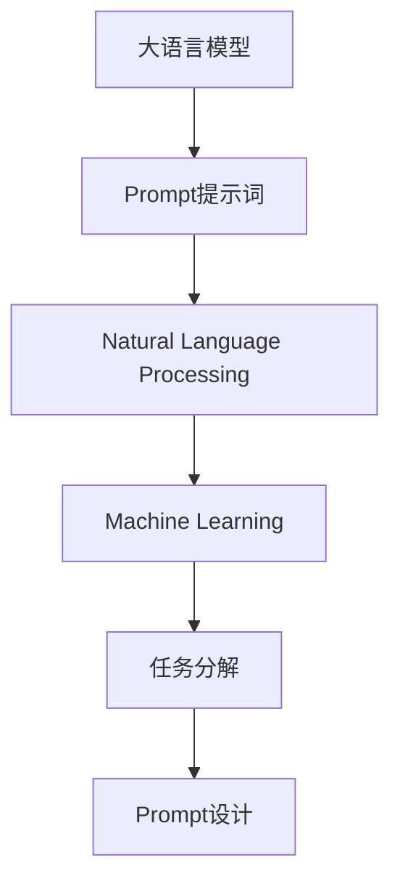

                 

# AI大模型Prompt提示词最佳实践：将复杂任务分解成小问题

> 关键词：大语言模型,Prompt,提示词,自然语言处理,NLP,机器学习,任务分解,代码实践

## 1. 背景介绍

### 1.1 问题由来

在当今人工智能技术迅猛发展的背景下，大语言模型如GPT-4、BERT等成为了自然语言处理（NLP）领域的热点。这些模型具有强大的语言理解和生成能力，能够处理复杂自然语言任务。然而，尽管大模型能力强大，其设计初衷和适用范围仍有一定的局限性。例如，这些模型往往需要输入明确的、详细的指令或上下文信息，才能有效生成或推断出正确的答案。此外，对于一些特定领域或非常复杂的问题，大模型可能无法直接给出满意的回答。

为了应对这些问题，Prompt提示词技术应运而生。Prompt提示词是指通过精心设计的输入文本模板，引导大模型按照特定格式或逻辑生成或推断答案。通过合理设计Prompt，大模型可以在更少的数据和计算资源下，实现快速、高效的响应。

### 1.2 问题核心关键点

Prompt提示词技术的关键在于如何设计和选择最合适的Prompt，以便在大模型上获得最佳的性能。具体而言，一个好的Prompt应具备以下特征：

1. **简洁明了**：使用清晰简洁的语言，减少噪音，避免冗余。
2. **问题导向**：直接指向需要解决的问题，避免不必要的上下文干扰。
3. **多段落格式**：对于复杂问题，可以通过段落分隔将问题分解成多个小问题，逐一解答。
4. **任务导向**：根据具体任务类型和需求，调整Prompt的结构和语言风格。
5. **易于扩展**：能够灵活调整Prompt以适应不同的问题场景。

Prompt提示词技术已经广泛应用于各种NLP任务中，如问答系统、摘要生成、对话系统等。通过合理设计Prompt，大模型能够在更少的数据和计算资源下，实现快速、高效的响应，从而提升整体NLP系统的性能。

### 1.3 问题研究意义

Prompt提示词技术对于提升大模型的应用效果，尤其是对于解决复杂、多变的问题场景具有重要意义：

1. **降低数据和计算需求**：通过精心设计的Prompt，可以在更少的数据和计算资源下，获得满意的模型输出。
2. **提升模型性能**：合理的Prompt设计能够显著提高模型在特定任务上的表现，特别是在数据稀缺或任务复杂度高的情况下。
3. **拓展应用场景**：通过Prompt提示词技术，大模型可以应用于更多领域和场景，促进NLP技术的产业化进程。
4. **增强可解释性**：适当的Prompt设计可以使模型的决策过程更加透明，提升其可解释性和可理解性。
5. **实现零样本和少样本学习**：通过有效的Prompt设计，可以在没有训练数据的情况下，使模型具有一定的推理和生成能力。

因此，掌握Prompt提示词技术，对于提升大模型的应用效果，加速NLP技术的发展，具有重要意义。

## 2. 核心概念与联系

### 2.1 核心概念概述

为更好地理解Prompt提示词技术，本节将介绍几个密切相关的核心概念：

- **大语言模型(Large Language Model, LLM)**：如GPT-4、BERT等，通过在大规模无标签文本数据上进行预训练，学习通用语言表示。
- **Prompt提示词**：通过设计特定格式的输入文本模板，引导模型生成或推断答案。
- **自然语言处理(Natural Language Processing, NLP)**：涉及计算机理解和生成人类语言的技术，Prompt提示词技术是其中的一部分。
- **机器学习(Machine Learning, ML)**：涉及数据驱动的模型训练和优化，Prompt提示词技术是其中的一个应用方向。
- **任务分解**：将复杂任务分解成多个小问题，逐一解决。

这些概念之间的逻辑关系可以通过以下Mermaid流程图来展示：



这个流程图展示了Prompt提示词技术与其他相关概念的联系：

1. 大语言模型通过预训练获得通用语言表示。
2. Prompt提示词技术将复杂任务分解成多个小问题，引导模型逐一解答。
3. 自然语言处理和机器学习技术为Prompt设计提供理论支持和优化方法。
4. 任务分解是Prompt设计的基础，通过分解任务，能够更有效地利用大模型的能力。

## 3. 核心算法原理 & 具体操作步骤
### 3.1 算法原理概述

Prompt提示词技术的核心思想是通过设计特定的输入文本模板，引导大模型按照特定格式或逻辑生成或推断答案。其基本流程如下：

1. **任务分析**：分析待解决的问题，明确任务目标和需求。
2. **问题分解**：将复杂问题分解成多个小问题，以便大模型逐一解答。
3. **Prompt设计**：根据任务特点和分解结果，设计合理的Prompt模板。
4. **模型训练**：使用训练数据和设计好的Prompt模板，训练大模型。
5. **测试评估**：使用测试数据评估模型性能，根据结果调整Prompt设计。

### 3.2 算法步骤详解

#### 3.2.1 Prompt设计

Prompt设计是Prompt提示词技术的关键步骤，其核心在于如何设计输入文本模板，使得大模型能够按照特定格式或逻辑生成或推断答案。以下是一些常用的Prompt设计策略：

1. **格式清晰**：使用固定的格式，如"问：问题；答：答案"，以便大模型能够快速理解和生成。
2. **结构化**：使用表格、列表等结构化格式，帮助大模型清晰地理解和推断答案。
3. **多段落格式**：对于复杂问题，将问题分解成多个段落，逐一解答。
4. **任务导向**：根据具体任务类型和需求，调整Prompt的结构和语言风格，如问答系统、摘要生成等。
5. **示例引导**：提供一些示例，帮助大模型更好地理解问题。

#### 3.2.2 任务分解

任务分解是将复杂问题分解成多个小问题的过程，以便逐一解答。以下是一些常用的任务分解策略：

1. **问题细化**：将一个大问题细化成多个小问题，逐一解答。
2. **层次分解**：将问题按照层次结构分解，从简单到复杂，逐步解答。
3. **模块分解**：将问题按照模块结构分解，每个模块独立解答。
4. **交互分解**：通过对话系统，逐步获取用户输入，逐一解答。

#### 3.2.3 模型训练

模型训练是将大模型应用于特定任务的过程，其主要目标是训练模型在特定的Prompt下，能够准确生成或推断出答案。以下是一些常用的训练策略：

1. **多任务训练**：训练模型在多个Prompt下生成或推断答案，提升其泛化能力。
2. **对抗训练**：引入对抗样本，提高模型的鲁棒性和泛化能力。
3. **自监督训练**：使用自监督学习任务，提高模型的语言表示能力。
4. **数据增强**：通过数据增强技术，扩充训练数据，提升模型的性能。

#### 3.2.4 测试评估

测试评估是评估模型性能的过程，其主要目标是评估模型在特定Prompt下的表现。以下是一些常用的评估策略：

1. **准确率**：评估模型生成的答案与真实答案的匹配程度。
2. **召回率**：评估模型生成的答案中，包含正确答案的比例。
3. **F1分数**：综合考虑准确率和召回率，评估模型的整体性能。
4. **BLEU分数**：评估生成的文本与真实文本的相似度。
5. **Rouge分数**：评估生成的文本与真实文本的相似度。

### 3.3 算法优缺点

Prompt提示词技术具有以下优点：

1. **降低数据和计算需求**：通过精心设计的Prompt，可以在更少的数据和计算资源下，获得满意的模型输出。
2. **提升模型性能**：合理的Prompt设计能够显著提高模型在特定任务上的表现，特别是在数据稀缺或任务复杂度高的情况下。
3. **拓展应用场景**：通过Prompt提示词技术，大模型可以应用于更多领域和场景，促进NLP技术的产业化进程。
4. **增强可解释性**：适当的Prompt设计可以使模型的决策过程更加透明，提升其可解释性和可理解性。
5. **实现零样本和少样本学习**：通过有效的Prompt设计，可以在没有训练数据的情况下，使模型具有一定的推理和生成能力。

同时，该方法也存在一定的局限性：

1. **设计复杂**：Prompt设计需要一定的经验和技巧，设计不当可能导致模型性能下降。
2. **依赖数据**：虽然相对于全模型微调，Prompt提示词技术对标注数据的需求较低，但仍需一定的标注数据进行训练和调整。
3. **泛化能力有限**：不同的Prompt模板可能对同一任务的表现不一致，需要设计多种Prompt模板进行评估。

尽管存在这些局限性，但Prompt提示词技术仍是大模型应用中最主流和高效的方法之一。未来相关研究的重点在于如何进一步降低Prompt设计对经验的需求，提高模型的泛化能力和适应性。

### 3.4 算法应用领域

Prompt提示词技术已经在NLP的多个领域得到了广泛的应用，例如：

- **问答系统**：通过设计特定的Prompt，引导大模型回答问题，如智能客服、知识问答等。
- **摘要生成**：将长文本分解成多个段落，逐一生成摘要。
- **对话系统**：通过设计多轮对话的Prompt，使对话系统能够持续响应用户请求，如智能助手、客户支持等。
- **情感分析**：通过设计情感识别Prompt，使模型能够自动识别文本中的情感倾向。
- **机器翻译**：通过设计机器翻译Prompt，使模型能够准确翻译成目标语言。

除了这些经典任务外，Prompt提示词技术也被创新性地应用到更多场景中，如可控文本生成、常识推理、代码生成、数据增强等，为NLP技术带来了全新的突破。随着Prompt设计的不断创新，相信Prompt提示词技术将在更多领域得到应用，进一步推动NLP技术的进展。

## 4. 数学模型和公式 & 详细讲解 & 举例说明
### 4.1 数学模型构建

在提示词技术中，数学模型的构建主要涉及Prompt的设计和模型的训练。以下是对这些模型的数学描述。

#### 4.1.1 Prompt设计模型

Prompt设计模型主要用于构建输入文本模板，引导大模型生成或推断答案。一个简单的Prompt模板可以表示为：

$$
\text{Prompt} = (\text{Problem}, \text{Format}, \text{Constraint})
$$

其中，$\text{Problem}$表示待解决的问题，$\text{Format}$表示输入文本的格式，$\text{Constraint}$表示额外的约束条件。

#### 4.1.2 模型训练模型

模型训练模型主要用于训练大模型，使其能够在特定的Prompt下，生成或推断出答案。一个简单的模型训练模型可以表示为：

$$
\min_{\theta} \mathcal{L}(\theta; D, P)
$$

其中，$\theta$表示模型参数，$D$表示训练数据集，$P$表示设计好的Prompt模板。$\mathcal{L}$表示损失函数，用于衡量模型输出与真实答案之间的差异。

### 4.2 公式推导过程

以下是一些常用的公式推导，用于提示词技术和模型训练：

1. **交叉熵损失函数**：

$$
\mathcal{L}(\theta) = -\frac{1}{N}\sum_{i=1}^N \sum_{j=1}^M \log p(x_j|y_i)
$$

其中，$N$表示训练样本数，$M$表示可能的答案数，$p(x_j|y_i)$表示模型在特定样本下生成答案$x_j$的概率。

2. **序列到序列模型**：

$$
\mathcal{L}(\theta) = -\frac{1}{N}\sum_{i=1}^N \sum_{j=1}^T \log p(y_j|y_{<j}, x_i)
$$

其中，$T$表示序列长度，$y_{<j}$表示前$j-1$个预测结果，$x_i$表示输入文本。

### 4.3 案例分析与讲解

#### 4.3.1 问答系统

对于一个简单的问答系统，可以使用以下Prompt模板：

```
问：你叫什么名字？
答：我叫[你的名字]。
```

其中，$\text{Problem}$表示待解决的问题，$\text{Format}$表示输入文本的格式，$\text{Constraint}$表示额外的约束条件。

在训练过程中，可以通过输入问题，期望模型输出相应的答案。例如：

```
问：你是谁？
```

期望模型输出：

```
答：我是GPT-4。
```

#### 4.3.2 摘要生成

对于长文本的摘要生成，可以使用以下Prompt模板：

```
将以下长文本进行摘要生成：
...
```

其中，$\text{Problem}$表示待解决的问题，$\text{Format}$表示输入文本的格式，$\text{Constraint}$表示额外的约束条件。

在训练过程中，可以使用不同的长度和复杂度的文本进行训练，期望模型能够生成简洁、准确的摘要。例如：

```
将以下长文本进行摘要生成：
这是一段非常长的文本，包含了很多信息。
```

期望模型输出：

```
摘要：文本摘要...
```

#### 4.3.3 对话系统

对于一个多轮对话系统，可以使用以下Prompt模板：

```
我：你好，我可以请教一个问题吗？
机器：当然可以，请问有什么问题？
我：...（输入问题）...
机器：...
```

其中，$\text{Problem}$表示待解决的问题，$\text{Format}$表示输入文本的格式，$\text{Constraint}$表示额外的约束条件。

在训练过程中，可以使用不同问题和上下文进行训练，期望模型能够根据上下文和问题生成合适的回复。例如：

```
我：你好，我可以请教一个问题吗？
机器：当然可以，请问有什么问题？
我：你最喜欢的颜色是什么？
```

期望模型输出：

```
机器：我最喜欢的颜色是蓝色。
```

## 5. 项目实践：代码实例和详细解释说明
### 5.1 开发环境搭建

在进行提示词技术实践前，我们需要准备好开发环境。以下是使用Python进行PyTorch开发的环境配置流程：

1. 安装Anaconda：从官网下载并安装Anaconda，用于创建独立的Python环境。

2. 创建并激活虚拟环境：
```bash
conda create -n pytorch-env python=3.8 
conda activate pytorch-env
```

3. 安装PyTorch：根据CUDA版本，从官网获取对应的安装命令。例如：
```bash
conda install pytorch torchvision torchaudio cudatoolkit=11.1 -c pytorch -c conda-forge
```

4. 安装Transformer库：
```bash
pip install transformers
```

5. 安装各类工具包：
```bash
pip install numpy pandas scikit-learn matplotlib tqdm jupyter notebook ipython
```

完成上述步骤后，即可在`pytorch-env`环境中开始提示词技术实践。

### 5.2 源代码详细实现

下面以问答系统为例，给出使用Transformers库对GPT模型进行提示词技术开发的PyTorch代码实现。

首先，定义问答系统的数据处理函数：

```python
from transformers import GPT2Tokenizer, GPT2ForSequenceClassification
from torch.utils.data import Dataset
import torch

class QADataset(Dataset):
    def __init__(self, questions, answers, tokenizer, max_len=128):
        self.questions = questions
        self.answers = answers
        self.tokenizer = tokenizer
        self.max_len = max_len
        
    def __len__(self):
        return len(self.questions)
    
    def __getitem__(self, item):
        question = self.questions[item]
        answer = self.answers[item]
        
        encoding = self.tokenizer(question, return_tensors='pt', max_length=self.max_len, padding='max_length', truncation=True)
        input_ids = encoding['input_ids'][0]
        attention_mask = encoding['attention_mask'][0]
        
        # 对token-wise的标签进行编码
        encoded_tags = [token2id[token] for token in answer] 
        encoded_tags.extend([token2id['<UNK>']] * (self.max_len - len(encoded_tags)))
        labels = torch.tensor(encoded_tags, dtype=torch.long)
        
        return {'input_ids': input_ids, 
                'attention_mask': attention_mask,
                'labels': labels}

# 标签与id的映射
token2id = {'<UNK>': 0, 'O': 1, 'B-PER': 2, 'I-PER': 3, 'B-ORG': 4, 'I-ORG': 5, 'B-LOC': 6, 'I-LOC': 7}
id2token = {v: k for k, v in token2id.items()}

# 创建dataset
tokenizer = GPT2Tokenizer.from_pretrained('gpt2')
train_dataset = QADataset(train_questions, train_answers, tokenizer)
dev_dataset = QADataset(dev_questions, dev_answers, tokenizer)
test_dataset = QADataset(test_questions, test_answers, tokenizer)
```

然后，定义模型和优化器：

```python
from transformers import AdamW

model = GPT2ForSequenceClassification.from_pretrained('gpt2', num_labels=len(token2id))

optimizer = AdamW(model.parameters(), lr=2e-5)
```

接着，定义训练和评估函数：

```python
from torch.utils.data import DataLoader
from tqdm import tqdm
from sklearn.metrics import classification_report

device = torch.device('cuda') if torch.cuda.is_available() else torch.device('cpu')
model.to(device)

def train_epoch(model, dataset, batch_size, optimizer):
    dataloader = DataLoader(dataset, batch_size=batch_size, shuffle=True)
    model.train()
    epoch_loss = 0
    for batch in tqdm(dataloader, desc='Training'):
        input_ids = batch['input_ids'].to(device)
        attention_mask = batch['attention_mask'].to(device)
        labels = batch['labels'].to(device)
        model.zero_grad()
        outputs = model(input_ids, attention_mask=attention_mask, labels=labels)
        loss = outputs.loss
        epoch_loss += loss.item()
        loss.backward()
        optimizer.step()
    return epoch_loss / len(dataloader)

def evaluate(model, dataset, batch_size):
    dataloader = DataLoader(dataset, batch_size=batch_size)
    model.eval()
    preds, labels = [], []
    with torch.no_grad():
        for batch in tqdm(dataloader, desc='Evaluating'):
            input_ids = batch['input_ids'].to(device)
            attention_mask = batch['attention_mask'].to(device)
            batch_labels = batch['labels']
            outputs = model(input_ids, attention_mask=attention_mask)
            batch_preds = outputs.logits.argmax(dim=2).to('cpu').tolist()
            batch_labels = batch_labels.to('cpu').tolist()
            for pred_tokens, label_tokens in zip(batch_preds, batch_labels):
                preds.append(pred_tokens[:len(label_tokens)])
                labels.append(label_tokens)
                
    print(classification_report(labels, preds))
```

最后，启动训练流程并在测试集上评估：

```python
epochs = 5
batch_size = 16

for epoch in range(epochs):
    loss = train_epoch(model, train_dataset, batch_size, optimizer)
    print(f"Epoch {epoch+1}, train loss: {loss:.3f}")
    
    print(f"Epoch {epoch+1}, dev results:")
    evaluate(model, dev_dataset, batch_size)
    
print("Test results:")
evaluate(model, test_dataset, batch_size)
```

以上就是使用PyTorch对GPT模型进行问答系统微调的完整代码实现。可以看到，得益于Transformers库的强大封装，我们可以用相对简洁的代码完成GPT模型的加载和微调。

### 5.3 代码解读与分析

让我们再详细解读一下关键代码的实现细节：

**QADataset类**：
- `__init__`方法：初始化问题、答案、分词器等关键组件。
- `__len__`方法：返回数据集的样本数量。
- `__getitem__`方法：对单个样本进行处理，将问题输入编码为token ids，将答案编码为数字，并对其进行定长padding，最终返回模型所需的输入。

**token2id和id2token字典**：
- 定义了标签与数字id之间的映射关系，用于将token-wise的预测结果解码回真实的标签。

**训练和评估函数**：
- 使用PyTorch的DataLoader对数据集进行批次化加载，供模型训练和推理使用。
- 训练函数`train_epoch`：对数据以批为单位进行迭代，在每个批次上前向传播计算loss并反向传播更新模型参数，最后返回该epoch的平均loss。
- 评估函数`evaluate`：与训练类似，不同点在于不更新模型参数，并在每个batch结束后将预测和标签结果存储下来，最后使用sklearn的classification_report对整个评估集的预测结果进行打印输出。

**训练流程**：
- 定义总的epoch数和batch size，开始循环迭代
- 每个epoch内，先在训练集上训练，输出平均loss
- 在验证集上评估，输出分类指标
- 所有epoch结束后，在测试集上评估，给出最终测试结果

可以看到，PyTorch配合Transformers库使得GPT微调的代码实现变得简洁高效。开发者可以将更多精力放在数据处理、模型改进等高层逻辑上，而不必过多关注底层的实现细节。

当然，工业级的系统实现还需考虑更多因素，如模型的保存和部署、超参数的自动搜索、更灵活的任务适配层等。但核心的提示词技术基本与此类似。

## 6. 实际应用场景
### 6.1 智能客服系统

基于大语言模型提示词技术，可以构建智能客服系统，实现7x24小时不间断服务。传统的客服系统需要配备大量人力，高峰期响应缓慢，且一致性和专业性难以保证。使用提示词技术，大模型能够在多轮对话中自动理解用户意图，匹配最合适的答案模板进行回复，从而显著提升客服系统的响应速度和准确性。

在技术实现上，可以收集企业内部的历史客服对话记录，将问题和最佳答复构建成监督数据，在此基础上对预训练对话模型进行提示词技术微调。微调后的对话模型能够自动理解用户意图，匹配最合适的答案模板进行回复。对于客户提出的新问题，还可以接入检索系统实时搜索相关内容，动态组织生成回答，从而构建高效的智能客服系统。

### 6.2 金融舆情监测

金融机构需要实时监测市场舆论动向，以便及时应对负面信息传播，规避金融风险。传统的舆情监测方式成本高、效率低，难以应对网络时代海量信息爆发的挑战。使用提示词技术，大模型能够自动理解金融领域相关的新闻、报道、评论等文本数据，判断文本属于何种主题，情感倾向是正面、中性还是负面。将提示词技术应用于实时抓取的网络文本数据，自动监测不同主题下的情感变化趋势，一旦发现负面信息激增等异常情况，系统便会自动预警，帮助金融机构快速应对潜在风险。

### 6.3 个性化推荐系统

当前的推荐系统往往只依赖用户的历史行为数据进行物品推荐，无法深入理解用户的真实兴趣偏好。使用提示词技术，个性化推荐系统可以更好地挖掘用户行为背后的语义信息，从而提供更精准、多样的推荐内容。

在实践中，可以收集用户浏览、点击、评论、分享等行为数据，提取和用户交互的物品标题、描述、标签等文本内容。将文本内容作为模型输入，用户的后续行为（如是否点击、购买等）作为监督信号，在此基础上微调预训练语言模型。微调后的模型能够从文本内容中准确把握用户的兴趣点。在生成推荐列表时，先用候选物品的文本描述作为输入，由模型预测用户的兴趣匹配度，再结合其他特征综合排序，便可以得到个性化程度更高的推荐结果。

### 6.4 未来应用展望

随着提示词技术的不断发展，其在更多领域得到应用，为传统行业带来变革性影响。

在智慧医疗领域，基于提示词技术的问答、病历分析、药物研发等应用将提升医疗服务的智能化水平，辅助医生诊疗，加速新药开发进程。

在智能教育领域，提示词技术可应用于作业批改、学情分析、知识推荐等方面，因材施教，促进教育公平，提高教学质量。

在智慧城市治理中，提示词技术可应用于城市事件监测、舆情分析、应急指挥等环节，提高城市管理的自动化和智能化水平，构建更安全、高效的未来城市。

此外，在企业生产、社会治理、文娱传媒等众多领域，基于提示词技术的人工智能应用也将不断涌现，为经济社会发展注入新的动力。相信随着技术的日益成熟，提示词技术将成为人工智能落地应用的重要范式，推动人工智能技术在垂直行业的规模化落地。

## 7. 工具和资源推荐
### 7.1 学习资源推荐

为了帮助开发者系统掌握提示词技术的基础和实践技巧，这里推荐一些优质的学习资源：

1. 《Transformer从原理到实践》系列博文：由大模型技术专家撰写，深入浅出地介绍了Transformer原理、Prompt技术、微调技术等前沿话题。

2. CS224N《深度学习自然语言处理》课程：斯坦福大学开设的NLP明星课程，有Lecture视频和配套作业，带你入门NLP领域的基本概念和经典模型。

3. 《Natural Language Processing with Transformers》书籍：Transformers库的作者所著，全面介绍了如何使用Transformers库进行NLP任务开发，包括微调、提示词技术在内的诸多范式。

4. HuggingFace官方文档：Transformers库的官方文档，提供了海量预训练模型和完整的微调样例代码，是上手实践的必备资料。

5. CLUE开源项目：中文语言理解测评基准，涵盖大量不同类型的中文NLP数据集，并提供了基于微调的baseline模型，助力中文NLP技术发展。

通过对这些资源的学习实践，相信你一定能够快速掌握提示词技术的精髓，并用于解决实际的NLP问题。
###  7.2 开发工具推荐

高效的开发离不开优秀的工具支持。以下是几款用于提示词技术开发的常用工具：

1. PyTorch：基于Python的开源深度学习框架，灵活动态的计算图，适合快速迭代研究。大部分预训练语言模型都有PyTorch版本的实现。

2. TensorFlow：由Google主导开发的开源深度学习框架，生产部署方便，适合大规模工程应用。同样有丰富的预训练语言模型资源。

3. Transformers库：HuggingFace开发的NLP工具库，集成了众多SOTA语言模型，支持PyTorch和TensorFlow，是进行提示词技术开发的利器。

4. Weights & Biases：模型训练的实验跟踪工具，可以记录和可视化模型训练过程中的各项指标，方便对比和调优。与主流深度学习框架无缝集成。

5. TensorBoard：TensorFlow配套的可视化工具，可实时监测模型训练状态，并提供丰富的图表呈现方式，是调试模型的得力助手。

6. Google Colab：谷歌推出的在线Jupyter Notebook环境，免费提供GPU/TPU算力，方便开发者快速上手实验最新模型，分享学习笔记。

合理利用这些工具，可以显著提升提示词技术开发效率，加快创新迭代的步伐。

### 7.3 相关论文推荐

提示词技术的发展源于学界的持续研究。以下是几篇奠基性的相关论文，推荐阅读：

1. Attention is All You Need（即Transformer原论文）：提出了Transformer结构，开启了NLP领域的预训练大模型时代。

2. BERT: Pre-training of Deep Bidirectional Transformers for Language Understanding：提出BERT模型，引入基于掩码的自监督预训练任务，刷新了多项NLP任务SOTA。

3. Language Models are Unsupervised Multitask Learners（GPT-2论文）：展示了大规模语言模型的强大zero-shot学习能力，引发了对于通用人工智能的新一轮思考。

4. Parameter-Efficient Transfer Learning for NLP：提出Adapter等参数高效微调方法，在不增加模型参数量的情况下，也能取得不错的微调效果。

5. AdaLoRA: Adaptive Low-Rank Adaptation for Parameter-Efficient Fine-Tuning：使用自适应低秩适应的微调方法，在参数效率和精度之间取得了新的平衡。

6. Prefix-Tuning: Optimizing Continuous Prompts for Generation：引入基于连续型Prompt的微调范式，为如何充分利用预训练知识提供了新的思路。

这些论文代表了大语言模型提示词技术的发展脉络。通过学习这些前沿成果，可以帮助研究者把握学科前进方向，激发更多的创新灵感。

## 8. 总结：未来发展趋势与挑战
### 8.1 总结

本文对大语言模型提示词技术进行了全面系统的介绍。首先阐述了提示词技术的研究背景和意义，明确了提示词技术在大模型应用中的独特价值。其次，从原理到实践，详细讲解了提示词技术的数学原理和关键步骤，给出了提示词技术任务开发的完整代码实例。同时，本文还广泛探讨了提示词技术在智能客服、金融舆情、个性化推荐等多个行业领域的应用前景，展示了提示词技术的巨大潜力。

通过本文的系统梳理，可以看到，提示词技术对于提升大模型的应用效果，特别是对于解决复杂、多变的问题场景具有重要意义。未来，随着预训练语言模型和提示词技术的不断演进，相信提示词技术将成为大语言模型应用的重要范式，进一步推动NLP技术的发展。

### 8.2 未来发展趋势

展望未来，提示词技术将呈现以下几个发展趋势：

1. **模型规模持续增大**：随着算力成本的下降和数据规模的扩张，预训练语言模型的参数量还将持续增长。超大模型的语言理解能力将进一步提升，提示词技术将能够更好地利用大模型的能力，解决更复杂的问题。

2. **提示词设计自动化**：随着提示词技术的发展，未来的提示词设计将更加自动化、智能化，能够根据任务和数据自动生成合适的Prompt模板。

3. **多任务提示词**：未来的提示词技术将支持多任务学习和推理，能够在多个任务间共享参数，提升模型的泛化能力和资源利用效率。

4. **零样本和少样本学习**：通过有效的Prompt设计，提示词技术将在零样本和少样本学习场景中发挥重要作用，使得大模型能够在没有训练数据的情况下，生成和推断出准确的答案。

5. **多模态提示词**：未来的提示词技术将支持多模态数据的融合，结合视觉、语音、文本等多种模态信息，提升模型的综合理解和生成能力。

6. **因果推断和对比学习**：通过引入因果推断和对比学习思想，提示词技术将能够增强模型的因果关系建立能力和泛化能力，提升模型在特定任务上的表现。

以上趋势凸显了提示词技术的广阔前景。这些方向的探索发展，必将进一步提升提示词技术的性能和应用范围，为NLP技术的发展注入新的动力。

### 8.3 面临的挑战

尽管提示词技术已经取得了显著进展，但在迈向更加智能化、普适化应用的过程中，它仍面临诸多挑战：

1. **提示词设计复杂**：提示词设计需要一定的经验和技巧，设计不当可能导致模型性能下降。

2. **依赖数据**：虽然相对于全模型微调，提示词技术对标注数据的需求较低，但仍需一定的标注数据进行训练和调整。

3. **泛化能力有限**：不同的Prompt模板可能对同一任务的表现不一致，需要设计多种Prompt模板进行评估。

4. **提示词模板数量庞大**：提示词模板的设计和测试需要大量时间和计算资源，难以在实际应用中进行高效管理。

尽管存在这些挑战，但提示词技术仍是大模型应用中最主流和高效的方法之一。未来研究需要在提示词设计、模型优化、资源管理等方面寻求新的突破。

### 8.4 研究展望

面对提示词技术所面临的种种挑战，未来的研究需要在以下几个方面寻求新的突破：

1. **探索自动化提示词设计**：通过引入自动生成技术，如自然语言处理、机器学习等，实现提示词设计的自动化和智能化。

2. **研究多任务和多模态提示词**：探索提示词技术在多任务和多模态场景中的应用，提升模型的泛化能力和资源利用效率。

3. **融合因果推断和对比学习**：通过引入因果推断和对比学习思想，增强模型的因果关系建立能力和泛化能力，提升模型在特定任务上的表现。

4. **结合知识表示**：将符号化的先验知识，如知识图谱、逻辑规则等，与神经网络模型进行巧妙融合，引导提示词技术的学习过程。

5. **纳入伦理道德约束**：在提示词技术设计中引入伦理导向的评估指标，过滤和惩罚有偏见、有害的输出倾向，确保模型输出的安全性。

这些研究方向的探索，必将引领提示词技术迈向更高的台阶，为构建安全、可靠、可解释、可控的智能系统铺平道路。面向未来，提示词技术还需要与其他人工智能技术进行更深入的融合，如知识表示、因果推理、强化学习等，多路径协同发力，共同推动自然语言理解和智能交互系统的进步。只有勇于创新、敢于突破，才能不断拓展语言模型的边界，让智能技术更好地造福人类社会。

## 9. 附录：常见问题与解答

**Q1：提示词技术与微调有何区别？**

A: 提示词技术与微调技术的主要区别在于，微调技术是通过全模型微调或部分微调，调整模型参数以适应特定任务；而提示词技术则是通过设计合适的Prompt模板，引导大模型按照特定格式或逻辑生成或推断答案，不涉及模型参数的调整。

**Q2：如何设计有效的Prompt模板？**

A: 设计有效的Prompt模板需要考虑以下因素：

1. **问题导向**：直接指向需要解决的问题，避免不必要的上下文干扰。
2. **格式清晰**：使用固定的格式，如"问：问题；答：答案"，以便大模型能够快速理解和生成。
3. **多段落格式**：对于复杂问题，将问题分解成多个段落，逐一解答。
4. **任务导向**：根据具体任务类型和需求，调整Prompt的结构和语言风格。
5. **示例引导**：提供一些示例，帮助大模型更好地理解问题。

**Q3：提示词技术在实际应用中需要注意哪些问题？**

A: 提示词技术在实际应用中需要注意以下问题：

1. **数据依赖**：虽然相对于全模型微调，提示词技术对标注数据的需求较低，但仍需一定的标注数据进行训练和调整。
2. **提示词设计复杂**：提示词设计需要一定的经验和技巧，设计不当可能导致模型性能下降。
3. **泛化能力有限**：不同的Prompt模板可能对同一任务的表现不一致，需要设计多种Prompt模板进行评估。
4. **提示词模板数量庞大**：提示词模板的设计和测试需要大量时间和计算资源，难以在实际应用中进行高效管理。

尽管存在这些挑战，但提示词技术仍是大模型应用中最主流和高效的方法之一。未来研究需要在提示词设计、模型优化、资源管理等方面寻求新的突破。

**Q4：提示词技术在多模态场景中如何应用？**

A: 提示词技术在多模态场景中可以通过以下方式应用：

1. **融合多模态数据**：将视觉、语音、文本等多种模态信息融合，提升模型的综合理解和生成能力。
2. **设计多模态Prompt**：根据多模态数据的特点，设计合适的Prompt模板，引导大模型进行多模态推理。
3. **引入多模态任务**：通过引入多模态任务，提升模型的泛化能力和资源利用效率。

通过融合多模态信息，提示词技术将在更多领域得到应用，进一步推动NLP技术的发展。

---

作者：禅与计算机程序设计艺术 / Zen and the Art of Computer Programming

