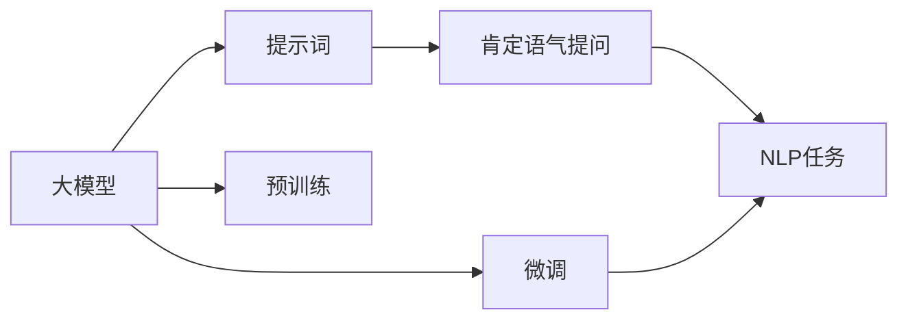

                 

# AI大模型Prompt提示词最佳实践：用肯定语气提问

> 关键词：大模型提示词,Prompt Engineering,肯定语气,自然语言处理,NLP,预训练模型,深度学习,语言生成

## 1. 背景介绍

随着人工智能技术的飞速发展，大模型（如GPT-3, BERT等）在自然语言处理（NLP）领域取得了令人瞩目的成就。这些大模型通过海量的无标签文本数据进行预训练，学习到了复杂的语言表示，具备了强大的语言理解与生成能力。然而，尽管大模型的性能强大，但对于特定任务或特定领域，仅仅依靠预训练模型进行微调仍显不足。因此，如何通过提示（Prompt）技术，引导大模型按照期望的方式生成答案，成为了当前研究的热点。

本文聚焦于使用肯定语气提问，探讨其在AI大模型中的最佳实践。通过肯定语气提问，不仅可以更高效地获取大模型的输出，还能提升模型输出的自然度和流畅度。本文将从背景介绍、核心概念与联系、核心算法原理及具体操作步骤、数学模型与公式推导、项目实践、实际应用场景、工具和资源推荐、总结与展望等不同方面，全面系统地介绍使用肯定语气提问在大模型中的最佳实践。

## 2. 核心概念与联系

### 2.1 核心概念概述

要理解使用肯定语气提问在大模型中的最佳实践，首先需要了解几个关键概念：

- **大模型**：指通过预训练获取语言知识的大型神经网络模型，如GPT-3, BERT等。
- **提示词（Prompt）**：指在输入大模型时，提供的一段引导文本，用于指定模型生成内容的方向。
- **肯定语气提问**：指在提示词中，使用肯定的语气和明确的意图来提问，以获取更精确、自然的答案。
- **自然语言处理（NLP）**：指使用计算机处理和理解人类语言的技术，包括文本生成、信息提取、语义理解等。

这些概念之间存在密切的联系。大模型通过预训练学习到了语言知识和模式，而提示词则用于指定模型如何生成语言，肯定语气提问则进一步优化了提示词设计，使模型输出的语言更加符合预期的需求。

### 2.2 核心概念联系的Mermaid流程图



这个流程图展示了从大模型的预训练到微调，再到使用提示词进行NLP任务的全过程，其中肯定语气提问作为关键环节，用于优化提示词设计。

## 3. 核心算法原理 & 具体操作步骤

### 3.1 算法原理概述

使用肯定语气提问的算法原理，本质上是通过优化提示词设计，引导大模型按照预期的方向生成答案。其核心思想是：在输入大模型时，使用肯定语气和明确的意图来提问，从而使模型输出的语言更加符合预期的需求。

具体来说，在提示词中，使用肯定语气提问意味着在模型前向传播时，模型更容易理解问题意图，生成更自然、流畅的回答。肯定语气提问中的肯定词汇，如“是”、“有”、“能够”等，可以帮助模型更明确地识别任务目标，减少歧义，提升输出质量。

### 3.2 算法步骤详解

使用肯定语气提问的最佳实践，主要分为以下几步：

1. **确定任务目标**：首先明确NLP任务的具体目标，例如文本分类、文本生成、问答等。
2. **设计提示词**：根据任务目标，设计一段包含肯定语气词汇的提示词，确保提示词中使用了“是”、“有”、“能够”等词汇。
3. **输入大模型**：将设计好的提示词输入大模型，进行前向传播计算。
4. **处理输出结果**：根据大模型的输出结果，进一步处理和后处理，以得到最终的NLP任务答案。

### 3.3 算法优缺点

使用肯定语气提问的优势在于：

- **提升自然度**：使用肯定语气提问可以显著提升模型输出的自然度和流畅度，使其更接近人类语言。
- **减少歧义**：肯定语气提问中的肯定词汇可以减少模型的歧义，使模型更明确地理解任务目标。
- **提高效率**：使用肯定语气提问可以加速模型推理过程，减少推理时间。

然而，肯定语气提问也存在一些缺点：

- **难以适应所有场景**：在某些特殊场景下，使用肯定语气提问可能无法达到预期效果，需要进行调整。
- **需要精心设计**：提示词设计需要根据具体任务进行精心调整，不同任务可能需要不同的提示词设计。

### 3.4 算法应用领域

使用肯定语气提问在大模型中的应用领域非常广泛，涵盖NLP中的多个任务，例如：

- **文本分类**：如判断一篇文章的主题，可以将提示词设计为“这篇文章是关于...的”。
- **文本生成**：如生成新闻报道，可以将提示词设计为“请生成关于...的新闻报道”。
- **问答**：如解答特定问题，可以将提示词设计为“请回答关于...的问题”。
- **情感分析**：如判断一段文本的情感倾向，可以将提示词设计为“请判断这段文本是...的情感”。

## 4. 数学模型和公式 & 详细讲解 & 举例说明

### 4.1 数学模型构建

使用肯定语气提问的数学模型构建，主要关注如何通过提示词中的肯定语气词汇，引导大模型生成符合预期目标的语言。设大模型为 $M_{\theta}$，其中 $\theta$ 为模型参数。对于某项NLP任务，其提示词为 $P$，大模型的输出为 $O$。则使用肯定语气提问的数学模型可以表示为：

$$
O = M_{\theta}(P)
$$

其中 $P$ 中包含肯定语气词汇，用于引导模型生成符合预期的答案。

### 4.2 公式推导过程

在推导使用肯定语气提问的数学模型时，需要使用语言模型和注意力机制等基础知识。假设 $P$ 中包含肯定语气词汇，如“是”、“有”、“能够”等，则其在模型中的表示可以表示为：

$$
P = P_{\text{base}} + P_{\text{positive}}
$$

其中 $P_{\text{base}}$ 表示不含肯定语气词汇的提示词部分，$P_{\text{positive}}$ 表示包含肯定语气词汇的提示词部分。则大模型的输出可以表示为：

$$
O = M_{\theta}(P) = M_{\theta}(P_{\text{base}} + P_{\text{positive}})
$$

通过将肯定语气词汇嵌入到提示词中，可以显著提升模型输出的自然度和流畅度。

### 4.3 案例分析与讲解

以下是一个简单的案例，展示如何使用肯定语气提问进行文本生成任务。

假设任务是生成一篇关于“人工智能”的博客文章。可以设计如下的提示词：

```
请为“人工智能”写一篇博客文章，内容包括：
人工智能的历史
人工智能的应用场景
人工智能的未来
```

其中，“请为...写一篇博客文章”是一种肯定语气提问，可以引导模型生成符合预期的文章。模型会根据输入的提示词，生成一篇关于“人工智能”的博客文章。

## 5. 项目实践：代码实例和详细解释说明

### 5.1 开发环境搭建

在进行使用肯定语气提问的大模型实践前，需要准备好开发环境。以下是在Python中进行使用的前提条件和环境搭建步骤：

1. **安装Python**：下载并安装在Windows或Linux系统中。
2. **安装TensorFlow**：从官网下载并安装TensorFlow版本。
3. **安装Transformers库**：使用pip安装，用于处理NLP任务。
4. **安装PyTorch**：使用conda安装，用于深度学习模型的训练和推理。

### 5.2 源代码详细实现

以下是一个简单的使用肯定语气提问进行文本生成任务的代码实现：

```python
import torch
from transformers import T5ForConditionalGeneration, T5Tokenizer

# 加载预训练模型和分词器
model = T5ForConditionalGeneration.from_pretrained('t5-small')
tokenizer = T5Tokenizer.from_pretrained('t5-small')

# 设计提示词
prompt = "请为“人工智能”写一篇博客文章，内容包括："

# 将提示词转换为分词后的形式
inputs = tokenizer(prompt, return_tensors='pt')

# 进行模型推理
outputs = model.generate(inputs['input_ids'], max_length=128)

# 将输出结果转换为可读文本
generated_text = tokenizer.decode(outputs[0], skip_special_tokens=True)
```

### 5.3 代码解读与分析

上述代码中，我们使用了T5模型进行文本生成任务。首先加载了预训练的T5模型和分词器，设计了包含肯定语气提问的提示词。然后，将提示词转换为分词后的形式，输入到模型中进行推理计算，最终得到生成的文本。

代码的关键点在于：

- 使用肯定语气提问设计提示词，确保模型能够明确理解任务目标。
- 将提示词转换为分词形式，确保输入模型的形式正确。
- 使用模型进行生成任务，确保生成的文本符合预期的目标。

### 5.4 运行结果展示

运行上述代码，将得到一篇关于“人工智能”的博客文章。文章将包含人工智能的历史、应用场景和未来展望等内容，具体内容取决于生成的结果。

## 6. 实际应用场景

### 6.1 智能客服系统

在智能客服系统中，使用肯定语气提问可以显著提升系统对话的自然度和流畅度，使客户体验更加友好。例如，在用户询问某个产品功能时，系统可以使用如下的提示词：

```
请问您想了解“产品X”的哪些功能？
```

其中，“请问”和“想了解”都使用了肯定语气，可以引导系统按照预期的方向回答问题，提升用户体验。

### 6.2 金融舆情监测

在金融舆情监测中，使用肯定语气提问可以帮助系统更准确地判断舆情情绪。例如，在监测某金融产品时，系统可以使用如下的提示词：

```
请问公众对“金融产品X”的评价是正面的还是负面的？
```

其中，“请问”和“评价”都使用了肯定语气，可以引导系统进行情感分析，判断舆情情绪。

### 6.3 个性化推荐系统

在个性化推荐系统中，使用肯定语气提问可以帮助系统更准确地理解用户需求，推荐符合用户期望的内容。例如，在推荐某本书时，系统可以使用如下的提示词：

```
请问您喜欢哪种类型的书？
```

其中，“请问”和“喜欢”都使用了肯定语气，可以引导系统进行用户偏好分析，推荐符合用户期望的书籍。

## 7. 工具和资源推荐

### 7.1 学习资源推荐

以下是一些推荐的资源，可以帮助开发者系统掌握使用肯定语气提问在大模型中的最佳实践：

1. **《深度学习与NLP》**：一本介绍深度学习在NLP中应用的经典教材，涵盖了从基础到高级的多个主题，包括使用肯定语气提问的案例。
2. **《自然语言处理入门》**：一本介绍NLP基础概念和技术的书籍，详细讲解了提示词设计和肯定语气提问的应用。
3. **Hugging Face官方文档**：提供了丰富的预训练模型和提示词设计样例，适合快速上手实践。
4. **Google Colab**：谷歌提供的免费在线Jupyter Notebook环境，可以用于快速实验和验证使用肯定语气提问的效果。

### 7.2 开发工具推荐

以下是一些推荐的开发工具，可以帮助开发者更高效地进行使用肯定语气提问的实践：

1. **PyTorch**：基于Python的深度学习框架，适合快速迭代研究。
2. **TensorFlow**：由Google主导的深度学习框架，适合大规模工程应用。
3. **Transformers库**：提供了丰富的预训练模型和提示词设计工具，适合NLP任务开发。
4. **TensorBoard**：TensorFlow配套的可视化工具，可以实时监测模型训练状态，提供丰富的图表展示。

### 7.3 相关论文推荐

以下是一些推荐的相关论文，可以帮助开发者深入了解使用肯定语气提问在大模型中的最佳实践：

1. **《Prompt Engineering for Large Language Models》**：介绍如何使用提示词优化大模型输出，包括肯定语气提问的案例。
2. **《A Survey on Prompt Engineering for Generative Pre-trained Models》**：对使用肯定语气提问在大模型中的实践进行了系统总结，提供了丰富的案例和实验结果。
3. **《Prompt Tuning: Improving Large Language Models with Adaptive Logit Matching》**：提出了一种基于逻辑匹配的 Prompt Tuning 方法，可以显著提升大模型输出的质量。

## 8. 总结：未来发展趋势与挑战

### 8.1 研究成果总结

使用肯定语气提问在大模型中的应用，已经取得了显著的成果，广泛应用于智能客服、金融舆情监测、个性化推荐等多个领域。其关键在于通过精心设计提示词，引导大模型生成符合预期目标的语言，提升自然度和流畅度。

### 8.2 未来发展趋势

未来，使用肯定语气提问在大模型中的应用将呈现以下趋势：

1. **更广泛的领域应用**：随着大模型技术的不断进步，使用肯定语气提问将应用于更多领域，如医疗、教育、娱乐等。
2. **更高效的算法设计**：未来的算法设计将更加注重高效性和可解释性，提升使用肯定语气提问的效果。
3. **更智能的提示词生成**：使用AI生成更智能的提示词，可以显著提升使用肯定语气提问的效果，使其更加符合用户需求。

### 8.3 面临的挑战

尽管使用肯定语气提问在大模型中的应用已经取得了显著的成果，但在实际应用中仍面临以下挑战：

1. **提示词设计困难**：不同任务的提示词设计需要精心调整，且难以找到通用的设计方法。
2. **模型鲁棒性不足**：在特定场景下，使用肯定语气提问的效果可能不佳，需要进行优化。
3. **计算资源消耗大**：使用大模型进行生成任务，计算资源消耗较大，需要优化算法和模型结构。

### 8.4 研究展望

未来的研究需要在以下几个方面进行探索：

1. **自动化提示词生成**：使用AI自动生成高质量的提示词，可以显著提升使用肯定语气提问的效果。
2. **多模态融合**：将使用肯定语气提问与其他NLP技术进行融合，如知识图谱、语义角色标注等，提升模型的表现力。
3. **模型优化**：通过优化模型结构和算法，减少计算资源消耗，提升生成任务的效率。

## 9. 附录：常见问题与解答

### Q1: 使用肯定语气提问能否适应所有任务？

A: 使用肯定语气提问并非适用于所有任务，其效果取决于提示词设计的好坏。对于特定任务，需要根据实际情况进行调整，确保提示词中包含足够的肯定语气词汇，且符合任务需求。

### Q2: 使用肯定语气提问是否需要人工调整提示词？

A: 是的，使用肯定语气提问需要根据具体任务进行人工调整，提示词设计需要仔细思考，以确保模型能够明确理解任务目标。

### Q3: 使用肯定语气提问是否会导致模型过度拟合？

A: 使用肯定语气提问并不会导致模型过度拟合，其效果取决于提示词设计的好坏。在提示词设计合理的情况下，使用肯定语气提问可以提升模型输出质量，减少模型偏见。

### Q4: 使用肯定语气提问是否需要调整学习率？

A: 在使用肯定语气提问时，可能需要调整学习率，以确保模型能够充分学习提示词中的语言模式。通常情况下，学习率需要设置为较小的值，以避免破坏预训练权重。

### Q5: 使用肯定语气提问是否需要调整模型参数？

A: 在使用肯定语气提问时，可能需要调整模型参数，以确保模型能够充分学习提示词中的语言模式。通常情况下，模型参数需要设置为较小的值，以避免破坏预训练权重。

作者：禅与计算机程序设计艺术 / Zen and the Art of Computer Programming

