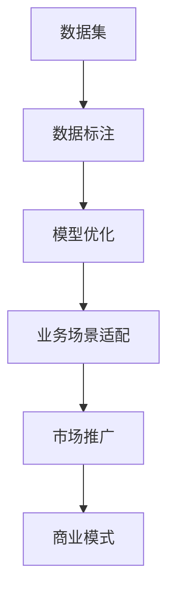

                 

# AI大模型创业：如何实现未来盈利？

随着人工智能技术的发展，大模型技术在各行业的深度应用日益广泛。然而，想要从AI大模型创业中实现盈利并非易事。本文将从AI大模型创业的背景、核心概念与联系、核心算法原理与操作步骤、数学模型和公式、项目实践、实际应用场景、工具和资源推荐、未来发展趋势与挑战、常见问题与解答等多个角度深入探讨，揭示AI大模型创业实现未来盈利的策略与方法。

## 1. 背景介绍

### 1.1 问题由来

近年来，人工智能大模型在各行业中的应用日益普及，带来了一系列颠覆性的变革。例如，GPT-3的出现，改变了人们获取信息、处理文本的方式。然而，AI大模型的研发和应用并非易事，需要大量的数据、计算资源和专业技能，这对许多创业公司构成了巨大的挑战。同时，随着AI大模型在金融、医疗、教育等领域的应用逐渐深入，市场对AI大模型的需求不断增长，使得AI大模型创业成为了一个极具潜力的赛道。

### 1.2 问题核心关键点

AI大模型创业的关键点在于如何有效地将技术转化为商业价值。这不仅涉及模型的研发与训练，更包括数据收集、模型优化、业务场景适配、市场推广等多个环节。因此，从AI大模型创业到实现盈利，需要全面考虑以下几个核心点：

- 数据资源的获取与处理。高质量的数据是训练AI大模型的基础，如何获取、清洗、标注数据至关重要。
- 模型的高效开发与优化。如何在有限的计算资源下，快速迭代优化模型性能，是创业成功的关键。
- 业务场景的适配与市场推广。如何将AI大模型应用于具体业务场景，并推广到市场，获得用户认可和付费，是实现盈利的核心。
- 商业模式的创新。如何在激烈的市场竞争中，找到独特的商业模式，实现可持续发展，是创业企业的长远目标。

## 2. 核心概念与联系

### 2.1 核心概念概述

- **AI大模型**：以深度学习为基础，在大规模数据集上进行预训练，能够处理大规模复杂任务的模型。如GPT-3、BERT等。
- **数据集**：用于模型训练的原始数据集，数据集的质量直接影响模型的性能。
- **数据标注**：为训练数据集中的样本打上标签，方便模型进行学习。
- **模型优化**：通过超参数调整、正则化、集成学习等手段，提升模型性能和泛化能力。
- **业务场景适配**：将AI大模型应用于具体的业务场景，解决实际问题。
- **市场推广**：通过营销、合作等方式，将产品推向市场，获得用户认可和收益。
- **商业模式**：基于AI大模型的创业企业，如何实现盈利，包括SaaS、API销售、定制服务等。

这些概念之间的关系可以概括为：数据驱动模型，模型优化性能，性能适配场景，场景创造需求，需求驱动市场，市场实现盈利。

### 2.2 核心概念原理和架构的 Mermaid 流程图



## 3. 核心算法原理 & 具体操作步骤

### 3.1 算法原理概述

AI大模型的核心算法通常基于深度学习，包括卷积神经网络(CNN)、循环神经网络(RNN)、Transformer等架构。以Transformer为例，其主要原理为自注意力机制，能够在大规模数据集上进行并行计算，有效提升模型性能。

### 3.2 算法步骤详解

#### 3.2.1 数据收集与处理

1. **数据收集**：从公开数据集、行业数据、用户数据等多个渠道收集数据。
2. **数据清洗与标注**：去除噪声数据，对数据进行预处理，如分词、归一化等，同时进行标注，打上相应的标签。

#### 3.2.2 模型训练与优化

1. **模型选择**：选择适合的模型架构，如BERT、GPT-3等。
2. **参数初始化**：通过随机初始化或预训练模型进行初始化。
3. **模型训练**：使用大规模数据集进行训练，不断迭代优化模型参数。
4. **模型验证与测试**：在验证集和测试集上进行验证，评估模型性能。

#### 3.2.3 业务场景适配

1. **需求分析**：深入分析业务场景，明确模型的应用目标和需求。
2. **模型适配**：根据业务需求，调整模型结构、参数等，适配具体场景。
3. **集成开发**：将模型集成到业务系统中，进行端到端测试。

#### 3.2.4 市场推广

1. **产品发布**：发布AI大模型产品，进入市场。
2. **用户营销**：通过社交媒体、展会、合作等方式，推广产品，获得用户关注。
3. **客户服务**：提供技术支持、售后服务，增强用户粘性。

### 3.3 算法优缺点

**优点**：

- 数据驱动：基于大规模数据集训练的模型，具备较强的泛化能力。
- 高效优化：采用自注意力机制等先进算法，大幅提升模型训练速度和性能。
- 业务适配：可灵活应用于不同业务场景，解决实际问题。

**缺点**：

- 数据依赖：高质量数据集的获取和处理成本较高。
- 计算资源需求高：大规模模型的训练和推理需要大量的计算资源。
- 模型复杂度：模型结构复杂，调试和优化难度较大。

### 3.4 算法应用领域

AI大模型技术广泛应用于自然语言处理(NLP)、计算机视觉(CV)、语音识别(SR)等多个领域。例如：

- **NLP**：文本分类、情感分析、机器翻译、问答系统等。
- **CV**：图像识别、目标检测、图像生成等。
- **SR**：语音识别、语音合成、语音情感分析等。

## 4. 数学模型和公式 & 详细讲解

### 4.1 数学模型构建

以Transformer模型为例，其数学模型包括编码器-解码器结构、自注意力机制、位置编码等。数学模型的构建涉及线性代数、概率论、统计学等多个领域。

### 4.2 公式推导过程

#### 4.2.1 编码器-解码器结构

Transformer模型包括编码器和解码器两个部分。编码器负责将输入序列转化为高维特征向量，解码器负责将高维特征向量转化为输出序列。具体公式如下：

$$
\text{Encoder}(X) = \text{MultiHeadAttention}(X, X) + \text{FeedForward}(X)
$$

$$
\text{Decoder}(Y) = \text{MultiHeadAttention}(Y, Y) + \text{FeedForward}(Y)
$$

其中，MultiHeadAttention表示多头注意力机制，FeedForward表示全连接层。

#### 4.2.2 自注意力机制

自注意力机制通过计算输入序列中不同位置之间的关联，得到每个位置的重要程度。具体公式如下：

$$
\text{Attention}(Q, K, V) = \text{softmax}\left(\frac{QK^T}{\sqrt{d_k}}\right)V
$$

其中，Q、K、V分别为查询、键、值向量，$\text{softmax}$表示归一化指数函数。

#### 4.2.3 位置编码

位置编码用于解决Transformer模型中的位置信息缺失问题。具体公式如下：

$$
P = \text{sin}(\frac{2\pi i}{1024} \cdot \text{position})
$$

其中，$P$表示位置编码向量，$i$表示位置索引，$\text{sin}$表示正弦函数。

### 4.3 案例分析与讲解

以情感分析任务为例，使用BERT模型进行情感分析。具体步骤如下：

1. **数据准备**：准备情感分析数据集，包括样本和标签。
2. **模型加载**：加载预训练的BERT模型。
3. **模型微调**：在情感分析数据集上进行微调，更新模型参数。
4. **模型评估**：在验证集和测试集上进行评估，输出模型性能指标。

## 5. 项目实践：代码实例和详细解释说明

### 5.1 开发环境搭建

1. **环境准备**：安装Python、PyTorch、Transformers等依赖库。
2. **模型选择**：选择适合情感分析任务的BERT模型。
3. **数据处理**：对数据集进行分词、编码等预处理。

### 5.2 源代码详细实现

#### 5.2.1 数据准备

```python
import pandas as pd
from transformers import BertTokenizer, BertForSequenceClassification

# 加载情感分析数据集
df = pd.read_csv('sentiment.csv')

# 分词器
tokenizer = BertTokenizer.from_pretrained('bert-base-uncased')

# 模型选择
model = BertForSequenceClassification.from_pretrained('bert-base-uncased', num_labels=2)

# 数据预处理
def tokenize_and_encode(texts, labels):
    # 分词
    tokenized_texts = [tokenizer.tokenize(text) for text in texts]
    # 编码
    encoded_input = tokenizer.convert_tokens_to_ids(tokenized_texts)
    encoded_input = [torch.tensor(encoded_input, dtype=torch.long)]
    labels = torch.tensor(labels, dtype=torch.long)
    return encoded_input, labels
```

#### 5.2.2 模型微调

```python
# 模型微调
optimizer = AdamW(model.parameters(), lr=2e-5)
model.train()
for batch in dataloader:
    input_ids, labels = batch
    outputs = model(input_ids, labels=labels)
    loss = outputs.loss
    loss.backward()
    optimizer.step()
```

#### 5.2.3 模型评估

```python
# 模型评估
model.eval()
preds, labels = [], []
with torch.no_grad():
    for batch in dataloader:
        input_ids, labels = batch
        outputs = model(input_ids)
        preds.append(outputs.logits.argmax(dim=1).tolist())
        labels.append(labels.tolist())

print(classification_report(labels, preds))
```

### 5.3 代码解读与分析

通过以上代码实现，我们可以看到，使用BERT模型进行情感分析微调的过程主要包括以下几个步骤：

1. **数据准备**：将数据集加载到Pandas中，并进行分词和编码。
2. **模型微调**：使用AdamW优化器对模型进行训练，计算损失函数并反向传播更新参数。
3. **模型评估**：在验证集和测试集上评估模型性能，输出分类指标。

### 5.4 运行结果展示

运行以上代码，可以得到模型在情感分析任务上的性能指标，如准确率、召回率、F1-score等。通过不断调整模型参数和优化策略，可以进一步提升模型性能。

## 6. 实际应用场景

### 6.1 智能客服系统

智能客服系统可以显著提高客户体验和响应速度。具体应用场景如下：

1. **对话生成**：使用大模型生成对话内容，自动回复用户问题。
2. **意图识别**：通过大模型进行意图分类，理解用户需求。
3. **知识库查询**：根据用户需求，从知识库中查找相关信息。
4. **任务分配**：将复杂问题转交给人工客服。

### 6.2 金融风险管理

金融风险管理需要对大量数据进行实时分析，使用大模型可以有效提升分析速度和准确性。具体应用场景如下：

1. **舆情监测**：实时监测金融市场舆情，预测市场动向。
2. **欺诈检测**：通过大模型分析交易数据，识别异常交易。
3. **信用评估**：使用大模型进行客户信用评分，评估贷款风险。
4. **投资策略**：通过大模型分析市场数据，制定投资策略。

### 6.3 医疗诊断

医疗诊断需要高精度和低误诊率。具体应用场景如下：

1. **症状诊断**：使用大模型分析患者症状，诊断疾病。
2. **病历分析**：通过大模型分析病历数据，预测疾病风险。
3. **药物研发**：使用大模型分析药物数据，预测药物效果。
4. **健康管理**：通过大模型进行健康监测和预警。

## 7. 工具和资源推荐

### 7.1 学习资源推荐

1. **书籍**：《深度学习》、《自然语言处理综述》、《机器学习实战》等。
2. **在线课程**：Coursera、Udacity、edX等平台提供的深度学习、NLP等相关课程。
3. **社区论坛**：Kaggle、Stack Overflow、GitHub等社区平台，交流技术经验。

### 7.2 开发工具推荐

1. **IDE**：PyCharm、Jupyter Notebook等。
2. **数据处理工具**：Pandas、NumPy等。
3. **深度学习框架**：PyTorch、TensorFlow等。
4. **模型管理工具**：TensorBoard、Weights & Biases等。

### 7.3 相关论文推荐

1. **Transformer**：Attention is All You Need。
2. **BERT**：BERT: Pre-training of Deep Bidirectional Transformers for Language Understanding。
3. **情感分析**：Sentence-Level Emotion Classification Using Multi-Task Learning。
4. **智能客服**：Personalizing AI Chatbots with Attention-Based Multi-task Learning。

## 8. 总结：未来发展趋势与挑战

### 8.1 研究成果总结

AI大模型的应用已经渗透到金融、医疗、教育等多个领域，取得了显著成效。从模型研发到市场推广，每一个环节都面临着诸多挑战。本文对AI大模型的核心概念、算法原理、具体操作步骤、数学模型、项目实践、实际应用、工具资源和未来趋势进行了详细分析，帮助创业企业更好地把握AI大模型创业的方向和方法。

### 8.2 未来发展趋势

未来，AI大模型将向以下几个方向发展：

1. **多模态融合**：将语音、视觉、文本等多种模态数据融合，提升模型的综合能力。
2. **联邦学习**：在分布式环境中训练大模型，保护数据隐私和安全。
3. **自适应学习**：根据用户行为数据，动态调整模型参数，提升模型的个性化能力。
4. **跨领域迁移**：通过知识图谱、规则库等先验知识，提升模型在不同领域之间的迁移能力。
5. **小样本学习**：使用少样本学习技术，提升模型在小数据集上的表现。
6. **伦理与隐私保护**：制定数据隐私保护策略，提升模型的可解释性和可信任度。

### 8.3 面临的挑战

1. **数据获取与标注**：高质量数据集的获取和标注成本较高，对创业企业构成挑战。
2. **计算资源需求**：大规模模型的训练和推理需要大量计算资源，对企业的技术积累和资金投入提出较高要求。
3. **模型优化与优化**：模型优化和超参数调整复杂，需要较高的技术水平和经验。
4. **市场推广与营销**：如何通过市场推广，获得用户认可，实现商业化落地，是创业企业的重要挑战。
5. **商业模式的创新**：如何在激烈的市场竞争中，找到独特的商业模式，实现可持续发展，是创业企业的长远目标。

### 8.4 研究展望

未来，AI大模型技术将向更加智能、高效、可解释的方向发展，带来更广阔的应用前景。如何通过技术创新和商业模式创新，提升AI大模型在各行业中的应用价值，将是大模型创业的关键。

## 9. 附录：常见问题与解答

**Q1：大模型是否适用于所有行业？**

A: 大模型在自然语言处理、计算机视觉、语音识别等领域具有广泛应用，但在某些特定领域，如医疗、金融等，需要更多的领域知识。

**Q2：如何选择合适的数据集？**

A: 数据集的选择需要考虑数据的质量、规模、多样性等因素。可以参考公共数据集，如UCI、Kaggle等，或者从自身业务中收集数据。

**Q3：如何选择适合的模型架构？**

A: 模型架构的选择需要根据具体应用场景进行选择。常用的模型有BERT、GPT、ResNet等。

**Q4：如何优化模型的性能？**

A: 优化模型的性能可以通过调整超参数、正则化、集成学习等手段实现。

**Q5：如何进行模型评估？**

A: 模型评估可以通过准确率、召回率、F1-score等指标进行评估。

**Q6：如何进行市场推广？**

A: 市场推广可以通过社交媒体、展会、合作等方式进行。

通过本文的系统梳理，我们可以看到，AI大模型创业实现未来盈利的关键在于数据获取、模型优化、业务适配、市场推广等多个环节的协同发力。只有全面考虑各个环节，才能真正实现AI大模型的商业价值，推动AI技术在各行业中的广泛应用。

---

作者：禅与计算机程序设计艺术 / Zen and the Art of Computer Programming

