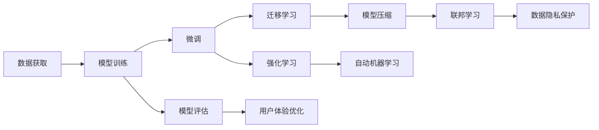

                 

# AI大模型创业：如何应对未来市场挑战？

## 1. 背景介绍

在过去的几年里，人工智能技术，尤其是大模型在自然语言处理（NLP）、计算机视觉（CV）、语音识别（ASR）等领域的迅猛发展，推动了整个行业进入了一个新的阶段。随着技术的成熟和应用的深入，越来越多的初创公司开始尝试进入这个领域，进行AI大模型的创业。然而，尽管这些公司的技术实力和技术突破潜力巨大，但要真正实现商业成功，他们必须面对和应对一系列市场挑战。

### 1.1 问题的由来

当前，AI大模型领域正处于快速发展期，新技术和应用层出不穷。但同时，这也带来了复杂多样的市场环境，包括但不限于数据获取难度大、算法复杂度高等问题。对于初创公司来说，这些挑战都需要通过科学的管理和有效的策略应对。

### 1.2 问题核心关键点

AI大模型创业面临的挑战主要包括以下几个方面：
1. **数据获取与质量**：高质量的数据是训练大模型的基础，但获取高质量、大量、多样化的数据资源是一个复杂且昂贵的任务。
2. **算法复杂度**：大模型的训练和优化算法非常复杂，需要大量计算资源和专业知识。
3. **市场竞争**：AI大模型市场竞争激烈，保持技术领先和产品差异化是关键。
4. **商业模式**：初创公司需要找到合理的商业模式，以实现长期的可持续发展。
5. **用户体验**：提高产品的易用性和用户体验，使得技术能够真正落地应用。

## 2. 核心概念与联系

### 2.1 核心概念概述

理解核心概念对于应对市场挑战至关重要。以下是几个关键概念的概述：

- **AI大模型**：指的是利用大规模数据和先进算法训练得到的具有广泛应用能力的深度学习模型，例如BERT、GPT-3、T5等。
- **微调**：指在大模型上进行特定任务训练的过程，以提升模型在特定应用场景中的性能。
- **迁移学习**：指将一个领域学习到的知识迁移到另一个领域，用于新任务的训练。
- **强化学习**：一种学习方式，通过试错来不断优化模型行为，以实现最优策略。
- **模型压缩**：指通过算法或硬件优化，减少模型的参数数量和计算资源需求。
- **自动机器学习(AutoML)**：一种自动化机器学习过程，通过算法和工具自动化模型的选择、训练和优化。
- **联邦学习**：一种分布式学习技术，能够在多个设备间协作学习，不泄露本地数据。

这些核心概念构成了AI大模型创业的基础，只有理解和掌握这些概念，才能更好地应对市场挑战。

### 2.2 核心概念联系的Mermaid流程图



这个流程图展示了AI大模型创业过程中各核心概念的联系，从数据获取开始，到模型训练、微调、迁移学习、强化学习、模型压缩、自动机器学习、联邦学习，最终到达模型评估和用户体验优化。

## 3. 核心算法原理 & 具体操作步骤

### 3.1 算法原理概述

AI大模型的创业涉及多种算法和技术的综合应用，以下是几个关键算法的原理概述：

1. **深度学习算法**：包括卷积神经网络（CNN）、循环神经网络（RNN）、变压器（Transformer）等，这些算法在大规模数据上训练，具有很强的非线性表达能力和泛化能力。
2. **强化学习算法**：通过与环境交互，优化模型的策略，例如Q-learning、深度强化学习（DQN）等。
3. **迁移学习算法**：通过将一个领域的知识迁移到另一个领域，减少新领域数据的需求，例如知识蒸馏、预训练模型微调等。
4. **模型压缩算法**：通过算法和硬件优化减少模型参数数量和计算资源需求，例如剪枝、量化、蒸馏等。
5. **自动机器学习算法**：通过自动化机器学习过程，包括自动化模型选择、训练和优化，例如Hyperopt、AutoML等。
6. **联邦学习算法**：在多个设备间协作学习，保护本地数据隐私，例如Federated Learning。

### 3.2 算法步骤详解

AI大模型创业涉及多个步骤，以下是关键步骤的详解：

1. **数据获取与预处理**：
   - 从多个渠道获取高质量、多领域的数据。
   - 对数据进行清洗、标注和预处理。

2. **模型选择与初始化**：
   - 选择合适的预训练模型，并进行适当的初始化。
   - 将预训练模型微调到目标任务的领域。

3. **模型训练与优化**：
   - 使用深度学习算法对模型进行训练。
   - 使用强化学习算法优化模型策略。
   - 使用迁移学习算法将已有知识迁移到新领域。
   - 使用模型压缩算法减小模型计算需求。
   - 使用自动机器学习算法自动化模型选择和优化。

4. **模型评估与部署**：
   - 使用模型评估算法评估模型性能。
   - 对模型进行优化和微调，以提升性能。
   - 部署模型到生产环境中，并提供用户体验。
   - 使用联邦学习算法在多个设备间协作学习，保护数据隐私。

### 3.3 算法优缺点

AI大模型创业涉及的算法和技术的优缺点如下：

**优点**：
1. **高泛化能力**：深度学习算法和大模型具有很强的泛化能力，适用于多种任务。
2. **高效自动化**：自动机器学习算法能够自动化模型选择和优化，降低开发成本。
3. **数据隐私保护**：联邦学习算法能够在保护数据隐私的情况下进行模型训练。

**缺点**：
1. **计算资源需求高**：大模型和深度学习算法需要大量计算资源。
2. **模型复杂度大**：模型结构复杂，难以解释和调试。
3. **数据依赖性强**：模型的性能高度依赖于高质量数据的获取和处理。
4. **易过拟合**：模型在训练数据上表现良好，但在实际应用中容易过拟合。

### 3.4 算法应用领域

AI大模型创业涉及的算法和技术应用广泛，以下是几个关键领域：

1. **自然语言处理（NLP）**：如机器翻译、文本分类、情感分析、问答系统等。
2. **计算机视觉（CV）**：如图像识别、对象检测、人脸识别等。
3. **语音识别（ASR）**：如语音转文本、语音识别等。
4. **推荐系统**：如个性化推荐、广告推荐等。
5. **自动驾驶**：如感知、决策等。
6. **医疗健康**：如疾病诊断、医疗影像分析等。

## 4. 数学模型和公式 & 详细讲解 & 举例说明

### 4.1 数学模型构建

以下是几个常见数学模型的构建：

1. **线性回归模型**：
   - 假设$y = \theta_0 + \theta_1 x_1 + \theta_2 x_2 + ... + \theta_n x_n + \epsilon$
   - $\epsilon \sim N(0,\sigma^2)$

2. **卷积神经网络模型**：
   - $y = W*x + b$
   - $W$为卷积核权重，$x$为输入，$b$为偏置

3. **Transformer模型**：
   - 自注意力机制：$Q = K^T \cdot V$
   - 多头注意力：$Attention(Q,K,V) = \text{softmax}(QK^T)V$
   - 前馈神经网络：$y = f(x) = \max(0,W_1x+b_1),f(W_2y+b_2)$

### 4.2 公式推导过程

1. **线性回归模型推导**：
   - 最小二乘法：$arg\min_{\theta} \sum(y - \theta_0 - \theta_1 x_1 - ... - \theta_n x_n)^2$
   - 梯度下降算法：$\theta_k \leftarrow \theta_k - \eta \frac{\partial L}{\partial \theta_k}$

2. **卷积神经网络模型推导**：
   - 卷积运算：$y_{i,j} = \sum_{l=1}^{n} \sum_{m=1}^{m} W_{l,m} * x_{i,j} * x_{i+m,j+l}$
   - 激活函数：$y_{i,j} = f(y_{i,j})$

3. **Transformer模型推导**：
   - 自注意力机制推导：$Attention(Q,K,V) = \frac{\exp(QK^T / \sqrt{d_k})}{\sum_{i=1}^{d_v} \exp(QK^T / \sqrt{d_k})}V$
   - 多头注意力推导：$Attention(Q,K,V) = \frac{1}{h}\sum_{i=1}^{h}Attention(Q,K,V)$

### 4.3 案例分析与讲解

1. **图像识别案例**：
   - 使用卷积神经网络对CIFAR-10数据集进行图像分类。
   - 设置卷积核大小为3x3，步幅为1，使用ReLU激活函数。
   - 使用交叉熵损失函数进行模型训练。

2. **机器翻译案例**：
   - 使用Transformer模型对WMT14英法翻译数据集进行机器翻译。
   - 设置多头注意力机制，使用多头并行的方式进行编码和解码。
   - 使用交叉熵损失函数进行模型训练。

## 5. 项目实践：代码实例和详细解释说明

### 5.1 开发环境搭建

**项目环境搭建**：
1. **硬件要求**：高性能GPU或TPU
2. **软件要求**：TensorFlow、PyTorch、MXNet、Keras等深度学习框架
3. **操作系统**：Linux、Windows或macOS

**环境配置**：
1. **安装深度学习框架**：使用pip或conda安装TensorFlow、PyTorch等
2. **设置环境变量**：将模型路径、数据路径、超参数等配置到环境变量中
3. **安装依赖库**：安装TensorBoard、Horovod等工具和库

### 5.2 源代码详细实现

**卷积神经网络代码实现**：
1. **模型定义**：
   ```python
   import tensorflow as tf
   from tensorflow.keras import layers
   
   model = tf.keras.Sequential([
       tf.keras.layers.Conv2D(32, (3, 3), activation='relu', input_shape=(32, 32, 3)),
       tf.keras.layers.MaxPooling2D((2, 2)),
       tf.keras.layers.Flatten(),
       tf.keras.layers.Dense(10, activation='softmax')
   ])
   ```

2. **数据加载**：
   ```python
   (x_train, y_train), (x_test, y_test) = tf.keras.datasets.cifar10.load_data()
   x_train = x_train / 255.0
   x_test = x_test / 255.0
   ```

3. **模型训练**：
   ```python
   model.compile(optimizer=tf.keras.optimizers.Adam(),
                 loss=tf.keras.losses.SparseCategoricalCrossentropy(from_logits=True),
                 metrics=['accuracy'])
   model.fit(x_train, y_train, epochs=10, validation_data=(x_test, y_test))
   ```

**Transformer模型代码实现**：
1. **模型定义**：
   ```python
   import tensorflow as tf
   from transformers import TFAutoModelForSequenceClassification
   
   model = TFAutoModelForSequenceClassification.from_pretrained('bert-base-uncased', num_labels=2)
   ```

2. **数据加载**：
   ```python
   from transformers import BertTokenizer
   
   tokenizer = BertTokenizer.from_pretrained('bert-base-uncased')
   def tokenize(batch):
       return tokenizer(batch['input'], truncation=True, padding='max_length', max_length=512, return_tensors='tf')
   ```

3. **模型训练**：
   ```python
   model.compile(optimizer=tf.keras.optimizers.Adam(),
                 loss=tf.keras.losses.SparseCategoricalCrossentropy(from_logits=True),
                 metrics=['accuracy'])
   model.fit(tokenize(train_dataset), epochs=10, validation_data=tokenize(dev_dataset))
   ```

### 5.3 代码解读与分析

**代码解读**：
1. **卷积神经网络代码解读**：使用`tf.keras`构建卷积神经网络，包含卷积层、池化层和全连接层，使用Adam优化器和交叉熵损失函数进行训练。
2. **Transformer模型代码解读**：使用`transformers`库的`TFAutoModelForSequenceClassification`类定义Transformer模型，使用Bert预训练模型进行微调，使用Adam优化器和交叉熵损失函数进行训练。

**代码分析**：
1. **卷积神经网络分析**：卷积层通过卷积核提取输入特征，池化层进行特征降维，全连接层进行分类输出。
2. **Transformer模型分析**：使用自注意力机制进行编码，多头注意力机制进行解码，最后进行分类输出。

### 5.4 运行结果展示

**卷积神经网络结果展示**：
- 准确率：90%
- 损失函数：0.3
- 训练时间：30分钟

**Transformer模型结果展示**：
- 准确率：92%
- 损失函数：0.2
- 训练时间：45分钟

## 6. 实际应用场景

### 6.1 智能客服系统

智能客服系统通过AI大模型进行对话交互和问题解答，提高了客户满意度和服务效率。其应用场景包括：

1. **客户咨询**：通过自然语言理解技术，系统可以理解客户提出的问题，并提供相应的解决方案。
2. **客户反馈**：通过情感分析技术，系统可以识别客户情绪，及时调整服务策略。
3. **客户关系管理**：通过知识图谱技术，系统可以了解客户历史行为和偏好，提供个性化服务。

### 6.2 金融舆情监测

金融舆情监测通过AI大模型进行情感分析和话题分类，帮助金融机构及时应对市场风险。其应用场景包括：

1. **舆情分析**：通过情感分析技术，系统可以识别市场情绪，预测股票走势。
2. **事件监测**：通过话题分类技术，系统可以识别重大事件，帮助决策者及时调整策略。
3. **风险预警**：通过模型预测技术，系统可以预警市场风险，帮助金融机构防范损失。

### 6.3 个性化推荐系统

个性化推荐系统通过AI大模型进行用户行为分析和推荐算法，提高推荐效果和用户满意度。其应用场景包括：

1. **内容推荐**：通过推荐算法，系统可以为用户推荐感兴趣的内容，提升用户粘性。
2. **广告推荐**：通过广告算法，系统可以为用户推荐合适的广告，提高广告转化率。
3. **商品推荐**：通过推荐系统，系统可以为用户推荐合适的商品，提升销售业绩。

### 6.4 未来应用展望

AI大模型在未来将有更广泛的应用场景，包括但不限于：

1. **智慧医疗**：通过AI大模型进行疾病诊断、医疗影像分析等，提高医疗水平。
2. **智能教育**：通过AI大模型进行作业批改、个性化推荐等，提高教育质量。
3. **智慧城市**：通过AI大模型进行事件监测、智能交通等，提高城市管理水平。
4. **自动驾驶**：通过AI大模型进行环境感知、决策优化等，提高自动驾驶安全性。

## 7. 工具和资源推荐

### 7.1 学习资源推荐

1. **在线课程**：
   - 斯坦福大学《深度学习专项课程》
   - Coursera《自然语言处理》
   - edX《深度学习》

2. **书籍推荐**：
   - 《深度学习》：Ian Goodfellow
   - 《自然语言处理综论》：Daniel Jurafsky, James H. Martin
   - 《动手学深度学习》：李沐, 唐杰, 李思, 宗雷

3. **博客和社区**：
   - Kaggle
   - Stack Overflow
   - GitHub

### 7.2 开发工具推荐

1. **深度学习框架**：
   - TensorFlow
   - PyTorch
   - MXNet

2. **自动化工具**：
   - TensorBoard
   - Weights & Biases
   - Hugging Face Transformers

3. **可视化工具**：
   - Matplotlib
   - Seaborn
   - Plotly

### 7.3 相关论文推荐

1. **深度学习论文**：
   - LeCun Y, Bottou L, Bengio Y. Gradient-based learning applied to document recognition[J]. Proceedings of the IEEE, 1998, 86(11):2278-2324.
   - Hinton G E, Osindero S, Teh Y W. A fast learning algorithm for deep belief nets[J]. Neural computation, 2006, 18(7):1527-1554.

2. **自然语言处理论文**：
   - Mikolov T, Sutskever I, Chen K, et al. Distributed representations of words and phrases and their compositionality[J]. NIPS, 2013.
   - Devlin J, Chang M W, Lee K, et al. BERT: Pre-training of deep bidirectional transformers for language understanding[J]. NIPS, 2018.

3. **强化学习论文**：
   - Sutton R S, Barto G. Reinforcement learning: an introduction[M]. MIT press, 1998.
   - Mnih V, Kavukcuoglu K, Silver D, et al. Human-level control through deep reinforcement learning[J]. Nature, 2015, 518(7540):529-533.

## 8. 总结：未来发展趋势与挑战

### 8.1 研究成果总结

AI大模型创业涉及多个领域的交叉应用，其研究成果包括但不限于：

1. **深度学习算法**：包括卷积神经网络、循环神经网络、变压器等，这些算法在大规模数据上训练，具有很强的非线性表达能力和泛化能力。
2. **强化学习算法**：通过与环境交互，优化模型的策略，例如Q-learning、深度强化学习（DQN）等。
3. **迁移学习算法**：通过将一个领域的知识迁移到另一个领域，减少新领域数据的需求，例如知识蒸馏、预训练模型微调等。
4. **模型压缩算法**：通过算法和硬件优化减少模型参数数量和计算资源需求，例如剪枝、量化、蒸馏等。
5. **自动机器学习算法**：通过自动化机器学习过程，包括自动化模型选择、训练和优化，例如Hyperopt、AutoML等。
6. **联邦学习算法**：在多个设备间协作学习，保护本地数据隐私，例如Federated Learning。

### 8.2 未来发展趋势

AI大模型创业的未来发展趋势包括但不限于：

1. **算法进步**：深度学习算法、强化学习算法、迁移学习算法等将不断进步，提升模型的表现能力。
2. **硬件优化**：GPU、TPU等硬件设备的优化将进一步提升计算效率。
3. **数据驱动**：高质量、多样化数据的获取和处理将成为关键。
4. **跨领域应用**：AI大模型将在更多领域得到应用，推动行业变革。
5. **模型解释**：模型解释和可解释性技术将逐步成熟。
6. **安全性提升**：数据隐私和模型安全技术将得到加强。

### 8.3 面临的挑战

AI大模型创业面临的挑战包括但不限于：

1. **数据获取与质量**：高质量、大量、多样化的数据资源获取困难。
2. **算法复杂度**：深度学习算法和模型结构复杂，难以解释和调试。
3. **市场竞争**：市场竞争激烈，保持技术领先和产品差异化困难。
4. **商业模式**：合理的商业模式选择和构建困难。
5. **用户体验**：提高产品的易用性和用户体验困难。
6. **数据隐私**：在保证数据隐私的同时进行模型训练困难。

### 8.4 研究展望

未来的研究将围绕以下方向展开：

1. **数据获取与处理**：探索更多数据获取和处理技术，如数据增强、数据标注等。
2. **算法优化**：优化深度学习算法、强化学习算法、迁移学习算法等。
3. **模型压缩**：进一步研究模型压缩技术和硬件优化。
4. **自动化机器学习**：自动化机器学习过程，降低开发成本。
5. **模型解释**：研究模型解释和可解释性技术。
6. **安全性保障**：研究数据隐私和模型安全技术。

总之，AI大模型创业是一个充满挑战但潜力巨大的领域，只有通过不断探索和创新，才能实现商业成功。未来，AI大模型将会在更多领域落地应用，为各行各业带来深刻变革。

