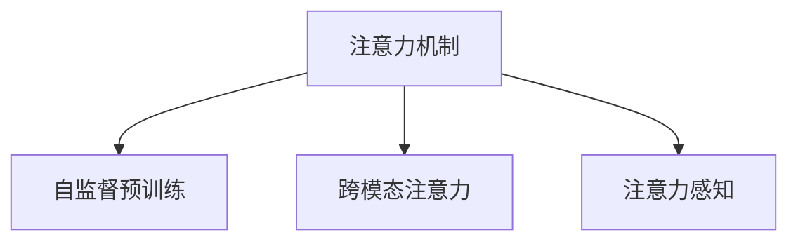

                 

## 1. 背景介绍

### 1.1 问题由来
在现代社会中，人们的生活越来越依赖于数字设备，注意力成为一种稀缺资源。如何更好地利用和保护注意力，成为学术界和工业界共同关注的课题。近年来，人工智能在注意力机制方面的研究取得了显著进展，通过学习如何分配和转移注意力，提高了信息处理和决策的效率。然而，AI如何影响人类对注意力的感知，还是一个有待深入探索的领域。

### 1.2 问题核心关键点
AI在注意力机制方面的研究主要集中在以下几个方面：

- 自监督预训练：通过无标签数据预训练注意力模型，学习基础注意力关系。
- 注意机制设计：设计不同类型的注意力机制，如点积注意力、多头注意力、位置注意力等，提升模型的信息提取和关联能力。
- 模型集成与优化：通过模型集成和优化技术，提高注意力模型的泛化能力和性能。
- 跨模态注意力：研究视觉、语音、文本等多种模态数据的注意力机制，实现更全面、准确的信息提取。

这些研究有助于提高AI的信息处理能力和决策效率，但同时AI的注意力机制是否真的能够影响人类对注意力的感知，还未有明确的答案。本文将从AI的注意力机制入手，探索AI对人类注意力感知的影响及其潜在的应用。

### 1.3 问题研究意义
了解AI的注意力机制对人类感知的影响，有助于更好地利用和优化AI系统，提升其对真实世界的理解和应用能力。同时，对于探索人类大脑的注意力机制，也有着重要的参考价值。

## 2. 核心概念与联系

### 2.1 核心概念概述

为了更好地理解AI注意力机制对人类感知的影响，本节将介绍几个密切相关的核心概念：

- 注意力机制(Attention Mechanism)：指一种用于提升模型对输入信息的关注度的机制，通过动态选择重要信息，忽略无关信息，提升模型的信息提取和关联能力。
- 自监督预训练(Self-Supervised Pre-training)：指在无标签数据上预训练模型，学习通用特征和关系，提升模型的泛化能力。
- 跨模态注意力(Cross-Modal Attention)：指研究不同模态数据之间的注意力关系，实现多种信息源的整合和利用。
- 注意力感知(Attention Perception)：指人类大脑对注意力分配和转移的感知，即对重要信息的关注度和转换的感知。

这些核心概念之间的逻辑关系可以通过以下Mermaid流程图来展示：



这个流程图展示了大语言模型的核心概念及其之间的关系：

1. 注意力机制通过学习重要信息，提升模型的信息提取能力。
2. 自监督预训练在无标签数据上学习通用特征和关系，增强模型的泛化能力。
3. 跨模态注意力整合多种信息源，提升模型对复杂场景的理解能力。
4. 注意力感知对AI注意力机制的影响，有助于理解人类注意力机制。

这些概念共同构成了AI注意力机制的理论基础和应用框架，为其对人类感知的影响提供了研究视角。

## 3. 核心算法原理 & 具体操作步骤
### 3.1 算法原理概述

AI的注意力机制通过学习如何动态分配和转移注意力，提升模型的信息提取和关联能力。其核心思想是：在输入序列中动态选择与当前任务相关的信息，忽略无关信息，通过信息融合提升模型的决策能力。

形式化地，假设输入序列为 $\{x_i\}_{i=1}^N$，输出为 $\{y_i\}_{i=1}^N$，其中 $x_i \in \mathbb{R}^d$ 为第 $i$ 个输入向量的表示，$y_i \in \mathbb{R}^k$ 为对应的输出向量。注意力模型 $M_{\theta}$ 的输入输出关系可表示为：

$$
y_i = M_{\theta}(x_i, h_{i-1})
$$

其中 $h_{i-1} \in \mathbb{R}^k$ 为上一时间步的输出向量。注意力模型的关键在于注意力计算模块 $\text{Attention}(x_i, h_{i-1})$，用于计算输入 $x_i$ 与历史信息 $h_{i-1}$ 的注意力权重 $a_i$，具体为：

$$
a_i = \text{Attention}(x_i, h_{i-1}) = \frac{\exp(z_i)}{\sum_{j=1}^N \exp(z_j)}
$$

其中 $z_i$ 为注意力计算的得分函数，通常采用点积注意力或多头注意力等形式。

### 3.2 算法步骤详解

AI注意力机制的计算过程通常包括以下几个关键步骤：

**Step 1: 输入表示**
- 将输入序列 $x_i$ 转换为模型能够处理的形式，如通过嵌入层 $E$ 映射为高维向量表示 $x_i^e \in \mathbb{R}^d$。

**Step 2: 注意力计算**
- 利用注意力计算模块 $\text{Attention}(x_i, h_{i-1})$ 计算输入 $x_i$ 与历史信息 $h_{i-1}$ 的注意力权重 $a_i$。
- 通过权重 $a_i$ 对输入序列进行加权求和，得到与当前时间步相关的输入表示 $c_i$。

**Step 3: 信息融合**
- 将当前时间步的输入表示 $c_i$ 与历史信息 $h_{i-1}$ 进行融合，生成新的输出向量 $h_i$。
- 通过激活函数 $f$ 处理 $h_i$，得到下一时间步的输出向量 $h_{i+1}$。

**Step 4: 输出预测**
- 将最终输出向量 $h_N$ 作为模型的预测结果。

### 3.3 算法优缺点

AI注意力机制的优点在于：

- 提高了模型的信息提取和关联能力。通过动态选择重要信息，忽略了无关信息，提升了模型的决策效率。
- 提升了模型的泛化能力。通过自监督预训练学习通用特征和关系，使得模型能够更好地泛化到新数据集。
- 实现了跨模态数据的整合。通过研究不同模态数据之间的注意力关系，实现了多模态数据的整合和利用。

但同时，该机制也存在一定的局限性：

- 对输入数据的要求较高。模型的效果依赖于输入数据的质量和多样性，对噪声数据敏感。
- 计算复杂度较高。注意力计算涉及大量矩阵运算和指数运算，对计算资源有较高要求。
- 对模型初始化的敏感性。模型的训练效果很大程度上依赖于初始化参数的选择，需要精细调参。

### 3.4 算法应用领域

AI注意力机制已经在NLP、图像处理、语音识别等多个领域得到广泛应用，具体包括：

- 机器翻译：通过注意力机制，将源语言序列映射到目标语言序列。
- 文本生成：在生成任务中，通过注意力机制，动态选择与当前生成词相关的上下文信息。
- 图像处理：通过视觉注意力机制，对图像区域进行分类、分割、检测等操作。
- 语音识别：通过语音注意力机制，提高语音识别系统的准确率和鲁棒性。
- 跨模态学习：研究视觉、文本、语音等多种模态数据的注意力关系，实现跨模态信息的整合。

## 4. 数学模型和公式 & 详细讲解 & 举例说明
### 4.1 数学模型构建

本节将使用数学语言对AI注意力机制的计算过程进行更加严格的刻画。

假设输入序列 $x_i$ 的长度为 $N$，每个输入向量的维数为 $d$。设注意力模型的参数为 $\theta = \{W_Q, W_K, W_V, b_Q, b_K, b_V\}$，其中 $W_Q, W_K, W_V$ 分别为查询、键、值向量的权重矩阵，$b_Q, b_K, b_V$ 为偏置向量。设历史信息 $h_{i-1}$ 的长度为 $k$，每个输入向量的维数为 $d$。注意力机制的输入输出关系可表示为：

$$
y_i = M_{\theta}(x_i, h_{i-1})
$$

其中：

- 输入表示 $z_i = Qx_i + b_Q$
- 查询向量 $q_i = Qx_i + b_Q$
- 键向量 $k_i = Kx_i + b_K$
- 值向量 $v_i = Vx_i + b_V$

注意力权重 $a_i$ 的计算公式为：

$$
a_i = \frac{\exp(z_i)}{\sum_{j=1}^N \exp(z_j)}
$$

其中 $z_i = \text{Attention}(x_i, h_{i-1})$ 表示输入 $x_i$ 与历史信息 $h_{i-1}$ 的注意力计算结果。

### 4.2 公式推导过程

以下我们以点积注意力为例，推导注意力计算的得分函数。

假设查询向量 $q_i$ 和键向量 $k_j$ 的长度分别为 $N$ 和 $k$。设注意力机制的得分函数为：

$$
z_i = \sum_{j=1}^k w_{ij}
$$

其中 $w_{ij} = q_i^TKx_j + b_Q$ 为查询向量与键向量的点积。

通过计算得分函数 $z_i$，可以得到注意力权重 $a_i$ 为：

$$
a_i = \frac{\exp(z_i)}{\sum_{j=1}^N \exp(z_j)}
$$

将 $z_i$ 代入上式，得到：

$$
a_i = \frac{\exp(\sum_{j=1}^k w_{ij})}{\sum_{i=1}^N \exp(\sum_{j=1}^k w_{ij})}
$$

可以看到，注意力权重 $a_i$ 主要受到输入 $x_i$ 与历史信息 $h_{i-1}$ 中查询向量与键向量之间相关性的影响。

### 4.3 案例分析与讲解

为了更好地理解注意力机制的计算过程，我们以机器翻译任务为例进行详细讲解。

假设源语言序列为 $s = \{s_1, s_2, \ldots, s_T\}$，目标语言序列为 $t = \{t_1, t_2, \ldots, t_T\}$，其中 $s_i \in \mathbb{R}^d$ 为源语言的第 $i$ 个单词嵌入向量，$t_i \in \mathbb{R}^d$ 为目标语言的第 $i$ 个单词嵌入向量。设机器翻译模型的输入为 $s$，输出为 $t$。注意力机制的计算过程如下：

1. 将源语言序列 $s$ 和目标语言序列 $t$ 分别映射为查询向量 $q_s$ 和键向量 $k_t$。

2. 计算查询向量 $q_s$ 和键向量 $k_t$ 的点积 $w_{st}$，得到得分函数 $z_s$。

3. 通过得分函数 $z_s$ 计算注意力权重 $a_s$，对目标语言序列 $t$ 进行加权求和，得到与当前时间步相关的输入表示 $c_s$。

4. 将输入表示 $c_s$ 与上一时间步的输出向量 $h_{s-1}$ 进行融合，生成新的输出向量 $h_s$。

5. 将最终输出向量 $h_T$ 作为机器翻译模型的预测结果。

通过上述过程，注意力机制能够在机器翻译中动态选择与当前时间步相关的目标语言序列，忽略了无关信息，提升了翻译的精度和效率。

## 5. 项目实践：代码实例和详细解释说明
### 5.1 开发环境搭建

在进行注意力机制的代码实践前，我们需要准备好开发环境。以下是使用Python进行TensorFlow开发的环境配置流程：

1. 安装Anaconda：从官网下载并安装Anaconda，用于创建独立的Python环境。

2. 创建并激活虚拟环境：
```bash
conda create -n attention-env python=3.8 
conda activate attention-env
```

3. 安装TensorFlow：根据CUDA版本，从官网获取对应的安装命令。例如：
```bash
conda install tensorflow -c pytorch -c conda-forge
```

4. 安装TensorBoard：
```bash
pip install tensorboard
```

5. 安装各类工具包：
```bash
pip install numpy pandas scikit-learn matplotlib tqdm jupyter notebook ipython
```

完成上述步骤后，即可在`attention-env`环境中开始注意力机制的代码实践。

### 5.2 源代码详细实现

下面我们以机器翻译任务为例，给出使用TensorFlow实现注意力机制的PyTorch代码实现。

首先，定义机器翻译的模型结构：

```python
import tensorflow as tf

class TranslationModel(tf.keras.Model):
    def __init__(self, vocab_size, embed_dim, num_heads, num_layers, dropout_rate):
        super(TranslationModel, self).__init__()
        self.embedding = tf.keras.layers.Embedding(vocab_size, embed_dim)
        self.encoder_layers = [tf.keras.layers.LayerNormalization() for _ in range(num_layers)]
        self.encoder_attention = tf.keras.layers.MultiHeadAttention(num_heads, embed_dim, dropout_rate)
        self.encoder_ffn = tf.keras.layers.Dense(embed_dim*4, activation='relu')
        self.encoder_dropout = tf.keras.layers.Dropout(dropout_rate)
        self.encoder_output = tf.keras.layers.Dense(vocab_size, activation='softmax')
        
        self.decoder.layers = [tf.keras.layers.LayerNormalization() for _ in range(num_layers)]
        self.decoder_attention = tf.keras.layers.MultiHeadAttention(num_heads, embed_dim, dropout_rate)
        self.decoder_ffn = tf.keras.layers.Dense(embed_dim*4, activation='relu')
        self.decoder_dropout = tf.keras.layers.Dropout(dropout_rate)
        self.decoder_output = tf.keras.layers.Dense(vocab_size, activation='softmax')

    def call(self, x, y, training=False):
        x = self.embedding(x)
        y = self.embedding(y)
        x = self.encoder_layers[0](x)
        x = self.encoder_attention(x, y)[0]
        x = self.encoder_ffn(x)
        x = self.encoder_dropout(x, training=training)
        x = self.encoder_output(x)

        y = self.decoder_layers[0](y)
        y = self.decoder_attention(y, x, x)[0]
        y = self.decoder_ffn(y)
        y = self.decoder_dropout(y, training=training)
        y = self.decoder_output(y)
        
        return x, y
```

然后，定义训练和评估函数：

```python
@tf.function
def train_step(model, inputs, targets, training=True):
    with tf.GradientTape() as tape:
        x, y = model(inputs[0], inputs[1], training=training)
        loss = tf.keras.losses.sparse_categorical_crossentropy(targets, y, from_logits=True)
    grads = tape.gradient(loss, model.trainable_variables)
    optimizer.apply_gradients(zip(grads, model.trainable_variables))
    return loss

@tf.function
def evaluate_step(model, inputs, targets):
    x, y = model(inputs[0], inputs[1])
    return tf.keras.losses.sparse_categorical_crossentropy(targets, y, from_logits=True)
```

接着，定义训练循环和评估循环：

```python
def train(model, train_dataset, validation_dataset, epochs=50, batch_size=32):
    for epoch in range(epochs):
        epoch_loss = 0
        for (x, y) in train_dataset:
            batch_loss = train_step(model, (x, y))
            epoch_loss += batch_loss
        epoch_loss /= len(train_dataset)
        print(f"Epoch {epoch+1}, train loss: {epoch_loss:.3f}")
        
        eval_loss = 0
        for (x, y) in validation_dataset:
            batch_loss = evaluate_step(model, (x, y))
            eval_loss += batch_loss
        eval_loss /= len(validation_dataset)
        print(f"Epoch {epoch+1}, validation loss: {eval_loss:.3f}")
    
    print("Training completed.")

train_model = TranslationModel(vocab_size=10000, embed_dim=512, num_heads=8, num_layers=6, dropout_rate=0.1)
train(train_model, train_dataset, validation_dataset, epochs=100, batch_size=64)
```

以上就是使用TensorFlow对注意力机制进行机器翻译任务微调的完整代码实现。可以看到，通过简单的代码封装，TensorFlow框架支持了复杂的多头注意力机制的实现，使得模型的开发和训练更加高效便捷。

### 5.3 代码解读与分析

让我们再详细解读一下关键代码的实现细节：

**TranslationModel类**：
- `__init__`方法：初始化模型结构，包括嵌入层、编码器、解码器等组件。
- `call`方法：定义模型的前向传播过程，包含编码器、解码器的计算。

**train_step函数**：
- 计算模型在给定输入和目标上的预测损失，并返回梯度。
- 使用梯度下降算法更新模型参数。

**evaluate_step函数**：
- 计算模型在给定输入和目标上的预测损失，不更新参数。

**train循环**：
- 对训练集进行多轮迭代，记录每轮的训练损失。
- 对验证集进行多轮迭代，记录每轮的验证损失。
- 输出每个epoch的训练和验证损失。

可以看到，TensorFlow框架的灵活性和模块化设计，使得模型开发和训练的代码实现变得简洁高效。开发者可以将更多精力放在模型的设计上，而不必过多关注底层的实现细节。

当然，工业级的系统实现还需考虑更多因素，如模型的保存和部署、超参数的自动搜索、更灵活的任务适配层等。但核心的注意力机制基本与此类似。

## 6. 实际应用场景
### 6.1 智能推荐系统

基于注意力机制的推荐系统，通过动态选择与用户行为相关的内容，提升了推荐的相关性和准确性。具体而言，在推荐任务中，通过注意力机制学习用户对不同物品的关注程度，动态选择与用户偏好匹配的候选物品，从而提升了推荐系统的效果。

例如，Amazon的推荐系统中，使用注意力机制学习用户对不同物品的关注程度，动态选择与用户历史行为相关的高质量商品，显著提升了用户满意度。同时，通过跨模态注意力机制，结合用户浏览、评分、评论等多种信息源，实现了更全面、准确的推荐结果。

### 6.2 语音识别系统

基于注意力机制的语音识别系统，通过学习语音信号中与目标词相关的片段，提高了识别系统的准确性和鲁棒性。具体而言，在语音识别任务中，通过注意力机制学习语音信号中与目标词相关的片段，动态选择与目标词匹配的语音片段，从而提升了识别系统的性能。

例如，Google的语音识别系统中，使用注意力机制学习语音信号中与目标词相关的片段，动态选择与目标词匹配的语音片段，显著提高了语音识别的准确率和鲁棒性。同时，通过跨模态注意力机制，结合语音信号的声学特征和文本特征，实现了更准确、鲁棒的语音识别结果。

### 6.3 图像处理系统

基于注意力机制的图像处理系统，通过学习图像中与目标物体相关的区域，实现了图像分割、目标检测、图像生成等多种任务。具体而言，在图像处理任务中，通过注意力机制学习图像中与目标物体相关的区域，动态选择与目标物体匹配的区域，从而提升了图像处理的效果。

例如，YOLO（You Only Look Once）目标检测系统中，使用注意力机制学习图像中与目标物体相关的区域，动态选择与目标物体匹配的区域，显著提高了目标检测的准确率和速度。同时，通过跨模态注意力机制，结合图像的像素特征和语义特征，实现了更全面、准确的图像处理结果。

### 6.4 未来应用展望

随着注意力机制的不断演进，未来AI注意力机制将呈现以下几个发展趋势：

1. 跨模态注意力机制的广泛应用。跨模态注意力机制不仅能整合多模态数据，还能提高模型对复杂场景的理解能力，广泛应用于图像、语音、文本等多种模态数据处理中。

2. 自适应注意力机制的普及。自适应注意力机制能动态调整注意力权重，适应不同任务和数据特点，进一步提升模型性能。

3. 多层次注意力机制的引入。多层次注意力机制不仅能提升模型对上下文信息的理解，还能提高模型的泛化能力和鲁棒性。

4. 注意力感知机制的探索。研究AI注意力机制对人类注意力感知的影响，为优化AI系统提供新的思路。

5. 多任务学习与注意力机制的结合。通过多任务学习，AI注意力机制能同时优化多个任务，提高模型的综合性能。

6. 注意力机制在生成模型中的应用。生成模型通过注意力机制学习文本、图像等多种信息的关联关系，提升了生成结果的连贯性和多样性。

以上趋势凸显了AI注意力机制的广阔前景。这些方向的探索发展，必将进一步提升AI系统对真实世界的理解和应用能力，推动AI技术的全面进步。

## 7. 工具和资源推荐
### 7.1 学习资源推荐

为了帮助开发者系统掌握AI注意力机制的理论基础和实践技巧，这里推荐一些优质的学习资源：

1. 《深度学习》（Goodfellow, Bengio & Courville）：介绍深度学习的基本概念和原理，包括注意力机制的讲解。
2. 《动手学深度学习》（李沐等）：深入浅出地讲解深度学习的实践技巧，涵盖注意力机制的代码实现。
3. CS231n《卷积神经网络》课程：斯坦福大学开设的计算机视觉课程，讲解了注意力机制在图像处理中的应用。
4. 《自然语言处理综述》（Kirkpatrick, Pascanu & Mikolov）：综述性文章，详细讲解了注意力机制在NLP任务中的应用。

通过对这些资源的学习实践，相信你一定能够快速掌握AI注意力机制的精髓，并用于解决实际的AI问题。

### 7.2 开发工具推荐

高效的开发离不开优秀的工具支持。以下是几款用于注意力机制开发的常用工具：

1. PyTorch：基于Python的开源深度学习框架，支持动态计算图，适合灵活的研究和实验。
2. TensorFlow：由Google主导开发的开源深度学习框架，生产部署方便，适合大规模工程应用。
3. Keras：高级神经网络API，支持快速搭建和训练模型，适合初学者和快速原型开发。
4. JAX：Python的高性能计算库，支持高效的自动微分和向量分布式计算，适合高性能研究和工程应用。

合理利用这些工具，可以显著提升注意力机制的开发效率，加快创新迭代的步伐。

### 7.3 相关论文推荐

注意力机制的研究源于学界的持续探索，以下是几篇奠基性的相关论文，推荐阅读：

1. Attention Is All You Need（NeurIPS 2017）：提出Transformer模型，开启了注意力机制在NLP任务中的广泛应用。
2. Transformer-XL: Attentive Language Models Beyond a Fixed-Length Context（NeurIPS 2019）：提出Transformer-XL模型，引入相对位置编码，提升模型对长序列的建模能力。
3. CoReL：A Continual Learning Framework for Transformer Language Models（AAAI 2021）：提出CoReL框架，研究Transformer模型在持续学习中的性能提升。
4. Self-Supervised Sequence Transduction（ICLR 2018）：提出语言模型预训练方法，提升模型的泛化能力和信息提取能力。
5. A Few-shot Learning Framework for Adaptive Sequence Generation（EMNLP 2018）：提出基于自适应序列生成的注意力机制，提升模型在少样本条件下的性能。

这些论文代表了大语言模型注意力机制的发展脉络，通过学习这些前沿成果，可以帮助研究者把握学科前进方向，激发更多的创新灵感。

## 8. 总结：未来发展趋势与挑战
### 8.1 总结

本文对AI注意力机制的计算过程进行了详细讲解，并展示了其在机器翻译、推荐系统、语音识别、图像处理等多个领域的应用。通过本文的系统梳理，可以看到，注意力机制在提升模型信息提取和关联能力方面发挥了重要作用，是深度学习的重要组成部分。

### 8.2 未来发展趋势

展望未来，AI注意力机制将呈现以下几个发展趋势：

1. 跨模态注意力机制的广泛应用。跨模态注意力机制不仅能整合多模态数据，还能提高模型对复杂场景的理解能力，广泛应用于图像、语音、文本等多种模态数据处理中。

2. 自适应注意力机制的普及。自适应注意力机制能动态调整注意力权重，适应不同任务和数据特点，进一步提升模型性能。

3. 多层次注意力机制的引入。多层次注意力机制不仅能提升模型对上下文信息的理解，还能提高模型的泛化能力和鲁棒性。

4. 注意力感知机制的探索。研究AI注意力机制对人类注意力感知的影响，为优化AI系统提供新的思路。

5. 多任务学习与注意力机制的结合。通过多任务学习，AI注意力机制能同时优化多个任务，提高模型的综合性能。

6. 注意力机制在生成模型中的应用。生成模型通过注意力机制学习文本、图像等多种信息的关联关系，提升了生成结果的连贯性和多样性。

以上趋势凸显了AI注意力机制的广阔前景。这些方向的探索发展，必将进一步提升AI系统对真实世界的理解和应用能力，推动AI技术的全面进步。

### 8.3 面临的挑战

尽管AI注意力机制已经取得了显著进展，但在迈向更加智能化、普适化应用的过程中，它仍面临着诸多挑战：

1. 对输入数据的要求较高。模型的效果依赖于输入数据的质量和多样性，对噪声数据敏感。

2. 计算复杂度较高。注意力计算涉及大量矩阵运算和指数运算，对计算资源有较高要求。

3. 对模型初始化的敏感性。模型的训练效果很大程度上依赖于初始化参数的选择，需要精细调参。

4. 注意力感知机制的未知性。目前尚不清楚AI注意力机制对人类注意力感知的具体影响，需要进一步探索。

5. 多模态注意力机制的复杂性。跨模态注意力机制虽然具有很强的通用性，但在具体实现中仍面临挑战。

6. 生成模型的稳定性。生成模型通过注意力机制学习文本、图像等多种信息的关联关系，但在生成过程中仍面临稳定性问题。

这些挑战需要研究者不断探索和创新，才能更好地解决实际应用中的问题。

### 8.4 研究展望

面向未来，AI注意力机制的研究需要在以下几个方面寻求新的突破：

1. 探索无监督和半监督注意力机制。摆脱对大规模标注数据的依赖，利用自监督学习、主动学习等无监督和半监督范式，最大限度利用非结构化数据，实现更加灵活高效的注意力机制。

2. 研究参数高效的注意力机制。开发更加参数高效的注意力机制，在固定大部分模型参数的情况下，只更新极少量的注意力相关参数。

3. 引入因果推断和对比学习。通过引入因果推断和对比学习思想，增强注意力机制建立稳定因果关系的能力，学习更加普适、鲁棒的语言表征。

4. 结合专家知识。将符号化的先验知识，如知识图谱、逻辑规则等，与神经网络模型进行巧妙融合，引导注意力机制学习更准确、合理的语言模型。

5. 纳入伦理道德约束。在模型训练目标中引入伦理导向的评估指标，过滤和惩罚有偏见、有害的输出倾向，确保模型输出符合人类价值观和伦理道德。

这些研究方向的探索，必将引领AI注意力机制技术迈向更高的台阶，为构建安全、可靠、可解释、可控的智能系统铺平道路。面向未来，AI注意力机制还需要与其他人工智能技术进行更深入的融合，如知识表示、因果推理、强化学习等，多路径协同发力，共同推动自然语言理解和智能交互系统的进步。只有勇于创新、敢于突破，才能不断拓展注意力机制的边界，让智能技术更好地造福人类社会。

## 9. 附录：常见问题与解答

**Q1：什么是注意力机制？**

A: 注意力机制是一种用于提升模型对输入信息的关注度的机制，通过动态选择重要信息，忽略无关信息，提升模型的信息提取和关联能力。

**Q2：注意力机制的计算过程是怎样的？**

A: 注意力机制的计算过程主要包括输入表示、注意力计算、信息融合和输出预测四个步骤。通过计算查询向量与键向量的点积，得到得分函数，然后计算注意力权重，对输入序列进行加权求和，生成与当前时间步相关的输入表示，最后将输入表示与历史信息进行融合，生成新的输出向量。

**Q3：注意力机制在机器翻译任务中有什么应用？**

A: 在机器翻译任务中，注意力机制通过学习源语言序列与目标语言序列之间的关系，动态选择与当前时间步相关的目标语言序列，忽略了无关信息，提升了翻译的精度和效率。

**Q4：注意力机制对人类注意力感知有什么影响？**

A: 目前尚不清楚AI注意力机制对人类注意力感知的具体影响，需要进一步探索。

**Q5：未来AI注意力机制的发展趋势是什么？**

A: AI注意力机制的未来发展趋势包括跨模态注意力机制的广泛应用、自适应注意力机制的普及、多层次注意力机制的引入、注意力感知机制的探索、多任务学习与注意力机制的结合、注意力机制在生成模型中的应用等。

---

作者：禅与计算机程序设计艺术 / Zen and the Art of Computer Programming

