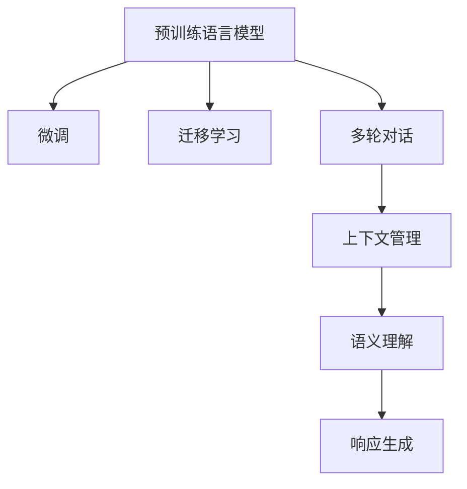

                 

## 1. 背景介绍

### 1.1 问题由来
在过去几年中，人工智能(AI)领域取得了显著的进展，特别是在自然语言处理(NLP)和自然语言生成(NLG)方面。随着预训练语言模型的崛起，构建能够理解并回应用户查询的对话系统变得比以往任何时候都更加简单和高效。然而，这些基于预训练语言模型的对话系统面临着新的挑战：如何在不依赖于具体规则和指令的情况下，进行开放域的对话，使得用户能够自由地提出任何话题的问题，并得到恰当的回应。

### 1.2 问题核心关键点
开放域聊天系统的设计和实现涉及多个关键技术点，包括语义理解、响应生成、上下文管理、多轮对话处理等。传统的规则基础系统需要人工设计大量规则和模板，难以应对复杂多变的用户查询，而基于预训练语言模型的系统需要微调或自监督学习以适应新场景和任务。本文将重点探讨开放域聊天系统的设计和优化方法，从规则到基于模型的系统，再到如今的深度学习模型，并展望未来的发展方向。

### 1.3 问题研究意义
开发高效、智能且具备广泛应用能力的对话系统，对于提升用户体验、促进智能交互系统的普及具有重要意义。开放域聊天系统能够提供更加自然、流畅的对话体验，适应用户多样化的交流需求，从而在教育、客户服务、娱乐等领域发挥重要作用。通过深入研究和优化，我们有望构建出更加智能、高效的对话系统，加速人工智能技术在各行各业的落地应用。

## 2. 核心概念与联系

### 2.1 核心概念概述

为了更好地理解开放域聊天系统，我们将介绍几个核心概念及其相互联系：

- **对话系统(Dialgoical System)**：一种能够理解并回应用户查询的系统，包括基于规则的系统、基于模板的系统、基于预训练语言模型的系统等。
- **预训练语言模型(Pre-trained Language Model)**：通过在无标签的文本数据上自监督学习，学习到通用的语言知识和模式，包括BERT、GPT-2、GPT-3等。
- **微调(Fine-tuning)**：在预训练模型的基础上，通过少量标注数据，进行特定任务的优化训练。
- **迁移学习(Transfer Learning)**：将一个领域的知识迁移到另一个领域的学习方法。
- **多轮对话(Multi-turn Dialogue)**：对话系统能够处理多轮交互的对话，而不仅仅是单轮问答。
- **上下文管理(Context Management)**：维护对话历史信息，确保多轮对话的连贯性和一致性。
- **语义理解(Semantic Understanding)**：理解用户查询的语义，而不仅仅是字面意思。
- **响应生成(Response Generation)**：根据用户查询，生成合适的回应。

这些概念之间的联系可以通过以下Mermaid流程图来展示：



这个流程图展示了预训练语言模型如何通过微调和迁移学习，获得特定任务的能力，同时支持多轮对话、上下文管理和语义理解，最终通过响应生成与用户进行交互。

## 3. 核心算法原理 & 具体操作步骤
### 3.1 算法原理概述

开放域聊天系统的核心算法原理包括以下几个方面：

- **语义理解**：理解用户查询的语义，而不仅仅是字面意思。可以使用预训练语言模型进行语义嵌入，通过向量空间中的相似度来衡量查询与预定义的意图或概念的匹配度。
- **上下文管理**：维护对话历史信息，确保多轮对话的连贯性和一致性。可以使用RNN、LSTM、GRU等序列模型，或者基于Transformer的模型，如GPT、BERT等，来处理上下文信息。
- **响应生成**：根据用户查询，生成合适的回应。可以使用生成模型，如基于LSTM的序列生成模型，或者基于自回归的模型，如GPT、T5等，来生成回应。

### 3.2 算法步骤详解

以下是开放域聊天系统设计的详细操作步骤：

**Step 1: 确定对话任务和语料库**

- 定义聊天系统的对话任务，如客户服务、娱乐、教育等。
- 收集相应的语料库，可以是已有的用户查询和回应记录，也可以是通用的语料库如Wikipedia、维基百科等。

**Step 2: 预训练语言模型的选择**

- 根据对话任务的特点，选择适合的预训练语言模型。常用的模型包括BERT、GPT-2、GPT-3、T5等。

**Step 3: 微调和迁移学习**

- 对预训练语言模型进行微调，以适应特定的对话任务。可以使用少量标注数据进行微调，也可以使用迁移学习，将通用知识迁移到特定任务上。

**Step 4: 上下文管理**

- 设计上下文管理机制，确保多轮对话的连贯性。可以使用RNN、LSTM等序列模型，或者基于Transformer的模型。

**Step 5: 语义理解和响应生成**

- 通过预训练语言模型进行语义理解，将用户查询映射到预定义的意图或概念。
- 使用生成模型生成合适的回应。

**Step 6: 系统集成和部署**

- 将系统集成到实际应用中，如客户服务系统、聊天机器人等。
- 定期收集反馈数据，优化和更新系统。

### 3.3 算法优缺点

开放域聊天系统的优势在于：

- 适应性强：可以处理多种类型的对话任务，适用于各种应用场景。
- 灵活性高：对话系统可以根据用户的输入动态调整响应策略。
- 用户友好：提供自然、流畅的对话体验。

然而，该系统也存在一些缺点：

- 依赖于高质量的语料库和预训练模型。
- 需要大量计算资源进行微调和训练。
- 对误导性输入或恶意攻击的鲁棒性较差。
- 缺乏可解释性，难以解释系统内部的决策过程。

### 3.4 算法应用领域

开放域聊天系统在多个领域都有广泛应用：

- **客户服务**：提供24小时不间断的客户服务，提高客户满意度。
- **教育**：帮助学生解答学习问题，提供个性化辅导。
- **娱乐**：提供基于内容的推荐和互动，提升用户体验。
- **健康咨询**：提供医疗咨询和心理支持，帮助用户解决健康问题。
- **企业协作**：协助员工完成日常工作，提高工作效率。

## 4. 数学模型和公式 & 详细讲解 & 举例说明

### 4.1 数学模型构建

开放域聊天系统涉及多个数学模型，包括语义理解、上下文管理、响应生成等。以下是一些关键模型的数学构建：

- **语义理解模型**：使用BERT等预训练模型，将用户查询映射到预定义的意图或概念。

  假设用户查询为 $x$，系统定义的意图为 $y$，则语义理解模型 $f$ 可以表示为：
  $$
  y = f(x)
  $$

- **上下文管理模型**：使用RNN或LSTM模型，维护对话历史信息。

  设上下文向量为 $h_t$，用户查询为 $x_t$，则上下文管理模型 $g$ 可以表示为：
  $$
  h_{t+1} = g(h_t, x_t)
  $$

- **响应生成模型**：使用基于LSTM或Transformer的生成模型，生成合适的回应。

  设用户查询为 $x$，生成的回应为 $y$，则响应生成模型 $h$ 可以表示为：
  $$
  y = h(x)
  $$

### 4.2 公式推导过程

以下是对上述模型的公式推导过程：

**语义理解模型**：假设用户查询 $x$ 为单词序列，预训练语言模型可以将其映射到向量表示 $z$，则语义理解模型 $f$ 可以表示为：
$$
z = f(x)
$$
$$
y = argmax_{y \in \{y_1, y_2, ..., y_n\}} \log p(y|z)
$$

其中，$p(y|z)$ 为在向量表示 $z$ 条件下，输出为 $y$ 的概率。

**上下文管理模型**：假设上下文向量 $h_t$ 和用户查询 $x_t$ 的向量表示分别为 $h_{t-1}$ 和 $x_{t-1}$，则上下文管理模型 $g$ 可以表示为：
$$
h_t = g(h_{t-1}, x_t)
$$
$$
h_t = W[h_{t-1}, x_t] + b
$$
$$
h_t = \tanh(W[h_{t-1}, x_t] + b)
$$

其中，$W$ 和 $b$ 为模型参数，$\tanh$ 为激活函数。

**响应生成模型**：假设用户查询 $x$ 的向量表示为 $z$，生成模型 $h$ 可以表示为：
$$
y = h(z)
$$
$$
y = \text{argmax}_{y \in Y} \log p(y|z)
$$

其中，$Y$ 为回应的词汇集合，$p(y|z)$ 为在向量表示 $z$ 条件下，输出为 $y$ 的概率。

### 4.3 案例分析与讲解

以一个简单的问答系统为例，展示开放域聊天系统的实现过程：

**Step 1: 语料库准备**

- 收集用户查询和回应记录，作为语料库。
- 将语料库划分为训练集和测试集。

**Step 2: 预训练语言模型的选择**

- 选择BERT作为预训练语言模型。
- 下载和使用预训练模型。

**Step 3: 微调和迁移学习**

- 使用少量标注数据对BERT进行微调。
- 在微调过程中，使用迁移学习将通用知识迁移到特定任务上。

**Step 4: 上下文管理**

- 设计上下文管理机制，使用LSTM模型。
- 在每个时间步，更新上下文向量 $h_t$。

**Step 5: 语义理解和响应生成**

- 使用BERT进行语义理解，将用户查询映射到预定义的意图或概念。
- 使用LSTM生成模型生成合适的回应。

**Step 6: 系统集成和部署**

- 将系统集成到客户服务系统中。
- 定期收集用户反馈，优化和更新系统。

## 5. 项目实践：代码实例和详细解释说明

### 5.1 开发环境搭建

在进行开放域聊天系统的开发前，我们需要准备好开发环境。以下是使用Python和PyTorch开发的环境配置流程：

1. 安装Anaconda：从官网下载并安装Anaconda，用于创建独立的Python环境。

2. 创建并激活虚拟环境：
```bash
conda create -n pytorch-env python=3.8 
conda activate pytorch-env
```

3. 安装PyTorch：根据CUDA版本，从官网获取对应的安装命令。例如：
```bash
conda install pytorch torchvision torchaudio cudatoolkit=11.1 -c pytorch -c conda-forge
```

4. 安装Transformer库：
```bash
pip install transformers
```

5. 安装各类工具包：
```bash
pip install numpy pandas scikit-learn matplotlib tqdm jupyter notebook ipython
```

完成上述步骤后，即可在`pytorch-env`环境中开始开发实践。

### 5.2 源代码详细实现

下面我们以基于BERT的开放域聊天系统为例，给出使用Transformers库进行系统开发的PyTorch代码实现。

首先，定义对话任务的数据处理函数：

```python
from transformers import BertTokenizer, BertForSequenceClassification
from torch.utils.data import Dataset, DataLoader
import torch

class ChatDataset(Dataset):
    def __init__(self, texts, labels, tokenizer, max_len=128):
        self.texts = texts
        self.labels = labels
        self.tokenizer = tokenizer
        self.max_len = max_len
        
    def __len__(self):
        return len(self.texts)
    
    def __getitem__(self, item):
        text = self.texts[item]
        label = self.labels[item]
        
        encoding = self.tokenizer(text, return_tensors='pt', max_length=self.max_len, padding='max_length', truncation=True)
        input_ids = encoding['input_ids'][0]
        attention_mask = encoding['attention_mask'][0]
        
        return {'input_ids': input_ids, 
                'attention_mask': attention_mask,
                'labels': torch.tensor(label, dtype=torch.long)}
```

然后，定义模型和优化器：

```python
from transformers import AdamW

model = BertForSequenceClassification.from_pretrained('bert-base-cased', num_labels=2)

optimizer = AdamW(model.parameters(), lr=2e-5)
```

接着，定义训练和评估函数：

```python
from tqdm import tqdm

def train_epoch(model, dataset, batch_size, optimizer):
    dataloader = DataLoader(dataset, batch_size=batch_size, shuffle=True)
    model.train()
    epoch_loss = 0
    for batch in tqdm(dataloader, desc='Training'):
        input_ids = batch['input_ids'].to(device)
        attention_mask = batch['attention_mask'].to(device)
        labels = batch['labels'].to(device)
        model.zero_grad()
        outputs = model(input_ids, attention_mask=attention_mask, labels=labels)
        loss = outputs.loss
        epoch_loss += loss.item()
        loss.backward()
        optimizer.step()
    return epoch_loss / len(dataloader)

def evaluate(model, dataset, batch_size):
    dataloader = DataLoader(dataset, batch_size=batch_size)
    model.eval()
    preds, labels = [], []
    with torch.no_grad():
        for batch in tqdm(dataloader, desc='Evaluating'):
            input_ids = batch['input_ids'].to(device)
            attention_mask = batch['attention_mask'].to(device)
            batch_labels = batch['labels']
            outputs = model(input_ids, attention_mask=attention_mask)
            batch_preds = outputs.logits.argmax(dim=2).to('cpu').tolist()
            batch_labels = batch_labels.to('cpu').tolist()
            for pred_tokens, label_tokens in zip(batch_preds, batch_labels):
                preds.append(pred_tokens[:len(label_tokens)])
                labels.append(label_tokens)
                
    print(classification_report(labels, preds))
```

最后，启动训练流程并在测试集上评估：

```python
epochs = 5
batch_size = 16

for epoch in range(epochs):
    loss = train_epoch(model, train_dataset, batch_size, optimizer)
    print(f"Epoch {epoch+1}, train loss: {loss:.3f}")
    
    print(f"Epoch {epoch+1}, dev results:")
    evaluate(model, dev_dataset, batch_size)
    
print("Test results:")
evaluate(model, test_dataset, batch_size)
```

以上就是使用PyTorch和Transformers库进行开放域聊天系统开发的完整代码实现。可以看到，使用预训练语言模型如BERT进行微调，可以极大地简化系统的开发过程，提升系统性能。

### 5.3 代码解读与分析

让我们再详细解读一下关键代码的实现细节：

**ChatDataset类**：
- `__init__`方法：初始化文本、标签、分词器等关键组件，并设置最大序列长度。
- `__len__`方法：返回数据集的样本数量。
- `__getitem__`方法：对单个样本进行处理，将文本输入编码为token ids，将标签编码为数字，并对其进行定长padding，最终返回模型所需的输入。

**train_epoch函数**：
- 使用PyTorch的DataLoader对数据集进行批次化加载，供模型训练使用。
- 在每个批次上前向传播计算loss并反向传播更新模型参数。

**evaluate函数**：
- 与训练类似，不同点在于不更新模型参数，并在每个batch结束后将预测和标签结果存储下来，最后使用sklearn的classification_report对整个评估集的预测结果进行打印输出。

**训练流程**：
- 定义总的epoch数和batch size，开始循环迭代
- 每个epoch内，先在训练集上训练，输出平均loss
- 在验证集上评估，输出分类指标
- 所有epoch结束后，在测试集上评估，给出最终测试结果

可以看到，使用PyTorch配合Transformers库，使得开放域聊天系统的开发变得简洁高效。开发者可以将更多精力放在数据处理、模型改进等高层逻辑上，而不必过多关注底层的实现细节。

当然，工业级的系统实现还需考虑更多因素，如模型的保存和部署、超参数的自动搜索、更灵活的任务适配层等。但核心的开放域聊天系统设计流程基本与此类似。

## 6. 实际应用场景

### 6.1 智能客服系统

基于开放域聊天系统的智能客服系统，能够提供更加自然、流畅的对话体验，适应用户多样化的交流需求，从而在客户服务领域发挥重要作用。通过使用开放域聊天系统，企业可以构建7x24小时不间断的客户服务，快速响应客户咨询，提升客户满意度。

### 6.2 教育系统

在教育领域，开放域聊天系统可以提供个性化的学习辅导，帮助学生解答学习问题，提升学习效率。例如，学生可以通过与聊天系统交流，获取解题思路、理解概念等，从而提高学习效果。

### 6.3 健康咨询

在健康咨询领域，开放域聊天系统可以提供医疗咨询和心理支持，帮助用户解决健康问题。例如，用户可以通过与聊天系统交流，获取健康建议、了解病情等，从而减轻医疗负担。

### 6.4 企业协作

在企业协作中，开放域聊天系统可以协助员工完成日常工作，提高工作效率。例如，员工可以通过与聊天系统交流，获取工作指导、解决方案等，从而提高工作效率。

### 6.5 娱乐系统

在娱乐领域，开放域聊天系统可以提供基于内容的推荐和互动，提升用户体验。例如，用户可以通过与聊天系统交流，获取电影推荐、游戏建议等，从而提升娱乐体验。

## 7. 工具和资源推荐

### 7.1 学习资源推荐

为了帮助开发者系统掌握开放域聊天系统的理论基础和实践技巧，这里推荐一些优质的学习资源：

1. **《自然语言处理综论》**：由斯坦福大学CS224N课程提供，系统讲解自然语言处理的基础知识和前沿技术，包括对话系统设计。

2. **《深度学习入门：基于Python的理论与实现》**：由陈云栖、施云辉等人撰写，详细讲解深度学习理论与实现，包括开放域聊天系统的构建。

3. **《深度学习与自然语言处理》**：由李宏毅教授撰写，系统讲解深度学习在自然语言处理中的应用，包括对话系统的设计。

4. **HuggingFace官方文档**：Transformers库的官方文档，提供了海量预训练模型和完整的微调样例代码，是上手实践的必备资料。

5. **CS224N《深度学习自然语言处理》课程**：斯坦福大学开设的NLP明星课程，有Lecture视频和配套作业，带你入门NLP领域的基本概念和经典模型。

通过对这些资源的学习实践，相信你一定能够快速掌握开放域聊天系统的精髓，并用于解决实际的NLP问题。

### 7.2 开发工具推荐

高效的开发离不开优秀的工具支持。以下是几款用于开放域聊天系统开发的常用工具：

1. **PyTorch**：基于Python的开源深度学习框架，灵活动态的计算图，适合快速迭代研究。大部分预训练语言模型都有PyTorch版本的实现。

2. **TensorFlow**：由Google主导开发的开源深度学习框架，生产部署方便，适合大规模工程应用。同样有丰富的预训练语言模型资源。

3. **Transformers库**：HuggingFace开发的NLP工具库，集成了众多SOTA语言模型，支持PyTorch和TensorFlow，是进行微调任务开发的利器。

4. **Weights & Biases**：模型训练的实验跟踪工具，可以记录和可视化模型训练过程中的各项指标，方便对比和调优。与主流深度学习框架无缝集成。

5. **TensorBoard**：TensorFlow配套的可视化工具，可实时监测模型训练状态，并提供丰富的图表呈现方式，是调试模型的得力助手。

6. **Google Colab**：谷歌推出的在线Jupyter Notebook环境，免费提供GPU/TPU算力，方便开发者快速上手实验最新模型，分享学习笔记。

合理利用这些工具，可以显著提升开放域聊天系统的开发效率，加快创新迭代的步伐。

### 7.3 相关论文推荐

开放域聊天系统的发展源于学界的持续研究。以下是几篇奠基性的相关论文，推荐阅读：

1. **Attention is All You Need**：提出了Transformer结构，开启了NLP领域的预训练大模型时代。

2. **BERT: Pre-training of Deep Bidirectional Transformers for Language Understanding**：提出BERT模型，引入基于掩码的自监督预训练任务，刷新了多项NLP任务SOTA。

3. **Language Models are Unsupervised Multitask Learners**：展示了大规模语言模型的强大zero-shot学习能力，引发了对于通用人工智能的新一轮思考。

4. **Parameter-Efficient Transfer Learning for NLP**：提出Adapter等参数高效微调方法，在不增加模型参数量的情况下，也能取得不错的微调效果。

5. **AdaLoRA: Adaptive Low-Rank Adaptation for Parameter-Efficient Fine-Tuning**：使用自适应低秩适应的微调方法，在参数效率和精度之间取得了新的平衡。

6. **Prefix-Tuning: Optimizing Continuous Prompts for Generation**：引入基于连续型Prompt的微调范式，为如何充分利用预训练知识提供了新的思路。

这些论文代表了大语言模型微调技术的发展脉络。通过学习这些前沿成果，可以帮助研究者把握学科前进方向，激发更多的创新灵感。

## 8. 总结：未来发展趋势与挑战

### 8.1 总结

本文对开放域聊天系统进行了全面系统的介绍。首先阐述了开放域聊天系统设计的背景和意义，明确了系统设计和优化的关键技术点。其次，从原理到实践，详细讲解了开放域聊天系统的数学模型和关键操作步骤，给出了开放域聊天系统的完整代码实现。同时，本文还广泛探讨了开放域聊天系统在多个领域的应用前景，展示了系统的广泛适用性。最后，本文精选了系统的学习资源、开发工具和相关论文，力求为读者提供全方位的技术指引。

通过本文的系统梳理，可以看到，开放域聊天系统已经在多个领域取得了显著的进展，展示了其强大的应用潜力。随着预训练语言模型和微调方法的不断发展，未来开放域聊天系统必将迎来更多突破，进一步提升NLP系统的性能和应用范围。

### 8.2 未来发展趋势

展望未来，开放域聊天系统的发展将呈现以下几个趋势：

1. **多模态交互**：未来的开放域聊天系统将不仅仅局限于文本，还将支持图像、语音等多种模态的交互，提供更加丰富、多样的用户体验。

2. **跨领域应用**：开放域聊天系统将在更多领域得到应用，如医疗、金融、教育等，为各行各业提供智能化的解决方案。

3. **自适应学习**：未来的聊天系统将具备自适应学习能力，能够根据用户反馈动态调整回应策略，提供更加个性化、智能化的服务。

4. **情感分析与共情能力**：聊天系统将具备情感识别和共情能力，能够理解用户的情感状态，提供更加人性化的交流体验。

5. **隐私保护与安全**：聊天系统将注重隐私保护和安全性，防止用户数据泄露和滥用，确保系统的可靠性与安全性。

### 8.3 面临的挑战

尽管开放域聊天系统已经取得了显著进展，但在迈向更加智能化、普适化应用的过程中，它仍面临诸多挑战：

1. **数据依赖**：开放域聊天系统的性能依赖于高质量的语料库，获取高质量标注数据的成本较高，且随着应用场景的多样化，数据获取难度加大。

2. **模型复杂性**：开放域聊天系统涉及复杂的模型设计和调优，模型参数数量庞大，需要大量的计算资源进行训练和推理。

3. **泛化能力**：系统在处理新场景和新任务时，泛化能力较弱，难以适应复杂的对话场景。

4. **安全与伦理**：聊天系统需要保证系统的安全性，防止恶意攻击和数据滥用，同时需要考虑系统的伦理问题，如偏见、歧视等。

### 8.4 研究展望

面对开放域聊天系统所面临的挑战，未来的研究需要在以下几个方面寻求新的突破：

1. **无监督学习和自适应学习**：探索无监督学习和自适应学习方法，减少对标注数据的依赖，提高系统的自适应能力和泛化能力。

2. **参数高效微调**：开发更加参数高效的微调方法，在固定大部分预训练参数的情况下，只更新极少量的任务相关参数，提高系统性能和效率。

3. **多模态融合**：引入多模态信息融合技术，支持图像、语音等多种模态的交互，提升系统的智能水平。

4. **情感分析与共情能力**：引入情感分析与共情能力，提高系统的理解和响应能力，提供更加人性化的交流体验。

5. **隐私保护与安全**：引入隐私保护和安全机制，确保用户数据的隐私和安全，防止系统被滥用。

这些研究方向的探索，必将引领开放域聊天系统迈向更高的台阶，为构建安全、可靠、智能的聊天系统提供有力支持。面向未来，开放域聊天系统还需要与其他人工智能技术进行更深入的融合，如知识表示、因果推理、强化学习等，多路径协同发力，共同推动自然语言理解和智能交互系统的进步。只有勇于创新、敢于突破，才能不断拓展语言模型的边界，让智能技术更好地造福人类社会。

## 9. 附录：常见问题与解答

**Q1：开放域聊天系统在实际应用中面临哪些挑战？**

A: 开放域聊天系统在实际应用中面临以下挑战：

1. **数据依赖**：开放域聊天系统的性能依赖于高质量的语料库，获取高质量标注数据的成本较高。
2. **模型复杂性**：开放域聊天系统涉及复杂的模型设计和调优，模型参数数量庞大，需要大量的计算资源进行训练和推理。
3. **泛化能力**：系统在处理新场景和新任务时，泛化能力较弱，难以适应复杂的对话场景。
4. **安全与伦理**：聊天系统需要保证系统的安全性，防止恶意攻击和数据滥用，同时需要考虑系统的伦理问题，如偏见、歧视等。

**Q2：如何提高开放域聊天系统的泛化能力？**

A: 提高开放域聊天系统的泛化能力，可以从以下几个方面进行优化：

1. **数据多样性**：收集多样化的语料库，包括不同领域、不同风格、不同长度的文本，以增加系统的泛化能力。
2. **模型复杂性**：设计更加复杂的模型，引入更多的任务相关参数，提高系统的表达能力。
3. **多任务学习**：在训练过程中，同时学习多个任务，提高系统的泛化能力。
4. **迁移学习**：在特定领域的数据上微调通用模型，提高系统对新场景的适应能力。
5. **对抗训练**：引入对抗样本，提高系统的鲁棒性和泛化能力。

**Q3：如何优化开放域聊天系统的推理速度？**

A: 优化开放域聊天系统的推理速度，可以从以下几个方面进行优化：

1. **模型裁剪**：去除不必要的层和参数，减小模型尺寸，加快推理速度。
2. **量化加速**：将浮点模型转为定点模型，压缩存储空间，提高计算效率。
3. **分布式训练**：使用分布式训练技术，提高训练和推理速度。
4. **模型并行**：采用模型并行技术，加速模型训练和推理过程。
5. **硬件优化**：使用GPU、TPU等高性能设备，提高系统的计算能力。

**Q4：如何保证开放域聊天系统的安全性？**

A: 保证开放域聊天系统的安全性，可以从以下几个方面进行优化：

1. **访问控制**：设置严格的访问控制，防止未授权用户访问系统。
2. **数据加密**：对用户数据进行加密，防止数据泄露。
3. **异常检测**：引入异常检测机制，及时发现并处理异常行为。
4. **隐私保护**：采用隐私保护技术，如差分隐私、联邦学习等，保护用户隐私。
5. **模型监控**：实时监测模型性能，防止模型被恶意攻击和滥用。

**Q5：如何提高开放域聊天系统的可解释性？**

A: 提高开放域聊天系统的可解释性，可以从以下几个方面进行优化：

1. **模型简化**：简化模型结构，提高模型的可解释性。
2. **特征分析**：对模型的特征进行分析，解释模型的决策过程。
3. **模型可视化**：使用模型可视化技术，展示模型的内部结构和决策路径。
4. **知识图谱**：引入知识图谱，提供更多的背景知识和推理路径。
5. **用户反馈**：收集用户反馈，改进系统的响应策略和输出解释。

通过以上优化，可以提高开放域聊天系统的可解释性和透明度，提升用户信任度和系统安全性。

---

作者：禅与计算机程序设计艺术 / Zen and the Art of Computer Programming

