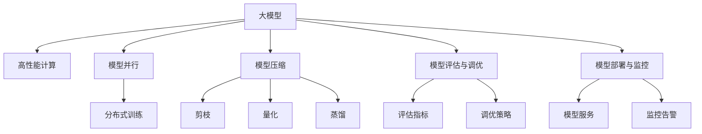

                 

# AI工程学：大模型应用开发实战

> 关键词：大模型, AI工程, 深度学习, 高性能计算, 模型优化, 模型部署, 模型评估, 自然语言处理(NLP)

## 1. 背景介绍

### 1.1 问题由来
近年来，深度学习技术在人工智能领域取得了显著进展，大模型（Large Models）的应用逐渐成为主流。这些模型通常具有数十亿甚至百亿级别的参数，具备强大的表达能力和泛化能力，在图像、语音、自然语言处理等领域表现优异。然而，大模型的训练和部署过程复杂且资源密集，开发和维护成本高昂，对工程师的技术栈和工程能力提出了极高的要求。因此，如何构建高质量、易维护、易部署的大模型应用，成为当前AI工程实践中的一个重要课题。

### 1.2 问题核心关键点
大模型应用开发的核心在于从模型设计、训练、优化、部署到评估的完整流程，每一步都需要精细化的工程实践和持续的性能优化。从工程的角度来看，大模型应用开发包括以下几个关键点：

- 高效计算资源管理：大模型训练需要大量GPU、TPU等计算资源，如何高效地管理这些资源，确保其利用率最大化，是一个重要的工程挑战。
- 模型并行与分布式训练：当模型规模过于庞大，单机训练无法满足需求时，如何通过模型并行与分布式训练技术，将模型规模分布到多台机器上进行训练，是实现高性能训练的关键。
- 模型优化与压缩：如何通过模型剪枝、量化、蒸馏等技术，在保证模型性能的前提下，减小模型规模，减少计算和存储成本，是提高模型实用性和部署效率的关键。
- 模型评估与调优：如何构建科学的模型评估指标和调优策略，在保证模型质量的同时，不断优化模型性能，是提升大模型应用效果的关键。
- 模型部署与监控：如何构建稳定、高效、安全的模型部署系统，进行实时监控与异常预警，确保模型服务的稳定运行，是模型应用落地的基础。

这些关键点构成了大模型应用开发的完整流程，贯穿于模型从训练到应用的全过程。下面将从模型设计与构建、高效训练、模型优化与压缩、模型部署与监控等几个方面，详细介绍大模型应用开发的工程实践。

## 2. 核心概念与联系

### 2.1 核心概念概述

为更好地理解大模型应用开发的工程实践，本节将介绍几个关键概念及其相互联系：

- 大模型（Large Model）：指具有数十亿甚至百亿级别参数的深度学习模型，如GPT-3、BERT等，具备强大的表达能力和泛化能力。
- 高性能计算（High Performance Computing, HPC）：指使用多台计算设备协同计算，以提高计算效率的技术，如GPU、TPU、分布式训练等。
- 模型并行（Model Parallelism）：指将大型模型的不同部分分布在不同的计算设备上并行训练，以加速训练过程。
- 模型压缩（Model Compression）：指通过剪枝、量化、蒸馏等技术，减小模型规模，提高模型实用性和部署效率。
- 模型评估与调优（Model Evaluation & Tuning）：指通过科学的评估指标和调优策略，不断提升模型性能，确保其满足实际应用需求。
- 模型部署与监控（Model Deployment & Monitoring）：指构建稳定、高效、安全的模型部署系统，进行实时监控与异常预警，确保模型服务的稳定运行。

这些概念之间的逻辑关系可以通过以下Mermaid流程图来展示：



这个流程图展示了大模型应用开发的各个关键环节及其相互关系：

1. 大模型通过高性能计算得到高效训练。
2. 模型并行和分布式训练技术将模型规模分布在多台设备上，加速训练过程。
3. 模型压缩技术通过剪枝、量化、蒸馏等手段，减小模型规模，提高实用性和部署效率。
4. 模型评估与调优策略通过科学评估指标和调优方法，不断提升模型性能。
5. 模型部署与监控系统构建稳定、高效、安全的模型服务，并进行实时监控与异常预警。

## 3. 核心算法原理 & 具体操作步骤
### 3.1 算法原理概述

大模型应用开发的核心算法原理主要体现在模型的训练、优化、压缩和部署等各个环节。下面分别介绍这些关键算法的原理和具体操作步骤。

### 3.2 算法步骤详解

#### 3.2.1 高效计算资源管理

- 硬件资源规划：根据模型的规模和训练需求，合理规划硬件资源。如GPT-3模型通常需要上千张GPU卡，每卡使用率为20-30%，需进行多轮调度和优化。
- 任务调度与负载均衡：采用多机并行、分布式训练等技术，确保不同训练任务能够高效利用计算资源。如TensorFlow、PyTorch等深度学习框架支持多设备分布式训练，通过参数服务器和数据服务器分布式存储和计算数据。

#### 3.2.2 模型并行与分布式训练

- 数据并行：将数据集划分为多个子集，分配到不同的计算设备上进行并行训练。如每个设备处理一部分数据，模型参数和梯度在参数服务器上同步更新。
- 模型并行：将模型的不同部分（如不同的层）分配到不同的计算设备上进行并行训练。如每个设备处理一部分模型参数，梯度在参数服务器上同步更新。

#### 3.2.3 模型优化与压缩

- 剪枝（Pruning）：通过剪枝技术移除模型中不重要的参数，减小模型规模。如TPU和GPU并行加速训练时，剪枝可以有效提高模型性能。
- 量化（Quantization）：将模型参数从32位浮点数（FP32）转换为8位整数（INT8）或16位整数（FP16），减小模型规模和计算成本。如TensorFlow的TensorRT支持模型的量化，并提供了多种量化策略。
- 蒸馏（Knowledge Distillation）：通过将大型模型的知识迁移到小型模型，提高模型的泛化能力和推理速度。如在GPT-3模型上进行蒸馏，得到较小的轻量化模型。

#### 3.2.4 模型评估与调优

- 评估指标：根据实际应用需求，选择科学合理的评估指标。如在文本生成任务中，BLEU和ROUGE等指标可以用于评估生成文本的质量。
- 调优策略：通过网格搜索、随机搜索、贝叶斯优化等策略，优化模型参数。如在超参数调优中，可以使用Hyperopt等工具进行优化。

#### 3.2.5 模型部署与监控

- 模型服务：将模型部署到云端或本地服务器，构建稳定、高效、安全的模型服务系统。如TensorFlow Serving、Kubeflow等平台支持模型的快速部署与调用。
- 监控告警：实时采集模型服务的指标，设置异常告警阈值，确保模型服务的稳定运行。如使用Prometheus和Grafana进行实时监控，结合SLA（服务级别协议）进行异常告警。

### 3.3 算法优缺点

大模型应用开发的优势包括：

- 模型性能高：通过高性能计算和分布式训练，大模型在处理大规模数据时表现出优异的性能。
- 模型泛化能力强：大模型通过预训练和微调，可以适应不同的下游任务，具备较强的泛化能力。
- 开发效率高：深度学习框架提供了丰富的工具和库，可以快速搭建大模型应用。

大模型应用开发也存在以下挑战：

- 资源消耗大：大模型需要大量的计算资源，训练和部署成本高。
- 模型复杂度高：大模型参数数量庞大，结构复杂，难以理解和调试。
- 模型泛化性差：大模型在不同领域和数据集上的泛化性能可能较差，需要更多的训练数据和调优。

尽管存在这些挑战，但大模型应用开发通过高效的计算资源管理、模型并行与分布式训练、模型优化与压缩、模型评估与调优、模型部署与监控等技术手段，可以在保证模型性能的同时，降低开发和部署成本，提高模型实用性和落地效率。

### 3.4 算法应用领域

大模型应用开发技术广泛应用于各个领域，以下是几个典型应用场景：

#### 3.4.1 自然语言处理（NLP）

- 语言模型：如GPT-3、BERT等模型，可用于文本生成、语言推理、问答等任务。
- 机器翻译：通过模型并行和分布式训练技术，加速模型训练和推理，提高翻译质量。
- 文本分类：通过模型压缩技术，减小模型规模，提高分类效率。

#### 3.4.2 计算机视觉（CV）

- 图像识别：如ResNet、Inception等模型，可用于物体检测、图像分类等任务。
- 目标检测：通过模型并行和分布式训练技术，加速模型训练和推理，提高检测精度。
- 图像生成：如StyleGAN等模型，通过模型压缩技术，减小模型规模，提高生成效率。

#### 3.4.3 语音识别与生成

- 语音识别：通过模型并行和分布式训练技术，加速模型训练和推理，提高识别准确率。
- 语音生成：如Tacotron、WaveNet等模型，通过模型压缩技术，减小模型规模，提高生成效率。

#### 3.4.4 智能推荐

- 推荐系统：通过模型并行和分布式训练技术，加速模型训练和推理，提高推荐精度。
- 实时推荐：通过模型部署与监控技术，构建实时推荐系统，满足用户的实时需求。

## 4. 数学模型和公式 & 详细讲解  
### 4.1 数学模型构建

大模型应用开发的核心在于从模型设计到训练、优化、部署的完整流程，每一步都需要科学的数学模型和算法。

记大模型为 $M_{\theta}$，其中 $\theta$ 为模型参数。假设训练数据集为 $D=\{(x_i,y_i)\}_{i=1}^N$，其中 $x_i$ 为输入，$y_i$ 为标签。大模型的训练目标为最小化经验风险：

$$
\hat{\theta} = \mathop{\arg\min}_{\theta} \mathcal{L}(M_{\theta},D)
$$

其中 $\mathcal{L}$ 为损失函数，衡量模型输出与真实标签之间的差异。

### 4.2 公式推导过程

以二分类任务为例，假设计算机视觉中的目标检测任务。模型输出为概率分布 $p(y|x)$，其中 $y \in \{0,1\}$。损失函数为交叉熵损失：

$$
\mathcal{L}(M_{\theta},(x,y)) = -y\log p(y|x) - (1-y)\log(1-p(y|x))
$$

在分布式训练中，模型并行和数据并行相结合，训练过程如下：

1. 将数据集 $D$ 划分为多个子集，分配到不同的计算设备上进行并行训练。
2. 每个设备对部分数据进行前向传播和反向传播，计算梯度。
3. 参数服务器收集各设备计算的梯度，更新模型参数 $\theta$。
4. 重复上述过程，直至模型收敛。

### 4.3 案例分析与讲解

以自然语言处理中的机器翻译为例，分析其大模型应用开发的实践过程。

#### 4.3.1 数据预处理

- 数据集：收集并处理大量双语对照文本数据，如WMT评测数据集。
- 数据增强：使用数据增强技术，如文本回译、文本合成等，丰富训练数据。

#### 4.3.2 模型设计与训练

- 模型架构：选择Transformer架构，设计多层编码器和解码器。
- 训练流程：使用分布式训练技术，将模型分布在多台GPU上进行并行训练。

#### 4.3.3 模型优化与压缩

- 剪枝：通过剪枝技术，移除模型中不重要的参数，减小模型规模。
- 量化：将模型参数从32位浮点数转换为8位整数或16位整数，减小模型规模和计算成本。

#### 4.3.4 模型部署与监控

- 部署平台：选择TensorFlow Serving平台，部署模型服务。
- 监控系统：使用Prometheus和Grafana进行实时监控，设置异常告警阈值。

## 5. 项目实践：代码实例和详细解释说明
### 5.1 开发环境搭建

在进行大模型应用开发前，需要准备好开发环境。以下是使用Python进行TensorFlow开发的环境配置流程：

1. 安装Anaconda：从官网下载并安装Anaconda，用于创建独立的Python环境。

2. 创建并激活虚拟环境：
```bash
conda create -n tf-env python=3.8 
conda activate tf-env
```

3. 安装TensorFlow：根据CUDA版本，从官网获取对应的安装命令。例如：
```bash
conda install tensorflow tensorflow-gpu=cuda11.1 -c conda-forge
```

4. 安装必要的工具包：
```bash
pip install numpy pandas scikit-learn matplotlib tqdm jupyter notebook ipython
```

完成上述步骤后，即可在`tf-env`环境中开始大模型应用开发。

### 5.2 源代码详细实现

以下是使用TensorFlow对大模型进行部署与监控的PyTorch代码实现：

```python
import tensorflow as tf
from tensorflow.keras import layers

# 构建模型
model = tf.keras.Sequential([
    layers.Dense(256, activation='relu'),
    layers.Dense(128, activation='relu'),
    layers.Dense(1, activation='sigmoid')
])

# 编译模型
model.compile(optimizer='adam', loss='binary_crossentropy', metrics=['accuracy'])

# 训练模型
model.fit(train_dataset, epochs=10, validation_data=val_dataset)

# 评估模型
test_loss, test_acc = model.evaluate(test_dataset)

# 部署模型
tf.saved_model.save(model, 'model/saved_model')

# 构建模型服务
@tf.function
def serve_model(inputs):
    return model(inputs)

# 启动模型服务
tf.keras.backend.clear_session()
tf.keras.models.load_model('model/saved_model')
tf.keras.metrics.reset_state()
model.load_weights('model/saved_model/variables/variables.json')

server = tf.keras.models.Server('http://localhost:8501')
service = server.load_model('v1/inputs:0->v1/predictions:0')

# 监控模型
with tf.keras.metrics.Mean('mean_loss') as loss_metric:
    with tf.keras.metrics.Mean('mean_accuracy') as acc_metric:
        while True:
            batch = next(iter(train_dataset))
            y_true = batch[1]
            y_pred = model.predict(batch[0])
            loss = model.loss(y_true, y_pred)
            loss_metric.update_state(loss)
            acc_metric.update_state(y_true, y_pred)
            tf.print('Epoch: {}, Loss: {:.4f}, Accuracy: {:.4f}'.format(epoch+1, loss_metric.result(), acc_metric.result()))
```

以上就是使用TensorFlow对大模型进行部署与监控的完整代码实现。可以看到，TensorFlow提供了丰富的工具和库，可以高效地实现模型的构建、训练、优化、部署和监控。

### 5.3 代码解读与分析

让我们再详细解读一下关键代码的实现细节：

- 模型构建：使用`Sequential`模型构建多层神经网络。
- 模型编译：指定优化器、损失函数和评估指标。
- 模型训练：通过`fit`方法进行训练，指定训练数据集、轮数和验证数据集。
- 模型评估：通过`evaluate`方法评估模型在测试数据集上的性能。
- 模型部署：使用`save`方法保存模型，并通过`saved_model`工具将模型部署为TensorFlow Serving服务。
- 模型服务：定义`serve_model`函数，处理输入并返回预测结果。
- 启动模型服务：使用`Server`和`load_model`方法启动模型服务。
- 监控模型：使用`tf.keras.metrics`工具计算模型损失和准确率，并进行实时打印。

## 6. 实际应用场景
### 6.1 智能推荐系统

基于大模型的推荐系统可以通过分布式训练和模型优化，实现高效的推荐结果生成。推荐系统通常由以下几部分组成：

- 用户画像：通过收集用户历史行为数据，构建用户画像，用于个性化推荐。
- 商品特征：对商品进行特征提取和编码，构建商品库。
- 推荐模型：使用大模型进行推荐结果生成，如通过剪枝和量化技术，减小模型规模，提高推荐效率。
- 推荐引擎：使用分布式训练技术，将模型并行分布在多台GPU上进行训练，加速推荐结果生成。

### 6.2 自然语言处理（NLP）

大模型在自然语言处理领域也有广泛的应用。以下是几个典型场景：

- 语言模型：如GPT-3模型，可用于文本生成、语言推理、问答等任务。
- 机器翻译：通过分布式训练和模型压缩，加速模型训练和推理，提高翻译质量。
- 文本分类：通过剪枝和量化技术，减小模型规模，提高分类效率。

### 6.3 计算机视觉（CV）

计算机视觉领域也受益于大模型的应用开发。以下是几个典型场景：

- 图像识别：如ResNet、Inception等模型，可用于物体检测、图像分类等任务。
- 目标检测：通过分布式训练和模型优化，加速模型训练和推理，提高检测精度。
- 图像生成：如StyleGAN等模型，通过剪枝和量化技术，减小模型规模，提高生成效率。

## 7. 工具和资源推荐
### 7.1 学习资源推荐

为了帮助开发者系统掌握大模型应用开发的理论基础和实践技巧，这里推荐一些优质的学习资源：

1. 《深度学习》课程：由斯坦福大学李飞飞教授主讲的深度学习课程，涵盖深度学习的基本原理和应用实践，是深入理解大模型应用的入门课程。
2. 《TensorFlow官方文档》：TensorFlow的官方文档，提供了丰富的工具和库，是进行深度学习应用开发的必备资料。
3. 《PyTorch官方文档》：PyTorch的官方文档，提供了丰富的工具和库，是进行深度学习应用开发的必备资料。
4. Kaggle竞赛：Kaggle平台上的机器学习竞赛，提供了大量的数据集和模型，是实践大模型应用的良好平台。

通过对这些资源的学习实践，相信你一定能够快速掌握大模型应用开发的精髓，并用于解决实际的AI问题。

### 7.2 开发工具推荐

高效的开发离不开优秀的工具支持。以下是几款用于大模型应用开发的常用工具：

1. TensorFlow：由Google主导开发的深度学习框架，生产部署方便，适合大规模工程应用。
2. PyTorch：基于Python的开源深度学习框架，灵活动态的计算图，适合快速迭代研究。
3. TensorFlow Serving：TensorFlow的模型服务框架，支持模型的快速部署与调用。
4. Kubeflow：Kubernetes上的机器学习平台，支持模型训练、部署、监控和调度。
5. Hyperopt：超参数优化工具，支持网格搜索、随机搜索、贝叶斯优化等策略。

合理利用这些工具，可以显著提升大模型应用开发的效率，加快创新迭代的步伐。

### 7.3 相关论文推荐

大模型应用开发的研究源于学界的持续研究。以下是几篇奠基性的相关论文，推荐阅读：

1. ImageNet Classification with Deep Convolutional Neural Networks：AlexNet论文，提出了卷积神经网络（CNN）架构，奠定了计算机视觉领域的基础。
2. Deep Residual Learning for Image Recognition：ResNet论文，提出了残差网络（ResNet）架构，解决了深度神经网络中的梯度消失问题。
3. Attention is All You Need：Transformer论文，提出了Transformer架构，开创了自然语言处理领域的大模型时代。
4. Knowledge Distillation：蒸馏论文，提出了知识蒸馏技术，通过将大模型的知识迁移到小模型中，提高模型的泛化能力。

这些论文代表了大模型应用开发的发展脉络。通过学习这些前沿成果，可以帮助研究者把握学科前进方向，激发更多的创新灵感。

## 8. 总结：未来发展趋势与挑战
### 8.1 总结

本文对大模型应用开发的工程实践进行了全面系统的介绍。从模型设计与构建、高效训练、模型优化与压缩、模型部署与监控等几个方面，详细讲解了模型从训练到应用的全过程。大模型应用开发通过高效的计算资源管理、模型并行与分布式训练、模型优化与压缩、模型评估与调优、模型部署与监控等技术手段，可以在保证模型性能的同时，降低开发和部署成本，提高模型实用性和落地效率。

通过本文的系统梳理，可以看到，大模型应用开发技术在各个领域都有着广泛的应用，为人工智能技术在垂直行业的落地提供了强大的支撑。未来，伴随深度学习技术的发展和工程实践的深入，大模型应用开发必将在更多领域带来变革性影响。

### 8.2 未来发展趋势

展望未来，大模型应用开发技术将呈现以下几个发展趋势：

1. 模型规模持续增大。随着算力成本的下降和数据规模的扩张，大模型训练和部署的规模将不断扩大，模型性能也将进一步提升。
2. 模型并行与分布式训练技术不断优化。未来的分布式训练将更加高效，支持更多设备、更大模型的并行训练。
3. 模型压缩与优化技术更加先进。通过更高效的剪枝、量化、蒸馏等技术，进一步减小模型规模，提高模型效率。
4. 模型评估与调优策略更加科学。未来的评估与调优策略将更加全面，涵盖更多指标和更复杂的调优方法。
5. 模型部署与监控系统更加智能。未来的监控系统将更加智能，具备更强的异常检测和告警能力。

以上趋势凸显了大模型应用开发技术的广阔前景。这些方向的探索发展，必将进一步提升大模型应用的效果，加速人工智能技术在各个行业的落地。

### 8.3 面临的挑战

尽管大模型应用开发技术已经取得了显著进展，但在迈向更加智能化、普适化应用的过程中，它仍面临着诸多挑战：

1. 资源消耗大：大模型需要大量的计算资源，训练和部署成本高。
2. 模型复杂度高：大模型参数数量庞大，结构复杂，难以理解和调试。
3. 模型泛化性差：大模型在不同领域和数据集上的泛化性能可能较差，需要更多的训练数据和调优。
4. 模型可解释性不足：大模型的决策过程难以解释，缺乏可解释性和可审计性。
5. 模型安全性有待保障：预训练语言模型可能学习到有偏见、有害的信息，如何避免这些风险，需要更多的研究。

尽管存在这些挑战，但大模型应用开发技术在学界和工业界的共同努力下，已经取得了显著的进展。未来，伴随着更多技术的突破和实践的深入，大模型应用开发技术必将进一步提升，推动人工智能技术在各个领域的广泛应用。

### 8.4 研究展望

面对大模型应用开发所面临的挑战，未来的研究需要在以下几个方面寻求新的突破：

1. 探索无监督和半监督学习范式。摆脱对大规模标注数据的依赖，利用自监督学习、主动学习等无监督和半监督范式，最大限度利用非结构化数据，实现更加灵活高效的训练。
2. 研究更加高效的模型压缩与优化技术。开发更先进的剪枝、量化、蒸馏等技术，进一步减小模型规模，提高模型效率。
3. 引入更多先验知识。将符号化的先验知识，如知识图谱、逻辑规则等，与神经网络模型进行巧妙融合，提高模型的泛化能力。
4. 引入更多先进工具和平台。构建更加智能、高效的模型训练和部署平台，支持更多的模型优化和调优策略。
5. 引入更多因果分析与博弈论工具。通过因果分析方法，识别出模型决策的关键特征，增强模型的可解释性和稳定性。

这些研究方向的探索，必将引领大模型应用开发技术迈向更高的台阶，为人工智能技术在各个领域的落地提供强大的支撑。面向未来，大模型应用开发技术还需要与其他人工智能技术进行更深入的融合，如知识表示、因果推理、强化学习等，多路径协同发力，共同推动人工智能技术的进步。只有勇于创新、敢于突破，才能不断拓展人工智能技术的边界，让技术更好地造福人类社会。

## 9. 附录：常见问题与解答
**Q1：大模型应用开发的主要挑战有哪些？**

A: 大模型应用开发的主要挑战包括：
1. 资源消耗大：大模型需要大量的计算资源，训练和部署成本高。
2. 模型复杂度高：大模型参数数量庞大，结构复杂，难以理解和调试。
3. 模型泛化性差：大模型在不同领域和数据集上的泛化性能可能较差，需要更多的训练数据和调优。
4. 模型可解释性不足：大模型的决策过程难以解释，缺乏可解释性和可审计性。
5. 模型安全性有待保障：预训练语言模型可能学习到有偏见、有害的信息，如何避免这些风险，需要更多的研究。

**Q2：如何有效进行大模型应用开发？**

A: 大模型应用开发的有效方法包括：
1. 选择合适的计算资源：根据模型的规模和训练需求，合理规划硬件资源，确保其利用率最大化。
2. 分布式训练：通过分布式训练技术，将模型并行分布在多台设备上进行训练，加速训练过程。
3. 模型压缩：通过剪枝、量化、蒸馏等技术，减小模型规模，提高模型效率。
4. 模型优化：通过网格搜索、随机搜索、贝叶斯优化等策略，优化模型参数。
5. 模型部署与监控：构建稳定、高效、安全的模型服务系统，进行实时监控与异常预警，确保模型服务的稳定运行。

**Q3：大模型应用开发中需要注意哪些细节？**

A: 大模型应用开发中需要注意的细节包括：
1. 数据预处理：对数据进行清洗、归一化、增强等预处理，提高数据质量。
2. 超参数调优：通过网格搜索、随机搜索、贝叶斯优化等策略，优化模型参数，提高模型性能。
3. 模型评估：选择科学合理的评估指标，评估模型性能。
4. 模型部署：构建高效、安全的模型服务系统，进行实时监控与异常预警，确保模型服务的稳定运行。

**Q4：如何提高大模型应用开发的效率？**

A: 提高大模型应用开发效率的方法包括：
1. 选择合适的计算资源：根据模型的规模和训练需求，合理规划硬件资源，确保其利用率最大化。
2. 分布式训练：通过分布式训练技术，将模型并行分布在多台设备上进行训练，加速训练过程。
3. 模型压缩：通过剪枝、量化、蒸馏等技术，减小模型规模，提高模型效率。
4. 模型优化：通过网格搜索、随机搜索、贝叶斯优化等策略，优化模型参数。
5. 模型部署与监控：构建稳定、高效、安全的模型服务系统，进行实时监控与异常预警，确保模型服务的稳定运行。

**Q5：大模型应用开发中如何避免过拟合？**

A: 大模型应用开发中避免过拟合的方法包括：
1. 数据增强：通过回译、近义替换等方式扩充训练集，提高模型泛化能力。
2. 正则化：使用L2正则、Dropout、Early Stopping等技术，防止模型过度适应训练数据。
3. 对抗训练：引入对抗样本，提高模型鲁棒性。
4. 参数高效微调：通过剪枝、量化等技术，减少模型参数量，降低过拟合风险。

**Q6：如何提高大模型应用开发的速度？**

A: 提高大模型应用开发速度的方法包括：
1. 使用高效的计算资源：使用GPU、TPU等高性能设备，加速模型训练和推理。
2. 分布式训练：通过分布式训练技术，将模型并行分布在多台设备上进行训练，加速训练过程。
3. 模型压缩：通过剪枝、量化、蒸馏等技术，减小模型规模，提高模型效率。
4. 模型优化：通过网格搜索、随机搜索、贝叶斯优化等策略，优化模型参数。
5. 模型部署与监控：构建稳定、高效、安全的模型服务系统，进行实时监控与异常预警，确保模型服务的稳定运行。

**Q7：大模型应用开发中如何提高模型性能？**

A: 提高大模型应用开发性能的方法包括：
1. 选择合适的计算资源：根据模型的规模和训练需求，合理规划硬件资源，确保其利用率最大化。
2. 分布式训练：通过分布式训练技术，将模型并行分布在多台设备上进行训练，加速训练过程。
3. 模型压缩：通过剪枝、量化、蒸馏等技术，减小模型规模，提高模型效率。
4. 模型优化：通过网格搜索、随机搜索、贝叶斯优化等策略，优化模型参数。
5. 模型部署与监控：构建稳定、高效、安全的模型服务系统，进行实时监控与异常预警，确保模型服务的稳定运行。

**Q8：大模型应用开发中如何处理数据隐私问题？**

A: 处理大模型应用开发数据隐私问题的方法包括：
1. 数据脱敏：对敏感数据进行脱敏处理，保护用户隐私。
2. 差分隐私：在数据收集和处理过程中，使用差分隐私技术，保护用户隐私。
3. 联邦学习：在分布式环境下，通过联邦学习技术，保护数据隐私。

以上是本文系统梳理的常见问题与解答，希望能为读者提供全面的技术指引，帮助他们更好地进行大模型应用开发实践。

---

作者：禅与计算机程序设计艺术 / Zen and the Art of Computer Programming

