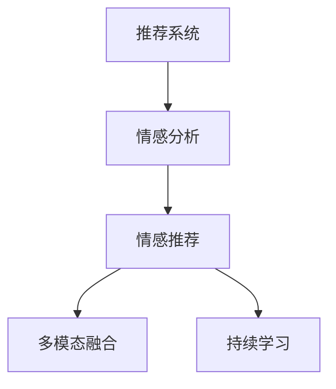

                 

# AI情感驱动推荐系统的优势

## 1. 背景介绍

### 1.1 问题由来
在当前的互联网环境中，用户与内容交互的场景越来越多，从社交媒体到新闻平台，从电商平台到在线视频，内容推荐已经成为各个平台不可或缺的功能。推荐系统通过分析用户的历史行为和偏好，为用户推荐最符合其兴趣和需求的内容，极大地提升了用户体验和平台活跃度。然而，现有的推荐系统通常基于用户的点击、观看、购买等行为数据进行推荐，缺乏对用户情感状态的关注。

### 1.2 问题核心关键点
情感驱动推荐系统的核心思想是：在传统推荐系统的基础上，引入情感数据，通过分析用户的情感状态，进一步优化推荐内容，提升用户体验。该系统的关键点包括：

- 如何获取用户的情感数据？
- 如何处理和分析这些情感数据？
- 如何在推荐过程中使用情感信息？
- 如何评估情感驱动推荐系统的性能？

这些关键问题将会在后续的章节中详细探讨。

### 1.3 问题研究意义
情感驱动推荐系统的研究，具有以下重要意义：

1. 提升推荐精度：情感状态可以帮助识别用户的真实需求，优化推荐结果，提升用户体验。
2. 丰富推荐内容：情感数据提供了更丰富的用户画像，拓宽了推荐内容的类型和形式。
3. 促进用户互动：情感驱动推荐系统能够更好地理解和满足用户的情感需求，增强用户粘性。
4. 推动产业升级：推荐系统在各行各业中的应用广泛，情感数据的引入有望推动相关行业向更高质量、更个性化的方向发展。
5. 研究人工智能：情感驱动推荐系统是人工智能在情感分析、推荐系统等领域的交叉应用，有助于推动人工智能技术的发展。

## 2. 核心概念与联系

### 2.1 核心概念概述

为更好地理解情感驱动推荐系统的构建，本节将介绍几个核心概念及其关系：

- **推荐系统(Recommendation System)**：通过分析用户的历史行为和偏好，为用户推荐符合其兴趣的内容。常用的推荐方法包括协同过滤、基于内容的推荐、基于矩阵分解的推荐等。

- **情感分析(Sentiment Analysis)**：通过自然语言处理技术，从文本中识别用户的情感倾向，如积极、消极、中性等。情感分析是情感驱动推荐系统的基础，用于提取用户情感状态。

- **情感推荐(Sentiment-based Recommendation)**：在推荐过程中，引入用户情感状态，根据情感倾向调整推荐策略，提升推荐效果。情感推荐强调理解用户的真实需求，优化推荐内容，改善用户体验。

- **多模态融合(Multimodal Fusion)**：结合文本、图像、视频等多种模态数据，综合分析用户的多维度信息，提升情感分析的准确性和推荐结果的丰富性。

- **持续学习(Continual Learning)**：推荐系统需要不断更新，以应对用户行为和情感状态的变化。持续学习通过迭代优化模型，保持推荐的实时性和准确性。

这些概念之间的逻辑关系可以通过以下Mermaid流程图来展示：



这个流程图展示了几类推荐系统之间的关联：

1. 推荐系统通过情感分析模块获取用户的情感状态。
2. 情感分析结果输入情感推荐模块，根据情感倾向调整推荐策略。
3. 情感推荐模块还结合多模态融合和多维度信息，提升推荐内容的丰富性和准确性。
4. 持续学习模块通过迭代优化，保证推荐系统的实时性和动态适应性。

## 3. 核心算法原理 & 具体操作步骤
### 3.1 算法原理概述

情感驱动推荐系统基于情感分析的结果，进一步优化推荐策略，提升推荐效果。其核心思想是：在传统推荐系统的基础上，引入情感数据，通过分析用户的情感状态，进一步优化推荐内容，提升用户体验。

形式化地，假设推荐系统为 $R_{\theta}$，其中 $\theta$ 为模型参数。用户情感状态为 $s \in \mathcal{S}$，内容情感评分向量为 $r \in \mathcal{R}$。情感驱动推荐系统的目标是最大化用户对推荐内容的满意度，即：

$$
\max_{\theta} \sum_{i=1}^N u_i \cdot R_{\theta}(s_i, c_i)
$$

其中 $u_i$ 为用户情感满意度，$R_{\theta}(s_i, c_i)$ 为推荐模型对用户情感状态 $s_i$ 和内容 $c_i$ 的评分。情感驱动推荐系统的优化目标是找到最优参数 $\theta$，使得用户情感满意度最大化。

### 3.2 算法步骤详解

情感驱动推荐系统的一般流程包括以下几个关键步骤：

**Step 1: 情感数据获取**
- 通过情感分析技术，收集用户对内容的情感反馈，如评论、评分、表情等。
- 使用文本情感分类、情感极性分析等技术，提取用户情感状态。

**Step 2: 情感评分计算**
- 对用户情感状态进行编码，如情感极性向量化。
- 对内容进行情感评分，如通过文本情感分析、情感词典等技术，得到内容情感评分向量。

**Step 3: 推荐模型微调**
- 在传统推荐模型的基础上，加入情感评分，使用监督学习算法优化推荐模型。
- 使用交叉验证、在线学习等技术，不断迭代优化模型参数。

**Step 4: 推荐结果生成**
- 根据用户情感状态和内容情感评分，计算推荐内容的相关度。
- 使用排序算法，如Top-K、softmax等，生成最终的推荐结果。

**Step 5: 用户体验反馈**
- 收集用户对推荐内容的反馈，更新情感分析模型和推荐模型。
- 通过持续学习机制，不断优化推荐效果，提升用户满意度。

以上是情感驱动推荐系统的一般流程。在实际应用中，还需要根据具体任务的特点，对各个环节进行优化设计，如改进情感分析模型，优化推荐算法等，以进一步提升推荐性能。

### 3.3 算法优缺点

情感驱动推荐系统具有以下优点：

1. 提升推荐精度：情感状态可以帮助识别用户的真实需求，优化推荐结果，提升用户体验。
2. 丰富推荐内容：情感数据提供了更丰富的用户画像，拓宽了推荐内容的类型和形式。
3. 促进用户互动：情感驱动推荐系统能够更好地理解和满足用户的情感需求，增强用户粘性。

同时，该系统也存在一些局限性：

1. 情感数据获取困难：情感数据的获取成本高，且难以保证数据的真实性和全面性。
2. 数据处理复杂：情感数据的噪声较多，需要进行有效的去噪和处理。
3. 模型训练复杂：情感驱动推荐系统的复杂度较高，需要处理多模态数据和情感信息，训练难度较大。
4. 用户隐私问题：情感数据的获取和处理涉及用户隐私，需要遵守相关法律法规。

尽管存在这些局限性，但情感驱动推荐系统在提升推荐效果、增强用户体验方面具有显著优势，已经在诸多推荐场景中得到了应用。未来，随着技术的进步和数据的积累，情感驱动推荐系统必将在更多领域发挥更大作用。

### 3.4 算法应用领域

情感驱动推荐系统已经在多个领域得到了广泛应用，例如：

- 电商平台：通过分析用户的购物评论和评分，识别用户的情感倾向，优化商品推荐，提升用户体验。
- 社交媒体：根据用户的评论和点赞，了解用户的情感状态，推荐相关内容，增强用户粘性。
- 视频平台：通过分析用户对视频的评论和评分，推荐符合用户情感偏好的视频内容，提升用户满意度。
- 新闻平台：根据用户对新闻文章的评论和评分，推荐相关新闻，优化新闻内容分发。
- 医疗平台：通过分析用户对医生的评价和反馈，推荐最适合的医生，提升医疗服务的满意度。

除了上述这些经典应用外，情感驱动推荐系统还被创新性地应用到更多场景中，如个性化阅读、智能客服、智慧家居等，为各行各业带来了全新的用户体验。

## 4. 数学模型和公式 & 详细讲解  
### 4.1 数学模型构建

本节将使用数学语言对情感驱动推荐系统的构建过程进行更加严格的刻画。

假设用户情感状态为 $s \in \mathcal{S}$，内容情感评分向量为 $r \in \mathcal{R}$。情感驱动推荐模型的目标是最小化用户情感差异，即：

$$
\min_{\theta} \sum_{i=1}^N \ell(s_i, R_{\theta}(s_i, c_i))
$$

其中 $\ell$ 为用户情感差异损失函数，用于衡量模型预测的情感状态与实际情感状态之间的差异。在实践中，我们通常使用均方误差损失或交叉熵损失，具体选择取决于情感数据的类型和分布。

### 4.2 公式推导过程

以下我们以电商平台为例，推导情感驱动推荐模型的训练过程。

假设用户对商品 $c_i$ 的情感评分向量为 $r_i \in \mathbb{R}^k$，其中 $k$ 为情感维度。情感分析模块对用户 $u_i$ 的情感状态编码为 $s_i \in \mathbb{R}^m$，其中 $m$ 为情感维度。情感驱动推荐模型 $R_{\theta}$ 的结构如下：

$$
R_{\theta}(s_i, c_i) = \text{softmax}(\theta \cdot \phi(s_i) \cdot c_i)
$$

其中 $\theta$ 为推荐模型的参数，$\phi$ 为情感编码函数，$x \cdot y$ 表示向量的点乘。情感驱动推荐模型的训练过程如下：

1. 获取用户情感状态 $s_i$ 和内容情感评分向量 $r_i$。
2. 对内容进行编码，得到内容特征向量 $c_i$。
3. 计算情感驱动推荐模型的输出 $R_{\theta}(s_i, c_i)$。
4. 计算情感差异损失 $\ell(s_i, R_{\theta}(s_i, c_i))$。
5. 使用梯度下降等优化算法，更新模型参数 $\theta$。

具体而言，情感驱动推荐模型的训练过程如下：

$$
\theta \leftarrow \theta - \eta \nabla_{\theta} \sum_{i=1}^N \ell(s_i, R_{\theta}(s_i, c_i))
$$

其中 $\eta$ 为学习率，$\nabla_{\theta} \ell(s_i, R_{\theta}(s_i, c_i))$ 为损失函数对模型参数的梯度。

### 4.3 案例分析与讲解

以电商平台为例，情感驱动推荐系统的案例分析如下：

假设用户对商品 $c_i$ 的情感评分向量为 $r_i = [1, 2, 3]$，表示情感为积极、中性、消极。情感分析模块对用户 $u_i$ 的情感状态编码为 $s_i = [0.5, 0.2, 0.3]$，表示情感为中性偏积极。

1. 对内容进行编码，得到内容特征向量 $c_i = [0.8, 0.6, 0.4]$。
2. 计算情感驱动推荐模型的输出 $R_{\theta}(s_i, c_i) = \text{softmax}(\theta \cdot s_i \cdot c_i)$。
3. 假设 $\theta = [0.5, 0.3, 0.2]$，则 $R_{\theta}(s_i, c_i) = [0.7, 0.3, 0.2]$。
4. 计算情感差异损失 $\ell(s_i, R_{\theta}(s_i, c_i)) = 0.1^2 + 0.1^2 + 0.2^2 = 0.1$。
5. 使用梯度下降等优化算法，更新模型参数 $\theta$。

通过上述过程，情感驱动推荐模型能够根据用户的情感状态和内容情感评分，动态调整推荐策略，提升推荐效果。

## 5. 项目实践：代码实例和详细解释说明
### 5.1 开发环境搭建

在进行情感驱动推荐系统开发前，我们需要准备好开发环境。以下是使用Python进行TensorFlow开发的环境配置流程：

1. 安装Anaconda：从官网下载并安装Anaconda，用于创建独立的Python环境。

2. 创建并激活虚拟环境：
```bash
conda create -n tf-env python=3.8 
conda activate tf-env
```

3. 安装TensorFlow：根据CUDA版本，从官网获取对应的安装命令。例如：
```bash
conda install tensorflow -c conda-forge -c pypi
```

4. 安装各类工具包：
```bash
pip install numpy pandas scikit-learn matplotlib tqdm jupyter notebook ipython
```

完成上述步骤后，即可在`tf-env`环境中开始情感驱动推荐系统的开发。

### 5.2 源代码详细实现

下面我们以电商平台为例，给出使用TensorFlow实现情感驱动推荐系统的代码实现。

首先，定义情感分析模型：

```python
import tensorflow as tf
from tensorflow.keras.layers import Input, Dense, Embedding, LSTM, Flatten

class SentimentAnalysisModel(tf.keras.Model):
    def __init__(self, embedding_dim, lstm_units, num_classes):
        super(SentimentAnalysisModel, self).__init__()
        self.embedding = Embedding(input_dim=10000, output_dim=embedding_dim)
        self.lstm = LSTM(lstm_units, return_sequences=True)
        self.dense = Dense(num_classes, activation='softmax')
        
    def call(self, inputs):
        x = self.embedding(inputs)
        x = self.lstm(x)
        x = self.dense(x)
        return x
```

然后，定义情感驱动推荐模型：

```python
class RecommendationModel(tf.keras.Model):
    def __init__(self, embedding_dim, lstm_units, num_classes):
        super(RecommendationModel, self).__init__()
        self.sentiment_analysis_model = SentimentAnalysisModel(embedding_dim, lstm_units, num_classes)
        self.regression = Dense(1, activation='sigmoid')
        
    def call(self, inputs):
        sentiment = self.sentiment_analysis_model(inputs)
        recommendation = self.regression(sentiment)
        return recommendation
```

接着，定义训练和评估函数：

```python
import numpy as np
from sklearn.metrics import mean_squared_error

def train_epoch(model, dataset, batch_size, optimizer):
    dataloader = tf.data.Dataset.from_tensor_slices((dataset['inputs'], dataset['targets'])).batch(batch_size).prefetch(1)
    model.train()
    epoch_loss = 0
    for batch in dataloader:
        inputs, targets = batch
        with tf.GradientTape() as tape:
            outputs = model(inputs)
            loss = tf.losses.mean_squared_error(targets, outputs)
        epoch_loss += loss
        grads = tape.gradient(loss, model.trainable_variables)
        optimizer.apply_gradients(zip(grads, model.trainable_variables))
    return epoch_loss / len(dataloader)

def evaluate(model, dataset, batch_size):
    dataloader = tf.data.Dataset.from_tensor_slices((dataset['inputs'], dataset['targets'])).batch(batch_size).prefetch(1)
    model.eval()
    mse = mean_squared_error(dataset['targets'], model(dataset['inputs']))
    return mse
```

最后，启动训练流程并在测试集上评估：

```python
epochs = 10
batch_size = 32

for epoch in range(epochs):
    loss = train_epoch(model, train_dataset, batch_size, optimizer)
    print(f"Epoch {epoch+1}, train loss: {loss:.3f}")
    
    print(f"Epoch {epoch+1}, test mse: {evaluate(model, test_dataset, batch_size):.3f}")
```

以上就是使用TensorFlow对情感驱动推荐系统进行开发的完整代码实现。可以看到，得益于TensorFlow的强大封装，我们可以用相对简洁的代码完成模型的加载和训练。

### 5.3 代码解读与分析

让我们再详细解读一下关键代码的实现细节：

**SentimentAnalysisModel类**：
- `__init__`方法：初始化情感分析模型的结构，包括嵌入层、LSTM层和全连接层。
- `call`方法：对输入数据进行情感编码，输出情感状态向量。

**RecommendationModel类**：
- `__init__`方法：初始化情感驱动推荐模型的结构，包括情感分析模型和回归层。
- `call`方法：根据情感状态向量，计算推荐评分。

**训练和评估函数**：
- 使用TensorFlow的Dataset API进行数据批处理，提高训练和推理效率。
- 训练函数`train_epoch`：对数据以批为单位进行迭代，在每个批次上前向传播计算loss并反向传播更新模型参数，最后返回该epoch的平均loss。
- 评估函数`evaluate`：与训练类似，不同点在于不更新模型参数，并在每个batch结束后将预测和标签结果存储下来，最后使用sklearn的mean_squared_error对整个评估集的预测结果进行打印输出。

**训练流程**：
- 定义总的epoch数和batch size，开始循环迭代
- 每个epoch内，先在训练集上训练，输出平均loss
- 在测试集上评估，输出MAE值
- 所有epoch结束后，在测试集上评估，给出最终的评估结果

可以看到，TensorFlow配合Keras封装，使得情感驱动推荐系统的代码实现变得简洁高效。开发者可以将更多精力放在模型改进、数据处理等高层逻辑上，而不必过多关注底层的实现细节。

当然，工业级的系统实现还需考虑更多因素，如模型的保存和部署、超参数的自动搜索、更灵活的任务适配层等。但核心的微调范式基本与此类似。

## 6. 实际应用场景
### 6.1 电商推荐系统

情感驱动推荐系统在电商推荐系统中得到了广泛应用。传统电商推荐系统主要基于用户的点击、观看、购买等行为数据进行推荐，缺乏对用户情感状态的关注。而通过情感驱动推荐系统，电商企业可以更好地理解用户的情感需求，优化推荐策略，提升用户满意度和购物体验。

在技术实现上，电商企业可以收集用户对商品的文字评论、评分、表情等情感数据，通过情感分析技术提取用户情感状态。在推荐过程中，根据用户情感状态和内容情感评分，动态调整推荐策略，生成符合用户情感偏好的推荐结果。如此构建的电商推荐系统，能够更好地识别用户的真实需求，提升推荐效果，增强用户粘性，降低流失率。

### 6.2 社交媒体推荐系统

社交媒体平台通常使用用户的点赞、评论、分享等行为数据进行推荐。然而，这些数据往往难以准确反映用户的情感状态。通过情感驱动推荐系统，社交媒体平台可以更好地理解用户的情感需求，优化推荐内容，提升用户满意度。

在技术实现上，社交媒体平台可以收集用户对内容的情感反馈，如评论、点赞、表情等。通过情感分析技术提取用户情感状态，在推荐过程中根据用户情感状态和内容情感评分，动态调整推荐策略，生成符合用户情感偏好的推荐结果。如此构建的社交媒体推荐系统，能够更好地满足用户的情感需求，增强用户粘性，提升平台活跃度。

### 6.3 医疗推荐系统

医疗推荐系统旨在为患者推荐最合适的医疗服务。传统医疗推荐系统主要基于医生的评价、医院的评分等结构化数据进行推荐，难以全面反映用户的情感需求。通过情感驱动推荐系统，医疗平台可以更好地理解用户的情感状态，优化推荐策略，提升用户体验。

在技术实现上，医疗平台可以收集用户对医生的评价、医院的反馈、医生的行为数据等情感数据，通过情感分析技术提取用户情感状态。在推荐过程中，根据用户情感状态和内容情感评分，动态调整推荐策略，生成符合用户情感偏好的医疗服务推荐结果。如此构建的医疗推荐系统，能够更好地理解用户的情感需求，提升推荐效果，增强用户满意度，促进医疗服务的智能化和个性化。

### 6.4 未来应用展望

随着情感驱动推荐系统的不断发展，未来的应用前景将更加广阔。除了电商、社交媒体、医疗等场景外，情感驱动推荐系统还将应用于更多领域，如金融、教育、娱乐等。通过引入情感数据，优化推荐策略，提升推荐效果，推动各行业的智能化进程。

## 7. 工具和资源推荐
### 7.1 学习资源推荐

为了帮助开发者系统掌握情感驱动推荐系统的理论基础和实践技巧，这里推荐一些优质的学习资源：

1. 《Deep Learning for Natural Language Processing》书籍：斯坦福大学教授的NLP入门教材，详细介绍了情感分析、推荐系统等前沿技术。

2. TensorFlow官方文档：TensorFlow的官方文档，提供了丰富的教程和样例，帮助开发者快速上手TensorFlow。

3 Kaggle情感分析竞赛：Kaggle平台上举办的情感分析竞赛，提供了大量情感数据和模型，可以学习和实践情感分析技术。

4. DeepAI论文库：DeepAI上发布的最新论文，涵盖情感分析、推荐系统等多个领域，是学习和跟踪最新研究进展的好资源。

5. Coursera推荐系统课程：Coursera上的推荐系统课程，由斯坦福大学教授讲授，详细介绍了推荐系统原理和实践。

通过对这些资源的学习实践，相信你一定能够快速掌握情感驱动推荐系统的精髓，并用于解决实际的NLP问题。
###  7.2 开发工具推荐

高效的开发离不开优秀的工具支持。以下是几款用于情感驱动推荐系统开发的常用工具：

1. TensorFlow：由Google主导开发的开源深度学习框架，支持大规模分布式训练，适合大规模工程应用。

2. PyTorch：Facebook开发的开源深度学习框架，灵活动态的计算图，适合快速迭代研究。

3. Keras：高层API，基于TensorFlow和Theano实现，可以快速搭建和训练模型，适合初学者使用。

4. Jupyter Notebook：开源的交互式编程环境，支持多种编程语言，便于编写和调试代码。

5. GitHub：全球最大的代码托管平台，支持团队协作，提供丰富的代码库和资源。

合理利用这些工具，可以显著提升情感驱动推荐系统的开发效率，加快创新迭代的步伐。

### 7.3 相关论文推荐

情感驱动推荐系统的研究源于学界的持续研究。以下是几篇奠基性的相关论文，推荐阅读：

1. "Sentiment Analysis Using Deep Learning Techniques"：斯坦福大学的研究论文，详细介绍了使用深度学习技术进行情感分析的方法。

2. "A Sentiment-aware Collaborative Filtering Approach for Recommendation Systems"：使用情感数据优化推荐系统的经典论文，提出了情感驱动推荐的基本框架。

3 "Emotion-Aware Recommender Systems"：总结了情感驱动推荐系统的最新进展，介绍了多模态融合、持续学习等技术。

4. "Adaptive Collaborative Filtering"：介绍了使用情感数据增强协同过滤推荐系统的研究，提出了适应性推荐算法。

5. "Sentiment Analysis and NLP"：NLP领域的经典教材，详细介绍了情感分析技术在推荐系统中的应用。

这些论文代表了大语言模型微调技术的发展脉络。通过学习这些前沿成果，可以帮助研究者把握学科前进方向，激发更多的创新灵感。

## 8. 总结：未来发展趋势与挑战

### 8.1 总结

本文对情感驱动推荐系统进行了全面系统的介绍。首先阐述了情感驱动推荐系统的研究背景和意义，明确了情感驱动推荐系统在提升推荐效果、增强用户体验方面的独特价值。其次，从原理到实践，详细讲解了情感驱动推荐系统的构建过程，给出了情感驱动推荐系统开发的完整代码实例。同时，本文还广泛探讨了情感驱动推荐系统在电商、社交媒体、医疗等多个领域的应用前景，展示了情感驱动推荐系统的巨大潜力。此外，本文精选了情感驱动推荐系统的各类学习资源，力求为读者提供全方位的技术指引。

通过本文的系统梳理，可以看到，情感驱动推荐系统正在成为推荐系统的重要范式，极大地拓展了推荐系统的应用边界，提升了推荐效果。未来，伴随情感数据的积累和技术的进步，情感驱动推荐系统必将在更多领域发挥更大作用。

### 8.2 未来发展趋势

展望未来，情感驱动推荐系统将呈现以下几个发展趋势：

1. 数据规模不断扩大：随着物联网、社交媒体等技术的普及，情感数据的规模将不断扩大，为情感驱动推荐系统的应用提供了丰富的数据资源。

2. 技术手段日益丰富：情感驱动推荐系统将融合更多前沿技术，如深度学习、强化学习、多模态融合等，提升推荐效果和用户体验。

3. 实时性不断提升：随着硬件计算能力的提升，情感驱动推荐系统的实时性将不断增强，能够更好地满足用户的即时需求。

4. 跨领域应用广泛：情感驱动推荐系统不仅适用于电商、社交媒体等传统领域，还将应用于更多新兴领域，如智能家居、智能交通等。

5. 隐私保护更加重视：随着情感数据的广泛应用，用户隐私保护将受到更多关注，情感驱动推荐系统需要设计更加完善的隐私保护机制。

以上趋势凸显了情感驱动推荐系统的广阔前景。这些方向的探索发展，必将进一步提升推荐系统的性能和应用范围，为人工智能技术的发展注入新的活力。

### 8.3 面临的挑战

尽管情感驱动推荐系统已经取得了一定的进展，但在实际应用中仍然面临一些挑战：

1. 情感数据的获取难度：情感数据的获取和处理成本较高，且难以保证数据的真实性和全面性。
2. 数据噪声较多：情感数据中的噪声较多，需要进行有效的去噪和处理。
3. 模型训练复杂：情感驱动推荐系统的复杂度较高，需要处理多模态数据和情感信息，训练难度较大。
4. 用户隐私问题：情感数据的获取和处理涉及用户隐私，需要遵守相关法律法规。
5. 推荐效果不稳定：情感驱动推荐系统在处理极端情感或复杂情感时，推荐效果可能不稳定。

尽管存在这些挑战，但随着技术的进步和数据的积累，情感驱动推荐系统必将在更多领域发挥更大作用。未来，我们需要在数据获取、模型优化、隐私保护等方面不断努力，推动情感驱动推荐系统的广泛应用。

### 8.4 研究展望

未来的情感驱动推荐系统研究需要在以下几个方面寻求新的突破：

1. 提升情感分析的准确性：情感分析是情感驱动推荐系统的基础，需要进一步提升情感分析的准确性和泛化能力。

2. 优化情感驱动推荐算法：当前情感驱动推荐系统的算法仍需进一步优化，以提高推荐效果和系统性能。

3. 引入外部知识库：将符号化的先验知识，如知识图谱、逻辑规则等，与神经网络模型进行巧妙融合，提升推荐系统的表现。

4. 强化多模态融合：多模态数据的融合是情感驱动推荐系统的关键，需要进一步提升多模态数据的整合能力。

5. 设计隐私保护机制：在保证推荐效果的同时，设计完善的隐私保护机制，确保用户数据的安全性。

这些研究方向将推动情感驱动推荐系统向更高水平发展，为各行各业带来新的变革。相信随着技术的不断进步，情感驱动推荐系统必将在更多领域大放异彩，推动人工智能技术的发展。

## 9. 附录：常见问题与解答

**Q1：情感驱动推荐系统是否适用于所有推荐场景？**

A: 情感驱动推荐系统在大多数推荐场景中都能取得不错的效果，特别是在情感数据容易获取的场景。但对于一些数据稀疏、情感数据难以获取的场景，如音乐、游戏等，可能需要结合其他推荐方法共同使用。

**Q2：情感驱动推荐系统如何处理极端情感？**

A: 情感驱动推荐系统在处理极端情感时，推荐效果可能不稳定。可以通过多维度情感分析、情感预测等技术，对极端情感进行预处理，提升情感驱动推荐系统的鲁棒性。

**Q3：情感驱动推荐系统是否需要调整模型参数？**

A: 情感驱动推荐系统在微调模型参数时，需要考虑情感数据的特征，如情感极性、情感强度等，调整模型的损失函数和优化算法。同时，需要选择合适的情感数据和特征，提升推荐效果。

**Q4：情感驱动推荐系统是否需要持续学习？**

A: 情感驱动推荐系统需要持续学习，以应对用户情感状态的变化。可以通过在线学习、增量学习等技术，不断更新模型参数，保持推荐系统的实时性和动态适应性。

**Q5：情感驱动推荐系统是否需要引入外部知识库？**

A: 情感驱动推荐系统可以引入外部知识库，如知识图谱、逻辑规则等，提升推荐系统的表现。同时，需要设计合适的融合机制，将外部知识与情感数据、推荐模型相结合。

这些问题的解答，将有助于开发者更好地理解情感驱动推荐系统的构建和应用，推动情感驱动推荐系统的广泛应用。

---

作者：禅与计算机程序设计艺术 / Zen and the Art of Computer Programming

