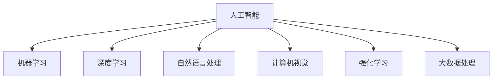

                 

# AI技术在不同场景中的应用

> 关键词：AI技术,智能应用,机器学习,深度学习,自然语言处理,NLP,计算机视觉,强化学习,大数据,AI伦理

## 1. 背景介绍

### 1.1 问题由来
随着人工智能(AI)技术的不断发展，AI技术正逐步渗透到各行各业中，其应用范围不断扩大。从自动驾驶到医疗诊断，从金融风险预测到智能客服，AI技术正在全方位地改变人类的生产和生活方式。然而，AI技术在不同场景中的具体应用方法和效果各异，因此，深入了解AI技术在不同场景中的应用，对于更好地推广和应用AI技术具有重要意义。

## 2. 核心概念与联系

### 2.1 核心概念概述

为更好地理解AI技术在不同场景中的应用，本节将介绍几个关键概念：

- 人工智能(AI)：使用计算机算法模拟人类智能行为的科学和技术，包括机器学习、深度学习、自然语言处理(NLP)、计算机视觉、强化学习、大数据处理等。

- 机器学习(ML)：通过算法和数据让计算机从经验中学习规律，实现预测、分类、聚类等任务。

- 深度学习(Deep Learning)：使用多层神经网络对数据进行分层抽象，实现图像识别、语音识别、自然语言理解等任务。

- 自然语言处理(NLP)：使计算机能够理解和生成人类语言，包括语言理解、情感分析、自动翻译、文本生成等任务。

- 计算机视觉(Computer Vision)：使计算机能够理解和分析图像、视频等视觉数据，包括目标检测、图像分割、人脸识别、行为识别等任务。

- 强化学习(Reinforcement Learning)：通过智能体与环境交互，实现决策和控制任务。

- 大数据处理(Big Data)：处理和分析海量数据，从中挖掘有价值的信息。

这些核心概念之间的逻辑关系可以通过以下Mermaid流程图来展示：



这个流程图展示了几大核心概念及其之间的关系：

1. 人工智能是这些技术的基础。
2. 机器学习和深度学习是主要的技术手段。
3. 自然语言处理、计算机视觉、强化学习和大数据处理是具体的应用领域。

## 3. 核心算法原理 & 具体操作步骤
### 3.1 算法原理概述

AI技术在不同场景中的应用，通常基于特定的算法和模型。以下是一些常见算法的原理概述：

- 监督学习：使用标注数据训练模型，通过预测和分类任务，实现对新数据的分类和预测。
- 无监督学习：使用未标注数据训练模型，发现数据中的内在结构，如聚类、降维等。
- 半监督学习：同时使用少量标注数据和大量未标注数据训练模型，实现更好的泛化效果。
- 迁移学习：将一个领域学到的知识迁移到另一个领域，以降低新领域的学习成本。
- 强化学习：通过智能体与环境的交互，通过奖励和惩罚机制，优化智能体的行为策略。
- 深度学习：使用多层神经网络进行数据表示学习，提取高层次特征，实现复杂的任务。
- 自然语言处理：通过词向量、语言模型等方法，使计算机能够理解和生成人类语言。
- 计算机视觉：通过卷积神经网络(CNN)等模型，实现对图像和视频的理解和分析。

### 3.2 算法步骤详解

下面以深度学习和自然语言处理为例，详细讲解AI技术在不同场景中的应用步骤：

**深度学习应用步骤**：

1. 数据预处理：清洗、归一化、分词、构建词向量等。
2. 构建模型：选择合适的网络结构，如卷积神经网络、循环神经网络、Transformer等。
3. 模型训练：使用标注数据训练模型，通过反向传播优化模型参数。
4. 模型评估：使用测试集评估模型性能，如准确率、召回率、F1-score等。
5. 模型应用：将训练好的模型应用于实际场景，进行预测、分类、聚类等任务。

**自然语言处理应用步骤**：

1. 数据预处理：清洗、分词、构建词汇表、词向量训练等。
2. 模型训练：使用标注数据训练语言模型，如LSTM、Transformer等。
3. 模型评估：使用测试集评估模型性能，如BLEU、ROUGE、CIDEr等。
4. 模型应用：将训练好的模型应用于实际场景，进行机器翻译、情感分析、文本生成等任务。

### 3.3 算法优缺点

AI技术在不同场景中的应用具有以下优点：

- 准确性高：基于大量的数据和先进的算法，AI技术在许多任务上达到了甚至超越人类的准确性。
- 可扩展性：AI技术可以适应各种不同的应用场景，具有高度的可扩展性。
- 效率高：AI技术可以快速处理大量数据，实现自动化的任务。

同时，也存在一些缺点：

- 高成本：AI技术的开发和部署需要大量的计算资源和时间，成本较高。
- 可解释性差：AI模型通常是"黑盒"系统，其内部机制难以解释。
- 数据依赖：AI技术依赖于高质量的数据，缺乏数据可能导致性能下降。
- 泛化能力不足：某些模型可能出现过拟合，对新数据的泛化能力较弱。
- 伦理问题：AI技术可能存在偏见和歧视，影响公正性。

### 3.4 算法应用领域

AI技术在不同领域中的应用非常广泛，以下是一些典型应用场景：

- 医疗：AI技术可以辅助医疗影像诊断、病理分析、药物研发等。
- 金融：AI技术可以用于信用评估、风险预测、投资决策等。
- 制造：AI技术可以实现智能生产、质量控制、设备维护等。
- 零售：AI技术可以用于库存管理、个性化推荐、客户分析等。
- 教育：AI技术可以用于在线教育、智能辅导、学习数据分析等。
- 交通：AI技术可以实现自动驾驶、交通流量预测、智能交通管理等。
- 农业：AI技术可以实现农作物监测、病虫害预测、智能灌溉等。

## 4. 数学模型和公式 & 详细讲解 & 举例说明
### 4.1 数学模型构建

AI技术在不同场景中的应用，通常需要构建数学模型。以下是一些常见的数学模型：

- 线性回归模型：用于预测连续变量，如房价预测。
- 逻辑回归模型：用于分类任务，如信用评估。
- 决策树模型：用于分类和回归任务，如客户细分。
- 支持向量机模型：用于分类和回归任务，如图像分类。
- 卷积神经网络模型：用于图像识别和分类任务，如人脸识别。
- 循环神经网络模型：用于序列数据处理，如文本生成。
- Transformer模型：用于序列数据处理，如机器翻译和语音识别。
- 强化学习模型：用于决策和控制任务，如智能体游戏。

### 4.2 公式推导过程

以线性回归模型为例，推导其在实际应用中的公式。

设有一个包含n个样本的数据集，每个样本包含m个特征值，目标变量为y。假设线性回归模型的公式为：

$$
y_i = \theta_0 + \theta_1 x_{i1} + \theta_2 x_{i2} + \cdots + \theta_m x_{im}
$$

其中，$y_i$表示第i个样本的目标变量，$\theta_0$为截距，$\theta_1$到$\theta_m$为特征系数。

根据最小二乘法，求解模型参数$\theta$：

$$
\min_{\theta} \sum_{i=1}^n (y_i - \theta_0 - \theta_1 x_{i1} - \theta_2 x_{i2} - \cdots - \theta_m x_{im})^2
$$

对$\theta$求导并令导数为0，可得：

$$
\hat{\theta} = (X^T X)^{-1} X^T y
$$

其中，$X = [1 x_{11} x_{12} \cdots x_{1m}]^T$，$y = [y_1 y_2 \cdots y_n]^T$。

### 4.3 案例分析与讲解

以自然语言处理中的情感分析为例，分析其应用场景和公式推导。

情感分析的目标是根据文本数据判断其情感倾向，如正面、负面或中性。假设训练集中每个样本的文本数据为$x_i$，对应的情感标签为$y_i$，公式为：

$$
y_i = f(x_i; \theta)
$$

其中，$\theta$为模型参数，$x_i$为输入的文本数据，$f$为情感分类函数。假设$f$为二分类逻辑回归模型，其公式为：

$$
\sigma(\theta^T \phi(x_i)) = \frac{1}{1 + e^{-\theta^T \phi(x_i)}}
$$

其中，$\sigma$为sigmoid函数，$\phi$为特征提取函数，如TF-IDF、word2vec等。

在实际应用中，首先对文本进行预处理，如分词、去除停用词等。然后计算每个单词的TF-IDF权重，构造特征向量$\phi(x_i)$。最后使用逻辑回归模型进行训练和预测，输出情感分类结果。

## 5. 项目实践：代码实例和详细解释说明
### 5.1 开发环境搭建

在进行AI技术应用开发前，需要搭建好开发环境。以下是一些常用开发环境的搭建步骤：

1. 安装Python：从官网下载并安装Python，建议安装最新版本。
2. 安装相关库：安装必要的Python库，如TensorFlow、PyTorch、Keras等。
3. 安装GPU驱动程序：如果要在GPU上运行，需要安装相应的GPU驱动程序。
4. 配置环境变量：配置好必要的路径和库变量，确保开发工具可以正常运行。
5. 创建虚拟环境：创建Python虚拟环境，以避免不同项目之间的库冲突。

### 5.2 源代码详细实现

以图像分类为例，使用TensorFlow实现卷积神经网络。

```python
import tensorflow as tf
from tensorflow.keras import layers

# 定义卷积神经网络模型
model = tf.keras.Sequential([
    layers.Conv2D(32, (3, 3), activation='relu', input_shape=(28, 28, 1)),
    layers.MaxPooling2D((2, 2)),
    layers.Conv2D(64, (3, 3), activation='relu'),
    layers.MaxPooling2D((2, 2)),
    layers.Conv2D(64, (3, 3), activation='relu'),
    layers.Flatten(),
    layers.Dense(64, activation='relu'),
    layers.Dense(10, activation='softmax')
])

# 加载数据集
(x_train, y_train), (x_test, y_test) = tf.keras.datasets.mnist.load_data()

# 数据预处理
x_train = x_train.reshape((60000, 28, 28, 1)) / 255.0
x_test = x_test.reshape((10000, 28, 28, 1)) / 255.0

# 训练模型
model.compile(optimizer='adam', loss='sparse_categorical_crossentropy', metrics=['accuracy'])
model.fit(x_train, y_train, epochs=5, batch_size=64)

# 评估模型
model.evaluate(x_test, y_test)
```

### 5.3 代码解读与分析

上述代码实现了基于卷积神经网络的图像分类模型，具体分析如下：

- 定义了包含3个卷积层、2个池化层和2个全连接层的卷积神经网络。
- 使用MNIST数据集进行训练和测试，输出10个数字类别的分类结果。
- 通过模型编译和fit方法进行训练，设定了优化器和损失函数。
- 使用模型评估方法evaluate评估模型性能。

## 6. 实际应用场景
### 6.1 医疗影像分析

AI技术在医疗影像分析中的应用非常广泛。通过深度学习模型，可以对医学影像进行自动诊断和分析，如CT影像中的肿瘤检测、X光影像中的骨骼分析等。

在实践中，可以使用卷积神经网络对医学影像进行训练和预测。首先收集大量的医学影像数据，并进行标注。然后使用卷积神经网络对影像数据进行特征提取和分类，输出诊断结果。在实际应用中，医生可以通过AI系统快速浏览影像，获取初步诊断结果，再结合临床经验进行综合判断。

### 6.2 金融风险预测

AI技术在金融领域可以用于风险预测、信用评估、投资决策等。通过机器学习和深度学习模型，可以分析历史金融数据，预测市场趋势和风险。

在实践中，可以使用线性回归、逻辑回归、支持向量机等模型对金融数据进行训练和预测。首先收集大量的金融数据，并进行预处理和特征工程。然后使用模型对数据进行训练，输出预测结果。在实际应用中，金融机构可以通过AI系统快速分析市场数据，进行风险评估和投资决策。

### 6.3 智能客服系统

AI技术在智能客服系统中的应用非常广泛。通过自然语言处理和深度学习模型，可以实现智能客服的自动化。

在实践中，可以使用LSTM、Transformer等模型对客服对话数据进行训练和预测。首先收集大量的客服对话数据，并进行标注和预处理。然后使用模型对对话数据进行训练，输出客服回复结果。在实际应用中，智能客服系统可以根据用户的问题，快速匹配最合适的回复，提升客户满意度。

### 6.4 自动驾驶

AI技术在自动驾驶中的应用非常广泛。通过计算机视觉和深度学习模型，可以实现对道路环境的自动感知和决策。

在实践中，可以使用卷积神经网络对道路图像进行训练和预测。首先收集大量的道路图像数据，并进行标注和预处理。然后使用模型对图像进行训练，输出驾驶决策结果。在实际应用中，自动驾驶系统可以根据感知到的道路环境，进行决策和控制，实现自主驾驶。

## 7. 工具和资源推荐
### 7.1 学习资源推荐

以下是一些推荐的学习资源：

- 《深度学习》（Ian Goodfellow等著）：深度学习领域的经典教材，详细介绍了深度学习的基本原理和应用。
- Coursera《机器学习》（Andrew Ng等）：斯坦福大学的机器学习课程，涵盖了机器学习的基本概念和算法。
- Kaggle：数据科学和机器学习竞赛平台，提供大量数据集和模型实现，适合实践学习。
- TensorFlow官方文档：TensorFlow的官方文档，提供了丰富的教程和示例代码。
- PyTorch官方文档：PyTorch的官方文档，提供了丰富的教程和示例代码。

### 7.2 开发工具推荐

以下是一些推荐的开发工具：

- Jupyter Notebook：基于Web的交互式开发环境，适合快速迭代和分享代码。
- GitHub：代码托管平台，方便团队协作和版本控制。
- Google Colab：谷歌提供的在线Jupyter Notebook环境，免费提供GPU/TPU算力。
- TensorBoard：TensorFlow配套的可视化工具，实时监测模型训练状态。
- Weights & Biases：模型训练的实验跟踪工具，记录和可视化模型训练过程中的各项指标。

### 7.3 相关论文推荐

以下是一些推荐的相关论文：

- ImageNet大规模视觉识别竞赛（ILSVRC）：大规模图像识别竞赛，推动了计算机视觉技术的发展。
- AlphaGo：DeepMind开发的围棋AI，使用深度强化学习技术，展示了AI在复杂游戏中的优势。
- GAN：生成对抗网络，用于生成高质量的图像和视频。
- Transformer：基于自注意力机制的神经网络，在自然语言处理领域取得了突破性进展。

## 8. 总结：未来发展趋势与挑战
### 8.1 总结

AI技术在不同场景中的应用，已经取得了显著的进展，并在各个领域带来了深远的影响。通过深入了解AI技术的应用原理和操作步骤，相信开发者可以更好地推广和应用AI技术，为社会带来更多的价值。

### 8.2 未来发展趋势

展望未来，AI技术将在以下领域迎来更多的应用：

- 医疗：AI技术将进一步应用于疾病诊断、病理分析、药物研发等，提升医疗服务水平。
- 金融：AI技术将应用于信用评估、风险预测、投资决策等，实现更加精准的金融分析。
- 制造：AI技术将应用于智能生产、质量控制、设备维护等，提升制造业的效率和质量。
- 零售：AI技术将应用于个性化推荐、客户分析等，提升零售行业的销售效率。
- 教育：AI技术将应用于智能辅导、学习数据分析等，提升教育效果和公平性。
- 交通：AI技术将应用于自动驾驶、交通流量预测、智能交通管理等，提升交通系统的效率和安全性。
- 农业：AI技术将应用于农作物监测、病虫害预测、智能灌溉等，提升农业生产效率。

### 8.3 面临的挑战

尽管AI技术的发展已经取得了显著进展，但在应用过程中仍然面临诸多挑战：

- 数据质量：高质量的数据是AI技术应用的基础，但数据收集和标注成本较高，难以全面覆盖各种场景。
- 模型鲁棒性：AI模型可能对数据噪声和异常值敏感，容易产生过拟合现象。
- 伦理问题：AI技术可能存在偏见和歧视，影响公正性。
- 可解释性：AI模型通常是"黑盒"系统，难以解释其内部机制和决策过程。
- 安全性：AI技术可能存在安全漏洞，影响系统的稳定性。

### 8.4 研究展望

未来，AI技术的研究需要从以下几个方面进行突破：

- 数据增强：通过数据增强技术，提高数据质量和多样性，提升模型的泛化能力。
- 模型鲁棒性：通过对抗训练和正则化技术，提高模型的鲁棒性和泛化能力。
- 可解释性：通过可解释性研究，增强模型的透明性和可信度。
- 伦理和公平性：通过伦理研究，确保AI技术的应用符合人类价值观和伦理道德。
- 安全性：通过安全研究，增强AI系统的可靠性和安全性。

## 9. 附录：常见问题与解答

**Q1：AI技术在实际应用中存在哪些挑战？**

A: AI技术在实际应用中面临以下挑战：

- 数据质量：高质量的数据是AI技术应用的基础，但数据收集和标注成本较高，难以全面覆盖各种场景。
- 模型鲁棒性：AI模型可能对数据噪声和异常值敏感，容易产生过拟合现象。
- 伦理问题：AI技术可能存在偏见和歧视，影响公正性。
- 可解释性：AI模型通常是"黑盒"系统，难以解释其内部机制和决策过程。
- 安全性：AI技术可能存在安全漏洞，影响系统的稳定性。

**Q2：如何提升AI技术的可解释性？**

A: 提升AI技术的可解释性可以从以下几个方面进行：

- 模型透明性：使用可解释的模型，如决策树、线性回归等，减少"黑盒"模型的使用。
- 可视化技术：使用可视化技术，如特征重要性图、注意力机制等，展示模型内部机制。
- 解释模型：使用解释模型，如LIME、SHAP等，通过局部模型预测，解释全局模型输出。
- 符号推理：通过符号推理，建立规则和约束，引导模型决策过程。

**Q3：如何提高AI模型的鲁棒性？**

A: 提高AI模型的鲁棒性可以从以下几个方面进行：

- 数据增强：通过数据增强技术，提高数据质量和多样性，提升模型的泛化能力。
- 对抗训练：通过对抗训练，学习鲁棒性更强的特征表示。
- 正则化：通过L2正则、Dropout等正则化技术，抑制过拟合现象。
- 集成学习：通过集成多个模型，提高模型的鲁棒性和泛化能力。

**Q4：如何在实际应用中确保AI系统的安全性？**

A: 确保AI系统的安全性可以从以下几个方面进行：

- 数据安全：保护数据的隐私和完整性，防止数据泄露和篡改。
- 模型鲁棒性：提高模型的鲁棒性，防止模型受到攻击和篡改。
- 安全性测试：通过安全性测试，发现和修复系统的漏洞。
- 安全机制：建立安全机制，防止恶意攻击和篡改。

**Q5：AI技术在实际应用中如何平衡性能和成本？**

A: 平衡AI技术的性能和成本可以从以下几个方面进行：

- 模型裁剪：通过模型裁剪技术，减少模型规模，提高推理速度。
- 模型量化：通过模型量化技术，减少存储空间和计算资源消耗。
- 数据压缩：通过数据压缩技术，减少数据存储和传输成本。
- 云资源优化：通过云资源优化，实现资源动态调整，平衡性能和成本。

总之，AI技术在实际应用中面临着诸多挑战，需要通过技术创新和综合措施，解决实际问题，实现最优应用效果。

---

作者：禅与计算机程序设计艺术 / Zen and the Art of Computer Programming

