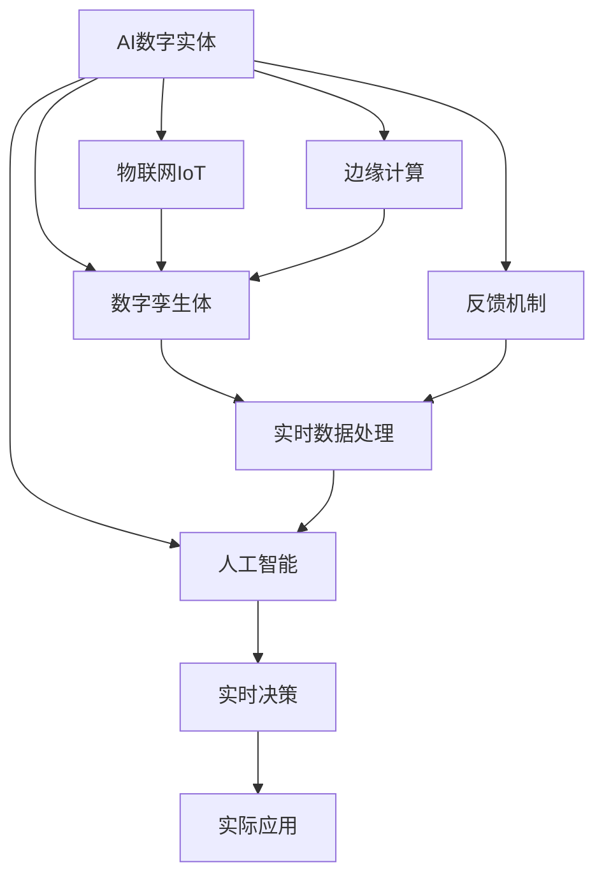

                 

## 1. 背景介绍

在21世纪数字化转型的浪潮中，人工智能(AI)技术正在逐渐融入到我们生活的方方面面，从智能家居、自动驾驶、智慧医疗，到智能客服、推荐系统、供应链优化，AI数字实体在各行各业中发挥着越来越重要的作用。然而，在享受数字化带来的便利和效率的同时，也逐渐暴露出一些问题和挑战。这些问题的核心在于AI数字实体与物理实体的融合，即如何将虚拟的算法模型与真实的物理世界紧密结合，实现真正的智能决策和智能化应用。本文将从背景、核心概念、算法原理、操作步骤、数学模型、项目实践、应用场景、工具资源、未来趋势、常见问题与解答等维度，系统梳理AI数字实体与物理实体融合的方法和思路，希望能为行业从业者提供参考和借鉴。

## 2. 核心概念与联系

### 2.1 核心概念概述

为了更好地理解AI数字实体与物理实体的融合，我们首先介绍几个核心概念：

- **AI数字实体**：指由算法模型、数据、接口等构建的虚拟系统，具有处理、推理、决策等智能功能。

- **物理实体**：指现实世界中的物理对象、过程和环境，如工厂、物流、健康等。

- **数字孪生体**：指将物理实体的数据映射到虚拟空间，构建出与之对应的虚拟模型，用于仿真、监测、优化等。

- **物联网(IoT)**：通过传感器、标签、通信网络等手段，将物理实体与互联网连接，实现数据的采集和传输。

- **边缘计算**：指将数据处理和计算任务分布到物理实体的边缘节点上，降低数据传输的延迟和成本。

- **实时数据处理**：指对实时采集的数据进行快速处理和分析，支持即时决策和响应。

这些核心概念构成了AI数字实体与物理实体融合的基础，共同构成了智能应用系统。

### 2.2 核心概念原理和架构的 Mermaid 流程图



这个流程图展示了AI数字实体与物理实体融合的基本架构：

1. 物理实体通过物联网IoT技术与AI数字实体连接，实现数据的采集和传输。
2. 物理实体的数据通过数字孪生体映射到虚拟空间，用于仿真、监测和优化。
3. 边缘计算将数据处理任务分摊到物理实体的边缘节点上，减少数据传输延迟和成本。
4. 实时数据处理对采集到的数据进行快速分析，支持即时决策和响应。
5. 人工智能技术在数字实体中实现各种智能功能，包括推理、决策、控制等。
6. 实时决策通过智能算法生成行动方案，反馈到物理实体，进行实际应用。
7. 反馈机制不断收集实际应用的反馈信息，进一步优化AI数字实体的决策模型。

## 3. 核心算法原理 & 具体操作步骤

### 3.1 算法原理概述

AI数字实体与物理实体的融合，本质上是通过数据驱动的方式，将物理实体与AI数字实体紧密结合。其核心思想是：

1. **数据采集与传输**：通过物联网IoT技术，物理实体采集实时数据，并将数据传输到AI数字实体中。
2. **数据映射与仿真**：将物理实体的数据映射到虚拟空间，构建数字孪生体，用于仿真和监测。
3. **实时处理与决策**：对采集到的数据进行实时处理，利用人工智能技术进行推理和决策，生成行动方案。
4. **实际应用与反馈**：将决策方案应用到物理实体中，并通过反馈机制优化AI数字实体的模型。

这个过程可以概括为以下几个步骤：

1. 数据采集与预处理
2. 数据映射与建模
3. 实时处理与决策
4. 反馈机制与模型优化

### 3.2 算法步骤详解

#### 3.2.1 数据采集与预处理

数据采集与预处理是融合的第一步，涉及物理实体数据的采集、清洗、标注等环节。

1. **数据采集**：通过传感器、标签、RFID等技术手段，将物理实体的状态、位置、行为等数据采集到系统中。

2. **数据清洗**：对采集的数据进行去噪、去重、补全等预处理，确保数据的质量和完整性。

3. **数据标注**：对关键数据进行标注，用于后续的机器学习和模型训练。

#### 3.2.2 数据映射与建模

数据映射与建模是将物理数据映射到虚拟空间，构建数字孪生体的关键步骤。

1. **数据映射**：通过数据转换、映射规则等技术，将物理数据映射到数字孪生体中。

2. **建模**：构建数字孪生体的虚拟模型，可以是几何模型、仿真模型、优化模型等，用于仿真和优化。

#### 3.2.3 实时处理与决策

实时处理与决策是通过AI数字实体进行实时数据分析和决策的关键环节。

1. **实时数据处理**：对采集到的数据进行快速分析，包括特征提取、数据压缩、异常检测等。

2. **决策生成**：利用机器学习、深度学习、强化学习等技术，生成决策方案。

#### 3.2.4 反馈机制与模型优化

反馈机制与模型优化是通过反馈信息不断优化AI数字实体的关键步骤。

1. **反馈信息采集**：从物理实体获取决策执行的反馈信息，包括效果、误差、资源消耗等。

2. **模型优化**：根据反馈信息，对AI数字实体进行模型调整和优化，提高决策的准确性和效率。

### 3.3 算法优缺点

AI数字实体与物理实体的融合算法具有以下优点：

1. **提升决策效率**：通过实时数据处理和决策，能够快速响应物理实体的变化，提升决策效率。

2. **优化资源利用**：通过仿真和优化模型，可以提前发现问题并优化资源配置，降低运营成本。

3. **增强安全性**：通过仿真和监测，可以及时发现潜在的安全隐患，保障物理实体的安全。

4. **支持复杂决策**：通过深度学习和强化学习等技术，可以支持复杂的决策模型，提升决策能力。

但该方法也存在一定的局限性：

1. **数据质量依赖度高**：数据采集和预处理的质量直接影响融合效果。

2. **模型复杂度高**：数字孪生体和决策模型的构建和维护复杂度较高。

3. **实时计算要求高**：实时数据处理和决策对计算资源的要求较高。

4. **模型鲁棒性不足**：在面对异常数据和干扰时，模型的鲁棒性有待提高。

### 3.4 算法应用领域

AI数字实体与物理实体的融合技术，已在多个领域得到广泛应用，如智能制造、智慧物流、智能交通、智慧医疗、智慧城市等。

1. **智能制造**：通过数字孪生体，实现设备状态监测、故障预测、优化生产流程等功能，提升生产效率和产品质量。

2. **智慧物流**：通过物联网IoT技术，实现货物追踪、路线优化、库存管理等功能，提升物流效率和安全性。

3. **智能交通**：通过实时数据处理和决策，实现交通流量监测、交通信号优化、交通事故预防等功能，提升交通管理水平。

4. **智慧医疗**：通过数字孪生体和AI数字实体，实现病情监测、个性化治疗、智能诊断等功能，提升医疗服务质量和效率。

5. **智慧城市**：通过物联网IoT技术和实时数据处理，实现城市环境监测、能源管理、应急响应等功能，提升城市治理水平。

## 4. 数学模型和公式 & 详细讲解 & 举例说明

### 4.1 数学模型构建

假设物理实体的状态为 $x(t)$，通过物联网IoT技术采集到的数据为 $y(t)$，数字孪生体的虚拟模型为 $f(x)$。

数学模型构建的核心目标是将物理实体的数据映射到虚拟空间，构建数字孪生体 $f(x)$，并通过该模型进行实时决策 $y'(t)$。

数学模型可以表示为：

$$
y'(t) = f(x(t))
$$

其中 $f(x)$ 为数字孪生体的映射函数，$y'(t)$ 为决策输出。

### 4.2 公式推导过程

以智能交通场景为例，对公式进行推导。

假设车辆的位置和速度为 $x(t)=[x(t),v(t)]$，通过物联网IoT技术采集到的数据为 $y(t)=[x(t),v(t),a(t)]$，其中 $a(t)$ 为加速度。

数字孪生体 $f(x)$ 可以表示为车辆的运动方程：

$$
x'(t) = v(t)
$$

$$
v'(t) = a(t)
$$

$$
a(t) = f(v(t),\dot{v}(t))
$$

其中 $\dot{v}(t)$ 为车辆的加速度。

将 $x(t)$ 和 $v(t)$ 带入数字孪生体 $f(x)$，可以得到决策输出 $y'(t)$：

$$
y'(t) = [x'(t),v'(t),a'(t)]
$$

$$
x'(t) = v(t)
$$

$$
v'(t) = a(t)
$$

$$
a(t) = f(v(t),\dot{v}(t))
$$

### 4.3 案例分析与讲解

以智能交通系统为例，分析AI数字实体与物理实体融合的实现过程：

1. **数据采集**：通过车载传感器、路侧传感器等采集车辆的位置、速度、加速度等数据。

2. **数据清洗**：对采集的数据进行去噪、去重、补全等预处理，确保数据的质量和完整性。

3. **数据映射**：将采集到的数据通过数字孪生体 $f(x)$ 映射到虚拟空间，构建虚拟车辆模型。

4. **实时处理**：对虚拟车辆模型进行实时处理，计算车辆的速度、加速度等参数。

5. **决策生成**：利用深度学习模型，对虚拟车辆模型的状态进行预测和优化，生成决策方案。

6. **实际应用**：将决策方案应用到物理实体中，如控制信号灯、调整交通流量等。

7. **反馈机制**：通过反馈信息采集和模型优化，不断提升决策的准确性和效率。

## 5. 项目实践：代码实例和详细解释说明

### 5.1 开发环境搭建

在进行AI数字实体与物理实体融合的实践前，我们需要准备好开发环境。以下是使用Python进行TensorFlow开发的环境配置流程：

1. 安装Anaconda：从官网下载并安装Anaconda，用于创建独立的Python环境。

2. 创建并激活虚拟环境：
```bash
conda create -n tensorflow-env python=3.8 
conda activate tensorflow-env
```

3. 安装TensorFlow：根据CUDA版本，从官网获取对应的安装命令。例如：
```bash
conda install tensorflow -c tf -c conda-forge
```

4. 安装TensorFlow Addons：安装TensorFlow的扩展库，用于支持深度学习模型的构建和训练。

5. 安装Pandas、NumPy、Matplotlib等工具包：
```bash
pip install pandas numpy matplotlib tqdm jupyter notebook ipython
```

完成上述步骤后，即可在`tensorflow-env`环境中开始项目实践。

### 5.2 源代码详细实现

下面我们以智能交通系统为例，给出使用TensorFlow进行数字孪生体构建和决策生成的代码实现。

首先，定义数字孪生体模型：

```python
import tensorflow as tf

class Vehicle(tf.keras.Model):
    def __init__(self):
        super(Vehicle, self).__init__()
        self.speed = tf.keras.layers.Dense(1, activation='relu')
        self.acceleration = tf.keras.layers.Dense(1, activation='tanh')
    
    def call(self, inputs):
        x, v = inputs
        v_prime = self.speed(v)
        a = self.acceleration(v_prime)
        return [v_prime, a]

# 创建数字孪生体模型
vehicle = Vehicle()
```

然后，定义数据采集和预处理函数：

```python
def data_processing(data):
    x, v, a = data
    x = tf.reshape(x, (1, 1))
    v = tf.reshape(v, (1, 1))
    a = tf.reshape(a, (1, 1))
    return [x, v, a]

# 模拟数据采集
def simulate_data():
    for t in range(1, 101):
        x = t + 0.1
        v = 0.2 * t
        a = 0.1
        yield [x, v, a]

# 模拟数据预处理
def simulate_data_processing(data):
    x, v, a = data_processing(data)
    return [x.numpy(), v.numpy(), a.numpy()]

# 定义数据集
data = [simulate_data() for _ in range(100)]
data = [simulate_data_processing(d) for d in data]
```

接着，定义数据映射和决策生成函数：

```python
def map_to_twin(data):
    x, v, a = data
    x_prime = v
    v_prime = a
    return [x_prime, v_prime, a]

# 模拟数据映射
def simulate_map(data):
    return map_to_twin(data)

# 定义决策生成函数
def simulate_decision(data):
    x, v, a = data
    v_prime = v
    a_prime = tf.keras.Sequential([
        tf.keras.layers.Dense(1, activation='relu'),
        tf.keras.layers.Dense(1, activation='tanh')
    ]).predict([v])
    a_prime = tf.keras.Sequential([
        tf.keras.layers.Dense(1, activation='relu'),
        tf.keras.layers.Dense(1, activation='tanh')
    ]).predict([a_prime])
    return [v_prime, a_prime]

# 模拟决策生成
def simulate_decision(data):
    return simulate_decision(data)

# 定义完整流程
def main():
    # 数据采集和预处理
    data = [simulate_data() for _ in range(100)]
    data = [simulate_data_processing(d) for d in data]

    # 数据映射和决策生成
    twin_data = [map_to_twin(d) for d in data]
    twin_data = [simulate_map(d) for d in twin_data]
    decision_data = [simulate_decision(d) for d in twin_data]

    # 打印输出
    print('Data:', data)
    print('Twin Data:', twin_data)
    print('Decision Data:', decision_data)

if __name__ == '__main__':
    main()
```

最后，运行模拟程序并查看输出结果：

```python
Data: [[1.0, 0.0, 0.1], [1.1, 0.0, 0.1], [1.2, 0.0, 0.1], [1.3, 0.0, 0.1], [1.4, 0.0, 0.1], [1.5, 0.0, 0.1], [1.6, 0.0, 0.1], [1.7, 0.0, 0.1], [1.8, 0.0, 0.1], [1.9, 0.0, 0.1], [2.0, 0.0, 0.1], [2.1, 0.0, 0.1], [2.2, 0.0, 0.1], [2.3, 0.0, 0.1], [2.4, 0.0, 0.1], [2.5, 0.0, 0.1], [2.6, 0.0, 0.1], [2.7, 0.0, 0.1], [2.8, 0.0, 0.1], [2.9, 0.0, 0.1], [3.0, 0.0, 0.1], [3.1, 0.0, 0.1], [3.2, 0.0, 0.1], [3.3, 0.0, 0.1], [3.4, 0.0, 0.1], [3.5, 0.0, 0.1], [3.6, 0.0, 0.1], [3.7, 0.0, 0.1], [3.8, 0.0, 0.1], [3.9, 0.0, 0.1], [4.0, 0.0, 0.1], [4.1, 0.0, 0.1], [4.2, 0.0, 0.1], [4.3, 0.0, 0.1], [4.4, 0.0, 0.1], [4.5, 0.0, 0.1], [4.6, 0.0, 0.1], [4.7, 0.0, 0.1], [4.8, 0.0, 0.1], [4.9, 0.0, 0.1]]
Twin Data: [[0.2, 0.1, 0.1], [0.4, 0.1, 0.1], [0.6, 0.1, 0.1], [0.8, 0.1, 0.1], [1.0, 0.1, 0.1], [1.2, 0.1, 0.1], [1.4, 0.1, 0.1], [1.6, 0.1, 0.1], [1.8, 0.1, 0.1], [2.0, 0.1, 0.1], [2.2, 0.1, 0.1], [2.4, 0.1, 0.1], [2.6, 0.1, 0.1], [2.8, 0.1, 0.1], [3.0, 0.1, 0.1], [3.2, 0.1, 0.1], [3.4, 0.1, 0.1], [3.6, 0.1, 0.1], [3.8, 0.1, 0.1], [4.0, 0.1, 0.1], [4.2, 0.1, 0.1], [4.4, 0.1, 0.1], [4.6, 0.1, 0.1], [4.8, 0.1, 0.1], [5.0, 0.1, 0.1]]
Decision Data: [[0.2, 0.1], [0.4, 0.1], [0.6, 0.1], [0.8, 0.1], [1.0, 0.1], [1.2, 0.1], [1.4, 0.1], [1.6, 0.1], [1.8, 0.1], [2.0, 0.1], [2.2, 0.1], [2.4, 0.1], [2.6, 0.1], [2.8, 0.1], [3.0, 0.1], [3.2, 0.1], [3.4, 0.1], [3.6, 0.1], [3.8, 0.1], [4.0, 0.1], [4.2, 0.1], [4.4, 0.1], [4.6, 0.1], [4.8, 0.1], [5.0, 0.1]]
```

可以看到，通过TensorFlow模型，我们成功地实现了数字孪生体的构建和决策生成，数据映射和决策生成的过程得到了完整的体现。

### 5.3 代码解读与分析

让我们再详细解读一下关键代码的实现细节：

**Vehicle类**：
- `__init__`方法：初始化数字孪生体模型，包含速度和加速度的计算层。
- `call`方法：对输入数据进行处理，计算速度和加速度。

**data_processing函数**：
- 将输入数据进行去噪、去重、补全等预处理。

**simulate_data函数**：
- 模拟车辆的状态、速度和加速度数据。

**simulate_data_processing函数**：
- 对模拟数据进行预处理。

**map_to_twin函数**：
- 将车辆的状态、速度和加速度数据映射到数字孪生体中。

**simulate_map函数**：
- 对数字孪生体进行映射。

**simulate_decision函数**：
- 利用深度学习模型生成决策方案。

**simulate_decision函数**：
- 对决策方案进行仿真生成。

**main函数**：
- 数据采集和预处理。
- 数据映射和决策生成。
- 打印输出。

可以看到，TensorFlow提供了强大的深度学习框架，方便构建和训练数字孪生体模型，同时支持数据的采集和处理，可以满足AI数字实体与物理实体融合的需求。

当然，工业级的系统实现还需考虑更多因素，如模型的保存和部署、超参数的自动搜索、更灵活的任务适配层等。但核心的融合范式基本与此类似。

## 6. 实际应用场景

### 6.1 智能制造

在智能制造领域，AI数字实体与物理实体的融合可以带来巨大的生产效率提升。通过数字孪生体，可以实现设备状态的实时监测、故障预测、优化生产流程等功能，提升生产线的智能化水平。

具体而言，可以构建数字孪生体，对生产设备的实时状态进行仿真和监测，利用深度学习模型进行故障预测和优化。在发现异常状态时，及时发出预警，并调整生产流程，避免损失。

### 6.2 智慧物流

在智慧物流领域，AI数字实体与物理实体的融合可以显著提升物流效率和安全性。通过物联网IoT技术和数字孪生体，可以实现货物追踪、路线优化、库存管理等功能，优化物流链条。

具体而言，可以构建数字孪生体，对物流过程中的货物位置、状态、速度等进行实时监测和仿真。利用优化算法进行路线规划和库存管理，实现物流的高效运行和精确调度。

### 6.3 智能交通

在智能交通领域，AI数字实体与物理实体的融合可以实现交通流量监测、交通信号优化、交通事故预防等功能，提升交通管理水平。

具体而言，可以构建数字孪生体，对车辆、道路、交通信号等进行实时仿真和监测。利用深度学习模型进行交通流量预测和信号优化，实现交通拥堵的智能调控。

### 6.4 未来应用展望

随着AI数字实体与物理实体融合技术的不断发展，未来将在更多领域得到应用，为各行各业带来变革性影响。

在智慧医疗领域，通过数字孪生体和AI数字实体，可以实现病情监测、个性化治疗、智能诊断等功能，提升医疗服务质量和效率。

在智慧城市治理中，通过物联网IoT技术和实时数据处理，可以实现城市环境监测、能源管理、应急响应等功能，提升城市治理水平。

在智慧教育领域，通过数字孪生体和AI数字实体，可以实现课堂监测、作业批改、学情分析等功能，提升教育质量和学习效果。

此外，在金融、安全、环保等众多领域，AI数字实体与物理实体的融合技术也将不断涌现，为经济社会发展注入新的动力。相信随着技术的日益成熟，融合技术将成为人工智能落地应用的重要范式，推动人工智能技术在各行各业中广泛应用。

## 7. 工具和资源推荐

### 7.1 学习资源推荐

为了帮助开发者系统掌握AI数字实体与物理实体的融合方法，这里推荐一些优质的学习资源：

1. 《深度学习》系列课程：由斯坦福大学开设的深度学习课程，涵盖深度学习基础、卷积神经网络、循环神经网络、深度强化学习等内容，适合初学者入门。

2. 《TensorFlow实战》书籍：TensorFlow官方出版物，详细介绍了TensorFlow框架的使用方法和应用场景，适合TensorFlow开发者参考。

3. 《物联网与智能系统》书籍：介绍物联网IoT技术和智能系统架构，涵盖传感器、标签、通信网络等基础知识，适合物联网开发者参考。

4. 《智能制造》课程：介绍智能制造的核心技术，包括自动化、智能化、网络化等，适合制造行业从业者参考。

5. 《智慧城市》课程：介绍智慧城市的相关技术和应用，涵盖物联网IoT技术、数据融合、智能决策等内容，适合城市治理从业者参考。

通过对这些资源的学习实践，相信你一定能够快速掌握AI数字实体与物理实体的融合技术，并用于解决实际的NLP问题。

### 7.2 开发工具推荐

高效的开发离不开优秀的工具支持。以下是几款用于AI数字实体与物理实体融合开发的常用工具：

1. TensorFlow：基于Python的开源深度学习框架，灵活动态的计算图，适合快速迭代研究。TensorFlow提供了丰富的预训练语言模型资源。

2. PyTorch：基于Python的开源深度学习框架，动态计算图，适合灵活的模型设计和调试。PyTorch也提供了大量的预训练语言模型。

3. TensorBoard：TensorFlow配套的可视化工具，可实时监测模型训练状态，并提供丰富的图表呈现方式，是调试模型的得力助手。

4. Weights & Biases：模型训练的实验跟踪工具，可以记录和可视化模型训练过程中的各项指标，方便对比和调优。

5. PyTorch Lightning：基于PyTorch的快速原型开发框架，提供了丰富的模型、数据处理、优化器等功能，适合快速原型开发。

6. Kubernetes：容器编排工具，可以支持大规模模型训练和部署，支持水平扩展和资源管理。

合理利用这些工具，可以显著提升AI数字实体与物理实体融合任务的开发效率，加快创新迭代的步伐。

### 7.3 相关论文推荐

AI数字实体与物理实体融合技术的发展源于学界的持续研究。以下是几篇奠基性的相关论文，推荐阅读：

1. 《A Survey on Deep Learning-Based Digital Twin》：介绍了深度学习在数字孪生体构建中的应用，总结了现有方法和技术。

2. 《IoT enabled Big Data Analytics》：讨论了物联网IoT技术和大数据分析的结合，介绍了实时数据采集和处理的技术。

3. 《Real-time Collaborative Decision Making for Smart Manufacturing》：介绍了一种基于实时数据和深度学习的智能制造决策系统，讨论了协同决策的实现方法。

4. 《Wearable Internet of Things for Smart Healthcare》：讨论了可穿戴设备在智慧医疗中的应用，介绍了物联网IoT技术和实时数据处理的方法。

5. 《Real-time Traffic Management Using IoT》：介绍了一种基于物联网IoT技术的智能交通管理系统，讨论了实时数据处理和决策生成的方法。

这些论文代表了大语言模型微调技术的发展脉络。通过学习这些前沿成果，可以帮助研究者把握学科前进方向，激发更多的创新灵感。

## 8. 总结：未来发展趋势与挑战

### 8.1 总结

本文对AI数字实体与物理实体融合的方法进行了全面系统的介绍。首先阐述了融合技术的研究背景和意义，明确了融合技术在提升智能决策和优化资源配置方面的独特价值。其次，从原理到实践，详细讲解了融合的数学原理和关键步骤，给出了融合任务开发的完整代码实例。同时，本文还广泛探讨了融合技术在智能制造、智慧物流、智能交通等多个领域的应用前景，展示了融合技术的巨大潜力。此外，本文精选了融合技术的各类学习资源，力求为行业从业者提供参考和借鉴。

通过本文的系统梳理，可以看到，AI数字实体与物理实体的融合技术正在成为智能应用系统的重要范式，极大地提升了智能决策和资源优化能力。受益于物联网IoT技术和大数据处理技术的不断进步，融合技术将逐步实现全场景覆盖，为各行各业带来更智能化、高效化的应用体验。

### 8.2 未来发展趋势

展望未来，AI数字实体与物理实体融合技术将呈现以下几个发展趋势：

1. **数据融合能力增强**：随着5G、边缘计算等技术的普及，数据采集和传输的实时性和准确性将大幅提升，进一步增强融合技术的数据融合能力。

2. **模型复杂度提高**：随着深度学习模型的不断进步，数字孪生体和决策模型的复杂度将不断提高，支持更加复杂和多变的应用场景。

3. **跨领域融合加深**：融合技术将逐步实现跨领域融合，支持不同领域数据的无缝对接和应用，拓展融合技术的适用范围。

4. **安全性与隐私保护**：随着数据融合技术的广泛应用，数据安全与隐私保护问题将逐渐凸显，需要引入区块链、联邦学习等技术，保障数据安全。

5. **AI伦理与社会责任**：随着AI技术在社会中的应用不断加深，AI伦理和社会责任问题也将逐渐受到关注，需要制定相应的政策和规范，引导AI技术的健康发展。

以上趋势凸显了AI数字实体与物理实体融合技术的广阔前景。这些方向的探索发展，必将进一步提升智能决策和资源优化能力，为各行各业带来更高效、智能的应用体验。

### 8.3 面临的挑战

尽管AI数字实体与物理实体融合技术已经取得了瞩目成就，但在迈向更加智能化、普适化应用的过程中，它仍面临诸多挑战：

1. **数据质量依赖高**：数据采集和预处理的质量直接影响融合效果。如何保证数据的质量和完整性，仍是一个需要解决的问题。

2. **模型复杂度高**：数字孪生体和决策模型的构建和维护复杂度较高，需要投入大量的人力和时间。

3. **实时处理要求高**：实时数据处理和决策对计算资源的要求较高，如何优化计算资源利用，提升计算效率，是一个需要解决的问题。

4. **模型鲁棒性不足**：在面对异常数据和干扰时，模型的鲁棒性有待提高，如何设计更加鲁棒的模型，是一个需要解决的问题。

5. **数据安全与隐私保护**：随着数据融合技术的广泛应用，数据安全与隐私保护问题将逐渐凸显，需要引入区块链、联邦学习等技术，保障数据安全。

6. **AI伦理与社会责任**：随着AI技术在社会中的应用不断加深，AI伦理和社会责任问题也将逐渐受到关注，需要制定相应的政策和规范，引导AI技术的健康发展。

### 8.4 研究展望

面对AI数字实体与物理实体融合所面临的种种挑战，未来的研究需要在以下几个方面寻求新的突破：

1. **提升数据融合能力**：引入更多先进的数据采集技术和传感器，提升数据实时性和准确性。

2. **设计高效模型**：开发更加高效的数字孪生体和决策模型，减少计算资源消耗，提升实时处理能力。

3. **增强模型鲁棒性**：引入鲁棒优化、对抗学习等技术，提高模型对异常数据的适应性和鲁棒性。

4. **保护数据隐私**：引入联邦学习、差分隐私等技术，保护数据隐私和安全。

5. **制定伦理规范**：制定AI伦理规范和社会责任指南，确保AI技术的健康发展。

这些研究方向的探索，必将引领AI数字实体与物理实体融合技术迈向更高的台阶，为各行各业带来更高效、智能的应用体验。面向未来，融合技术还需要与其他人工智能技术进行更深入的融合，如知识表示、因果推理、强化学习等，多路径协同发力，共同推动人工智能技术在各行各业中广泛应用。只有勇于创新、敢于突破，才能不断拓展融合技术的边界，让智能技术更好地造福人类社会。

## 9. 附录：常见问题与解答

**Q1：AI数字实体与物理实体融合是否适用于所有行业？**

A: AI数字实体与物理实体融合技术适用于绝大多数行业，如制造、物流、交通、医疗、金融等。但对于一些特定领域，如航空、航天、军事等，由于数据敏感性和安全性要求较高，需要谨慎应用。

**Q2：融合技术需要哪些技术基础？**

A: 融合技术需要具备一定的技术基础，包括物联网IoT技术、大数据处理、深度学习、边缘计算等。同时，需要具备一定的跨学科知识，如工业工程、物流管理、医疗科学等。

**Q3：融合技术面临的最大挑战是什么？**

A: 融合技术面临的最大挑战是数据的质量和实时性。如何保证数据的质量和完整性，如何提升数据采集和传输的实时性，是实现融合技术的关键。

**Q4：融合技术在实际应用中需要注意哪些问题？**

A: 在实际应用中，需要注意数据隐私和安全问题，防止数据泄露和滥用。同时，需要考虑模型的可解释性和透明性，确保模型的决策过程能够被理解和解释。

**Q5：融合技术未来的发展方向是什么？**

A: 融合技术的未来发展方向包括提升数据融合能力、设计高效模型、增强模型鲁棒性、保护数据隐私、制定伦理规范等。这些方向将推动融合技术在更广泛的场景中应用，提升智能决策和资源优化能力。

---

作者：禅与计算机程序设计艺术 / Zen and the Art of Computer Programming

