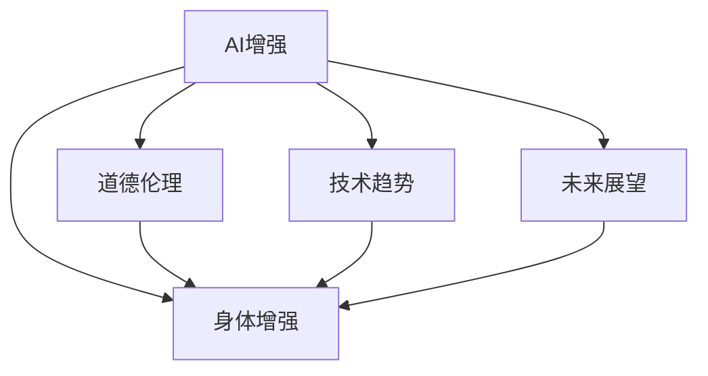

                 

# AI时代的人类增强：道德考虑与身体增强技术的未来趋势预测

> 关键词：AI增强, 身体增强, 道德伦理, 技术趋势, 未来展望

## 1. 背景介绍

### 1.1 问题由来
随着人工智能(AI)技术的迅猛发展，人类增强技术在医疗、体育、教育等领域的应用前景越来越广阔。借助AI技术，人们能够更高效地提升自身能力，提高生活质量。然而，这一过程伴随着深刻的伦理、安全、隐私等道德问题，引发了社会广泛关注。

近年来，各类身体增强技术层出不穷，如基因编辑技术(CRISPR)、脑机接口技术(BMI)、智能假肢等。这些技术在理论上可以大幅提升人类体力、智力、认知能力，但也可能引发伦理争议和潜在风险。如何平衡技术创新与道德规范，确保技术在提升人类福祉的同时不损害个体权利和社会公平，成为研究者和政策制定者亟需面对的问题。

### 1.2 问题核心关键点
人类增强技术主要包括以下几个方面：

- **基因编辑技术**：通过修改基因来增强身体功能，如视觉、听觉、免疫力等。
- **脑机接口技术**：通过连接大脑和计算机，实现对大脑信号的读取和控制。
- **智能假肢**：通过AI技术驱动假肢，提供更高精度和自然性的运动控制。
- **增强现实和虚拟现实技术**：通过AR/VR设备，拓展人类的感官和认知能力。

这些技术的核心关键点在于：
1. 技术本身的安全性和有效性：能否达到预期的增强效果，是否存在潜在风险。
2. 伦理和隐私问题：涉及人体尊严、自主权、隐私保护等伦理困境。
3. 社会公平性：技术带来的福祉是否普惠于所有社会成员，避免技术鸿沟。

## 2. 核心概念与联系

### 2.1 核心概念概述

为更好地理解人类增强技术及其道德考量的核心概念，本节将介绍几个密切相关的核心概念：

- **AI增强**：指利用人工智能技术增强人类能力，包括体力、智力、认知能力等。
- **身体增强**：指通过基因编辑、脑机接口等技术，直接增强人类生理功能。
- **道德伦理**：指人类增强技术应遵守的伦理规范，包括尊重个体权利、公平公正、隐私保护等。
- **技术趋势**：指人类增强技术发展的最新动向和未来预测。
- **未来展望**：指人类增强技术的未来发展方向和潜在影响。

这些核心概念之间的逻辑关系可以通过以下Mermaid流程图来展示：



这个流程图展示了大语言模型的核心概念及其之间的关系：

1. AI增强作为主要驱动力，通过身体增强技术提升人类能力。
2. 道德伦理是AI增强技术应用的必要条件，确保技术公正、透明、可控。
3. 技术趋势反映了AI增强技术的发展动态，指引未来研究方向。
4. 未来展望基于现有技术基础和伦理考量，对人类增强技术的未来进行预测和规划。

这些概念共同构成了人类增强技术的研究框架，使其能够在各个应用场景下发挥强大潜力。通过理解这些核心概念，我们可以更好地把握技术的前进方向和道德底线。

## 3. 核心算法原理 & 具体操作步骤
### 3.1 算法原理概述

人类增强技术中的AI增强部分，通常涉及机器学习、深度学习等算法原理。AI系统通过大量数据学习规律，提升对任务的预测和决策能力。

具体而言，AI增强的算法原理包括：
1. **数据获取与处理**：收集相关领域的大量数据，进行清洗、标注和预处理。
2. **模型训练**：通过深度学习模型，如神经网络、决策树等，训练模型参数，使其具备预测和决策能力。
3. **模型评估与优化**：使用测试数据评估模型性能，根据评估结果调整模型参数，优化模型效果。
4. **模型部署**：将训练好的模型部署到实际应用中，进行预测和决策。

### 3.2 算法步骤详解

以AI增强技术在医疗诊断中的应用为例，算法步骤详细如下：

**Step 1: 数据收集与预处理**
- 收集医学影像、病历记录、基因数据等，作为模型的训练数据。
- 对数据进行清洗、去噪和标注，确保数据的质量和一致性。

**Step 2: 模型选择与训练**
- 选择适合的深度学习模型，如卷积神经网络(CNN)、循环神经网络(RNN)、生成对抗网络(GAN)等。
- 使用训练数据对模型进行训练，调整超参数和优化器，最小化损失函数。

**Step 3: 模型评估与优化**
- 在测试数据集上评估模型性能，如准确率、召回率、F1分数等。
- 根据评估结果，调整模型结构或优化算法，进一步提升模型效果。

**Step 4: 模型部署与应用**
- 将训练好的模型部署到医疗诊断系统中，进行实时预测和诊断。
- 持续收集用户反馈和新数据，不断优化模型性能。

### 3.3 算法优缺点

AI增强技术的算法优点包括：
1. 高效性：能够快速处理大量数据，提升决策速度和准确性。
2. 泛化能力：能够从海量数据中学习规律，具有较强的泛化能力。
3. 可解释性：通过模型训练和优化，理解模型的决策过程。

然而，也存在一些不足之处：
1. 数据依赖：依赖高质量数据，数据不足可能导致模型泛化性能下降。
2. 算法黑箱：部分算法如深度学习模型具有较高的复杂度，难以解释其内部机制。
3. 过拟合风险：模型过于复杂可能导致过拟合，泛化性能不佳。

### 3.4 算法应用领域

AI增强技术在多个领域都有广泛应用，例如：

- **医疗诊断**：通过图像识别、自然语言处理等技术，提升诊断精度和效率。
- **智能交通**：通过图像识别、语音识别等技术，优化交通管理，提升安全性和便捷性。
- **教育辅助**：通过个性化推荐、智能评估等技术，提升教育质量和个性化学习体验。
- **金融风控**：通过大数据分析和自然语言处理技术，提升风险评估和欺诈检测能力。
- **智能家居**：通过语音识别、智能控制等技术，提升家居生活的智能化水平。

## 4. 数学模型和公式 & 详细讲解  
### 4.1 数学模型构建

在本节中，我们将通过具体的数学模型，介绍AI增强技术的核心算法原理。

假设有这样一个AI增强系统，用于医疗影像分析，旨在检测病灶的位置和大小。设输入为医疗影像，输出为病灶的位置和大小。假设模型为多层感知机(MLP)，则其输入输出关系可以表示为：

$$
f(x; \theta) = MLP(x; \theta) = \phi(\sigma(Wx + b))^T\sigma(\sigma(W'x + b') + b'')
$$

其中，$x$为输入的医学影像，$\theta$为模型参数，$MLP$为多层感知机，$\sigma$为激活函数，$W$和$b$为权重和偏置项。

### 4.2 公式推导过程

在上述模型中，输入$x$首先经过线性变换，再经过激活函数$\sigma$，形成中间隐藏层输出$\sigma(Wx + b)$。然后再次经过线性变换和激活函数，得到最终输出$f(x; \theta)$。具体推导如下：

$$
f(x; \theta) = \phi((W_1x + b_1)\sigma(W_2x + b_2))^T\sigma(\sigma(W'x + b') + b'')
$$

其中，$W_1$和$b_1$为第一层权重和偏置项，$W_2$和$b_2$为第二层权重和偏置项，$\phi$为输出层权重，$\sigma$为激活函数。

### 4.3 案例分析与讲解

以医疗影像分析为例，我们可以用上述模型进行病灶检测。通过大量标注数据进行训练，模型能够学习到病灶的特征，并生成准确的检测结果。例如，在训练过程中，模型可以通过反向传播算法更新权重和偏置项，最小化预测输出与真实标签之间的差异。

## 5. 项目实践：代码实例和详细解释说明
### 5.1 开发环境搭建

在进行AI增强技术实践前，我们需要准备好开发环境。以下是使用Python进行PyTorch开发的环境配置流程：

1. 安装Anaconda：从官网下载并安装Anaconda，用于创建独立的Python环境。

2. 创建并激活虚拟环境：
```bash
conda create -n pytorch-env python=3.8 
conda activate pytorch-env
```

3. 安装PyTorch：根据CUDA版本，从官网获取对应的安装命令。例如：
```bash
conda install pytorch torchvision torchaudio cudatoolkit=11.1 -c pytorch -c conda-forge
```

4. 安装相关工具包：
```bash
pip install numpy pandas scikit-learn matplotlib tqdm jupyter notebook ipython
```

完成上述步骤后，即可在`pytorch-env`环境中开始AI增强技术开发。

### 5.2 源代码详细实现

下面我们以医疗影像分析为例，给出使用PyTorch进行模型训练的PyTorch代码实现。

首先，定义模型和损失函数：

```python
import torch
from torch import nn
from torch.nn import functional as F

class MLP(nn.Module):
    def __init__(self, input_size, hidden_size, output_size):
        super(MLP, self).__init__()
        self.fc1 = nn.Linear(input_size, hidden_size)
        self.fc2 = nn.Linear(hidden_size, output_size)
        
    def forward(self, x):
        x = F.relu(self.fc1(x))
        x = F.relu(self.fc2(x))
        return x

# 定义交叉熵损失函数
criterion = nn.CrossEntropyLoss()

# 加载数据集
data = torch.load('data.pkl')
inputs = data['inputs']
targets = data['targets']

# 定义模型和优化器
model = MLP(784, 128, 10)
optimizer = torch.optim.Adam(model.parameters(), lr=0.001)

# 定义训练过程
def train_epoch(model, optimizer, inputs, targets, num_epochs=100, batch_size=64):
    for epoch in range(num_epochs):
        for i in range(0, inputs.size(0), batch_size):
            inputs_ = inputs[i:i+batch_size]
            targets_ = targets[i:i+batch_size]
            model.train()
            optimizer.zero_grad()
            outputs = model(inputs_)
            loss = criterion(outputs, targets_)
            loss.backward()
            optimizer.step()
            print(f'Epoch {epoch+1}/{num_epochs}, loss: {loss.item()}')

# 启动训练流程
train_epoch(model, optimizer, inputs, targets)
```

这里我们定义了一个简单的多层感知机模型，用于医疗影像分类。模型结构包括两个全连接层，其中第一层为隐层，第二层为输出层。模型训练时使用交叉熵损失函数，优化器为Adam。

### 5.3 代码解读与分析

让我们再详细解读一下关键代码的实现细节：

**MLP类**：
- `__init__`方法：初始化模型的权重和偏置项。
- `forward`方法：定义前向传播的计算过程。

**损失函数定义**：
- 使用交叉熵损失函数，评估模型预测输出与真实标签之间的差异。

**数据加载**：
- 加载预先准备好的数据集，包括输入和标签。
- 定义训练过程，循环迭代训练样本，进行模型前向传播和反向传播。

**训练流程**：
- 循环迭代训练过程，每个epoch内对批量数据进行训练。
- 输出每个epoch的损失值，监控训练过程。

可以看到，PyTorch提供了高效的自动微分功能和模型训练框架，使得AI增强技术的实现变得简洁高效。开发者可以将更多精力放在模型设计、数据预处理等高层逻辑上，而不必过多关注底层的实现细节。

当然，工业级的系统实现还需考虑更多因素，如模型的保存和部署、超参数的自动搜索、更灵活的任务适配层等。但核心的AI增强范式基本与此类似。

## 6. 实际应用场景
### 6.1 医疗诊断

AI增强技术在医疗诊断中的应用前景广阔。通过机器学习和深度学习技术，AI系统能够快速处理和分析大量医学影像数据，辅助医生进行诊断和治疗决策。

具体而言，AI增强技术可以用于：
- **病灶检测**：通过图像识别技术，自动识别和标注影像中的病灶位置和大小。
- **病理分析**：通过自然语言处理技术，分析病历记录，提取关键信息，辅助病理诊断。
- **手术辅助**：通过AR/VR技术，提供虚拟手术环境，辅助医生进行复杂手术操作。

例如，在病理诊断中，AI系统可以自动提取肿瘤特征，标注病灶区域，辅助病理医生进行更准确的诊断。此外，AI系统还可以预测肿瘤类型和分期，提供个性化治疗方案，提升诊疗效果。

### 6.2 智能交通

智能交通是AI增强技术的另一个重要应用领域。通过AI技术，可以实现交通流量分析、智能导航、交通违规检测等功能，提升交通管理效率和安全性。

具体而言，AI增强技术可以用于：
- **交通流量分析**：通过图像识别和自然语言处理技术，分析交通视频和路标信息，实时监测交通流量。
- **智能导航**：通过AI系统优化路线规划，提升导航精度和效率。
- **交通违规检测**：通过图像识别技术，自动识别交通违规行为，进行违规提示和处理。

例如，在交通流量分析中，AI系统可以实时监控交通视频，自动识别车流量、车辆类型等关键信息，提供交通流量预测和交通管制建议。此外，AI系统还可以分析驾驶员行为，预测交通拥堵和事故风险，提升交通安全性。

### 6.3 教育辅助

教育辅助是AI增强技术的另一个重要应用领域。通过AI技术，可以实现个性化推荐、智能评估、学习路径优化等功能，提升教育质量和个性化学习体验。

具体而言，AI增强技术可以用于：
- **个性化推荐**：通过分析学生学习行为和偏好，推荐个性化的学习资源和作业。
- **智能评估**：通过自然语言处理技术，自动评估学生作业和考试，提供个性化反馈和改进建议。
- **学习路径优化**：通过AI系统分析学习进度和效果，优化学习路径，提升学习效率。

例如，在个性化推荐中，AI系统可以分析学生的学习行为和偏好，推荐适合的学习资源和作业，提升学习效果。此外，AI系统还可以实时监测学生学习进度，及时调整学习计划，提供个性化反馈，提升学习体验。

## 7. 工具和资源推荐
### 7.1 学习资源推荐

为了帮助开发者系统掌握AI增强技术的理论基础和实践技巧，这里推荐一些优质的学习资源：

1. **《深度学习》课程**：由斯坦福大学开设的深度学习课程，涵盖了深度学习的基础知识和最新进展，是入门深度学习的必选课程。

2. **《Python深度学习》书籍**：弗朗索瓦·柴普利（François Chollet）的《Python深度学习》书籍，详细介绍了深度学习模型的设计、训练和优化方法，是深度学习实践的实用指南。

3. **Kaggle平台**：Kaggle是一个开源数据科学竞赛平台，汇集了全球数据科学家和机器学习爱好者，提供大量的实战项目和数据集，是学习和实践AI增强技术的绝佳场所。

4. **ArXiv预印本**：ArXiv是全球最大的开源论文库，涵盖了机器学习、深度学习、自然语言处理等领域的研究论文，是获取最新研究成果和技术进展的权威来源。

5. **TensorFlow官方文档**：TensorFlow是由Google开发的开源深度学习框架，提供了丰富的API和工具，帮助开发者构建高效的AI系统。

通过对这些资源的学习实践，相信你一定能够快速掌握AI增强技术的精髓，并用于解决实际的AI问题。
### 7.2 开发工具推荐

高效的开发离不开优秀的工具支持。以下是几款用于AI增强技术开发的常用工具：

1. **PyTorch**：基于Python的开源深度学习框架，灵活动态的计算图，适合快速迭代研究。大部分AI增强系统都有PyTorch版本的实现。

2. **TensorFlow**：由Google主导开发的开源深度学习框架，生产部署方便，适合大规模工程应用。同样有丰富的AI增强资源。

3. **Keras**：由François Chollet开发的高级神经网络API，支持TensorFlow和PyTorch等深度学习框架，易于使用，适合初学者。

4. **MXNet**：由Apache开发的深度学习框架，支持多种编程语言和硬件设备，具有高效计算和易用性。

5. **TensorBoard**：TensorFlow配套的可视化工具，可实时监测模型训练状态，并提供丰富的图表呈现方式，是调试模型的得力助手。

6. **Weights & Biases**：模型训练的实验跟踪工具，可以记录和可视化模型训练过程中的各项指标，方便对比和调优。

合理利用这些工具，可以显著提升AI增强技术的开发效率，加快创新迭代的步伐。

### 7.3 相关论文推荐

AI增强技术的发展源于学界的持续研究。以下是几篇奠基性的相关论文，推荐阅读：

1. **《深度学习》书籍**：弗朗索瓦·柴普利（François Chollet）的《深度学习》书籍，详细介绍了深度学习模型的设计、训练和优化方法，是深度学习实践的实用指南。

2. **《GPU加速深度学习》论文**：提出GPU加速技术，大幅提升了深度学习模型的训练速度和效率，是深度学习硬件加速的开创性工作。

3. **《神经网络与深度学习》书籍**：Ian Goodfellow、Yoshua Bengio和Aaron Courville合著的《神经网络与深度学习》，系统介绍了神经网络和深度学习的基本原理和最新进展。

4. **《医学影像分析》论文**：介绍医学影像分析的深度学习模型和方法，展示了AI增强技术在医疗诊断中的应用前景。

这些论文代表了大语言模型微调技术的发展脉络。通过学习这些前沿成果，可以帮助研究者把握学科前进方向，激发更多的创新灵感。

## 8. 总结：未来发展趋势与挑战
### 8.1 总结

本文对AI增强技术进行了全面系统的介绍。首先阐述了AI增强技术的研究背景和应用前景，明确了AI增强技术在提升人类能力方面的独特价值。其次，从原理到实践，详细讲解了AI增强技术的数学模型和算法步骤，给出了AI增强技术开发的全流程代码实例。同时，本文还广泛探讨了AI增强技术在医疗、交通、教育等领域的实际应用场景，展示了AI增强技术的广泛应用前景。最后，本文精选了AI增强技术的各类学习资源，力求为读者提供全方位的技术指引。

通过本文的系统梳理，可以看到，AI增强技术正在成为现代科技的重要组成部分，极大地拓展了人类能力的边界，为未来社会发展提供了新的动力。未来，伴随AI增强技术的不断演进，AI增强技术必将在更多领域发挥更大的作用，深刻影响人类的生产生活方式。

### 8.2 未来发展趋势

展望未来，AI增强技术将呈现以下几个发展趋势：

1. **智能融合**：AI增强技术与传统学科的深度融合，如人工智能与医学、生物学、心理学等领域的结合，将拓展AI增强技术的适用范围。

2. **伦理规范**：AI增强技术的伦理规范将成为未来的重要课题。如何保障个体权利、避免伦理争议，将是AI增强技术发展的关键问题。

3. **社会公平**：AI增强技术的应用需要确保社会公平，避免技术鸿沟。未来需要探索普惠型技术解决方案，确保技术惠及所有人。

4. **普适设计**：AI增强技术的普适设计将成为未来的发展方向。如何设计易于使用、普适性强的产品，提升用户接受度和应用效果，将是未来的研究重点。

5. **跨领域应用**：AI增强技术将在更多领域得到应用，如娱乐、艺术、体育等，提升人类生活质量。

以上趋势凸显了AI增强技术的前景广阔。这些方向的探索发展，必将进一步提升AI增强技术的性能和应用范围，为人类社会带来更多的福祉。

### 8.3 面临的挑战

尽管AI增强技术已经取得了瞩目成就，但在迈向更加智能化、普适化应用的过程中，它仍面临着诸多挑战：

1. **伦理和隐私问题**：AI增强技术涉及人体尊严、自主权、隐私保护等伦理困境，如何平衡技术创新与道德规范，确保技术公正、透明、可控，将是重要的研究课题。

2. **安全性问题**：AI增强技术的潜在风险和安全隐患，如算法偏见、数据泄露、滥用等，需要高度关注。如何提高系统的安全性和可控性，保障用户权益，将是未来的挑战。

3. **技术鸿沟**：AI增强技术的发展可能会加剧技术鸿沟，对于技术不平等、社会公平等问题，需要深入探讨和解决。

4. **算法复杂度**：部分AI增强算法的复杂度较高，难以解释其内部机制，缺乏可解释性和可控性。如何提高算法的可解释性，增强用户信任，将是未来的研究方向。

5. **数据依赖**：AI增强技术依赖高质量数据，数据不足可能导致模型泛化性能下降。如何获取和处理大规模高质量数据，确保模型可靠性，将是未来的挑战。

6. **技术普及**：AI增强技术的普及需要克服技术和经济障碍，确保技术惠及所有人。如何设计普适性强的技术和应用，提升用户接受度和应用效果，将是未来的研究重点。

这些挑战需要研究者和政策制定者共同努力，采取多路径协同攻关，才能实现AI增强技术的可持续发展和广泛应用。

### 8.4 研究展望

未来，AI增强技术的研究需要在以下几个方面寻求新的突破：

1. **多学科融合**：AI增强技术与多学科的深度融合，如医学、心理学、社会学等领域的结合，将拓展AI增强技术的适用范围。

2. **伦理和隐私保护**：加强AI增强技术的伦理规范和隐私保护，确保技术公正、透明、可控，避免伦理争议和技术滥用。

3. **普适性设计**：设计易于使用、普适性强的AI增强产品，提升用户接受度和应用效果。

4. **跨领域应用**：探索AI增强技术在更多领域的应用，如娱乐、艺术、体育等，提升人类生活质量。

5. **可解释性研究**：提高AI增强算法的可解释性，增强用户信任，避免算法偏见和滥用。

6. **公平性研究**：研究AI增强技术的公平性问题，确保技术普惠于所有人，避免技术鸿沟。

这些研究方向将引领AI增强技术迈向更高的台阶，为构建安全、可靠、可解释、可控的智能系统铺平道路。面向未来，AI增强技术还需要与其他人工智能技术进行更深入的融合，如知识表示、因果推理、强化学习等，多路径协同发力，共同推动人工智能技术的发展。

## 9. 附录：常见问题与解答

**Q1：AI增强技术的应用前景如何？**

A: AI增强技术在医疗、交通、教育等领域具有广泛的应用前景。通过AI技术，可以实现病灶检测、交通流量分析、个性化推荐等功能，提升人类生活质量。未来，随着AI技术的不断进步，AI增强技术的应用场景将更加丰富，带来更多深层次的社会变革。

**Q2：AI增强技术的发展面临哪些挑战？**

A: AI增强技术的发展面临诸多挑战，包括伦理和隐私问题、安全性问题、技术鸿沟、算法复杂度、数据依赖等。如何平衡技术创新与道德规范，提高系统的安全性和可控性，获取和处理大规模高质量数据，设计普适性强的技术和应用，是未来研究的重点方向。

**Q3：如何应对AI增强技术的伦理和隐私问题？**

A: 应对AI增强技术的伦理和隐私问题，需要从多个方面进行综合考虑：
1. 制定严格的伦理规范和隐私保护法规，确保技术公正、透明、可控。
2. 加强用户教育和隐私保护意识，提升用户对AI技术的信任度。
3. 引入伦理审查机制，对AI技术应用进行监控和评估，及时发现和纠正伦理问题。

**Q4：AI增强技术的未来发展方向是什么？**

A: AI增强技术的未来发展方向包括多学科融合、伦理和隐私保护、普适性设计、跨领域应用、可解释性研究、公平性研究等。这些研究方向将引领AI增强技术迈向更高的台阶，为构建安全、可靠、可解释、可控的智能系统铺平道路。

总之，AI增强技术具有广阔的发展前景和深远的影响力，需要在技术创新和道德规范之间找到平衡点，才能实现技术的可持续发展和社会效益最大化。

