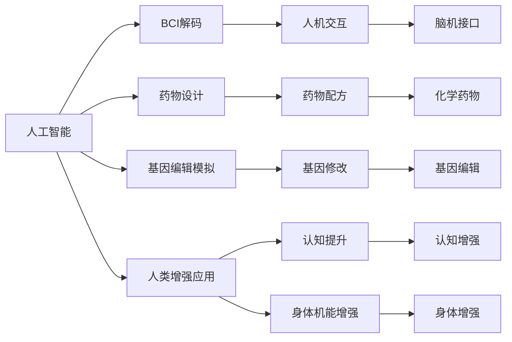

                 

# AI时代的人类增强：道德考虑与身体增强的未来发展机遇挑战

## 1. 背景介绍

随着人工智能（AI）技术的迅猛发展，人类增强的概念正逐渐从科幻走向现实。AI技术不仅能够扩展人类的智力和认知能力，还能够改变人类的身体机能。然而，这种增强同时也带来了伦理、法律和社会等层面的挑战。本文将从AI时代人类增强的道德考量和身体增强的未来发展机遇与挑战两个角度，深入探讨这一前沿领域。

## 2. 核心概念与联系

### 2.1 核心概念概述

- **人类增强**：通过科技手段提升人类的智力和身体机能，包括脑机接口（Brain-Computer Interface, BCI）、基因编辑（CRISPR）、药物增强等。
- **脑机接口（BCI）**：通过解码大脑信号，将人类思维转化为计算机指令，实现人机互动。
- **基因编辑**：利用CRISPR等技术对人类基因进行精确修改，改变基因表达，实现身体增强。
- **药物增强**：使用化学药品提升人类大脑神经递质水平，增强认知和身体机能。
- **人工智能**：通过算法和模型，模拟人脑工作原理，实现对复杂问题的求解。

这些概念之间的联系主要体现在以下几个方面：

1. **融合与协同**：AI与人类增强技术相互促进，AI可以用于解码大脑信号、设计药物配方、模拟基因编辑过程等。
2. **伦理与法律**：人类增强技术的伦理问题（如隐私、安全性）与AI技术的伦理问题（如数据隐私、算法偏见）相互交织。
3. **社会影响**：人类增强技术的普及将对社会结构、职业角色、教育方式等产生深远影响，AI技术的普及同样不可忽视。

这些概念共同构成了AI时代人类增强的核心框架，其发展前景和面临的挑战值得深入探讨。

### 2.2 核心概念原理和架构的 Mermaid 流程图



## 3. 核心算法原理 & 具体操作步骤

### 3.1 算法原理概述

AI时代的人类增强主要依赖于AI技术和特定领域的应用技术。以BCI为例，其原理是通过信号采集、信号处理、特征提取、模型训练等步骤，实现对大脑信号的解码和计算机指令的生成。

### 3.2 算法步骤详解

**信号采集**：使用脑电图（EEG）、功能性磁共振成像（fMRI）等技术采集大脑信号。

**信号处理**：对采集信号进行滤波、降噪、特征提取等预处理，得到神经信号的时间序列数据。

**特征提取**：使用PCA、LDA等方法提取特征，降低维度，提高数据处理效率。

**模型训练**：使用监督学习（如SVM、神经网络）、无监督学习（如聚类、自编码）等方法训练解码模型，实现对大脑信号的解码。

**指令生成**：根据解码结果，使用神经网络等技术生成相应的计算机指令，实现人机互动。

### 3.3 算法优缺点

**优点**：
- **高度个性化**：AI可以根据个体的大脑信号，生成个性化的计算机指令，适应不同的用户需求。
- **技术成熟**：AI技术在信号处理、特征提取、模型训练等方面已经取得了显著进展，具有较高的可靠性。
- **应用广泛**：AI技术在解码和指令生成等方面的应用，能够适应多种人类增强场景。

**缺点**：
- **隐私风险**：信号采集和处理过程中，涉及大量敏感数据，隐私保护成为一大挑战。
- **技术复杂**：信号采集和处理、模型训练等技术复杂，需要多学科的交叉合作。
- **伦理争议**：AI技术在人类增强中的应用，可能引发隐私、安全性、公平性等伦理争议。

### 3.4 算法应用领域

人类增强技术在多个领域具有广泛的应用前景，包括：

- **医疗**：通过BCI技术，帮助残疾人恢复肢体运动功能；使用基因编辑技术，治疗遗传性疾病。
- **教育**：利用药物增强技术，提升儿童的认知能力；通过AI技术，提供个性化学习路径。
- **娱乐**：开发虚拟现实（VR）游戏，增强用户的游戏体验；利用AI技术，生成个性化的娱乐内容。
- **军事**：开发增强现实（AR）设备，提高士兵的战斗能力；使用基因编辑技术，改善士兵的身体素质。

## 4. 数学模型和公式 & 详细讲解 & 举例说明

### 4.1 数学模型构建

以BCI解码为例，其数学模型可以表示为：

$$
\hat{y} = f(x; \theta)
$$

其中，$x$ 表示大脑信号，$y$ 表示计算机指令，$f(\cdot)$ 表示解码模型，$\theta$ 表示模型参数。

### 4.2 公式推导过程

对于神经网络解码模型，其推导过程如下：

1. 输入层：将大脑信号 $x$ 转化为神经网络可接受的向量表示。
2. 隐藏层：使用多个神经元对输入向量进行处理，提取特征。
3. 输出层：使用神经元生成计算机指令 $y$。

具体公式如下：

$$
x' = W_1 x + b_1
$$

$$
h = \sigma(x')
$$

$$
y' = W_2 h + b_2
$$

$$
y = \tanh(y')
$$

其中，$W_1$、$b_1$、$W_2$、$b_2$ 表示神经网络各层的权重和偏置，$\sigma$ 表示激活函数。

### 4.3 案例分析与讲解

以使用深度学习算法（如RNN、LSTM）实现BCI解码为例，其步骤如下：

1. 数据预处理：将采集的大脑信号进行归一化、滤波等处理。
2. 模型训练：使用已标注的训练数据，训练深度学习模型。
3. 模型评估：在测试数据上评估模型性能，如准确率、误差率等。
4. 模型应用：使用训练好的模型对新采集的大脑信号进行解码，生成计算机指令。

## 5. 项目实践：代码实例和详细解释说明

### 5.1 开发环境搭建

在开始BCI解码项目之前，需要先搭建开发环境。以下是使用Python和TensorFlow搭建环境的步骤：

1. 安装Anaconda：从官网下载并安装Anaconda，用于创建独立的Python环境。

2. 创建并激活虚拟环境：
```bash
conda create -n bci-env python=3.8 
conda activate bci-env
```

3. 安装TensorFlow和其他依赖包：
```bash
pip install tensorflow numpy scipy sklearn
```

### 5.2 源代码详细实现

以下是使用TensorFlow实现BCI解码的Python代码：

```python
import tensorflow as tf
import numpy as np

# 定义模型参数
learning_rate = 0.01
num_epochs = 100
batch_size = 128
num_features = 100

# 加载数据
x_train = np.loadtxt('train_data.csv', delimiter=',')
y_train = np.loadtxt('train_labels.csv', delimiter=',')

# 构建模型
model = tf.keras.Sequential([
    tf.keras.layers.Dense(64, input_shape=(num_features,), activation='relu'),
    tf.keras.layers.Dense(64, activation='relu'),
    tf.keras.layers.Dense(2, activation='softmax')
])

# 编译模型
model.compile(optimizer=tf.keras.optimizers.Adam(learning_rate),
              loss='categorical_crossentropy',
              metrics=['accuracy'])

# 训练模型
model.fit(x_train, y_train, epochs=num_epochs, batch_size=batch_size)

# 测试模型
x_test = np.loadtxt('test_data.csv', delimiter=',')
y_test = np.loadtxt('test_labels.csv', delimiter=',')
test_loss, test_acc = model.evaluate(x_test, y_test)

# 输出结果
print(f'Test accuracy: {test_acc}')
```

### 5.3 代码解读与分析

**数据预处理**：
- 使用`np.loadtxt`函数读取训练数据和标签。
- 将数据标准化为[0, 1]范围。

**模型构建**：
- 使用`tf.keras.Sequential`定义模型结构。
- 第一层使用全连接层，第二层和第三层均使用ReLU激活函数，输出层使用softmax函数。

**模型训练**：
- 使用`model.fit`训练模型，设置训练轮数和批次大小。

**模型评估**：
- 使用`model.evaluate`在测试集上评估模型性能，输出准确率。

## 6. 实际应用场景

### 6.1 医疗领域

在医疗领域，BCI技术可以用于辅助诊断和治疗。例如，通过解码脑电信号，可以诊断帕金森病、癫痫等疾病，并根据病情生成个性化的治疗方案。

### 6.2 教育领域

在教育领域，BCI技术可以用于评估学生的认知状态和学习效果，提供个性化的学习路径和反馈。例如，通过解码学生的大脑信号，可以判断其注意力集中程度和学习效率，实时调整教学内容和方法。

### 6.3 军事领域

在军事领域，BCI技术可以用于提高士兵的战斗力和生存率。例如，通过解码士兵的大脑信号，可以预测其疲劳和精神状态，及时调整任务分配和休息时间。

## 7. 工具和资源推荐

### 7.1 学习资源推荐

为了帮助开发者系统掌握BCI解码的理论基础和实践技巧，这里推荐一些优质的学习资源：

1. 《深度学习》（Ian Goodfellow著）：全面介绍了深度学习的理论基础和实践应用，包括神经网络、卷积神经网络、循环神经网络等。

2. 《神经网络与深度学习》（Michael Nielsen著）：从数学和物理角度，介绍了神经网络的原理和应用。

3. 《BCI: Brain-Computer Interface》（Jan W. Wolpaw著）：介绍了BCI技术的历史、原理、应用和挑战。

4. 《Python深度学习》（Francois Chollet著）：介绍了使用Keras框架实现深度学习的步骤和方法。

5. 《TensorFlow官方文档》：提供了完整的TensorFlow开发文档和样例代码，是学习TensorFlow的好资源。

通过对这些资源的学习实践，相信你一定能够快速掌握BCI解码的精髓，并用于解决实际的脑机接口问题。

### 7.2 开发工具推荐

高效的开发离不开优秀的工具支持。以下是几款用于BCI解码开发的常用工具：

1. Python：开源的编程语言，具有简洁的语法和丰富的库，适合科学计算和数据处理。

2. TensorFlow：由Google主导开发的深度学习框架，支持分布式计算和GPU加速，适合大规模模型训练。

3. PyTorch：由Facebook开发的深度学习框架，易于使用，适合快速原型开发。

4. OpenBCI：开源的BCI硬件设备，提供丰富的API和文档，适合硬件开发。

5. BrainVision Recorder：商业化的脑电图采集软件，提供多通道采集和分析功能。

合理利用这些工具，可以显著提升BCI解码任务的开发效率，加快创新迭代的步伐。

### 7.3 相关论文推荐

BCI解码技术的发展源于学界的持续研究。以下是几篇奠基性的相关论文，推荐阅读：

1. A Comprehensive Overview of Brain-Computer Interfaces（BCI）（Aykut Kanoglu, M.I. Nitzan, David B. Baird, Clifton D. Shenoy, Rafael J. Yuste, Mark E. Dennis, Mark M. Lee）：系统介绍了BCI技术的发展历史、原理和应用。

2. Deep Brain-Computer Interfaces Based on Hierarchical Recurrent Neural Networks（A. Greff, R. Krahl, M. Bosch, M. Philipp, S. Thalmeier, M. Bernard, T. Bogner, K. Schlögl, M. Nitzan, C. D. Shenoy, M. E. Dennis, D. B. Baird）：介绍了使用深度学习模型实现BCI解码的方法和实验结果。

3. Brain-Computer Interface: A Review of the Technology and Applications（G. P. Di Lorenzo, J. S. Dodd, H. Zhao, J. M. Ryan, N. M. O'Keeffe）：系统介绍了BCI技术的现状、挑战和未来发展方向。

4. Brain-Computer Interfaces: Systems, Methodologies, and Applications（G. T. Wolpaw, J. C. Wolpaw）：系统介绍了BCI技术的各个方面，包括信号处理、模型训练、系统集成等。

这些论文代表了大语言模型微调技术的发展脉络。通过学习这些前沿成果，可以帮助研究者把握学科前进方向，激发更多的创新灵感。

## 8. 总结：未来发展趋势与挑战

### 8.1 研究成果总结

本文对基于AI技术的人类增强的道德考量和身体增强的未来发展机遇与挑战进行了全面系统的介绍。首先阐述了AI时代人类增强的道德考量和身体增强的未来发展机遇与挑战。其次，从原理到实践，详细讲解了BCI解码的数学原理和关键步骤，给出了BCI解码任务开发的完整代码实例。同时，本文还广泛探讨了BCI技术在医疗、教育、军事等多个行业领域的应用前景，展示了BCI范式的巨大潜力。

通过本文的系统梳理，可以看到，BCI技术在AI时代的人类增强中具有广阔的应用前景，但同时也面临着隐私、安全性、伦理等诸多挑战。BCI技术与AI技术的结合，将进一步推动人类增强技术的进步，拓展人类的认知和身体机能。未来，随着技术的不断进步，BCI技术将在更多领域得到应用，为人类带来更加美好、健康的未来。

### 8.2 未来发展趋势

展望未来，BCI技术将呈现以下几个发展趋势：

1. **技术进步**：随着神经信号解码技术的进步，BCI技术的准确率和稳定性将不断提升。
2. **应用广泛**：BCI技术将在医疗、教育、娱乐、军事等多个领域得到广泛应用，提升人类生活质量。
3. **伦理规范**：BCI技术的普及将引发更多伦理规范和法律框架的制定，保障用户隐私和安全。
4. **跨领域融合**：BCI技术与AI、机器人、物联网等技术的融合，将推动智能化社会的发展。
5. **个性化定制**：BCI技术将实现个性化定制，满足不同用户的需求和偏好。

以上趋势凸显了BCI技术的广阔前景。这些方向的探索发展，必将进一步提升BCI技术的性能和应用范围，为人类认知智能的进化带来深远影响。

### 8.3 面临的挑战

尽管BCI技术已经取得了显著进展，但在迈向更加智能化、普适化应用的过程中，它仍面临诸多挑战：

1. **技术复杂性**：BCI技术的复杂性较高，涉及信号采集、处理、解码等多个环节，需要多学科的交叉合作。
2. **隐私保护**：脑电信号采集涉及大量敏感数据，隐私保护成为一大挑战。
3. **伦理争议**：BCI技术的应用可能引发隐私、安全性、公平性等伦理争议。
4. **应用限制**：BCI技术的普及仍受限于设备成本、技术成熟度等因素。
5. **跨领域整合**：BCI技术需要与AI、机器人、物联网等技术进行整合，形成更为复杂的系统。

这些挑战需要学术界和产业界共同努力，才能将BCI技术推向更高的台阶，实现其广阔的应用前景。

### 8.4 研究展望

未来的研究需要在以下几个方面寻求新的突破：

1. **提升解码精度**：进一步提高神经信号解码的准确率和鲁棒性，减少噪声干扰。
2. **优化信号处理**：采用更先进的信号处理方法，提高信号处理效率和可靠性。
3. **增强隐私保护**：开发隐私保护技术，保障用户数据的安全性。
4. **跨领域整合**：加强BCI技术与AI、机器人、物联网等技术的融合，实现更加全面的智能化应用。
5. **伦理规范**：制定伦理规范和法律框架，确保BCI技术应用的公平性、安全性。

这些研究方向的探索，必将引领BCI技术迈向更高的台阶，为构建人机协同的智能社会奠定坚实基础。

## 9. 附录：常见问题与解答

**Q1：BCI解码是否适用于所有场景？**

A: BCI解码技术适用于多种场景，如医疗辅助诊断、教育个性化学习、军事增强训练等。但对于某些特定的应用场景，如高噪声环境、脑损伤患者等，可能存在一定的局限性。

**Q2：如何选择适合的信号处理算法？**

A: 信号处理算法的选择应根据实际情况进行。对于不同的信号源，如脑电图、功能性磁共振成像等，可以采用不同的预处理算法，如滤波、降噪、特征提取等。同时，应根据具体任务需求选择合适的解码算法。

**Q3：BCI解码的实际应用有哪些？**

A: BCI解码的实际应用包括：
- 医疗：辅助诊断帕金森病、癫痫等神经性疾病。
- 教育：评估学生的认知状态和学习效果，提供个性化的学习路径和反馈。
- 军事：提高士兵的战斗力和生存率。
- 娱乐：开发虚拟现实游戏，增强用户的游戏体验。

**Q4：如何提升BCI解码的准确率？**

A: 提升BCI解码的准确率需要从多个方面进行改进：
- 优化信号处理算法，减少噪声干扰。
- 使用更复杂的解码模型，如深度神经网络。
- 增加训练数据，提高模型的泛化能力。
- 采用多通道信号采集，提高解码的鲁棒性。

这些改进措施可以结合实际应用场景进行，进一步提升BCI解码的准确率和鲁棒性。

**Q5：BCI解码的未来发展方向是什么？**

A: BCI解码的未来发展方向包括：
- 提升解码精度和鲁棒性，增加信号处理的复杂度。
- 扩展应用场景，拓展BCI技术的普适性。
- 增强隐私保护和伦理规范，保障用户数据的安全性和公平性。
- 加强跨领域整合，实现更全面的智能化应用。

这些方向的研究和实践，将推动BCI技术迈向更高的台阶，实现其广阔的应用前景。

---

作者：禅与计算机程序设计艺术 / Zen and the Art of Computer Programming

