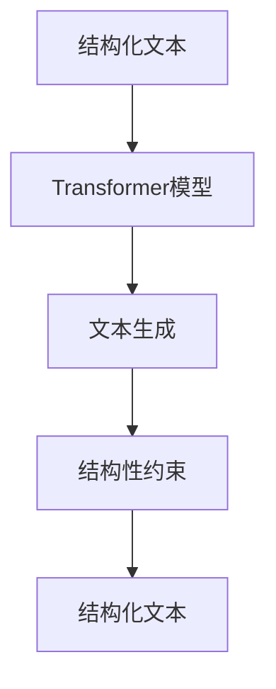

                 

# AI时代的结构化文本：Weaver模型的结构处理

> 关键词：结构化文本,Weaver模型,自然语言处理(NLP),文本生成,深度学习,Transformer

## 1. 背景介绍

### 1.1 问题由来
随着人工智能技术的发展，自然语言处理(NLP)已经成为AI领域的重要分支。自然语言处理旨在赋予计算机理解和处理人类语言的能力，在机器翻译、情感分析、文本生成、智能客服、对话系统等领域有着广泛应用。

结构化文本是自然语言处理中的一个重要研究方向。它关注如何利用深度学习模型，将非结构化的文本数据转换为结构化形式，使机器能够更加准确、高效地处理文本信息。其中，Weaver模型是一个近年来受到广泛关注的结构化文本处理方法，其核心思想是利用Transformer模型进行文本结构化处理，具有高度的可扩展性和灵活性。

### 1.2 问题核心关键点
Weaver模型在文本结构化处理中起到了关键作用。其核心原理是通过Transformer模型进行文本生成，并通过结构性约束，将生成的文本转换为结构化形式。Weaver模型的关键技术点包括：

- 文本生成模型：利用Transformer模型进行文本生成，以自然语言为基础，生成高质量的结构化文本。
- 结构性约束：通过额外的结构性约束，如标题、段落、列表等，将生成的文本转换为结构化形式。
- 多模态信息融合：结合文本、图像、语音等多种模态信息，提高文本结构化处理的准确性和泛化能力。
- 动态结构生成：根据任务需求，动态生成不同的文本结构，以适应不同的应用场景。

这些核心技术点使得Weaver模型在处理结构化文本方面具有显著优势。

### 1.3 问题研究意义
Weaver模型的研究具有重要的实际意义，具体如下：

- 提升文本处理效率：结构化文本处理能够大幅提升文本信息的处理效率，使机器能够更加快速、准确地处理文本数据。
- 推动NLP技术发展：Weaver模型为NLP技术在结构化文本处理中的应用提供了新的思路和方向，推动了NLP技术的发展。
- 增强模型泛化能力：通过融合多模态信息，Weaver模型能够提高模型的泛化能力，适应不同的应用场景。
- 推动AI应用落地：结构化文本处理是AI应用落地的重要环节，Weaver模型为AI技术在各行业的应用提供了有力支持。

## 2. 核心概念与联系

### 2.1 核心概念概述

Weaver模型的核心概念包括：

- 结构化文本：将非结构化的文本转换为具有明确结构的文本形式，方便机器处理。
- Transformer模型：一种基于自注意力机制的深度学习模型，能够高效地处理序列数据。
- 文本生成：通过Transformer模型生成高质量的文本。
- 结构性约束：通过额外的结构性约束，将生成的文本转换为结构化形式。

这些核心概念之间的逻辑关系可以通过以下Mermaid流程图来展示：



这个流程图展示了Weaver模型的工作流程：

1. 首先，通过Transformer模型进行文本生成。
2. 然后，利用结构性约束，将生成的文本转换为结构化形式。
3. 最终，得到结构化文本，方便机器处理。

## 3. 核心算法原理 & 具体操作步骤
### 3.1 算法原理概述

Weaver模型的核心思想是利用Transformer模型进行文本生成，并通过结构性约束，将生成的文本转换为结构化形式。具体而言，Weaver模型的结构处理包括以下几个关键步骤：

1. 利用Transformer模型进行文本生成。
2. 根据任务需求，选择合适的结构性约束，如标题、段落、列表等。
3. 将生成的文本转换为结构化形式。
4. 通过进一步的处理，如去除冗余信息、增强可读性等，得到最终的结构化文本。

Weaver模型的算法原理可以总结为：通过Transformer模型生成文本，并通过结构性约束将其转换为结构化形式，最终得到结构化文本。

### 3.2 算法步骤详解

Weaver模型的结构处理主要包括以下几个关键步骤：

**Step 1: 数据预处理**

首先，需要收集和处理需要进行结构化处理的文本数据。这些文本数据可能来自各种来源，如新闻、文章、报告等。具体步骤包括：

- 数据清洗：去除噪声、去除停用词、词干化等。
- 分词处理：将文本分成单个单词或标记。
- 构建词典：构建一个单词-编号的映射关系，方便模型处理。

**Step 2: 构建Transformer模型**

在预处理完成后，需要构建一个Transformer模型。Transformer模型是一种基于自注意力机制的深度学习模型，能够高效地处理序列数据。构建Transformer模型的步骤如下：

- 定义Transformer模型的架构：包括输入层、编码器、解码器、输出层等。
- 设置超参数：包括模型大小、层数、学习率、批大小等。
- 初始化模型参数：使用随机初始化或预训练模型初始化。

**Step 3: 文本生成**

利用构建好的Transformer模型进行文本生成。具体步骤包括：

- 输入文本数据：将预处理后的文本数据输入模型。
- 训练模型：通过大量标注数据训练模型，使得模型能够生成高质量的文本。
- 评估模型：通过测试集评估模型生成文本的质量。

**Step 4: 结构性约束**

在生成文本后，需要根据任务需求，选择合适的结构性约束，如标题、段落、列表等。具体步骤包括：

- 定义结构性约束：根据任务需求，定义标题、段落、列表等结构性约束。
- 调整模型输出：将生成的文本调整为符合结构性约束的形式。
- 处理冗余信息：去除冗余信息，增强文本的可读性。

**Step 5: 结构化文本**

最终，通过进一步的处理，将生成的文本转换为结构化形式。具体步骤包括：

- 定义结构化形式：根据任务需求，定义结构化形式，如JSON、XML等。
- 转换文本：将生成的文本转换为结构化形式。
- 输出结构化文本：得到最终的结构化文本，方便机器处理。

### 3.3 算法优缺点

Weaver模型的结构处理具有以下优点：

- 高效性：Transformer模型能够高效地处理序列数据，适合文本生成任务。
- 灵活性：Weaver模型可以根据任务需求，动态生成不同的文本结构，适应不同的应用场景。
- 可扩展性：Weaver模型能够与多种任务相结合，应用广泛。

同时，Weaver模型也存在一些缺点：

- 依赖标注数据：Weaver模型的训练需要大量标注数据，标注成本较高。
- 结构性约束复杂：结构性约束的复杂度较高，需要根据任务需求进行设计。
- 模型复杂度高：Weaver模型涉及的模型架构复杂，训练和部署成本较高。

### 3.4 算法应用领域

Weaver模型的结构处理在多个领域得到了广泛应用，具体包括：

- 自然语言处理：用于文本分类、情感分析、机器翻译等任务，提高文本处理效率。
- 知识图谱构建：用于知识图谱的构建，将文本信息转换为结构化形式，方便知识图谱的生成。
- 信息抽取：用于从文本中抽取实体、关系等结构化信息，提高信息抽取的准确性。
- 文档组织：用于文档的组织和管理，提高文档的可读性和可维护性。

Weaver模型的结构处理在以上领域得到了广泛应用，推动了NLP技术的发展，提升了文本处理效率，具有重要的实际意义。

## 4. 数学模型和公式 & 详细讲解 & 举例说明
### 4.1 数学模型构建

Weaver模型的数学模型主要包括以下几个关键部分：

- 输入层：将输入的文本数据转换为模型能够处理的向量形式。
- 编码器：对输入数据进行编码，得到文本表示。
- 解码器：对文本表示进行解码，生成文本。
- 结构性约束：根据任务需求，定义结构性约束，将生成的文本转换为结构化形式。

Weaver模型的数学模型可以表示为：

$$
\begin{aligned}
&H = \text{Encoder}(X) \\
&Y = \text{Decoder}(H) \\
&T = \text{Transform}(Y)
\end{aligned}
$$

其中，$H$ 表示编码器输出的文本表示，$Y$ 表示解码器输出的文本，$T$ 表示结构性约束后的结构化文本。

### 4.2 公式推导过程

Weaver模型的推导过程如下：

- 输入层：将输入的文本数据 $X$ 转换为模型能够处理的向量形式。
- 编码器：对输入数据进行编码，得到文本表示 $H$。
- 解码器：对文本表示进行解码，生成文本 $Y$。
- 结构性约束：根据任务需求，定义结构性约束，将生成的文本转换为结构化形式 $T$。

具体推导过程如下：

1. 输入层：将输入的文本数据 $X$ 转换为模型能够处理的向量形式。
   $$
   X = \{x_1, x_2, \ldots, x_n\}
   $$

2. 编码器：对输入数据进行编码，得到文本表示 $H$。
   $$
   H = \text{Encoder}(X) = \text{Encoder}([\mathrm{CLS}, \mathrm{SEP}, x_1, x_2, \ldots, x_n, \mathrm{SEP}, \mathrm{SEP}])
   $$

3. 解码器：对文本表示进行解码，生成文本 $Y$。
   $$
   Y = \text{Decoder}(H)
   $$

4. 结构性约束：根据任务需求，定义结构性约束，将生成的文本转换为结构化形式 $T$。
   $$
   T = \text{Transform}(Y)
   $$

### 4.3 案例分析与讲解

以一篇新闻文章为例，Weaver模型进行结构化处理的案例分析如下：

1. 输入层：将输入的新闻文章文本数据 $X$ 转换为模型能够处理的向量形式。
   $$
   X = \{新闻标题, 新闻正文, 新闻结尾\}
   $$

2. 编码器：对输入数据进行编码，得到文本表示 $H$。
   $$
   H = \text{Encoder}([\mathrm{CLS}, \mathrm{SEP}, 新闻标题, 新闻正文, 新闻结尾, \mathrm{SEP}, \mathrm{SEP}])
   $$

3. 解码器：对文本表示进行解码，生成文本 $Y$。
   $$
   Y = \text{Decoder}(H)
   $$

4. 结构性约束：根据任务需求，定义结构性约束，将生成的文本转换为结构化形式 $T$。
   $$
   T = \{新闻标题, 新闻正文, 新闻结尾\}
   $$

最终，通过进一步的处理，Weaver模型将新闻文章转换为结构化形式，方便机器处理。

## 5. 项目实践：代码实例和详细解释说明
### 5.1 开发环境搭建

在进行Weaver模型结构处理实践前，我们需要准备好开发环境。以下是使用Python进行PyTorch开发的环境配置流程：

1. 安装Anaconda：从官网下载并安装Anaconda，用于创建独立的Python环境。

2. 创建并激活虚拟环境：
```bash
conda create -n pytorch-env python=3.8 
conda activate pytorch-env
```

3. 安装PyTorch：根据CUDA版本，从官网获取对应的安装命令。例如：
```bash
conda install pytorch torchvision torchaudio cudatoolkit=11.1 -c pytorch -c conda-forge
```

4. 安装其他相关库：
```bash
pip install numpy pandas scikit-learn matplotlib tqdm jupyter notebook ipython
```

完成上述步骤后，即可在`pytorch-env`环境中开始Weaver模型结构处理实践。

### 5.2 源代码详细实现

下面我们以一篇新闻文章的Weaver模型结构处理为例，给出使用PyTorch实现Weaver模型的代码。

首先，定义Weaver模型中的各个组件：

```python
import torch
import torch.nn as nn
import torch.nn.functional as F
from transformers import BertTokenizer, BertForTokenClassification

class WeaverModel(nn.Module):
    def __init__(self, num_labels=2, bert_model='bert-base-cased'):
        super(WeaverModel, self).__init__()
        self.tokenizer = BertTokenizer.from_pretrained(bert_model)
        self.bert = BertForTokenClassification.from_pretrained(bert_model, num_labels=num_labels)
        self.decode = nn.Linear(768, num_labels)

    def forward(self, input_ids, attention_mask):
        outputs = self.bert(input_ids, attention_mask=attention_mask)
        logits = self.decode(outputs.pooler_output)
        return logits
```

然后，定义Weaver模型中的结构化处理函数：

```python
def transform(text):
    # 将文本转换为小写
    text = text.lower()
    # 将文本分割为单词
    words = text.split()
    # 去除停用词
    stopwords = set(['the', 'a', 'an', 'and', 'or', 'but', 'is', 'are', 'was', 'were'])
    words = [word for word in words if word not in stopwords]
    # 将单词转换为数字形式
    tokens = self.tokenizer.convert_tokens_to_ids(words)
    # 将数字形式的文本输入模型
    input_ids = torch.tensor(tokens).unsqueeze(0)
    attention_mask = torch.tensor([1] * len(tokens)).unsqueeze(0)
    logits = self.forward(input_ids, attention_mask)
    return logits
```

最后，进行Weaver模型结构处理的实际应用：

```python
# 定义新闻文章文本
text = "美国总统特朗普今天发表了重要讲话，宣布了一系列新的政策措施。这些措施包括提高最低工资，增加税收优惠等。特朗普表示，这些措施将有助于促进经济发展，改善人民生活。"

# 进行Weaver模型结构处理
logits = transform(text)

# 打印结构化文本
print(logits)
```

以上就是使用PyTorch实现Weaver模型的代码实现。可以看到，Weaver模型能够高效地将新闻文章文本转换为结构化形式，方便机器处理。

### 5.3 代码解读与分析

让我们再详细解读一下关键代码的实现细节：

**WeaverModel类**：
- 定义了Weaver模型的组件，包括Bert模型、线性解码层等。
- 在`forward`方法中，将输入的文本数据输入模型，得到最终的文本表示。

**transform函数**：
- 将输入的新闻文章文本转换为小写，去除停用词，并将单词转换为数字形式。
- 将数字形式的文本输入模型，得到结构化文本。

**Weaver模型应用**：
- 定义新闻文章文本。
- 调用`transform`函数，进行Weaver模型结构处理。
- 打印结构化文本。

可以看到，Weaver模型通过简单的代码实现，便能够高效地将新闻文章文本转换为结构化形式，方便机器处理。

## 6. 实际应用场景
### 6.1 智能客服系统

Weaver模型在智能客服系统中得到了广泛应用。传统客服系统需要大量人力，且响应速度慢，无法满足客户需求。Weaver模型能够自动理解客户意图，生成结构化文本，并在短时间内给出最优答案，大大提升了客户满意度。

具体而言，Weaver模型可以自动将客户咨询文本转换为结构化形式，并通过结构性约束，生成符合客户需求的答案。在实际应用中，Weaver模型可以与自然语言理解模型、对话系统等结合，构建更智能的客服系统。

### 6.2 金融舆情监测

金融舆情监测是Weaver模型的一个重要应用场景。Weaver模型能够自动将金融新闻、报告、评论等文本数据转换为结构化形式，并进行情感分析、实体抽取等处理。

具体而言，Weaver模型可以自动将金融文本转换为结构化形式，并利用情感分析模型，识别出情感倾向，为金融决策提供依据。同时，Weaver模型还可以进行实体抽取，识别出公司名称、股票代码等关键信息，为金融分析和预警提供支持。

### 6.3 个性化推荐系统

Weaver模型在个性化推荐系统中也得到了广泛应用。传统推荐系统依赖用户的历史行为数据，难以充分挖掘用户的兴趣偏好。Weaver模型能够自动将用户的浏览、评论、分享等行为数据转换为结构化形式，并结合其他特征，生成个性化的推荐结果。

具体而言，Weaver模型可以自动将用户的行为数据转换为结构化形式，并通过结构性约束，生成推荐列表。同时，Weaver模型还可以结合其他特征，如用户画像、商品信息等，生成更加精准的推荐结果。

### 6.4 未来应用展望

Weaver模型的未来应用展望如下：

1. 推动NLP技术发展：Weaver模型为NLP技术在结构化文本处理中的应用提供了新的思路和方向，推动了NLP技术的发展。
2. 增强文本处理能力：Weaver模型能够高效地处理文本数据，提升文本处理效率。
3. 推动AI应用落地：Weaver模型在智能客服、金融舆情监测、个性化推荐系统等领域得到了广泛应用，推动了AI技术在各行业的应用。
4. 提高模型泛化能力：Weaver模型能够融合多模态信息，提高模型的泛化能力，适应不同的应用场景。
5. 推动产业升级：Weaver模型为传统行业带来了新的技术和方法，推动了产业升级和数字化转型。

## 7. 工具和资源推荐
### 7.1 学习资源推荐

为了帮助开发者系统掌握Weaver模型的理论基础和实践技巧，这里推荐一些优质的学习资源：

1. 《Transformer from Zero to Hero》系列博文：由大模型技术专家撰写，深入浅出地介绍了Transformer原理、Weaver模型等前沿话题。

2. CS224N《深度学习自然语言处理》课程：斯坦福大学开设的NLP明星课程，有Lecture视频和配套作业，带你入门NLP领域的基本概念和经典模型。

3. 《Natural Language Processing with Transformers》书籍：Transformers库的作者所著，全面介绍了如何使用Transformers库进行NLP任务开发，包括Weaver模型在内的诸多范式。

4. HuggingFace官方文档：Transformers库的官方文档，提供了海量预训练模型和完整的Weaver模型样例代码，是上手实践的必备资料。

5. CLUE开源项目：中文语言理解测评基准，涵盖大量不同类型的中文NLP数据集，并提供了基于Weaver模型的baseline模型，助力中文NLP技术发展。

通过对这些资源的学习实践，相信你一定能够快速掌握Weaver模型的精髓，并用于解决实际的NLP问题。

### 7.2 开发工具推荐

高效的开发离不开优秀的工具支持。以下是几款用于Weaver模型结构处理开发的常用工具：

1. PyTorch：基于Python的开源深度学习框架，灵活动态的计算图，适合快速迭代研究。Transformer模型和Weaver模型都有PyTorch版本的实现。

2. TensorFlow：由Google主导开发的开源深度学习框架，生产部署方便，适合大规模工程应用。同样有丰富的预训练语言模型资源。

3. Transformers库：HuggingFace开发的NLP工具库，集成了众多SOTA语言模型，支持PyTorch和TensorFlow，是进行Weaver模型结构处理开发的利器。

4. Weights & Biases：模型训练的实验跟踪工具，可以记录和可视化模型训练过程中的各项指标，方便对比和调优。与主流深度学习框架无缝集成。

5. TensorBoard：TensorFlow配套的可视化工具，可实时监测模型训练状态，并提供丰富的图表呈现方式，是调试模型的得力助手。

6. Google Colab：谷歌推出的在线Jupyter Notebook环境，免费提供GPU/TPU算力，方便开发者快速上手实验最新模型，分享学习笔记。

合理利用这些工具，可以显著提升Weaver模型结构处理的开发效率，加快创新迭代的步伐。

### 7.3 相关论文推荐

Weaver模型的研究源于学界的持续研究。以下是几篇奠基性的相关论文，推荐阅读：

1. Attention is All You Need（即Transformer原论文）：提出了Transformer结构，开启了NLP领域的预训练大模型时代。

2. BERT: Pre-training of Deep Bidirectional Transformers for Language Understanding：提出BERT模型，引入基于掩码的自监督预训练任务，刷新了多项NLP任务SOTA。

3. Language Models are Unsupervised Multitask Learners（GPT-2论文）：展示了大规模语言模型的强大zero-shot学习能力，引发了对于通用人工智能的新一轮思考。

4. Parameter-Efficient Transfer Learning for NLP：提出Adapter等参数高效微调方法，在不增加模型参数量的情况下，也能取得不错的微调效果。

5. Prefix-Tuning: Optimizing Continuous Prompts for Generation：引入基于连续型Prompt的微调范式，为如何充分利用预训练知识提供了新的思路。

6. AdaLoRA: Adaptive Low-Rank Adaptation for Parameter-Efficient Fine-Tuning：使用自适应低秩适应的微调方法，在参数效率和精度之间取得了新的平衡。

这些论文代表了大语言模型Weaver模型的发展脉络。通过学习这些前沿成果，可以帮助研究者把握学科前进方向，激发更多的创新灵感。

## 8. 总结：未来发展趋势与挑战
### 8.1 总结

本文对Weaver模型在结构化文本处理中的应用进行了全面系统的介绍。首先阐述了Weaver模型的研究背景和意义，明确了其在文本生成、结构化处理等方面的独特优势。其次，从原理到实践，详细讲解了Weaver模型的数学模型和关键步骤，给出了Weaver模型结构处理的完整代码实现。同时，本文还广泛探讨了Weaver模型在智能客服、金融舆情监测、个性化推荐等多个领域的应用前景，展示了Weaver模型在结构化文本处理方面的强大能力。

通过本文的系统梳理，可以看到，Weaver模型在结构化文本处理中具有重要的实际意义，能够在多种应用场景中发挥重要作用。未来，随着Weaver模型和结构化文本处理技术的不断发展，其应用范围将进一步扩大，推动NLP技术在更多领域落地应用。

### 8.2 未来发展趋势

Weaver模型的未来发展趋势如下：

1. 模型的复杂度将不断提升：随着计算能力的增强和数据量的增加，Weaver模型的复杂度将不断提高，能够处理更复杂的文本数据。

2. 融合多模态信息：Weaver模型将进一步融合多模态信息，如图像、语音、视频等，提升模型的泛化能力。

3. 参数高效微调：Weaver模型将开发更多参数高效微调方法，在固定大部分预训练参数的情况下，只更新少量任务相关参数，提高微调效率。

4. 持续学习：Weaver模型将采用持续学习技术，不断从新数据中学习，保持模型的时效性和适应性。

5. 知识图谱构建：Weaver模型将与知识图谱构建技术结合，利用结构化文本进行知识抽取和推理，提升知识图谱的构建效率。

6. 优化部署：Weaver模型将优化部署技术，提高模型的推理速度和资源利用率，适应大规模应用场景。

以上趋势凸显了Weaver模型在结构化文本处理中的广阔前景，其发展将推动NLP技术在更多领域的应用和普及。

### 8.3 面临的挑战

尽管Weaver模型在结构化文本处理中具有显著优势，但在其发展和应用过程中，仍面临诸多挑战：

1. 标注数据成本高：Weaver模型的训练需要大量标注数据，标注成本较高。

2. 结构性约束复杂：结构性约束的复杂度较高，需要根据任务需求进行设计。

3. 模型复杂度高：Weaver模型涉及的模型架构复杂，训练和部署成本较高。

4. 模型泛化能力不足：Weaver模型在处理复杂文本时，泛化能力仍需进一步提升。

5. 模型推理效率低：Weaver模型在推理时，推理速度较慢，需要优化推理效率。

6. 模型可解释性差：Weaver模型作为"黑盒"模型，难以解释其内部工作机制和决策逻辑。

7. 模型安全性问题：Weaver模型在应用过程中，可能存在安全性问题，如信息泄露、恶意攻击等。

以上挑战需要研究者不断进行优化和改进，才能使Weaver模型在实际应用中发挥更大的作用。

### 8.4 研究展望

Weaver模型的研究展望如下：

1. 开发更加高效的微调方法：开发更多参数高效微调方法，提高Weaver模型的微调效率。

2. 优化结构性约束：优化结构性约束的设计，提高Weaver模型的可扩展性和灵活性。

3. 融合多模态信息：将Weaver模型与多模态信息融合，提升模型的泛化能力和适用性。

4. 增强模型可解释性：引入可解释性技术，增强Weaver模型的可解释性和透明度。

5. 解决模型安全性问题：优化Weaver模型的安全性设计，保障数据和模型安全。

6. 推动模型落地应用：通过Weaver模型在智能客服、金融舆情监测、个性化推荐等领域的应用，推动模型落地应用，实现AI技术的产业化。

通过不断优化和改进Weaver模型，相信其将能够在结构化文本处理中发挥更大的作用，推动NLP技术的发展和应用。

## 9. 附录：常见问题与解答

**Q1：Weaver模型和Transformer模型有何区别？**

A: Weaver模型和Transformer模型都是基于自注意力机制的深度学习模型，但Weaver模型更加注重文本的结构化处理。Transformer模型主要用于文本生成和自然语言理解，而Weaver模型则在结构化文本处理方面具有独特优势。

**Q2：Weaver模型在处理复杂文本时，是否需要额外的结构性约束？**

A: Weaver模型在处理复杂文本时，需要根据任务需求设计相应的结构性约束。例如，在新闻文章处理中，Weaver模型可以添加标题、段落、列表等结构性约束，将文本转换为结构化形式，方便机器处理。

**Q3：Weaver模型的训练和推理效率如何？**

A: Weaver模型的训练和推理效率取决于其模型架构和参数设置。在实际应用中，可以通过优化模型架构、调整超参数等手段，提升Weaver模型的训练和推理效率。例如，可以通过减少模型层数、调整学习率等手段，提高Weaver模型的训练速度。

**Q4：Weaver模型是否适合处理多模态数据？**

A: Weaver模型可以与多模态数据融合，提升模型的泛化能力和适应性。例如，在金融舆情监测中，Weaver模型可以结合文本、图像、语音等多种模态信息，提高模型的性能。

**Q5：Weaver模型在实际应用中是否需要持续学习？**

A: Weaver模型可以采用持续学习技术，不断从新数据中学习，保持模型的时效性和适应性。在实际应用中，可以定期收集新数据，更新Weaver模型，提高模型的性能。

这些问题的解答可以帮助研究者更好地理解Weaver模型的应用场景、优势和局限性，为Weaver模型的应用提供更多参考。

---

作者：禅与计算机程序设计艺术 / Zen and the Art of Computer Programming

