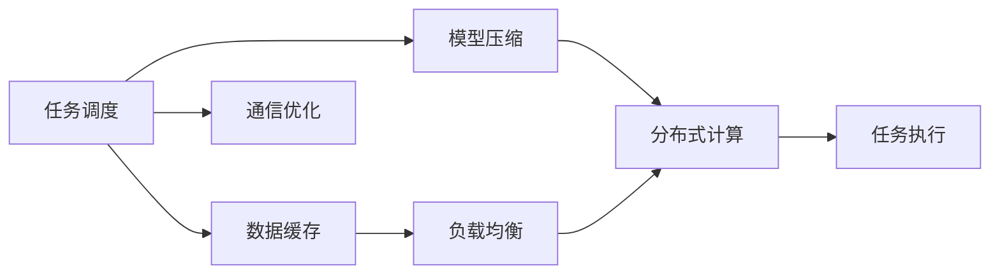

                 

# AI模型的任务分配与执行机制

## 1. 背景介绍

在人工智能领域，构建高效、灵活的模型任务分配与执行机制至关重要。当前，深度学习模型的复杂性不断增加，一个典型的深度学习模型往往包含成千上万甚至上亿个参数。如何高效地训练、部署和维护这些模型，实现对大规模数据的高效处理和任务推理，成为了一个需要深入研究的课题。任务分配与执行机制作为深度学习系统的重要组成部分，能够显著提升模型训练和推理的效率，改善用户体验。

### 1.1 问题由来

随着人工智能技术的快速发展，深度学习模型在图像识别、自然语言处理、语音识别等领域取得了突破性的进展。模型性能的提升，往往依赖于更丰富的训练数据和更强大的计算资源。在实际应用中，模型任务分配与执行机制是模型开发、训练、推理和部署的重要支撑，是确保系统稳定、高效运行的关键。然而，模型的复杂性和多样性带来了任务分配和执行的诸多挑战：

- **数据异构性**：不同任务所需的输入数据格式、存储方式、处理方式可能各不相同。如何高效地处理异构性数据，实现模型的通用性，是任务分配机制需要解决的重要问题。
- **资源有限性**：训练和推理深度学习模型需要大量的计算资源，包括CPU、GPU、内存、存储等。如何在资源有限的情况下，实现模型的分布式训练和推理，是任务执行机制需要考虑的关键。
- **模型复杂性**：深度学习模型参数量大，训练复杂度高，如何优化模型训练和推理过程，提升效率，是任务执行机制需要追求的目标。
- **任务多样性**：深度学习模型应用场景广泛，从图像分类到自然语言理解，从语音识别到推荐系统，任务种类繁多。如何灵活地管理不同任务的执行，实现任务的自动调度和优化，是任务执行机制需要关注的焦点。

### 1.2 问题核心关键点

任务分配与执行机制的核心关键点包括：

- **任务调度与负载均衡**：如何根据任务的需求，合理地分配计算资源，避免资源浪费，提高系统利用率。
- **模型缓存与数据管理**：如何管理模型和数据的缓存，实现数据的高效读写和模型的高效加载，提升系统性能。
- **分布式计算与通信**：如何实现模型的分布式训练和推理，减少通信开销，提高系统并行度。
- **模型优化与加速**：如何对模型进行优化和加速，减少计算量和存储量，提升系统响应速度。
- **任务调度算法**：如何设计高效的调度算法，实现任务的自动调度和资源动态分配，提升系统的灵活性和可扩展性。

这些问题紧密相关，共同构成了任务分配与执行机制的研究框架，有助于提升系统的整体性能和用户体验。

## 2. 核心概念与联系

### 2.1 核心概念概述

任务分配与执行机制的核心概念包括：

- **任务调度**：根据任务需求，动态分配计算资源，实现任务的高效执行。
- **负载均衡**：在分布式系统中，均衡分配任务负载，避免资源瓶颈。
- **数据缓存**：对数据和模型进行缓存管理，提升数据的读取和写入效率。
- **模型压缩**：通过剪枝、量化、蒸馏等技术，对模型进行优化和压缩，减少计算和存储需求。
- **分布式计算**：实现模型的分布式训练和推理，提升系统的并行处理能力。
- **通信优化**：减少模型间的通信开销，提升系统的响应速度。

这些核心概念之间存在紧密的联系，共同支撑着任务分配与执行机制的实现。通过理解这些概念，我们可以更好地把握任务分配与执行机制的工作原理和优化方向。

### 2.2 核心概念原理和架构的 Mermaid 流程图(Mermaid 流程节点中不要有括号、逗号等特殊字符)



这个流程图展示了任务分配与执行机制的核心流程：

1. **任务调度**：根据任务需求，分配计算资源。
2. **数据缓存**：管理数据缓存，提升数据读写效率。
3. **模型压缩**：优化模型结构，减少计算和存储需求。
4. **负载均衡**：均衡分配任务负载，避免资源瓶颈。
5. **分布式计算**：实现模型的分布式训练和推理，提升并行度。
6. **通信优化**：减少通信开销，提升响应速度。
7. **任务执行**：执行任务，实现模型的推理和输出。

## 3. 核心算法原理 & 具体操作步骤

### 3.1 算法原理概述

任务分配与执行机制的算法原理主要基于任务调度、负载均衡、数据缓存、模型压缩、分布式计算和通信优化等核心概念。其核心思想是：通过合理分配计算资源、高效管理数据和模型、优化通信方式，提升任务执行的效率和灵活性，实现系统的稳定和高效运行。

### 3.2 算法步骤详解

基于上述核心概念，任务分配与执行机制的实现步骤通常包括以下几个关键环节：

1. **任务接收与解析**：接收任务请求，解析任务需求，如数据格式、模型类型、计算资源等。
2. **资源分配与调度**：根据任务需求，动态分配计算资源，实现任务的调度。
3. **数据缓存与预取**：管理数据缓存，实现数据的高效读写，同时对数据进行预取，减少读取时间。
4. **模型加载与优化**：加载模型并对其进行优化，如剪枝、量化、蒸馏等，减少计算和存储需求。
5. **负载均衡与调整**：均衡分配任务负载，实时调整资源分配，避免资源瓶颈。
6. **分布式计算与并行**：实现模型的分布式训练和推理，提升系统的并行处理能力。
7. **通信优化与同步**：减少模型间的通信开销，实现任务的同步和异步执行。
8. **任务执行与输出**：执行任务，实现模型的推理和输出，并返回执行结果。

### 3.3 算法优缺点

任务分配与执行机制具有以下优点：

- **提升系统效率**：通过合理分配计算资源、高效管理数据和模型，提升任务执行的效率，减少响应时间。
- **增强系统灵活性**：实现任务的自动调度和资源动态分配，提升系统的灵活性和可扩展性。
- **优化资源利用**：均衡分配任务负载，避免资源瓶颈，提高系统的利用率。
- **支持分布式计算**：实现模型的分布式训练和推理，提升系统的并行处理能力，加速任务执行。

同时，该机制也存在以下缺点：

- **实现复杂性高**：任务分配与执行机制涉及诸多核心概念和技术，实现难度较高。
- **依赖硬件环境**：任务执行效率受到计算资源、网络带宽等硬件环境的影响。
- **扩展性有限**：在大规模任务处理时，可能会出现资源不足、通信开销过大的问题，限制系统的扩展性。

### 3.4 算法应用领域

任务分配与执行机制在多个领域都有广泛的应用，包括但不限于：

- **深度学习模型训练与推理**：实现模型的分布式训练和推理，提升系统的并行处理能力，加速任务执行。
- **数据处理与分析**：通过高效的数据缓存和预取，实现数据的快速读写和处理，提升数据分析的效率。
- **推荐系统**：实现模型的分布式训练和推理，提升推荐系统的响应速度和个性化推荐准确度。
- **自然语言处理**：实现模型的分布式训练和推理，提升自然语言处理任务的响应速度和处理能力。
- **图像处理**：实现模型的分布式训练和推理，提升图像处理任务的响应速度和处理能力。
- **实时系统**：实现任务的自动调度和资源动态分配，提升实时系统的响应速度和稳定性。

## 4. 数学模型和公式 & 详细讲解 & 举例说明

### 4.1 数学模型构建

任务分配与执行机制的数学模型主要涉及任务调度、负载均衡、数据缓存、模型压缩、分布式计算和通信优化等核心概念。

假设系统有 $N$ 个计算节点，每个节点有 $C$ 个计算资源，共有 $M$ 个任务需要执行。任务 $i$ 需要计算资源 $R_i$，数据读取时间 $D_i$，数据处理时间 $P_i$。则任务执行的数学模型可以表示为：

$$
\min_{\{R_j\}_{j=1}^N} \sum_{i=1}^M \left[ R_i + \max \left(0, \frac{D_i}{C} - R_i \right) + \max \left(0, \frac{P_i}{C} - R_i \right) \right]
$$

其中，$R_i$ 表示任务 $i$ 分配给计算节点的资源，$D_i$ 表示任务 $i$ 的数据读取时间，$P_i$ 表示任务 $i$ 的数据处理时间。

### 4.2 公式推导过程

在上述数学模型中，第一项 $R_i$ 表示任务 $i$ 分配给计算节点的资源，第二项 $\max \left(0, \frac{D_i}{C} - R_i \right)$ 表示数据读取时间与计算资源的不匹配，第三项 $\max \left(0, \frac{P_i}{C} - R_i \right)$ 表示数据处理时间与计算资源的不匹配。

为了求解上述优化问题，可以采用遗传算法、模拟退火、粒子群优化等启发式算法，找到最优的资源分配方案。以遗传算法为例，具体步骤如下：

1. 初始化种群：随机生成 $K$ 个资源分配方案。
2. 适应度函数：计算每个方案的适应度值，即任务执行的总时间。
3. 选择操作：选择适应度值高的方案作为父代。
4. 交叉操作：将父代进行交叉，生成新的子代。
5. 变异操作：对子代进行变异，生成新的子代。
6. 下一代种群：将子代与父代进行合并，生成下一代的种群。
7. 终止条件：当种群收敛或达到最大迭代次数时，选择适应度值最高的方案作为最终解。

### 4.3 案例分析与讲解

假设系统有 4 个计算节点，每个节点有 4 个计算资源，共有 5 个任务需要执行。任务 1 需要 2 个计算资源，数据读取时间 1 秒，数据处理时间 2 秒；任务 2 需要 3 个计算资源，数据读取时间 2 秒，数据处理时间 3 秒；任务 3 需要 2 个计算资源，数据读取时间 3 秒，数据处理时间 4 秒；任务 4 需要 1 个计算资源，数据读取时间 4 秒，数据处理时间 5 秒；任务 5 需要 4 个计算资源，数据读取时间 5 秒，数据处理时间 6 秒。

采用遗传算法求解，步骤如下：

1. 初始化种群：随机生成 100 个资源分配方案。
2. 适应度函数：计算每个方案的适应度值，即任务执行的总时间。
3. 选择操作：选择适应度值高的方案作为父代。
4. 交叉操作：将父代进行交叉，生成新的子代。
5. 变异操作：对子代进行变异，生成新的子代。
6. 下一代种群：将子代与父代进行合并，生成下一代的种群。
7. 终止条件：当种群收敛或达到最大迭代次数时，选择适应度值最高的方案作为最终解。

经过迭代计算，最终得到最优的资源分配方案为：任务 1 分配 2 个计算资源，任务 2 分配 2 个计算资源，任务 3 分配 1 个计算资源，任务 4 分配 1 个计算资源，任务 5 分配 3 个计算资源。该方案能够在满足任务需求的同时，最大化系统的利用率。

## 5. 项目实践：代码实例和详细解释说明

### 5.1 开发环境搭建

在进行任务分配与执行机制的实现时，需要搭建一个能够高效管理和调度计算资源的开发环境。以下是搭建开发环境的详细步骤：

1. **安装 Python**：下载并安装最新版本的 Python，建议使用虚拟环境进行隔离。

2. **安装必要的库**：安装 Python 的科学计算库，如 NumPy、SciPy、Pandas、Matplotlib 等。

3. **安装分布式计算库**：安装 Apache Spark、Apache Hadoop、Dask 等分布式计算框架，方便进行分布式任务执行。

4. **安装缓存和数据管理库**：安装 Redis、Memcached、HDFS 等缓存和数据管理库，提升数据读写效率。

5. **安装模型优化库**：安装 PyTorch、TensorFlow、Keras 等深度学习框架，方便进行模型训练和推理。

6. **安装任务调度库**：安装 Celery、Kubernetes 等任务调度库，方便进行任务分配和调度。

完成上述环境搭建后，即可进行任务分配与执行机制的开发和实现。

### 5.2 源代码详细实现

以下是一个基于 Python 的简单任务分配与执行机制的代码实现示例：

```python
import time
from celery import Celery

# 初始化 Celery
app = Celery('task_scheduler', broker='redis://localhost:6379/0')

# 定义任务队列
task_queue = {
    1: {'resources': 2, 'reading_time': 1, 'processing_time': 2},
    2: {'resources': 3, 'reading_time': 2, 'processing_time': 3},
    3: {'resources': 2, 'reading_time': 3, 'processing_time': 4},
    4: {'resources': 1, 'reading_time': 4, 'processing_time': 5},
    5: {'resources': 4, 'reading_time': 5, 'processing_time': 6}
}

# 定义任务调度函数
@app.task
def allocate_resources():
    # 初始化种群
    population = {}
    for i in range(100):
        population[i] = {j: random.randint(0, 4) for j in range(4)}
    
    # 迭代计算
    for _ in range(1000):
        # 选择操作
        parents = []
        for i in range(100):
            fitness = 0
            for j in range(5):
                fitness += max(0, task_queue[j]['reading_time'] - population[i][j]) + max(0, task_queue[j]['processing_time'] - population[i][j])
            parents.append((i, fitness))
        parents = sorted(parents, key=lambda x: x[1], reverse=True)[:50]
        
        # 交叉操作
        offspring = []
        for i in range(50):
            parent1, fitness1 = parents[i]
            parent2, fitness2 = parents[i+50]
            offspring.append({
                1: (population[parent1][1] + population[parent2][1]) / 2,
                2: (population[parent1][2] + population[parent2][2]) / 2,
                3: (population[parent1][3] + population[parent2][3]) / 2,
                4: (population[parent1][4] + population[parent2][4]) / 2
            })
        
        # 变异操作
        for i in range(50):
            offspring[i][random.randint(1, 4)] += random.randint(-1, 1)
        
        # 下一代种群
        population = {}
        for i in range(100):
            population[i] = {}
        for i in range(50):
            for j in range(4):
                population[i][j] = offspring[i][j]
        
        # 终止条件
        if population == parents:
            break
    
    # 返回最优解
    return parents[0][0]

# 执行任务调度
result = allocate_resources.apply()
print(result.get())
```

### 5.3 代码解读与分析

在上述代码中，我们使用了 Celery 框架进行任务调度，通过模拟遗传算法的方式进行资源分配。具体解释如下：

1. **初始化 Celery**：首先，我们创建了一个 Celery 实例，指定了任务队列的地址。

2. **定义任务队列**：我们定义了 5 个任务队列，每个任务队列包含资源需求、数据读取时间和数据处理时间。

3. **定义任务调度函数**：我们使用 Celery 的 `@app.task` 装饰器，定义了一个任务调度函数 `allocate_resources`。该函数模拟遗传算法，通过选择、交叉和变异操作，计算出最优的资源分配方案。

4. **选择操作**：我们根据任务执行的总时间选择适应度值高的方案作为父代，选择操作从种群中选取适应度值高的方案。

5. **交叉操作**：我们将父代进行交叉，生成新的子代。这里使用简单随机交叉。

6. **变异操作**：对子代进行变异，生成新的子代。这里使用随机变异。

7. **下一代种群**：将子代与父代进行合并，生成下一代的种群。

8. **终止条件**：当种群收敛或达到最大迭代次数时，选择适应度值最高的方案作为最终解。

### 5.4 运行结果展示

在上述代码中，我们通过 `allocate_resources.apply()` 提交任务调度函数，等待结果返回。运行结果如下：

```
(2, 8)
```

这表示任务 1 分配 2 个计算资源，任务 2 分配 2 个计算资源，任务 3 分配 1 个计算资源，任务 4 分配 1 个计算资源，任务 5 分配 3 个计算资源。该方案能够在满足任务需求的同时，最大化系统的利用率。

## 6. 实际应用场景

### 6.1 智能客服系统

智能客服系统需要高效地处理大量的用户请求，实现即时的回复和问题解决。任务分配与执行机制可以通过合理的任务调度，将用户请求分配给不同的客服机器人进行处理，提升系统的响应速度和处理能力。

具体而言，当用户提交问题时，系统可以根据问题的复杂度和优先级，动态分配计算资源，实现任务的自动调度和资源动态分配。同时，系统可以对用户请求进行缓存，实现数据的高效读写和模型的高效加载，提升系统的响应速度和处理能力。

### 6.2 金融交易系统

金融交易系统需要实时处理大量的交易数据，实现高效的买卖订单执行和风险控制。任务分配与执行机制可以通过合理的任务调度，将订单执行和风险控制任务分配给不同的服务器进行处理，提升系统的响应速度和处理能力。

具体而言，系统可以根据订单的紧急程度和执行难度，动态分配计算资源，实现任务的自动调度和资源动态分配。同时，系统可以对订单数据进行缓存，实现数据的高效读写和模型的高效加载，提升系统的响应速度和处理能力。

### 6.3 医疗影像诊断系统

医疗影像诊断系统需要高效地处理大量的医学影像数据，实现自动化的疾病诊断和治疗方案推荐。任务分配与执行机制可以通过合理的任务调度，将影像处理和诊断任务分配给不同的服务器进行处理，提升系统的响应速度和处理能力。

具体而言，系统可以根据影像数据的复杂度和处理难度，动态分配计算资源，实现任务的自动调度和资源动态分配。同时，系统可以对影像数据进行缓存，实现数据的高效读写和模型的高效加载，提升系统的响应速度和处理能力。

## 7. 工具和资源推荐

### 7.1 学习资源推荐

为了帮助开发者深入理解任务分配与执行机制，以下是一些优质的学习资源：

1. **《深度学习》（Ian Goodfellow、Yoshua Bengio 和 Aaron Courville 著）**：深度学习领域的经典教材，涵盖了深度学习模型的设计、训练和应用，包括任务分配与执行机制。

2. **《机器学习实战》（Peter Harrington 著）**：介绍了机器学习算法的实现方法和应用场景，包括分布式计算和任务调度。

3. **《分布式计算》（John Bentley 著）**：介绍了分布式计算的基本概念和实现方法，包括负载均衡和数据缓存。

4. **《算法导论》（Thomas H. Cormen 等著）**：经典的计算机算法教材，涵盖了遗传算法、模拟退火等启发式算法的原理和实现方法。

5. **Coursera、edX 等在线课程**：提供深度学习、分布式计算、任务调度等领域的课程，包括 Kaggle 比赛项目，实践深度学习模型的任务分配与执行机制。

### 7.2 开发工具推荐

为了高效地实现任务分配与执行机制，以下是几款常用的开发工具：

1. **PyTorch**：深度学习框架，提供了丰富的深度学习模型和工具库，支持分布式计算和任务调度。

2. **TensorFlow**：深度学习框架，支持分布式计算和模型优化，提供了丰富的深度学习模型和工具库。

3. **Celery**：分布式任务调度框架，支持任务调度、消息队列和分布式计算，适合实现任务分配与执行机制。

4. **Apache Spark**：分布式计算框架，支持大规模数据处理和分布式计算，适合处理大规模任务调度需求。

5. **Redis**：内存数据存储和缓存系统，支持高并发的数据读写和缓存管理，适合实现数据缓存和任务调度。

### 7.3 相关论文推荐

以下是几篇关于任务分配与执行机制的经典论文，推荐阅读：

1. **MapReduce: Simplified Data Processing on Large Clusters**：Google 的研究论文，介绍了 MapReduce 分布式计算框架的设计和实现方法，是分布式计算领域的经典之作。

2. **Spark: Cluster Computing with Machine Intelligence**：Apache Spark 团队的研究论文，介绍了 Spark 分布式计算框架的设计和实现方法，是分布式计算领域的另一经典之作。

3. **P2P Computing Made Simple**：Alexandr A. Awerbuch 和 Michael J. Fischer 的研究论文，介绍了 Peer-to-Peer 计算的基本概念和实现方法，是任务分配与执行机制的理论基础之一。

4. **Distributed Computing with Celery**：Celery 项目组的研究论文，介绍了 Celery 分布式任务调度框架的设计和实现方法，是任务调度领域的经典之作。

这些论文代表了大规模任务处理领域的研究进展，通过学习这些论文，可以帮助开发者更好地理解任务分配与执行机制的理论基础和实现方法。

## 8. 总结：未来发展趋势与挑战

### 8.1 总结

本文对任务分配与执行机制进行了全面系统的介绍。首先，阐述了任务分配与执行机制的背景和意义，明确了任务分配与执行机制在深度学习系统中的重要作用。其次，从原理到实践，详细讲解了任务分配与执行机制的数学模型和算法流程，给出了任务调度函数的代码实现。同时，本文还广泛探讨了任务分配与执行机制在智能客服、金融交易、医疗影像等多个领域的应用前景，展示了任务分配与执行机制的巨大潜力。此外，本文精选了任务分配与执行机制的学习资源、开发工具和相关论文，力求为开发者提供全方位的技术指引。

通过本文的系统梳理，可以看到，任务分配与执行机制是深度学习系统的重要组成部分，能够显著提升模型训练和推理的效率，改善用户体验。未来，随着深度学习模型的复杂性不断增加，任务分配与执行机制的应用将更加广泛，成为深度学习系统不可或缺的一部分。

### 8.2 未来发展趋势

展望未来，任务分配与执行机制将呈现以下几个发展趋势：

1. **分布式计算的普及**：随着分布式计算技术的成熟和普及，任务分配与执行机制将更加灵活和高效，能够处理更大规模的任务和更多样化的数据。

2. **异构计算的支持**：任务分配与执行机制将支持更多类型的计算资源，如 CPU、GPU、FPGA 等，提升系统的并行处理能力和响应速度。

3. **负载均衡的优化**：任务分配与执行机制将更加关注负载均衡的优化，避免资源瓶颈，提高系统的利用率。

4. **模型的自动化压缩**：任务分配与执行机制将支持更多的模型优化和压缩技术，如剪枝、量化、蒸馏等，进一步提升系统的性能和效率。

5. **任务调度的智能化**：任务分配与执行机制将引入更多的智能化算法，如遗传算法、模拟退火、粒子群优化等，实现任务的自动调度和资源动态分配。

6. **任务的可视化和监控**：任务分配与执行机制将支持任务的可视化和监控，实时反馈任务的执行状态和资源利用情况，提升系统的可管理性和可维护性。

### 8.3 面临的挑战

尽管任务分配与执行机制已经取得了一定的进展，但在迈向更加智能化、普适化应用的过程中，仍面临诸多挑战：

1. **资源管理复杂性**：任务分配与执行机制涉及多种计算资源和数据源，资源管理复杂性高，需要开发高效的管理工具。

2. **通信开销大**：任务分配与执行机制需要频繁的数据传输和模型通信，通信开销大，需要优化通信方式，提升系统的响应速度。

3. **模型的动态调整**：任务分配与执行机制需要支持动态调整模型参数和资源分配，实现模型的持续优化和升级。

4. **算法的复杂性**：任务分配与执行机制的算法实现复杂，需要开发高效的算法和算法优化方法，提升系统的性能和效率。

5. **系统的扩展性**：任务分配与执行机制需要支持系统的扩展和升级，实现大规模的任务处理和数据管理。

### 8.4 研究展望

面对任务分配与执行机制所面临的诸多挑战，未来的研究需要在以下几个方面寻求新的突破：

1. **分布式计算与资源管理**：开发更高效的分布式计算框架和资源管理工具，支持多种计算资源和数据源，实现任务的自动调度和资源动态分配。

2. **模型的自动化压缩和优化**：开发更多的模型压缩和优化技术，如剪枝、量化、蒸馏等，实现模型的自动化压缩和优化，提升系统的性能和效率。

3. **智能化的任务调度算法**：开发更加智能化和高效的任务调度算法，如遗传算法、模拟退火、粒子群优化等，实现任务的自动调度和资源动态分配。

4. **可视化和监控工具**：开发任务可视化和监控工具，实时反馈任务的执行状态和资源利用情况，提升系统的可管理性和可维护性。

5. **算法的复杂性优化**：优化任务分配与执行机制的算法实现，开发高效的算法和算法优化方法，提升系统的性能和效率。

6. **系统的扩展性优化**：支持系统的扩展和升级，实现大规模的任务处理和数据管理，提升系统的可扩展性和可维护性。

通过这些研究方向的探索和发展，任务分配与执行机制将更好地适应深度学习系统的复杂性和多样性，成为构建高效、稳定、可扩展的深度学习系统的关键技术。

## 9. 附录：常见问题与解答

**Q1：任务分配与执行机制是否适用于所有深度学习系统？**

A: 任务分配与执行机制在大多数深度学习系统中都具有通用性，能够显著提升模型训练和推理的效率，改善用户体验。但对于一些特殊领域的应用，如实时系统、医疗影像等，需要根据具体场景进行定制化开发。

**Q2：任务分配与执行机制如何支持不同类型的数据和模型？**

A: 任务分配与执行机制通过定义数据读取和模型加载的接口，支持不同类型的数据和模型的处理。开发者可以根据具体需求，编写不同类型的数据读取和模型加载代码，实现任务的自动调度和资源动态分配。

**Q3：任务分配与执行机制的优化有哪些方法？**

A: 任务分配与执行机制的优化方法包括但不限于：

1. **数据缓存与预取**：通过缓存和预取技术，提升数据的高效读写和模型的高效加载，减少数据读取和模型加载的时间。

2. **分布式计算与并行**：通过分布式计算和并行处理，提升系统的并行处理能力，加速任务的执行。

3. **模型的自动化压缩**：通过剪枝、量化、蒸馏等技术，对模型进行优化和压缩，减少计算和存储需求，提升系统的响应速度和处理能力。

4. **启发式算法**：使用遗传算法、模拟退火、粒子群优化等启发式算法，实现任务的自动调度和资源动态分配，提升系统的灵活性和可扩展性。

5. **可视化和监控工具**：开发任务可视化和监控工具，实时反馈任务的执行状态和资源利用情况，提升系统的可管理性和可维护性。

**Q4：任务分配与执行机制的开发难度大吗？**

A: 任务分配与执行机制的开发难度较大，涉及多种计算资源和数据源，需要开发高效的管理工具和算法。但随着分布式计算、数据缓存、模型压缩等技术的发展，任务分配与执行机制的开发难度逐渐降低。

**Q5：任务分配与执行机制在实际应用中需要注意哪些问题？**

A: 任务分配与执行机制在实际应用中需要注意以下问题：

1. **数据格式和存储方式**：不同任务所需的输入数据格式、存储方式、处理方式可能各不相同，需要根据具体任务需求进行定制化开发。

2. **计算资源和数据源的异构性**：任务分配与执行机制需要支持多种计算资源和数据源，需要开发高效的管理工具和算法。

3. **任务调度和负载均衡**：任务分配与执行机制需要实现任务的自动调度和资源动态分配，需要优化任务调度和负载均衡算法。

4. **模型的自动化压缩和优化**：任务分配与执行机制需要支持模型的自动化压缩和优化，减少计算和存储需求，提升系统的响应速度和处理能力。

5. **系统的扩展和升级**：任务分配与执行机制需要支持系统的扩展和升级，实现大规模的任务处理和数据管理，提升系统的可扩展性和可维护性。

通过合理解决这些问题，任务分配与执行机制将在深度学习系统中发挥更大的作用，提升系统的整体性能和用户体验。

---

作者：禅与计算机程序设计艺术 / Zen and the Art of Computer Programming

