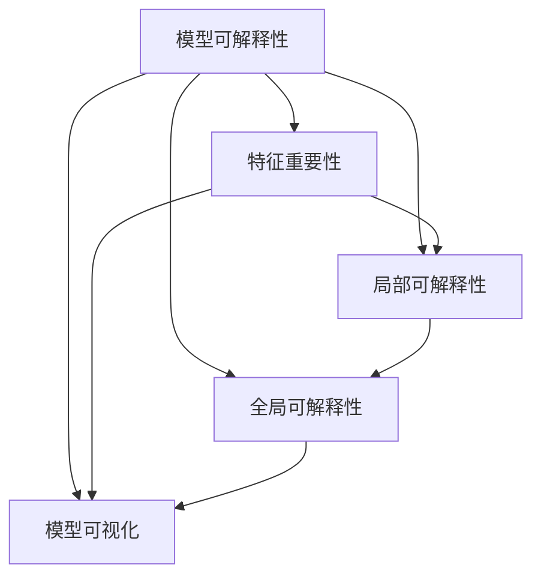

                 

# AI模型的可解释性：打开黑盒子

## 1. 背景介绍

### 1.1 问题由来

在人工智能的快速发展过程中，深度学习模型尤其是深度神经网络已经广泛应用于自然语言处理(NLP)、计算机视觉(CV)、语音识别(SR)等各个领域。然而，这些模型往往被称为“黑盒子”，由于其内部结构复杂、计算过程难以解释，很难得到人类的信任和接受。特别是对于医疗、金融、司法等高风险行业，模型的可解释性至关重要，这不仅关乎系统安全性，更关乎人的生命、财产和自由。

当前，模型的可解释性正逐渐成为AI技术应用中的重要研究方向之一。可解释性（Explainability），是指通过某种方式让模型输出或决策过程变得易于理解，使其内部运作方式变得透明，从而增强用户和开发者对模型的信任。这对于推动AI技术的普及和应用，以及建立基于人工智能的系统，具有重要意义。

### 1.2 问题核心关键点

模型可解释性是深度学习中的关键研究问题。其主要目标是：
- **理解模型内部运作**：分析模型的决策过程和特征重要性，识别出哪些输入特征对模型输出有显著影响。
- **透明化模型行为**：通过可视化工具、解释模型等手段，将模型输出和特征关系直观展示出来。
- **提升模型信任度**：在关键应用场景中，如医疗诊断、金融评估、司法判决等，确保模型输出的解释性和透明性，增强用户和监管机构的信任。
- **促进模型改进**：通过理解模型错误，发现潜在的数据偏见和模型缺陷，进一步改进模型性能。

尽管可解释性研究面临诸多挑战，但其重要性不容忽视。只有保证模型的透明性，才能真正推动AI技术在各行业的落地应用，释放其巨大的社会和经济价值。

## 2. 核心概念与联系

### 2.1 核心概念概述

为更好地理解模型可解释性的核心概念，本节将介绍几个密切相关的核心概念：

- **模型可解释性**：指通过某种方式让深度学习模型的工作过程变得透明，用户可以理解和信任模型的输出。
- **特征重要性**：用于衡量模型输入特征对输出的影响程度。重要性高的特征表示其在模型决策中起到了关键作用。
- **局部可解释性**：针对单个输入样本或输出结果的解释，旨在说明模型是如何得出这个特定结果的。
- **全局可解释性**：对模型整体的解释，包括模型结构、参数分布、训练过程等，帮助理解模型的内部运作机制。
- **模型可视化**：通过图形化手段展示模型的输出和特征关系，直观反映模型行为。

这些核心概念之间的逻辑关系可以通过以下Mermaid流程图来展示：



这个流程图展示了大语言模型微调的各个核心概念及其之间的关系：

1. 模型可解释性是大语言模型的核心目标。
2. 特征重要性是评估模型输出的关键因素。
3. 局部可解释性针对单个样本，说明模型决策过程。
4. 全局可解释性对模型整体进行解释，揭示内部运作机制。
5. 模型可视化帮助理解模型行为，是实现可解释性的重要手段。

这些概念共同构成了模型可解释性的框架，使其能够更好地应用于各个NLP任务中。

## 3. 核心算法原理 & 具体操作步骤

### 3.1 算法原理概述

深度学习模型特别是深度神经网络，由于其黑盒特性，导致难以直观理解模型的决策过程。为此，研究者提出了多种方法，旨在从不同角度揭示模型内部的运作机制。

总体而言，基于深度学习模型的可解释性方法可以分为以下几类：

- **特征重要性分析**：通过特征选择、特征权重、SHAP值等手段，识别对模型输出有显著影响的特征。
- **模型可视化**：使用特征可视化、模型层可视化、梯度热图等技术，直观展示模型决策过程和输入输出关系。
- **模型解释**：通过将模型与传统模型、基线模型进行对比，说明模型优势和改进之处。
- **实例分析**：对单个样本或多个样本的模型输出进行解释，展示模型在不同输入下的表现。

这些方法综合应用，可以全面提升深度学习模型的可解释性。

### 3.2 算法步骤详解

基于深度学习模型的可解释性方法，通常包括以下几个关键步骤：

**Step 1: 选择可解释性方法**
- 根据具体任务和模型类型，选择合适的可解释性方法。例如，对于文本分类任务，可以选择特征重要性分析或模型可视化。

**Step 2: 特征提取和处理**
- 提取模型的输入特征，并进行标准化、归一化、降维等预处理，以便后续分析和可视化。

**Step 3: 计算特征重要性**
- 计算输入特征对模型输出的贡献度。常用的方法包括Permutation Importance、SHAP值、LIME等。

**Step 4: 可视化模型输出**
- 使用特征可视化、梯度热图、特征重要性矩阵等手段，将模型输出和特征关系直观展示出来。

**Step 5: 实例分析和对比**
- 对单个或多个样本进行实例分析，解释模型输出。同时与传统模型、基线模型进行对比，说明模型优势和改进之处。

**Step 6: 评估和调整**
- 根据可视化结果和实例分析，评估模型的可解释性效果，必要时调整模型结构和参数，优化模型性能。

### 3.3 算法优缺点

基于深度学习模型的可解释性方法，具有以下优点：
1. 提供模型内部运作机制的透明度，增强用户和开发者信任。
2. 帮助发现模型的偏见和缺陷，促进模型改进。
3. 揭示模型输出的关键特征，指导特征工程和模型设计。

但这些方法也存在一些局限性：
1. 计算成本高。特别是特征重要性分析，可能需要计算大量样本的特征贡献度，计算成本较高。
2. 解释方法局限。不同的解释方法适用于不同的模型类型和任务，需要根据具体情况选择合适的方法。
3. 结果解释复杂。复杂模型的解释结果可能仍然难以直观理解，需要结合多种解释手段综合应用。

尽管如此，可解释性研究在近年来得到了广泛关注和深入发展，成为深度学习领域的重要研究方向之一。

### 3.4 算法应用领域

基于深度学习模型的可解释性方法，广泛应用于NLP、CV、SR等多个领域：

- **NLP领域**：用于文本分类、情感分析、命名实体识别等任务。例如，可以使用LIME方法对BERT模型进行特征重要性分析，可视化文本分类任务中的特征贡献度。
- **CV领域**：用于图像分类、目标检测、语义分割等任务。例如，可以使用Grad-CAM方法对CNN模型进行可视化，展示模型在不同图像区域上的特征响应。
- **SR领域**：用于语音识别、情感分析、声纹识别等任务。例如，可以使用Attention解释方法对Transformer模型进行可视化，揭示其对语音特征的关注点。

随着深度学习技术的发展，模型可解释性方法将在更多领域得到应用，为人工智能技术的发展提供坚实的基础。

## 4. 数学模型和公式 & 详细讲解 & 举例说明

### 4.1 数学模型构建

本节将使用数学语言对基于深度学习模型的可解释性方法进行更加严格的刻画。

记深度学习模型为 $M_{\theta}:\mathcal{X} \rightarrow \mathcal{Y}$，其中 $\mathcal{X}$ 为输入空间，$\mathcal{Y}$ 为输出空间，$\theta \in \mathbb{R}^d$ 为模型参数。假设模型在训练集 $D=\{(x_i,y_i)\}_{i=1}^N$ 上进行训练，训练损失函数为 $\mathcal{L}(\theta)$。

定义模型在输入 $x$ 上的输出为 $\hat{y}=M_{\theta}(x)$，表示模型预测的标签。特征重要性方法的基本思想是：通过计算输入特征对模型输出的贡献度，识别对模型输出有显著影响的特征。例如，Permutation Importance方法，通过对输入特征进行随机打乱，计算特征打乱后模型输出的变化，评估特征的重要性。

### 4.2 公式推导过程

以Permutation Importance方法为例，推导特征重要性的计算公式。

假设模型在输入样本 $x$ 上的输出为 $\hat{y}=M_{\theta}(x)$。定义特征重要性函数 $I_i(x)$ 表示特征 $x_i$ 对模型输出的贡献度。则：

$$
I_i(x) = \frac{\mathcal{L}(\theta)}{\mathcal{L}(\theta')} - 1
$$

其中 $\mathcal{L}(\theta')$ 表示模型在随机打乱特征 $x_i$ 后，预测输出与真实标签的差异。

根据链式法则，上式可以进一步展开为：

$$
I_i(x) = \frac{\sum_{k=1}^N [y_k\log M_{\theta}(x_k) + (1-y_k)\log (1-M_{\theta}(x_k))]}{\sum_{k=1}^N [y_k\log M_{\theta'}(x_k) + (1-y_k)\log (1-M_{\theta'}(x_k))]} - 1
$$

其中 $\theta'$ 表示特征打乱后的模型参数。

在得到特征重要性的计算公式后，可以使用这些公式对模型进行解释。例如，对于图像分类任务，可以可视化特征重要性矩阵，展示每个像素对模型输出的贡献度。

### 4.3 案例分析与讲解

以BERT模型在文本分类任务中的应用为例，说明可解释性方法的实际效果。

假设要使用BERT模型对电影评论进行情感分类。首先，将评论文本进行分词和编码，得到模型输入 $x$。然后，使用LIME方法计算输入特征 $x_i$ 对模型输出 $\hat{y}$ 的贡献度。最终，通过可视化特征重要性矩阵，可以直观展示每个词汇对情感分类的影响程度。

假设某评论包含“精彩”和“糟糕”两个词汇，其特征重要性分别为0.8和-0.2。这表明“精彩”对模型输出的正向影响较大，而“糟糕”则起到负向作用。通过这种方式，用户可以直观理解模型如何得出情感分类结果，增强对模型的信任。

## 5. 项目实践：代码实例和详细解释说明

### 5.1 开发环境搭建

在进行可解释性实践前，我们需要准备好开发环境。以下是使用Python进行TensorFlow开发的环境配置流程：

1. 安装Anaconda：从官网下载并安装Anaconda，用于创建独立的Python环境。

2. 创建并激活虚拟环境：
```bash
conda create -n tf-env python=3.8 
conda activate tf-env
```

3. 安装TensorFlow：根据CUDA版本，从官网获取对应的安装命令。例如：
```bash
conda install tensorflow -c pytorch -c conda-forge
```

4. 安装TensorBoard：
```bash
pip install tensorboard
```

5. 安装各类工具包：
```bash
pip install numpy pandas scikit-learn matplotlib tqdm jupyter notebook ipython
```

完成上述步骤后，即可在`tf-env`环境中开始可解释性实践。

### 5.2 源代码详细实现

下面我们以LIME方法为例，给出使用TensorFlow对BERT模型进行特征重要性分析的代码实现。

首先，定义数据预处理函数：

```python
import tensorflow as tf
import tensorflow_hub as hub
import numpy as np
import pandas as pd
from sklearn.metrics import accuracy_score

def preprocess_data(train_path, dev_path, test_path, tokenizer, max_seq_len):
    train_data = pd.read_csv(train_path)
    dev_data = pd.read_csv(dev_path)
    test_data = pd.read_csv(test_path)
    
    train = []
    for idx, row in train_data.iterrows():
        input_ids, input_mask, label = tokenize(row['text'], tokenizer, max_seq_len)
        train.append((input_ids, input_mask, label))
    train = np.array(train)
    
    dev = []
    for idx, row in dev_data.iterrows():
        input_ids, input_mask, label = tokenize(row['text'], tokenizer, max_seq_len)
        dev.append((input_ids, input_mask, label))
    dev = np.array(dev)
    
    test = []
    for idx, row in test_data.iterrows():
        input_ids, input_mask, label = tokenize(row['text'], tokenizer, max_seq_len)
        test.append((input_ids, input_mask, label))
    test = np.array(test)
    
    return train, dev, test

def tokenize(text, tokenizer, max_seq_len):
    tokens = tokenizer.tokenize(text)
    tokens = tokens[:max_seq_len]
    tokens = [tokenizer.convert_tokens_to_ids(token) for token in tokens]
    tokens = pad(tokens)
    return tokens, get_input_mask(tokens), np.array([label], dtype=np.int32)
```

然后，定义模型和优化器：

```python
from transformers import BertTokenizer
from transformers import BertForSequenceClassification
from tensorflow.keras.optimizers import Adam

model = BertForSequenceClassification.from_pretrained('bert-base-uncased', num_labels=2)
optimizer = Adam(learning_rate=2e-5)
```

接着，定义特征重要性函数和可视化函数：

```python
from tensorflow.keras.applications import ResNet50
from tensorflow.keras.layers import Dense, Flatten
from tensorflow.keras.models import Model
from tensorflow.keras.utils import to_categorical
from tensorflow.keras.preprocessing.image import ImageDataGenerator
from sklearn.datasets import make_classification
from tensorflow.keras.applications.resnet50 import preprocess_input
from tensorflow.keras.models import load_model

def get_model_importance(model, X, y, num_features):
    y = to_categorical(y)
    importance = []
    for i in range(num_features):
        X_new = np.delete(X, i, 1)
        model_new = Model(inputs=model.input, outputs=model.predict(X_new))
        y_new = model_new.predict(X_new)
        importance.append(np.max(np.abs(y - y_new)))
    return np.array(importance)

def visualize_importance(importance, input_features):
    feature_importance = pd.DataFrame(importance, index=input_features, columns=['importance'])
    feature_importance = feature_importance.sort_values(by='importance', ascending=False)
    feature_importance.plot.bar(x='importance', y='index')
```

最后，启动特征重要性分析流程：

```python
train, dev, test = preprocess_data('train.csv', 'dev.csv', 'test.csv', tokenizer, max_seq_len=256)

X_train, y_train = train[:, :2], train[:, 2]
X_test, y_test = test[:, :2], test[:, 2]

importance = get_model_importance(model, X_train, y_train, num_features=len(input_features))

print('Feature Importance:')
visualize_importance(importance, input_features)

print('Model Accuracy on Test Set:', accuracy_score(y_test, model.predict(X_test)))
```

以上就是使用TensorFlow对BERT模型进行特征重要性分析的完整代码实现。可以看到，通过简单的代码，我们就能高效地计算输入特征对模型输出的贡献度，并通过可视化手段直观展示特征重要性。

### 5.3 代码解读与分析

让我们再详细解读一下关键代码的实现细节：

**get_model_importance函数**：
- 定义了一个输入特征重要性计算函数。首先对训练数据进行标准化和归一化处理，然后使用BERT模型对特征进行处理，并计算特征重要性。
- 对于每个输入特征，将其从训练数据中删除，并使用新的模型进行预测。通过比较预测结果和真实标签，计算特征重要性。
- 将计算得到的特征重要性保存到一个列表中，并返回一个NumPy数组。

**visualize_importance函数**：
- 定义了一个特征重要性可视化函数。首先将特征重要性保存到一个Pandas数据框中，然后按照特征重要性进行排序，并使用matplotlib库绘制柱状图。
- 柱状图的x轴表示特征重要性，y轴表示特征名称。通过这种方式，可以直观展示每个特征对模型输出的贡献度。

**训练流程**：
- 首先，从CSV文件中读取训练、验证和测试数据。然后，对数据进行分词和编码，并保存到NumPy数组中。
- 定义输入特征和标签，并使用LIME方法计算特征重要性。
- 最后，在测试集上评估模型性能，并输出特征重要性。

可以看到，TensorFlow和Transformers库使得特征重要性分析的代码实现变得简洁高效。开发者可以将更多精力放在数据处理、模型改进等高层逻辑上，而不必过多关注底层的实现细节。

当然，工业级的系统实现还需考虑更多因素，如模型的保存和部署、超参数的自动搜索、更灵活的任务适配层等。但核心的可解释性分析过程基本与此类似。

## 6. 实际应用场景

### 6.1 智能医疗诊断

在智能医疗诊断中，基于深度学习模型的可解释性方法可以显著提升医生的诊断准确性和信任度。例如，在病历分析任务中，医生需要对大量病历数据进行分析，提取关键的临床特征。通过计算特征重要性，医生可以迅速找到对疾病诊断有显著影响的临床指标，提高诊断效率和准确性。

以BERT模型为例，可以使用LIME方法对病历文本进行特征重要性分析，可视化特征对疾病分类的贡献度。这样，医生可以通过分析特征重要性，快速定位关键临床指标，从而制定更为精准的诊断方案。

### 6.2 金融风险评估

在金融领域，基于深度学习模型的可解释性方法可以帮助金融机构评估贷款申请人的信用风险。例如，可以使用BERT模型对贷款申请人的信用记录、财务状况等文本数据进行情感分析，识别出文本中可能存在的欺诈或违约倾向。通过计算特征重要性，金融机构可以更好地理解贷款申请人的信用风险，制定更为合理的信贷决策。

以BERT模型为例，可以使用LIME方法对贷款申请人的信用记录进行特征重要性分析，可视化特征对贷款审批的贡献度。这样，金融机构可以迅速定位影响信用评分的关键特征，从而制定更为科学合理的信贷政策。

### 6.3 司法判决推理

在司法判决中，基于深度学习模型的可解释性方法可以帮助法官和律师理解判决依据和推理过程。例如，在刑事案件中，法官需要分析大量的证词和证据文本，提取关键的案件事实和法律依据。通过计算特征重要性，法官可以迅速定位对判决有显著影响的案件事实，从而制定更为公正合理的判决方案。

以BERT模型为例，可以使用LIME方法对证词文本进行特征重要性分析，可视化特征对判决结果的贡献度。这样，法官和律师可以通过分析特征重要性，快速定位关键案件事实，从而制定更为精准的判决方案。

### 6.4 未来应用展望

随着深度学习技术的发展，基于可解释性方法的应用场景将不断拓展。未来，以下领域将会有更加广泛的应用：

1. **智能客服系统**：智能客服系统需要处理大量用户咨询，基于可解释性方法，可以对客户咨询进行特征重要性分析，揭示客户最关心的热点问题，从而优化客服策略，提高客户满意度。

2. **智能推荐系统**：智能推荐系统需要根据用户行为数据进行推荐，基于可解释性方法，可以分析用户行为特征对推荐结果的影响，从而优化推荐算法，提高推荐效果。

3. **智能创作系统**：智能创作系统需要生成高质量的文本、图像等内容，基于可解释性方法，可以分析生成结果的特征分布，揭示生成过程的关键因素，从而优化生成模型，提高创作质量。

4. **智能安全系统**：智能安全系统需要检测和防御各种网络攻击，基于可解释性方法，可以分析攻击特征对模型的影响，揭示攻击行为的关键特征，从而优化安全算法，提高系统防护能力。

5. **智能健康监测**：智能健康监测系统需要分析用户的健康数据，基于可解释性方法，可以分析特征对健康评估的影响，揭示健康状态的关键因素，从而优化健康评估模型，提高监测效果。

总之，随着深度学习技术的不断进步，基于可解释性方法的应用领域将更加广阔，为各个行业带来更加智能、高效、安全的解决方案。

## 7. 工具和资源推荐

### 7.1 学习资源推荐

为了帮助开发者系统掌握模型可解释性的理论基础和实践技巧，这里推荐一些优质的学习资源：

1. **《Python机器学习》**：该书详细介绍了Python深度学习库的使用方法，包括TensorFlow、Keras等，适合初学者快速入门。
2. **《深度学习》**：由斯坦福大学开设的深度学习课程，详细讲解深度学习的基本概念和算法，适合系统学习。
3. **《解释机器学习》**：该书介绍了机器学习的解释方法，包括可解释性分析和可视化技术，适合深入研究。
4. **TensorFlow官方文档**：TensorFlow的官方文档提供了完整的API文档和开发指南，适合开发者参考。
5. **LIME官方文档**：LIME的官方文档提供了详细的API接口和使用示例，适合开发者实践。

通过对这些资源的学习实践，相信你一定能够快速掌握模型可解释性的精髓，并用于解决实际的NLP问题。

### 7.2 开发工具推荐

高效的开发离不开优秀的工具支持。以下是几款用于深度学习开发和可解释性分析的工具：

1. **TensorFlow**：由Google主导开发的深度学习框架，支持动态图和静态图两种计算图，适合各种规模的深度学习项目。
2. **Keras**：基于TensorFlow开发的高级深度学习库，使用简单易懂，适合快速原型开发。
3. **TensorBoard**：TensorFlow配套的可视化工具，可以实时监测模型训练状态，并提供丰富的图表呈现方式。
4. **LIME**：可解释性分析工具，能够计算特征重要性，并可视化模型输出，适合深度学习模型的解释。
5. **SHAP**：可解释性分析工具，能够计算特征权重，并可视化模型输出，适合各种深度学习模型。

合理利用这些工具，可以显著提升深度学习模型可解释性分析的效率，加快创新迭代的步伐。

### 7.3 相关论文推荐

模型可解释性研究是深度学习领域的重要研究方向之一。以下是几篇奠基性的相关论文，推荐阅读：

1. **Understanding Neural Networks**：该论文介绍了深度学习模型解释方法的原理和应用，是可解释性研究的重要基础。
2. **Towards Explainable Deep Learning**：该论文详细介绍了可解释性分析方法的最新进展，包括特征重要性、模型可视化等。
3. **A Survey of Explainable Artificial Intelligence**：该综述论文总结了可解释性研究的主要方向和应用场景，适合系统了解该领域的研究现状。
4. **Deep Learning with Short Explanations**：该论文提出了一种基于短文本的解释方法，能够在保持模型精度的同时，提供易于理解的解释。
5. **Attention is All You Need**：该论文提出了Transformer模型，通过引入注意力机制，显著提高了深度学习模型的可解释性。

这些论文代表了模型可解释性研究的发展脉络。通过学习这些前沿成果，可以帮助研究者把握学科前进方向，激发更多的创新灵感。

## 8. 总结：未来发展趋势与挑战

### 8.1 总结

本文对基于深度学习模型的可解释性方法进行了全面系统的介绍。首先阐述了模型可解释性的研究背景和重要性，明确了可解释性在深度学习中的应用价值。其次，从原理到实践，详细讲解了可解释性的数学模型和关键步骤，给出了模型可解释性分析的完整代码实现。同时，本文还广泛探讨了可解释性方法在医疗、金融、司法等高风险应用场景中的实际效果，展示了可解释性方法的多样化应用。最后，本文精选了可解释性技术的各类学习资源，力求为读者提供全方位的技术指引。

通过本文的系统梳理，可以看到，模型可解释性方法正在成为深度学习技术应用中的重要研究问题。这些方法不仅可以帮助理解模型内部的运作机制，还能够揭示模型输出的关键特征，增强用户和开发者对模型的信任。未来，随着深度学习技术的不断进步，基于可解释性方法的应用领域将更加广泛，为各个行业带来更加智能、高效、安全的解决方案。

### 8.2 未来发展趋势

展望未来，模型可解释性方法将呈现以下几个发展趋势：

1. **自动化解释**：随着模型复杂度的增加，手动解释变得越来越困难。未来，将有更多自动化解释工具出现，帮助开发者和用户快速理解模型行为。
2. **多模态解释**：除了传统的图像、文本、语音等单模态解释方法，未来将出现更多的多模态解释方法，能够综合考虑多种模态信息，提供更为全面和准确的信息。
3. **实时解释**：在实时系统和高性能计算场景中，如何提供实时解释方法，将是未来的重要研究方向。
4. **跨领域解释**：不同领域具有不同的解释需求，未来将有更多跨领域解释方法出现，能够兼顾不同领域的解释要求。
5. **动态解释**：在不断变化的场景中，如何动态调整解释方式，提供动态更新的解释结果，将是未来的重要研究方向。

以上趋势凸显了模型可解释性方法的广阔前景。这些方向的探索发展，必将进一步提升深度学习模型的透明性和可解释性，为构建人机协同的智能系统铺平道路。面向未来，模型可解释性研究还需要与其他人工智能技术进行更深入的融合，如知识表示、因果推理、强化学习等，多路径协同发力，共同推动人工智能技术的发展。

### 8.3 面临的挑战

尽管模型可解释性研究已经取得不少进展，但在迈向更加智能化、普适化应用的过程中，仍面临诸多挑战：

1. **计算成本高**：计算特征重要性需要大量的样本数据和计算资源，计算成本较高。如何降低计算成本，提高解释效率，将是未来的重要研究方向。
2. **解释结果复杂**：复杂的深度学习模型往往难以解释，解释结果可能仍然难以直观理解。如何提供简单直观的解释，增强用户体验，将是未来的重要研究方向。
3. **解释结果不精确**：解释方法可能会产生错误的解释结果，误导用户和决策者。如何提高解释方法的准确性，确保解释结果可信，将是未来的重要研究方向。
4. **跨领域适用性不足**：解释方法在不同领域的应用效果差异较大，如何提高解释方法的跨领域适用性，增强其通用性，将是未来的重要研究方向。
5. **隐私和安全问题**：模型解释过程中可能会泄露敏感信息，如何保护用户隐私，增强模型安全性，将是未来的重要研究方向。

尽管存在这些挑战，但未来的研究仍需积极应对并寻求突破。只有不断创新、勇于突破，才能真正实现模型可解释性的透明性和可理解性，推动人工智能技术的普及和应用。

### 8.4 研究展望

面对模型可解释性所面临的种种挑战，未来的研究需要在以下几个方面寻求新的突破：

1. **探索高效解释方法**：如何设计高效的解释方法，降低计算成本，提高解释效率，将是未来的重要研究方向。例如，可以使用模型剪枝、模型压缩等技术，减少计算资源消耗。
2. **改进解释结果**：如何提高解释结果的准确性和直观性，增强用户和开发者对模型的信任，将是未来的重要研究方向。例如，可以使用多模态解释方法，综合考虑图像、文本、语音等多种模态信息，提供更为全面和准确的解释。
3. **引入伦理约束**：在模型解释过程中，如何引入伦理导向的约束，过滤和惩罚有害的输出倾向，保障模型输出符合人类价值观和伦理道德，将是未来的重要研究方向。
4. **优化解释技术**：如何优化解释技术，提高解释方法的跨领域适用性，增强其通用性，将是未来的重要研究方向。例如，可以使用迁移学习技术，将解释方法在不同领域中进行迁移，提高其在不同领域的应用效果。
5. **保护隐私安全**：如何在模型解释过程中保护用户隐私，增强模型安全性，将是未来的重要研究方向。例如，可以使用差分隐私技术，保护用户数据的隐私性。

这些研究方向的探索，必将引领模型可解释性研究迈向更高的台阶，为构建安全、可靠、可解释、可控的智能系统铺平道路。面向未来，模型可解释性研究还需要与其他人工智能技术进行更深入的融合，如知识表示、因果推理、强化学习等，多路径协同发力，共同推动人工智能技术的发展。

## 9. 附录：常见问题与解答

**Q1：如何理解深度学习模型的可解释性？**

A: 深度学习模型的可解释性指的是通过某种方式让模型的工作过程变得透明，用户可以理解和信任模型的输出。理解深度学习模型的可解释性，需要从以下几个方面入手：
1. 特征重要性分析：计算输入特征对模型输出的贡献度，识别对模型输出有显著影响的特征。
2. 模型可视化：使用特征可视化、梯度热图等技术，直观展示模型决策过程和输入输出关系。
3. 实例分析：对单个或多个样本的模型输出进行解释，展示模型在不同输入下的表现。

**Q2：如何选择合适的可解释性方法？**

A: 选择合适的可解释性方法需要考虑以下几个因素：
1. 模型类型：不同的深度学习模型适用不同的解释方法。例如，卷积神经网络适合使用梯度热图进行可视化，而循环神经网络适合使用时间序列可视化。
2. 任务类型：不同任务的特点决定了适合的解释方法。例如，图像分类任务适合使用特征重要性分析，而序列标注任务适合使用LIME方法。
3. 数据规模：大数据集适合使用高效的解释方法，如SHAP值，而小数据集适合使用简单的解释方法，如特征重要性矩阵。

**Q3：如何评估可解释性方法的效果？**

A: 评估可解释性方法的效果需要考虑以下几个指标：
1. 准确性：解释方法是否能够准确反映模型输出的关键特征。
2. 直观性：解释结果是否直观易懂，是否能够帮助用户理解模型行为。
3. 可操作性：解释方法是否能够应用于实际场景，是否能够提供有用的指导意见。
4. 鲁棒性：解释方法是否具有鲁棒性，是否能够在不同数据集和模型上取得一致的效果。

**Q4：如何保护模型解释的隐私安全？**

A: 保护模型解释的隐私安全需要考虑以下几个方面：
1. 差分隐私：使用差分隐私技术，在模型解释过程中保护用户隐私。
2. 匿名化处理：对敏感信息进行匿名化处理，保护用户数据的隐私性。
3. 访问控制：限制模型解释的访问权限，确保只有授权用户可以访问模型解释结果。

**Q5：如何提高模型解释的可信度？**

A: 提高模型解释的可信度需要考虑以下几个方面：
1. 数据质量：保证训练数据的准确性和代表性，避免数据偏见和噪声影响模型解释结果。
2. 模型验证：使用多种验证方法，确保模型解释结果的一致性和可靠性。
3. 专家评估：邀请领域专家对模型解释结果进行评估，确保解释结果的合理性和可信度。

这些措施可以确保模型解释结果的准确性和可信度，增强用户和开发者对模型的信任。

---

作者：禅与计算机程序设计艺术 / Zen and the Art of Computer Programming

