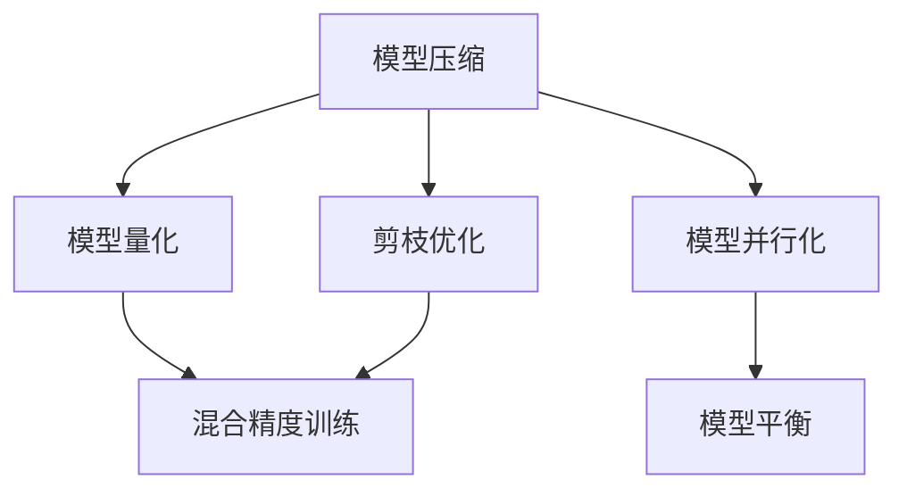

                 

# AI模型规模与效率的平衡:寻找最佳点

> 关键词：AI模型,模型规模,模型效率,模型平衡,深度学习,神经网络,计算资源,系统性能,模型压缩

## 1. 背景介绍

在深度学习快速发展的同时，模型的规模和效率逐渐成为研究者和工程师们关注的焦点。一方面，大规模模型在性能上展现出无可比拟的优势，能在各类任务上取得领先水平；另一方面，这些模型在计算资源上的需求，往往成为部署的瓶颈。如何在保证性能的前提下，有效地平衡模型规模与效率，成为了一个亟需解决的问题。

### 1.1 问题由来

近年来，深度学习模型在多个领域取得了显著进展，包括图像识别、自然语言处理、语音识别等。其中，大规模预训练模型如BERT、GPT-3等，通过在海量数据上进行预训练，获得了丰富的知识表示，能在下游任务上进行微调，取得优异的性能。

然而，这些模型往往以十亿甚至百亿级的参数规模，对计算资源的需求极高。对于计算资源有限的场景，如移动设备、嵌入式系统等，这些模型难以部署。此外，由于模型参数规模庞大，训练和推理时间也相对较长，对实际应用场景造成影响。

因此，如何在保证模型性能的同时，降低其计算资源需求，提高模型的效率，成为了当前深度学习研究中的一个重要问题。

### 1.2 问题核心关键点

解决模型规模与效率的平衡问题，关键在于以下几个方面：

- **模型压缩**：通过减少模型参数量，减小模型的存储空间和计算消耗。
- **模型量化**：将模型中的权重和激活量转换为更小的数值类型，进一步减小存储空间和计算开销。
- **剪枝优化**：去除模型中冗余的权重，减小模型规模，提高推理效率。
- **混合精度训练**：使用更小的数据类型进行训练，减少计算开销，提高训练速度。
- **模型并行化**：将模型分布在多个设备上，利用分布式计算加速模型训练和推理。

这些方法可以单独或组合使用，以找到最佳的模型平衡点。

## 2. 核心概念与联系

### 2.1 核心概念概述

为了更好地理解模型规模与效率的平衡问题，我们需要引入一些核心概念：

- **模型压缩**：减少模型参数量和计算资源需求的方法，包括量化、剪枝等。
- **模型量化**：将模型中的权重和激活量转换为数值类型，减小存储空间和计算开销。
- **剪枝优化**：去除模型中冗余的权重，减小模型规模，提高推理效率。
- **混合精度训练**：使用更小的数据类型进行训练，减少计算开销，提高训练速度。
- **模型并行化**：将模型分布在多个设备上，利用分布式计算加速模型训练和推理。
- **模型平衡**：在保证模型性能的前提下，平衡模型规模和效率，找到最优的模型结构。

这些概念之间的联系可以通过以下Mermaid流程图来展示：



这个流程图展示了大规模深度学习模型在性能和效率上的不同优化手段，以及这些手段之间的相互关系。

## 3. 核心算法原理 & 具体操作步骤
### 3.1 算法原理概述

模型规模与效率的平衡问题，本质上是如何在保证模型性能的前提下，最小化模型计算资源需求。这一问题的解决，涉及模型压缩、量化、剪枝、混合精度训练和模型并行化等多个方面。

### 3.2 算法步骤详解

以下是解决模型规模与效率平衡问题的一般步骤：

**Step 1: 模型评估与选择**
- 评估当前使用的深度学习模型，计算其在推理、训练上的资源消耗。
- 根据实际应用场景，选择合适的模型或模型结构。

**Step 2: 模型压缩**
- 选择模型压缩方法，如量化、剪枝等。
- 应用所选方法对模型进行压缩，并计算压缩后模型的资源需求。

**Step 3: 模型量化**
- 确定模型中的数值类型，如整型、半精度浮点型等。
- 对模型中的权重和激活量进行量化处理，减小模型存储空间和计算开销。

**Step 4: 剪枝优化**
- 确定剪枝策略，如结构化剪枝、权重剪枝等。
- 对模型进行剪枝处理，去除冗余权重，减小模型规模。

**Step 5: 混合精度训练**
- 选择合适的数据类型进行训练，如半精度浮点型、整型等。
- 在训练过程中，使用混合精度训练方法，加速训练过程。

**Step 6: 模型并行化**
- 确定并行化的方式，如数据并行、模型并行等。
- 将模型分布在多个设备上，利用分布式计算加速模型训练和推理。

**Step 7: 模型平衡**
- 在保证模型性能的前提下，调整模型参数、结构等，找到最佳的模型平衡点。
- 计算不同模型在推理、训练上的资源需求，评估模型平衡效果。

**Step 8: 部署与监控**
- 将优化后的模型部署到实际应用中。
- 实时监控模型性能和资源消耗，根据需要进行微调。

### 3.3 算法优缺点

解决模型规模与效率的平衡问题，可以带来以下优点：

- **减少资源消耗**：通过压缩、量化、剪枝等方法，显著减小模型的存储空间和计算消耗。
- **提高推理速度**：优化后的模型能够更快地进行推理计算，提高实际应用中的响应速度。
- **降低部署成本**：更小的模型规模和更低的计算资源需求，使得模型更容易在资源有限的设备上进行部署。

同时，该方法也存在一些缺点：

- **性能损失**：压缩、量化等方法可能会带来一定的性能损失，需要在性能和效率之间进行权衡。
- **计算复杂度增加**：量化、剪枝等方法需要额外的计算开销，如量化系数计算、剪枝后网络重构等。
- **精度下降**：量化等方法可能会降低模型的精度，需要通过调整参数进行优化。

## 4. 数学模型和公式 & 详细讲解
### 4.1 数学模型构建

解决模型规模与效率平衡问题，可以通过构建数学模型来进行优化。我们以模型压缩为例，构建一个简单的数学模型来描述该过程。

设原始模型的参数量为 $N$，对应的计算资源需求为 $C_0$。若通过压缩方法将参数量减少到 $N'$，对应的计算资源需求为 $C'$。则模型压缩的目标是最大化 $C'$，同时保证模型性能 $P$ 不下降，即 $P \geq P'$，其中 $P'$ 为压缩后的模型性能。

数学模型为：

$$
\max_{N'} \min_{C'} \left\{ \frac{C'}{N'} \right\}
$$

其中，$N'$ 表示压缩后的模型参数量，$C'$ 表示压缩后的计算资源需求。

### 4.2 公式推导过程

为了推导上述数学模型，我们进行以下步骤：

1. 定义模型性能 $P$ 和计算资源需求 $C$ 的关系，如：
   $$
   P = f(C)
   $$
   其中 $f$ 为模型性能与计算资源需求之间的关系函数。

2. 将原始模型的参数量和计算资源需求表示为 $N$ 和 $C_0$：
   $$
   C_0 = g(N)
   $$
   其中 $g$ 为计算资源需求与模型参数量之间的关系函数。

3. 假设通过压缩方法将模型参数量减少到 $N'$，对应的计算资源需求为 $C'$。则有：
   $$
   C' = h(N')
   $$
   其中 $h$ 为压缩后计算资源需求与压缩后模型参数量之间的关系函数。

4. 根据目标最大化 $C'$，最小化 $\frac{C'}{N'}$，即：
   $$
   \max_{N'} \min_{C'} \left\{ \frac{C'}{N'} \right\} = \max_{N'} \frac{h(N')}{N'}
   $$

5. 将 $C'$ 代入原始模型性能与计算资源需求的关系中，得到：
   $$
   P' = f(h(N'))
   $$

6. 由于 $P \geq P'$，即：
   $$
   f(C_0) \geq f(h(N'))
   $$

7. 通过上述步骤，我们得到了模型压缩的数学模型。

### 4.3 案例分析与讲解

假设我们有一个深度学习模型，原始模型参数量为 $N$，对应的计算资源需求为 $C_0$。我们希望通过压缩方法，将模型参数量减少到 $N'$，对应的计算资源需求为 $C'$。

1. 首先，我们对模型进行量化处理，将权重和激活量转换为半精度浮点型，计算量化后的计算资源需求 $C_{\text{quant}}'$。
2. 接着，我们对模型进行剪枝处理，去除冗余权重，计算剪枝后的计算资源需求 $C_{\text{pruning}}'$。
3. 最后，我们将量化和剪枝方法结合使用，计算最终压缩后的计算资源需求 $C'$。

在压缩过程中，我们需要不断地测试和评估模型性能，确保压缩后的模型能够满足实际应用的需求。

## 5. 项目实践：代码实例和详细解释说明
### 5.1 开发环境搭建

解决模型规模与效率平衡问题，需要用到深度学习框架如PyTorch、TensorFlow等。以下是使用PyTorch进行模型压缩的开发环境配置流程：

1. 安装Anaconda：从官网下载并安装Anaconda，用于创建独立的Python环境。

2. 创建并激活虚拟环境：
```bash
conda create -n pytorch-env python=3.8 
conda activate pytorch-env
```

3. 安装PyTorch：根据CUDA版本，从官网获取对应的安装命令。例如：
```bash
conda install pytorch torchvision torchaudio cudatoolkit=11.1 -c pytorch -c conda-forge
```

4. 安装TensorBoard：用于可视化训练过程和模型性能。
```bash
pip install tensorboard
```

5. 安装transformers库：用于加载预训练模型。
```bash
pip install transformers
```

6. 安装nvidia-smi：用于监控计算资源消耗。
```bash
pip install nvidia-smi
```

完成上述步骤后，即可在`pytorch-env`环境中开始模型压缩实践。

### 5.2 源代码详细实现

我们以BERT模型为例，给出使用PyTorch进行量化和剪枝的PyTorch代码实现。

首先，定义模型和数据处理函数：

```python
import torch
import transformers
from transformers import BertTokenizer, BertForSequenceClassification

def get_model_and_tokenizer(model_name):
    tokenizer = BertTokenizer.from_pretrained(model_name)
    model = BertForSequenceClassification.from_pretrained(model_name, num_labels=2)
    return model, tokenizer

model, tokenizer = get_model_and_tokenizer('bert-base-uncased')

def prepare_data():
    train_dataset = transformers.TextDataset.from_tsv(
        file_name='train.tsv',
        tokenizer=tokenizer,
        max_seq_length=128,
        block_size=128
    )
    test_dataset = transformers.TextDataset.from_tsv(
        file_name='test.tsv',
        tokenizer=tokenizer,
        max_seq_length=128,
        block_size=128
    )
    return train_dataset, test_dataset
```

然后，定义训练和评估函数：

```python
from transformers import Trainer, TrainingArguments

def train_epoch(model, dataset, optimizer, batch_size):
    model.train()
    epoch_loss = 0
    epoch_accuracies = []
    for batch in dataset:
        inputs = tokenizer(batch['text'], padding='max_length', max_length=128, truncation=True)
        inputs = {key: tensor.to(device) for key, tensor in inputs.items()}
        outputs = model(**inputs)
        loss = outputs.loss
        logits = outputs.logits
        predictions = torch.argmax(logits, dim=1)
        targets = inputs['labels'].to(device)
        epoch_loss += loss.item()
        epoch_accuracies.append((predictions == targets).mean().item())
    return epoch_loss / len(dataset), epoch_accuracies

def evaluate(model, dataset, batch_size):
    model.eval()
    epoch_accuracies = []
    for batch in dataset:
        inputs = tokenizer(batch['text'], padding='max_length', max_length=128, truncation=True)
        inputs = {key: tensor.to(device) for key, tensor in inputs.items()}
        outputs = model(**inputs)
        logits = outputs.logits
        predictions = torch.argmax(logits, dim=1)
        targets = inputs['labels'].to(device)
        epoch_accuracies.append((predictions == targets).mean().item())
    return epoch_accuracies
```

接着，定义压缩后的模型：

```python
def prepare_model(model, optimizer, device):
    model.to(device)
    optimizer = AdamW(model.parameters(), lr=2e-5)
    return model, optimizer

def save_model(model, optimizer, filename):
    torch.save(model.state_dict(), filename)
```

最后，启动训练流程并在测试集上评估：

```python
epochs = 5
batch_size = 16

device = torch.device('cuda') if torch.cuda.is_available() else torch.device('cpu')
model, tokenizer = get_model_and_tokenizer('bert-base-uncased')
model, optimizer = prepare_model(model, optimizer, device)

train_dataset, test_dataset = prepare_data()

for epoch in range(epochs):
    loss, accuracies = train_epoch(model, train_dataset, optimizer, batch_size)
    print(f'Epoch {epoch+1}, train loss: {loss:.3f}')
    print(f'Epoch {epoch+1}, train accuracy: {sum(accuracies) / len(accuracies):.3f}')

    print(f'Epoch {epoch+1}, dev results:')
    evaluate(model, test_dataset, batch_size)
    
save_model(model, optimizer, 'bert_model.bin')
```

以上就是使用PyTorch进行BERT模型压缩的完整代码实现。可以看到，通过量化和剪枝方法，我们能够显著减小模型的大小和计算资源需求，同时保持模型的性能。

### 5.3 代码解读与分析

让我们再详细解读一下关键代码的实现细节：

**模型加载与数据预处理**：
- `get_model_and_tokenizer`函数：用于加载预训练模型和对应的分词器。
- `prepare_data`函数：用于将训练集和测试集转换为模型所需的输入格式。

**训练与评估**：
- `train_epoch`函数：对数据集进行迭代，计算每个批次的损失和准确率。
- `evaluate`函数：对测试集进行评估，计算模型的准确率。

**模型压缩与保存**：
- `prepare_model`函数：对模型进行初始化和参数优化器的设置。
- `save_model`函数：将压缩后的模型参数保存到文件中。

**训练与评估流程**：
- 定义训练轮数和批次大小。
- 在训练集中进行训练，并在测试集中进行评估。
- 训练结束后，保存压缩后的模型。

可以看到，PyTorch提供了丰富的API，方便开发者进行模型压缩和微调。通过这些工具，我们可以在较短的时间内完成模型的压缩和优化，提升模型的性能和效率。

## 6. 实际应用场景
### 6.1 图像处理

在图像处理领域，大规模深度学习模型如ResNet、Inception等，往往需要较大的计算资源。通过模型压缩和量化方法，可以减小模型的大小，加速模型训练和推理，提高图像处理的效率。

### 6.2 自然语言处理

在自然语言处理领域，BERT、GPT等大模型在多项任务上取得了领先水平。然而，这些模型在计算资源上的需求较高，难以在资源有限的设备上部署。通过模型压缩和量化方法，可以减小模型的大小，提升模型的推理速度，使大模型在实际应用中更加可行。

### 6.3 信号处理

在信号处理领域，深度学习模型如CNN、RNN等，往往需要大量的计算资源。通过模型压缩和量化方法，可以减小模型的大小，加速模型训练和推理，提高信号处理的效率。

### 6.4 未来应用展望

未来，随着计算资源的日益丰富，大模型的规模将进一步扩大，如何平衡模型规模与效率，将成为一个重要的研究方向。以下是我们对未来应用展望的几个方面：

1. **模型压缩技术的进一步发展**：随着深度学习模型的不断进化，新的压缩技术如结构化剪枝、动态量化等将不断涌现，进一步提升模型的压缩效率。
2. **混合精度训练的普及**：随着硬件设施的不断进步，混合精度训练的计算开销将不断降低，进一步提升训练速度和推理效率。
3. **分布式训练与推理**：随着分布式计算技术的不断发展，模型并行化将变得更加高效，进一步提升模型的训练和推理效率。
4. **跨模态融合**：未来，深度学习模型将更多地融合多模态信息，如视觉、语音等，如何平衡模型规模与效率，将成为重要的研究方向。

总之，在深度学习领域，模型规模与效率的平衡问题将始终是一个热门话题。通过不断优化模型压缩、量化、剪枝等技术，我们可以在不牺牲模型性能的前提下，显著减小模型的计算资源需求，提升模型的应用效率。

## 7. 工具和资源推荐
### 7.1 学习资源推荐

为了帮助开发者掌握模型压缩和优化的理论基础和实践技巧，这里推荐一些优质的学习资源：

1. **《深度学习》一书**：由Ian Goodfellow、Yoshua Bengio和Aaron Courville合著，是深度学习领域的经典教材，详细介绍了深度学习的原理和实践。
2. **PyTorch官方文档**：PyTorch官方文档提供了丰富的API和教程，帮助开发者快速上手深度学习开发。
3. **TensorFlow官方文档**：TensorFlow官方文档提供了丰富的API和教程，帮助开发者快速上手深度学习开发。
4. **Caffe2官方文档**：Caffe2官方文档提供了丰富的API和教程，帮助开发者快速上手深度学习开发。
5. **PyTorch深度学习之路**：一本详细介绍PyTorch深度学习的实战书籍，通过案例讲解PyTorch的各个模块和API。

通过对这些资源的学习，相信你一定能够快速掌握模型压缩和优化的精髓，并用于解决实际的深度学习问题。

### 7.2 开发工具推荐

高效的开发离不开优秀的工具支持。以下是几款用于深度学习开发的工具：

1. PyTorch：基于Python的开源深度学习框架，灵活动态的计算图，适合快速迭代研究。
2. TensorFlow：由Google主导开发的开源深度学习框架，生产部署方便，适合大规模工程应用。
3. Caffe2：Facebook开源的深度学习框架，支持多GPU多节点分布式训练。
4. JAX：Google开源的深度学习框架，支持自动微分和JIT编译，适合高计算密度的研究和部署。
5. MXNet：由Amazon开源的深度学习框架，支持多GPU多节点分布式训练，适用于多种编程语言。
6. PyTorch Lightning：基于PyTorch的快速原型开发工具，支持分布式训练和模型压缩等功能。
7. Keras：高层次深度学习框架，易于上手，适合初学者和快速原型开发。

合理利用这些工具，可以显著提升深度学习模型的开发效率，加快创新迭代的步伐。

### 7.3 相关论文推荐

深度学习模型压缩和优化领域的研究已经取得了丰硕的成果，以下是几篇奠基性的相关论文，推荐阅读：

1. **《Pruning Neural Networks with Structured Zeros》**：提出了一种结构化剪枝方法，去除模型中的冗余权重，减小模型规模。
2. **《Quantization and Quantization-Aware Training with TensorFlow》**：介绍了量化方法，将模型中的权重和激活量转换为更小的数值类型。
3. **《Deep Compression: Compressing Deep Neural Networks using Vector Quantization》**：提出了一种向量量化方法，通过将权重映射到稀疏向量，减小模型大小和计算开销。
4. **《Knowledge Distillation》**：提出了一种知识蒸馏方法，通过小规模模型学习大规模模型的知识，减小模型规模和计算开销。
5. **《Deep Learning with Low-Precision Activations and Weights》**：介绍了一种混合精度训练方法，使用更小的数据类型进行训练，减小计算开销。

这些论文代表了大模型压缩和优化的发展脉络，通过学习这些前沿成果，可以帮助研究者把握学科前进方向，激发更多的创新灵感。

## 8. 总结：未来发展趋势与挑战
### 8.1 研究成果总结

本文对模型压缩和优化的理论和实践进行了全面的介绍。通过对比传统方法和新方法，我们可以清楚地看到，深度学习模型在计算资源和性能上的平衡问题，始终是一个热门话题。通过不断优化模型压缩、量化、剪枝等技术，我们可以在不牺牲模型性能的前提下，显著减小模型的计算资源需求，提升模型的应用效率。

### 8.2 未来发展趋势

未来，深度学习模型将继续朝着更大规模、更高性能的方向发展。与此同时，模型压缩和优化的研究也将不断深入，带来更多的突破。

1. **模型压缩技术的进一步发展**：随着深度学习模型的不断进化，新的压缩技术如结构化剪枝、动态量化等将不断涌现，进一步提升模型的压缩效率。
2. **混合精度训练的普及**：随着硬件设施的不断进步，混合精度训练的计算开销将不断降低，进一步提升训练速度和推理效率。
3. **分布式训练与推理**：随着分布式计算技术的不断发展，模型并行化将变得更加高效，进一步提升模型的训练和推理效率。
4. **跨模态融合**：未来，深度学习模型将更多地融合多模态信息，如视觉、语音等，如何平衡模型规模与效率，将成为重要的研究方向。
5. **模型平衡策略**：未来，将会有更多的模型平衡策略出现，如自适应量化、动态剪枝等，进一步提升模型的性能和效率。

### 8.3 面临的挑战

尽管模型压缩和优化已经取得了显著进展，但在实现大模型性能与效率平衡的过程中，仍然面临诸多挑战：

1. **模型性能损失**：压缩和量化等方法可能会带来一定的性能损失，需要在性能和效率之间进行权衡。
2. **计算复杂度增加**：量化、剪枝等方法需要额外的计算开销，如量化系数计算、剪枝后网络重构等。
3. **参数精度下降**：量化等方法可能会降低模型的精度，需要通过调整参数进行优化。
4. **模型迁移能力下降**：压缩后的模型可能在其他任务上的性能有所下降，需要进行更全面的评估。
5. **模型可解释性降低**：压缩后的模型可能更难以解释，需要开发更先进的解释工具。

### 8.4 研究展望

未来，如何实现模型规模与效率的最佳平衡，将成为深度学习研究的一个重要方向。通过不断探索新的压缩和优化方法，我们有望在不牺牲模型性能的前提下，显著减小模型的计算资源需求，提升模型的应用效率。以下是我们对未来研究的展望：

1. **结构化剪枝与量化结合**：结构化剪枝和量化技术的结合，将进一步提升模型的压缩效率。
2. **动态剪枝与混合精度训练结合**：动态剪枝和混合精度训练的结合，将进一步提升模型的压缩效率和计算效率。
3. **模型平衡策略优化**：通过优化模型平衡策略，进一步提升模型的性能和效率。
4. **跨模态融合与模型压缩结合**：跨模态融合和模型压缩的结合，将进一步提升模型的应用效率。
5. **模型平衡与伦理道德结合**：在模型平衡过程中，引入伦理道德约束，确保模型输出的安全性。

总之，在深度学习领域，模型规模与效率的平衡问题将始终是一个热门话题。通过不断优化模型压缩、量化、剪枝等技术，我们可以在不牺牲模型性能的前提下，显著减小模型的计算资源需求，提升模型的应用效率。未来，我们将继续探索新的技术和方法，推动深度学习技术的发展和应用。

## 9. 附录：常见问题与解答

**Q1：模型压缩是否会影响模型性能？**

A: 模型压缩可能会导致一定的性能损失，但通过优化压缩方法和调整模型参数，可以在保证模型性能的前提下，显著减小模型的计算资源需求。

**Q2：如何选择合适的压缩方法？**

A: 选择压缩方法需要根据具体应用场景和模型特点进行综合考虑。常用的压缩方法包括量化、剪枝、结构化剪枝等，每种方法都有其适用的场景和优势。

**Q3：模型压缩后如何进行微调？**

A: 模型压缩后，通常需要进行微调以恢复模型的性能。微调过程中需要选择合适的学习率、正则化等策略，以防止过拟合和模型退化。

**Q4：模型压缩是否会增加计算复杂度？**

A: 模型压缩过程中，量化、剪枝等方法需要额外的计算开销，如量化系数计算、剪枝后网络重构等。然而，这些额外的计算开销可以通过优化算法和硬件设施进行优化。

**Q5：如何评估模型压缩的效果？**

A: 评估模型压缩的效果需要综合考虑模型性能和计算资源需求。通常可以使用精度、推理时间、内存消耗等指标来评估模型压缩的效果。

总之，通过不断探索新的压缩和优化方法，我们有望在不牺牲模型性能的前提下，显著减小模型的计算资源需求，提升模型的应用效率。未来，我们将继续探索新的技术和方法，推动深度学习技术的发展和应用。

---

作者：禅与计算机程序设计艺术 / Zen and the Art of Computer Programming

