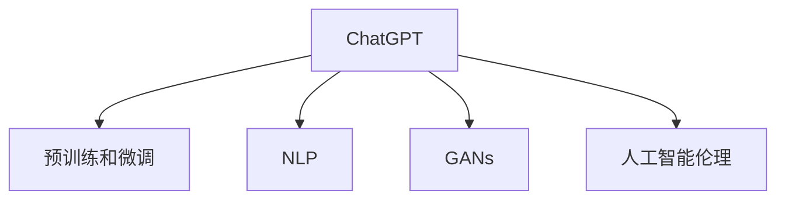

                 

# AI浪潮的持续影响：超出预期，ChatGPT的局限性与AI行业的自我修正

## 1. 背景介绍

### 1.1 问题由来

自2023年初以来，由OpenAI开发的自然语言处理模型ChatGPT迅速席卷全球，成为了现象级应用，引发了广泛关注和深入讨论。ChatGPT的出现，不仅标志着自然语言处理技术的飞跃发展，也揭示了人工智能(AI)领域内外的诸多问题。这些问题不仅关系到技术发展的前景，更影响着社会和行业的未来走向。因此，深入探讨ChatGPT的局限性及其背后AI行业的自我修正，显得尤为重要。

### 1.2 问题核心关键点

ChatGPT及其背后的AI技术发展，引发了多个核心问题的讨论：

1. **模型的准确性与泛化能力**：ChatGPT在生成文本和回答问题方面表现出色，但模型的泛化能力和准确性仍需改进。
2. **内容的真实性与可信度**：AI生成的文本内容可能包含错误或偏见，对信息真实性带来挑战。
3. **道德与伦理问题**：AI在处理敏感信息、决策过程透明性等方面面临伦理道德的质疑。
4. **安全性与隐私保护**：AI模型的安全性和用户隐私保护成为关注焦点，尤其是在生成恶意代码和泄露敏感信息方面的潜在风险。
5. **技术与社会影响**：AI技术的广泛应用对教育、就业、社会治理等多个领域产生深远影响，需要综合考虑。

本文旨在深入剖析这些核心问题，并探讨AI行业的自我修正策略。

## 2. 核心概念与联系

### 2.1 核心概念概述

为更好地理解ChatGPT及其局限性，本文将介绍几个关键概念：

- **ChatGPT**：OpenAI开发的自然语言处理模型，基于深度学习和自监督学习技术，具有强大的文本生成和理解能力。
- **预训练和微调**：AI模型的常见训练方式，预训练在大规模数据上进行，微调在特定任务上进行优化。
- **自然语言处理(NLP)**：研究计算机如何处理、理解和生成人类语言的技术领域。
- **生成对抗网络(GANs)**：一种生成模型，用于生成逼真的人工数据。
- **人工智能伦理**：涉及AI应用中的道德、法律和社会问题，包括透明度、公平性、责任归属等。

这些核心概念之间的联系可以通过以下Mermaid流程图来展示：



这个流程图展示了大语言模型ChatGPT的核心概念及其相互关系：

1. ChatGPT基于预训练和微调技术，通过大规模无标签文本数据预训练获得基础能力，再通过特定任务微调优化性能。
2. 自然语言处理是ChatGPT的核心应用领域，涉及到文本生成、理解、情感分析等多个任务。
3. 生成对抗网络是预训练的一部分，用于生成更逼真的训练数据。
4. 人工智能伦理是ChatGPT应用时需关注的重要方面，包括确保模型输出内容的真实性和安全性等。

## 3. 核心算法原理 & 具体操作步骤

### 3.1 算法原理概述

ChatGPT的算法原理主要包括：

1. **预训练**：在大规模无标签文本数据上进行自监督学习，学习通用的语言表示。
2. **微调**：在特定任务上进行有监督学习，通过少量标注数据优化模型，使其能够完成特定任务。
3. **生成模型**：利用Transformer架构，通过自回归生成方式，根据给定的前文生成后文。

### 3.2 算法步骤详解

ChatGPT的微调过程一般包括以下几个关键步骤：

**Step 1: 准备预训练模型和数据集**

- 选择合适的预训练语言模型，如GPT-4。
- 准备下游任务的数据集，如问答数据集、文本生成数据集等。

**Step 2: 添加任务适配层**

- 根据任务类型，在预训练模型顶层设计合适的输出层和损失函数。
- 对于分类任务，通常使用softmax分类器。
- 对于生成任务，通常使用基于负对数似然的损失函数。

**Step 3: 设置微调超参数**

- 选择合适的优化算法及其参数，如Adam、SGD等。
- 设置学习率、批大小、迭代轮数等。

**Step 4: 执行梯度训练**

- 将训练集数据分批次输入模型，前向传播计算损失函数。
- 反向传播计算参数梯度，根据设定的优化算法和学习率更新模型参数。
- 周期性在验证集上评估模型性能，根据性能指标决定是否触发Early Stopping。
- 重复上述步骤直到满足预设的迭代轮数或Early Stopping条件。

**Step 5: 测试和部署**

- 在测试集上评估微调后模型。
- 使用微调后的模型对新样本进行推理预测，集成到实际的应用系统中。

### 3.3 算法优缺点

ChatGPT及其背后的预训练微调技术具有以下优点：

1. **高效性**：只需少量标注数据，即可通过微调快速适配特定任务。
2. **泛化能力**：预训练模型在大规模数据上学习到通用的语言知识，适用于多种任务。
3. **可解释性**：通过任务适配层的设计，可以直观了解模型决策过程。

同时，也存在一些缺点：

1. **数据依赖**：微调效果依赖于标注数据的质量和数量，标注数据获取成本高。
2. **偏见问题**：预训练模型可能学习到数据中的偏见，微调过程难以完全消除。
3. **可控性**：生成的内容难以完全控制，存在误导性或有害信息风险。
4. **计算资源需求高**：大规模预训练和微调需要高算力支持。

### 3.4 算法应用领域

ChatGPT的预训练微调技术已在多个领域得到应用，包括：

1. **自然语言理解**：如文本分类、命名实体识别、情感分析等。
2. **文本生成**：如自动摘要、对话生成、新闻生成等。
3. **信息检索**：如问答系统、搜索引擎等。
4. **自然语言推理**：如文本匹配、逻辑推理等。
5. **代码生成**：如智能编程助手、代码自动补全等。

## 4. 数学模型和公式 & 详细讲解 & 举例说明

### 4.1 数学模型构建

ChatGPT的数学模型构建主要基于Transformer架构，使用自回归生成方式。假设预训练模型为 $M_{\theta}$，其中 $\theta$ 为模型参数。下游任务为文本生成，目标函数为负对数似然：

$$
\mathcal{L}(\theta) = -\frac{1}{N}\sum_{i=1}^N \log p(x_i | x_{< i})
$$

其中 $x_i$ 为输入序列，$x_{< i}$ 为序列的前文部分。

### 4.2 公式推导过程

以文本生成任务为例，模型前向传播的计算过程如下：

1. 输入序列 $x_1, x_2, \ldots, x_t$，将前文 $x_{< i}$ 作为模型的输入。
2. 通过Transformer模型计算每个位置的条件概率 $p(x_i | x_{< i})$。
3. 以当前位置的概率作为下一个位置的输入，不断递推计算整个序列的概率。
4. 模型输出的概率分布即为生成文本的候选。

### 4.3 案例分析与讲解

考虑一个简单的文本生成任务，如根据前文“今天天气不错”生成后文。首先，通过预训练模型计算每个词汇的条件概率，然后根据这些概率生成后文。例如，模型预测“适合去公园”作为后文，其概率为 $p(\text{适合去公园} | \text{今天天气不错})$。通过不断递推计算，可以得到完整的文本序列。

## 5. 项目实践：代码实例和详细解释说明

### 5.1 开发环境搭建

在进行ChatGPT项目实践前，需要先准备开发环境：

1. 安装Python和相关依赖：
```bash
pip install torch transformers
```

2. 搭建GPU环境：
```bash
pip install torch torchvision torchaudio -f https://download.pytorch.org/whl/nightly/cu123/torch_stable.html
```

### 5.2 源代码详细实现

以下是使用PyTorch和Transformers库实现简单文本生成的代码：

```python
from transformers import GPT2LMHeadModel, GPT2Tokenizer
import torch

tokenizer = GPT2Tokenizer.from_pretrained('gpt2')
model = GPT2LMHeadModel.from_pretrained('gpt2')

def generate_text(prompt, num_tokens=50):
    inputs = tokenizer(prompt, return_tensors='pt')
    outputs = model.generate(inputs.input_ids, max_length=num_tokens, temperature=0.7, top_p=0.9, do_sample=True)
    return tokenizer.decode(outputs[0])

result = generate_text("今天天气不错")
print(result)
```

### 5.3 代码解读与分析

1. **模型加载**：使用GPT2预训练模型和对应的tokenizer，加载到PyTorch环境中。
2. **输入处理**：将输入文本“今天天气不错”转化为模型的token ids。
3. **生成文本**：调用模型生成指定长度的文本，并使用temperature和top_p参数控制生成文本的随机性。
4. **输出解码**：将模型生成的token ids转化为自然语言文本。

### 5.4 运行结果展示

运行上述代码，将输出一段基于“今天天气不错”的生成文本，例如：

```
适合去公园，鸟语花香，心情好极了。
```

## 6. 实际应用场景

### 6.1 智能客服系统

ChatGPT在智能客服系统中可以扮演重要角色，提供24小时在线客服，处理用户咨询。其生成的回答自然流畅，能够理解用户意图，解答常见问题，并在必要时提供多轮对话支持。此外，ChatGPT还可以集成到企业知识库中，利用知识图谱增强回答的准确性和一致性。

### 6.2 金融舆情监测

在金融领域，ChatGPT可用于舆情监测和风险预警。通过爬取新闻、社交媒体等数据，生成金融市场动态，识别风险信号，自动生成警报。ChatGPT还可以用于金融知识的普及和教育，帮助用户理解复杂的金融概念。

### 6.3 个性化推荐系统

ChatGPT在推荐系统中也具有应用潜力，通过分析用户历史行为和兴趣，生成个性化的商品或内容推荐。与传统的基于规则或协同过滤推荐相比，ChatGPT生成的推荐更加自然，更能满足用户个性化需求。

### 6.4 未来应用展望

未来，ChatGPT有望在更多领域发挥作用，如教育、医疗、法律、艺术等。其应用将不再局限于单一任务，而是成为多任务、跨领域智能助手，提供更加全面的智能服务。

## 7. 工具和资源推荐

### 7.1 学习资源推荐

为了帮助开发者深入理解ChatGPT及其应用，推荐以下学习资源：

1. **官方文档**：OpenAI和HuggingFace提供的官方文档，详细介绍了ChatGPT模型的架构、参数调优和应用案例。
2. **教程和课程**：如Stanford CS224N课程、《Transformer: A Survey》等，深入讲解Transformer架构和预训练微调技术。
3. **书籍**：《深度学习与自然语言处理》、《生成对抗网络》等，系统介绍生成模型和GANs的应用。
4. **在线平台**：如Google Colab、Kaggle等，提供丰富的实验资源和数据集。

### 7.2 开发工具推荐

1. **PyTorch**：优秀的深度学习框架，支持动态图，适用于快速迭代开发。
2. **TensorFlow**：由Google开发的深度学习框架，适用于大规模工程应用。
3. **Transformers库**：HuggingFace开发的NLP工具库，集成了多个预训练模型，便于微调开发。
4. **Jupyter Notebook**：便捷的交互式开发环境，支持Python代码的快速编写和测试。

### 7.3 相关论文推荐

1. **Attention is All You Need**：Transformer架构的原始论文，奠定了现代NLP模型的基础。
2. **BERT: Pre-training of Deep Bidirectional Transformers for Language Understanding**：BERT模型的论文，展示了预训练大模型的潜力。
3. **GPT-3: Language Models are Unsupervised Multitask Learners**：GPT-3模型的论文，展示了超大规模语言模型的强大能力。
4. **AdaLoRA: Adaptive Low-Rank Adaptation for Parameter-Efficient Fine-Tuning**：介绍了一种参数高效微调的方法，显著减少了微调过程中对计算资源的消耗。

## 8. 总结：未来发展趋势与挑战

### 8.1 研究成果总结

本文从ChatGPT的算法原理、操作步骤和应用场景等方面，深入探讨了其技术细节和局限性。ChatGPT作为预训练大语言模型的代表，展示了AI技术在自然语言处理领域的巨大潜力。然而，其应用过程中也暴露出一些问题，如数据依赖、偏见问题、可控性等，需要在未来研究和应用中加以改进。

### 8.2 未来发展趋势

未来，ChatGPT和类似的大语言模型将在以下领域继续发展：

1. **多模态融合**：结合图像、视频、语音等多模态数据，提升模型的理解和生成能力。
2. **自监督学习**：通过无监督学习获取更多知识，减少对标注数据的依赖。
3. **参数高效微调**：开发更多参数高效微调方法，提升模型性能和资源利用效率。
4. **模型压缩与优化**：通过模型压缩和量化等技术，降低模型计算和存储需求。
5. **跨领域应用**：扩展应用领域，如法律、医疗、教育等，提供更加广泛的智能服务。

### 8.3 面临的挑战

ChatGPT在发展过程中也面临诸多挑战：

1. **数据隐私与安全**：AI模型生成内容可能包含敏感信息，数据隐私和安全问题亟需解决。
2. **伦理与法律**：AI模型在决策过程的透明度、公平性、责任归属等方面存在伦理问题。
3. **计算资源需求**：大规模预训练和微调需要高算力支持，计算成本高。
4. **模型偏见与歧视**：预训练模型可能学习到数据中的偏见，影响模型公正性。

### 8.4 研究展望

未来的研究需要在以下几个方面进行探索：

1. **数据隐私保护**：开发隐私保护技术，确保AI模型生成内容的隐私性。
2. **公平性与透明性**：研究AI模型决策过程的公平性和透明性，确保模型输出符合伦理道德。
3. **计算资源优化**：优化模型结构和训练过程，降低计算成本。
4. **多模态融合技术**：结合多模态数据，提升模型的综合理解和生成能力。
5. **跨领域应用拓展**：将AI技术应用于更多领域，如医疗、教育、法律等，提升社会效益。

## 9. 附录：常见问题与解答

**Q1: ChatGPT生成的文本质量如何保证？**

A: ChatGPT生成的文本质量通过以下方法保证：
1. 预训练模型在大规模数据上进行学习，学习到通用的语言知识。
2. 微调过程使用特定任务的数据，优化模型在该任务上的表现。
3. 参数高效的微调方法，如Adapter、LoRA等，可以在保持性能的同时减少计算资源消耗。
4. 生成模型的自回归方式，确保生成的文本具有连贯性和逻辑性。

**Q2: 如何避免ChatGPT生成的文本包含偏见和有害信息？**

A: 避免ChatGPT生成的文本包含偏见和有害信息，需要以下措施：
1. 使用多样化的数据进行预训练，减少模型偏见。
2. 在微调过程中加入对抗训练，检测并修正生成文本中的偏见和有害信息。
3. 设计任务适配层时加入伦理导向的约束，引导模型输出符合伦理道德的文本。
4. 建立人工审核机制，对生成文本进行定期审查，确保其内容的公正性和无害性。

**Q3: 如何提高ChatGPT的生成效率和计算效率？**

A: 提高ChatGPT的生成效率和计算效率，需要以下方法：
1. 使用参数高效的微调方法，如Adapter、LoRA等，减少微调过程中计算资源的消耗。
2. 采用混合精度训练、梯度累加等技术，提高训练和推理效率。
3. 利用预训练模型压缩和量化技术，减少模型计算和存储需求。
4. 优化模型的并行化计算，提高训练和推理速度。

**Q4: 如何保证ChatGPT生成的文本内容的真实性？**

A: 保证ChatGPT生成的文本内容的真实性，需要以下措施：
1. 在数据收集和预处理阶段，确保数据来源的可靠性和真实性。
2. 在微调过程中，加入对抗训练和数据增强技术，提高模型的鲁棒性和泛化能力。
3. 设计任务适配层时加入真实性评估指标，确保模型生成的文本符合现实世界的真实情况。
4. 建立人工审核机制，对生成文本进行定期审查，确保其内容的真实性和准确性。

---

作者：禅与计算机程序设计艺术 / Zen and the Art of Computer Programming

