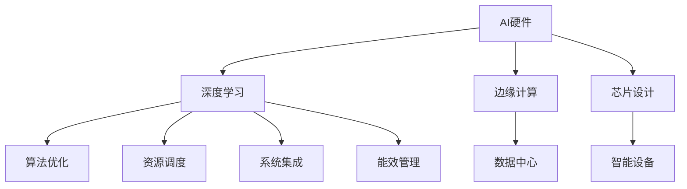

                 

# AI硬件与算法的协同设计:未来发展方向

> 关键词：AI硬件, 算法优化, 深度学习, 边缘计算, 芯片设计, 数据中心, 智能设备

## 1. 背景介绍

### 1.1 问题由来
随着人工智能(AI)技术的迅猛发展，AI硬件和算法的协同设计成为智能时代的关键议题。AI算法依赖于硬件的支持才能发挥其高效计算和处理能力。然而，当前的AI硬件和算法往往存在适配性差、能效比低、扩展性有限等问题，导致实际应用中的性能瓶颈问题。因此，如何实现AI硬件与算法的深度协同，提升系统性能和应用效率，成为AI系统设计的核心挑战。

### 1.2 问题核心关键点
AI硬件与算法协同设计主要包括以下几个核心关键点：

- **硬件架构**：决定AI系统的计算、存储、通信能力。包括CPU、GPU、TPU、FPGA等硬件架构的设计与优化。
- **算法优化**：针对特定硬件架构进行算法优化，提升模型性能和计算效率。
- **资源调度**：合理调度算法与硬件资源，最大化硬件利用率和系统吞吐量。
- **系统集成**：将算法和硬件紧密结合，构建高效、稳定、可扩展的AI系统。
- **能效管理**：在保证性能的前提下，实现算力和功耗的合理平衡。

这些关键点紧密联系，共同构成了AI硬件与算法协同设计的完整框架，是提升AI系统整体效能的基础。

## 2. 核心概念与联系

### 2.1 核心概念概述

为更好地理解AI硬件与算法协同设计的方法，本节将介绍几个密切相关的核心概念：

- **AI硬件**：指专门用于AI模型训练和推理的硬件设施。主要包括CPU、GPU、TPU、FPGA、ASIC等。
- **深度学习**：一种基于神经网络的机器学习技术，用于解决图像识别、自然语言处理、语音识别等复杂问题。
- **边缘计算**：指在网络边缘设备上进行的计算和数据处理，以减少数据传输和降低延迟。
- **芯片设计**：涵盖半导体材料、电路设计、封装测试等，是AI硬件的基础。
- **数据中心**：用于集中存储和处理海量数据，提供高性能计算资源。
- **智能设备**：嵌入AI算法的嵌入式硬件设备，如智能手机、智能家居等。

这些概念之间的逻辑关系可以通过以下Mermaid流程图来展示：

这个流程图展示了几组核心概念之间的关系：

1. AI硬件通过深度学习算法实现计算和推理。
2. 边缘计算可以借助AI硬件，在数据源处进行本地处理。
3. 芯片设计是AI硬件制造的基础。
4. 数据中心提供大规模计算和存储资源。
5. 智能设备将AI算法嵌入硬件，实现实时应用。
6. 算法优化、资源调度、系统集成和能效管理确保AI硬件与算法的深度协同。

## 3. 核心算法原理 & 具体操作步骤
### 3.1 算法原理概述

AI硬件与算法协同设计的核心在于通过合理配置硬件资源，优化算法设计，提升系统的整体性能。具体来说，包括：

- 硬件适配：根据不同算法和应用场景，选择适合的硬件架构。
- 算法优化：针对硬件特点，优化算法结构、参数和激活函数，提升模型精度和速度。
- 资源调度：动态调整算法执行的硬件资源，确保最优性能和能效。
- 系统集成：将硬件和软件进行无缝集成，构建高效的AI系统。
- 能效管理：在硬件设计中引入能效优化技术，如异步计算、低功耗设计等。

### 3.2 算法步骤详解

AI硬件与算法协同设计一般包括以下几个关键步骤：

**Step 1: 硬件选型与优化**
- 根据算法复杂度和应用场景，选择适合的硬件架构。如GPU适合深度学习训练，TPU适合大规模矩阵计算。
- 针对硬件特点进行优化，如GPU的异步计算、CPU的并行执行等。

**Step 2: 算法适配与优化**
- 将算法适配到目标硬件，如将深度学习模型转换为TensorFlow Lite格式运行在移动设备上。
- 优化算法参数和结构，如调整卷积层、池化层的尺寸，使用高精度计算和低精度计算的混合。

**Step 3: 资源调度与优化**
- 动态调度算法执行的硬件资源，如GPU集群管理、多核并行等。
- 优化任务调度算法，如公平调度、优先级调度等，提升系统吞吐量和响应速度。

**Step 4: 系统集成与优化**
- 将算法与硬件进行集成，构建高效的AI系统。
- 优化系统架构，如微服务架构、微核架构等，提高系统的可扩展性和维护性。

**Step 5: 能效管理与优化**
- 在硬件设计中引入能效优化技术，如异步计算、低功耗设计等。
- 优化算法和系统的能效，如使用模型压缩、量化、剪枝等技术，降低功耗和资源占用。

### 3.3 算法优缺点

AI硬件与算法协同设计具有以下优点：
1. 提高性能和效率。通过硬件和算法的深度协同，提升系统的计算速度和处理能力。
2. 降低成本和能耗。优化硬件和算法设计，实现更高效的资源利用，降低系统成本和能耗。
3. 增强可扩展性。系统可以根据应用需求动态调整硬件和算法资源，实现灵活扩展。
4. 提升系统稳定性。通过合理调度和优化，避免硬件和算法间的冲突，提升系统稳定性。

同时，该方法也存在一定的局限性：
1. 硬件和算法适配难度大。不同的硬件架构和算法模型需要特定的适配策略，实施难度较高。
2. 优化空间有限。硬件和算法的优化空间有限，难以进一步提升性能。
3. 开发复杂度高。涉及硬件和算法的协同优化，开发难度和复杂度较高。
4. 系统兼容性问题。硬件和算法之间的兼容性和协同优化可能导致系统不兼容或性能下降。

尽管存在这些局限性，但就目前而言，AI硬件与算法协同设计仍是提升AI系统性能和应用效率的重要手段。未来相关研究的重点在于如何进一步降低适配难度，提高优化空间，简化开发过程，并确保系统兼容性。

### 3.4 算法应用领域

AI硬件与算法协同设计在多个领域得到了广泛的应用，具体包括：

- **数据中心**：采用AI硬件加速深度学习模型训练和推理，提升计算和存储效率。
- **智能设备**：将AI算法嵌入硬件芯片，实现实时应用，如智能手机、智能家居等。
- **自动驾驶**：利用AI硬件和算法实现实时环境感知、决策和控制，提升行车安全性和效率。
- **医疗影像**：采用AI硬件加速图像处理和分析，提高诊断准确性和效率。
- **金融风控**：利用AI硬件加速模型训练和推理，提升风险评估和预警能力。
- **物联网**：将AI算法嵌入嵌入式设备，实现实时数据处理和决策，提升系统智能性。

## 4. 数学模型和公式 & 详细讲解 & 举例说明
### 4.1 数学模型构建

为了更好地理解AI硬件与算法协同设计的数学原理，本节将使用数学语言对核心问题进行更加严格的刻画。

设目标算法为 $A$，硬件为 $H$，系统资源为 $R$。假设系统运行总时间为 $T$，总计算量为 $C$，总功耗为 $P$。定义系统性能指标为系统吞吐量 $S$，能效比 $E$。则系统的性能模型可以表示为：

$$
S = \frac{C}{T}, \quad E = \frac{C}{P}
$$

其中 $C$ 为计算量，$T$ 为时间，$P$ 为功耗。

### 4.2 公式推导过程

以下我们以深度学习模型在GPU上的优化为例，推导其性能和能效的计算公式。

假设深度学习模型 $A$ 在GPU上的计算量为 $C_A$，GPU的时钟频率为 $f$，GPU的计算性能为 $P_G$。则模型的计算时间 $T_A$ 为：

$$
T_A = \frac{C_A}{P_G \cdot f}
$$

设GPU的总功耗为 $P_GU$，则系统的能效比 $E_G$ 为：

$$
E_G = \frac{C_A}{P_GU}
$$

为优化模型性能和能效，我们需要将模型适配到GPU硬件上。假设通过参数调整和算法优化，模型的计算量从 $C_A$ 降低到 $C_A'$，计算性能提升到 $P_G'$，则优化后的计算时间为：

$$
T_A' = \frac{C_A'}{P_G' \cdot f}
$$

假设GPU总功耗从 $P_GU$ 降低到 $P_GU'$，则系统的能效比提升到：

$$
E_G' = \frac{C_A'}{P_GU'}
$$

根据上述公式，我们可以进一步分析优化后的系统性能和能效提升情况。

### 4.3 案例分析与讲解

以TensorFlow Lite为例，演示其在移动设备上的优化过程。

TensorFlow Lite是TensorFlow的轻量级版本，支持在移动设备上运行。通过以下步骤进行优化：

1. 将深度学习模型 $A$ 转换为TensorFlow Lite格式，适配移动设备。
2. 通过量化技术，将浮点模型转换为定点模型，降低计算量和功耗。
3. 使用卷积核拆分的技术，优化计算性能和内存占用。
4. 使用GPU加速技术，提升计算速度和能效。

优化后的模型计算时间从 $T_A$ 降低到 $T_A'$，能效比从 $E_G$ 提升到 $E_G'$。具体公式推导如下：

$$
T_A' = \frac{C_A'}{P_G' \cdot f} = \frac{C_A \cdot \frac{1}{k}}{P_G \cdot f \cdot k} = \frac{T_A}{k}, \quad E_G' = \frac{C_A \cdot \frac{1}{k}}{P_GU \cdot k} = \frac{E_G}{k}
$$

其中 $k$ 为量化倍数。通过上述优化，模型的计算速度和能效均得到了显著提升。

## 5. 项目实践：代码实例和详细解释说明
### 5.1 开发环境搭建

在进行AI硬件与算法协同设计实践前，我们需要准备好开发环境。以下是使用Python进行TensorFlow开发的环

