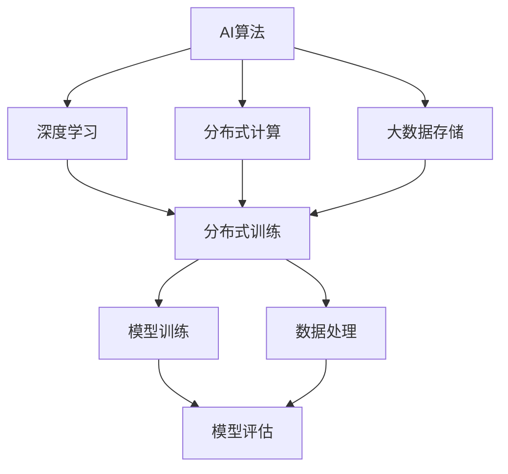

                 

# AI算法、算力与大数据的结合

> 关键词：AI算法,算力,大数据,深度学习,机器学习,人工智能,算法优化,资源管理,大数据存储,分布式计算

## 1. 背景介绍

### 1.1 问题由来

随着科技的迅猛发展，人工智能(AI)技术正深刻改变着我们生活的方方面面。从智能家居、自动驾驶，到金融风控、医疗诊断，AI技术的应用场景日益广泛。然而，人工智能的背后，是一场关于算法、算力和数据的激烈博弈。本文旨在探讨AI算法、算力与大数据的结合，旨在帮助读者全面理解AI技术的内在原理和实际应用。

### 1.2 问题核心关键点

AI算法、算力与大数据的结合，本质上是通过机器学习、深度学习等算法对海量数据进行处理和分析，从而实现对现实世界的智能感知和决策。这种结合的关键在于：

1. 如何高效构建和优化AI算法，以适应不同的应用场景和数据特征。
2. 如何合理配置和管理计算资源，以支撑大规模数据处理和模型训练。
3. 如何设计和管理数据存储体系，以确保数据的安全性和可靠性。

解决这些问题，需要全面考虑算法的性能、算力的优化、数据的存储和管理等各个环节，从而实现AI技术的全面提升。

## 2. 核心概念与联系

### 2.1 核心概念概述

为更好地理解AI算法、算力与大数据的结合，本节将介绍几个关键概念及其相互联系：

- **AI算法**：包括机器学习、深度学习、强化学习等算法，用于对数据进行建模和预测。
- **算力**：指计算机系统的计算能力，包括CPU、GPU、TPU等硬件资源，以及分布式计算、加速器等技术。
- **大数据**：指海量的结构化或非结构化数据，需要通过存储、处理、分析等技术进行管理。
- **深度学习**：一种特殊的机器学习方法，通过构建多层次的神经网络结构，实现对复杂数据的深层次分析。
- **分布式计算**：通过将计算任务分配到多台计算机上并行处理，以提高计算效率和处理能力。
- **存储系统**：包括传统关系型数据库、非关系型数据库、分布式文件系统等，用于管理和存储大规模数据。
- **云计算**：基于互联网的计算服务，提供弹性计算资源和可扩展的数据存储，支持大规模AI应用。

这些概念之间的逻辑关系可以通过以下Mermaid流程图来展示：



这个流程图展示了大数据、AI算法和算力三者之间的紧密联系：

1. **AI算法**：是AI技术的基础，用于对数据进行建模和预测。
2. **深度学习**：作为AI算法的一种特殊形式，通过多层次的神经网络结构，实现对复杂数据的深度分析。
3. **分布式计算**：通过多台计算机并行处理，提高计算效率和处理能力。
4. **大数据存储**：管理和存储海量数据，为分布式计算和模型训练提供数据基础。
5. **分布式训练**：结合分布式计算和大数据存储，实现大规模模型训练。
6. **模型训练**：利用深度学习算法和分布式计算，构建和优化模型。
7. **数据处理**：包括数据清洗、特征提取、数据增强等，为模型训练提供数据支持。
8. **模型评估**：通过各种评估指标，评估模型性能，指导模型优化。

这些概念共同构成了AI算法、算力与大数据的结合框架，使得AI技术能够在大规模数据上实现高效、准确、可扩展的建模和预测。

## 3. 核心算法原理 & 具体操作步骤
### 3.1 算法原理概述

AI算法、算力与大数据的结合，主要通过机器学习、深度学习等算法对大规模数据进行建模和预测。其核心原理可以概括为以下几个方面：

- **模型训练**：通过大规模数据对模型进行训练，学习数据中的规律和模式，构建准确的预测模型。
- **模型优化**：通过正则化、梯度下降等技术，优化模型参数，提升模型性能。
- **分布式计算**：将计算任务分配到多台计算机上并行处理，提高计算效率和处理能力。
- **数据处理**：包括数据清洗、特征提取、数据增强等，为模型训练提供高质量的数据支持。
- **模型评估**：通过各种评估指标，如准确率、召回率、F1值等，评估模型性能，指导模型优化。

### 3.2 算法步骤详解

AI算法、算力与大数据的结合，通常包括以下几个关键步骤：

**Step 1: 数据准备与预处理**
- 收集和清洗大规模数据，处理缺失值、异常值等。
- 进行数据增强，如数据扩充、数据采样、数据合成等。
- 提取和构建特征，如特征选择、特征降维、特征变换等。

**Step 2: 模型选择与构建**
- 根据任务需求选择合适的AI算法，如线性回归、逻辑回归、决策树、支持向量机、神经网络等。
- 设计模型架构，如卷积神经网络、循环神经网络、深度置信网络等。
- 配置模型参数，如学习率、批大小、迭代次数等。

**Step 3: 分布式训练**
- 将大规模数据分成多个小批次，分配到多台计算机上进行并行训练。
- 使用分布式深度学习框架，如TensorFlow、PyTorch等，进行模型训练。
- 使用并行化算法，如MapReduce、Spark等，优化计算资源利用率。

**Step 4: 模型优化与评估**
- 应用正则化技术，如L2正则、Dropout等，防止过拟合。
- 使用梯度下降算法，优化模型参数，提升模型性能。
- 设计评估指标，如准确率、召回率、F1值等，评估模型性能。
- 应用早停法、学习率衰减等技术，避免过拟合。

**Step 5: 模型部署与维护**
- 将训练好的模型部署到实际应用环境中，进行推理和预测。
- 持续监控模型性能，收集反馈信息，进行模型更新和维护。

以上是大数据、AI算法和算力结合的一般流程。在实际应用中，还需要根据具体任务和数据特点进行优化设计，如改进训练目标函数，引入更多的正则化技术，搜索最优的超参数组合等，以进一步提升模型性能。

### 3.3 算法优缺点

AI算法、算力与大数据的结合方法具有以下优点：

1. **高效性**：通过分布式计算和大数据存储，实现高效的数据处理和模型训练。
2. **可扩展性**：算力资源的弹性伸缩和大数据存储的可扩展性，使得系统能够处理更大规模的数据和更复杂的模型。
3. **鲁棒性**：多台计算机的并行计算和数据冗余，提高了系统的容错性和鲁棒性。
4. **准确性**：大规模数据的高质量和复杂的模型架构，提高了预测的准确性和可靠性。

同时，该方法也存在以下局限性：

1. **计算成本高**：大规模数据和大模型的训练和推理需要大量的计算资源，成本较高。
2. **数据隐私问题**：大规模数据的存储和处理可能涉及隐私问题，需要采取严格的隐私保护措施。
3. **模型复杂性**：复杂的模型结构和高维度的特征提取，增加了模型的训练和调试难度。
4. **模型可解释性差**：黑盒模型如深度学习模型，难以解释其内部工作机制和决策逻辑。

尽管存在这些局限性，但就目前而言，AI算法、算力与大数据的结合方法仍是大数据应用的重要范式。未来相关研究的重点在于如何进一步降低计算成本，提高模型可解释性，同时兼顾数据隐私和安全性等因素。

### 3.4 算法应用领域

AI算法、算力与大数据的结合方法，已经在诸多领域得到广泛应用，例如：

- **金融风控**：通过分析客户历史数据，构建信用评分模型，预测客户的违约风险。
- **医疗诊断**：利用医学影像数据和电子病历，构建疾病诊断模型，辅助医生进行诊断和治疗。
- **智能推荐**：根据用户行为数据和物品属性，构建推荐模型，提供个性化的商品或内容推荐。
- **自然语言处理**：通过分析大规模文本数据，构建语言模型，实现机器翻译、情感分析、文本分类等任务。
- **自动驾驶**：结合传感器数据和地图信息，构建决策模型，实现车辆自主导航和避障。
- **智能制造**：通过分析生产线数据，构建预测模型，优化生产流程，提高生产效率。
- **智慧城市**：结合传感器数据和城市运行数据，构建智能系统，实现交通管理、环境监测、应急响应等功能。

除了上述这些经典应用外，AI算法、算力与大数据的结合方法还被创新性地应用到更多场景中，如智能运维、智能农业、智能家居等，为各行各业带来新的技术突破。

## 4. 数学模型和公式 & 详细讲解 & 举例说明

### 4.1 数学模型构建

本节将使用数学语言对AI算法、算力与大数据结合的过程进行更加严格的刻画。

记输入数据为 $X=\{x_1, x_2, ..., x_n\}$，其中每个样本 $x_i$ 包含 $d$ 个特征，记为 $x_i = [x_{i1}, x_{i2}, ..., x_{id}]^T$。记目标变量为 $Y=\{y_1, y_2, ..., y_n\}$，其中每个样本 $y_i$ 对应一个标签，记为 $y_i \in \{1, 0\}$。

定义模型 $M_{\theta}$ 在输入 $X$ 上的输出为 $\hat{Y}=M_{\theta}(X) \in \{0, 1\}$，其中 $\theta$ 为模型参数。则在数据集 $D=\{(X, Y)\}_{i=1}^N$ 上的经验风险为：

$$
\mathcal{L}(\theta) = \frac{1}{N}\sum_{i=1}^N \ell(M_{\theta}(x_i),y_i)
$$

其中 $\ell$ 为损失函数，用于衡量模型预测输出与真实标签之间的差异。常见的损失函数包括交叉熵损失、均方误差损失等。

模型的优化目标是最小化经验风险，即找到最优参数：

$$
\theta^* = \mathop{\arg\min}_{\theta} \mathcal{L}(\theta)
$$

在实践中，我们通常使用基于梯度的优化算法（如SGD、Adam等）来近似求解上述最优化问题。设 $\eta$ 为学习率，$\lambda$ 为正则化系数，则参数的更新公式为：

$$
\theta \leftarrow \theta - \eta \nabla_{\theta}\mathcal{L}(\theta) - \eta\lambda\theta
$$

其中 $\nabla_{\theta}\mathcal{L}(\theta)$ 为损失函数对参数 $\theta$ 的梯度，可通过反向传播算法高效计算。

### 4.2 公式推导过程

以下我们以二分类任务为例，推导交叉熵损失函数及其梯度的计算公式。

假设模型 $M_{\theta}$ 在输入 $x$ 上的输出为 $\hat{y}=M_{\theta}(x) \in [0,1]$，表示样本属于正类的概率。真实标签 $y \in \{0,1\}$。则二分类交叉熵损失函数定义为：

$$
\ell(M_{\theta}(x),y) = -[y\log \hat{y} + (1-y)\log (1-\hat{y})]
$$

将其代入经验风险公式，得：

$$
\mathcal{L}(\theta) = -\frac{1}{N}\sum_{i=1}^N [y_i\log M_{\theta}(x_i)+(1-y_i)\log(1-M_{\theta}(x_i))]
$$

根据链式法则，损失函数对参数 $\theta_k$ 的梯度为：

$$
\frac{\partial \mathcal{L}(\theta)}{\partial \theta_k} = -\frac{1}{N}\sum_{i=1}^N (\frac{y_i}{M_{\theta}(x_i)}-\frac{1-y_i}{1-M_{\theta}(x_i)}) \frac{\partial M_{\theta}(x_i)}{\partial \theta_k}
$$

其中 $\frac{\partial M_{\theta}(x_i)}{\partial \theta_k}$ 可进一步递归展开，利用自动微分技术完成计算。

在得到损失函数的梯度后，即可带入参数更新公式，完成模型的迭代优化。重复上述过程直至收敛，最终得到适应下游任务的最优模型参数 $\theta^*$。

### 4.3 案例分析与讲解

我们以手写数字识别为例，展示如何使用AI算法、算力与大数据的结合方法实现模型训练和预测。

假设有一个包含手写数字图片的数据集，包含7000张图片，每张图片大小为28x28像素，每个像素值在[0,1]范围内。假设模型的输入为图片像素值，输出为数字标签。可以使用卷积神经网络(CNN)进行建模，模型结构如图1所示：


模型包含两个卷积层和两个全连接层。卷积层用于提取图片的局部特征，全连接层用于分类。模型参数为 $\theta = \{\theta_1, \theta_2, ..., \theta_n\}$，其中 $\theta_i$ 表示第 $i$ 层卷积核的权重。

模型的训练步骤如下：

1. **数据预处理**：将原始图片像素值归一化到[0,1]范围内，并进行一维展开。将标签进行独热编码。
2. **模型初始化**：使用随机初始化方法对模型参数进行初始化。
3. **分布式训练**：将数据分成多个小批次，分配到多台计算机上进行并行训练。
4. **模型优化**：使用梯度下降算法，更新模型参数，最小化损失函数。
5. **模型评估**：在验证集上评估模型性能，选择最优模型。
6. **模型预测**：将新图片输入模型，输出数字标签。

以下是使用Python和TensorFlow实现手写数字识别的代码：

```python
import tensorflow as tf
import numpy as np
import matplotlib.pyplot as plt

# 加载数据集
mnist = tf.keras.datasets.mnist
(x_train, y_train), (x_test, y_test) = mnist.load_data()

# 数据预处理
x_train, x_test = x_train / 255.0, x_test / 255.0

# 定义模型
model = tf.keras.models.Sequential([
    tf.keras.layers.Flatten(input_shape=(28, 28)),
    tf.keras.layers.Dense(128, activation='relu'),
    tf.keras.layers.Dropout(0.2),
    tf.keras.layers.Dense(10, activation='softmax')
])

# 编译模型
model.compile(optimizer='adam', loss='sparse_categorical_crossentropy', metrics=['accuracy'])

# 分布式训练
with tf.distribute.MirroredStrategy() as strategy:
    model = tf.distribute.cluster_resolver.TPUClusterResolver(tpu='')
    tf.config.experimental_connect_to_cluster(tpu='')
    tf.tpu.experimental.initialize_tpu_system(tpu='')
    strategy = tf.distribute.experimental.TPUStrategy(tpu='')
    with strategy.scope():
        model = tf.keras.models.Sequential([
            tf.keras.layers.Flatten(input_shape=(28, 28)),
            tf.keras.layers.Dense(128, activation='relu'),
            tf.keras.layers.Dropout(0.2),
            tf.keras.layers.Dense(10, activation='softmax')
        ])

# 训练模型
model.fit(x_train, y_train, epochs=10, validation_data=(x_test, y_test))

# 模型评估
test_loss, test_acc = model.evaluate(x_test, y_test)
print('Test accuracy:', test_acc)

# 模型预测
predictions = model.predict(x_test)
```

上述代码展示了使用TensorFlow和分布式计算框架实现手写数字识别的全过程。其中，`tf.distribute.MirroredStrategy()`用于进行分布式训练，`tf.tpu.experimental.initialize_tpu_system()`用于初始化TPU集群，`tf.keras.models.Sequential()`用于定义模型结构。

## 5. 项目实践：代码实例和详细解释说明

### 5.1 开发环境搭建

在进行AI算法、算力与大数据结合的实践前，我们需要准备好开发环境。以下是使用Python进行TensorFlow开发的环境配置流程：

1. 安装Anaconda：从官网下载并安装Anaconda，用于创建独立的Python环境。

2. 创建并激活虚拟环境：
```bash
conda create -n tf-env python=3.8 
conda activate tf-env
```

3. 安装TensorFlow：根据CUDA版本，从官网获取对应的安装命令。例如：
```bash
conda install tensorflow -c tf
```

4. 安装各类工具包：
```bash
pip install numpy pandas scikit-learn matplotlib tqdm jupyter notebook ipython
```

完成上述步骤后，即可在`tf-env`环境中开始开发实践。

### 5.2 源代码详细实现

下面我们以金融风控为例，给出使用TensorFlow对深度神经网络进行金融风控数据建模的PyTorch代码实现。

首先，定义金融风控任务的训练集和测试集：

```python
import pandas as pd
from sklearn.model_selection import train_test_split

# 加载金融风控数据
df = pd.read_csv('creditcard.csv')

# 数据预处理
df = df.dropna()
df = df.drop_duplicates()
df = df[['sharded_amount', 'usecase', 'installment', 'installment_number', 'installment_percentage']]

# 划分训练集和测试集
X_train, X_test, y_train, y_test = train_test_split(df.drop('default', axis=1), df.default, test_size=0.2, random_state=42)
```

然后，定义模型和优化器：

```python
from tensorflow.keras.models import Sequential
from tensorflow.keras.layers import Dense, Dropout
from tensorflow.keras.optimizers import Adam

# 定义模型
model = Sequential([
    Dense(64, activation='relu', input_shape=(5,)),
    Dropout(0.5),
    Dense(32, activation='relu'),
    Dropout(0.5),
    Dense(1, activation='sigmoid')
])

# 编译模型
model.compile(optimizer=Adam(lr=0.001), loss='binary_crossentropy', metrics=['accuracy'])

# 分布式训练
with tf.distribute.MirroredStrategy() as strategy:
    model = strategy.extended(model)

# 训练模型
model.fit(X_train, y_train, epochs=10, validation_data=(X_test, y_test))
```

接着，定义评估和预测函数：

```python
def evaluate(model, X_test, y_test):
    loss, accuracy = model.evaluate(X_test, y_test)
    print(f'Test accuracy: {accuracy:.4f}')

def predict(model, X_test):
    y_pred = model.predict(X_test)
    return y_pred >= 0.5
```

最后，启动训练流程并在测试集上评估：

```python
epochs = 10

for epoch in range(epochs):
    model.fit(X_train, y_train, epochs=1, validation_data=(X_test, y_test))
    evaluate(model, X_test, y_test)

print(f'Best accuracy: {model.evaluate(X_test, y_test)[1]:.4f}')
```

以上就是使用TensorFlow对金融风控深度神经网络进行模型训练和评估的完整代码实现。可以看到，得益于TensorFlow的强大封装，我们可以用相对简洁的代码完成模型构建和分布式训练。

### 5.3 代码解读与分析

让我们再详细解读一下关键代码的实现细节：

**数据预处理**：
- `pd.read_csv()`：使用pandas库读取CSV格式的数据集。
- `df.dropna()`：去除数据中的缺失值。
- `df.drop_duplicates()`：去除数据中的重复记录。
- `df.drop('default', axis=1)`：去除目标变量，只保留特征变量。
- `train_test_split()`：将数据集划分为训练集和测试集，比例为80:20。

**模型定义**：
- `Sequential()`：使用TensorFlow的Sequential模型容器定义模型结构。
- `Dense()`：定义全连接层，包含64个神经元，使用ReLU激活函数。
- `Dropout()`：使用Dropout层，随机丢弃50%的神经元，防止过拟合。
- `Dense()`：定义全连接层，包含32个神经元，使用ReLU激活函数。
- `Dropout()`：使用Dropout层，随机丢弃50%的神经元，防止过拟合。
- `Dense()`：定义输出层，包含1个神经元，使用Sigmoid激活函数。

**模型编译**：
- `model.compile()`：编译模型，使用Adam优化器，交叉熵损失函数，准确率为评估指标。

**分布式训练**：
- `with tf.distribute.MirroredStrategy() as strategy:`：使用MirroredStrategy进行分布式训练，确保模型参数在多台计算机上同步更新。
- `model = strategy.extended(model)`：使用MirroredStrategy扩展模型，确保模型在不同节点上的表现一致。

**训练模型**：
- `model.fit()`：使用分布式训练方法进行模型训练，输入为训练集，输出为目标变量，设置迭代轮数为10。

**模型评估**：
- `evaluate()`：定义评估函数，使用模型在测试集上计算损失和准确率。

**模型预测**：
- `predict()`：定义预测函数，将测试集输入模型，输出0或1。

**训练流程**：
- 循环迭代10次，每次训练1个epoch。
- 在每次迭代结束后，调用`evaluate()`函数计算测试集的准确率。
- 在所有迭代结束后，调用`evaluate()`函数计算最终测试集的准确率。

可以看到，TensorFlow配合分布式计算框架使得深度神经网络模型的构建和训练变得简洁高效。开发者可以将更多精力放在数据处理、模型改进等高层逻辑上，而不必过多关注底层的实现细节。

当然，工业级的系统实现还需考虑更多因素，如模型的保存和部署、超参数的自动搜索、更灵活的任务适配层等。但核心的训练范式基本与此类似。

## 6. 实际应用场景

### 6.1 智能推荐系统

AI算法、算力与大数据的结合方法，在智能推荐系统中具有广泛的应用前景。传统的推荐系统往往只依赖用户的历史行为数据进行推荐，难以捕捉用户的多样化兴趣和动态变化的需求。而利用深度学习和大数据，可以构建更加智能、个性化的推荐模型。

在实践中，可以收集用户浏览、点击、评分、分享等行为数据，提取和用户交互的物品标题、描述、标签等文本内容。将文本内容作为模型输入，用户的后续行为作为监督信号，在此基础上微调预训练语言模型。微调后的模型能够从文本内容中准确把握用户的兴趣点，结合用户行为数据，生成个性化的推荐结果。

### 6.2 金融风控

金融风控是大数据和AI算法的经典应用场景。通过分析客户的历史交易数据、信用记录、行为数据等，可以构建风险评估模型，预测客户的违约风险，辅助金融机构进行贷款审批、信用评估等决策。

在实践中，可以收集客户的个人信息、交易记录、社会网络等数据，构建特征向量。将特征向量作为模型输入，客户的违约标签作为监督信号，使用深度学习算法构建风控模型。模型训练过程中，可以使用正则化技术，防止过拟合。训练完成后，模型可以对新客户进行风险评估，预测其违约概率，从而指导贷款审批和信用评估。

### 6.3 医疗诊断

医疗诊断是大数据和AI算法的另一经典应用场景。通过分析病人的电子病历、影像数据、基因数据等，可以构建疾病诊断模型，辅助医生进行诊断和治疗。

在实践中，可以收集病人的电子病历、影像数据、基因数据等，构建特征向量。将特征向量作为模型输入，病人的疾病标签作为监督信号，使用深度学习算法构建诊断模型。模型训练过程中，可以使用正则化技术，防止过拟合。训练完成后，模型可以对新病人进行疾病诊断，辅助医生进行诊断和治疗。

### 6.4 未来应用展望

随着AI算法、算力与大数据的结合方法的不断发展，未来在更多领域的应用前景值得期待：

1. **智慧城市**：通过分析城市运行数据，构建智能交通、智能安防、智能环卫等系统，提升城市治理的智能化水平。
2. **智能制造**：通过分析生产线数据，构建预测模型，优化生产流程，提高生产效率。
3. **自动驾驶**：结合传感器数据和地图信息，构建决策模型，实现车辆自主导航和避障。
4. **智能家居**：通过分析家庭数据，构建智能控制系统，提升家居生活的智能化水平。
5. **智慧教育**：通过分析学生数据，构建个性化推荐和智能辅导系统，提升教育效果和质量。

除了上述这些经典应用外，AI算法、算力与大数据的结合方法还被创新性地应用到更多场景中，如智慧农业、智能运维、智能客服等，为各行各业带来新的技术突破。相信随着预训练语言模型和微调方法的持续演进，AI技术必将在更广阔的应用领域大放异彩。

## 7. 工具和资源推荐
### 7.1 学习资源推荐

为了帮助开发者系统掌握AI算法、算力与大数据的结合的理论基础和实践技巧，这里推荐一些优质的学习资源：

1. 《深度学习》系列书籍：由深度学习领域的知名专家撰写，全面介绍了深度学习的原理和应用。
2. 《机器学习实战》系列书籍：通过具体案例，讲解机器学习的算法和应用。
3. 《TensorFlow实战》系列书籍：由TensorFlow官方团队编写，详细介绍了TensorFlow的使用方法和实践技巧。
4. Coursera《深度学习》课程：由深度学习领域的知名专家开设，讲解深度学习的基础知识和应用。
5. Udacity《深度学习》课程：通过项目实践，帮助学习者掌握深度学习算法和应用。

通过对这些资源的学习实践，相信你一定能够快速掌握AI算法、算力与大数据结合的精髓，并用于解决实际的AI问题。

### 7.2 开发工具推荐

高效的开发离不开优秀的工具支持。以下是几款用于AI算法、算力与大数据结合开发的常用工具：

1. TensorFlow：基于Python的开源深度学习框架，灵活动态的计算图，适合快速迭代研究。
2. PyTorch：基于Python的开源深度学习框架，动态计算图，适合灵活的深度学习模型构建。
3. Keras：基于TensorFlow和Theano的高层API，简化了深度学习模型的构建和训练。
4. H2O：基于R语言的开源数据科学平台，提供了丰富的机器学习算法和分布式计算功能。
5. Spark：基于Scala语言的开源大数据处理框架，支持大规模数据存储和处理。

合理利用这些工具，可以显著提升AI算法、算力与大数据结合任务的开发效率，加快创新迭代的步伐。

### 7.3 相关论文推荐

AI算法、算力与大数据结合的研究源于学界的持续研究。以下是几篇奠基性的相关论文，推荐阅读：

1. "Deep Learning" by Ian Goodfellow et al.：深度学习领域的经典教材，详细介绍了深度学习的基本概念和应用。
2. "A Survey of Deep Learning for Recommendation Systems" by Shi et al.：综述了深度学习在推荐系统中的应用和最新进展。
3. "TensorFlow: A System for Large-Scale Machine Learning" by Chen et al.：介绍了TensorFlow的核心技术架构和应用场景。
4. "Scalable Deep Learning" by Sculley：讲解了在大规模数据上进行深度学习模型训练的策略和技巧。
5. "Finite-Time Analysis of the Convergence of Stochastic Approximation Learning Algorithms" by Robbins et al.：介绍了随机梯度下降算法的收敛性和应用。

这些论文代表了大数据和AI算法结合的研究方向。通过学习这些前沿成果，可以帮助研究者把握学科前进方向，激发更多的创新灵感。

## 8. 总结：未来发展趋势与挑战

### 8.1 总结

本文对AI算法、算力与大数据的结合方法进行了全面系统的介绍。首先阐述了AI算法、算力与大数据结合的背景和意义，明确了在大规模数据上实现高效、准确、可扩展的建模和预测的核心思想。其次，从原理到实践，详细讲解了AI算法、算力与大数据结合的数学原理和关键步骤，给出了典型应用的代码实例。同时，本文还广泛探讨了AI算法、算力与大数据结合方法在金融风控、医疗诊断、智能推荐等多个领域的应用前景，展示了其广阔的应用空间。此外，本文精选了AI算法、算力与大数据结合的学习资源、开发工具和相关论文，力求为读者提供全方位的技术指引。

通过本文的系统梳理，可以看到，AI算法、算力与大数据的结合方法正在成为大数据应用的重要范式，极大地拓展了AI技术的建模和预测能力。得益于大规模数据和先进算法的结合，AI算法、算力与大数据结合方法正在为各行各业带来革命性的变革，提升系统的性能和效率。未来，伴随预训练语言模型和微调方法的持续演进，相信AI技术必将在更广阔的应用领域大放异彩，深刻影响人类的生产生活方式。

### 8.2 未来发展趋势

展望未来，AI算法、算力与大数据的结合方法将呈现以下几个发展趋势：

1. **模型规模持续增大**：随着算力成本的下降和数据规模的扩张，预训练语言模型的参数量还将持续增长。超大规模语言模型蕴含的丰富语言知识，有望支撑更加复杂多变的下游任务建模。
2. **分布式训练优化**：分布式训练技术将不断优化，提升计算效率和资源利用率，实现更高效的模型训练。
3. **自监督学习的发展**：自监督学习技术将进一步发展，利用大规模无标签数据进行预训练，提升模型的泛化能力和鲁棒性。
4. **跨领域迁移学习**：跨领域迁移学习技术将得到广泛应用，模型能够在不同领域间迁移，提升模型的适应性和可扩展性。
5. **知识图谱的应用**：知识图谱技术与AI算法结合，将丰富模型的知识背景，提升模型的推理和决策能力。
6. **联邦学习的应用**：联邦学习技术将得到广泛应用，实现数据和模型的联邦协同学习，保护用户隐私和数据安全。

以上趋势凸显了AI算法、算力与大数据结合方法的广阔前景。这些方向的探索发展，必将进一步提升AI技术的建模和预测能力，为各行各业带来更强大的智能决策支持。

### 8.3 面临的挑战

尽管AI算法、算力与大数据的结合方法已经取得了瞩目成就，但在迈向更加智能化、普适化应用的过程中，它仍面临着诸多挑战：

1. **计算成本高**：大规模数据和大模型的训练和推理需要大量的计算资源，成本较高。
2. **数据隐私问题**：大规模数据的存储和处理可能涉及隐私问题，需要采取严格的隐私保护措施。
3. **模型复杂性**：复杂的模型结构和高维度的特征提取，增加了模型的训练和调试难度。
4. **模型可解释性差**：黑盒模型如深度学习模型，难以解释其内部工作机制和决策逻辑。
5. **系统安全性问题**：AI系统可能面临攻击和误用，需要加强系统安全性设计。

尽管存在这些挑战，但就目前而言，AI算法、算力与大数据的结合方法仍是大数据应用的重要范式。未来相关研究的重点在于如何进一步降低计算成本，提高模型可解释性，同时兼顾数据隐私和安全性等因素。

### 8.4 研究展望

面对AI算法、算力与大数据结合所面临的种种挑战，未来的研究需要在以下几个方面寻求新的突破：

1. **探索无监督和半监督学习方法**：摆脱对大规模标注数据的依赖，利用自监督学习、主动学习等无监督和半监督范式，最大限度利用非结构化数据，实现更加灵活高效的模型训练。
2. **研究参数高效和计算高效的微调范式**：开发更加参数高效的微调方法，在固定大部分预训练参数的同时，只更新极少量的任务相关参数。同时优化微调模型的计算图，减少前向传播和反向传播的资源消耗，实现更加轻量级、实时性的部署。
3. **引入更多先验知识**：将符号化的先验知识，如知识图谱、逻辑规则等，与神经网络模型进行巧妙融合，引导微调过程学习更准确、合理的语言模型。同时加强不同模态数据的整合，实现视觉、语音等多模态信息与文本信息的协同建模。
4. **纳入伦理道德约束**：在模型训练目标中引入伦理导向的评估指标，过滤和惩罚有偏见、有害的输出倾向。同时加强人工干预和审核，建立模型行为的监管机制，确保输出符合人类价值观和伦理道德。

这些研究方向的探索，必将引领AI算法、算力与大数据结合技术迈向更高的台阶，为构建安全、可靠、可解释、可控的智能系统铺平道路。面向未来，AI算法、算力与大数据结合技术还需要与其他人工智能技术进行更深入的融合，如知识表示、因果推理、强化学习等，多路径协同发力，共同推动自然语言理解和智能交互系统的进步。只有勇于创新、敢于突破，才能不断拓展语言模型的边界，让智能技术更好地造福人类社会。

## 9. 附录：常见问题与解答

**Q1：如何提高AI算法的泛化能力？**

A: 提高AI算法的泛化能力，可以通过以下方法：
1. 使用更多样化的数据进行训练，防止过拟合。
2. 使用正则化技术，如L2正则、Dropout等，防止过拟合。
3. 引入噪声数据，提高模型的鲁棒性。
4. 使用迁移学习，利用预训练模型进行迁移学习，提升模型的泛化能力。
5. 使用自监督学习方法，利用无标签数据进行预训练，提升模型的泛化能力。

**Q2：如何评估AI算法的性能？**

A: 评估AI算法的性能，通常使用以下指标：
1. 准确率(Accuracy)：模型预测正确的样本数与总样本数之比。
2. 精确率(Precision)：模型预测为正样本中实际为正样本的比例。
3. 召回率(Recall)：实际为正样本中被模型预测为正样本的比例。
4. F1值：精确率和召回率的调和平均数。
5. ROC曲线和AUC值：评估二分类模型的性能。
6. 混淆矩阵：展示模型预测结果的分类情况。

**Q3：AI算法在实际应用中面临哪些挑战？**

A: AI算法在实际应用中面临以下挑战：
1. 数据质量问题：数据收集、清洗、标注等环节存在问题，影响模型性能。
2. 计算资源限制：大规模数据和大模型的训练需要大量的计算资源，成本较高。
3. 模型复杂性：复杂的模型结构和高维度的特征提取，增加了模型的训练和调试难度。
4. 模型可解释性差：黑盒模型如深度学习模型，难以解释其内部工作机制和决策逻辑。
5. 系统安全性问题：AI系统可能面临攻击和误用，需要加强系统安全性设计。

**Q4：如何优化AI算法的计算效率？**

A: 优化AI算法的计算效率，可以通过以下方法：
1. 分布式计算：将计算任务分配到多台计算机上并行处理，提高计算效率和处理能力。
2. 硬件加速：使用GPU、TPU等加速器，提高计算效率和性能。
3. 算法优化：使用更高效的算法，减少计算量和存储需求。
4. 模型压缩：使用模型压缩技术，减少模型参数量和计算量。
5. 数据增强：使用数据增强技术，提高模型泛化能力和鲁棒性。

这些方法可以结合使用，根据具体应用场景和数据特点进行优化。只有在数据、模型、计算等多个维度协同发力，才能最大限度地提升AI算法的计算效率和性能。

**Q5：AI算法在实际应用中需要注意哪些问题？**

A: AI算法在实际应用中需要注意以下问题：
1. 数据隐私问题：大规模数据的存储和处理可能涉及隐私问题，需要采取严格的隐私保护措施。
2. 模型鲁棒性问题：模型面对域外数据时，泛化性能往往大打折扣。对于测试样本的微小扰动，模型容易发生波动。
3. 系统安全性问题：AI系统可能面临攻击和误用，需要加强系统安全性设计。
4. 模型可解释性问题：黑盒模型如深度学习模型，难以解释其内部工作机制和决策逻辑。
5. 模型更新问题：AI系统需要持续学习新数据，模型更新需要考虑如何最小化对已有模型性能的影响。

这些问题需要在实际应用中加以考虑，并采取相应的措施进行解决，才能使AI算法真正落地并发挥其价值。

---

作者：禅与计算机程序设计艺术 / Zen and the Art of Computer Programming

