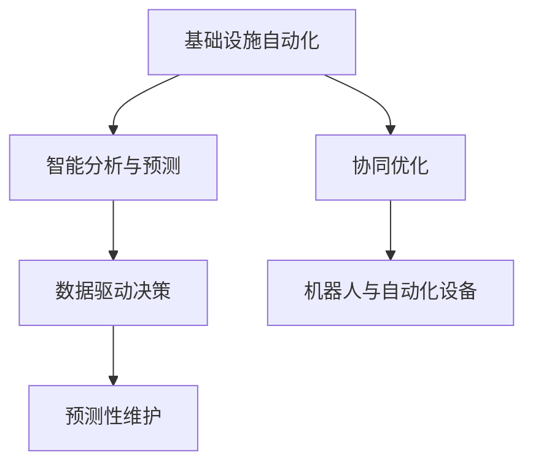

                 

## 1. 背景介绍

### 1.1 问题由来

随着全球化进程的加快，对基础设施的需求日益增长，尤其是作为支撑经济发展、公共服务和社会稳定的关键设施，如交通运输网络、能源系统、供排水设施、通信网络等。传统基础设施的管理和运营模式面临着诸多挑战，如维护成本高、资源浪费、故障响应慢、决策效率低下等。为解决这些问题，引入自动化技术成为行业的重要方向。

### 1.2 问题核心关键点

自动化物理基础设施，即利用先进的传感器、物联网、人工智能、大数据等技术，对基础设施进行实时监测、智能分析和精准控制，以提升其运营效率、降低成本、保障安全。其核心在于实现基础设施的自动化、智能化和协同化，通过数据驱动的决策支持系统，优化基础设施的管理和运营。

## 2. 核心概念与联系

### 2.1 核心概念概述

为更好地理解AI在物理基础设施自动化中的应用，本节将介绍几个密切相关的核心概念：

- 基础设施自动化：利用物联网技术，对基础设施进行自动化监测和控制，提升运营效率和安全性。
- 智能分析与预测：运用人工智能技术，对基础设施运行数据进行分析和预测，识别潜在故障和风险。
- 数据驱动决策：通过大数据技术，分析基础设施的历史数据和实时监测数据，辅助决策者进行精准决策。
- 预测性维护：通过智能分析与预测技术，预测设施故障和维护需求，提前进行预防性维护，减少突发事件对正常运营的影响。
- 协同优化：利用多模态数据融合技术，整合不同基础设施的运行数据，优化整体运行效率和应急响应能力。
- 机器人与自动化设备：引入自动化设备和机器人，执行复杂和危险的任务，提高劳动生产率和作业安全性。

这些核心概念之间的逻辑关系可以通过以下Mermaid流程图来展示：



这个流程图展示了一系列核心概念及其之间的关系：

1. 基础设施自动化通过物联网技术获取运行数据，为后续的智能分析和预测提供支持。
2. 智能分析与预测通过人工智能技术对数据进行处理，识别异常和潜在风险。
3. 数据驱动决策则通过大数据分析，辅助决策者进行精准决策。
4. 预测性维护基于智能分析与预测，提前进行预防性维护，减少故障对运营的影响。
5. 协同优化整合多模态数据，提升整体运行效率和应急响应能力。
6. 机器人与自动化设备执行复杂任务，提高生产效率和安全性。

这些概念共同构成了AI自动化物理基础设施的完整框架，使得其在提升运营效率、降低成本和保障安全方面具有巨大潜力。

## 3. 核心算法原理 & 具体操作步骤

### 3.1 算法原理概述

AI自动化物理基础设施的核心算法原理涉及传感器数据处理、特征提取、异常检测、预测建模和决策支持等多个方面。其整体流程包括以下几个关键步骤：

1. 数据采集：利用传感器对基础设施的关键指标进行实时监测，获取运营数据。
2. 特征提取：对采集到的数据进行预处理和特征提取，转化为可供分析的格式。
3. 异常检测：运用统计学和机器学习技术，对数据进行异常检测，识别潜在的故障和风险。
4. 预测建模：构建预测模型，对设施故障进行预测，评估维护需求。
5. 协同优化：整合不同基础设施的数据，进行多模态数据分析，优化整体运营。
6. 决策支持：结合预测结果和决策模型，辅助决策者进行精准决策。

### 3.2 算法步骤详解

以下是详细的算法操作步骤：

#### 3.2.1 数据采集

数据采集是自动化物理基础设施的第一步，通过部署各种传感器，对基础设施的关键指标进行实时监测。例如，在交通运输网络中，可以部署GPS传感器、温度传感器、压力传感器等，监测道路状态、桥体结构、交通流量等。数据采集的频率和粒度应根据实际需求和系统成本进行平衡，一般建议每秒或每分钟采集一次关键数据。

#### 3.2.2 特征提取

特征提取是数据预处理的重要环节，旨在将原始传感器数据转化为可供分析的格式。具体步骤如下：

1. **数据清洗**：去除噪声数据，处理缺失值和异常值。
2. **数据变换**：对数据进行归一化、标准化等预处理，使其适合后续分析。
3. **特征选择**：根据领域知识，选择关键特征，并运用特征工程技术提取新特征。

#### 3.2.3 异常检测

异常检测是识别潜在的故障和风险的重要手段。常用的异常检测算法包括：

- **统计学方法**：如均值、标准差、方差等统计量，用于检测数据是否偏离正常范围。
- **时间序列分析**：如ARIMA模型、LSTM模型等，用于检测时间序列数据的异常变化。
- **机器学习方法**：如孤立森林、GBDT等，用于检测高维数据中的异常点。

#### 3.2.4 预测建模

预测建模是预测设施故障和维护需求的重要工具。常用的预测模型包括：

- **时间序列预测**：如ARIMA、LSTM等，用于预测设施的运行趋势。
- **回归模型**：如线性回归、随机森林等，用于预测特定指标的变化。
- **深度学习模型**：如CNN、RNN等，用于处理复杂和异构数据。

#### 3.2.5 协同优化

协同优化是通过整合不同基础设施的数据，优化整体运营效率和应急响应能力。常用的方法包括：

- **多模态数据融合**：将不同类型的数据（如传感器数据、视频数据、气象数据等）进行融合，提升数据分析的全面性。
- **优化算法**：如线性规划、非线性规划等，用于求解多目标优化问题。
- **强化学习**：通过智能体与环境的交互，学习最优的决策策略。

#### 3.2.6 决策支持

决策支持是通过预测结果和决策模型，辅助决策者进行精准决策。常用的决策支持方法包括：

- **决策树**：用于分类和回归决策，简单易懂。
- **规则引擎**：根据预设规则自动生成决策，适用于简单场景。
- **专家系统**：结合领域专家知识，构建复杂的决策模型。

### 3.3 算法优缺点

AI自动化物理基础设施的算法具有以下优点：

- **提升运营效率**：通过实时监测和智能分析，及时发现并解决设施故障，提升运营效率。
- **降低维护成本**：预测性维护减少了突发故障的发生，降低了维护成本。
- **优化资源配置**：通过协同优化，提升资源配置的合理性和效率。
- **提升安全性**：通过实时监测和异常检测，及时发现安全隐患，保障设施安全。

同时，这些算法也存在一定的局限性：

- **数据质量依赖**：算法的效果很大程度上依赖于数据的质量和准确性，数据采集和处理环节的问题可能导致误判。
- **模型复杂度**：复杂的预测和优化模型需要大量的计算资源和时间，可能影响实时性。
- **算法透明性**：一些高级算法（如深度学习、强化学习）缺乏透明性，决策过程难以解释和调试。
- **领域知识依赖**：算法的有效性依赖于领域知识和经验的积累，不同领域的模型难以通用。

尽管存在这些局限性，AI自动化物理基础设施仍具有广阔的应用前景。未来相关研究的重点在于如何进一步提高算法的准确性和实时性，增强算法的透明性和可解释性，以及更好地结合领域知识进行模型构建。

### 3.4 算法应用领域

AI自动化物理基础设施的算法已经广泛应用于交通运输、能源系统、供排水设施、通信网络等多个领域，取得了显著的成效：

- **交通运输**：利用AI进行交通流量监测、道路状态预测、交通信号优化等，提升交通安全和通行效率。
- **能源系统**：通过AI进行电网负载预测、故障检测、能源优化等，提高能源利用效率和稳定性。
- **供排水设施**：运用AI进行水质监测、管道泄漏检测、供水优化等，提升供水安全和水质标准。
- **通信网络**：通过AI进行网络流量监测、故障检测、优化路由等，提升网络稳定性和用户体验。

除了上述这些经典应用外，AI自动化物理基础设施还被创新性地应用到更多场景中，如智能电网、智慧城市、智能水务、智能交通管理等，为各行业的智能化转型提供了新的技术路径。

## 4. 数学模型和公式 & 详细讲解 & 举例说明

### 4.1 数学模型构建

本节将使用数学语言对AI自动化物理基础设施的核心算法进行更加严格的刻画。

假设基础设施的监测数据为 $x \in \mathbb{R}^n$，其中 $n$ 为监测指标的数量。定义异常检测的阈值为 $\tau$，则异常检测的模型为：

$$
f(x) = \begin{cases}
1, & \text{if} \ x_i > \tau_i \ \text{for some} \ i \\
0, & \text{otherwise}
\end{cases}
$$

其中 $x_i$ 表示第 $i$ 个监测指标的值，$\tau_i$ 表示第 $i$ 个指标的阈值。异常检测结果 $f(x)$ 用于判断基础设施是否处于异常状态。

### 4.2 公式推导过程

以下是异常检测模型的详细推导过程：

1. **数据清洗**：去除噪声数据和缺失值，得到干净的数据集 $D = \{(x_i, y_i)\}_{i=1}^m$，其中 $x_i$ 为监测数据，$y_i$ 为异常检测结果（0或1）。
2. **特征提取**：对 $x_i$ 进行归一化和标准化处理，得到标准化数据 $x_i'$。
3. **异常检测**：利用孤立森林算法，对 $x_i'$ 进行异常检测，得到异常点 $I = \{i | y_i = 1\}$。

### 4.3 案例分析与讲解

以智能电网为例，对AI自动化物理基础设施的应用进行详细分析：

- **数据采集**：在电网关键节点部署传感器，实时监测电压、电流、温度等参数。
- **特征提取**：对采集到的数据进行归一化和标准化处理，得到适合分析的特征向量。
- **异常检测**：利用孤立森林算法，对特征向量进行异常检测，识别潜在的故障点。
- **预测建模**：构建ARIMA模型，预测电网负载变化趋势。
- **协同优化**：整合电网运行数据和气象数据，进行多模态数据分析，优化电源配置。
- **决策支持**：根据预测结果和专家系统，辅助调度员进行精准决策。

通过以上步骤，智能电网能够实时监测电网状态，预测故障，优化资源配置，提升电网稳定性和运行效率。

## 5. 项目实践：代码实例和详细解释说明

### 5.1 开发环境搭建

在进行AI自动化物理基础设施的开发前，我们需要准备好开发环境。以下是使用Python进行TensorFlow开发的开发环境配置流程：

1. 安装Anaconda：从官网下载并安装Anaconda，用于创建独立的Python环境。

2. 创建并激活虚拟环境：
```bash
conda create -n tf-env python=3.8 
conda activate tf-env
```

3. 安装TensorFlow：根据CUDA版本，从官网获取对应的安装命令。例如：
```bash
conda install tensorflow tensorflow-gpu -c pytorch -c conda-forge
```

4. 安装各类工具包：
```bash
pip install numpy pandas scikit-learn matplotlib tqdm jupyter notebook ipython
```

完成上述步骤后，即可在`tf-env`环境中开始项目实践。

### 5.2 源代码详细实现

下面我们以智能电网预测为例，给出使用TensorFlow对电网负载进行预测的Python代码实现。

首先，定义数据处理函数：

```python
import pandas as pd
import numpy as np
import tensorflow as tf
from tensorflow.keras.models import Sequential
from tensorflow.keras.layers import Dense, LSTM
from sklearn.preprocessing import StandardScaler

def load_data(file_path):
    data = pd.read_csv(file_path)
    return data

def preprocess_data(data, scaler=None):
    if scaler is None:
        data = data.copy()
        data['load'] = data['load'].astype('float')
        scaler = StandardScaler()
        data['load'] = scaler.fit_transform(data[['load']])
    else:
        data = data.copy()
        data['load'] = scaler.transform(data[['load']])
    return data, scaler

def train_test_split(data, test_size=0.2):
    train_data, test_data = data[:int(len(data)*test_size)], data[int(len(data)*test_size):]
    return train_data, test_data
```

然后，定义模型和优化器：

```python
def create_model(input_shape):
    model = Sequential()
    model.add(LSTM(100, input_shape=input_shape, return_sequences=True))
    model.add(LSTM(100, return_sequences=True))
    model.add(Dense(1))
    model.compile(loss='mse', optimizer='adam')
    return model

def train_model(model, train_data, test_data, epochs=50, batch_size=32):
    model.fit(train_data[['load']], train_data['load'], epochs=epochs, batch_size=batch_size, validation_data=(test_data[['load']], test_data['load']))
    return model
```

接着，定义训练和评估函数：

```python
def evaluate_model(model, test_data, scaler):
    test_data = pd.read_csv(test_data_path)
    test_data['load'] = scaler.transform(test_data[['load']])
    y_pred = model.predict(test_data[['load']])
    y_pred = scaler.inverse_transform(y_pred)
    print('Test RMSE:', np.sqrt(np.mean((y_pred - test_data['load'])**2)))

# 训练和评估
train_data, test_data = train_test_split(data, test_size=0.2)
model = create_model(input_shape)
model = train_model(model, train_data, test_data, epochs=50, batch_size=32)
evaluate_model(model, test_data, scaler)
```

以上就是使用TensorFlow对电网负载进行预测的完整代码实现。可以看到，TensorFlow的API使得模型构建和训练过程非常简单，开发者可以将更多精力放在特征提取和算法优化上。

### 5.3 代码解读与分析

让我们再详细解读一下关键代码的实现细节：

**load_data函数**：
- 读取电网负载数据，返回Pandas DataFrame格式的数据集。

**preprocess_data函数**：
- 对数据进行清洗和特征提取。
- 对负载数据进行标准化处理，得到标准化的特征向量。

**train_test_split函数**：
- 对数据进行训练集和测试集的划分。

**create_model函数**：
- 构建LSTM模型，用于预测电网负载。
- 定义模型的输入形状，添加LSTM层、全连接层等。

**train_model函数**：
- 定义模型的训练过程，包括损失函数和优化器。
- 使用Keras的fit方法进行模型训练。

**evaluate_model函数**：
- 对模型进行评估，计算测试集上的均方根误差(RMSE)。

**训练和评估**：
- 定义训练和测试数据，构建模型，进行训练和评估。

可以看到，TensorFlow的Keras API使得模型的构建和训练过程非常简单，开发者可以专注于算法设计和数据处理环节。

当然，工业级的系统实现还需考虑更多因素，如模型的保存和部署、超参数的自动搜索、更灵活的任务适配层等。但核心的预测过程基本与此类似。

## 6. 实际应用场景

### 6.1 智能电网

AI自动化物理基础设施在智能电网中的应用，可以显著提升电网的稳定性和运行效率。智能电网通过实时监测电网状态，预测故障，优化资源配置，实现自适应控制。具体来说，智能电网可以应用AI自动化物理基础设施进行：

- **状态监测**：通过传感器实时监测电压、电流、温度等参数，及时发现设备故障。
- **故障预测**：利用时间序列预测模型，预测电网故障，提前进行维护。
- **优化控制**：通过多模态数据分析，优化电源配置，减少能源浪费。
- **调度决策**：结合预测结果和专家系统，辅助调度员进行精准决策。

通过智能电网，电网公司可以实时掌握电网状态，提高供电可靠性，减少停电事故。

### 6.2 智慧城市

AI自动化物理基础设施在智慧城市中的应用，可以提升城市管理的智能化水平，实现城市运行的高效和智能。智慧城市通过物联网技术，实时监测城市基础设施的运行状态，利用AI进行智能分析和决策。具体来说，智慧城市可以应用AI自动化物理基础设施进行：

- **交通管理**：通过智能交通系统，实时监测交通流量，优化交通信号，减少拥堵。
- **环境监测**：通过传感器监测空气质量、水质、温度等环境参数，及时发现异常。
- **公共安全**：通过视频监控和分析，识别异常行为，提高公共安全。
- **能源管理**：通过智能电网和智能建筑，优化能源使用，减少能源浪费。

通过智慧城市，城市管理部门可以实时掌握城市运行状态，提高城市运行效率，提升居民生活质量。

### 6.3 未来应用展望

随着AI自动化物理基础设施的不断发展，未来的应用场景将更加广泛，技术也将更加先进。以下是一些未来应用的前景：

- **自动驾驶**：通过智能交通系统和自动驾驶技术，实现交通流量的智能管理，提升交通安全和通行效率。
- **智能建筑**：通过智能传感器和控制设备，实现建筑的节能和智能化管理。
- **智能水务**：通过水务物联网，实时监测水质和水压，优化供水系统。
- **智能健康**：通过智能医疗设备，实时监测患者健康状况，提供精准医疗服务。

未来的AI自动化物理基础设施将与更多的领域进行融合，为各行各业提供智能化的解决方案，推动社会进步和经济发展。

## 7. 工具和资源推荐

### 7.1 学习资源推荐

为了帮助开发者系统掌握AI自动化物理基础设施的理论基础和实践技巧，这里推荐一些优质的学习资源：

1. 《物联网技术基础》系列博文：由物联网技术专家撰写，深入浅出地介绍了物联网技术的基本概念和应用场景。

2. 《深度学习在智能电网中的应用》课程：由清华大学开设的深度学习课程，介绍了深度学习在智能电网中的应用，包括预测建模和优化控制等。

3. 《智慧城市》书籍：详细介绍了智慧城市的架构和技术，包括智能交通、环境监测、公共安全等内容。

4. TensorFlow官方文档：TensorFlow的官方文档，提供了丰富的API和教程，帮助开发者快速上手TensorFlow。

5. PyTorch官方文档：PyTorch的官方文档，提供了详细的API和教程，帮助开发者使用PyTorch进行深度学习开发。

通过对这些资源的学习实践，相信你一定能够快速掌握AI自动化物理基础设施的精髓，并用于解决实际的业务问题。

### 7.2 开发工具推荐

高效的开发离不开优秀的工具支持。以下是几款用于AI自动化物理基础设施开发的常用工具：

1. TensorFlow：由Google主导开发的深度学习框架，生产部署方便，适合大规模工程应用。

2. PyTorch：由Facebook主导开发的深度学习框架，灵活动态，适合研究与开发。

3. TensorBoard：TensorFlow配套的可视化工具，可以实时监测模型训练状态，并提供丰富的图表呈现方式。

4. Weights & Biases：模型训练的实验跟踪工具，可以记录和可视化模型训练过程中的各项指标，方便对比和调优。

5. Jupyter Notebook：基于Python的交互式开发环境，支持代码编写和结果展示。

合理利用这些工具，可以显著提升AI自动化物理基础设施的开发效率，加快创新迭代的步伐。

### 7.3 相关论文推荐

AI自动化物理基础设施的发展源于学界的持续研究。以下是几篇奠基性的相关论文，推荐阅读：

1. 《智能电网中的深度学习应用》：介绍了深度学习在智能电网中的应用，包括负荷预测、故障检测等。

2. 《智慧城市的物联网架构》：详细介绍了智慧城市的架构和技术，包括传感器部署、数据融合等。

3. 《智能交通系统中的深度学习应用》：介绍了深度学习在智能交通系统中的应用，包括交通流量预测、车辆识别等。

4. 《预测性维护在智能制造中的应用》：介绍了预测性维护在智能制造中的应用，包括设备故障预测、维护策略优化等。

这些论文代表了大语言模型微调技术的发展脉络。通过学习这些前沿成果，可以帮助研究者把握学科前进方向，激发更多的创新灵感。

## 8. 总结：未来发展趋势与挑战

### 8.1 总结

本文对AI自动化物理基础设施进行了全面系统的介绍。首先阐述了AI自动化物理基础设施的研究背景和意义，明确了其在提升运营效率、降低成本和保障安全方面的独特价值。其次，从原理到实践，详细讲解了基础设施自动化、智能分析与预测、数据驱动决策、预测性维护和协同优化等核心算法的实现过程，给出了实际应用的代码实例。同时，本文还广泛探讨了AI自动化物理基础设施在智能电网、智慧城市、自动驾驶等诸多领域的应用前景，展示了其广阔的应用前景。

通过本文的系统梳理，可以看到，AI自动化物理基础设施的技术在提升基础设施的运营效率、降低成本和保障安全方面具有巨大的潜力。未来，伴随技术的不断演进，该技术必将在更广泛的领域得到应用，推动各行各业的智能化转型。

### 8.2 未来发展趋势

展望未来，AI自动化物理基础设施的发展将呈现以下几个趋势：

1. **技术融合**：未来的AI自动化物理基础设施将与更多的领域进行深度融合，如智能交通、智慧城市、智能制造等，形成跨领域的智能解决方案。

2. **边缘计算**：随着边缘计算技术的成熟，AI自动化物理基础设施将向边缘设备部署，实现实时监测和本地分析，减少数据传输和存储成本。

3. **自适应控制**：未来的基础设施将具备更强的自适应能力，能够根据环境变化自动调整运行策略，提高系统的鲁棒性和效率。

4. **协同优化**：未来的基础设施将通过多模态数据融合和优化算法，实现整体的协同优化，提升整体运行效率和应急响应能力。

5. **强化学习**：未来的AI自动化物理基础设施将引入强化学习技术，通过智能体与环境的交互，学习最优的决策策略，提升系统的智能水平。

6. **可解释性**：未来的AI自动化物理基础设施将更加注重模型的可解释性，通过可视化工具和解释技术，增强决策过程的透明度和可信度。

以上趋势凸显了AI自动化物理基础设施的广阔前景。这些方向的探索发展，必将进一步提升基础设施的智能化水平，为各行各业提供更加智能、高效和安全的解决方案。

### 8.3 面临的挑战

尽管AI自动化物理基础设施取得了显著的成效，但在迈向更加智能化、普适化应用的过程中，仍面临诸多挑战：

1. **数据质量问题**：传感器采集的数据质量不稳定，可能导致异常检测和预测模型的误判。

2. **模型复杂性**：复杂的模型需要大量的计算资源和时间，可能影响实时性和资源消耗。

3. **领域知识缺乏**：不同领域的基础设施运行机制和需求差异较大，缺乏统一的模型和算法。

4. **隐私和安全**：基础设施数据的隐私和安全问题，可能涉及用户隐私和敏感数据，需要加强数据保护和隐私管理。

5. **标准化问题**：不同厂商和平台的数据和模型存在标准不统一的问题，增加了跨平台协作的难度。

尽管存在这些挑战，但通过持续的探索和优化，未来的AI自动化物理基础设施必将逐步克服这些障碍，实现更广泛的应用。

### 8.4 研究展望

面对AI自动化物理基础设施所面临的挑战，未来的研究需要在以下几个方面寻求新的突破：

1. **数据增强与处理**：提升传感器数据的质量和可靠性，引入数据增强技术，提高模型的鲁棒性。

2. **轻量级模型**：开发轻量级、高效能的模型，减少资源消耗，提升实时性。

3. **跨领域模型**：构建跨领域的基础设施模型，适应不同领域的需求，提升模型的通用性和可移植性。

4. **隐私保护技术**：引入隐私保护技术，如差分隐私、联邦学习等，保护基础设施数据的隐私和安全。

5. **标准化工作**：推动行业标准化工作，制定统一的数据和模型标准，促进跨平台协作。

6. **人机协作**：通过人机协作技术，提升系统的决策过程和用户交互体验。

这些研究方向将进一步推动AI自动化物理基础设施的发展，为各行业的智能化转型提供更加可靠和高效的技术支持。总之，AI自动化物理基础设施具有广阔的发展前景，需要我们持续探索和优化，才能实现其真正的潜力。

## 9. 附录：常见问题与解答

**Q1：AI自动化物理基础设施是否适用于所有基础设施？**

A: AI自动化物理基础设施可以应用于大多数基础设施，如交通运输、能源系统、供排水设施、通信网络等。但不同基础设施的运行机制和需求差异较大，需要根据具体情况选择合适的模型和技术。

**Q2：如何选择合适的传感器和数据采集设备？**

A: 选择合适的传感器和数据采集设备需要考虑以下因素：

1. 采集的数据类型和精度要求。
2. 数据采集的设备成本和维护成本。
3. 数据采集的设备安装和部署难度。
4. 数据采集的设备兼容性和互操作性。

一般来说，需要根据具体需求和场景，选择适当的传感器和数据采集设备。

**Q3：AI自动化物理基础设施的部署需要考虑哪些因素？**

A: 部署AI自动化物理基础设施需要考虑以下因素：

1. 数据存储和处理能力。
2. 计算资源和硬件配置。
3. 网络带宽和传输能力。
4. 系统的可扩展性和可维护性。
5. 系统的安全性、可靠性和隐私保护。

合理的部署设计可以确保系统的稳定运行和高效性能。

**Q4：如何处理基础设施数据的隐私和安全问题？**

A: 处理基础设施数据的隐私和安全问题需要采取以下措施：

1. 数据匿名化处理，保护用户隐私。
2. 数据加密传输和存储，防止数据泄露。
3. 访问控制和权限管理，限制数据访问权限。
4. 安全审计和监控，及时发现和应对安全威胁。
5. 引入差分隐私、联邦学习等隐私保护技术，保护数据隐私和安全。

这些措施可以有效保护基础设施数据的隐私和安全，防止数据泄露和滥用。

**Q5：AI自动化物理基础设施的未来发展方向是什么？**

A: AI自动化物理基础设施的未来发展方向包括：

1. 技术融合：与更多的领域进行深度融合，如智能交通、智慧城市、智能制造等，形成跨领域的智能解决方案。
2. 边缘计算：向边缘设备部署，实现实时监测和本地分析，减少数据传输和存储成本。
3. 自适应控制：具备更强的自适应能力，能够根据环境变化自动调整运行策略。
4. 协同优化：通过多模态数据融合和优化算法，实现整体的协同优化。
5. 强化学习：引入强化学习技术，通过智能体与环境的交互，学习最优的决策策略。
6. 可解释性：注重模型的可解释性，增强决策过程的透明度和可信度。

这些研究方向将推动AI自动化物理基础设施的发展，为各行各业提供更加智能、高效和安全的解决方案。

---

作者：禅与计算机程序设计艺术 / Zen and the Art of Computer Programming

