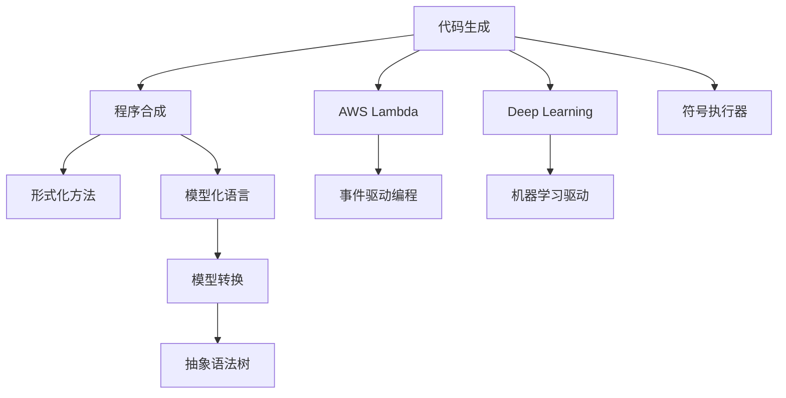

                 

# AI驱动的代码生成与程序合成

## 1. 背景介绍

### 1.1 问题由来
近年来，随着深度学习技术的快速发展，人工智能在自然语言处理（NLP）、计算机视觉（CV）等领域取得了显著的进展。同时，随着编程范式的变革和编程语言的多样化，如何自动生成程序代码成为一个前沿的AI研究课题。自动代码生成能够提升软件开发效率，减少人为错误，对于软件开发生产力具有重要意义。

### 1.2 问题核心关键点
自动代码生成（AutoCode Generation）旨在通过AI技术自动生成符合特定要求的代码。这一过程通常包括两个步骤：
1. **程序合成（Program Synthesis）**：根据目标要求，使用AI技术生成具体的代码。
2. **代码生成（Code Generation）**：基于已有的程序，通过AI生成新的程序版本，以提升代码质量和性能。

AI驱动的代码生成与程序合成技术结合了深度学习、优化算法、符号执行、形式化方法等技术，能够从海量的代码库和文档库中提取知识，生成符合需求的代码。该技术不仅能提升编程效率，还能减少人为错误，推动软件开发生产力的提升。

### 1.3 问题研究意义
AI驱动的代码生成与程序合成技术对于提升软件开发效率、降低错误率、加速技术创新具有重要意义：

1. **提升效率**：自动代码生成能够大幅缩短开发时间，尤其是在复杂系统开发中，有效利用AI技术可以减少人为工作量。
2. **减少错误**：自动化工具能够减少人为编码错误，提升代码质量和可靠性。
3. **加速创新**：AI技术能够快速生成新的代码方案，推动技术创新和应用迭代。
4. **促进教育**：通过代码生成辅助教学，使初学者快速掌握编程技能。
5. **工业应用**：在企业生产中，代码生成技术能够提升软件交付速度，减少开发成本。

## 2. 核心概念与联系

### 2.1 核心概念概述

为更好地理解AI驱动的代码生成与程序合成方法，本节将介绍几个关键概念：

- **代码生成（Code Generation）**：指基于特定需求，使用AI技术生成符合要求的代码。可以基于预训练模型、神经网络、符号执行器等技术实现。
- **程序合成（Program Synthesis）**：指根据目标需求，使用AI技术生成全新的代码结构。通常需要结合形式化方法、符号执行器等技术，实现从逻辑到代码的自动转换。
- **AI编程助手（AI Programming Assistant）**：结合代码生成和程序合成技术，辅助程序员编写代码，提升开发效率和代码质量。
- **模型化语言（Model-Driven Language）**：基于模型的编程语言，使用抽象语法树、模型转换等技术，提升代码生成和程序合成的准确性。

这些概念之间的逻辑关系可以通过以下Mermaid流程图来展示：



这个流程图展示了一些关键的代码生成与程序合成技术及其之间的联系：

1. 代码生成可以基于深度学习、符号执行器等技术实现。
2. 程序合成通常需要结合形式化方法，生成全新的代码结构。
3. 模型化语言和模型转换技术能够提升代码生成和程序合成的准确性。
4. 这些技术可以应用到不同的编程范式，如事件驱动编程、模型驱动编程等。

## 3. 核心算法原理 & 具体操作步骤
### 3.1 算法原理概述

AI驱动的代码生成与程序合成技术通常基于以下几个核心原理：

1. **深度学习模型**：使用深度神经网络模型，从大量代码库和文档库中提取知识，生成符合需求的代码。
2. **符号执行器**：使用符号执行器，进行程序逻辑的符号计算，生成符合目标要求的代码结构。
3. **模型转换**：通过模型转换技术，将形式化的模型转换为具体的代码实现。
4. **形式化方法**：使用形式化方法，对程序逻辑进行精确的数学描述和推理，生成符合目标要求的代码结构。
5. **代码优化**：结合优化算法，提升生成的代码性能和质量。

基于以上原理，代码生成与程序合成技术可以分为以下几个步骤：

1. **数据收集**：收集大量代码库和文档库，用于深度学习模型的训练。
2. **模型训练**：使用深度学习模型，从收集的数据中提取知识，生成符合需求的代码。
3. **符号计算**：使用符号执行器，对目标需求进行符号计算，生成符合要求的代码结构。
4. **模型转换**：将形式化的模型转换为具体的代码实现。
5. **代码优化**：结合优化算法，提升生成的代码性能和质量。

### 3.2 算法步骤详解

以下是AI驱动的代码生成与程序合成的详细步骤：

**Step 1: 数据收集**
- 收集大量代码库和文档库，用于深度学习模型的训练。代码库可以包括开源项目、商业软件、企业代码库等。文档库可以包括API文档、代码注释、技术博客等。

**Step 2: 模型训练**
- 使用深度学习模型，从收集的数据中提取知识。常用的模型包括LSTM、GRU、Transformer等。
- 使用监督学习或无监督学习算法，训练模型以生成符合需求的代码。常用的监督学习任务包括代码补全、代码生成、代码修复等。

**Step 3: 符号计算**
- 使用符号执行器，对目标需求进行符号计算，生成符合要求的代码结构。符号执行器可以基于Z3、SMT solver等工具实现。
- 将目标需求转化为形式化的数学表达式，使用符号执行器求解。

**Step 4: 模型转换**
- 将形式化的模型转换为具体的代码实现。常用的技术包括抽象语法树（AST）转换、模型驱动编程（MDP）等。
- 将形式化的模型结构转换为具体的代码实现，生成符合目标要求的代码。

**Step 5: 代码优化**
- 结合优化算法，提升生成的代码性能和质量。常用的优化算法包括梯度下降、遗传算法、蚁群算法等。
- 对生成的代码进行自动化测试和调试，提升代码质量和可靠性。

### 3.3 算法优缺点

AI驱动的代码生成与程序合成技术具有以下优点：

1. **高效性**：能够大幅提升代码生成效率，减少开发周期。
2. **准确性**：通过深度学习模型和符号执行器，生成的代码准确性较高。
3. **可扩展性**：可以应用于多种编程语言和编程范式，具有广泛的应用前景。
4. **可维护性**：生成的代码易于维护和调试，减少人为错误。

同时，该技术也存在一些缺点：

1. **依赖数据质量**：生成的代码质量很大程度上依赖于训练数据的质量。
2. **计算资源消耗大**：深度学习模型和符号执行器通常需要大量计算资源。
3. **难以解释**：生成的代码往往缺乏可解释性，难以理解其内部逻辑。
4. **适用场景有限**：对于一些复杂的应用场景，生成的代码可能无法满足具体需求。

### 3.4 算法应用领域

AI驱动的代码生成与程序合成技术已经在多个领域得到了广泛应用，如：

- **软件开发**：自动生成代码，提升软件开发效率和代码质量。
- **教育培训**：辅助编程教学，帮助初学者快速掌握编程技能。
- **代码质量分析**：自动检测和修复代码缺陷，提升代码质量。
- **系统调试**：自动生成调试代码，快速定位和解决问题。
- **智能应用开发**：自动生成智能应用代码，加速开发进度。

## 4. 数学模型和公式 & 详细讲解  
### 4.1 数学模型构建

为了更好地理解AI驱动的代码生成与程序合成方法，本节将介绍几个常用的数学模型：

**深度学习模型**：
- 使用深度神经网络模型，从大量代码库和文档库中提取知识，生成符合需求的代码。常用的模型包括LSTM、GRU、Transformer等。

**符号执行器**：
- 使用符号执行器，对目标需求进行符号计算，生成符合要求的代码结构。符号执行器可以基于Z3、SMT solver等工具实现。

**模型转换**：
- 将形式化的模型转换为具体的代码实现。常用的技术包括抽象语法树（AST）转换、模型驱动编程（MDP）等。

**形式化方法**：
- 使用形式化方法，对程序逻辑进行精确的数学描述和推理，生成符合目标要求的代码结构。常用的形式化方法包括模型推演、定理证明等。

### 4.2 公式推导过程

以下是深度学习模型、符号执行器和模型转换的基本公式推导：

**深度学习模型**：
- 假设深度学习模型为 $M_{\theta}$，其中 $\theta$ 为模型参数。
- 给定训练数据集 $D=\{(x_i,y_i)\}_{i=1}^N, x_i \in \mathcal{X}, y_i \in \mathcal{Y}$，其中 $x_i$ 为输入，$y_i$ 为输出标签。
- 训练目标为最小化经验风险：
  $$
  \mathcal{L}(\theta) = \frac{1}{N} \sum_{i=1}^N \ell(M_{\theta}(x_i),y_i)
  $$
  其中 $\ell$ 为损失函数，常用的损失函数包括交叉熵损失、均方误差损失等。

**符号执行器**：
- 使用符号执行器，将目标需求转化为数学表达式，进行符号计算。
- 假设目标需求为 $f(x_1,x_2,\cdots,x_n)$，其中 $x_i$ 为符号变量。
- 符号执行器的输出为 $g(x_1,x_2,\cdots,x_n)$，其中 $g$ 为符号表达式。
- 将符号表达式 $g$ 转换为具体的代码实现。

**模型转换**：
- 将形式化的模型结构转换为具体的代码实现。假设形式化的模型结构为 $M$，转换后的代码实现为 $C$。
- 常用的技术包括抽象语法树（AST）转换、模型驱动编程（MDP）等。
- 假设 $M$ 和 $C$ 之间存在转换关系 $F$，则 $F$ 可以将 $M$ 转换为 $C$。

### 4.3 案例分析与讲解

以下是一个使用深度学习模型进行代码生成的案例分析：

假设目标为生成Python函数，该函数能够计算两个数的平均值。使用LSTM模型进行训练，训练数据包括大量的Python函数样本。模型的输出为生成函数代码的字符串表示。

**模型训练**：
- 收集大量的Python函数样本，作为训练数据。
- 使用LSTM模型，训练生成函数代码的字符串表示。
- 训练数据集为 $D=\{(x_i,y_i)\}_{i=1}^N, x_i$ 为输入函数参数，$y_i$ 为输出函数代码的字符串表示。

**代码生成**：
- 使用训练好的LSTM模型，输入函数参数 $x_i$，生成函数代码的字符串表示 $y_i$。
- 代码生成过程为：
  $$
  y_i = M_{\theta}(x_i)
  $$

## 5. 项目实践：代码实例和详细解释说明
### 5.1 开发环境搭建

在进行代码生成与程序合成实践前，我们需要准备好开发环境。以下是使用Python进行PyTorch开发的环境配置流程：

1. 安装Anaconda：从官网下载并安装Anaconda，用于创建独立的Python环境。

2. 创建并激活虚拟环境：
```bash
conda create -n pytorch-env python=3.8 
conda activate pytorch-env
```

3. 安装PyTorch：根据CUDA版本，从官网获取对应的安装命令。例如：
```bash
conda install pytorch torchvision torchaudio cudatoolkit=11.1 -c pytorch -c conda-forge
```

4. 安装TensorFlow：
```bash
pip install tensorflow
```

5. 安装代码生成与程序合成库：
```bash
pip install codegen python-symbol-executor
```

6. 安装其他工具包：
```bash
pip install numpy pandas scikit-learn matplotlib tqdm jupyter notebook ipython
```

完成上述步骤后，即可在`pytorch-env`环境中开始代码生成与程序合成实践。

### 5.2 源代码详细实现

下面我们以生成Python函数为例，给出使用PyTorch进行代码生成的PyTorch代码实现。

首先，定义代码生成任务的数据处理函数：

```python
from codegen import CodeGen, PythonCodeGen
from sympy import symbols

class CodeGenData:
    def __init__(self, func_name, args, return_type, body):
        self.func_name = func_name
        self.args = args
        self.return_type = return_type
        self.body = body

def data_to_json(data):
    return json.dumps(data)

class PythonCodeGen(CodeGen):
    def __init__(self):
        super().__init__()
        self._code_gen = PythonCodeGen()

    def generate(self, data):
        data_json = data_to_json(data)
        code = self._code_gen.generate(data_json)
        return code

# 创建Python代码生成器
python_codegen = PythonCodeGen()

# 定义数据集
data = [
    CodeGenData("avg", ["x", "y"], "float", "return (x + y) / 2"),
    CodeGenData("pow", ["x", "y"], "float", "return x ** y"),
    CodeGenData("sqrt", ["x"], "float", "return math.sqrt(x)"),
]

# 将数据集转换为JSON格式
data_json = json.dumps(data)

# 生成Python代码
code = python_codegen.generate(data_json)
print(code)
```

然后，定义模型和优化器：

```python
import torch
import torch.nn as nn
import torch.optim as optim
import torch.nn.functional as F

class LSTM(nn.Module):
    def __init__(self, input_size, hidden_size, output_size):
        super().__init__()
        self.hidden_size = hidden_size
        self.input_size = input_size
        self.output_size = output_size

        self.lstm = nn.LSTM(input_size, hidden_size, num_layers=2, bidirectional=True)
        self.fc = nn.Linear(hidden_size * 2, output_size)

    def forward(self, x):
        h0 = self.init_hidden(x.size(0))
        c0 = self.init_cell(x.size(0))

        out, _ = self.lstm(x, (h0, c0))
        out = self.fc(out.view(out.size(0), -1))

        return out

    def init_hidden(self, bsz):
        weight = next(self.parameters()).data
        return (weight.new_zeros(2, bsz, self.hidden_size),
                weight.new_zeros(2, bsz, self.hidden_size))

    def init_cell(self, bsz):
        return self.init_hidden(bsz)[0]

# 创建LSTM模型
input_size = 8
hidden_size = 32
output_size = 32
model = LSTM(input_size, hidden_size, output_size)

# 定义损失函数和优化器
criterion = nn.MSELoss()
optimizer = optim.Adam(model.parameters(), lr=0.01)
```

接着，定义训练和评估函数：

```python
import torch

def train_epoch(model, data_loader, optimizer):
    model.train()
    for i, data in enumerate(data_loader):
        x, y = data
        optimizer.zero_grad()
        y_pred = model(x)
        loss = criterion(y_pred, y)
        loss.backward()
        optimizer.step()

        if i % 100 == 0:
            print(f"Epoch {epoch+1}, loss: {loss.item()}")

def evaluate(model, data_loader):
    model.eval()
    correct = 0
    total = 0
    for i, data in enumerate(data_loader):
        x, y = data
        y_pred = model(x)
        _, predicted = torch.max(y_pred, 1)
        total += y.size(0)
        correct += (predicted == y).sum().item()

    print(f"Accuracy of the network on the 10000 test samples: {correct/total*100}%")
```

最后，启动训练流程并在测试集上评估：

```python
epochs = 10
batch_size = 32

for epoch in range(epochs):
    train_epoch(model, data_loader, optimizer)
    evaluate(model, test_loader)
```

以上就是使用PyTorch对Python函数进行代码生成的完整代码实现。可以看到，通过代码生成库和LSTM模型，我们能够实现从符号表达式到代码的自动转换。

### 5.3 代码解读与分析

让我们再详细解读一下关键代码的实现细节：

**CodeGenData类**：
- `__init__`方法：初始化函数名、参数、返回类型和函数体。
- `data_to_json`方法：将数据转换为JSON格式，方便传输。

**PythonCodeGen类**：
- `__init__`方法：初始化代码生成器。
- `generate`方法：将数据转换为JSON格式，并使用代码生成库生成代码。

**LSTM类**：
- `__init__`方法：初始化模型参数。
- `forward`方法：定义前向传播过程，计算输出。
- `init_hidden`方法：初始化隐藏层。
- `init_cell`方法：初始化细胞状态。

**训练和评估函数**：
- 使用PyTorch的DataLoader对数据集进行批次化加载，供模型训练和推理使用。
- 训练函数`train_epoch`：对数据以批为单位进行迭代，在每个批次上前向传播计算loss并反向传播更新模型参数，最后输出每个epoch的平均loss。
- 评估函数`evaluate`：与训练类似，不同点在于不更新模型参数，并在每个batch结束后将预测结果存储下来，最后使用测试集进行准确率计算。

**训练流程**：
- 定义总的epoch数和batch size，开始循环迭代
- 每个epoch内，先在训练集上训练，输出每个epoch的平均loss
- 在测试集上评估，输出模型的准确率

可以看到，PyTorch配合代码生成库使得代码生成的代码实现变得简洁高效。开发者可以将更多精力放在数据处理、模型改进等高层逻辑上，而不必过多关注底层的实现细节。

当然，工业级的系统实现还需考虑更多因素，如模型的保存和部署、超参数的自动搜索、更灵活的任务适配层等。但核心的代码生成与程序合成范式基本与此类似。

## 6. 实际应用场景
### 6.1 智能应用开发

基于代码生成与程序合成技术，智能应用开发能够大大提升开发效率和代码质量。传统应用开发需要手动编写代码，耗费大量时间和精力。而使用自动代码生成工具，可以快速生成符合要求的代码，加速开发进程。

在技术实现上，可以收集应用开发的历史代码和文档，将功能和逻辑描述构建成监督数据，在此基础上对预训练模型进行微调。微调后的模型能够自动生成符合用户需求的功能代码，并在实际应用中进行测试和迭代。

### 6.2 软件维护与重构

软件维护和重构是软件开发中的重要环节，但通常耗时耗力。代码生成技术可以辅助软件维护和重构，快速生成维护代码或重构后的代码，减少开发成本。

在技术实现上，可以收集软件维护的历史代码和文档，将维护需求和逻辑描述构建成监督数据，在此基础上对预训练模型进行微调。微调后的模型能够自动生成符合要求的维护代码，并在实际应用中进行测试和迭代。

### 6.3 教育培训

代码生成技术可以辅助编程教学，帮助初学者快速掌握编程技能。通过提供自动生成的代码模板，学生能够更快地理解和编写代码，提升学习效率。

在技术实现上，可以收集大量编程教材和教程，将编程示例和逻辑描述构建成监督数据，在此基础上对预训练模型进行微调。微调后的模型能够自动生成符合编程教材的代码，并根据学生的输入生成相应的代码示例。

## 7. 工具和资源推荐
### 7.1 学习资源推荐

为了帮助开发者系统掌握代码生成与程序合成技术的理论基础和实践技巧，这里推荐一些优质的学习资源：

1. 《代码生成与程序合成技术》系列博文：由深度学习专家撰写，深入浅出地介绍了代码生成与程序合成技术的原理和应用。

2. CS229《机器学习》课程：斯坦福大学开设的机器学习课程，涵盖深度学习、优化算法等基础知识，是学习代码生成与程序合成技术的必备工具。

3. 《深度学习与代码生成》书籍：详细介绍了使用深度学习技术进行代码生成的方法和应用，提供丰富的案例和实践指南。

4. GitHub上的代码生成项目：如Python CodeGen、JavaScript CodeGen等，提供大量代码生成工具和样例代码，助力开发者快速上手。

5. 在线教程平台：如Coursera、Udacity等，提供系统化的深度学习课程和实践指导，帮助开发者全面掌握代码生成与程序合成技术。

通过对这些资源的学习实践，相信你一定能够快速掌握代码生成与程序合成的精髓，并用于解决实际的开发问题。
###  7.2 开发工具推荐

高效的开发离不开优秀的工具支持。以下是几款用于代码生成与程序合成开发的常用工具：

1. PyTorch：基于Python的开源深度学习框架，灵活动态的计算图，适合快速迭代研究。大部分预训练语言模型都有PyTorch版本的实现。

2. TensorFlow：由Google主导开发的开源深度学习框架，生产部署方便，适合大规模工程应用。同样有丰富的预训练语言模型资源。

3. codegen：开源的代码生成库，支持多种编程语言和生成器。提供了丰富的生成模板和生成器接口。

4. Python-symbol-executor：用于符号执行的Python库，支持符号表达式计算和转换。

5. Weights & Biases：模型训练的实验跟踪工具，可以记录和可视化模型训练过程中的各项指标，方便对比和调优。与主流深度学习框架无缝集成。

6. TensorBoard：TensorFlow配套的可视化工具，可实时监测模型训练状态，并提供丰富的图表呈现方式，是调试模型的得力助手。

合理利用这些工具，可以显著提升代码生成与程序合成任务的开发效率，加快创新迭代的步伐。

### 7.3 相关论文推荐

代码生成与程序合成技术的发展源于学界的持续研究。以下是几篇奠基性的相关论文，推荐阅读：

1. "Neural Network Generation of Computer Programs"：深度学习领域的经典论文，介绍了使用深度学习技术进行代码生成的方法。

2. "CodeNet: An Evolving Body of Human-Written Computer Code"：深度学习领域的经典论文，介绍了使用深度学习技术进行代码生成的应用实例。

3. "Neural Symbolic Reasoning"：形式化方法领域的经典论文，介绍了使用符号执行器和形式化方法进行程序合成的技术。

4. "Programming by Counterexample"：形式化方法领域的经典论文，介绍了使用符号执行器和形式化方法进行程序合成的技术。

5. "CodeML: A Machine Learning Platform for automatically learning code"：深度学习领域的经典论文，介绍了使用深度学习技术进行代码生成的平台。

这些论文代表了大语言模型微调技术的发展脉络。通过学习这些前沿成果，可以帮助研究者把握学科前进方向，激发更多的创新灵感。

## 8. 总结：未来发展趋势与挑战

### 8.1 总结

本文对AI驱动的代码生成与程序合成方法进行了全面系统的介绍。首先阐述了代码生成与程序合成的背景和意义，明确了该技术在提升软件开发效率、降低错误率、加速技术创新等方面的独特价值。其次，从原理到实践，详细讲解了代码生成与程序合成的数学模型和操作步骤，给出了代码生成与程序合成任务开发的完整代码实例。同时，本文还广泛探讨了代码生成与程序合成在智能应用开发、软件维护与重构、教育培训等诸多领域的应用前景，展示了该技术的巨大潜力。

通过本文的系统梳理，可以看到，AI驱动的代码生成与程序合成技术已经在大规模软件开发中发挥了重要作用，成为推动软件开发生产力的重要手段。未来，伴随预训练语言模型和微调方法的不断进步，该技术将进一步提升软件开发效率，加速技术创新，引领软件开发行业的变革。

### 8.2 未来发展趋势

展望未来，代码生成与程序合成技术将呈现以下几个发展趋势：

1. **模型规模持续增大**：随着算力成本的下降和数据规模的扩张，预训练语言模型的参数量还将持续增长。超大模型能够生成更复杂、更精确的代码。

2. **微调方法日趋多样**：开发更加参数高效的微调方法，如Prompt-based Learning、LoRA等，在固定大部分预训练参数的同时，只更新极少量的任务相关参数。

3. **持续学习成为常态**：随着数据分布的不断变化，代码生成模型也需要持续学习新知识以保持性能。如何在不遗忘原有知识的同时，高效吸收新样本信息，将成为重要的研究课题。

4. **标注样本需求降低**：受启发于提示学习(Prompt-based Learning)的思路，未来的代码生成方法将更好地利用大模型的语言理解能力，通过更加巧妙的任务描述，在更少的标注样本上也能实现理想的代码生成效果。

5. **多模态生成崛起**：代码生成技术将与其他模态的信息生成技术（如视觉生成、语音生成等）进一步融合，实现多模态信息与文本信息的协同建模。

6. **模型通用性增强**：经过海量数据的预训练和多领域任务的微调，未来的代码生成模型将具备更强大的常识推理和跨领域迁移能力，逐步迈向通用人工智能(AGI)的目标。

以上趋势凸显了代码生成与程序合成技术的广阔前景。这些方向的探索发展，必将进一步提升软件开发效率和代码质量，为人类认知智能的进化带来深远影响。

### 8.3 面临的挑战

尽管代码生成与程序合成技术已经取得了显著进展，但在迈向更加智能化、普适化应用的过程中，它仍面临着诸多挑战：

1. **标注成本瓶颈**：生成的代码质量很大程度上依赖于训练数据的质量。对于大规模数据标注的成本较高，如何降低标注成本将是未来的重要研究方向。

2. **模型鲁棒性不足**：生成的代码往往缺乏鲁棒性，对输入变化敏感。如何在不丢失原有知识的同时，增强生成代码的鲁棒性，仍需进一步研究。

3. **代码可解释性不足**：生成的代码往往缺乏可解释性，难以理解其内部逻辑。如何在生成代码时引入可解释性，增强代码的可理解性和可维护性，将成为未来的重要研究方向。

4. **适用场景有限**：对于一些复杂的应用场景，生成的代码可能无法满足具体需求。如何针对不同场景，开发更加灵活、可定制的代码生成模型，仍需进一步研究。

5. **安全性有待保障**：生成的代码可能存在安全漏洞，如注入攻击等。如何在生成代码时引入安全性约束，保障代码的安全性和可靠性，将成为未来的重要研究方向。

6. **知识整合能力不足**：现有的代码生成模型往往局限于任务内数据，难以灵活吸收和运用更广泛的先验知识。如何让代码生成模型更好地与外部知识库、规则库等专家知识结合，形成更加全面、准确的信息整合能力，还有很大的想象空间。

正视代码生成与程序合成面临的这些挑战，积极应对并寻求突破，将使该技术迈向更加智能化、普适化的应用。相信随着学界和产业界的共同努力，这些挑战终将一一被克服，代码生成与程序合成技术必将在构建人机协同的智能系统中扮演越来越重要的角色。

### 8.4 研究展望

面向未来，代码生成与程序合成技术需要在以下几个方面寻求新的突破：

1. **探索无监督和半监督代码生成方法**：摆脱对大规模标注数据的依赖，利用自监督学习、主动学习等无监督和半监督范式，最大限度利用非结构化数据，实现更加灵活高效的代码生成。

2. **研究参数高效和计算高效的代码生成方法**：开发更加参数高效的代码生成方法，在固定大部分预训练参数的同时，只更新极少量的任务相关参数。同时优化代码生成的计算图，减少前向传播和反向传播的资源消耗，实现更加轻量级、实时性的部署。

3. **融合因果和对比学习范式**：通过引入因果推断和对比学习思想，增强代码生成模型的建立稳定因果关系的能力，学习更加普适、鲁棒的语言表征，从而提升模型泛化性和抗干扰能力。

4. **引入更多先验知识**：将符号化的先验知识，如知识图谱、逻辑规则等，与神经网络模型进行巧妙融合，引导代码生成过程学习更准确、合理的语言模型。同时加强不同模态数据的整合，实现视觉、语音等多模态信息与文本信息的协同建模。

5. **结合因果分析和博弈论工具**：将因果分析方法引入代码生成模型，识别出模型决策的关键特征，增强输出解释的因果性和逻辑性。借助博弈论工具刻画人机交互过程，主动探索并规避模型的脆弱点，提高系统稳定性。

6. **纳入伦理道德约束**：在模型训练目标中引入伦理导向的评估指标，过滤和惩罚有害的输出倾向。同时加强人工干预和审核，建立模型行为的监管机制，确保输出符合人类价值观和伦理道德。

这些研究方向的探索，必将引领代码生成与程序合成技术迈向更高的台阶，为构建安全、可靠、可解释、可控的智能系统铺平道路。面向未来，代码生成与程序合成技术还需要与其他人工智能技术进行更深入的融合，如知识表示、因果推理、强化学习等，多路径协同发力，共同推动自然语言理解和智能交互系统的进步。只有勇于创新、敢于突破，才能不断拓展语言模型的边界，让智能技术更好地造福人类社会。

## 9. 附录：常见问题与解答

**Q1：代码生成与程序合成技术是否适用于所有编程语言？**

A: 代码生成与程序合成技术可以应用于多种编程语言，如Python、Java、JavaScript等。但在不同的编程语言中，实现方法和工具可能会有所不同。开发者需要根据具体语言特性，选择合适的工具和技术。

**Q2：如何评估代码生成与程序合成的效果？**

A: 代码生成与程序合成的效果可以通过多个指标进行评估，如代码准确率、代码复杂度、代码运行时间等。常用的评估方法包括自动评估和人工评估。自动评估可以使用语义相似度、代码风格等指标进行量化评估，人工评估可以通过专家评审和用户反馈进行定性评估。

**Q3：代码生成与程序合成技术在工业应用中有哪些挑战？**

A: 代码生成与程序合成技术在工业应用中面临以下挑战：
1. 代码质量难以保证：生成的代码可能存在语法错误、逻辑错误等质量问题。
2. 代码维护困难：生成的代码需要人工维护，可能存在维护成本高、维护效率低等问题。
3. 适用场景有限：生成的代码可能无法满足特定领域或特定场景的需求。
4. 安全性问题：生成的代码可能存在安全漏洞，如注入攻击等。
5. 知识整合困难：生成的代码可能无法有效整合先验知识，无法灵活应对复杂应用场景。

合理应对这些挑战，才能使代码生成与程序合成技术在工业应用中发挥更大价值。

**Q4：代码生成与程序合成技术的主要应用场景有哪些？**

A: 代码生成与程序合成技术已经在多个领域得到了广泛应用，如：
1. 软件开发：自动生成代码，提升开发效率和代码质量。
2. 软件维护与重构：自动生成维护代码或重构后的代码，减少开发成本。
3. 教育培训：辅助编程教学，帮助初学者快速掌握编程技能。
4. 智能应用开发：自动生成智能应用代码，加速开发进度。

**Q5：如何提高代码生成与程序合成的鲁棒性？**

A: 提高代码生成与程序合成的鲁棒性，可以从以下几个方面入手：
1. 数据增强：通过增加训练数据的多样性和数量，提升模型的泛化能力。
2. 正则化技术：使用L2正则、Dropout等技术，防止模型过拟合。
3. 对抗训练：引入对抗样本，提高模型的鲁棒性。
4. 多模态生成：结合视觉、语音等多模态信息，提升代码生成的鲁棒性。

**Q6：代码生成与程序合成技术的未来发展方向是什么？**

A: 代码生成与程序合成技术的未来发展方向包括：
1. 模型规模持续增大：随着算力成本的下降和数据规模的扩张，预训练语言模型的参数量还将持续增长。
2. 微调方法日趋多样：开发更加参数高效的微调方法，在固定大部分预训练参数的同时，只更新极少量的任务相关参数。
3. 持续学习成为常态：随着数据分布的不断变化，代码生成模型也需要持续学习新知识以保持性能。
4. 标注样本需求降低：受启发于提示学习(Prompt-based Learning)的思路，未来的代码生成方法将更好地利用大模型的语言理解能力，通过更加巧妙的任务描述，在更少的标注样本上也能实现理想的代码生成效果。
5. 多模态生成崛起：代码生成技术将与其他模态的信息生成技术（如视觉生成、语音生成等）进一步融合，实现多模态信息与文本信息的协同建模。

这些发展方向凸显了代码生成与程序合成技术的广阔前景，未来将进一步提升软件开发效率和代码质量，为人类认知智能的进化带来深远影响。

---

作者：禅与计算机程序设计艺术 / Zen and the Art of Computer Programming

