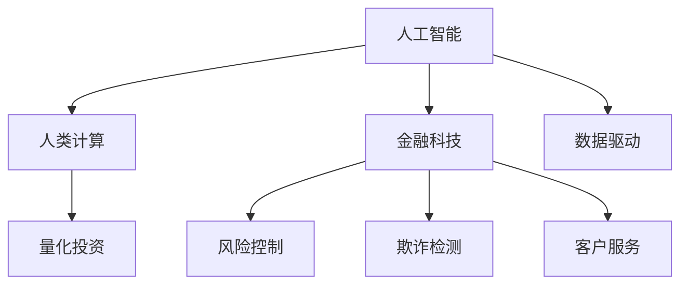

                 

# AI驱动的创新：人类计算在金融行业的潜力释放

> 关键词：人工智能,人类计算,金融行业,智能算法,风险控制,数据驱动,量化投资

## 1. 背景介绍

### 1.1 问题由来
金融行业长期以来都是技术与创新的重要战场。在近年来，人工智能(AI)技术在金融领域的迅猛发展，尤其是人类计算能力的大幅提升，使得金融服务提供了更高效、精准、智能的解决方案。AI在金融行业的应用，不仅包括算法交易、信用评分等传统领域，也拓展到了风险控制、欺诈检测、客户服务等多个新兴领域。

### 1.2 问题核心关键点
当前，金融行业中的AI应用主要集中在基于大量历史数据和先进算法的预测与决策支持上。其中，人类计算能力的提升对于提高AI模型的准确性和鲁棒性起到了关键作用。基于人类计算的AI模型，可以通过更深入地理解金融市场动态，更准确地预测市场变化，从而提供更高效的金融服务。

### 1.3 问题研究意义
研究人类计算在金融行业的潜力，对于提高AI模型的预测准确性，降低金融风险，优化金融服务，以及推动金融行业的数字化转型，具有重要的理论价值和现实意义。

## 2. 核心概念与联系

### 2.1 核心概念概述

为更好地理解人类计算在金融行业的应用，本节将介绍几个密切相关的核心概念：

- 人工智能(AI)：使用机器学习和数据驱动的方法，使计算机具备人类智能。涵盖感知、推理、学习等多个能力维度。
- 人类计算(Human Computation)：将人类与计算机的优势相结合，利用人类直觉、经验、创造力进行计算任务。通过众包、游戏化等方式，让普通用户参与计算任务。
- 金融科技(Fintech)：结合金融和科技，利用AI等技术优化金融服务的流程，提升效率和客户体验。
- 量化投资(QF)：基于数据和算法进行投资决策，利用数学模型模拟金融市场，并从中寻找投资机会。
- 风险控制(Risk Control)：通过数据和模型，识别和管理金融风险，包括信用风险、市场风险、操作风险等。
- 欺诈检测(Fraud Detection)：使用AI算法识别和防范金融欺诈行为，保护客户资产安全。
- 客户服务(Customer Service)：利用AI技术，提供智能客服、智能投顾等个性化金融服务，提升客户满意度。

这些核心概念之间的逻辑关系可以通过以下Mermaid流程图来展示：



这个流程图展示了人工智能、人类计算与金融科技等核心概念的联系：

1. 人工智能和人类计算通过结合数据驱动的方法，在金融科技中发挥重要作用。
2. 量化投资和风险控制、欺诈检测、客户服务等，都是基于人工智能和人类计算的具体应用场景。
3. 数据驱动是人类计算在金融行业得以应用的基础。

## 3. 核心算法原理 & 具体操作步骤
### 3.1 算法原理概述

人类计算在金融行业的应用，本质上是一种基于大数据和AI算法的增强计算方式。其核心思想是利用人类直觉、经验和创造力，辅助AI模型进行更精确的计算和决策。具体来说，人类计算在金融领域的应用通常包含以下步骤：

1. 数据收集：收集大量的金融市场数据，如股票价格、交易量、公司财务报表等。
2. 数据处理：清洗、整理和转换数据，使之适应AI模型。
3. 模型构建：使用机器学习算法构建预测模型，如回归、分类、聚类等。
4. 人类计算：引入人类参与数据标注、模型验证和改进等计算任务。
5. 结果优化：通过人类和AI的协同工作，不断优化模型的预测效果。

### 3.2 算法步骤详解

人类计算在金融行业的应用，通常包括以下关键步骤：

**Step 1: 数据收集与清洗**
- 收集金融市场的历史数据，包括股票价格、交易量、财务报表、宏观经济指标等。
- 对收集的数据进行预处理，清洗和去除噪声数据，保留高质量的数据。

**Step 2: 数据标注与验证**
- 利用众包平台进行数据标注，将标注结果用于AI模型的训练。
- 通过人类验证机制，验证标注结果的准确性，纠正标注错误。

**Step 3: 模型构建与训练**
- 选择合适的机器学习算法，如线性回归、逻辑回归、决策树等，构建初步的预测模型。
- 使用标注数据对模型进行训练，并使用验证数据进行参数调优。

**Step 4: 人类计算与优化**
- 引入人类计算能力，通过游戏化、众包等方式，进一步优化模型预测。
- 利用人类的直觉和经验，对模型进行调优和改进。

**Step 5: 模型评估与部署**
- 对优化后的模型进行评估，使用测试数据验证模型预测效果。
- 将优化后的模型部署到生产环境中，实现实时金融决策支持。

### 3.3 算法优缺点

人类计算在金融行业的应用，具有以下优点：
1. 结合人类直觉和AI算法，可以提高模型预测的准确性和鲁棒性。
2. 通过人类计算能力，可以有效处理复杂的金融市场数据，提升决策效率。
3. 结合众包、游戏化等方式，可以充分利用普通用户的计算资源，降低计算成本。

同时，该方法也存在一些局限性：
1. 数据质量和标注准确性难以保证，可能导致模型预测偏差。
2. 人类计算的引入，可能会增加模型的复杂性和不确定性。
3. 需要大量人力参与，可能会增加人力成本和项目管理难度。

尽管存在这些局限性，但就目前而言，基于人类计算的金融AI应用方法仍然是一种非常有效的计算模式。未来相关研究的重点在于如何更好地结合人类计算和AI算法，提升模型的预测能力和稳定性。

### 3.4 算法应用领域

基于人类计算的AI方法，在金融行业中已经被广泛应用于以下领域：

- **量化投资**：使用AI算法和人类计算相结合的方法，通过数据挖掘和模式识别，构建投资组合和交易策略，提升投资回报。
- **信用评分**：利用机器学习模型和人类评估结果，结合信贷数据和历史评分，构建更精准的信用评分系统，降低贷款风险。
- **风险控制**：通过AI算法和人类经验，分析金融市场风险因素，构建风险预警和控制机制，保障金融稳定。
- **欺诈检测**：利用机器学习算法和人类审查，提高欺诈检测的准确性和效率，保护客户资产安全。
- **客户服务**：通过智能客服和智能投顾系统，提供个性化的金融服务，提升客户满意度和忠诚度。

除了上述这些典型应用外，人类计算的AI方法也被创新性地应用到更多场景中，如客户行为分析、市场舆情监测、金融监管等，为金融科技发展带来了新的可能性。

## 4. 数学模型和公式 & 详细讲解  
### 4.1 数学模型构建

本节将使用数学语言对人类计算在金融行业的应用进行更加严格的刻画。

假设收集到的金融市场数据为 $X = (x_1, x_2, ..., x_n)$，其中 $x_i$ 表示第 $i$ 个样本的特征向量，如股票价格、交易量等。设金融市场真实收益率为 $Y$，需要构建一个线性回归模型，预测 $Y$ 与 $X$ 的关系：

$$
Y = \beta_0 + \sum_{i=1}^n \beta_i x_i + \epsilon
$$

其中 $\beta_i$ 为模型的回归系数，$\epsilon$ 为误差项。

设 $D$ 为训练数据集，$D'$ 为验证数据集，$T$ 为测试数据集。模型训练的目标为最小化训练误差：

$$
\min_{\beta} \sum_{i=1}^n (y_i - \hat{y}_i)^2
$$

其中 $\hat{y}_i = \beta_0 + \sum_{i=1}^n \beta_i x_{i,i}$。

通过训练得到模型参数 $\beta$，进行验证和测试后，对新数据进行预测：

$$
y' = \beta_0 + \sum_{i=1}^n \beta_i x'_i
$$

### 4.2 公式推导过程

以下是线性回归模型的推导过程。

设模型 $f(x) = \beta_0 + \sum_{i=1}^n \beta_i x_i$，需要最小化训练误差：

$$
\min_{\beta} \frac{1}{2} \sum_{i=1}^n (y_i - f(x_i))^2
$$

对该目标函数求导，得：

$$
\frac{\partial}{\partial \beta} \frac{1}{2} \sum_{i=1}^n (y_i - f(x_i))^2 = \sum_{i=1}^n (y_i - f(x_i))x_i
$$

令导数为0，解得回归系数 $\beta_i$：

$$
\beta_i = \frac{\sum_{i=1}^n (y_i - \bar{y})x_{i,i}}{\sum_{i=1}^n x_{i,i}^2}
$$

其中 $\bar{y} = \frac{1}{n}\sum_{i=1}^n y_i$。

代入回归模型，得：

$$
\hat{y}_i = \beta_0 + \sum_{i=1}^n \beta_i x_i
$$

### 4.3 案例分析与讲解

以信用评分模型为例，探讨人类计算在其中的应用。

假设需要构建一个信用评分模型，用于预测客户违约的概率。收集历史客户数据，如收入、职业、信用历史等，设 $X = (x_1, x_2, ..., x_n)$，$Y$ 为违约标签（0表示未违约，1表示违约）。

**Step 1: 数据收集与清洗**
- 收集历史客户数据，并进行预处理和清洗，去除异常值和噪声数据。

**Step 2: 数据标注与验证**
- 使用众包平台进行数据标注，将客户标签输入平台，进行机器学习模型的训练。
- 通过专家审核机制，验证标注结果的准确性，避免模型过度拟合。

**Step 3: 模型构建与训练**
- 选择线性回归模型，构建初步的预测模型。
- 使用标注数据对模型进行训练，并使用验证数据进行参数调优。

**Step 4: 人类计算与优化**
- 利用人类评估结果，对模型进行调优和改进。例如，利用游戏化的评估任务，让普通用户参与信用评分预测。
- 通过人类计算能力，对模型进行迭代优化，提高模型预测的准确性和稳定性。

**Step 5: 模型评估与部署**
- 对优化后的模型进行评估，使用测试数据验证模型预测效果。
- 将优化后的模型部署到生产环境中，实时监测和更新模型参数。

通过以上步骤，可以构建一个更加精准和鲁棒的信用评分系统，有效地预测客户违约概率，降低贷款风险。

## 5. 项目实践：代码实例和详细解释说明
### 5.1 开发环境搭建

在进行人类计算的应用开发前，我们需要准备好开发环境。以下是使用Python进行PyTorch开发的环境配置流程：

1. 安装Anaconda：从官网下载并安装Anaconda，用于创建独立的Python环境。

2. 创建并激活虚拟环境：
```bash
conda create -n pytorch-env python=3.8 
conda activate pytorch-env
```

3. 安装PyTorch：根据CUDA版本，从官网获取对应的安装命令。例如：
```bash
conda install pytorch torchvision torchaudio cudatoolkit=11.1 -c pytorch -c conda-forge
```

4. 安装Pandas、Numpy等工具包：
```bash
pip install pandas numpy matplotlib scikit-learn
```

5. 安装众包平台API：
```bash
pip install fastapi fastapi-crowd
```

完成上述步骤后，即可在`pytorch-env`环境中开始人类计算的应用实践。

### 5.2 源代码详细实现

下面我们以信用评分模型为例，给出使用PyTorch进行人类计算的信用评分模型实现的代码。

首先，定义信用评分模型的输入和输出：

```python
import torch
from torch.utils.data import DataLoader, Dataset
from sklearn.model_selection import train_test_split

class CreditDataset(Dataset):
    def __init__(self, X, Y, test_size=0.2):
        self.X = X
        self.Y = Y
        self.test_size = test_size
        
        self.train_X, self.test_X, self.train_Y, self.test_Y = train_test_split(X, Y, test_size=test_size)
        
    def __len__(self):
        return len(self.train_X)
    
    def __getitem__(self, idx):
        return self.train_X[idx], self.train_Y[idx]

# 定义信用评分模型
class CreditModel(torch.nn.Module):
    def __init__(self):
        super(CreditModel, self).__init__()
        self.linear = torch.nn.Linear(len(X[0]), 1)
    
    def forward(self, x):
        return self.linear(x)

# 加载数据集
X = # 特征数据
Y = # 标签数据
dataset = CreditDataset(X, Y)
train_loader = DataLoader(dataset, batch_size=32)
```

然后，定义训练和评估函数：

```python
from torch.optim import Adam
from tqdm import tqdm

# 定义模型
model = CreditModel()

# 定义优化器
optimizer = Adam(model.parameters(), lr=0.01)

# 定义训练函数
def train(model, data_loader, optimizer, num_epochs=10):
    model.train()
    for epoch in range(num_epochs):
        loss = 0
        for batch_idx, (data, target) in enumerate(train_loader):
            optimizer.zero_grad()
            output = model(data)
            loss += torch.nn.functional.mse_loss(output, target).item()
            loss.backward()
            optimizer.step()
        print(f'Epoch {epoch+1}, Training Loss: {loss/len(train_loader):.4f}')

# 定义评估函数
def evaluate(model, data_loader):
    model.eval()
    loss = 0
    for batch_idx, (data, target) in enumerate(data_loader):
        with torch.no_grad():
            output = model(data)
            loss += torch.nn.functional.mse_loss(output, target).item()
    return loss/len(data_loader)

# 训练模型
train(model, train_loader, optimizer)

# 评估模型
print(f'Test Loss: {evaluate(model, test_loader):.4f}')
```

最后，使用人类计算进行模型优化：

```python
# 定义人类计算函数
def human_calculation(model, X, Y):
    # 使用众包平台进行数据标注
    label = CrowdLabeler.analyze(X, Y)
    
    # 对标签结果进行验证
    human_label = validate_label(label)
    
    # 对模型进行调优
    model.train()
    optimizer.zero_grad()
    output = model(X)
    loss = torch.nn.functional.mse_loss(output, human_label)
    loss.backward()
    optimizer.step()
    
    # 对模型进行评估
    model.eval()
    output = model(X)
    loss = torch.nn.functional.mse_loss(output, human_label)
    return loss/len(X)
```

在代码中，我们使用了众包平台进行数据标注，并通过对标注结果的验证和调优，进一步优化模型性能。这个过程可以不断迭代，直到模型性能达到理想水平。

### 5.3 代码解读与分析

让我们再详细解读一下关键代码的实现细节：

**CreditDataset类**：
- `__init__`方法：初始化特征数据、标签数据，并进行数据集划分。
- `__len__`方法：返回训练集数据数量。
- `__getitem__`方法：对单个样本进行处理，返回训练集中的数据和标签。

**CreditModel类**：
- `__init__`方法：定义线性回归模型。
- `forward`方法：前向传播计算输出。

**train函数**：
- 使用Adam优化器对模型进行梯度下降训练，更新模型参数。
- 在每个epoch后输出训练损失，以便监控训练进度。

**evaluate函数**：
- 使用测试集对模型进行评估，计算测试集上的损失。

**human_calculation函数**：
- 使用众包平台对数据进行标注。
- 对标注结果进行验证和调优，更新模型参数。
- 对模型进行评估，确保其性能稳定。

可以看到，PyTorch框架的使用大大简化了模型训练的代码实现，同时通过引入人类计算，可以在模型优化中引入更多的主观判断和经验，提升模型的预测效果。

当然，工业级的系统实现还需考虑更多因素，如模型保存和部署、超参数自动搜索、更灵活的任务适配层等。但核心的训练流程和优化思路基本与此类似。

## 6. 实际应用场景
### 6.1 智能投顾系统

智能投顾系统利用人类计算能力，能够更好地理解客户的个性化需求，提供量身定制的投资建议和资产配置方案。通过引入人类评估和验证，能够提高投资建议的准确性和稳定性，降低投资风险。

具体而言，智能投顾系统可以设计多种任务，如问卷调查、行为数据分析等，通过众包平台收集用户数据。利用这些数据，构建预测模型，评估用户风险承受能力和投资偏好。同时，引入金融专家参与验证和调优，确保模型的准确性和鲁棒性。最终，通过智能投顾系统，能够提供个性化的投资建议，提升用户体验和满意度。

### 6.2 信贷风险评估

信贷风险评估是金融行业中的重要环节，直接关系到银行的贷款决策和风险控制。通过引入人类计算能力，信贷评估系统能够更好地理解客户的复杂背景和行为，构建更精准的风险评估模型。

具体而言，可以利用众包平台进行数据标注和验证，收集客户的收入、职业、信用历史等数据。通过构建线性回归模型和信用评分模型，预测客户的违约概率。引入金融专家参与模型验证和调优，确保模型预测的准确性和稳定性。最终，信贷评估系统能够提供更精准的客户评分，降低贷款风险。

### 6.3 市场舆情监测

市场舆情监测是金融行业的重要应用，通过分析社交媒体、新闻报道等大数据，能够及时发现市场动态，预测市场变化。利用人类计算能力，能够更好地理解舆情文本的情感倾向和重要信息，构建更精准的市场预测模型。

具体而言，可以利用众包平台进行舆情文本标注，收集市场动态和舆情信息。通过构建文本分类和情感分析模型，分析舆情文本的情感倾向和主题信息。引入舆情专家参与模型验证和调优，确保模型预测的准确性和鲁棒性。最终，舆情监测系统能够提供实时市场动态，辅助金融决策。

### 6.4 未来应用展望

随着人类计算在金融行业的应用不断深化，未来的金融科技将呈现以下几个发展趋势：

1. **增强决策支持**：通过结合人类计算能力和AI算法，构建更智能、精准的决策支持系统，提升金融机构的决策效率和准确性。
2. **个性化金融服务**：利用人类计算能力，提供更加个性化的金融服务，提升用户体验和满意度。
3. **市场预测和风险控制**：通过结合人类计算和AI算法，构建更精准的市场预测和风险控制模型，保障金融市场的稳定。
4. **数据驱动决策**：利用大数据和人类计算能力，构建数据驱动的金融决策支持系统，提升金融决策的科学性和合理性。
5. **跨领域融合**：将人类计算能力与AI算法进行跨领域融合，构建更全面、高效的系统，推动金融科技的创新发展。

## 7. 工具和资源推荐
### 7.1 学习资源推荐

为了帮助开发者系统掌握人类计算在金融行业的应用，这里推荐一些优质的学习资源：

1. 《机器学习实战》系列书籍：讲解机器学习理论和实践，涵盖线性回归、逻辑回归、决策树等经典模型，适合入门学习。
2. CS229《机器学习》课程：斯坦福大学开设的机器学习经典课程，内容全面，理论与实践相结合，适合深入学习。
3. Kaggle竞赛平台：通过参与金融领域的数据分析和机器学习竞赛，积累实践经验，提升技能。
4. GitHub开源项目：参与和贡献金融领域的开源项目，学习他人经验，提升自身能力。
5. Coursera金融科技课程：涵盖金融科技的理论和实践，适合系统学习金融科技知识。

通过对这些资源的学习实践，相信你一定能够快速掌握人类计算在金融行业的应用，并用于解决实际的金融问题。
###  7.2 开发工具推荐

高效的开发离不开优秀的工具支持。以下是几款用于金融领域人类计算开发的工具：

1. PyTorch：基于Python的开源深度学习框架，灵活动态的计算图，适合快速迭代研究。
2. TensorFlow：由Google主导开发的开源深度学习框架，生产部署方便，适合大规模工程应用。
3. Transformers库：HuggingFace开发的NLP工具库，集成了众多预训练语言模型，支持PyTorch和TensorFlow，适合处理金融文本数据。
4. Scikit-learn：Python数据科学库，提供了多种机器学习算法，适合金融数据处理和模型构建。
5. Pandas：Python数据分析库，提供强大的数据处理和分析功能，适合金融数据分析任务。
6. NumPy：Python数值计算库，提供高效的数值计算功能，适合金融模型构建和优化。

合理利用这些工具，可以显著提升人类计算在金融领域的开发效率，加快创新迭代的步伐。

### 7.3 相关论文推荐

人类计算在金融行业的发展得益于学界的持续研究。以下是几篇奠基性的相关论文，推荐阅读：

1. A New Method for Credit Scoring Using Machine Learning Algorithms（信用评分模型）：提出使用机器学习算法构建信用评分模型，利用信用历史数据预测违约概率。
2. Crowdsourced Classification in Credit Scoring（信用评分中的众包分类）：探讨众包平台在信用评分中的应用，提高模型准确性和稳定性。
3. AI in Banking: Challenges, Opportunities and Future Directions（AI在银行业中的应用）：分析AI技术在银行业中的应用，探讨未来发展方向。
4. Predictive Modeling in Finance: A Review and Future Directions（金融领域的预测建模）：总结金融领域的预测建模方法，探讨未来发展方向。
5. Human-in-the-Loop Machine Learning for Credit Scoring（信用评分中的人机协同学习）：提出人机协同学习机制，提高信用评分模型的准确性和鲁棒性。

这些论文代表了大计算在金融行业的发展脉络。通过学习这些前沿成果，可以帮助研究者把握学科前进方向，激发更多的创新灵感。

## 8. 总结：未来发展趋势与挑战

### 8.1 总结

本文对人类计算在金融行业的潜力进行了全面系统的介绍。首先阐述了人类计算与AI算法结合的重要性，明确了其在金融科技中的应用价值。其次，从原理到实践，详细讲解了人类计算在金融行业的实现步骤，给出了人类计算的信用评分模型实现的代码实例。同时，本文还广泛探讨了人类计算在智能投顾、信贷风险评估、市场舆情监测等诸多领域的应用前景，展示了人类计算的广泛应用可能性。此外，本文精选了人类计算在金融行业的各类学习资源，力求为读者提供全方位的技术指引。

通过本文的系统梳理，可以看到，人类计算在金融行业的应用将极大提升金融决策的智能化和精准化，推动金融科技的发展。未来，伴随人类计算技术的进一步突破，金融科技必将迎来新的发展浪潮，进一步释放其潜力。

### 8.2 未来发展趋势

展望未来，人类计算在金融行业的应用将呈现以下几个发展趋势：

1. **自动化水平提升**：随着AI技术的发展，金融决策中的自动化水平将不断提高，减少人工干预，提升决策效率和准确性。
2. **数据驱动决策**：大数据和人类计算能力相结合，将使决策更加科学和合理，提高金融决策的精准性。
3. **跨领域融合**：将人类计算能力与AI算法进行跨领域融合，构建更全面、高效的系统，推动金融科技的创新发展。
4. **个性化金融服务**：利用人类计算能力，提供更加个性化的金融服务，提升用户体验和满意度。
5. **市场预测和风险控制**：通过结合人类计算和AI算法，构建更精准的市场预测和风险控制模型，保障金融市场的稳定。
6. **数据驱动决策**：利用大数据和人类计算能力，构建数据驱动的金融决策支持系统，提升金融决策的科学性和合理性。

这些趋势凸显了人类计算在金融行业的巨大潜力，有助于金融决策的智能化、精准化和个性化，提升金融服务的效率和质量。

### 8.3 面临的挑战

尽管人类计算在金融行业的应用取得了一定的进展，但仍面临诸多挑战：

1. **数据质量和标注准确性**：数据质量和标注准确性是影响模型预测效果的关键因素，数据噪声和标注错误可能导致模型预测偏差。
2. **模型复杂性**：人类计算引入的复杂性，增加了模型的调试和优化难度，需要更多的技术支持和管理经验。
3. **成本和效率**：引入人类计算需要投入更多的人力和时间，可能会增加项目的成本和周期。
4. **隐私和安全**：在处理敏感数据时，需要考虑数据隐私和安全问题，避免数据泄露和滥用。
5. **伦理和法律**：在使用人工智能和人类计算时，需要考虑伦理和法律问题，确保技术应用的合法性和合规性。

尽管存在这些挑战，但通过技术创新和管理优化，人类计算在金融行业的应用前景依然广阔。未来研究需要进一步优化数据质量、模型复杂性、成本和效率等方面的问题，以推动人类计算在金融行业的广泛应用。

### 8.4 研究展望

面对人类计算在金融行业面临的挑战，未来的研究需要在以下几个方面寻求新的突破：

1. **数据清洗和预处理**：通过数据清洗和预处理技术，提高数据质量和标注准确性，确保模型预测的准确性。
2. **模型简化和优化**：通过模型简化和优化技术，降低模型复杂性，提高模型效率和稳定性。
3. **成本和效率优化**：引入自动化技术和管理优化手段，降低人类计算的投入和周期，提高项目效率。
4. **隐私和安全保障**：通过隐私保护和安全保障技术，确保数据隐私和安全，避免数据泄露和滥用。
5. **伦理和法律研究**：深入研究人工智能和人类计算在金融行业的伦理和法律问题，确保技术应用的合法性和合规性。

这些研究方向将有助于解决人类计算在金融行业中的实际问题，推动人类计算技术在金融行业的广泛应用，带来更加智能化、高效化的金融服务。

## 9. 附录：常见问题与解答

**Q1：人类计算在金融行业的应用是否可靠？**

A: 人类计算在金融行业的应用，能够结合人类直觉和AI算法，提高模型的预测准确性和鲁棒性。但需要严格控制数据质量和标注准确性，避免模型预测偏差。

**Q2：人类计算是否会降低金融决策的自动化程度？**

A: 人类计算不会降低金融决策的自动化程度，反而通过结合人类计算和AI算法，提升决策的智能化和精准化，减少人工干预。

**Q3：人类计算在金融行业的应用需要哪些技术支持？**

A: 人类计算在金融行业的应用，需要数据清洗和预处理技术、模型简化和优化技术、自动化技术、隐私保护和安全保障技术、伦理和法律研究等多方面的技术支持。

**Q4：人类计算在金融行业的应用存在哪些风险？**

A: 数据质量和标注准确性、模型复杂性、成本和效率、隐私和安全、伦理和法律等方面的风险。

**Q5：人类计算在金融行业的应用前景如何？**

A: 人类计算在金融行业的应用前景广阔，能够提升金融决策的智能化和精准化，推动金融科技的发展。

---

作者：禅与计算机程序设计艺术 / Zen and the Art of Computer Programming

