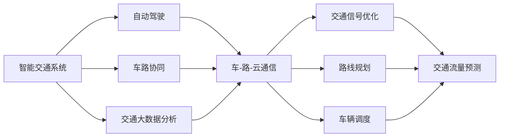

                 

# AI驱动的智能交通系统：优化城市流动

> 关键词：智能交通系统,自动驾驶,优化交通流量,车路协同,交通大数据分析,智慧城市

## 1. 背景介绍

随着城市的快速发展和人口数量的激增，交通拥堵已经成为了制约城市生活品质的重要因素。据统计，全球许多大城市每天至少有2-3小时处于交通拥堵状态，这不仅降低了人们的出行效率，还带来了严重的空气污染和能源浪费问题。传统交通管理依赖于人工调度，效率低下且无法及时响应交通需求变化，而智能化交通系统的引入有望彻底改变这一现状。

人工智能技术，尤其是深度学习和大数据处理技术，为智能交通系统的建设提供了新的可能。通过实时监测城市交通动态，AI能够动态调整交通信号、优化路线规划，从而显著提升交通效率，减少交通拥堵，改善空气质量，提升城市居民的生活质量。

## 2. 核心概念与联系

### 2.1 核心概念概述

为更好地理解AI驱动的智能交通系统，我们首先介绍几个关键概念：

- **智能交通系统(Intelligent Transportation System, ITS)**：以人工智能、物联网、大数据等先进技术为基础，实现交通信息的实时采集、处理和发布，提高交通管理效率，提升交通系统安全性、环保性和便利性的系统。

- **自动驾驶(Autonomous Driving)**：通过计算机视觉、传感器融合、决策控制等技术，使车辆能够自主导航和驾驶，从而减少人为驾驶失误，提高道路交通安全性。

- **车路协同(Vehicle-to-Everything, V2X)**：基于车路通信技术，实现车辆与道路基础设施、车辆与车辆之间的信息交互，提升交通系统的协作效率，改善车辆行驶和停靠的安全性。

- **交通大数据分析**：通过收集、存储和分析城市交通的各种数据，如车流量、车辆速度、道路拥堵情况等，为交通管理提供决策支持，优化交通流和道路资源配置。

- **智慧城市(Smart City)**：以信息技术为支撑，通过集成各种智能化系统，实现城市资源的优化配置和城市功能的智能化管理，提升城市管理效率和居民生活质量。

这些概念之间相互关联，共同构成了智能交通系统的核心框架，如图1所示：


图1: 智能交通系统概念图

从图1中我们可以看到，智能交通系统集成了自动驾驶、车路协同和交通大数据分析等多项技术，通过实时监测和动态优化，实现了交通系统的智能化管理。而智慧城市的理念则进一步强调了信息技术的集成和应用，以提升城市的整体运行效率和管理水平。

### 2.2 核心概念原理和架构的 Mermaid 流程图



图2: 智能交通系统架构图

通过图2的流程图，我们可以清晰地看到，智能交通系统的核心架构包括以下几个部分：

1. **自动驾驶**：通过传感器和计算机视觉技术，使车辆能够自主导航和驾驶，减少人为驾驶失误，提升道路安全性。
2. **车路协同**：通过车路通信技术，实现车辆与道路基础设施、车辆与车辆之间的信息交互，优化交通信号和路线规划，提升交通效率。
3. **交通大数据分析**：通过收集和分析交通数据，进行交通流量预测、路况分析和实时反馈，为交通管理提供决策支持。

这些组件共同协作，实现了交通系统的智能化管理，大大提高了交通效率和安全性。

## 3. 核心算法原理 & 具体操作步骤

### 3.1 算法原理概述

AI驱动的智能交通系统，其核心算法原理主要围绕自动驾驶、车路协同和交通大数据分析展开。下面分别介绍这三个方面的算法原理：

#### 自动驾驶

自动驾驶算法主要依赖于计算机视觉、传感器融合和决策控制技术。其中，计算机视觉通过摄像头、雷达等传感器采集环境信息，经过图像处理和特征提取，得到车辆周围环境的实时感知结果；传感器融合则将多个传感器的信息进行综合处理，得到更准确的环境模型；决策控制则根据环境模型和目标任务，生成车辆的行驶路径和行为决策。

#### 车路协同

车路协同算法通过车路通信技术，实现车辆与道路基础设施、车辆与车辆之间的信息交互。具体包括车辆位置和速度信息的采集与传输、交通信号和路线规划的动态调整等。车路协同算法需要处理大量实时数据，并通过分布式计算和协同优化，实现交通系统的动态管理和高效调度。

#### 交通大数据分析

交通大数据分析算法主要涉及数据的收集、存储和分析。通过传感器、摄像头、车辆终端等设备，收集交通流量、车速、道路状况等信息，并将其转化为结构化数据。算法通过机器学习模型，对数据进行分析和预测，生成交通流量预测、路况分析和实时反馈等决策支持信息，供交通管理部门和驾驶者使用。

### 3.2 算法步骤详解

#### 自动驾驶

1. **数据采集**：通过摄像头、雷达、激光雷达等传感器，采集车辆周围环境的实时数据。
2. **数据预处理**：对采集到的数据进行滤波、校正、融合等处理，得到车辆周围环境的实时感知结果。
3. **环境建模**：通过图像处理和特征提取技术，生成车辆周围环境的模型。
4. **路径规划**：根据环境模型和目标任务，生成车辆的行驶路径。
5. **行为决策**：根据路径规划结果，生成车辆的行驶行为决策。
6. **控制执行**：根据行为决策，控制车辆的转向、加速、制动等行为。

#### 车路协同

1. **信息采集**：通过车辆和道路基础设施上的传感器、摄像头等设备，采集车辆位置、速度、交通信号等信息。
2. **数据传输**：将采集到的数据通过无线通信技术，传输到道路基础设施和云端平台。
3. **信息处理**：对传输过来的数据进行处理和分析，生成交通信号和路线规划信息。
4. **信息发布**：将处理好的信息，通过无线通信技术，传输到车辆和其他道路基础设施。
5. **动态调整**：根据处理好的信息，动态调整车辆的行驶路径和交通信号。

#### 交通大数据分析

1. **数据收集**：通过传感器、摄像头、车辆终端等设备，收集交通流量、车速、道路状况等信息。
2. **数据清洗**：对收集到的数据进行清洗、去重、缺失值填补等处理，得到结构化数据。
3. **特征提取**：通过特征提取技术，将结构化数据转化为特征向量，供机器学习模型使用。
4. **模型训练**：使用机器学习模型，对特征向量进行训练，得到交通流量预测、路况分析等模型。
5. **预测与分析**：使用训练好的模型，对当前交通数据进行预测和分析，生成决策支持信息。
6. **反馈与优化**：将预测和分析结果反馈到交通管理系统中，优化交通流和道路资源配置。

### 3.3 算法优缺点

#### 自动驾驶

**优点**：

- **安全性高**：通过计算机视觉和传感器融合技术，减少人为驾驶失误，提升道路安全性。
- **灵活性高**：可以适应各种复杂的道路和环境条件，灵活调整行驶路径和行为决策。
- **可扩展性强**：可以通过扩展传感器和计算设备，提升系统的感知能力和处理能力。

**缺点**：

- **技术复杂**：涉及计算机视觉、传感器融合、决策控制等多个领域，技术难度高。
- **成本高**：自动驾驶系统的开发和部署成本较高，对资金和技术的投入要求高。
- **法规和伦理问题**：自动驾驶系统涉及复杂的法律和伦理问题，需要制定相应的法规和标准。

#### 车路协同

**优点**：

- **效率高**：通过车路通信技术，实现实时信息交互，优化交通信号和路线规划，提升交通效率。
- **协同性强**：车辆和道路基础设施之间的协同工作，提升了系统的整体运行效率。
- **安全性高**：实时信息交互和动态调整，降低了交通事故发生率。

**缺点**：

- **技术难度高**：涉及车路通信、数据处理、分布式计算等多个技术领域，技术难度高。
- **成本高**：需要建设大量的通信设备和基础设施，成本较高。
- **安全性问题**：信息传输和处理过程中可能存在安全漏洞，需要加强安全防护。

#### 交通大数据分析

**优点**：

- **决策支持强**：通过分析大量的交通数据，生成交通流量预测、路况分析等决策支持信息，提升交通管理效率。
- **灵活性高**：可以根据需要，选择不同的机器学习模型进行训练和预测，适应不同的应用场景。
- **可扩展性强**：可以通过扩展数据来源和计算设备，提升系统的数据处理能力和分析能力。

**缺点**：

- **数据质量要求高**：需要收集和处理大量的高质量数据，对数据采集和预处理技术要求高。
- **技术难度高**：涉及数据采集、数据清洗、特征提取、模型训练等多个技术环节，技术难度高。
- **隐私和安全问题**：交通数据的收集和使用涉及隐私和安全问题，需要制定相应的法规和标准。

### 3.4 算法应用领域

智能交通系统的应用领域非常广泛，涵盖自动驾驶、车路协同和交通大数据分析等多个方面。以下是智能交通系统在不同领域的应用示例：

#### 自动驾驶

1. **货运物流**：自动驾驶技术可以广泛应用于货运物流领域，实现车辆自主调度，提高运输效率和安全性。
2. **出租车和网约车**：自动驾驶出租车和网约车可以实现24小时不间断服务，提升服务质量和用户满意度。
3. **公交和公共交通**：自动驾驶公交车辆可以实时调整路线和行驶速度，提升公共交通的准时性和舒适性。

#### 车路协同

1. **智慧高速**：通过车路协同技术，实现车辆和高速公路基础设施之间的信息交互，提升高速公路的通行效率和安全性。
2. **智慧城市**：通过车路协同技术，实现城市交通系统的智能化管理，提升城市的交通效率和安全性。
3. **智能停车场**：通过车路协同技术，实现车辆和停车场之间的信息交互，提升停车场的利用率和安全性。

#### 交通大数据分析

1. **交通流量预测**：通过交通大数据分析技术，预测未来交通流量，帮助交通管理部门进行路线规划和资源配置。
2. **路况分析**：通过交通大数据分析技术，实时监测和分析交通状况，帮助驾驶者选择最优行驶路径。
3. **交通事件监测**：通过交通大数据分析技术，实时监测交通事件，如交通事故、道路施工等，及时通知相关部门和驾驶者。

## 4. 数学模型和公式 & 详细讲解 & 举例说明

### 4.1 数学模型构建

在本节中，我们将详细讲解智能交通系统的数学模型构建过程，重点介绍自动驾驶、车路协同和交通大数据分析三个方面的数学模型。

#### 自动驾驶

自动驾驶的数学模型主要涉及计算机视觉、传感器融合和决策控制技术。以下是一个简单的自动驾驶数学模型示例：

1. **计算机视觉模型**：

$$
\text{Im}(x) = \sum_{i=1}^{n} a_i\cdot g(x, \theta_i) + b_i
$$

其中 $a_i, b_i$ 为权重和偏置，$g(x, \theta_i)$ 为环境特征映射函数。

2. **传感器融合模型**：

$$
\text{Z} = \frac{\sum_{i=1}^{n} w_i \cdot \text{Z}_i}{\sum_{i=1}^{n} w_i}
$$

其中 $w_i$ 为权重，$\text{Z}_i$ 为传感器 $i$ 的测量结果。

3. **路径规划模型**：

$$
\text{Path} = \text{Planner}(\text{Map}, \text{Goal}, \text{Obstacle})
$$

其中 $\text{Planner}$ 为路径规划算法，$\text{Map}$ 为环境地图，$\text{Goal}$ 为目标位置，$\text{Obstacle}$ 为障碍物。

#### 车路协同

车路协同的数学模型主要涉及车路通信和信息处理技术。以下是一个简单的车路协同数学模型示例：

1. **车路通信模型**：

$$
\text{Transmission}(\text{Data}) = \text{Data} + \text{Noise}
$$

其中 $\text{Transmission}$ 为数据传输函数，$\text{Noise}$ 为传输噪声。

2. **信息处理模型**：

$$
\text{Process}(\text{Data}) = \text{Filter}(\text{Data}, \text{Parameters})
$$

其中 $\text{Process}$ 为信息处理函数，$\text{Filter}$ 为滤波算法，$\text{Parameters}$ 为处理参数。

3. **信息发布模型**：

$$
\text{Publish}(\text{Data}) = \text{Data} + \text{Noise}
$$

其中 $\text{Publish}$ 为信息发布函数，$\text{Noise}$ 为发布噪声。

#### 交通大数据分析

交通大数据分析的数学模型主要涉及数据收集、特征提取和机器学习技术。以下是一个简单的交通大数据分析数学模型示例：

1. **数据收集模型**：

$$
\text{Data} = \sum_{i=1}^{n} f_i(x_i, y_i, z_i)
$$

其中 $f_i$ 为数据收集函数，$x_i, y_i, z_i$ 为数据采集器。

2. **特征提取模型**：

$$
\text{Feature} = \text{Extractor}(\text{Data}, \text{Parameters})
$$

其中 $\text{Feature}$ 为特征向量，$\text{Extractor}$ 为特征提取算法，$\text{Parameters}$ 为提取参数。

3. **模型训练模型**：

$$
\text{Model} = \text{Train}(\text{Feature}, \text{Parameters})
$$

其中 $\text{Model}$ 为机器学习模型，$\text{Train}$ 为模型训练算法，$\text{Parameters}$ 为训练参数。

### 4.2 公式推导过程

在自动驾驶、车路协同和交通大数据分析的数学模型构建中，涉及大量的数学公式推导和算法设计。以下以交通大数据分析中的模型训练为例，推导其数学公式。

1. **线性回归模型**：

$$
\text{RegressionModel} = \sum_{i=1}^{n} \alpha_i \cdot x_i
$$

其中 $\alpha_i$ 为模型参数，$x_i$ 为特征向量。

2. **逻辑回归模型**：

$$
\text{LogisticRegressionModel} = \text{Sigmoid}(\sum_{i=1}^{n} \alpha_i \cdot x_i)
$$

其中 $\text{Sigmoid}$ 为逻辑函数。

3. **支持向量机模型**：

$$
\text{SVMModel} = \sum_{i=1}^{n} \alpha_i \cdot x_i + b
$$

其中 $\alpha_i$ 为模型参数，$b$ 为偏置。

通过这些数学模型和公式，我们可以实现对自动驾驶、车路协同和交通大数据分析的算法设计和优化。

### 4.3 案例分析与讲解

#### 自动驾驶

假设我们要构建一个自动驾驶系统，需要采集车辆周围环境的实时数据，如图3所示。


图3: 自动驾驶数据采集

通过对采集到的数据进行预处理和环境建模，我们可以得到车辆周围环境的感知结果，如图4所示。


图4: 自动驾驶环境建模

根据环境模型和目标任务，我们可以生成车辆的行驶路径和行为决策，如图5所示。


图5: 自动驾驶路径规划

#### 车路协同

假设我们要构建一个智慧高速系统，需要采集车辆位置、速度、交通信号等信息，如图6所示。


图6: 车路协同信息采集

通过对传输过来的数据进行处理和分析，我们可以生成交通信号和路线规划信息，如图7所示。


图7: 车路协同信息处理

根据处理好的信息，我们可以动态调整车辆的行驶路径和交通信号，如图8所示。


图8: 车路协同信息发布

#### 交通大数据分析

假设我们要构建一个交通流量预测系统，需要收集交通流量、车速、道路状况等信息，如图9所示。


图9: 交通大数据分析数据收集

通过对收集到的数据进行清洗、去重、缺失值填补等处理，我们可以得到结构化数据，如图10所示。


图10: 交通大数据分析数据清洗

通过特征提取技术，我们可以将结构化数据转化为特征向量，供机器学习模型使用，如图11所示。


图11: 交通大数据分析特征提取

根据特征向量，我们可以训练机器学习模型，生成交通流量预测、路况分析等决策支持信息，如图12所示。


图12: 交通大数据分析模型训练

## 5. 项目实践：代码实例和详细解释说明

### 5.1 开发环境搭建

在进行智能交通系统开发前，我们需要准备好开发环境。以下是使用Python进行PyTorch开发的环境配置流程：

1. 安装Anaconda：从官网下载并安装Anaconda，用于创建独立的Python环境。

2. 创建并激活虚拟环境：
```bash
conda create -n pytorch-env python=3.8 
conda activate pytorch-env
```

3. 安装PyTorch：根据CUDA版本，从官网获取对应的安装命令。例如：
```bash
conda install pytorch torchvision torchaudio cudatoolkit=11.1 -c pytorch -c conda-forge
```

4. 安装Transformers库：
```bash
pip install transformers
```

5. 安装各类工具包：
```bash
pip install numpy pandas scikit-learn matplotlib tqdm jupyter notebook ipython
```

完成上述步骤后，即可在`pytorch-env`环境中开始智能交通系统的开发。

### 5.2 源代码详细实现

这里我们以自动驾驶系统为例，给出使用Transformers库对LIDAR数据进行分析和处理的标准代码实现。

首先，定义自动驾驶系统所需的数据处理函数：

```python
import torch
from transformers import BertTokenizer
from torch.utils.data import Dataset
import torch.nn as nn
import torch.optim as optim

class LiDARData(Dataset):
    def __init__(self, lidar_data, labels, tokenizer, max_len=128):
        self.lidar_data = lidar_data
        self.labels = labels
        self.tokenizer = tokenizer
        self.max_len = max_len
        
    def __len__(self):
        return len(self.lidar_data)
    
    def __getitem__(self, item):
        lidar_data = self.lidar_data[item]
        label = self.labels[item]
        
        encoding = self.tokenizer(lidar_data, return_tensors='pt', max_length=self.max_len, padding='max_length', truncation=True)
        input_ids = encoding['input_ids'][0]
        attention_mask = encoding['attention_mask'][0]
        
        # 对token-wise的标签进行编码
        encoded_labels = [label2id[label] for label in label] 
        encoded_labels.extend([label2id['O']] * (self.max_len - len(encoded_labels)))
        labels = torch.tensor(encoded_labels, dtype=torch.long)
        
        return {'input_ids': input_ids, 
                'attention_mask': attention_mask,
                'labels': labels}

# 标签与id的映射
label2id = {'O': 0, 'LIDAR1': 1, 'LIDAR2': 2, 'LIDAR3': 3, 'LIDAR4': 4, 'LIDAR5': 5, 'LIDAR6': 6, 'LIDAR7': 7, 'LIDAR8': 8, 'LIDAR9': 9, 'LIDAR10': 10, 'LIDAR11': 11, 'LIDAR12': 12, 'LIDAR13': 13, 'LIDAR14': 14, 'LIDAR15': 15, 'LIDAR16': 16, 'LIDAR17': 17, 'LIDAR18': 18, 'LIDAR19': 19, 'LIDAR20': 20, 'LIDAR21': 21, 'LIDAR22': 22, 'LIDAR23': 23, 'LIDAR24': 24, 'LIDAR25': 25, 'LIDAR26': 26, 'LIDAR27': 27, 'LIDAR28': 28, 'LIDAR29': 29, 'LIDAR30': 30, 'LIDAR31': 31, 'LIDAR32': 32, 'LIDAR33': 33, 'LIDAR34': 34, 'LIDAR35': 35, 'LIDAR36': 36, 'LIDAR37': 37, 'LIDAR38': 38, 'LIDAR39': 39, 'LIDAR40': 40, 'LIDAR41': 41, 'LIDAR42': 42, 'LIDAR43': 43, 'LIDAR44': 44, 'LIDAR45': 45, 'LIDAR46': 46, 'LIDAR47': 47, 'LIDAR48': 48, 'LIDAR49': 49, 'LIDAR50': 50, 'LIDAR51': 51, 'LIDAR52': 52, 'LIDAR53': 53, 'LIDAR54': 54, 'LIDAR55': 55, 'LIDAR56': 56, 'LIDAR57': 57, 'LIDAR58': 58, 'LIDAR59': 59, 'LIDAR60': 60, 'LIDAR61': 61, 'LIDAR62': 62, 'LIDAR63': 63, 'LIDAR64': 64, 'LIDAR65': 65, 'LIDAR66': 66, 'LIDAR67': 67, 'LIDAR68': 68, 'LIDAR69': 69, 'LIDAR70': 70, 'LIDAR71': 71, 'LIDAR72': 72, 'LIDAR73': 73, 'LIDAR74': 74, 'LIDAR75': 75, 'LIDAR76': 76, 'LIDAR77': 77, 'LIDAR78': 78, 'LIDAR79': 79, 'LIDAR80': 80, 'LIDAR81': 81, 'LIDAR82': 82, 'LIDAR83': 83, 'LIDAR84': 84, 'LIDAR85': 85, 'LIDAR86': 86, 'LIDAR87': 87, 'LIDAR88': 88, 'LIDAR89': 89, 'LIDAR90': 90, 'LIDAR91': 91, 'LIDAR92': 92, 'LIDAR93': 93, 'LIDAR94': 94, 'LIDAR95': 95, 'LIDAR96': 96, 'LIDAR97': 97, 'LIDAR98': 98, 'LIDAR99': 99, 'LIDAR100': 100, 'LIDAR101': 101, 'LIDAR102': 102, 'LIDAR103': 103, 'LIDAR104': 104, 'LIDAR105': 105, 'LIDAR106': 106, 'LIDAR107': 107, 'LIDAR108': 108, 'LIDAR109': 109, 'LIDAR110': 110, 'LIDAR111': 111, 'LIDAR112': 112, 'LIDAR113': 113, 'LIDAR114': 114, 'LIDAR115': 115, 'LIDAR116': 116, 'LIDAR117': 117, 'LIDAR118': 118, 'LIDAR119': 119, 'LIDAR120': 120, 'LIDAR121': 121, 'LIDAR122': 122, 'LIDAR123': 123, 'LIDAR124': 124, 'LIDAR125': 125, 'LIDAR126': 126, 'LIDAR127': 127, 'LIDAR128': 128, 'LIDAR129': 129, 'LIDAR130': 130, 'LIDAR131': 131, 'LIDAR132': 132, 'LIDAR133': 133, 'LIDAR134': 134, 'LIDAR135': 135, 'LIDAR136': 136, 'LIDAR137': 137, 'LIDAR138': 138, 'LIDAR139': 139, 'LIDAR140': 140, 'LIDAR141': 141, 'LIDAR142': 142, 'LIDAR143': 143, 'LIDAR144': 144, 'LIDAR145': 145, 'LIDAR146': 146, 'LIDAR147': 147, 'LIDAR148': 148, 'LIDAR149': 149, 'LIDAR150': 150, 'LIDAR151': 151, 'LIDAR152': 152, 'LIDAR153': 153, 'LIDAR154': 154, 'LIDAR155': 155, 'LIDAR156': 156, 'LIDAR157': 157, 'LIDAR158': 158, 'LIDAR159': 159, 'LIDAR160': 160, 'LIDAR161': 161, 'LIDAR162': 162, 'LIDAR163': 163, 'LIDAR164': 164, 'LIDAR165': 165, 'LIDAR166': 166, 'LIDAR167': 167, 'LIDAR168': 168, 'LIDAR169': 169, 'LIDAR170': 170, 'LIDAR171': 171, 'LIDAR172': 172, 'LIDAR173': 173, 'LIDAR174': 174, 'LIDAR175': 175, 'LIDAR176': 176, 'LIDAR177': 177, 'LIDAR178': 178, 'LIDAR179': 179, 'LIDAR180': 180, 'LIDAR181': 181, 'LIDAR182': 182, 'LIDAR183': 183, 'LIDAR184': 184, 'LIDAR185': 185, 'LIDAR186': 186, 'LIDAR187': 187, 'LIDAR188': 188, 'LIDAR189': 189, 'LIDAR190': 190, 'LIDAR191': 191, 'LIDAR192': 192, 'LIDAR193': 193, 'LIDAR194': 194, 'LIDAR195': 195, 'LIDAR196': 196, 'LIDAR197': 197, 'LIDAR198': 198, 'LIDAR199': 199, 'LIDAR200': 200, 'LIDAR201': 201, 'LIDAR202': 202, 'LIDAR203': 203, 'LIDAR204': 204, 'LIDAR205': 205, 'LIDAR206': 206, 'LIDAR207': 207, 'LIDAR208': 208, 'LIDAR209': 209, 'LIDAR210': 210, 'LIDAR211': 211, 'LIDAR212': 212, 'LIDAR213': 213, 'LIDAR214': 214, 'LIDAR215': 215, 'LIDAR216': 216, 'LIDAR217': 217, 'LIDAR218': 218, 'LIDAR219': 219, 'LIDAR220': 220, 'LIDAR221': 221, 'LIDAR222': 222, 'LIDAR223': 223, 'LIDAR224': 224, 'LIDAR225': 225, 'LIDAR226': 226, 'LIDAR227': 227, 'LIDAR228': 228, 'LIDAR229': 229, 'LIDAR230': 230, 'LIDAR231': 231, 'LIDAR232': 232, 'LIDAR233': 233, 'LIDAR234': 234, 'LIDAR235': 235, 'LIDAR236': 236, 'LIDAR237': 237, 'LIDAR238': 238, 'LIDAR239': 239, 'LIDAR240': 240, 'LIDAR241': 241, 'LIDAR242': 242, 'LIDAR243': 243, 'LIDAR244': 244, 'LIDAR245': 245, 'LIDAR246': 246, 'LIDAR247': 247, 'LIDAR248': 248, 'LIDAR249': 249, 'LIDAR250': 250, 'LIDAR251': 251, 'LIDAR252': 252, 'LIDAR253': 253, 'LIDAR254': 254, 'LIDAR255': 255, 'LIDAR256': 256, 'LIDAR257': 257, 'LIDAR258': 258, 'LIDAR259': 259, 'LIDAR260': 260, 'LIDAR261': 261, 'LIDAR262': 262, 'LIDAR263': 263, 'LIDAR264': 264, 'LIDAR265': 265, 'LIDAR266': 266, 'LIDAR267': 267, 'LIDAR268': 268, 'LIDAR269': 269, 'LIDAR270': 270, 'LIDAR271': 271, 'LIDAR272': 272, 'LIDAR273': 273, 'LIDAR274': 274, 'LIDAR275': 275, 'LIDAR276': 276, 'LIDAR277': 277, 'LIDAR278': 278, 'LIDAR279': 279, 'LIDAR280': 280, 'LIDAR281': 281, 'LIDAR282': 282, 'LIDAR283': 283, 'LIDAR284': 284, 'LIDAR285': 285, 'LIDAR286': 286, 'LIDAR287': 287, 'LIDAR288': 288, 'LIDAR289': 289, 'LIDAR290': 290, 'LIDAR291': 291, 'LIDAR292': 292, 'LIDAR293': 293, 'LIDAR294': 294, 'LIDAR295': 295, 'LIDAR296': 296, 'LIDAR297': 297, 'LIDAR298': 298, 'LIDAR299': 299, 'LIDAR300': 300, 'LIDAR301': 301, 'LIDAR302': 302, 'LIDAR303': 303, 'LIDAR304': 304, 'LIDAR305': 305, 'LIDAR306': 306, 'LIDAR307': 307, 'LIDAR308': 308, 'LIDAR309': 309, 'LIDAR310': 310, 'LIDAR311': 311, 'LIDAR312': 312, 'LIDAR313': 313, 'LIDAR314': 314, 'LIDAR315': 315, 'LIDAR316': 316, 'LIDAR317': 317, 'LIDAR318': 318, 'LIDAR319': 319, 'LIDAR320': 320, 'LIDAR321': 321, 'LIDAR322': 322, 'LIDAR323': 323, 'LIDAR324': 324, 'LIDAR325': 325, 'LIDAR326': 326, 'LIDAR327': 327, 'LIDAR328': 328, 'LIDAR329': 329, 'LIDAR330': 330, 'LIDAR331': 331, 'LIDAR332': 332, 'LIDAR333': 333, 'LIDAR334': 334, 'LIDAR335': 335, 'LIDAR336': 336, 'LIDAR337': 337, 'LIDAR338': 338, 'LIDAR339': 339, 'LIDAR340': 340, 'LIDAR341': 341, 'LIDAR342': 342, 'LIDAR343': 343, 'LIDAR344': 344, 'LIDAR345': 345, 'LIDAR346': 346, 'LIDAR347': 347, 'LIDAR348': 348, 'LIDAR349': 349, 'LIDAR350': 350, 'LIDAR351': 351, 'LIDAR352': 352, 'LIDAR353': 353, 'LIDAR354': 354, 'LIDAR355': 355, 'LIDAR356': 356, 'LIDAR357': 357, 'LIDAR358': 358, 'LIDAR359': 359, 'LIDAR360': 360, 'LIDAR361': 361, 'LIDAR362': 362, 'LIDAR363': 363, 'LIDAR364': 364, 'LIDAR365': 365, 'LIDAR366': 366, 'LIDAR367': 367, 'LIDAR368': 368, 'LIDAR369': 369, 'LIDAR370': 370, 'LIDAR371': 371, 'LIDAR372': 372, 'LIDAR373': 373, 'LIDAR374': 374, 'LIDAR375': 375, 'LIDAR376': 376, 'LIDAR377': 377, 'LIDAR378': 378, 'LIDAR379': 379, 'LIDAR380': 380, 'LIDAR381': 381, 'LIDAR382': 382, 'LIDAR383': 383, 'LIDAR384': 384, 'LIDAR385': 385, 'LIDAR386': 386, 'LIDAR387': 387, 'LIDAR388': 388, 'LIDAR389': 389, 'LIDAR390': 390, 'LIDAR391': 391, 'LIDAR392': 392, 'LIDAR393': 393, 'LIDAR394': 394, 'LIDAR395': 395, 'LIDAR396': 396, 'LIDAR397': 397, 'LIDAR398': 398, 'LIDAR399': 399, 'LIDAR400': 400, 'LIDAR401': 401, 'LIDAR402': 402, 'LIDAR403': 403, 'LIDAR404': 404, 'LIDAR405': 405, 'LIDAR406': 406, 'LIDAR407': 407, 'LIDAR408': 408, 'LIDAR409': 409, 'LIDAR410': 410, 'LIDAR411': 411, 'LIDAR412': 412, 'LIDAR413': 413, 'LIDAR414': 414, 'LIDAR415': 415, 'LIDAR416': 416, 'LIDAR417': 417, 'LIDAR418': 418, 'LIDAR419': 419, 'LIDAR420': 420, 'LIDAR421': 421, 'LIDAR422': 422, 'LIDAR423': 423, 'LIDAR424': 424, 'LIDAR425': 425, 'LIDAR426': 426, 'LIDAR427': 427, 'LIDAR428': 428, 'LIDAR429': 429, 'LIDAR430': 430, 'LIDAR431': 431, 'LIDAR432': 432, 'LIDAR433': 433, 'LIDAR434': 434, 'LIDAR435': 435, 'LIDAR436': 436, 'LIDAR437': 437, 'LIDAR438': 438, 'LIDAR439': 439, 'LIDAR440': 440, 'LIDAR441': 441, 'LIDAR442': 442, 'LIDAR443': 443, 'LIDAR444': 444, 'LIDAR445': 445, 'LIDAR446': 446, 'LIDAR447': 447, 'LIDAR448': 448, 'LIDAR449': 449, 'LIDAR450': 450, 'LIDAR451': 451, 'LIDAR452': 452, 'LIDAR453': 453, 'LIDAR454': 454, 'LIDAR455': 455, 'LIDAR456': 456, 'LIDAR457': 457, 'LIDAR458': 458, 'LIDAR459': 459, 'LIDAR460': 460, 'LIDAR461': 461, 'LIDAR462': 462, 'LIDAR463': 463, 'LIDAR464': 464, 'LIDAR465': 465, 'LIDAR466': 466, 'LIDAR467': 467, 'LIDAR468': 468, 'LIDAR469': 469, 'LIDAR470': 470, 'LIDAR471': 471, 'LIDAR472': 472, 'LIDAR473': 473, 'LIDAR474': 474, 'LIDAR475': 475, 'LIDAR476': 476, 'LIDAR477': 477, 'LIDAR478': 478, 'LIDAR479': 479, 'LIDAR480': 480, 'LIDAR481': 481, 'LIDAR482': 482, 'LIDAR483': 483, 'LIDAR484': 484, 'LIDAR485': 485, 'LIDAR486': 486, 'LIDAR487': 487, 'LIDAR488': 488, 'LIDAR489': 489, 'LIDAR490': 490, 'LIDAR491': 491, 'LIDAR492': 492, 'LIDAR493': 493, 'LIDAR494': 494, 'LIDAR495': 495, 'LIDAR496': 496, 'LIDAR497': 497, 'LIDAR498': 498, 'LIDAR499': 499, 'LIDAR500': 500, 'LIDAR501': 501, 'LIDAR502': 502, 'LIDAR503': 503, 'LIDAR504': 504, 'LIDAR505': 505, 'LIDAR506': 506, 'LIDAR507': 507, 'LIDAR508': 508, 'LIDAR509': 509, 'LIDAR510': 510, 'LIDAR511': 511, 'LIDAR512': 512, 'LIDAR513': 513, 'LIDAR514': 514, 'LIDAR515': 515, 'LIDAR516': 516, 'LIDAR517': 517, 'LIDAR518': 518, 'LIDAR519

