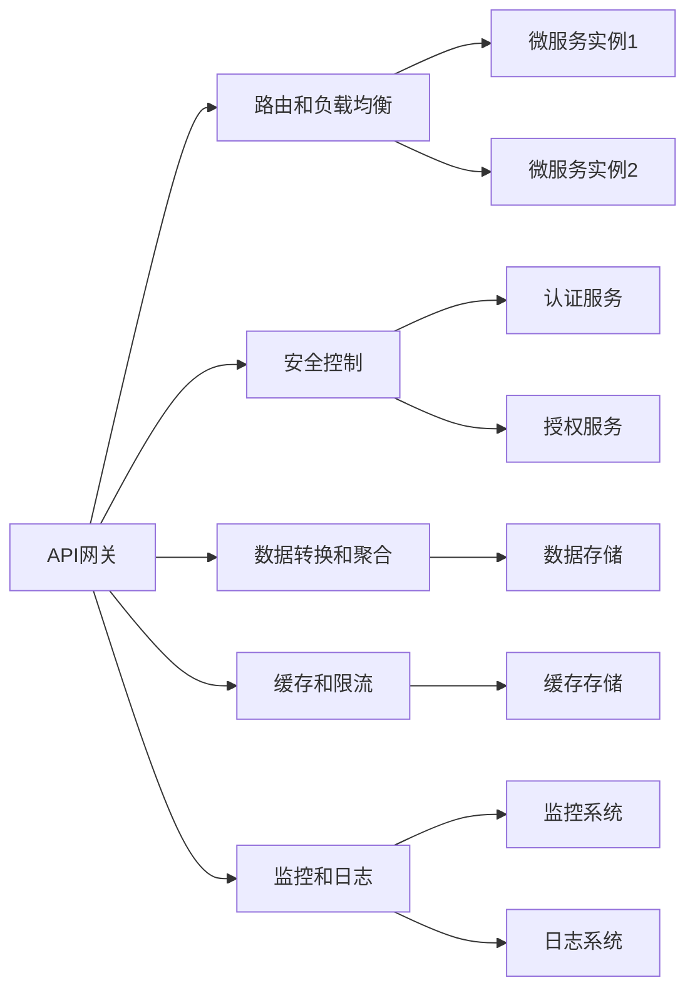

                 

# API网关设计：微服务架构的流量入口

## 1. 背景介绍

在当今的互联网应用中，微服务架构（Microservices Architecture）因其灵活性、可扩展性和高可靠性而成为越来越受欢迎的设计模式。然而，微服务架构的一个显著挑战是如何管理和协调众多独立的服务实例。特别是在高并发和复杂业务场景下，如何在保持服务模块化的同时，确保服务间的有效通信和数据一致性，成为微服务架构设计的核心问题之一。

API网关（API Gateway）作为微服务架构中的关键组件，承担着流量入口的角色，负责将来自客户端的请求转发到相应的微服务实例，同时实现服务间的通信、安全、监控和负载均衡等功能。本文将深入探讨API网关的设计原理、核心概念和具体实现，并提供实践指导，帮助开发者设计出高效、可靠、安全的API网关系统。

## 2. 核心概念与联系

### 2.1 核心概念概述

API网关（API Gateway）是微服务架构中用于管理服务间通信的关键组件，负责将客户端请求转发到相应的微服务实例，并实现多种附加功能。以下是API网关的核心概念及其之间的联系：

- **代理层（Proxy Layer）**：API网关的核心组件，负责将客户端请求路由到相应的微服务实例。

- **路由和负载均衡**：根据请求的URL、参数等信息，将请求路由到正确的服务实例，并实现负载均衡。

- **安全控制**：包括认证、授权、限流等功能，确保API的安全性和可靠性。

- **数据转换和聚合**：将不同服务的响应合并为统一的格式，或将客户端请求转换为符合特定服务要求的形式。

- **缓存和限流**：缓存响应结果，减少后端服务压力，同时设置限流策略，避免服务过载。

- **监控和日志**：记录API请求的日志，进行性能监控和异常分析，确保系统的稳定性和可扩展性。

这些核心概念通过API网关的逻辑架构整合，共同构成了API网关的整体功能。

### 2.2 核心概念原理和架构的 Mermaid 流程图



此流程图展示了API网关的关键组件及其功能模块。API网关将来自客户端的请求经过代理层转发到不同的微服务实例，同时提供路由、安全、缓存、监控等附加功能，保障了微服务架构的高效性和稳定性。

## 3. 核心算法原理 & 具体操作步骤

### 3.1 算法原理概述

API网关的核心算法原理主要涉及路由、负载均衡、缓存、限流等方面。以下是对这些核心算法的简要介绍：

- **路由算法**：根据请求的URL、参数、HTTP方法等信息，将请求路由到正确的微服务实例。常见的路由算法包括基于URL的路由、基于参数的路由等。

- **负载均衡算法**：通过轮询、加权轮询、随机等策略，将请求均衡地分配到不同的微服务实例，避免单点过载，提升系统的可靠性。

- **缓存策略**：将API的响应结果缓存到本地或分布式缓存中，减少后端服务压力，提高响应速度。常见的缓存策略包括基于时间的缓存、基于缓存大小的缓存等。

- **限流算法**：设置API请求的速率限制，避免服务过载。常见的限流算法包括令牌桶算法、漏桶算法等。

### 3.2 算法步骤详解

以下是API网关设计中各个核心算法的详细步骤：

#### 3.2.1 路由算法

1. **解析URL**：接收客户端请求后，解析URL，提取服务名称和资源路径等信息。
2. **匹配规则**：根据URL中的服务名称和资源路径，匹配预定义的路由规则，确定请求的目标服务实例。
3. **负载均衡**：对于同一个服务的多个实例，采用负载均衡策略（如轮询、加权轮询）将请求分配到不同的实例上。

#### 3.2.2 负载均衡算法

1. **轮询算法**：依次将请求分配到不同的服务实例，实现简单的负载均衡。
2. **加权轮询算法**：根据实例的健康状态、负载水平等因素，为不同的实例设置不同的权重，优化负载均衡。
3. **随机算法**：随机选择一个服务实例，避免请求集中在某个实例上。

#### 3.2.3 缓存策略

1. **本地缓存**：将API响应结果缓存到本地内存或文件系统中，避免频繁向后端服务请求。
2. **分布式缓存**：使用Redis、Memcached等分布式缓存系统，实现高可用性、高扩展性的缓存策略。
3. **缓存淘汰策略**：根据缓存的大小、时间等策略，定期清理缓存中的过期数据。

#### 3.2.4 限流算法

1. **令牌桶算法**：维护一个令牌桶，每个请求消耗一个令牌，桶中的令牌数量限制了请求速率。
2. **漏桶算法**：将请求放入漏桶中，以固定速率漏出，实现限流效果。

### 3.3 算法优缺点

API网关的核心算法具有以下优点：

- **高效路由**：通过精确的路由规则和负载均衡策略，确保请求能够快速到达正确的服务实例。
- **集中控制**：API网关集中了安全和监控等功能，简化了微服务架构的管理。
- **灵活扩展**：支持多种缓存和限流策略，适应不同业务场景的需求。

同时，也存在一些缺点：

- **增加延迟**：网关转发请求需要额外的时间，可能增加请求的延迟。
- **单点故障风险**：网关作为服务间的通信中心，一旦故障可能导致整个服务链路中断。
- **资源消耗**：网关需要维护大量的路由规则和负载均衡策略，消耗一定资源。

### 3.4 算法应用领域

API网关设计在微服务架构中具有广泛的应用场景，包括但不限于以下领域：

- **金融服务**：处理高并发、高可用性的金融交易、风控等服务请求，实现高效路由和负载均衡。
- **电商系统**：管理用户注册、支付、订单等业务流程，提供安全、可靠的服务接口。
- **企业内部应用**：构建企业内部服务的统一入口，实现跨部门的业务协同。
- **物联网应用**：管理设备间的通信和数据交互，确保数据的安全和一致性。

## 4. 数学模型和公式 & 详细讲解 & 举例说明

### 4.1 数学模型构建

API网关的核心算法通常基于简单的数学模型和算法策略，以下是一些常见的数学模型：

- **路由算法**：基于哈希函数或二叉搜索树的路由算法。
- **负载均衡算法**：轮询算法、加权轮询算法、随机算法等。
- **缓存策略**：LRU算法、FIFO算法等。
- **限流算法**：令牌桶算法、漏桶算法等。

### 4.2 公式推导过程

#### 4.2.1 路由算法公式

路由算法公式通常基于哈希函数，将URL或参数映射到服务实例。例如，基于URL的路由算法可以表示为：

$$
hashFunction(\text{URL}) \mod N = \text{Service ID}
$$

其中，$hashFunction$ 是哈希函数，$N$ 是服务实例的数量。

#### 4.2.2 负载均衡算法公式

加权轮询算法公式为：

$$
\text{Service Instance} = \text{Random}(0, 1) \times \sum_{i=1}^{N} \frac{1}{w_i} = \text{Random}(0, 1) \times \frac{1}{\sum_{i=1}^{N} \frac{1}{w_i}}
$$

其中，$w_i$ 是第 $i$ 个服务实例的权重。

#### 4.2.3 缓存策略公式

基于时间的缓存策略公式为：

$$
\text{CacheHit} = \text{CacheSize} > 0
$$

其中，$\text{CacheSize}$ 是缓存大小，$\text{CacheHit}$ 表示缓存命中情况。

#### 4.2.4 限流算法公式

令牌桶算法公式为：

$$
\text{Token} = \text{BucketSize} - \text{BucketSize} \times \text{RequestRate}
$$

其中，$\text{BucketSize}$ 是令牌桶容量，$\text{RequestRate}$ 是请求速率。

### 4.3 案例分析与讲解

以下是一个简单的API网关路由和负载均衡的案例：

假设服务A有3个实例，URL为 `http://serviceA.com/{id}`，请求的URL为 `http://serviceA.com/1`。

1. **路由算法**：
   - 解析URL，提取服务名称为 `serviceA`，ID为 `1`。
   - 匹配路由规则，找到 `serviceA` 对应的路由规则。
   - 使用哈希函数，将URL `http://serviceA.com/1` 哈希映射到实例ID `1`。

2. **负载均衡算法**：
   - 将请求转发到服务A的实例ID `1`。

3. **缓存策略**：
   - 在本地缓存中查找请求结果，发现缓存命中，直接返回缓存结果。

4. **限流算法**：
   - 令牌桶中剩余令牌数量为 `10`，每秒新增令牌数量为 `2`。
   - 请求消耗一个令牌，令牌桶中剩余令牌数量为 `9`。
   - 令牌桶中令牌数量大于0，表示请求成功。

通过以上步骤，API网关成功实现了路由和负载均衡等功能。

## 5. 项目实践：代码实例和详细解释说明

### 5.1 开发环境搭建

为了构建API网关，需要安装以下依赖：

```bash
sudo apt-get update
sudo apt-get install openjdk-11-jdk python3-pip
pip install flask
```

### 5.2 源代码详细实现

以下是一个简单的API网关服务实现的示例代码：

```python
from flask import Flask, request
from flask_caching import Cache
from flask_limiter import Limiter
from flask_limiter.util import get_remote_address

app = Flask(__name__)
cache = Cache(app, config={'CACHE_TYPE': 'simple'})
limiter = Limiter(app, key_func=get_remote_address)

@app.route('/<service>/<int:id>')
@limiter.limit("10/minute")
def route(service, id):
    if request.method == 'GET':
        if id in cache:
            return cache.get(id)
        else:
            # 调用后端服务
            result = service_client.call(service, id)
            cache.set(id, result)
            return result
    else:
        return "Method Not Allowed"

if __name__ == '__main__':
    app.run(debug=True)
```

### 5.3 代码解读与分析

- **Flask框架**：使用Flask框架搭建API网关，实现路由和负载均衡。
- **缓存机制**：使用Flask-Caching库实现缓存策略，减少后端服务请求。
- **限流机制**：使用Flask-Limiter库实现限流策略，避免服务过载。

### 5.4 运行结果展示

运行以上代码后，可以在浏览器中访问 `http://localhost:5000/serviceA/1`，请求处理结果将被缓存，后续访问将从缓存中读取结果。

## 6. 实际应用场景

### 6.1 金融服务

在金融领域，API网关可以处理高并发、高可用性的金融交易请求，实现高效路由和负载均衡。例如，支付系统需要处理大量的支付请求，API网关可以将请求分发到不同的支付服务实例，同时设置限流策略，确保系统的稳定性和可靠性。

### 6.2 电商系统

电商系统中的API网关可以管理用户注册、支付、订单等业务流程，提供安全、可靠的服务接口。例如，API网关可以处理大量的用户注册请求，将请求分发到注册服务实例，同时设置限流和缓存策略，确保系统的高效性和稳定性。

### 6.3 企业内部应用

企业内部应用中的API网关可以构建跨部门的业务协同，例如，HR系统与财务系统之间的数据交互，API网关可以将请求分发到相应的服务实例，同时实现数据的统一管理和权限控制。

### 6.4 物联网应用

物联网应用中的API网关可以管理设备间的通信和数据交互，例如，智能家居系统中的设备控制请求，API网关可以将请求分发到相应的设备控制服务实例，同时实现数据的加密和传输控制。

## 7. 工具和资源推荐

### 7.1 学习资源推荐

为了帮助开发者系统掌握API网关的设计和实现，以下是一些推荐的资源：

1. **《API网关设计》系列文章**：深入浅出地介绍了API网关的设计原理和实现方法，适合初学者学习。
2. **《微服务架构设计》课程**：讲解微服务架构的设计原则和实践方法，帮助开发者全面理解微服务架构。
3. **《RESTful API设计》书籍**：介绍了RESTful API的设计规范和最佳实践，帮助开发者设计可扩展、可维护的API网关。

### 7.2 开发工具推荐

以下是一些常用的API网关开发工具：

1. **Flask**：轻量级的Python Web框架，适合快速开发API网关。
2. **Kong**：开源API网关，支持多种负载均衡、缓存、限流策略。
3. **Zuul**：Spring Cloud中的API网关，支持服务路由、负载均衡、安全控制等功能。
4. **Nginx**：高性能的反向代理服务器，适合处理高并发的API请求。

### 7.3 相关论文推荐

以下是一些关于API网关设计的经典论文，推荐阅读：

1. **《A Survey on API Gateway》**：介绍了API网关的设计原理、实现方法和应用场景。
2. **《Microservices, Smart Interfaces, and the Internet of Things: An API Gateway Approach》**：探讨了API网关在微服务架构和物联网应用中的作用和设计方法。
3. **《Designing and Building a Reliable API Gateway for Microservices》**：介绍了API网关的设计原则和实现方法，强调了API网关在微服务架构中的重要性。

## 8. 总结：未来发展趋势与挑战

### 8.1 总结

本文详细介绍了API网关在微服务架构中的核心概念、算法原理和具体操作步骤，并通过代码实例和案例分析，展示了API网关的实际应用场景。API网关作为微服务架构的关键组件，承担着流量入口和核心控制的角色，其设计和实现对于整个系统的稳定性和可靠性至关重要。

通过本文的系统梳理，可以看到，API网关设计涉及路由、负载均衡、缓存、限流等多个关键环节，需要综合考虑系统的高效性、稳定性和可扩展性。未来，API网关的设计和实现将继续向灵活、高效、安全的方向发展。

### 8.2 未来发展趋势

展望未来，API网关设计将呈现以下几个发展趋势：

1. **分布式架构**：随着微服务架构的普及，API网关将逐渐向分布式架构演进，提升系统的可扩展性和容错性。
2. **自动化管理**：API网关将结合DevOps工具和自动化管理工具，实现自动化的路由规则更新和配置管理。
3. **智能化调度**：通过机器学习和大数据分析技术，API网关将实现更智能的负载均衡和路由调度，提升系统的性能和稳定性。
4. **微服务互操作**：API网关将提供更加灵活的微服务互操作机制，支持多种服务框架和协议。

### 8.3 面临的挑战

尽管API网关设计已经取得了显著进展，但在迈向更加智能化、可扩展化应用的过程中，仍面临诸多挑战：

1. **性能瓶颈**：随着服务数量的增加，API网关的性能瓶颈将逐渐显现，需要引入更加高效的算法和架构设计。
2. **安全威胁**：API网关作为系统的入口，需要应对各种安全威胁，包括DDoS攻击、SQL注入等，需要设计更加完善的安全机制。
3. **复杂性管理**：API网关的配置和维护复杂性将逐渐增加，需要引入更加智能化的管理工具和策略。

### 8.4 研究展望

未来的API网关研究需要在以下几个方面寻求新的突破：

1. **分布式缓存**：通过分布式缓存技术，提升API网关的缓存能力和负载均衡性能。
2. **智能调度**：结合机器学习和大数据分析技术，实现更加智能的负载均衡和路由调度。
3. **微服务互操作**：支持多种微服务框架和协议，实现更加灵活的微服务互操作机制。
4. **安全保障**：通过引入新的安全技术，如API网关防火墙、威胁检测等，提升API网关的安全性和可靠性。

这些研究方向将推动API网关设计向更加高效、灵活、安全的方向发展，为微服务架构提供更强大、更可靠的支撑。

## 9. 附录：常见问题与解答

### 附录内容

**Q1：什么是API网关？**

A: API网关是微服务架构中用于管理服务间通信的关键组件，负责将客户端请求转发到相应的微服务实例，并实现多种附加功能，如路由、负载均衡、安全控制等。

**Q2：API网关的核心算法包括哪些？**

A: API网关的核心算法包括路由算法、负载均衡算法、缓存策略和限流算法。

**Q3：API网关的设计和实现需要注意哪些关键点？**

A: API网关的设计和实现需要综合考虑系统的高效性、稳定性和可扩展性，避免单点故障，实现灵活、高效的路由和负载均衡策略。

**Q4：API网关如何处理高并发请求？**

A: API网关可以通过缓存和限流策略，减少后端服务压力，同时设置合理的限流策略，避免服务过载。

**Q5：API网关的安全性如何保障？**

A: API网关可以引入认证、授权、DDoS防护等功能，确保系统的安全性和可靠性。

---

作者：禅与计算机程序设计艺术 / Zen and the Art of Computer Programming

