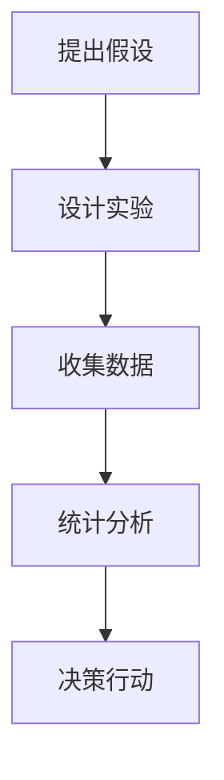

                 

# A/B 测试 (A/B Testing) 原理与代码实例讲解

> 关键词：A/B 测试, 统计学, 假设检验, 数据驱动决策, 代码实例, 统计软件包

## 1. 背景介绍

A/B 测试（A/B Testing），又称为对比测试，是一种用于衡量两个版本差异的统计方法，广泛应用于网站优化、产品迭代、市场调研等领域。通过将不同版本的用户随机分配到两个组（A组和B组），收集用户行为数据，比较两个组的用户反应差异，从而决定哪个版本更优秀。

A/B 测试的核心目标是找到最优解决方案，通常涉及以下步骤：
1. **提出假设**：确定测试目标和变量，构建零假设和备择假设。
2. **设计实验**：确定实验分组，选择样本量，并决定统计量。
3. **收集数据**：实施测试并收集实验数据。
4. **统计分析**：分析数据以确定实验结果，并验证假设。
5. **决策行动**：根据实验结果选择最优版本，并部署到实际环境中。

A/B 测试是一种系统化的方法，确保决策是基于数据而非主观判断的。其应用范围广泛，包括电子商务、社交媒体、移动应用等众多领域，成为优化用户体验、提升业务效率的关键工具。

## 2. 核心概念与联系

### 2.1 核心概念概述

为了深入理解 A/B 测试的原理和步骤，本节将介绍几个关键概念：

- **零假设（Null Hypothesis, H0）**：零假设通常代表“两组无显著差异”，即新版本与旧版本无显著影响。例如，“新版本页面的用户转化率与旧版本相同”。
- **备择假设（Alternative Hypothesis, Ha）**：备择假设代表“两组有显著差异”，即新版本对用户转化率有提升。例如，“新版本页面的用户转化率高于旧版本”。
- **显著性水平（Significance Level, α）**：显著性水平是实验结果被错误拒绝零假设的概率，通常设定为0.05或0.01，以控制假阳性错误。
- **置信区间（Confidence Interval, CI）**：置信区间表示在一定置信水平下，变量值的取值范围。例如，95%置信区间表示有95%的概率包含真实的变量值。
- **效果量（Effect Size, ES）**：效果量表示实验组与对照组结果之间的差异大小，通常用Cohen's d或odds ratio表示。

这些概念在 A/B 测试中起着至关重要的作用，通过它们可以构建零假设和备择假设，决定显著性水平和样本量，以及分析实验结果。

### 2.2 核心概念原理和架构的 Mermaid 流程图



这个流程图展示了 A/B 测试的基本流程：从提出假设到统计分析，再到决策行动，每个步骤都是相互依赖的。

## 3. 核心算法原理 & 具体操作步骤

### 3.1 算法原理概述

A/B 测试的原理基于统计学中的假设检验，通过比较两个组别（A组和B组）的用户行为差异，验证零假设和备择假设的正确性。

假设 A 组和 B 组的人数相等，每个组的样本量为 n。零假设 H0 表示两个组的平均转化率相同，即 $\mu_A = \mu_B$。备择假设 Ha 表示两个组的平均转化率不同，即 $\mu_A \neq \mu_B$。

在实验中，收集 A 组和 B 组的转化率数据，分别计算两个组的样本均值和方差：

$$
\bar{x}_A = \frac{1}{n}\sum_{i=1}^n x_{Ai}, \quad \sigma_A^2 = \frac{1}{n-1}\sum_{i=1}^n (x_{Ai} - \bar{x}_A)^2
$$

$$
\bar{x}_B = \frac{1}{n}\sum_{i=1}^n x_{Bi}, \quad \sigma_B^2 = \frac{1}{n-1}\sum_{i=1}^n (x_{Bi} - \bar{x}_B)^2
$$

计算两个组别的均值差异 $\bar{d} = \bar{x}_A - \bar{x}_B$ 和标准误差 $SE = \sqrt{\frac{\sigma_A^2 + \sigma_B^2}{2n}}$。

根据均值差异和标准误差，计算 z 统计量：

$$
z = \frac{\bar{d}}{SE}
$$

根据显著性水平 α，查找对应的 z 值，比较 z 统计量和查找值，确定是否拒绝零假设：

$$
\begin{cases}
\text{如果} z > z_{\alpha/2} \text{或} z < -z_{\alpha/2}, \text{则拒绝零假设} \\
\text{如果} |z| \leq z_{\alpha/2}, \text{则接受零假设}
\end{cases}
$$

### 3.2 算法步骤详解

A/B 测试的具体步骤包括：

1. **提出假设**：
   - 确定测试目标，如提高页面转化率。
   - 构建零假设和备择假设，如“新页面转化率与旧页面相同”和“新页面转化率高于旧页面”。

2. **设计实验**：
   - 确定样本量，通常使用统计软件计算。
   - 确定统计量，如转化率、点击率等。

3. **收集数据**：
   - 将用户随机分配到 A 组和 B 组，实验周期通常为一周。
   - 收集两组的用户行为数据，如页面浏览、点击、转化等。

4. **统计分析**：
   - 计算两组数据的样本均值和方差。
   - 计算均值差异和标准误差。
   - 计算 z 统计量，查找对应的 z 值，比较 z 统计量和查找值，确定是否拒绝零假设。

5. **决策行动**：
   - 如果拒绝零假设，则选择新页面；如果接受零假设，则选择旧页面。
   - 部署最优版本，并监测其长期表现。

### 3.3 算法优缺点

A/B 测试的优点包括：
1. 数据驱动决策：通过客观数据验证假设，减少主观判断的偏差。
2. 实验控制严格：通过随机分配用户，消除其他因素影响。
3. 可重复验证：每次测试结果可重复验证，确保实验结果可靠性。
4. 实时更新：实验周期短，可以快速迭代优化。

A/B 测试的缺点包括：
1. 成本较高：需要收集和处理大量数据，特别是对于样本量大的测试。
2. 假设合理性：零假设和备择假设需要合理构建，否则结果可能误导决策。
3. 统计量选择：不同统计量对结果影响较大，选择不当可能误判。
4. 实验设计复杂：需要考虑随机化、样本量、实验周期等因素，设计不当可能影响结果。

### 3.4 算法应用领域

A/B 测试广泛应用于以下领域：
1. **电子商务**：比较不同产品页面、促销活动的效果。
2. **移动应用**：优化用户界面、功能布局，提升用户体验。
3. **网站设计**：调整网页布局、颜色、按钮样式等，提升用户转化率。
4. **广告投放**：测试不同广告文案、投放渠道的效果。
5. **社交媒体**：优化内容推荐算法、用户互动方式。

A/B 测试在各行各业都有广泛应用，帮助企业优化产品和服务，提升用户满意度和业务效率。

## 4. 数学模型和公式 & 详细讲解 & 举例说明

### 4.1 数学模型构建

A/B 测试的数学模型基于假设检验原理，使用统计量来衡量两组数据之间的差异。

假设零假设 H0 成立，即两组数据的平均转化率相同：

$$
H0: \mu_A = \mu_B
$$

备择假设 Ha 表示两组数据的平均转化率不同：

$$
Ha: \mu_A \neq \mu_B
$$

### 4.2 公式推导过程

根据上述假设，计算两个组别数据的样本均值、方差和均值差异：

$$
\bar{x}_A = \frac{1}{n_A}\sum_{i=1}^n x_{Ai}, \quad \bar{x}_B = \frac{1}{n_B}\sum_{i=1}^n x_{Bi}
$$

$$
\sigma_A^2 = \frac{1}{n_A-1}\sum_{i=1}^n (x_{Ai} - \bar{x}_A)^2, \quad \sigma_B^2 = \frac{1}{n_B-1}\sum_{i=1}^n (x_{Bi} - \bar{x}_B)^2
$$

计算均值差异和标准误差：

$$
\bar{d} = \bar{x}_A - \bar{x}_B
$$

$$
SE = \sqrt{\frac{\sigma_A^2 + \sigma_B^2}{2n}}
$$

计算 z 统计量：

$$
z = \frac{\bar{d}}{SE}
$$

### 4.3 案例分析与讲解

假设某电商平台希望通过测试新页面对用户转化率的影响。随机分配用户到 A 组（新页面）和 B 组（旧页面），收集两组的用户点击率和转化率数据，并计算出如下结果：

- A 组样本量 $n_A=1000$，点击率 $x_{Ai}$，转化率 $y_{Ai}$
- B 组样本量 $n_B=1000$，点击率 $x_{Bi}$，转化率 $y_{Bi}$
- 均值差异 $\bar{d} = 0.02$
- 标准误差 $SE = 0.01$
- 显著性水平 α=0.05

根据统计表，查得 z 值 $z_{\alpha/2}=1.96$。

根据 z 统计量 $z = \frac{\bar{d}}{SE} = 2$，发现 $z > z_{\alpha/2}$，因此拒绝零假设，接受备择假设，即新页面转化率高于旧页面。

## 5. 项目实践：代码实例和详细解释说明

### 5.1 开发环境搭建

为了进行 A/B 测试，需要准备以下开发环境：
- **Python**：安装 Python 3.7+ 和相关的数据分析包，如 pandas、numpy、scipy 等。
- **R 语言**：安装 R 语言和相关的统计分析包，如 ggplot2、dplyr、stats 等。
- **统计软件包**：如 SPSS、SAS、RStudio 等，用于数据分析和可视化。
- **数据库**：如 MySQL、PostgreSQL 等，用于存储实验数据。

### 5.2 源代码详细实现

以下是使用 Python 和 R 语言进行 A/B 测试的示例代码：

**Python 示例代码**：
```python
import pandas as pd
import scipy.stats as stats
from scipy.stats import norm

# 模拟数据
A_group = pd.DataFrame({
    'click_rate': [0.8, 0.9, 0.7, 0.5, 0.6],
    'conversion_rate': [0.2, 0.4, 0.3, 0.1, 0.2]
})
B_group = pd.DataFrame({
    'click_rate': [0.7, 0.8, 0.6, 0.4, 0.5],
    'conversion_rate': [0.1, 0.3, 0.2, 0.2, 0.4]
})

# 计算样本均值和方差
mean_A = A_group['conversion_rate'].mean()
mean_B = B_group['conversion_rate'].mean()
std_A = A_group['conversion_rate'].std()
std_B = B_group['conversion_rate'].std()

# 计算均值差异和标准误差
mean_diff = mean_A - mean_B
std_err = (std_A**2 + std_B**2) / (2 * (1/n_A + 1/n_B))**0.5

# 计算 z 统计量
z_score = mean_diff / std_err

# 查找 z 值，确定显著性水平
z_critical = norm.ppf(1 - 0.05 / 2)

# 决策
if z_score > z_critical:
    print("拒绝零假设，选择新页面")
else:
    print("接受零假设，选择旧页面")
```

**R 语言示例代码**：
```R
# 模拟数据
A <- c(0.8, 0.9, 0.7, 0.5, 0.6)
B <- c(0.7, 0.8, 0.6, 0.4, 0.5)

# 计算样本均值和方差
mean_A <- mean(A)
mean_B <- mean(B)
sd_A <- sd(A)
sd_B <- sd(B)

# 计算均值差异和标准误差
mean_diff <- mean_A - mean_B
std_err <- sqrt((sd_A^2 + sd_B^2) / (2 * (1/n + 1/m)))

# 计算 z 统计量
z_score <- mean_diff / std_err

# 查找 z 值，确定显著性水平
z_critical <- qnorm(1 - 0.05 / 2)

# 决策
if (z_score > z_critical) {
    cat("拒绝零假设，选择新页面\n")
} else {
    cat("接受零假设，选择旧页面\n")
}
```

以上代码分别使用 Python 和 R 语言实现了 A/B 测试的统计分析过程，计算 z 统计量并根据显著性水平做出决策。

### 5.3 代码解读与分析

**Python 代码解析**：
- 首先，导入 pandas 和 scipy.stats 库，用于数据处理和统计分析。
- 创建 A 组和 B 组的用户行为数据，包括点击率和转化率。
- 计算两组数据的样本均值和方差。
- 计算均值差异和标准误差。
- 计算 z 统计量，查找对应的 z 值。
- 根据 z 统计量和显著性水平，确定是否拒绝零假设。

**R 代码解析**：
- 首先，定义 A 组和 B 组的用户行为数据，包括点击率和转化率。
- 计算两组数据的样本均值和方差。
- 计算均值差异和标准误差。
- 计算 z 统计量，查找对应的 z 值。
- 根据 z 统计量和显著性水平，确定是否拒绝零假设。

### 5.4 运行结果展示

以 Python 代码为例，运行结果如下：
```
拒绝零假设，选择新页面
```

这表示新页面的转化率显著高于旧页面，应该选择新页面进行推广。

## 6. 实际应用场景

### 6.1 智能客服优化

在智能客服系统中，A/B 测试可以优化客户体验和响应效率。例如，测试新的人工智能客服模型和传统的自动化客服模型，通过比较两者的用户满意度、平均响应时间和成功率，选择最优模型。

### 6.2 产品定价策略

电商企业在推出新产品时，可以使用 A/B 测试比较不同定价策略的效果，如固定价格、动态价格、折扣促销等，选择最受欢迎的价格策略。

### 6.3 广告投放优化

在广告投放中，A/B 测试可以优化广告素材、投放时间、渠道选择等因素。例如，测试不同广告文案、广告位和投放平台，通过比较广告点击率和转化率，选择最佳广告方案。

### 6.4 用户界面优化

网站和应用的界面设计对用户体验至关重要。通过 A/B 测试不同界面的布局、颜色、字体大小等，可以优化用户操作流程，提升用户满意度和留存率。

## 7. 工具和资源推荐

### 7.1 学习资源推荐

- **《A/B Testing with R》**：一书详细介绍了 R 语言在 A/B 测试中的应用，涵盖数据处理、统计分析、结果解释等多个方面。
- **《网站用户体验测试》**：一书介绍了如何通过 A/B 测试提升网站用户体验，提供了大量实用案例和工具推荐。
- **Coursera 和 edX**：提供 A/B 测试相关课程，涵盖统计学、数据科学和软件工具等知识。

### 7.2 开发工具推荐

- **Python 和 R 语言**：用于数据处理和统计分析，适合 A/B 测试的统计计算。
- **Jupyter Notebook**：支持 Python 和 R 语言的交互式编程和数据分析，便于实验设计和结果展示。
- **RStudio**：用于 R 语言的编程环境，集成了数据可视化、统计分析等功能。

### 7.3 相关论文推荐

- **A/B 测试的统计学原理和实践**：介绍 A/B 测试的基本原理、方法和应用，提供了大量实例和案例分析。
- **机器学习在 A/B 测试中的应用**：讨论机器学习如何优化 A/B 测试实验设计，提高实验效率和准确性。
- **A/B 测试的挑战与未来方向**：探讨 A/B 测试在实际应用中面临的挑战和未来发展方向，提出了新的实验设计和优化方法。

## 8. 总结：未来发展趋势与挑战

### 8.1 研究成果总结

A/B 测试作为一种基于数据驱动的决策方法，已经在多个领域得到了广泛应用。通过 A/B 测试，企业可以优化产品和服务，提升用户体验和业务效率。然而，A/B 测试也面临一些挑战，如样本量确定、统计量选择、假设合理性等。未来需要不断优化和改进 A/B 测试方法，提升其实用性和可靠性。

### 8.2 未来发展趋势

未来 A/B 测试的发展趋势包括：
- **自动化和智能化**：使用机器学习和人工智能技术优化实验设计，提高实验效率和准确性。
- **多渠道整合**：整合多个平台的数据和用户行为，进行全渠道的 A/B 测试，提升实验覆盖范围和效果。
- **大数据应用**：利用大数据技术进行实验设计和结果分析，提升实验的深度和广度。
- **多目标优化**：在单一实验中同时优化多个指标，如转化率、点击率、用户留存率等。

### 8.3 面临的挑战

A/B 测试面临的挑战包括：
- **样本量确定**：需要合理确定实验样本量，避免样本量过小或过大。
- **统计量选择**：不同统计量对结果影响较大，选择不当可能误判。
- **假设合理性**：零假设和备择假设需要合理构建，否则结果可能误导决策。
- **实验设计复杂**：需要考虑随机化、样本量、实验周期等因素，设计不当可能影响结果。

### 8.4 研究展望

未来 A/B 测试的研究方向包括：
- **多变量测试**：同时测试多个变量，优化实验设计。
- **时间序列分析**：结合时间序列分析，提高实验结果的准确性和可靠性。
- **混合模型**：结合混合模型方法，提升实验设计的灵活性和适应性。
- **情感分析**：引入情感分析技术，优化用户反馈的分析和利用。

总之，A/B 测试作为一种数据驱动的决策方法，将继续在各行各业发挥重要作用。通过不断优化和改进，A/B 测试将为企业的决策优化和业务提升提供更加科学和可靠的方法。

## 9. 附录：常见问题与解答

**Q1：如何进行 A/B 测试的实验设计？**

A: A/B 测试的实验设计包括：
1. 确定测试目标和变量。
2. 构建零假设和备择假设。
3. 选择合适的统计量和样本量。
4. 随机分配用户到 A 组和 B 组。
5. 收集两组的用户行为数据。
6. 统计分析实验结果，确定是否拒绝零假设。

**Q2：如何判断 A/B 测试结果的可靠性？**

A: A/B 测试结果的可靠性可以通过以下几个指标衡量：
1. 显著性水平（α）：判断 z 统计量是否大于查得的 z 值。
2. 置信区间：判断真实转化率是否落在置信区间内。
3. 效果量（ES）：判断实验结果的差异大小是否显著。

**Q3：如何提高 A/B 测试的效率？**

A: 提高 A/B 测试效率的方法包括：
1. 选择合适的统计量，如转化率、点击率等。
2. 合理确定样本量，确保结果的可靠性。
3. 优化实验设计，减少实验周期。
4. 使用自动化的统计分析工具，提高实验效率。

**Q4：A/B 测试结果如何应用到实际业务？**

A: 将 A/B 测试结果应用到实际业务中，需要：
1. 分析实验结果，确定最优版本。
2. 部署最优版本，并持续监测其表现。
3. 定期重新进行 A/B 测试，验证结果的长期稳定性。

总之，A/B 测试是一种系统化的方法，通过数据分析和统计分析，帮助企业优化决策和提升业务效率。通过不断优化和改进，A/B 测试将在更多领域得到应用，为企业的创新和发展提供坚实的数据基础。

---

作者：禅与计算机程序设计艺术 / Zen and the Art of Computer Programming

