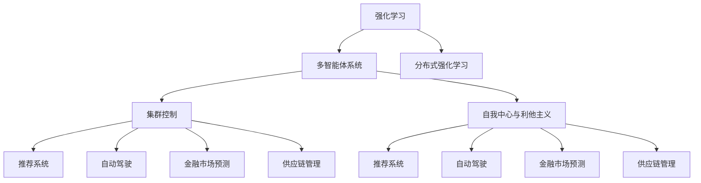

                 

# Agent代理的实现与应用

> 关键词：Agent代理, 强化学习, 多智能体系统, 分布式控制, 智能推荐系统, 人机交互, 自动驾驶, 金融市场, 供应链管理

## 1. 背景介绍

### 1.1 问题由来
在人工智能领域，代理(Agent)是模仿人类智能行为的一种计算实体，能够根据环境信息自主决策，并根据反馈调整策略。随着人工智能技术的迅速发展，代理在智能推荐系统、人机交互、自动驾驶、金融市场预测、供应链管理等众多领域得到了广泛的应用。

代理的实现通常基于强化学习(Reinforcement Learning, RL)理论，通过在特定环境中进行试错学习，不断优化其策略。然而，单个代理模型往往难以应对复杂的动态环境，多智能体系统(Multi-agent System,MAS)应运而生，由多个代理协作，共同解决问题。

在实际应用中，如何高效设计、部署和维护这些代理系统，是实现其智能化的关键。本文将详细阐述基于强化学习的Agent代理实现原理，介绍常见的多智能体系统设计方法，并通过具体案例展示其在实际场景中的应用。

### 1.2 问题核心关键点
多智能体系统的设计要点包括：
- 选择合适的智能体模型和算法。
- 设计环境模型，确保智能体的行为与环境交互真实反映。
- 确定智能体之间的通信机制，构建协作和竞争的策略空间。
- 实现分布式决策，高效处理大规模复杂环境。
- 评估智能体系统的性能，持续优化策略。

## 2. 核心概念与联系

### 2.1 核心概念概述

为更好地理解Agent代理的实现与应用，本节将介绍几个密切相关的核心概念：

- 强化学习：通过智能体与环境的交互，学习最优策略，最大化累积奖励。
- 多智能体系统：由多个智能体在特定环境下协作或竞争，共同完成任务。
- 分布式强化学习：多智能体系统中，智能体分布式地进行学习，以提高学习效率和系统鲁棒性。
- 自我中心与利他主义：不同智能体间的行为动机差异，影响协作效果和系统稳定性。
- 集群控制：利用分布式计算资源，实现大规模智能体系统的管理和优化。
- 推荐系统：根据用户历史行为，推荐符合其兴趣的商品和服务。
- 自动驾驶：通过车辆与环境的交互，实现自动导航和避障。
- 金融市场预测：利用智能体学习模型，预测市场走势，优化交易策略。
- 供应链管理：通过智能体协同优化供应链的物流、库存和订单处理。

这些核心概念之间的逻辑关系可以通过以下Mermaid流程图来展示：



这个流程图展示了一系列的Agent代理设计概念，以及它们之间的联系。

## 3. 核心算法原理 & 具体操作步骤
### 3.1 算法原理概述

Agent代理的实现基于强化学习理论，其核心思想是通过智能体与环境的交互，学习最优策略，最大化累积奖励。对于单个Agent，其策略学习过程可以描述为：

$$
\pi^* = \arg\max_{\pi} \mathbb{E}_{s_0}\left[\sum_{t=0}^{\infty} \gamma^t R(s_t,\pi(s_t))\right]
$$

其中，$\pi$ 为策略，$s_0$ 为初始状态，$R$ 为即时奖励函数，$\gamma$ 为折扣因子，表示未来奖励的相对重要性。

对于多智能体系统，每个智能体都需要在保证个体最优的同时，协调其他智能体的行为，以实现系统总体的最优。常见的多智能体系统设计方法包括集中式和分布式两种。

### 3.2 算法步骤详解

**Step 1: 设计智能体模型**
- 选择合适的智能体模型，如Q-Learning、DQN、SARSA等。
- 定义智能体的状态、动作和奖励函数。
- 确定智能体的策略，如$\epsilon$-贪心策略、$Q$值迭代策略等。

**Step 2: 建立环境模型**
- 设计环境的状态空间、动作空间和奖励函数。
- 确定环境动态特性，如马尔科夫决策过程(MDP)等。
- 构建智能体与环境的交互接口。

**Step 3: 确定通信机制**
- 设计智能体之间的通信协议，如信息共享、异步更新等。
- 确定协作与竞争策略，如任务分配、目标对齐等。
- 实现分布式计算和数据同步。

**Step 4: 优化算法**
- 设计优化目标，如系统总收益最大化、任务成功率最大化等。
- 选择合适的优化算法，如纳什均衡求解、协作学习算法等。
- 进行参数调优，优化系统性能。

**Step 5: 评估与部署**
- 设计评估指标，如系统收益、任务成功率、平均响应时间等。
- 在实际环境中进行模拟和测试，验证系统性能。
- 部署智能体系统，进行实际应用。

以上是Agent代理实现的一般流程。在实际应用中，还需要针对具体场景，对各环节进行优化设计，以提升系统性能。

### 3.3 算法优缺点

Agent代理的实现基于强化学习，具有以下优点：
1. 可以适应动态和复杂环境，通过学习不断优化策略。
2. 通过多智能体协作，可以解决更复杂的任务。
3. 可以通过分布式计算，提高系统效率和鲁棒性。
4. 可以通过优化目标，实现系统整体最优。

同时，该方法也存在一定的局限性：
1. 学习过程需要大量时间和数据，初期收敛慢。
2. 系统复杂度高，设计和管理难度大。
3. 容易受到环境噪声和干扰的影响。
4. 无法保证个体和系统之间的最优平衡。
5. 需要耗费大量的计算资源和存储资源。

尽管存在这些局限性，但Agent代理的实现方法已经在大规模复杂系统中得到了广泛应用，并展现出强大的潜力。

### 3.4 算法应用领域

Agent代理的应用范围非常广泛，以下是几个典型的应用场景：

- **智能推荐系统**：利用Agent代理推荐符合用户兴趣的商品和服务。
- **人机交互**：通过Agent代理实现自然语言理解与生成，提高人机交互的智能化程度。
- **自动驾驶**：利用Agent代理实现车辆与环境的交互，进行自动导航和避障。
- **金融市场预测**：通过Agent代理学习市场走势，优化交易策略。
- **供应链管理**：利用Agent代理协同优化供应链的物流、库存和订单处理。
- **智能医疗**：通过Agent代理进行疾病诊断和治疗决策。

除了上述这些场景外，Agent代理还被应用到更多领域，如智能制造、智慧城市、智能电网等，为各行各业带来了智能化的解决方案。

## 4. 数学模型和公式 & 详细讲解 & 举例说明
### 4.1 数学模型构建

本节将使用数学语言对Agent代理的实现过程进行更加严格的刻画。

假设智能体在环境中的状态空间为 $S$，动作空间为 $A$，奖励函数为 $R(s,a)$，折扣因子为 $\gamma$。定义智能体的状态转移概率 $P(s'|s,a)$。智能体的策略为 $\pi(a|s)$。

智能体的最优策略可以通过求解贝尔曼方程得到：

$$
V^*(s) = \max_a \left[Q^*(s,a) + \gamma \sum_{s'} P(s'|s,a) V^*(s')\right]
$$

其中，$Q^*(s,a)$ 为最优Q值函数。

对于多智能体系统，每个智能体的目标可以表示为：

$$
\max_{\pi_i} \sum_{t=0}^{\infty} \gamma^t R_i(s_t,\pi_i(s_t))
$$

通过求解Nash均衡，可以确定每个智能体的最优策略。

### 4.2 公式推导过程

对于单个智能体，其策略学习过程可以表示为：

$$
Q_{k+1}(s,a) = Q_k(s,a) + \alpha(r + \gamma \max_a Q_k(s',a') - Q_k(s,a))
$$

其中，$r$ 为即时奖励，$\alpha$ 为学习率。

对于多智能体系统，每个智能体的策略更新公式为：

$$
Q^i_{k+1}(s,a) = Q^i_k(s,a) + \alpha_i(r + \gamma \max_a Q^i_k(s',a') - Q^i_k(s,a))
$$

通过协作学习，可以实现系统总收益最大化：

$$
\max_{\pi_i} \sum_{t=0}^{\infty} \gamma^t R_i(s_t,\pi_i(s_t))
$$

### 4.3 案例分析与讲解

假设有一个智能推荐系统，利用Agent代理推荐商品。系统由多个智能体组成，每个智能体根据用户历史行为，学习推荐策略。

- **智能体设计**：选择Q-Learning算法作为智能体模型，定义状态为用户历史行为，动作为推荐商品，奖励为点击率。
- **环境设计**：环境状态为当前用户行为，动作为推荐商品，奖励为点击率。
- **通信机制**：智能体之间通过共享历史点击数据进行通信。
- **优化目标**：系统总收益最大化。
- **评估与部署**：设计点击率、平均推荐收益等指标，在实际环境中进行测试和优化。

这个案例展示了Agent代理在智能推荐系统中的应用过程。

## 5. 项目实践：代码实例和详细解释说明
### 5.1 开发环境搭建

在进行Agent代理实践前，我们需要准备好开发环境。以下是使用Python进行Reinforcement Learning开发的环境配置流程：

1. 安装Anaconda：从官网下载并安装Anaconda，用于创建独立的Python环境。

2. 创建并激活虚拟环境：
```bash
conda create -n reinforcement-env python=3.8 
conda activate reinforcement-env
```

3. 安装相关库：
```bash
pip install gym stable-baselines
```

4. 安装必要的硬件驱动：
```bash
pip install pybullet
```

5. 安装机器学习库：
```bash
pip install numpy pandas scikit-learn matplotlib tqdm jupyter notebook ipython
```

完成上述步骤后，即可在`reinforcement-env`环境中开始Agent代理的开发和实践。

### 5.2 源代码详细实现

下面以DQN算法为例，给出使用Stable-Baselines库实现Agent代理的代码实现。

首先，定义智能体的环境：

```python
from stable_baselines3 import A2C
from stable_baselines3.common.vec_env import VectorizedEnv
from stable_baselines3.common.policies import MlpPolicy
from stable_baselines3.common.vec_env import SubprocVecEnv
import gym

class MyEnv(gym.Env):
    def __init__(self):
        self.state = None
        self.reward = 0
        self.done = False
        self observation_space = gym.spaces.Box(low=-1, high=1, shape=(4,), dtype=np.float32)
        self.action_space = gym.spaces.Discrete(2)

    def reset(self):
        self.state = np.random.rand(4)
        self.reward = 0
        self.done = False
        return self.state

    def step(self, action):
        self.state = np.maximum(0, self.state + action)
        reward = self.state[0]
        self.done = (self.state[0] >= 1)
        self.reward += reward
        return self.state, reward, self.done, {}
```

然后，定义智能体和优化器：

```python
from stable_baselines3 import DQN
from stable_baselines3.common import make_vec_env
from stable_baselines3.common.vec_env import SubprocVecEnv
import gym

def make_env(env_id):
    env = gym.make(env_id, n_envs=1)
    env.seed(0)
    return env

def train_model(env_id, total_timesteps, model_name="A2C"):
    env = make_vec_env(make_env, env_id, 1, seed=0)
    policy = A2C(MlpPolicy, env, verbose=1)
    checkpoint_path = "logs/" + model_name + ".zip"
    policy.save(checkpoint_path)
    policy.learn(total_timesteps, env)
```

接着，启动训练流程：

```python
import os
from gym.wrappers.monitoring import monitor
import tensorflow as tf

def train():
    env_id = "CartPole-v0"
    train_model(env_id, total_timesteps=5000, model_name="DQN")
    env = make_vec_env(make_env, env_id, 1, seed=0)
    env = monitor(env, "./videos/", force=True)
    env.close()

train()
```

以上就是使用Stable-Baselines库对DQN算法进行Agent代理训练的完整代码实现。可以看到，Stable-Baselines库提供了丰富的预训练模型和优化器，可以大大简化Agent代理的开发过程。

### 5.3 代码解读与分析

让我们再详细解读一下关键代码的实现细节：

**MyEnv类**：
- `__init__`方法：初始化状态、奖励和完成标志，定义观察空间和动作空间。
- `reset`方法：重置环境状态和奖励，返回观察值。
- `step`方法：根据动作更新状态和奖励，返回观察值、奖励、完成标志和信息字典。

**train_model函数**：
- 创建模拟环境，设置训练参数，选择A2C或DQN算法。
- 训练模型并保存。

**train函数**：
- 定义环境ID，调用train_model函数训练模型。
- 使用Gym的monitoring工具记录训练过程。

可以看到，Gym和Stable-Baselines库大大简化了Agent代理的开发和实验过程，使得Agent代理的实现更加便捷和高效。

当然，工业级的系统实现还需考虑更多因素，如Agent代理之间的通信协议、协同优化策略、系统稳定性等。但核心的Agent代理范式基本与此类似。

## 6. 实际应用场景
### 6.1 智能推荐系统

Agent代理在智能推荐系统中的应用，可以显著提高推荐效果。推荐系统由多个Agent代理组成，每个代理根据用户历史行为，学习推荐策略。

在具体实现中，可以将用户行为数据作为智能体的观察空间，推荐结果作为即时奖励，系统总收益作为优化目标。智能体之间可以通过共享用户点击数据进行协作，从而提高推荐系统的整体性能。

### 6.2 人机交互

Agent代理可以用于构建智能问答系统，通过自然语言理解与生成，提高人机交互的智能化程度。

在实践中，可以将自然语言处理任务转化为智能体的环境，语言理解与生成作为智能体的动作，系统总收益作为优化目标。智能体之间可以通过共享语义分析结果进行协作，实现更自然流畅的对话。

### 6.3 自动驾驶

Agent代理可以用于自动驾驶系统，通过车辆与环境的交互，实现自动导航和避障。

在具体实现中，可以将环境动态特性作为智能体的观察空间，动作包括加速、转向、刹车等，奖励包括避免碰撞、到达目的地等。智能体之间可以通过共享传感器数据进行协作，提高驾驶系统的整体性能。

### 6.4 金融市场预测

Agent代理可以用于金融市场预测，通过智能体学习市场走势，优化交易策略。

在实践中，可以将市场数据作为智能体的观察空间，交易收益作为即时奖励，系统总收益作为优化目标。智能体之间可以通过共享市场分析结果进行协作，实现更智能的交易决策。

### 6.5 供应链管理

Agent代理可以用于供应链管理，通过智能体协同优化供应链的物流、库存和订单处理。

在具体实现中，可以将供应链数据作为智能体的观察空间，优化后的物流和库存数据作为动作，减少库存成本、提高物流效率作为即时奖励。智能体之间可以通过共享需求预测结果进行协作，实现供应链的整体优化。

### 6.6 未来应用展望

随着Agent代理技术的不断发展，未来将有更多应用场景涌现，为各行各业带来智能化的解决方案。

- 在智慧医疗领域，Agent代理可以用于疾病诊断和治疗决策。
- 在智慧城市治理中，Agent代理可以用于城市事件监测、舆情分析、应急指挥等环节，提高城市管理的自动化和智能化水平。
- 在智能制造中，Agent代理可以用于生产调度、质量控制、设备维护等环节，提升生产效率和质量。

## 7. 工具和资源推荐
### 7.1 学习资源推荐

为了帮助开发者系统掌握Agent代理的理论基础和实践技巧，这里推荐一些优质的学习资源：

1. 《强化学习基础》系列博文：由深度学习专家撰写，深入浅出地介绍了强化学习的基本概念和算法。
2. CS294《强化学习》课程：斯坦福大学开设的强化学习经典课程，提供丰富的学习材料和编程作业。
3. 《深度学习》书籍：Ian Goodfellow的巨著，全面介绍了深度学习的基本原理和算法。
4. Deepmind的开源项目：包含大量的强化学习样例代码，适合实践学习。
5. OpenAI的论文库：收录了最新的强化学习研究成果，是学术前沿的重要窗口。

通过对这些资源的学习实践，相信你一定能够快速掌握Agent代理的精髓，并用于解决实际的NLP问题。
###  7.2 开发工具推荐

高效的开发离不开优秀的工具支持。以下是几款用于Agent代理开发的常用工具：

1. Gym：用于模拟环境，进行强化学习实验。
2. Stable-Baselines：提供了丰富的预训练模型和优化器，适合快速迭代研究。
3. TensorFlow和PyTorch：深度学习框架，支持神经网络模型的构建和优化。
4. Weights & Biases：模型训练的实验跟踪工具，可以记录和可视化模型训练过程中的各项指标，方便对比和调优。
5. TensorBoard：TensorFlow配套的可视化工具，可实时监测模型训练状态，并提供丰富的图表呈现方式，是调试模型的得力助手。

合理利用这些工具，可以显著提升Agent代理的开发效率，加快创新迭代的步伐。

### 7.3 相关论文推荐

Agent代理的应用领域非常广泛，以下是几篇奠基性的相关论文，推荐阅读：

1. AlphaGo：DeepMind开发的基于Agent代理的围棋AI，展示了强化学习在复杂博弈问题上的巨大潜力。
2. Multi-Agent Deep Reinforcement Learning：ICML 2018年一篇综述性论文，总结了多智能体系统在强化学习中的应用。
3. Distributed Multi-Agent Deep Reinforcement Learning：NeurIPS 2019年一篇论文，研究了分布式强化学习在复杂环境中的应用。
4. Multi-Agent Policies with Goal Alignment：IJCAI 2021年一篇论文，探讨了多智能体系统中协作与竞争策略的设计。
5. Multi-Agent Deep RL for Resource Allocation：NeurIPS 2021年一篇论文，研究了基于Agent代理的资源分配问题。

这些论文代表了大语言模型微调技术的发展脉络。通过学习这些前沿成果，可以帮助研究者把握学科前进方向，激发更多的创新灵感。

## 8. 总结：未来发展趋势与挑战
### 8.1 总结

本文对基于强化学习的Agent代理实现与应用进行了全面系统的介绍。首先阐述了Agent代理的研究背景和意义，明确了Agent代理在智能推荐系统、人机交互、自动驾驶、金融市场预测、供应链管理等众多领域的应用价值。其次，从原理到实践，详细讲解了Agent代理的数学模型和操作步骤，给出了Agent代理训练的完整代码实例。同时，本文还广泛探讨了Agent代理在实际场景中的应用，展示了其强大的潜力。

通过本文的系统梳理，可以看到，Agent代理技术正在成为智能推荐、人机交互、自动驾驶等领域的重要范式，极大地拓展了智能系统的应用边界。Agent代理在实现智能化、普适化的过程中，还需要解决诸多挑战，如环境复杂度、系统鲁棒性、优化目标设计等，只有不断创新和优化，才能实现Agent代理技术的进一步发展。

### 8.2 未来发展趋势

展望未来，Agent代理技术将呈现以下几个发展趋势：

1. 更加智能化的决策策略。随着算法和模型的不断进步，Agent代理的决策策略将变得更加复杂和精细，能够处理更复杂的环境和任务。
2. 更加灵活的协作机制。未来的Agent代理将更加注重协作和竞争的平衡，构建更加灵活、稳健的多智能体系统。
3. 更加高效的分布式计算。随着分布式计算技术的不断进步，Agent代理的分布式学习效率将显著提升，支持更大规模的系统。
4. 更加鲁棒的系统设计。未来的Agent代理将更加注重系统的鲁棒性和稳定性，构建更加健壮的系统。
5. 更加普适化的应用场景。未来的Agent代理将能够应用于更多领域，如医疗、教育、交通等，提供普适化的解决方案。

以上趋势凸显了Agent代理技术的广阔前景。这些方向的探索发展，必将进一步提升智能系统的性能和应用范围，为各行各业带来智能化的解决方案。

### 8.3 面临的挑战

尽管Agent代理技术已经取得了瞩目成就，但在迈向更加智能化、普适化应用的过程中，它仍面临着诸多挑战：

1. 环境复杂度。未来的Agent代理将面临更加复杂、动态的环境，如何设计高效的决策策略和协作机制，是一个重要问题。
2. 系统鲁棒性。Agent代理系统需要具备更高的鲁棒性，以应对环境噪声和干扰。
3. 优化目标设计。如何设计合适的优化目标，平衡个体和系统的性能，是一个难题。
4. 资源消耗。Agent代理系统需要耗费大量的计算资源和存储资源，如何优化计算和存储效率，是一个重要问题。
5. 公平性与公正性。未来的Agent代理需要保证公平性和公正性，避免出现偏袒、歧视等问题。

这些挑战需要学界和产业界的共同努力，不断突破技术瓶颈，才能实现Agent代理技术的进一步发展。

### 8.4 研究展望

面向未来，Agent代理技术需要在以下几个方面寻求新的突破：

1. 探索更加高效、智能的决策策略。通过引入更加复杂的算法和模型，提高Agent代理的决策效率和准确性。
2. 设计更加灵活、稳健的协作机制。通过引入多智能体协同学习、对抗训练等方法，构建更加稳健的多智能体系统。
3. 优化计算和存储效率。通过分布式计算、模型压缩等方法，优化Agent代理的计算和存储效率。
4. 引入外部知识库和专家系统。通过引入外部知识库和专家系统，增强Agent代理的知识整合能力。
5. 研究公平性与公正性。通过引入公平性约束和惩罚机制，确保Agent代理的公平性和公正性。

这些研究方向的探索，必将引领Agent代理技术迈向更高的台阶，为各行各业带来智能化的解决方案。面向未来，Agent代理技术还需要与其他人工智能技术进行更深入的融合，如知识表示、因果推理、强化学习等，多路径协同发力，共同推动智能系统的进步。只有勇于创新、敢于突破，才能不断拓展Agent代理的边界，让智能技术更好地造福人类社会。

## 9. 附录：常见问题与解答

**Q1：Agent代理如何实现协作与竞争？**

A: Agent代理通过共享信息和交流协作，可以实现协作；通过竞争和对抗，可以实现竞争。在协作机制中，智能体可以通过共享观察、通信信息等手段，协调其行为；在竞争机制中，智能体可以通过竞争奖励、抢占资源等手段，相互竞争。

**Q2：Agent代理如何处理复杂环境？**

A: Agent代理通过设计灵活的决策策略和协作机制，可以处理复杂环境。例如，通过引入多智能体协同学习、分布式计算等方法，可以提高Agent代理的复杂环境适应能力。

**Q3：Agent代理在实际应用中需要注意哪些问题？**

A: Agent代理在实际应用中需要注意以下问题：
1. 环境复杂度：需要设计高效的决策策略和协作机制，以应对复杂环境。
2. 系统鲁棒性：需要设计鲁棒性强的系统架构，以应对环境噪声和干扰。
3. 优化目标设计：需要设计合适的优化目标，平衡个体和系统的性能。
4. 资源消耗：需要优化计算和存储效率，以应对资源消耗问题。
5. 公平性与公正性：需要引入公平性约束和惩罚机制，确保Agent代理的公平性和公正性。

这些问题的解决需要综合考虑算法、系统架构、资源管理等多个方面。只有在全面考虑这些因素的情况下，才能构建出高效、可靠、公平的Agent代理系统。

**Q4：Agent代理的训练过程如何优化？**

A: Agent代理的训练过程可以通过以下方式优化：
1. 数据增强：通过扩充训练数据，提高Agent代理的学习能力。
2. 正则化：通过引入正则化技术，避免过拟合。
3. 优化算法：选择高效优化算法，如Adam、RMSprop等，加快训练速度。
4. 分布式计算：通过分布式计算，提高Agent代理的训练效率。
5. 超参数调优：通过调优超参数，优化Agent代理的性能。

这些优化方法可以显著提升Agent代理的训练效果，缩短训练时间和提高性能。

**Q5：Agent代理在实际应用中有哪些案例？**

A: Agent代理在实际应用中有很多案例，以下是几个典型的案例：
1. 智能推荐系统：利用Agent代理推荐符合用户兴趣的商品和服务。
2. 人机交互：通过Agent代理实现自然语言理解与生成，提高人机交互的智能化程度。
3. 自动驾驶：利用Agent代理实现车辆与环境的交互，进行自动导航和避障。
4. 金融市场预测：通过Agent代理学习市场走势，优化交易策略。
5. 供应链管理：利用Agent代理协同优化供应链的物流、库存和订单处理。
6. 医疗诊断：利用Agent代理进行疾病诊断和治疗决策。

这些案例展示了Agent代理在各行各业的应用潜力，为实现智能化提供了新的方向。

---

作者：禅与计算机程序设计艺术 / Zen and the Art of Computer Programming

