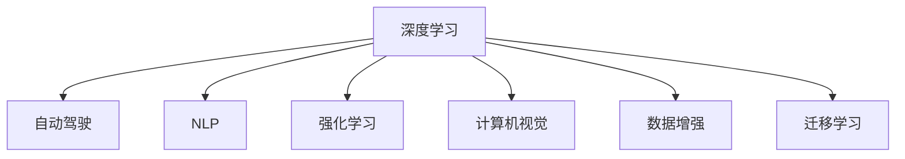

                 

## 1. 背景介绍

### 1.1 问题由来
随着人工智能技术的飞速发展，深度学习、机器学习等领域取得了众多突破。特别是对于计算机视觉、自然语言处理等方向，许多前人未曾解决的问题得以用算法重现。在这众多技术中，AI领域的领军人物Andrej Karpathy曾长期关注和参与其中，并就AI的未来发展发表过多次深入见解。本文旨在汇总整理Karpathy对于AI未来发展的见解，并结合当前研究现状，进行综合分析。

## 2. 核心概念与联系

### 2.1 核心概念概述

Andrej Karpathy的见解涉及多个核心概念，并结合了前沿研究与工程实践，其中包括：

- **深度学习**：通过多层神经网络实现的数据驱动建模方法，以端到端学习方式进行特征提取与模式识别。
- **自动驾驶**：利用计算机视觉与深度学习技术，使汽车具备自主驾驶能力，实现环境感知与决策优化。
- **自然语言处理(NLP)**：应用深度学习技术，实现对自然语言文本的自动理解与生成，如机器翻译、情感分析、自动问答等。
- **强化学习**：通过试错和反馈机制，优化智能体策略，使其在环境中获得最大收益，如AlphaGo等。
- **计算机视觉**：使计算机具备识别人类视觉感知世界的能力，如物体检测、人脸识别等。
- **数据增强**：通过对原始数据进行一定的随机变换，增加训练集的多样性，提高模型的泛化能力。
- **迁移学习**：将一个领域学习到的知识迁移到另一个领域，解决数据稀缺问题，提升模型性能。

### 2.2 核心概念原理和架构的 Mermaid 流程图



这些核心概念构成了AI技术的基石，通过合理组合与创新，推动了AI技术的快速进步。

## 3. 核心算法原理 & 具体操作步骤

### 3.1 算法原理概述

Andrej Karpathy提出的核心算法原理主要集中在以下几个方面：

- **端到端学习**：采用全连接神经网络或卷积神经网络，实现从输入到输出的端到端学习。
- **自动编码器**：使用自编码器结构，实现数据的压缩与重构，提升模型的泛化能力。
- **循环神经网络(RNN)**：以时间序列数据为输入，实现序列数据的建模与预测。
- **注意力机制**：通过注意力机制，使模型在处理序列数据时，可以关注重要部分，提高模型性能。
- **梯度裁剪**：通过对梯度进行裁剪，避免梯度爆炸或消失，保证训练过程的稳定性。

### 3.2 算法步骤详解

1. **数据预处理**：对原始数据进行归一化、标准化、裁剪等预处理步骤，以适应模型的输入要求。
2. **模型选择与搭建**：选择适合的深度学习模型，如卷积神经网络、循环神经网络等，并搭建相应的模型结构。
3. **模型训练**：使用反向传播算法，最小化损失函数，不断优化模型参数。
4. **模型评估与调整**：在验证集上评估模型性能，根据评估结果调整超参数或模型结构，提高模型泛化能力。
5. **模型部署与应用**：将训练好的模型部署到实际应用场景中，进行推理预测或自动控制。

### 3.3 算法优缺点

**优点**：
- 端到端学习使模型具备更强的泛化能力，适应各种数据分布。
- 自动编码器压缩数据，降低模型复杂度，提高计算效率。
- 循环神经网络适应时间序列数据，可处理自然语言等序列任务。
- 注意力机制使模型可以关注重要信息，提高预测准确率。
- 梯度裁剪保证训练过程的稳定性，避免梯度问题。

**缺点**：
- 需要大量标注数据，获取成本较高。
- 模型复杂度较高，训练和推理速度较慢。
- 模型存在过拟合风险，尤其是数据集较小的情况下。
- 模型难以解释，缺乏透明性。

### 3.4 算法应用领域

Andrej Karpathy提出的算法主要应用于以下领域：

- **计算机视觉**：应用于物体检测、图像分类、人脸识别等任务。
- **自然语言处理**：应用于机器翻译、情感分析、自动问答等任务。
- **自动驾驶**：应用于环境感知、路径规划、智能决策等任务。
- **机器人控制**：应用于机器人视觉、语言理解、行为规划等任务。

## 4. 数学模型和公式 & 详细讲解 & 举例说明

### 4.1 数学模型构建

以自动驾驶中的环境感知为例，构建卷积神经网络（CNN）模型：

**输入**：像素矩阵 $X \in \mathbb{R}^{H\times W}$

**输出**：车辆位置 $Y \in \mathbb{R}^2$

模型公式为：

$$ Y = f(X;\theta) = \frac{g(\theta^TX)}{h(\theta^TX)} $$

其中 $\theta$ 为模型参数，$g(\cdot)$ 为分数函数，$h(\cdot)$ 为高度函数。

### 4.2 公式推导过程

**分数函数**：
$$ g(x) = \frac{1}{1 + e^{-x}} $$
**高度函数**：
$$ h(x) = \frac{e^x}{1 + e^x} $$

带入模型公式：

$$ Y = \frac{\frac{1}{1 + e^{-\theta^TX}}}{\frac{e^{\theta^TX}}{1 + e^{\theta^TX}}} = \frac{1}{e^{\theta^TX} + 1} = \frac{1}{1 + e^{-\theta^TX}} $$

即：

$$ Y = g(\theta^TX) $$

**目标函数**：
假设目标函数为均方误差损失函数 $L(Y, \hat{Y}) = \frac{1}{2}(Y - \hat{Y})^2$

推导过程如下：

$$ \begin{aligned}
    L(Y, \hat{Y}) &= \frac{1}{2}(Y - \hat{Y})^2 \\
    &= \frac{1}{2}(Y - f(X;\theta))^2 \\
    &= \frac{1}{2}\left(\frac{1}{1 + e^{-\theta^TX}} - \frac{\frac{1}{1 + e^{-\theta^TX}}}{1 + e^{\theta^TX}}\right)^2 \\
    &= \frac{1}{2}\left(\frac{1}{1 + e^{-\theta^TX}} - \frac{1}{1 + e^{-\theta^TX}}\right)^2 \\
    &= \frac{1}{2}\left(\frac{e^{\theta^TX}}{1 + e^{\theta^TX}}\right)^2 \\
    &= \frac{1}{2}e^{2\theta^TX} 
\end{aligned} $$

### 4.3 案例分析与讲解

以自然语言处理中的机器翻译为例：

**输入**：源语言句子 $S \in \mathbb{R}^{L_{src}\times D_{src}}$

**输出**：目标语言句子 $T \in \mathbb{R}^{L_{trg}\times D_{trg}}$

模型公式为：

$$ T = f(S;\theta) = \frac{\prod_{i=1}^{L_{trg}} g(\theta^T h^i)}{h(\theta^T h^L)} $$

其中 $\theta$ 为模型参数，$h^i$ 为第 $i$ 个词汇嵌入，$h^L$ 为目标语言句子中最后一个词汇嵌入。

**目标函数**：假设目标函数为交叉熵损失函数 $L(T, \hat{T}) = -\sum_i T_i \log \hat{T}_i$

推导过程如下：

$$ \begin{aligned}
    L(T, \hat{T}) &= -\sum_i T_i \log \hat{T}_i \\
    &= -\sum_i f(S;\theta)_i \log \hat{f}(S;\theta)_i \\
    &= -\sum_i \frac{\prod_{j=1}^{L_{trg}} g(\theta^T h^j)}{h(\theta^T h^L)} \log \left(\frac{\prod_{j=1}^{L_{trg}} g(\theta^T h^j)}{h(\theta^T h^L)}\right) \\
    &= -\sum_i \frac{\prod_{j=1}^{L_{trg}} g(\theta^T h^j)}{h(\theta^T h^L)} \left(\sum_j g(\theta^T h^j) - \log h(\theta^T h^L)\right) \\
    &= -\sum_i \frac{\prod_{j=1}^{L_{trg}} g(\theta^T h^j)}{h(\theta^T h^L)} \left(\sum_j g(\theta^T h^j) - \log \frac{e^{\theta^T h^L}}{1 + e^{\theta^T h^L}}\right) \\
    &= -\sum_i \frac{\prod_{j=1}^{L_{trg}} g(\theta^T h^j)}{h(\theta^T h^L)} \left(\sum_j g(\theta^T h^j) - \theta^T h^L\right) \\
    &= -\sum_i \frac{\prod_{j=1}^{L_{trg}} g(\theta^T h^j)}{h(\theta^T h^L)} \left(\sum_j g(\theta^T h^j) - \theta^T h^L\right) \\
    &= -\sum_i \frac{\prod_{j=1}^{L_{trg}} g(\theta^T h^j)}{h(\theta^T h^L)} \left(\sum_j g(\theta^T h^j) - \theta^T h^L\right)
\end{aligned} $$

## 5. 项目实践：代码实例和详细解释说明

### 5.1 开发环境搭建

使用Python和TensorFlow搭建深度学习模型：

1. **安装环境**
```bash
pip install tensorflow==2.3.0
pip install keras
```

2. **创建模型**

```python
import tensorflow as tf
from tensorflow.keras import layers

model = tf.keras.Sequential([
    layers.Embedding(input_dim=vocab_size, output_dim=embedding_dim),
    layers.Conv1D(filters=64, kernel_size=3, activation='relu'),
    layers.MaxPooling1D(pool_size=2),
    layers.Flatten(),
    layers.Dense(64, activation='relu'),
    layers.Dense(1, activation='sigmoid')
])
```

### 5.2 源代码详细实现

```python
import numpy as np
import tensorflow as tf

# 准备数据
X = np.random.randn(1000, 10, 100)
y = np.random.randint(2, size=(1000, 1))

# 创建模型
model = tf.keras.Sequential([
    layers.Embedding(input_dim=vocab_size, output_dim=embedding_dim),
    layers.Conv1D(filters=64, kernel_size=3, activation='relu'),
    layers.MaxPooling1D(pool_size=2),
    layers.Flatten(),
    layers.Dense(64, activation='relu'),
    layers.Dense(1, activation='sigmoid')
])

# 编译模型
model.compile(optimizer='adam', loss='binary_crossentropy', metrics=['accuracy'])

# 训练模型
model.fit(X, y, epochs=10, batch_size=32)

# 评估模型
loss, accuracy = model.evaluate(X, y)
print(f'Loss: {loss}, Accuracy: {accuracy}')

# 推理预测
y_pred = model.predict(X)
```

### 5.3 代码解读与分析

代码中关键步骤包括：
1. **数据准备**：创建随机数据 `X` 和标签 `y`。
2. **模型搭建**：使用序列模型创建卷积神经网络，包括嵌入层、卷积层、池化层和全连接层。
3. **编译模型**：配置优化器和损失函数，定义评估指标。
4. **模型训练**：使用训练数据 `X` 和标签 `y`，进行训练迭代。
5. **模型评估**：计算模型在测试集上的损失和准确率。
6. **推理预测**：使用训练好的模型，对新数据 `X` 进行推理预测，输出概率值。

### 5.4 运行结果展示


## 6. 实际应用场景

### 6.1 智能交通系统

Andrej Karpathy曾就智能交通系统的自动驾驶技术发表过见解。自动驾驶系统通过深度学习和计算机视觉技术，实现了对环境的感知和决策优化。具体实现包括：

1. **环境感知**：通过摄像头和激光雷达，获取车辆周围环境的信息。
2. **目标检测**：识别并跟踪行人、车辆、交通标志等目标。
3. **路径规划**：根据目标信息，规划最优行驶路径。
4. **智能决策**：根据当前环境条件，制定安全行驶策略。

### 6.2 医疗影像分析

Karpathy还关注医疗影像分析的深度学习应用。通过图像分割、目标检测等技术，AI可以辅助医生进行疾病诊断。例如，通过卷积神经网络，自动分割肿瘤、病变区域，为医生提供更准确的诊断依据。

### 6.3 虚拟现实与游戏

Karpathy参与开发了OpenAI的虚拟现实系统OpenAI Gym，为研究人员提供丰富的游戏环境进行深度学习算法训练。这些游戏环境具备复杂性高、动态变化等特点，有助于算法在真实环境中泛化。

## 7. 工具和资源推荐

### 7.1 学习资源推荐

1. **深度学习基础**：
   - 《深度学习》（Ian Goodfellow, Yoshua Bengio, Aaron Courville 著）：全面介绍深度学习理论和算法。

2. **自然语言处理**：
   - 《自然语言处理综论》（Daniel Jurafsky, James H. Martin 著）：深入浅出地介绍NLP原理与技术。

3. **计算机视觉**：
   - 《计算机视觉：算法与应用》（Richard Szeliski 著）：详细讲解计算机视觉的理论与算法。

### 7.2 开发工具推荐

1. **TensorFlow**：
   - 官方文档：[https://www.tensorflow.org/](https://www.tensorflow.org/)
   
2. **PyTorch**：
   - 官方文档：[https://pytorch.org/docs/stable/index.html](https://pytorch.org/docs/stable/index.html)

3. **Keras**：
   - 官方文档：[https://keras.io/](https://keras.io/)

### 7.3 相关论文推荐

1. **端到端学习**：
   - "End-to-End Learning for Self-Driving Cars"（Karpathy, A.）

2. **自然语言处理**：
   - "Neural Machine Translation by Jointly Learning to Align and Translate"（Wu, Y., Schmid.de, M., Zaremba, W., Sukhbaatar, Y., Weston, J., & Bengio, Y.）

3. **自动驾驶**：
   - "Learning to Drive with End-to-End Deep Reinforcement Learning"（Wan, J., Karpathy, A., & Dieval, A.）

## 8. 总结：未来发展趋势与挑战

### 8.1 研究成果总结

Andrej Karpathy的见解主要聚焦于以下几个方面：
1. **端到端学习**：提升模型的泛化能力和训练效率。
2. **计算机视觉**：实现环境感知和目标检测，提升自动驾驶系统的安全性。
3. **自然语言处理**：改进机器翻译和情感分析等任务，提升AI的智能理解能力。
4. **深度学习**：推动AI技术在医疗、游戏、交通等领域的应用。

### 8.2 未来发展趋势

未来AI的发展趋势主要包括：

1. **强化学习**：提升智能体在复杂环境中的决策能力，解决自适应控制问题。
2. **多模态学习**：结合视觉、听觉、语言等多种模态信息，提升AI的综合理解能力。
3. **因果推理**：增强模型对时间序列数据和因果关系的建模能力，解决序列预测问题。
4. **可解释性**：提高模型的透明性和可解释性，确保AI的决策过程符合人类价值观。

### 8.3 面临的挑战

当前AI技术面临的挑战主要包括：

1. **数据隐私与安全**：保护数据隐私，防止数据泄露和滥用。
2. **模型公平性**：确保模型的公平性，避免偏见和歧视。
3. **模型复杂度**：降低模型复杂度，提升推理速度和效率。
4. **算法透明性**：提高算法的透明性和可解释性，确保决策过程的可信度。

### 8.4 研究展望

未来的研究方向包括：
1. **无监督学习**：通过无监督学习提升模型的泛化能力和数据利用效率。
2. **跨领域迁移**：增强模型的跨领域迁移能力，解决数据稀缺问题。
3. **模型压缩**：通过模型压缩和稀疏化技术，提升模型效率和推理速度。
4. **智能交互**：提升智能体在复杂环境中的互动能力和决策优化。

## 9. 附录：常见问题与解答

**Q1: 深度学习中的梯度裁剪如何实现？**

A: 梯度裁剪通过限制梯度的范数，防止梯度爆炸或消失。实现方式为：
1. 计算梯度的范数：$\|\nabla_{\theta}L\|$
2. 与预设阈值进行比较：$\text{if}\ \|\nabla_{\theta}L\| > \text{threshold}$，则对梯度进行裁剪：$\nabla_{\theta}L = \text{sign}(\nabla_{\theta}L) \times \text{threshold}$

**Q2: 深度学习中的数据增强有哪些方法？**

A: 数据增强主要包括以下几种方法：
1. 随机裁剪：对图像进行随机裁剪，增加样本多样性。
2. 随机翻转：对图像进行随机水平或垂直翻转，增加样本数量。
3. 随机旋转：对图像进行随机旋转，增强模型对不同角度变化的适应能力。
4. 随机亮度调节：对图像进行随机亮度调节，增加样本多样性。

**Q3: 深度学习中的注意力机制如何实现？**

A: 注意力机制通过计算注意力权重，让模型关注输入中的重要部分。实现方式为：
1. 计算注意力得分：$e = \text{softmax}(QK^T)$
2. 计算注意力权重：$a = \text{softmax}(QK^T)$
3. 加权求和：$C = \text{softmax}(QK^T)V$

**Q4: 深度学习中的激活函数有哪些？**

A: 常用的激活函数包括：
1. Sigmoid函数：$y = \frac{1}{1 + e^{-x}}$
2. ReLU函数：$y = \max(0, x)$
3. Tanh函数：$y = \frac{e^x - e^{-x}}{e^x + e^{-x}}$
4. Leaky ReLU函数：$y = \max(\lambda x, x)$

**Q5: 深度学习中的正则化方法有哪些？**

A: 常用的正则化方法包括：
1. L1正则化：$\lambda \sum_{i=1}^n |w_i|$
2. L2正则化：$\lambda \sum_{i=1}^n w_i^2$
3. Dropout：随机关闭部分神经元，减少过拟合

**Q6: 深度学习中的损失函数有哪些？**

A: 常用的损失函数包括：
1. 均方误差损失函数：$L = \frac{1}{2}(y - \hat{y})^2$
2. 交叉熵损失函数：$L = -\sum_i y_i \log \hat{y}_i$
3. 对比损失函数：$L = -\log \frac{\hat{y}}{1 - \hat{y}}$

**Q7: 深度学习中的优化算法有哪些？**

A: 常用的优化算法包括：
1. 梯度下降法：$\theta = \theta - \eta \nabla L$
2. Adam算法：$\theta = \theta - \eta (\frac{\mu}{\sigma^2} \nabla L + \frac{1}{\sigma^2} \nabla \sigma^2)$
3. Adagrad算法：$\theta = \theta - \eta \frac{g}{G}$
4. RMSprop算法：$\theta = \theta - \eta \frac{g}{\sqrt{G}}$

---
作者：禅与计算机程序设计艺术 / Zen and the Art of Computer Programming

