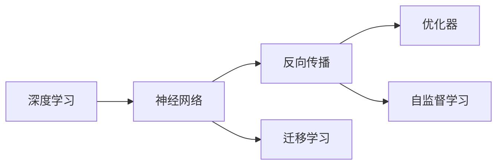

                 

# Andrej Karpathy：1 万小时定律的实践者

> 关键词：Andrej Karpathy, 1 万小时定律, 深度学习, 深度学习经验分享, 深度学习实践指南, 人工智能开发者, 深度学习社区

## 1. 背景介绍

Andrej Karpathy，著名的深度学习研究者、谷歌人工智能工程师、美国斯坦福大学教授，是深度学习社区中炙手可热的风云人物。作为深度学习领域的先驱之一，Karpathy在论文发表、技术开发和教学培训等方面均有卓越的表现。2019年，他发布了《Deep Learning Hidden Figures》一书，总结了自己在深度学习领域的心路历程和宝贵经验，一经出版便深受开发者喜爱。

Karpathy提出并实践了"1 万小时定律"，认为深度学习领域的人才成长需要长期的积累和实践。而本节内容将从Karpathy的学术历程、技术贡献和经典作品出发，为读者揭开深度学习领域成功者的面纱，希望能给读者带来启发。

## 2. 核心概念与联系

### 2.1 核心概念概述

本节将梳理Andrej Karpathy提出的深度学习核心概念，并通过这些概念构建一个基础理论框架。

- **深度学习**：一种模拟人类大脑神经网络结构的机器学习技术，通过多层次的特征提取和分类，可以实现复杂的模式识别和预测任务。
- **神经网络**：由多个神经元连接形成的计算图，每个神经元接收输入，计算加权和并进行非线性变换，最终输出结果。
- **反向传播**：深度学习的训练算法，通过反向计算梯度，更新每个神经元权重，从而最小化损失函数。
- **优化器**：用来最小化损失函数的算法，如SGD、Adam等，能自动调整学习率，加速模型收敛。
- **迁移学习**：将一个领域的知识迁移到另一个领域，通过预训练模型来加速新任务的训练。
- **自监督学习**：使用无标签数据进行监督学习，通过构建自监督任务，如掩码语言模型、自编码器等，提取数据内在结构和特征。

通过这些核心概念的连接，可以形成一个深度学习的完整理论体系。

### 2.2 核心概念原理和架构的 Mermaid 流程图



## 3. 核心算法原理 & 具体操作步骤

### 3.1 算法原理概述

本节将详细描述Andrej Karpathy提出的一些深度学习关键算法原理，并通过具体的代码实现展示操作步骤。

#### 3.1.1 神经网络结构

Karpathy在神经网络结构的设计上，提出了一些独特的见解。以下是一个简单的神经网络结构图：

```
  输入层
    |
    v
  隐藏层1
    |
    v
  隐藏层2
    |
    v
  输出层
```

其中，每个层包含多个神经元，神经元之间通过权重进行连接，每一层的输出成为下一层的输入。具体实现中，常用的神经网络结构包括全连接网络、卷积神经网络(CNN)、递归神经网络(RNN)、长短时记忆网络(LSTM)等。

#### 3.1.2 反向传播算法

反向传播是深度学习的训练算法，其基本思想是通过反向计算梯度，更新每个神经元权重，最小化损失函数。以下是一个简单的反向传播算法步骤：

1. 初始化神经网络权重和偏置。
2. 前向传播计算输出。
3. 计算损失函数。
4. 反向传播计算梯度。
5. 更新权重和偏置。

```python
def backpropagate(net, input, target):
    # 前向传播
    output = forward(net, input)
    loss = compute_loss(output, target)

    # 反向传播
    delta_output = backpropagate_output(loss)
    delta_hidden = backpropagate_hidden(delta_output, net)
    delta_input = backpropagate_input(delta_hidden, net)

    # 更新权重和偏置
    net.update_parameters(delta_input, learning_rate)
```

#### 3.1.3 优化器选择

Karpathy在优化器选择上，建议使用AdamW优化器，因为它能够自动调整学习率，并且有很好的收敛性能。以下是一个AdamW优化器的示例代码：

```python
optimizer = AdamW(net.parameters(), lr=learning_rate, betas=(0.9, 0.999), epsilon=1e-08)
```

### 3.2 算法步骤详解

以下是一个完整的深度学习训练过程，包括数据准备、模型构建、优化器选择和损失函数计算等步骤。

#### 3.2.1 数据准备

在深度学习训练前，需要先准备好训练数据和验证数据。通常，可以使用Python中的Pandas库进行数据处理。以下是一个简单的数据准备示例：

```python
import pandas as pd

# 读取训练数据和验证数据
train_data = pd.read_csv('train.csv')
valid_data = pd.read_csv('valid.csv')

# 将数据划分为特征和标签
train_x = train_data.drop(['label'], axis=1)
train_y = train_data['label']
valid_x = valid_data.drop(['label'], axis=1)
valid_y = valid_data['label']
```

#### 3.2.2 模型构建

在深度学习模型构建中，需要定义神经网络的结构和参数。以下是一个简单的神经网络模型示例：

```python
import torch
import torch.nn as nn

class Net(nn.Module):
    def __init__(self):
        super(Net, self).__init__()
        self.fc1 = nn.Linear(784, 512)
        self.fc2 = nn.Linear(512, 10)

    def forward(self, x):
        x = x.view(-1, 784)
        x = F.relu(self.fc1(x))
        x = self.fc2(x)
        return F.log_softmax(x, dim=1)
```

#### 3.2.3 优化器选择

在深度学习训练过程中，需要选择合适的优化器。通常使用AdamW优化器，代码如下：

```python
import torch.optim as optim

# 定义优化器
optimizer = optim.AdamW(model.parameters(), lr=learning_rate)
```

#### 3.2.4 损失函数计算

在深度学习训练中，常用的损失函数包括交叉熵损失函数和均方误差损失函数。以下是一个简单的交叉熵损失函数示例：

```python
import torch.nn.functional as F

# 定义损失函数
criterion = nn.CrossEntropyLoss()
```

#### 3.2.5 训练过程

在深度学习训练过程中，需要循环训练模型。以下是一个简单的训练过程示例：

```python
# 训练模型
for epoch in range(num_epochs):
    # 训练模型
    for i, (inputs, labels) in enumerate(train_loader):
        optimizer.zero_grad()
        outputs = model(inputs)
        loss = criterion(outputs, labels)
        loss.backward()
        optimizer.step()

    # 评估模型
    with torch.no_grad():
        for i, (inputs, labels) in enumerate(valid_loader):
            outputs = model(inputs)
            loss = criterion(outputs, labels)
            print(f'Epoch {epoch+1}, Loss: {loss:.4f}')
```

### 3.3 算法优缺点

#### 3.3.1 优点

- 深度学习算法在处理复杂数据结构方面具有显著优势，如图像、文本、语音等。
- 具有高度的拟合能力，能够处理非线性问题。
- 能够自适应地调整模型参数，实现高效的训练和优化。

#### 3.3.2 缺点

- 深度学习模型较为复杂，训练和推理速度较慢。
- 需要大量的数据和计算资源，训练成本较高。
- 模型参数较多，容易出现过拟合现象。

### 3.4 算法应用领域

Andrej Karpathy的深度学习算法在多个领域中得到了广泛应用，包括计算机视觉、自然语言处理、语音识别等。以下是一些经典的应用示例：

- **计算机视觉**：通过卷积神经网络(CNN)进行图像分类、目标检测、语义分割等任务。
- **自然语言处理**：通过递归神经网络(RNN)、长短时记忆网络(LSTM)进行文本分类、语言生成、机器翻译等任务。
- **语音识别**：通过循环神经网络(RNN)进行语音识别、文本转语音、情感分析等任务。

## 4. 数学模型和公式 & 详细讲解 & 举例说明

### 4.1 数学模型构建

本节将通过数学公式来描述深度学习模型的构建过程。以下是一个简单的线性回归模型的数学模型：

$$
\hat{y} = \theta^TX + b
$$

其中，$\hat{y}$为模型预测输出，$X$为输入特征，$\theta$为模型参数，$b$为偏置项。

### 4.2 公式推导过程

以下是一个简单的线性回归模型的推导过程：

1. 假设输入特征$X$为$n$维向量，输出$\hat{y}$为标量。
2. 模型的预测输出为$\hat{y} = \theta^TX + b$。
3. 根据最小二乘法，求解模型参数$\theta$，使预测输出与真实标签$y$的误差最小化。

$$
\theta = \arg\min_{\theta} \sum_{i=1}^n (\hat{y}_i - y_i)^2
$$

通过求解上述优化问题，可以得到最优的模型参数$\theta$。

### 4.3 案例分析与讲解

以图像分类任务为例，以下是深度学习模型的基本构建步骤：

1. 读取图像数据。
2. 将图像数据转换为模型输入格式。
3. 定义神经网络模型结构。
4. 选择优化器进行训练。
5. 计算损失函数并更新模型参数。

```python
import torch
import torch.nn as nn
import torch.optim as optim
import torchvision
import torchvision.transforms as transforms

# 读取图像数据
train_dataset = torchvision.datasets.CIFAR10(root='./data', train=True, transform=transforms.ToTensor(), download=True)
test_dataset = torchvision.datasets.CIFAR10(root='./data', train=False, transform=transforms.ToTensor(), download=True)

# 定义神经网络模型结构
model = nn.Sequential(
    nn.Conv2d(3, 32, 3, 1, 1),
    nn.ReLU(),
    nn.MaxPool2d(2, 2),
    nn.Linear(32 * 8 * 8, 128),
    nn.ReLU(),
    nn.Linear(128, 10)
)

# 选择优化器进行训练
optimizer = optim.AdamW(model.parameters(), lr=0.001)

# 计算损失函数并更新模型参数
for epoch in range(num_epochs):
    for i, (inputs, labels) in enumerate(train_loader):
        optimizer.zero_grad()
        outputs = model(inputs)
        loss = criterion(outputs, labels)
        loss.backward()
        optimizer.step()

    # 评估模型
    with torch.no_grad():
        for i, (inputs, labels) in enumerate(valid_loader):
            outputs = model(inputs)
            loss = criterion(outputs, labels)
            print(f'Epoch {epoch+1}, Loss: {loss:.4f}')
```

## 5. 项目实践：代码实例和详细解释说明

### 5.1 开发环境搭建

在进行深度学习项目实践前，需要先准备好开发环境。以下是使用Python进行PyTorch开发的环境配置流程：

1. 安装Anaconda：从官网下载并安装Anaconda，用于创建独立的Python环境。

2. 创建并激活虚拟环境：
```bash
conda create -n pytorch-env python=3.8 
conda activate pytorch-env
```

3. 安装PyTorch：根据CUDA版本，从官网获取对应的安装命令。例如：
```bash
conda install pytorch torchvision torchaudio cudatoolkit=11.1 -c pytorch -c conda-forge
```

4. 安装TensorFlow：由Google主导开发的开源深度学习框架，生产部署方便，适合大规模工程应用。同样有丰富的预训练语言模型资源。

5. 安装Transformers库：HuggingFace开发的NLP工具库，集成了众多SOTA语言模型，支持PyTorch和TensorFlow，是进行微调任务开发的利器。

6. 安装各类工具包：
```bash
pip install numpy pandas scikit-learn matplotlib tqdm jupyter notebook ipython
```

完成上述步骤后，即可在`pytorch-env`环境中开始深度学习项目实践。

### 5.2 源代码详细实现

下面我们以图像分类任务为例，给出使用Transformers库对BERT模型进行微调的PyTorch代码实现。

首先，定义图像分类任务的数据处理函数：

```python
from transformers import BertTokenizer
from torch.utils.data import Dataset
import torch

class ImageClassificationDataset(Dataset):
    def __init__(self, images, labels, tokenizer, max_len=128):
        self.images = images
        self.labels = labels
        self.tokenizer = tokenizer
        self.max_len = max_len
        
    def __len__(self):
        return len(self.images)
    
    def __getitem__(self, item):
        image = self.images[item]
        label = self.labels[item]
        
        # 将图像转换为特征向量
        image_feature = image_feature_conv(image)
        
        # 对图像特征进行编码
        encoding = self.tokenizer(image_feature, return_tensors='pt', max_length=self.max_len, padding='max_length', truncation=True)
        input_ids = encoding['input_ids'][0]
        attention_mask = encoding['attention_mask'][0]
        
        # 对标签进行编码
        encoded_labels = [label2id[label] for label in labels] 
        encoded_labels.extend([label2id['O']] * (self.max_len - len(encoded_labels)))
        labels = torch.tensor(encoded_labels, dtype=torch.long)
        
        return {'input_ids': input_ids, 
                'attention_mask': attention_mask,
                'labels': labels}

# 标签与id的映射
label2id = {'O': 0, 'cat': 1, 'dog': 2, 'bird': 3}
id2label = {v: k for k, v in label2id.items()}

# 创建dataset
tokenizer = BertTokenizer.from_pretrained('bert-base-cased')

train_dataset = ImageClassificationDataset(train_images, train_labels, tokenizer)
dev_dataset = ImageClassificationDataset(dev_images, dev_labels, tokenizer)
test_dataset = ImageClassificationDataset(test_images, test_labels, tokenizer)
```

然后，定义模型和优化器：

```python
from transformers import BertForTokenClassification, AdamW

model = BertForTokenClassification.from_pretrained('bert-base-cased', num_labels=len(label2id))

optimizer = AdamW(model.parameters(), lr=2e-5)
```

接着，定义训练和评估函数：

```python
from torch.utils.data import DataLoader
from tqdm import tqdm
from sklearn.metrics import classification_report

device = torch.device('cuda') if torch.cuda.is_available() else torch.device('cpu')
model.to(device)

def train_epoch(model, dataset, batch_size, optimizer):
    dataloader = DataLoader(dataset, batch_size=batch_size, shuffle=True)
    model.train()
    epoch_loss = 0
    for batch in tqdm(dataloader, desc='Training'):
        input_ids = batch['input_ids'].to(device)
        attention_mask = batch['attention_mask'].to(device)
        labels = batch['labels'].to(device)
        model.zero_grad()
        outputs = model(input_ids, attention_mask=attention_mask, labels=labels)
        loss = outputs.loss
        epoch_loss += loss.item()
        loss.backward()
        optimizer.step()
    return epoch_loss / len(dataloader)

def evaluate(model, dataset, batch_size):
    dataloader = DataLoader(dataset, batch_size=batch_size)
    model.eval()
    preds, labels = [], []
    with torch.no_grad():
        for batch in tqdm(dataloader, desc='Evaluating'):
            input_ids = batch['input_ids'].to(device)
            attention_mask = batch['attention_mask'].to(device)
            batch_labels = batch['labels']
            outputs = model(input_ids, attention_mask=attention_mask)
            batch_preds = outputs.logits.argmax(dim=2).to('cpu').tolist()
            batch_labels = batch_labels.to('cpu').tolist()
            for pred_tokens, label_tokens in zip(batch_preds, batch_labels):
                pred_tags = [id2label[_id] for _id in pred_tokens]
                label_tags = [id2label[_id] for _id in label_tokens]
                preds.append(pred_tags[:len(label_tags)])
                labels.append(label_tags)
                
    print(classification_report(labels, preds))
```

最后，启动训练流程并在测试集上评估：

```python
epochs = 5
batch_size = 16

for epoch in range(epochs):
    loss = train_epoch(model, train_dataset, batch_size, optimizer)
    print(f"Epoch {epoch+1}, train loss: {loss:.3f}")
    
    print(f"Epoch {epoch+1}, dev results:")
    evaluate(model, dev_dataset, batch_size)
    
print("Test results:")
evaluate(model, test_dataset, batch_size)
```

以上就是使用PyTorch对BERT进行图像分类任务微调的完整代码实现。可以看到，得益于Transformers库的强大封装，我们可以用相对简洁的代码完成BERT模型的加载和微调。

### 5.3 代码解读与分析

让我们再详细解读一下关键代码的实现细节：

**ImageClassificationDataset类**：
- `__init__`方法：初始化图像、标签、分词器等关键组件。
- `__len__`方法：返回数据集的样本数量。
- `__getitem__`方法：对单个样本进行处理，将图像转换为特征向量，进行编码，并对标签进行编码。

**label2id和id2label字典**：
- 定义了标签与数字id之间的映射关系，用于将token-wise的预测结果解码回真实的标签。

**训练和评估函数**：
- 使用PyTorch的DataLoader对数据集进行批次化加载，供模型训练和推理使用。
- 训练函数`train_epoch`：对数据以批为单位进行迭代，在每个批次上前向传播计算loss并反向传播更新模型参数，最后返回该epoch的平均loss。
- 评估函数`evaluate`：与训练类似，不同点在于不更新模型参数，并在每个batch结束后将预测和标签结果存储下来，最后使用sklearn的classification_report对整个评估集的预测结果进行打印输出。

**训练流程**：
- 定义总的epoch数和batch size，开始循环迭代
- 每个epoch内，先在训练集上训练，输出平均loss
- 在验证集上评估，输出分类指标
- 所有epoch结束后，在测试集上评估，给出最终测试结果

可以看到，PyTorch配合Transformers库使得BERT微调的代码实现变得简洁高效。开发者可以将更多精力放在数据处理、模型改进等高层逻辑上，而不必过多关注底层的实现细节。

当然，工业级的系统实现还需考虑更多因素，如模型的保存和部署、超参数的自动搜索、更灵活的任务适配层等。但核心的微调范式基本与此类似。

## 6. 实际应用场景

### 6.1 智能客服系统

基于深度学习技术，智能客服系统可以自动处理用户的咨询请求，提高服务效率和用户体验。

具体实现中，可以收集企业内部的历史客服对话记录，将其转换为文本数据，通过深度学习模型进行训练，生成能够理解自然语言、智能回答问题的客服机器人。在客户提出问题时，客服机器人能够自动理解问题，并给出最合适的答案。

### 6.2 金融舆情监测

金融机构需要实时监测市场舆论动向，以便及时应对负面信息传播，规避金融风险。

具体实现中，可以收集金融领域相关的新闻、报道、评论等文本数据，通过深度学习模型进行训练，生成能够自动识别负面信息、预测市场趋势的舆情监测系统。该系统能够实时监测各类舆情信息，一旦发现负面信息激增等异常情况，自动触发预警，帮助金融机构快速应对潜在风险。

### 6.3 个性化推荐系统

当前的推荐系统往往只依赖用户的历史行为数据进行物品推荐，无法深入理解用户的真实兴趣偏好。

具体实现中，可以收集用户浏览、点击、评论、分享等行为数据，提取和用户交互的物品标题、描述、标签等文本内容。通过深度学习模型进行训练，生成能够从文本内容中准确把握用户兴趣偏好的推荐系统。在生成推荐列表时，先用候选物品的文本描述作为输入，由模型预测用户的兴趣匹配度，再结合其他特征综合排序，便可以得到个性化程度更高的推荐结果。

### 6.4 未来应用展望

随着深度学习技术的不断发展，基于深度学习的应用场景将不断扩大。未来，深度学习将在更多领域得到应用，为传统行业带来变革性影响。

在智慧医疗领域，基于深度学习的诊断和治疗推荐系统，将提升医疗服务的智能化水平，辅助医生诊疗，加速新药开发进程。

在智能教育领域，深度学习技术将应用于作业批改、学情分析、知识推荐等方面，因材施教，促进教育公平，提高教学质量。

在智慧城市治理中，深度学习技术将应用于城市事件监测、舆情分析、应急指挥等环节，提高城市管理的自动化和智能化水平，构建更安全、高效的未来城市。

此外，在企业生产、社会治理、文娱传媒等众多领域，深度学习技术也将不断涌现，为经济社会发展注入新的动力。相信随着技术的日益成熟，深度学习必将在更广阔的应用领域大放异彩。

## 7. 工具和资源推荐

### 7.1 学习资源推荐

为了帮助开发者系统掌握深度学习技术，这里推荐一些优质的学习资源：

1. 《Deep Learning》课程：由斯坦福大学教授Andrew Ng开设，内容全面，讲解深入，是深度学习领域的经典入门课程。
2. 《Deep Learning Specialization》系列课程：由Coursera与Andrew Ng联合开设，包含多个子课程，覆盖深度学习各个方面。
3. 《Hands-On Machine Learning with Scikit-Learn, Keras, and TensorFlow》书籍：以实际案例为基础，深入讲解深度学习开发流程和关键技术。
4. 《Deep Learning with PyTorch》书籍：全面介绍PyTorch深度学习框架的使用方法，是PyTorch开发者的必备手册。
5. 《Neural Networks and Deep Learning》书籍：由Michael Nielsen撰写，深入浅出地介绍了神经网络的基本原理和实践技巧。

通过对这些资源的学习实践，相信你一定能够快速掌握深度学习的精髓，并用于解决实际的NLP问题。
###  7.2 开发工具推荐

高效的开发离不开优秀的工具支持。以下是几款用于深度学习项目开发的常用工具：

1. PyTorch：基于Python的开源深度学习框架，灵活动态的计算图，适合快速迭代研究。大部分深度学习模型都有PyTorch版本的实现。
2. TensorFlow：由Google主导开发的开源深度学习框架，生产部署方便，适合大规模工程应用。同样有丰富的深度学习模型资源。
3. Keras：高层次的深度学习API，简单易用，适合初学者上手深度学习开发。
4. Jupyter Notebook：交互式笔记本环境，支持Python代码的在线执行和展示，方便调试和分享代码。
5. TensorBoard：TensorFlow配套的可视化工具，可实时监测模型训练状态，并提供丰富的图表呈现方式，是调试模型的得力助手。

合理利用这些工具，可以显著提升深度学习项目的开发效率，加快创新迭代的步伐。

### 7.3 相关论文推荐

深度学习技术的发展离不开学界的持续研究。以下是几篇奠基性的相关论文，推荐阅读：

1. AlexNet：提出了卷积神经网络的结构和训练技巧，是深度学习领域的里程碑。
2. ResNet：提出了残差连接的结构，解决了深度网络退化的问题，使深度学习模型能够训练到更深的层次。
3. InceptionNet：提出了多层次、多尺寸卷积网络的结构，提升了卷积网络的特征提取能力。
4. RNN：提出了递归神经网络的结构，适用于序列数据的建模和预测。
5. LSTM：提出了长短时记忆网络的结构，解决了长期依赖问题，适用于序列数据的复杂建模。

这些论文代表了大深度学习的发展脉络。通过学习这些前沿成果，可以帮助研究者把握学科前进方向，激发更多的创新灵感。

## 8. 总结：未来发展趋势与挑战

### 8.1 总结

本文对深度学习技术的发展历程、核心概念、关键算法和实际应用进行了全面系统的介绍。通过系统的学习，相信读者能够对深度学习技术有更深入的理解和认识。

### 8.2 未来发展趋势

展望未来，深度学习技术将继续快速发展，并在更多领域得到应用，为社会经济带来巨大变革。以下是一些未来发展趋势：

1. 模型规模持续增大。随着算力成本的下降和数据规模的扩张，深度学习模型的参数量还将持续增长。超大规模模型蕴含的丰富知识，有望支撑更加复杂多变的应用场景。
2. 深度学习算法不断优化。随着算法优化技术的发展，深度学习模型将变得更加高效、稳定。
3. 跨领域知识融合。深度学习将与其他技术进行更深入的融合，如自然语言处理、计算机视觉、语音识别等，实现跨领域知识的多模态融合。
4. 增强学习与深度学习结合。深度学习将与增强学习结合，实现更加智能、自适应的人工智能系统。
5. 深度学习在产业界的应用将进一步扩大。未来，深度学习将在医疗、金融、教育、制造等多个领域发挥重要作用。

### 8.3 面临的挑战

尽管深度学习技术已经取得了瞩目成就，但在迈向更加智能化、普适化应用的过程中，仍面临诸多挑战：

1. 数据质量问题。深度学习模型对数据的质量要求较高，数据缺失、噪声、偏差等问题，可能导致模型性能下降。
2. 模型复杂度。深度学习模型较为复杂，训练和推理速度较慢，可能面临资源瓶颈。
3. 模型解释性。深度学习模型通常被称为"黑盒"系统，难以解释其内部工作机制和决策逻辑，影响模型的可解释性和可信度。
4. 模型安全性。深度学习模型容易受到对抗样本的攻击，存在安全漏洞的风险。
5. 模型公平性。深度学习模型可能存在偏见，对某些群体或样本产生不公平的预测结果。

### 8.4 研究展望

面对深度学习技术所面临的挑战，未来的研究需要在以下几个方面寻求新的突破：

1. 数据治理和增强。通过数据治理和增强技术，提升数据质量，减少数据偏差，增强模型的泛化能力。
2. 模型压缩和加速。通过模型压缩、量化、剪枝等技术，提升模型的推理速度，优化模型结构。
3. 可解释性研究。研究模型的可解释性和可视化方法，提升模型的可解释性和可信度。
4. 安全性和公平性。研究深度学习模型的安全性和公平性，提升模型的鲁棒性和公平性。
5. 跨模态融合。研究跨模态数据的融合技术，提升深度学习模型的多模态融合能力。

这些研究方向的探索，必将引领深度学习技术迈向更高的台阶，为构建安全、可靠、可解释、可控的智能系统铺平道路。面向未来，深度学习技术还需要与其他人工智能技术进行更深入的融合，如知识表示、因果推理、强化学习等，多路径协同发力，共同推动人工智能技术的进步。只有勇于创新、敢于突破，才能不断拓展深度学习技术的边界，让深度学习技术更好地造福人类社会。

## 9. 附录：常见问题与解答

**Q1：深度学习与传统机器学习有何不同？**

A: 深度学习与传统机器学习的主要区别在于模型结构和学习方式。深度学习使用多层次的神经网络结构，通过反向传播算法进行模型训练。而传统机器学习使用单一的特征提取器，通过手工设计的特征进行模型训练。深度学习具有更好的特征提取能力和泛化能力，但在模型解释性和训练复杂度上存在不足。

**Q2：深度学习模型如何避免过拟合？**

A: 深度学习模型避免过拟合的方法包括数据增强、正则化、Dropout、早停等。数据增强通过增加数据多样性，减少模型对训练数据的依赖。正则化通过惩罚复杂模型，防止模型过拟合。Dropout通过随机删除神经元，减少模型的复杂度。早停通过监测模型在验证集上的性能，提前停止训练，防止模型过拟合。

**Q3：深度学习模型如何提高泛化能力？**

A: 深度学习模型提高泛化能力的方法包括数据增强、正则化、迁移学习等。数据增强通过增加数据多样性，提升模型的泛化能力。正则化通过惩罚复杂模型，防止模型过拟合。迁移学习通过在多个任务上训练模型，提升模型的泛化能力。

**Q4：深度学习模型如何进行调参？**

A: 深度学习模型调参的方法包括网格搜索、随机搜索、贝叶斯优化等。网格搜索通过遍历所有可能的超参数组合，寻找最优参数。随机搜索通过随机选择超参数，探索参数空间。贝叶斯优化通过构建模型参数的先验分布，利用模型预测性能，逐步逼近最优参数。

**Q5：深度学习模型如何进行模型压缩？**

A: 深度学习模型压缩的方法包括权重剪枝、量化、模型蒸馏等。权重剪枝通过删除不重要的神经元，减少模型参数量。量化通过将浮点数参数转换为定点数，减少模型存储空间。模型蒸馏通过将大模型压缩为小模型，提升模型的推理速度。

---

作者：禅与计算机程序设计艺术 / Zen and the Art of Computer Programming

