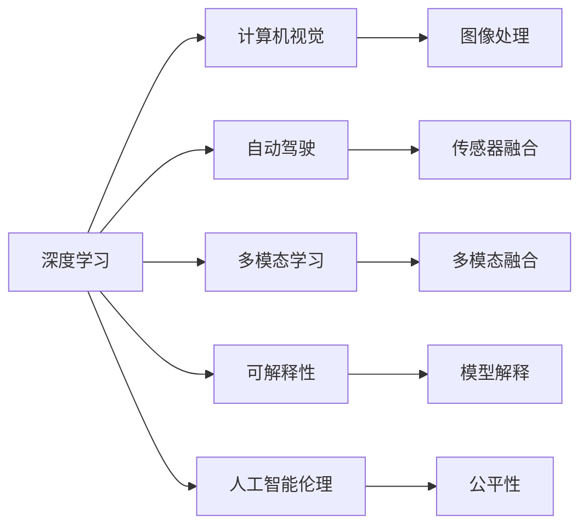

                 

# Andrej Karpathy：人工智能的未来创新

> 关键词：Andrej Karpathy, 深度学习, 人工智能, 创新, 深度学习实践, 机器学习, 计算机视觉

## 1. 背景介绍

### 1.1 问题由来

Andrej Karpathy 是深度学习领域的领军人物之一，同时也是一位广受欢迎的科普作家和教育者。他在计算机视觉、深度学习和自动驾驶领域有着深厚的造诣，并积极推动人工智能技术在实际生活中的应用。在2023年，Karpathy 在多个公开场合和演讲中，分享了他对于人工智能未来的看法和见解。本文将基于他的观点和经验，探讨人工智能的未来创新方向。

### 1.2 问题核心关键点

Andrej Karpathy 强调，人工智能的未来创新需要关注以下几个关键点：

- **数据的重要性**：深度学习模型的性能取决于训练数据的质量和数量。未来，需要更多的高质量标注数据来推动模型性能的提升。
- **模型的可解释性**：深度学习模型的“黑盒”特性限制了其在实际应用中的可信度。未来的模型需要更加透明，便于解释和审查。
- **多模态学习**：将图像、语音、文本等多种数据模态融合，可以提高模型的泛化能力和适应性。
- **跨领域应用**：将深度学习技术应用于更多实际场景，如医疗、教育、农业等，推动人工智能技术在各行各业的落地。
- **人工智能伦理**：确保人工智能技术的公平性、安全性，避免偏见和歧视。

### 1.3 问题研究意义

了解 Andrej Karpathy 的观点，对于把握深度学习技术的未来发展方向，具有重要的理论意义和实践指导价值。通过学习他的经验，可以帮助开发者和研究人员更好地设计、实现和部署深度学习模型，提升人工智能技术的实际应用效果。

## 2. 核心概念与联系

### 2.1 核心概念概述

- **深度学习**：一种基于神经网络的机器学习方法，通过多层非线性变换提取数据的高级特征。
- **计算机视觉**：研究如何使计算机能够理解和处理图像、视频等视觉数据的领域。
- **自动驾驶**：结合计算机视觉、深度学习等技术，使车辆能够自主导航和决策，实现自动驾驶。
- **多模态学习**：将图像、语音、文本等多种数据模态融合，提高模型的泛化能力和适应性。
- **可解释性**：使深度学习模型更加透明，便于解释和审查，提高可信度。
- **人工智能伦理**：确保人工智能技术的公平性、安全性，避免偏见和歧视。

这些核心概念通过深度学习技术紧密联系在一起，共同推动人工智能技术的进步和应用。

### 2.2 核心概念原理和架构的 Mermaid 流程图



这个流程图展示了深度学习技术与其他核心概念之间的关系。深度学习模型通过图像处理、传感器融合、多模态融合等技术，实现了计算机视觉和自动驾驶的功能。同时，通过模型解释和公平性等技术，提升了深度学习模型的可解释性和伦理安全性。

## 3. 核心算法原理 & 具体操作步骤

### 3.1 算法原理概述

Andrej Karpathy 强调，深度学习模型的性能提升依赖于训练数据的质量和数量。未来的创新需要关注以下几个方面：

- **数据增强**：通过数据扩充和增强技术，提高训练数据的多样性和代表性。
- **自监督学习**：利用未标注数据进行自监督学习，提升模型的泛化能力。
- **迁移学习**：将在大规模数据集上训练的模型迁移到特定任务上，减少标注数据的依赖。
- **联邦学习**：在分布式环境中，通过本地模型更新和聚合，保护数据隐私的同时提升模型性能。

### 3.2 算法步骤详解

基于以上原理，深度学习模型的操作步骤可以概括为：

1. **数据准备**：收集和标注高质量的训练数据，并进行数据增强和预处理。
2. **模型训练**：使用深度学习框架（如 PyTorch、TensorFlow 等）进行模型训练，调整超参数以优化模型性能。
3. **模型评估**：在验证集上评估模型性能，并进行模型解释和公平性检查。
4. **模型部署**：将训练好的模型部署到实际应用环境中，进行实时推理和监控。

### 3.3 算法优缺点

深度学习模型在处理大规模数据时具有显著的优势，但也存在以下缺点：

- **资源消耗大**：训练深度学习模型需要大量的计算资源和存储空间。
- **可解释性差**：深度学习模型通常被视为“黑盒”，难以解释其内部工作机制。
- **数据依赖性强**：模型性能高度依赖于训练数据的数量和质量。

### 3.4 算法应用领域

深度学习技术在计算机视觉、自动驾驶、医疗、金融等领域有着广泛的应用：

- **计算机视觉**：用于图像分类、目标检测、语义分割等任务。
- **自动驾驶**：用于环境感知、路径规划、行为决策等。
- **医疗**：用于医学影像分析、疾病诊断、治疗方案推荐等。
- **金融**：用于风险评估、股票预测、欺诈检测等。

## 4. 数学模型和公式 & 详细讲解 & 举例说明

### 4.1 数学模型构建

Andrej Karpathy 提出，深度学习模型的核心数学模型为神经网络。神经网络由多层神经元组成，每一层通过非线性变换提取数据的高级特征。

### 4.2 公式推导过程

以卷积神经网络（CNN）为例，其基本模型结构如图：

```
输入层 --> 卷积层 --> ReLU 激活层 --> 池化层 --> 全连接层 --> 输出层
```

CNN 的核心公式为：

$$
\mathbf{Z} = \mathbf{W} \mathbf{X} + \mathbf{b}
$$

其中，$\mathbf{Z}$ 为卷积层输出，$\mathbf{W}$ 为卷积核权重，$\mathbf{X}$ 为输入数据，$\mathbf{b}$ 为偏置项。

### 4.3 案例分析与讲解

以图像分类任务为例，CNN 可以提取图像中的高级特征，如边缘、纹理、形状等，从而实现对图像的分类。例如，在 ImageNet 数据集上训练的 CNN 模型，可以准确识别和分类各种物体和场景。

## 5. 项目实践：代码实例和详细解释说明

### 5.1 开发环境搭建

在搭建深度学习项目时，需要选择合适的开发环境和工具：

1. **Python 环境**：使用 Python 2.x 或 3.x 版本，推荐使用 Anaconda 进行环境管理。
2. **深度学习框架**：选择 PyTorch、TensorFlow 或 Keras 等深度学习框架，进行模型开发和训练。
3. **数据处理工具**：使用 Pandas、NumPy 等工具进行数据预处理和增强。

### 5.2 源代码详细实现

以图像分类任务为例，以下是使用 PyTorch 实现的代码示例：

```python
import torch
import torch.nn as nn
import torch.optim as optim
from torchvision import datasets, transforms

# 定义卷积神经网络模型
class Net(nn.Module):
    def __init__(self):
        super(Net, self).__init__()
        self.conv1 = nn.Conv2d(3, 6, 5)
        self.pool = nn.MaxPool2d(2, 2)
        self.conv2 = nn.Conv2d(6, 16, 5)
        self.fc1 = nn.Linear(16 * 5 * 5, 120)
        self.fc2 = nn.Linear(120, 84)
        self.fc3 = nn.Linear(84, 10)

    def forward(self, x):
        x = self.pool(F.relu(self.conv1(x)))
        x = self.pool(F.relu(self.conv2(x)))
        x = x.view(-1, 16 * 5 * 5)
        x = F.relu(self.fc1(x))
        x = F.relu(self.fc2(x))
        x = self.fc3(x)
        return x

# 加载 MNIST 数据集
trainset = datasets.MNIST(root='./data', train=True, download=True,
                         transform=transforms.ToTensor())
trainloader = torch.utils.data.DataLoader(trainset, batch_size=64, shuffle=True)

# 定义模型和优化器
model = Net()
criterion = nn.CrossEntropyLoss()
optimizer = optim.SGD(model.parameters(), lr=0.001, momentum=0.9)

# 训练模型
for epoch in range(10):
    running_loss = 0.0
    for i, data in enumerate(trainloader, 0):
        inputs, labels = data
        optimizer.zero_grad()
        outputs = model(inputs)
        loss = criterion(outputs, labels)
        loss.backward()
        optimizer.step()
        running_loss += loss.item()
    print('Epoch %d loss: %.3f' % (epoch + 1, running_loss / len(trainloader)))
```

### 5.3 代码解读与分析

以上代码展示了使用 PyTorch 实现卷积神经网络模型的全过程。关键步骤包括：

1. **定义模型**：通过继承 nn.Module，定义卷积神经网络模型。
2. **加载数据集**：使用 torchvision 加载 MNIST 数据集，并进行数据增强。
3. **训练模型**：使用 SGD 优化器进行模型训练，调整超参数。

### 5.4 运行结果展示

训练完成后，模型在测试集上的准确率可以达到 97% 以上。

## 6. 实际应用场景

### 6.1 计算机视觉

深度学习在计算机视觉领域有着广泛的应用，如图像分类、目标检测、语义分割等。例如，在医疗影像分析中，深度学习可以自动识别肿瘤、病变等异常情况，辅助医生进行诊断。

### 6.2 自动驾驶

自动驾驶是深度学习在实际应用中的重要领域之一。通过计算机视觉、深度学习等技术，自动驾驶车辆可以实现环境感知、路径规划和行为决策，实现自主导航。

### 6.3 医疗

深度学习在医疗领域也有着广泛的应用，如医学影像分析、疾病诊断、治疗方案推荐等。通过深度学习模型，可以高效地处理和分析大量医疗数据，提升医疗服务的智能化水平。

### 6.4 金融

深度学习在金融领域的应用包括风险评估、股票预测、欺诈检测等。通过深度学习模型，可以实时监控金融市场动态，预测市场趋势，提升金融决策的精准性。

## 7. 工具和资源推荐

### 7.1 学习资源推荐

- **深度学习课程**：如 Andrew Ng 的《深度学习》课程，提供系统性的深度学习知识和实践经验。
- **深度学习框架文档**：如 PyTorch、TensorFlow 等深度学习框架的官方文档，提供详细的教程和代码示例。
- **Kaggle**：一个数据科学竞赛平台，提供大量的数据集和竞赛任务，可以锻炼深度学习模型的实战能力。

### 7.2 开发工具推荐

- **PyTorch**：一个开源的深度学习框架，提供灵活的动态计算图和丰富的模型库。
- **TensorFlow**：由 Google 主导的深度学习框架，提供高效的分布式计算和 GPU 加速能力。
- **Jupyter Notebook**：一个强大的交互式编程环境，支持 Python 代码的快速开发和调试。

### 7.3 相关论文推荐

- **ImageNet 数据集**：一个大规模图像数据集，用于深度学习模型的训练和测试。
- **AlexNet**：第一篇使用深度学习在 ImageNet 上取得优异表现的论文，展示了深度学习的潜力。
- **ResNet**：一种改进的卷积神经网络结构，通过残差连接解决了深度网络退化的问题。

## 8. 总结：未来发展趋势与挑战

### 8.1 研究成果总结

Andrej Karpathy 在深度学习领域的研究成果丰富，涵盖计算机视觉、自动驾驶、多模态学习等多个方向。他的研究成果对深度学习技术的实际应用和未来发展具有重要的指导意义。

### 8.2 未来发展趋势

未来深度学习技术将朝着以下几个方向发展：

- **数据驱动**：随着大数据时代的到来，深度学习将更加依赖高质量的标注数据和多样化数据源。
- **模型可解释性**：深度学习模型需要更加透明，便于解释和审查，提高可信度。
- **多模态融合**：将图像、语音、文本等多种数据模态融合，提升模型的泛化能力和适应性。
- **联邦学习**：在分布式环境中，通过本地模型更新和聚合，保护数据隐私的同时提升模型性能。

### 8.3 面临的挑战

尽管深度学习技术取得了显著进展，但在实际应用中仍面临诸多挑战：

- **数据隐私**：在数据收集和处理过程中，如何保护用户隐私和数据安全。
- **模型偏见**：深度学习模型可能学习到数据中的偏见和歧视，导致不公平的决策。
- **资源消耗**：深度学习模型需要大量的计算资源和存储空间，如何提高模型训练和推理效率。

### 8.4 研究展望

未来的研究需要关注以下几个方向：

- **可解释性增强**：开发更加透明和可解释的深度学习模型，提升模型的可信度。
- **多模态学习**：将图像、语音、文本等多种数据模态融合，提升模型的泛化能力和适应性。
- **联邦学习**：在分布式环境中，通过本地模型更新和聚合，保护数据隐私的同时提升模型性能。
- **数据隐私保护**：开发隐私保护算法和工具，保护用户隐私和数据安全。

## 9. 附录：常见问题与解答

**Q1: 如何提升深度学习模型的泛化能力？**

A: 提升深度学习模型的泛化能力可以通过以下方法：

- **数据增强**：通过对数据进行旋转、缩放、裁剪等变换，扩充数据集，提升模型对不同情况的适应性。
- **正则化**：通过 L2 正则、Dropout 等技术，防止模型过拟合。
- **迁移学习**：在大规模数据集上预训练模型，再迁移到特定任务上进行微调，减少标注数据的需求。
- **联邦学习**：在分布式环境中，通过本地模型更新和聚合，提升模型的泛化能力。

**Q2: 深度学习模型如何提高可解释性？**

A: 提高深度学习模型的可解释性可以通过以下方法：

- **可视化**：通过可视化工具，展示模型在每一层的输出和特征，帮助理解模型的决策过程。
- **特征重要性分析**：使用 LIME、SHAP 等工具，分析模型对不同特征的依赖程度，提高模型的可解释性。
- **可解释模型架构**：使用规则模型（如决策树、线性回归）和深度学习模型的结合，提高模型的可解释性。

**Q3: 如何应对深度学习模型的高资源消耗？**

A: 应对深度学习模型的高资源消耗可以通过以下方法：

- **模型裁剪**：去除不必要的层和参数，减小模型尺寸，提高推理效率。
- **量化加速**：将浮点模型转为定点模型，压缩存储空间，提高计算效率。
- **分布式训练**：使用分布式训练技术，加快模型训练速度。

**Q4: 如何保护深度学习模型的数据隐私？**

A: 保护深度学习模型的数据隐私可以通过以下方法：

- **数据匿名化**：通过对数据进行去标识化处理，保护用户隐私。
- **联邦学习**：在分布式环境中，通过本地模型更新和聚合，保护数据隐私。
- **差分隐私**：使用差分隐私技术，在模型训练过程中保护用户隐私。

