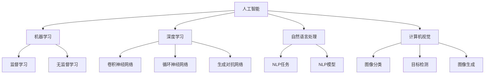

                 

# Andrej Karpathy：人工智能的未来发展前景

## 1. 背景介绍

Andrej Karpathy是斯坦福大学计算机视觉系的教授，同时也是DeepMind的联合创始人之一。在计算机视觉、深度学习、自动驾驶等领域，Andrej Karpathy均有卓越的贡献。他不仅是一位杰出的科学家，同时也是一位出色的教育者，其公开的课程和博客深受学习者喜爱。本文将从Karpathy的视角，探讨人工智能(AI)的未来发展前景。

### 1.1 问题由来

近年来，人工智能技术的快速发展引发了广泛的关注和讨论。从AlphaGo战胜围棋冠军李世石，到GPT-3横扫NLP任务，AI技术已经展现了强大的潜力。然而，AI技术的未来发展面临诸多挑战和不确定性，特别是涉及伦理、安全性、普适性等问题。如何平衡技术进步与社会影响，成为当下面临的重大课题。

### 1.2 问题核心关键点

Andrej Karpathy在多个公开讲座和博客中，反复强调了AI未来发展的几个关键点：

1. **技术突破与伦理道德**：AI技术的进步需要技术突破，但更需关注其伦理道德问题。如如何避免AI在医疗、司法等领域中的偏见和歧视，如何保障数据隐私和安全性。
2. **普适性与个性化**：AI技术需要具备普适性，能广泛服务于不同人群，同时又需满足个性化需求，适应多样化的应用场景。
3. **人机协作与自动化**：AI应作为人类智慧的延伸，与人类协作共同解决问题，而非取代人类。
4. **多学科融合**：AI的发展需要与其他学科如哲学、心理学、社会科学等进行融合，形成更全面、深入的理解。

## 2. 核心概念与联系

### 2.1 核心概念概述

为了深入理解AI的未来发展前景，首先需要明确几个核心概念：

1. **人工智能(AI)**：一种模拟人类智能的技术，涉及机器学习、深度学习、自然语言处理、计算机视觉等多个领域。
2. **机器学习(ML)**：一种数据驱动的学习方式，使计算机通过数据训练自动改进模型。
3. **深度学习(DL)**：一种特殊的机器学习方法，通过构建多层次神经网络，学习数据的高级特征。
4. **自然语言处理(NLP)**：使计算机能够理解和处理人类语言的技术。
5. **计算机视觉(CV)**：使计算机能够识别和理解图像和视频内容的技术。

这些概念之间的联系可以通过以下Mermaid流程图来展示：



这个流程图展示了AI技术的核心组件和其相互关系。深度学习是机器学习的一种，而NLP和CV是AI的具体应用方向。监督学习和无监督学习是机器学习的两种主要学习方式，深度学习中则常采用卷积神经网络、循环神经网络和生成对抗网络等架构。

## 3. 核心算法原理 & 具体操作步骤

### 3.1 算法原理概述

Andrej Karpathy在多个公开讲座中，深入探讨了深度学习的核心原理。深度学习通过多层次的非线性变换，学习数据的高阶表示，使得模型能够自动提取特征、识别模式。以图像识别为例，深度学习通过卷积神经网络，逐层提取图像的纹理、形状、背景等特征，最终识别出图像内容。

### 3.2 算法步骤详解

深度学习的训练过程主要分为数据预处理、模型训练和模型评估三个步骤：

1. **数据预处理**：包括数据清洗、归一化、划分训练集、验证集和测试集等步骤。
2. **模型训练**：通过反向传播算法，最小化损失函数，更新模型参数。
3. **模型评估**：在测试集上评估模型性能，如准确率、召回率、F1分数等指标。

### 3.3 算法优缺点

深度学习具有以下优点：

1. **强大表达能力**：能够学习复杂非线性关系，适应复杂数据结构。
2. **自动特征提取**：不需要手工提取特征，模型自动学习特征。
3. **可解释性**：通过可视化技术，可以看到模型的特征学习过程，提高可解释性。

同时，深度学习也存在一些局限性：

1. **计算资源需求高**：需要大量的计算资源进行训练和推理。
2. **数据依赖性强**：需要大量标注数据进行训练，难以处理稀疏数据。
3. **模型复杂性高**：模型参数量巨大，难以理解和调试。
4. **泛化能力问题**：模型容易过拟合，泛化能力不足。

### 3.4 算法应用领域

深度学习在多个领域都有广泛应用，包括：

- **计算机视觉**：如图像分类、目标检测、人脸识别、自动驾驶等。
- **自然语言处理**：如机器翻译、情感分析、文本生成、问答系统等。
- **语音识别**：如语音识别、语音合成、情感识别等。
- **推荐系统**：如电商推荐、音乐推荐、新闻推荐等。
- **医疗健康**：如疾病诊断、基因分析、健康监测等。

## 4. 数学模型和公式 & 详细讲解

### 4.1 数学模型构建

以图像分类任务为例，构建深度学习模型的过程如下：

1. **输入层**：输入图像数据，将其转化为张量形式。
2. **卷积层**：通过卷积核提取图像的特征，保留边缘、纹理等重要信息。
3. **池化层**：对卷积层的输出进行下采样，减少计算量和特征维度。
4. **全连接层**：将池化层的输出转化为向量形式，输入到全连接层进行分类。
5. **输出层**：使用softmax函数计算每个类别的概率，输出最终分类结果。

### 4.2 公式推导过程

深度学习的训练过程主要基于损失函数和梯度下降算法。以图像分类任务为例，假设模型输出为 $y$，真实标签为 $t$，交叉熵损失函数为 $L$，则有：

$$
L = -\frac{1}{N} \sum_{i=1}^{N} t_i \log y_i + (1 - t_i) \log (1 - y_i)
$$

其中 $N$ 为样本数量。通过反向传播算法，计算梯度 $\nabla L$，更新模型参数 $\theta$：

$$
\theta \leftarrow \theta - \alpha \nabla L
$$

其中 $\alpha$ 为学习率，控制参数更新的步长。

### 4.3 案例分析与讲解

以ImageNet数据集为例，Karpathy曾带领其团队使用深度学习模型AlexNet在2012年ImageNet图像分类比赛中获得冠军。AlexNet通过多层次卷积和池化操作，提取图像特征，再通过全连接层进行分类。在训练过程中，Karpathy等人采用了Dropout、数据增强等技术，提高了模型的鲁棒性和泛化能力。

## 5. 项目实践：代码实例和详细解释说明

### 5.1 开发环境搭建

以下是使用PyTorch框架搭建深度学习模型的环境配置：

1. 安装Anaconda：从官网下载并安装Anaconda，用于创建独立的Python环境。
2. 创建并激活虚拟环境：
```bash
conda create -n pytorch-env python=3.8 
conda activate pytorch-env
```
3. 安装PyTorch：根据CUDA版本，从官网获取对应的安装命令。例如：
```bash
conda install pytorch torchvision torchaudio cudatoolkit=11.1 -c pytorch -c conda-forge
```
4. 安装Tensorboard：
```bash
pip install tensorboard
```

### 5.2 源代码详细实现

以下是一个简单的图像分类模型代码实现，用于加载和训练MNIST数据集：

```python
import torch
import torch.nn as nn
import torch.optim as optim
import torchvision
import torchvision.transforms as transforms

# 加载MNIST数据集
train_dataset = torchvision.datasets.MNIST(root='./data', train=True, transform=transforms.ToTensor(), download=True)
test_dataset = torchvision.datasets.MNIST(root='./data', train=False, transform=transforms.ToTensor(), download=True)

# 定义模型结构
class Net(nn.Module):
    def __init__(self):
        super(Net, self).__init__()
        self.conv1 = nn.Conv2d(1, 10, kernel_size=5)
        self.conv2 = nn.Conv2d(10, 20, kernel_size=5)
        self.pool = nn.MaxPool2d(2, 2)
        self.fc1 = nn.Linear(320, 50)
        self.fc2 = nn.Linear(50, 10)

    def forward(self, x):
        x = self.pool(nn.functional.relu(self.conv1(x)))
        x = self.pool(nn.functional.relu(self.conv2(x)))
        x = x.view(-1, 320)
        x = nn.functional.relu(self.fc1(x))
        x = self.fc2(x)
        return nn.functional.log_softmax(x, dim=1)

# 定义损失函数和优化器
model = Net()
loss_fn = nn.CrossEntropyLoss()
optimizer = optim.Adam(model.parameters(), lr=0.001)

# 训练模型
def train(epoch):
    model.train()
    for batch_idx, (data, target) in enumerate(train_loader):
        optimizer.zero_grad()
        output = model(data)
        loss = loss_fn(output, target)
        loss.backward()
        optimizer.step()
        if batch_idx % 100 == 0:
            print('Train Epoch: {} [{}/{} ({:.0f}%)]\tLoss: {:.6f}'.format(
                epoch, batch_idx * len(data), len(train_loader.dataset),
                100. * batch_idx / len(train_loader), loss.item()))

# 测试模型
def test():
    model.eval()
    correct = 0
    total = 0
    with torch.no_grad():
        for data, target in test_loader:
            output = model(data)
            _, predicted = torch.max(output.data, 1)
            total += target.size(0)
            correct += (predicted == target).sum().item()
    print('Accuracy of the network on the 10000 test images: {} %'.format(100 * correct / total))
```

### 5.3 代码解读与分析

让我们再详细解读一下关键代码的实现细节：

**Net类**：
- `__init__`方法：初始化模型的卷积层、池化层和全连接层。
- `forward`方法：定义前向传播过程，依次通过卷积、池化、全连接层进行特征提取和分类。

**训练和测试函数**：
- `train`函数：在训练集上迭代训练，记录每个epoch的损失。
- `test`函数：在测试集上评估模型性能，输出准确率。

**训练流程**：
- 定义训练集的迭代器，调用`train`函数进行模型训练。
- 在每个epoch结束时，调用`test`函数评估模型性能。

可以看到，使用PyTorch框架，开发者可以以相对简洁的代码实现深度学习模型的训练和评估，非常适合科研和工程应用。

## 6. 实际应用场景

### 6.1 医疗影像分析

深度学习在医疗影像分析中有着广泛应用。传统的医疗影像分析需要大量的专业知识和经验，通过手动标注数据进行训练。而使用深度学习模型，可以快速自动提取影像特征，进行疾病诊断和预测。例如，使用卷积神经网络对肺部X光片进行分类，可以自动识别肺部结节和肿瘤，帮助医生提高诊断效率和准确性。

### 6.2 自动驾驶

自动驾驶是深度学习的另一个重要应用方向。通过计算机视觉和深度学习技术，自动驾驶系统可以识别道路、行人、车辆等目标，进行路径规划和行为决策。例如，使用卷积神经网络对视频帧进行实时分析，可以检测并识别交通标志、行人、车辆，自动做出安全行驶决策。

### 6.3 金融风控

深度学习在金融风控领域也有重要应用。通过深度学习模型，可以对客户的消费行为、信用记录等进行分析和预测，识别潜在的风险和欺诈行为。例如，使用循环神经网络对客户交易数据进行建模，可以预测客户的信用风险，及时采取风险控制措施。

### 6.4 未来应用展望

随着深度学习技术的不断发展，AI将在更多领域得到应用，为人类生活带来深刻变革。以下是几个未来发展方向：

1. **医疗健康**：深度学习将在疾病预测、基因分析、健康监测等方面发挥更大作用，提升医疗服务的智能化水平。
2. **智能制造**：深度学习可以应用于工业生产中的质量检测、工艺优化、设备维护等环节，提升生产效率和产品质量。
3. **智能家居**：深度学习可以应用于智能音箱、智能家电等领域，提升家庭生活的智能化和便利性。
4. **智慧城市**：深度学习可以应用于城市交通、环境监测、应急管理等环节，提高城市管理的自动化和智能化水平。
5. **个性化推荐**：深度学习可以应用于电商、音乐、新闻等领域，提供更精准、多样化的推荐内容，提升用户体验。

## 7. Andrej Karpathy推荐的学习资源

### 7.1 学习资源推荐

为了帮助学习者系统掌握深度学习的原理和应用，Karpathy推荐了以下学习资源：

1. 《深度学习》课程：斯坦福大学的CS231n课程，涵盖深度学习在计算机视觉中的应用。
2. 《神经网络与深度学习》书籍：Michael Nielsen的经典著作，深入浅出地介绍了神经网络的基础知识和深度学习的基本原理。
3. 《动手学深度学习》书籍：由李沐等人编写，结合代码实践，系统介绍了深度学习的各个方面。
4. 《GPU深度学习》课程：Karpathy本人讲授的在线课程，介绍了如何使用GPU加速深度学习训练和推理。
5. Kaggle竞赛平台：参与Kaggle数据科学竞赛，实践深度学习算法，提升实战能力。

通过这些学习资源，学习者可以系统地掌握深度学习的理论基础和实践技巧，为未来的AI开发打下坚实的基础。

### 7.2 开发工具推荐

Karpathy推荐了以下几款用于深度学习开发的常用工具：

1. PyTorch：基于Python的开源深度学习框架，灵活动态的计算图，适合快速迭代研究。
2. TensorFlow：由Google主导开发的开源深度学习框架，生产部署方便，适合大规模工程应用。
3. Keras：高层次的深度学习框架，易于上手，支持多种后端引擎。
4. Jupyter Notebook：开源的交互式笔记本，适合撰写和调试深度学习代码。
5. Google Colab：谷歌推出的在线Jupyter Notebook环境，免费提供GPU/TPU算力，方便学习者快速上手实验最新模型，分享学习笔记。

合理利用这些工具，可以显著提升深度学习任务的开发效率，加速创新迭代的步伐。

### 7.3 相关论文推荐

以下是几篇具有里程碑意义的深度学习论文，推荐阅读：

1. AlexNet：ImageNet 2012竞赛冠军，使用多层次卷积神经网络实现图像分类。
2. ResNet：使用残差连接解决深度网络退化问题，大幅提升网络深度。
3. Transformer：提出自注意力机制，在机器翻译、语言建模等领域取得优异效果。
4. GANs：提出生成对抗网络，实现高质量的图像生成和图像修复。
5. Attention Is All You Need：提出自注意力机制，实现高效的机器翻译和语言生成。

这些论文代表了大规模深度学习的几个重要发展阶段，阅读这些论文有助于深入理解深度学习的核心思想和前沿技术。

## 8. 总结：未来发展趋势与挑战

### 8.1 研究成果总结

深度学习在过去十年中取得了飞速发展，从图像识别到自然语言处理，从语音识别到自动驾驶，AI技术已经展现了强大的潜力。然而，随着技术进步，也带来了诸多挑战和伦理问题。如何平衡技术突破与社会影响，成为当下面临的重大课题。

### 8.2 未来发展趋势

展望未来，深度学习将在更多领域得到应用，为人类生活带来深刻变革。以下是几个重要发展方向：

1. **医疗健康**：深度学习将在疾病预测、基因分析、健康监测等方面发挥更大作用，提升医疗服务的智能化水平。
2. **智能制造**：深度学习可以应用于工业生产中的质量检测、工艺优化、设备维护等环节，提升生产效率和产品质量。
3. **智能家居**：深度学习可以应用于智能音箱、智能家电等领域，提升家庭生活的智能化和便利性。
4. **智慧城市**：深度学习可以应用于城市交通、环境监测、应急管理等环节，提高城市管理的自动化和智能化水平。
5. **个性化推荐**：深度学习可以应用于电商、音乐、新闻等领域，提供更精准、多样化的推荐内容，提升用户体验。

### 8.3 面临的挑战

尽管深度学习技术取得了显著进展，但在应用过程中仍面临诸多挑战：

1. **数据依赖性强**：深度学习模型需要大量的标注数据进行训练，难以处理稀疏数据。
2. **计算资源需求高**：深度学习模型需要大量的计算资源进行训练和推理，难以在资源受限的环境中部署。
3. **模型复杂性高**：深度学习模型参数量巨大，难以理解和调试。
4. **泛化能力问题**：深度学习模型容易过拟合，泛化能力不足。
5. **伦理和安全性问题**：深度学习模型可能存在偏见、歧视、隐私泄露等问题，需要从技术和管理层面加以解决。

### 8.4 研究展望

未来，深度学习的发展需要从以下几个方面进行探索：

1. **无监督学习和半监督学习**：探索不需要大量标注数据的深度学习技术，提高模型的泛化能力。
2. **模型压缩和加速**：研究模型压缩、稀疏化存储等技术，优化深度学习模型的计算资源需求。
3. **可解释性和可控性**：研究深度学习模型的可解释性，提高模型的透明度和可信度。
4. **多学科融合**：将深度学习与其他学科如哲学、心理学、社会科学等进行融合，形成更全面、深入的理解。
5. **伦理和安全**：制定深度学习技术的伦理标准，确保数据隐私和安全性。

这些研究方向将引领深度学习技术迈向更高的台阶，为构建安全、可靠、可解释、可控的智能系统铺平道路。

## 9. 附录：常见问题与解答

**Q1：深度学习是否适用于所有领域？**

A: 深度学习在图像、语音、文本等领域有着广泛应用，但在某些领域如科学研究和文学创作等领域，效果有限。深度学习更适合处理结构化数据和规律性较强的任务。

**Q2：如何处理深度学习的计算资源需求？**

A: 可以通过模型压缩、参数剪枝、量化加速等技术，优化深度学习模型的计算资源需求。同时，使用分布式训练、模型并行等方法，加速深度学习模型的训练和推理。

**Q3：如何提高深度学习的泛化能力？**

A: 可以通过数据增强、正则化、对抗训练等技术，提高深度学习模型的泛化能力。同时，探索无监督学习和半监督学习等技术，减少深度学习对标注数据的依赖。

**Q4：深度学习模型的可解释性如何提升？**

A: 可以通过可视化技术，理解深度学习模型的内部工作机制。同时，研究可解释性模型，如可解释神经网络，提高模型的透明度和可信度。

**Q5：深度学习技术在医疗领域的应用有哪些？**

A: 深度学习技术在医疗领域有广泛应用，如医学影像分析、疾病预测、基因分析等。使用卷积神经网络对医学影像进行分类，可以辅助医生进行诊断。

---

作者：禅与计算机程序设计艺术 / Zen and the Art of Computer Programming

