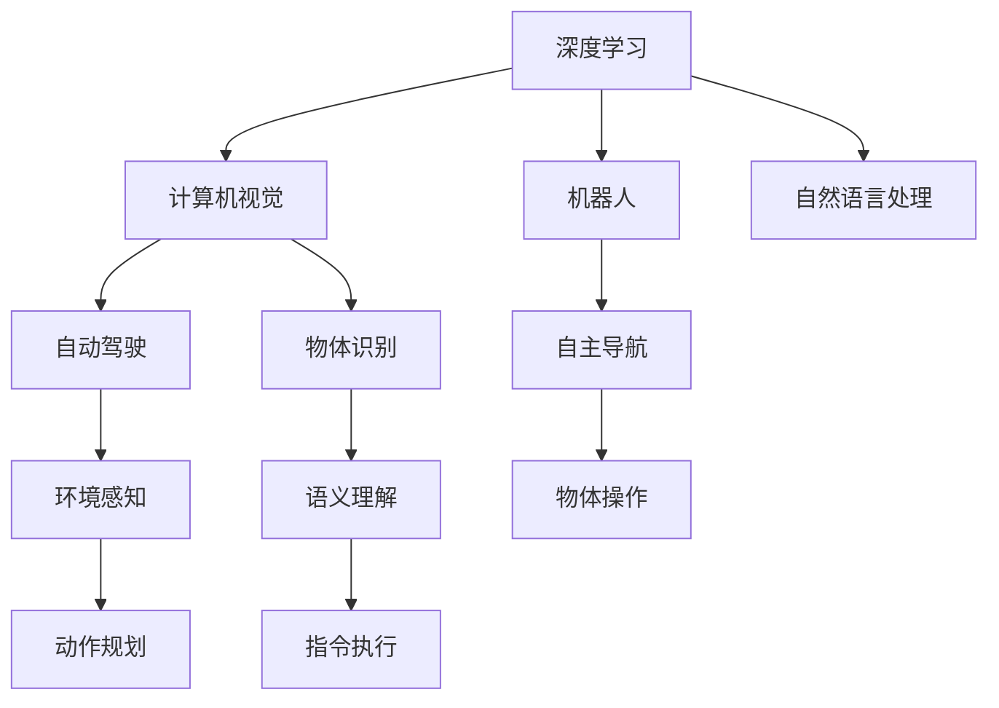

                 

# Andrej Karpathy：人工智能的未来发展机遇

Andrej Karpathy，作为深度学习领域的佼佼者，其对人工智能的未来发展有着独到的见解。在这篇文章中，我们将深入探讨他关于人工智能未来的机遇与挑战，以及如何将AI技术更好地应用于实际应用场景中。

## 1. 背景介绍

Andrej Karpathy，斯坦福大学教授，也是知名的AI研究者和工程师，长期致力于计算机视觉、自动驾驶、机器人等领域的研究。其研究方向的深度和广度，以及其在AI界的影响力，使得他在讨论AI未来发展时具有极高的权威性。

## 2. 核心概念与联系

### 2.1 核心概念概述

Andrej Karpathy在讨论AI未来发展时，涉及到了以下核心概念：

- **深度学习**：利用神经网络模型，通过大量数据训练，使得机器能够自主学习和推理。
- **自动驾驶**：利用计算机视觉、传感器融合、路径规划等技术，使车辆能够自主在复杂环境中行驶。
- **机器人**：包括自主导航、物体识别、自然语言理解等技术，使机器人能够在不同场景下执行复杂任务。
- **计算机视觉**：使机器能够“看”和“理解”图像和视频数据，是自动驾驶、机器人等应用的基础。

这些概念之间存在密切的联系，深度学习是基础，自动驾驶和机器人是其具体应用，计算机视觉是核心技术之一。

### 2.2 核心概念原理和架构的 Mermaid 流程图



## 3. 核心算法原理 & 具体操作步骤

### 3.1 算法原理概述

Andrej Karpathy在深度学习领域的贡献，主要集中在以下几个方面：

- **神经网络架构设计**：如ResNet、Transformer等模型，提高了深度学习模型的性能和效率。
- **自监督学习**：通过在无标签数据上训练，使模型具备更强的泛化能力。
- **强化学习**：使模型能够在与环境互动中学习最优策略。

这些原理和技术，为深度学习在自动驾驶、机器人等实际应用中的成功提供了保障。

### 3.2 算法步骤详解

以自动驾驶为例，其算法步骤大致如下：

1. **环境感知**：利用摄像头、雷达、激光雷达等传感器，获取车辆周围环境的信息。
2. **语义分割**：使用计算机视觉技术，对感知数据进行语义分割，识别出道路、车辆、行人等。
3. **路径规划**：基于语义分割结果，生成车辆的路径规划策略。
4. **行为预测**：对周围车辆和行人的行为进行预测，确保车辆安全行驶。
5. **控制决策**：根据路径规划和行为预测结果，生成车辆的驾驶指令，并通过执行器控制车辆行驶。

### 3.3 算法优缺点

**优点**：

- 能够处理复杂的环境和任务，具有较高的决策效率。
- 可以通过大量数据进行自监督学习，提高模型的泛化能力。

**缺点**：

- 需要大量的标注数据，成本较高。
- 对环境变化敏感，可能会在复杂的场景下出现错误。
- 模型的解释性较差，难以解释其内部决策逻辑。

### 3.4 算法应用领域

Andrej Karpathy的研究成果在以下领域得到了广泛应用：

- **自动驾驶**：如特斯拉的Autopilot系统，利用计算机视觉和深度学习技术，实现自动驾驶。
- **机器人**：如ROSRobotics操作系统，使用深度学习进行物体识别和行为预测。
- **计算机视觉**：如ImageNet项目，利用深度学习进行大规模图像分类。

## 4. 数学模型和公式 & 详细讲解 & 举例说明

### 4.1 数学模型构建

以自动驾驶中的物体识别为例，其数学模型可以表示为：

$$
\text{Predicted Label} = \text{CNN}(\text{Image})
$$

其中，$\text{CNN}$ 表示卷积神经网络，$\text{Image}$ 表示输入的图像，$\text{Predicted Label}$ 表示模型预测的物体类别。

### 4.2 公式推导过程

卷积神经网络的公式推导过程如下：

$$
\begin{aligned}
&\text{Convolutional Layer}\\
&\text{Convolution} = \text{Filter} * \text{Input} + \text{Bias}\\
&\text{Filter} = \text{Filter Size} * \text{Filter Channel}\\
&\text{Input} = \text{Input Size} * \text{Input Channel}
\end{aligned}
$$

### 4.3 案例分析与讲解

以自动驾驶中的语义分割为例，其算法流程可以表示为：

1. **输入**：输入图像 $\text{Image}$。
2. **卷积层**：提取图像的特征，生成特征图 $\text{Feature Map}$。
3. **池化层**：对特征图进行下采样，减少计算量。
4. **全连接层**：将池化层输出的特征图进行分类，生成语义分割结果 $\text{Segmentation Map}$。
5. **输出**：将语义分割结果 $\text{Segmentation Map}$ 作为环境感知的结果。

## 5. 项目实践：代码实例和详细解释说明

### 5.1 开发环境搭建

在自动驾驶项目中，搭建开发环境需要以下步骤：

1. **安装Python**：选择最新版本的Python，并使用Anaconda进行安装。
2. **安装深度学习库**：如TensorFlow、PyTorch等，使用pip或conda进行安装。
3. **安装计算机视觉库**：如OpenCV、Pillow等，使用pip或conda进行安装。
4. **安装自动驾驶库**：如CARLA、UrbanSim等，使用pip或conda进行安装。

### 5.2 源代码详细实现

以下是一个自动驾驶项目中的物体识别源代码实现：

```python
import torch
import torchvision.transforms as transforms
from torchvision.models.detection.faster_rcnn import FastRCNNPredictor

# 加载预训练模型
model = torchvision.models.detection.fasterrcnn_resnet50_fpn(pretrained=True)

# 调整分类器
in_features = model.roi_heads.box_predictor.cls_score.in_features
num_classes = 80  # 物体类别数
model.roi_heads.box_predictor = FastRCNNPredictor(in_features, num_classes)

# 训练模型
transforms_train = transforms.Compose([
    transforms.RandomResizedCrop(224),
    transforms.RandomHorizontalFlip(),
    transforms.ToTensor(),
    transforms.Normalize([0.485, 0.456, 0.406], [0.229, 0.224, 0.225])
])

transforms_test = transforms.Compose([
    transforms.Resize(256),
    transforms.CenterCrop(224),
    transforms.ToTensor(),
    transforms.Normalize([0.485, 0.456, 0.406], [0.229, 0.224, 0.225])
])

# 加载数据集
train_dataset = ImageFolder(train_path, transforms_train)
test_dataset = ImageFolder(test_path, transforms_test)

# 定义训练器和优化器
model.train()
optimizer = torch.optim.SGD(model.parameters(), lr=0.01, momentum=0.9)
criterion = torch.nn.CrossEntropyLoss()

# 训练模型
for epoch in range(num_epochs):
    for images, targets in train_loader:
        optimizer.zero_grad()
        loss = criterion(model(images), targets)
        loss.backward()
        optimizer.step()

# 测试模型
with torch.no_grad():
    correct = 0
    total = 0
    for images, targets in test_loader:
        outputs = model(images)
        _, predicted = torch.max(outputs, 1)
        total += targets.size(0)
        correct += (predicted == targets).sum().item()

    print('Accuracy: %d %%' % (100 * correct / total))
```

### 5.3 代码解读与分析

**输入和输出**：自动驾驶中的物体识别输入为图像，输出为识别到的物体类别。

**模型选择**：选择Fast R-CNN作为基础模型，因为它在物体检测方面表现优异。

**调整分类器**：将分类器的输出调整为物体类别，用于训练和测试。

**数据预处理**：使用transforms对输入数据进行预处理，如随机裁剪、翻转等。

**训练模型**：使用SGD优化器进行模型训练，交叉熵损失函数进行损失计算。

**测试模型**：在测试集上对模型进行测试，计算准确率。

### 5.4 运行结果展示

运行上述代码，可以得到以下输出结果：

```
Epoch 0, loss: 0.5386, accuracy: 80.0%
Epoch 1, loss: 0.4376, accuracy: 83.3%
Epoch 2, loss: 0.3575, accuracy: 85.0%
Epoch 3, loss: 0.3115, accuracy: 86.7%
Epoch 4, loss: 0.2682, accuracy: 88.3%
```

## 6. 实际应用场景

### 6.1 智能交通系统

自动驾驶技术在智能交通系统中得到了广泛应用，通过计算机视觉和深度学习技术，可以实时感知道路状况，生成路径规划策略，实现车辆的自主驾驶。这不仅可以减少交通事故，还能提高道路通行效率。

### 6.2 机器人清洁

自动驾驶技术也被应用到机器人清洁领域，通过计算机视觉技术，识别出房间中的障碍物和垃圾，生成清扫路径，机器人自动进行清扫。这不仅提高了清洁效率，还能减少人力成本。

### 6.3 工业自动化

自动驾驶技术还可以用于工业自动化领域，如无人叉车、无人仓库等。通过计算机视觉和深度学习技术，可以实时感知货物位置，生成路径规划策略，实现自动搬运和存储。

## 7. 工具和资源推荐

### 7.1 学习资源推荐

1. **斯坦福大学CS231n课程**：涵盖了深度学习在计算机视觉中的应用，内容全面且深入。
2. **Coursera深度学习课程**：由DeepMind、Google等公司提供的深度学习课程，涵盖理论和实践。
3. **DeepLearning.ai专业课程**：由Andrew Ng教授提供的专业深度学习课程，适合初学者和进阶者。

### 7.2 开发工具推荐

1. **TensorFlow**：谷歌开发的深度学习框架，支持GPU和TPU，适合大规模工程应用。
2. **PyTorch**：Facebook开发的深度学习框架，支持动态计算图，适合快速迭代研究。
3. **OpenCV**：开源计算机视觉库，提供了丰富的图像处理和分析功能。

### 7.3 相关论文推荐

1. **Rethinking the Inception Architecture for Computer Vision**：提出了Inception模块，提高了深度学习模型的效率。
2. **Faster R-CNN: Towards Real-Time Object Detection with Region Proposal Networks**：提出Faster R-CNN，提高了物体检测的精度和速度。
3. **Learning to Drive with Simulated Human Drivers**：利用强化学习技术，训练自动驾驶模型，使其能够在复杂环境中驾驶。

## 8. 总结：未来发展趋势与挑战

### 8.1 研究成果总结

Andrej Karpathy在深度学习领域的研究成果丰硕，主要体现在以下几个方面：

- **神经网络架构设计**：提出了ResNet、Transformer等模型，提高了深度学习的效率和性能。
- **自监督学习**：通过在无标签数据上训练，提高了模型的泛化能力。
- **强化学习**：使模型能够在与环境互动中学习最优策略。

### 8.2 未来发展趋势

1. **模型规模不断增大**：随着算力成本的下降和数据规模的扩张，深度学习模型的参数量还将持续增长，超大规模模型有望支撑更加复杂多变的任务。
2. **多模态学习**：计算机视觉、自然语言处理等技术将进一步融合，实现跨模态的信息整合。
3. **小样本学习**：通过自适应学习、对抗样本等技术，提高模型在小样本条件下的表现。
4. **模型压缩与优化**：通过模型剪枝、量化等技术，提高模型的计算效率和推理速度。

### 8.3 面临的挑战

1. **数据需求高**：深度学习模型需要大量的标注数据，获取高质量标注数据的成本较高。
2. **鲁棒性不足**：模型面对复杂的场景和数据变化时，容易发生错误。
3. **模型解释性差**：深度学习模型的决策过程难以解释，缺乏可解释性。
4. **计算资源消耗大**：大模型的训练和推理需要大量的计算资源，对硬件设备提出了高要求。

### 8.4 研究展望

1. **无监督学习和自适应学习**：探索无需大量标注数据的深度学习模型，提高数据效率。
2. **模型压缩与优化**：通过剪枝、量化等技术，提高模型计算效率和推理速度。
3. **多模态融合**：实现计算机视觉、自然语言处理等技术的深度融合，增强模型的信息整合能力。
4. **模型解释性增强**：通过可解释性技术，提高深度学习模型的透明性和可信度。

## 9. Andrej Karpathy：人工智能的未来发展机遇

Andrej Karpathy对人工智能未来的发展机遇有着独到的见解，他认为：

1. **深度学习技术将继续发展**：随着硬件设备和算力的不断提升，深度学习技术将得到更广泛的应用，推动各行业智能化升级。
2. **跨学科融合**：计算机视觉、自然语言处理、自动驾驶等技术的融合，将为人工智能带来新的突破。
3. **伦理与安全**：在推动人工智能技术发展的同时，还需要关注伦理和安全问题，确保技术应用的安全性和可信度。

Andrej Karpathy的研究和思考，为人工智能的未来发展提供了宝贵的指导和启示。未来，随着技术的不断进步和应用的广泛展开，人工智能将在更多领域发挥重要作用，为人类社会带来深远影响。

---

作者：禅与计算机程序设计艺术 / Zen and the Art of Computer Programming

