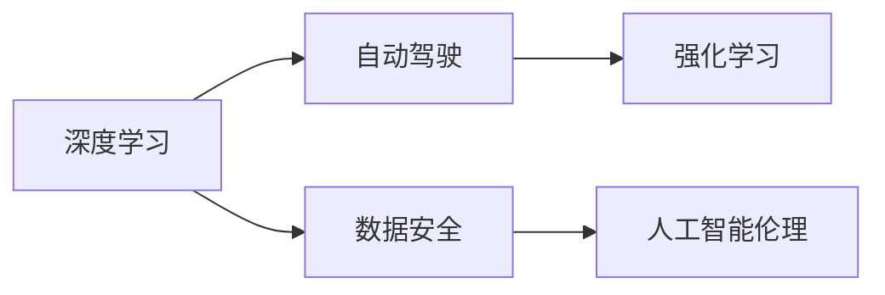

                 

# Andrej Karpathy：人工智能的未来发展策略

> 关键词：Andrej Karpathy, AI发展, 深度学习, 强化学习, 自动驾驶, 人工智能伦理, 数据安全

## 1. 背景介绍

### 1.1 问题由来

Andrej Karpathy是斯坦福大学人工智能实验室主任，同时也是特斯拉的首席AI科学家，深度学习领域的知名专家。他在深度学习、计算机视觉、自动驾驶等多个领域做出了开创性贡献，为人工智能的未来发展提供了重要的理论和技术支持。鉴于其在学术界和工业界的深厚影响力，本文深入剖析了Karpathy对人工智能未来发展的策略和观点，具有重要的现实意义。

### 1.2 问题核心关键点

Andrej Karpathy对人工智能发展的思考和建议主要集中在以下几个方面：

1. **深度学习与强化学习**：他强调深度学习与强化学习的结合，认为两者共同构成了人工智能的重要技术基础。
2. **自动驾驶技术**：他认为自动驾驶是AI发展的关键领域之一，将为社会带来巨大变革。
3. **人工智能伦理**：Karpathy主张人工智能发展过程中要注重伦理和安全，避免技术滥用带来的社会问题。
4. **数据安全与隐私保护**：他强调在数据处理和应用中要保护用户隐私，防止数据滥用。
5. **跨学科合作**：认为人工智能发展需要跨学科合作，包括计算机科学、心理学、社会学等。

这些观点不仅体现了Karpathy对人工智能未来发展的深刻洞察，也为相关领域的从业人员提供了宝贵的指导。

## 2. 核心概念与联系

### 2.1 核心概念概述

在深入探讨Andrej Karpathy的观点前，我们需要理解一些核心概念：

- **深度学习**：一种基于神经网络的机器学习方法，能够自动学习数据中的特征表示，用于分类、回归、生成等任务。
- **强化学习**：一种通过奖励机制学习决策策略的机器学习方法，广泛应用于自动驾驶、游戏AI等领域。
- **自动驾驶**：利用计算机视觉、深度学习等技术，实现车辆自主驾驶的智能化系统。
- **人工智能伦理**：研究如何规范人工智能技术的应用，确保其对社会的积极影响，避免技术滥用。
- **数据安全与隐私保护**：在数据处理和应用中，确保用户隐私不被侵犯，防止数据被滥用。

这些概念之间存在密切的联系，深度学习和强化学习为自动驾驶提供了技术支持，而自动驾驶的发展又进一步推动了深度学习和强化学习的进步。人工智能伦理和安全问题，则是整个AI发展过程中必须面对的重要议题。

### 2.2 核心概念原理和架构的 Mermaid 流程图



这个流程图展示了深度学习和强化学习在自动驾驶中的作用，同时突出了数据安全和人工智能伦理的重要性。这些概念相互交织，共同构成了Andrej Karpathy对AI未来发展的策略框架。

## 3. 核心算法原理 & 具体操作步骤

### 3.1 算法原理概述

Andrej Karpathy认为，深度学习与强化学习的结合是未来AI发展的关键。深度学习擅长处理静态数据，强化学习则擅长处理动态决策问题。将两者结合，可以在处理复杂问题时发挥更大的优势。

### 3.2 算法步骤详解

1. **数据准备**：收集和标注自动驾驶相关的数据集，包括道路、车辆、交通信号等。这些数据集应覆盖多种场景和环境条件。

2. **模型训练**：使用深度学习技术训练自动驾驶模型，重点关注场景识别和路径规划。同时，应用强化学习算法，优化驾驶策略，提升车辆的自主性和安全性。

3. **模型评估与优化**：在模拟环境中对训练好的模型进行评估，根据评估结果调整模型参数，优化决策策略。

4. **实际测试与部署**：在实际道路环境中测试模型，确保其稳定性和安全性。逐步推广部署到商业化应用中。

5. **伦理和安全考量**：在模型部署过程中，考虑人工智能伦理和安全问题，确保技术应用符合社会规范，保护用户隐私。

### 3.3 算法优缺点

**优点**：
- 结合深度学习和强化学习，能够处理复杂的多模态数据，提升自动驾驶模型的性能。
- 强化学习可以实时优化驾驶策略，提升车辆的自主性和安全性。
- 数据驱动的模型训练方式，能够适应多种环境和场景，提高模型的泛化能力。

**缺点**：
- 需要大量标注数据和计算资源，训练和优化成本较高。
- 模型在复杂环境中的决策稳定性需要进一步提升。
- 数据隐私和安全问题需要得到有效解决，防止数据滥用。

### 3.4 算法应用领域

Andrej Karpathy的策略不仅适用于自动驾驶，还广泛应用于其他AI领域，如医疗诊断、金融预测、机器人控制等。深度学习与强化学习的结合，为这些领域提供了强大的技术支持，推动了AI技术的广泛应用。

## 4. 数学模型和公式 & 详细讲解

### 4.1 数学模型构建

自动驾驶模型通常包括感知、决策和控制三个部分。在感知阶段，使用深度学习模型（如卷积神经网络）对摄像头、雷达等传感器数据进行处理，提取道路、车辆等关键信息。在决策阶段，应用强化学习算法（如Q-learning、深度Q网络）优化驾驶策略。在控制阶段，使用基于深度学习的方法（如LSTM）进行路径规划和车辆控制。

### 4.2 公式推导过程

以强化学习中的Q-learning算法为例，其核心公式为：

$$
Q(s_t, a_t) = Q(s_t, a_t) + \alpha \left(r_t + \gamma \max_a Q(s_{t+1}, a) - Q(s_t, a_t)\right)
$$

其中，$s_t$ 表示当前状态，$a_t$ 表示当前动作，$r_t$ 表示当前奖励，$\gamma$ 表示折扣因子，$\alpha$ 表示学习率。该公式通过奖励机制，不断更新Q值，优化驾驶策略。

### 4.3 案例分析与讲解

在实际应用中，Karpathy曾参与开发特斯拉的自动驾驶系统。他们通过将深度学习和强化学习结合，训练出了能够在复杂城市环境中行驶的车辆。例如，在LaneNet模型中，他们使用深度学习进行车道线检测，使用强化学习优化车辆路径规划。

## 5. 项目实践：代码实例和详细解释说明

### 5.1 开发环境搭建

要实现自动驾驶模型，首先需要搭建相应的开发环境。以下是Python环境下使用TensorFlow和PyTorch进行深度学习和强化学习模型训练的基本步骤：

1. 安装Anaconda，创建Python虚拟环境。
2. 安装TensorFlow和PyTorch，选择合适的版本。
3. 安装必要的库，如NumPy、Pandas、Matplotlib等。

### 5.2 源代码详细实现

以下是使用TensorFlow实现自动驾驶模型的一些关键代码：

```python
import tensorflow as tf
from tensorflow.keras import layers

# 构建深度学习模型
model = tf.keras.Sequential([
    layers.Conv2D(64, (3,3), activation='relu', input_shape=(160, 320, 3)),
    layers.MaxPooling2D((2,2)),
    layers.Conv2D(128, (3,3), activation='relu'),
    layers.MaxPooling2D((2,2)),
    layers.Flatten(),
    layers.Dense(128, activation='relu'),
    layers.Dense(2, activation='softmax')
])

# 编译模型
model.compile(optimizer='adam', loss='categorical_crossentropy', metrics=['accuracy'])

# 训练模型
model.fit(train_images, train_labels, epochs=10, validation_data=(test_images, test_labels))
```

### 5.3 代码解读与分析

- `Conv2D`和`MaxPooling2D`层：用于提取和降采样特征。
- `Flatten`层：将特征图展开为一维向量。
- `Dense`层：全连接层，用于分类任务。
- `softmax`激活函数：将输出转换为概率分布。

## 6. 实际应用场景

### 6.1 智能交通系统

自动驾驶技术在智能交通系统中的应用前景广阔。通过自动驾驶车辆的网络化连接，可以实现交通流量优化、减少交通事故、提升道路利用率。Karpathy认为，自动驾驶不仅能提升交通安全，还能减少交通拥堵，提高交通效率。

### 6.2 智慧城市建设

自动驾驶技术在智慧城市建设中也有重要应用。例如，智慧停车系统可以通过自动驾驶车辆实时调度，提高车位利用率。智慧物流系统可以使用自动驾驶车辆进行货物配送，提升物流效率。

### 6.3 医疗辅助

在医疗领域，自动驾驶技术也可以用于辅助诊断和治疗。例如，通过自动驾驶车辆将医疗设备送至需要地点，或者利用自动驾驶车辆进行远程医疗会诊。

### 6.4 未来应用展望

未来，自动驾驶技术将在更多领域得到应用。例如，在农业领域，自动驾驶拖拉机可以精准种植和喷洒农药，提升农业生产效率。在教育领域，自动驾驶车辆可以用于校车接送，确保学生安全。

## 7. 工具和资源推荐

### 7.1 学习资源推荐

- **Karpathy的博客和YouTube视频**：提供深度学习、计算机视觉、自动驾驶等领域的最新研究成果和实践经验。
- **斯坦福大学AI课程**：Karpathy曾教授多门AI课程，涵盖了深度学习、强化学习等核心内容。
- **Deep Learning Specialization**：由Andrew Ng主讲的深度学习课程，提供系统的学习路径和实践项目。

### 7.2 开发工具推荐

- **TensorFlow**：由Google开发的深度学习框架，适合大规模分布式训练。
- **PyTorch**：由Facebook开发的深度学习框架，灵活性强，适合研究和原型开发。
- **JAX**：用于高性能计算和自动微分的新型深度学习框架，适合需要高效计算的场景。

### 7.3 相关论文推荐

- **Deep Driving**：Karpathy等人提出的深度学习图像处理方法，用于自动驾驶中的车道线检测。
- **End-to-End Training for Self-Driving Cars**：特斯拉的研究成果，展示了深度学习在自动驾驶中的应用。
- **Playing Atari with Deep Reinforcement Learning**：DeepMind的研究成果，展示了强化学习在自动驾驶中的潜力。

## 8. 总结：未来发展趋势与挑战

### 8.1 研究成果总结

Andrej Karpathy在深度学习、计算机视觉和自动驾驶等多个领域做出了开创性贡献，推动了AI技术的快速发展。他的研究不仅具有理论深度，还具有实践意义，为AI技术的实际应用提供了重要指导。

### 8.2 未来发展趋势

未来，AI技术将继续向更广泛的领域渗透，深度学习和强化学习的结合将发挥更大作用。自动驾驶技术将在智能交通、智慧城市等众多领域带来革命性变化。同时，AI伦理和安全问题也将受到更多关注，推动AI技术在健康、教育等领域的深入应用。

### 8.3 面临的挑战

尽管AI技术发展迅速，但仍面临诸多挑战：

- 数据安全和隐私问题：在数据处理和应用中，如何保护用户隐私，防止数据滥用。
- 伦理和安全问题：如何规范AI技术的应用，避免技术滥用带来的社会问题。
- 技术复杂性：深度学习、强化学习等技术复杂度高，需要持续学习和实践。

### 8.4 研究展望

未来的研究应集中在以下几个方向：

- **跨学科合作**：推动计算机科学、心理学、社会学等多学科合作，解决AI伦理和安全问题。
- **数据隐私保护**：开发更高效的数据保护技术，确保用户隐私不受侵犯。
- **模型优化**：优化深度学习和强化学习模型，提高其在复杂环境中的稳定性和鲁棒性。
- **技术普及**：通过开源社区和学术研究，推动AI技术在更多领域的应用和普及。

## 9. Andrej Karpathy的主要贡献

- **深度学习图像处理**：提出深度学习图像处理技术，推动计算机视觉领域的发展。
- **自动驾驶技术**：参与开发特斯拉自动驾驶系统，展示了深度学习和强化学习的强大潜力。
- **图像识别和描述**：提出可视化图像描述技术，提升了图像处理和理解的能力。
- **AI教育与普及**：通过博客、教学视频等形式，推动AI技术的普及和教育。

总之，Andrej Karpathy的研究和实践不仅推动了AI技术的发展，还为AI技术在现实世界的应用提供了重要指导。他的工作将为未来AI技术的创新和应用提供宝贵的经验和方向。

---

作者：禅与计算机程序设计艺术 / Zen and the Art of Computer Programming

