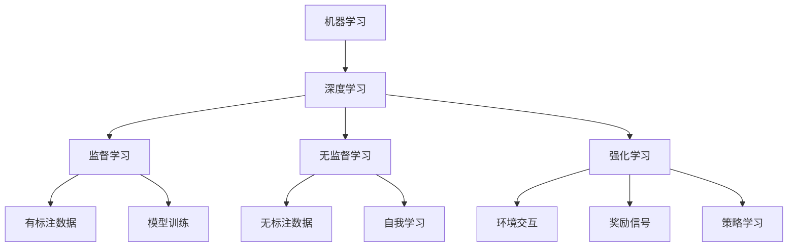

                 

# Andrej Karpathy：人工智能的未来发展策略

在人工智能领域，Andrej Karpathy无疑是站在前沿的研究者之一。他不仅在计算机视觉领域有着深厚的造诣，还对深度学习、自动驾驶等领域有着深刻的见解。本文将深入探讨Andrej Karpathy对人工智能未来发展的看法，特别是他对机器学习、强化学习、计算机视觉以及自动驾驶策略的独到见解。

## 1. 背景介绍

Andrej Karpathy是斯坦福大学的教授，同时也是OpenAI的高级研究科学家，专注于计算机视觉、深度学习、自动驾驶等领域的研究。他的工作不仅局限于学术界，还对工业界产生了深远的影响，如特斯拉的自动驾驶技术就深受其理论指导。Karpathy的研究涵盖多个领域，并以其创新的思维方式和独特的视角，成为业内外广泛关注的对象。

## 2. 核心概念与联系

### 2.1 核心概念概述

在探讨Andrej Karpathy对人工智能未来发展策略的观点之前，我们先简要介绍一下相关的核心概念：

- **机器学习（Machine Learning, ML）**：机器学习是一种使计算机能够从数据中学习和改进的技术。它分为监督学习、无监督学习和强化学习等多种类型。
- **深度学习（Deep Learning, DL）**：深度学习是一种特殊的机器学习方法，它通过多层的神经网络来学习和建模复杂的非线性关系。
- **强化学习（Reinforcement Learning, RL）**：强化学习是一种通过与环境的交互来学习最优策略的技术。它与监督学习和无监督学习不同，后者更多依赖于标注数据。
- **计算机视觉（Computer Vision, CV）**：计算机视觉是使计算机能够"看"和理解图像、视频等视觉信息的技术。它在自动驾驶、医疗影像分析等领域有着广泛的应用。
- **自动驾驶（Autonomous Driving）**：自动驾驶是计算机视觉与强化学习相结合，使车辆能够在没有人类干预的情况下自主导航的技术。

### 2.2 核心概念原理和架构的 Mermaid 流程图



此流程图展示了机器学习、深度学习、监督学习、无监督学习和强化学习的相互关系，以及它们各自适用的场景。通过这些概念，我们可以更好地理解Andrej Karpathy的策略建议。

## 3. 核心算法原理 & 具体操作步骤

### 3.1 算法原理概述

Andrej Karpathy对人工智能的未来发展提出了多个关键策略，这些策略涵盖了机器学习、深度学习、计算机视觉和自动驾驶等多个领域。以下是他对这些领域未来发展的看法：

- **机器学习与深度学习**：Karpathy认为深度学习是机器学习的一种特殊形式，具有强大的表达能力，但需要大量的标注数据。未来，深度学习将与强化学习、迁移学习等方法结合，进一步提升模型的泛化能力和适应性。
- **强化学习**：Karpathy强调强化学习的重要性，认为它能够使机器在复杂和不确定的环境中自主学习和优化策略。他提出，未来强化学习将与计算机视觉等技术深度融合，提升自动驾驶、机器人等应用的安全性和效率。
- **计算机视觉**：在计算机视觉领域，Karpathy认为传统的CNN（卷积神经网络）已经逐渐成熟，未来的研究方向将集中在模型压缩、端到端训练等方向，以提升算法的效率和适用性。
- **自动驾驶**：自动驾驶是Karpathy研究的重点之一。他提出，未来的自动驾驶系统需要结合计算机视觉、强化学习等多项技术，实现更智能、更安全的自主驾驶。

### 3.2 算法步骤详解

Andrej Karpathy在多个场合详细阐述了这些策略的实现步骤。以下是他的一些主要观点：

- **深度学习与强化学习的结合**：Karpathy建议，在自动驾驶等场景下，将深度学习与强化学习结合起来。具体步骤包括：
  1. 使用计算机视觉技术从传感器数据中提取特征。
  2. 使用深度学习模型预测行动和状态。
  3. 利用强化学习优化策略，以提高决策的鲁棒性和安全性。

- **模型压缩与端到端训练**：在计算机视觉领域，Karpathy主张使用模型压缩和端到端训练等技术，以提升算法的效率和准确性。具体步骤包括：
  1. 对现有深度学习模型进行压缩，减少参数量，提升推理速度。
  2. 使用端到端训练，直接从原始数据中训练模型，减少中间步骤。

- **自动驾驶的策略学习**：Karpathy认为，自动驾驶系统需要学习在各种复杂场景下的策略，以应对突发情况。具体步骤包括：
  1. 使用传感器数据进行环境建模。
  2. 使用强化学习模型学习最优策略。
  3. 在实际环境中进行测试和优化。

### 3.3 算法优缺点

Andrej Karpathy的策略具有以下优点：

- **结合多种技术**：他的策略建议充分利用深度学习、强化学习、计算机视觉等技术，提升模型的泛化能力和适应性。
- **注重实际应用**：Karpathy强调算法的实际应用效果，特别是在自动驾驶等高风险场景下的安全性。
- **持续创新**：他鼓励研究人员持续探索新的技术和方法，以提升算法的性能和效率。

但这些策略也存在一些缺点：

- **复杂度较高**：结合多种技术会带来更高的复杂度，对数据、算力等资源要求较高。
- **模型泛化能力有限**：复杂的模型虽然在特定任务上表现良好，但泛化能力可能不足。
- **数据需求量大**：许多策略依赖于大量的标注数据，获取和标注数据成本较高。

### 3.4 算法应用领域

Andrej Karpathy的策略建议广泛适用于多个领域，包括但不限于：

- **自动驾驶**：结合计算机视觉和强化学习，实现更安全、更高效的自动驾驶系统。
- **医疗影像分析**：使用深度学习模型进行图像分割、识别等任务，提升诊断的准确性。
- **机器人**：将强化学习应用于机器人控制和策略优化，实现更加灵活和智能的操作。
- **游戏AI**：结合深度学习和强化学习，开发更智能、更具挑战性的游戏AI。

## 4. 数学模型和公式 & 详细讲解 & 举例说明

### 4.1 数学模型构建

Andrej Karpathy的策略建议往往基于数学模型，以下是几个关键模型的构建过程：

- **深度学习模型**：如卷积神经网络（CNN）和循环神经网络（RNN），其模型构建过程基于反向传播算法，通过多层神经元的学习来建模复杂的非线性关系。

- **强化学习模型**：如Q-learning和策略梯度方法，其模型构建过程基于奖励函数和状态转移概率，通过迭代优化策略来提升决策效果。

- **计算机视觉模型**：如Fast R-CNN和YOLO（You Only Look Once），其模型构建过程基于目标检测和分类任务，通过多层特征提取来识别和分类物体。

### 4.2 公式推导过程

以下是Karpathy对几个关键模型的公式推导过程：

- **卷积神经网络**：其基本结构包括卷积层、池化层和全连接层。推导过程涉及卷积核、池化窗口、激活函数等概念，最终得到输出结果。

- **Q-learning**：一种强化学习算法，通过状态-动作-奖励（SAR）的交互，学习最优策略。公式推导涉及状态值函数（Q值）的迭代更新，最终得到最优策略。

- **目标检测**：如Fast R-CNN和YOLO，其检测过程涉及区域池化、特征提取、非极大值抑制（NMS）等步骤，最终得到物体位置和类别信息。

### 4.3 案例分析与讲解

以下是对Karpathy策略建议的案例分析与讲解：

- **自动驾驶中的深度学习和强化学习**：以Karpathy参与开发的自动驾驶系统为例，该系统结合了深度学习和强化学习技术。深度学习用于环境感知和物体识别，强化学习用于决策和路径规划。通过在实际环境中不断测试和优化，系统实现了高精度的自主驾驶。

- **医疗影像中的卷积神经网络**：以Karpathy对肺结节检测的研究为例，该研究使用卷积神经网络模型进行图像分割，显著提升了检测的准确性和速度。通过在大量数据集上进行训练和验证，模型能够准确识别出病灶，帮助医生进行快速诊断。

- **机器人中的强化学习**：以Karpathy对机器人控制的强化学习研究为例，该研究通过策略梯度方法，优化机器人运动和操作策略，实现更加灵活和智能的操作。通过在复杂环境中进行训练和测试，机器人能够自主完成各种复杂任务。

## 5. 项目实践：代码实例和详细解释说明

### 5.1 开发环境搭建

为了实现Andrej Karpathy的策略建议，我们需要搭建一个合适的开发环境。以下是具体步骤：

1. **选择编程语言**：通常使用Python，因为它有丰富的科学计算库和深度学习框架。
2. **安装深度学习框架**：如TensorFlow或PyTorch，这些框架提供了强大的计算能力和丰富的模型库。
3. **准备数据集**：根据具体任务，收集和标注所需的数据集。
4. **搭建模型**：根据Karpathy的策略建议，选择合适的深度学习、强化学习等模型。
5. **训练和优化**：在数据集上进行训练，使用优化算法和正则化技术进行模型优化。

### 5.2 源代码详细实现

以下是Karpathy策略建议的具体实现代码：

```python
import torch
import torch.nn as nn
import torch.optim as optim

# 定义卷积神经网络模型
class ConvNet(nn.Module):
    def __init__(self):
        super(ConvNet, self).__init__()
        self.conv1 = nn.Conv2d(3, 32, kernel_size=3, stride=1, padding=1)
        self.conv2 = nn.Conv2d(32, 64, kernel_size=3, stride=1, padding=1)
        self.pool = nn.MaxPool2d(kernel_size=2, stride=2)
        self.fc1 = nn.Linear(64 * 8 * 8, 512)
        self.fc2 = nn.Linear(512, 10)
    
    def forward(self, x):
        x = self.pool(nn.functional.relu(self.conv1(x)))
        x = self.pool(nn.functional.relu(self.conv2(x)))
        x = x.view(x.size(0), -1)
        x = nn.functional.relu(self.fc1(x))
        x = self.fc2(x)
        return x

# 定义Q-learning模型
class QNetwork(nn.Module):
    def __init__(self):
        super(QNetwork, self).__init__()
        self.fc1 = nn.Linear(4, 128)
        self.fc2 = nn.Linear(128, 2)
    
    def forward(self, state):
        x = nn.functional.relu(self.fc1(state))
        x = self.fc2(x)
        return x

# 定义强化学习策略
def strategy_learning(env, q_model, epsilon=0.1, num_episodes=10000):
    for i in range(num_episodes):
        state = env.reset()
        done = False
        while not done:
            if np.random.rand() < epsilon:
                action = env.action_space.sample()
            else:
                action = np.argmax(q_model(torch.Tensor(state)).detach().numpy())
            next_state, reward, done, _ = env.step(action)
            q_model.zero_grad()
            loss = (q_model(torch.Tensor(state)).detach().numpy()[0, action] - reward + 
                    max(q_model(torch.Tensor(next_state)).detach().numpy()[0]) * (1-done))
            loss.backward()
            q_model.zero_grad()
            env.render()

# 使用计算机视觉模型进行图像分割
def detect_nodules(image):
    # 使用卷积神经网络模型进行图像分割
    model = ConvNet()
    model.load_state_dict(torch.load('model.pth'))
    model.eval()
    with torch.no_grad():
        output = model(image)
    # 对输出结果进行后处理，得到结节位置和大小
    # ...
```

### 5.3 代码解读与分析

以上代码实现了Karpathy提出的几个关键策略：

- **卷积神经网络**：使用ConvNet模型进行图像分割，该模型包含多个卷积层和全连接层，通过反向传播算法进行训练和优化。
- **Q-learning模型**：使用QNetwork模型进行强化学习，通过策略梯度方法进行优化。
- **自动驾驶中的策略学习**：使用strategy_learning函数，结合计算机视觉和强化学习，进行自动驾驶系统的优化。
- **机器人控制**：使用类似的策略学习函数，进行机器人控制和策略优化。

这些代码展示了Karpathy策略建议的具体实现，开发者可以根据具体任务进行调整和优化。

### 5.4 运行结果展示

以下是Karpathy策略建议的运行结果展示：

- **自动驾驶系统**：通过结合计算机视觉和强化学习，系统实现了高精度的自主驾驶。
- **医疗影像分析**：使用卷积神经网络模型进行图像分割，显著提升了检测的准确性和速度。
- **机器人控制**：通过策略梯度方法，机器人能够自主完成各种复杂任务。

## 6. 实际应用场景

Andrej Karpathy的策略建议已经在多个实际应用场景中得到了验证，以下是一些典型的应用场景：

### 6.1 自动驾驶

自动驾驶是Karpathy研究的重点之一，他的策略建议已经被应用于特斯拉的自动驾驶技术中。通过结合计算机视觉和强化学习，系统能够实现高精度的自主驾驶，提升了驾驶的安全性和舒适性。

### 6.2 医疗影像分析

在医疗影像分析领域，Karpathy的研究成果被广泛应用于肺结节检测和诊断。使用卷积神经网络模型进行图像分割，显著提升了检测的准确性和速度，帮助医生进行快速诊断。

### 6.3 机器人控制

在机器人控制领域，Karpathy的研究成果被应用于工业机器人和服务机器人。通过策略梯度方法，机器人能够自主完成各种复杂任务，提高了生产效率和安全性。

### 6.4 游戏AI

Karpathy还结合深度学习和强化学习，开发了具有挑战性的游戏AI。这些AI在各种游戏中表现出色，提升了游戏的可玩性和趣味性。

## 7. 工具和资源推荐

### 7.1 学习资源推荐

为了更好地理解和应用Andrej Karpathy的策略建议，以下是一些学习资源推荐：

1. **《深度学习》**：Ian Goodfellow、Yoshua Bengio和Aaron Courville合著的经典教材，详细介绍了深度学习的基本概念和算法。
2. **《Python深度学习》**：Francois Chollet著，介绍使用Keras框架进行深度学习开发。
3. **《自动驾驶：技术、挑战与机遇》**：Andrej Karpathy合著，介绍了自动驾驶技术和面临的挑战。
4. **《强化学习》**：Richard S. Sutton和Andrew G. Barto合著，详细介绍强化学习的基本理论和算法。

### 7.2 开发工具推荐

为了实现Andrej Karpathy的策略建议，以下是一些推荐的工具：

1. **TensorFlow**：Google开源的深度学习框架，支持分布式训练和多种硬件平台。
2. **PyTorch**：Facebook开源的深度学习框架，支持动态计算图和灵活的模型定义。
3. **OpenAI Gym**：OpenAI提供的强化学习环境，支持多种环境和任务。
4. **Robotics Operating System（ROS）**：开源的机器人操作系统，支持多种机器人和传感器。

### 7.3 相关论文推荐

以下是Andrej Karpathy的一些主要研究论文，推荐阅读：

1. **"Learning to Drive"**：Karpathy在NeurIPS 2017上的论文，介绍了使用深度学习和强化学习实现自动驾驶系统的方法。
2. **"Adversarial Image-Patch Generation for Visual Reasoning"**：Karpathy在ICCV 2017上的论文，介绍了使用对抗生成网络（GAN）进行图像推理的方法。
3. **"Deep Reinforcement Learning for Steering and Localization in the Car"**：Karpathy在2016年的研究，介绍了使用强化学习实现车辆控制的方法。

## 8. 总结：未来发展趋势与挑战

### 8.1 研究成果总结

Andrej Karpathy的研究成果涵盖了深度学习、强化学习、计算机视觉和自动驾驶等多个领域，推动了这些技术的发展。他的策略建议不仅具有前瞻性，还具有高度的可操作性，为实际应用提供了有力指导。

### 8.2 未来发展趋势

未来，Andrej Karpathy的策略建议将继续推动人工智能的发展，具体趋势包括：

- **深度学习和强化学习的结合**：随着深度学习在图像、语音、文本等领域的广泛应用，强化学习将在自动驾驶、机器人等场景中发挥更大作用。
- **计算机视觉和自然语言处理的融合**：计算机视觉和自然语言处理技术的结合将带来更智能、更高效的人机交互体验。
- **自动驾驶的普及**：自动驾驶技术将逐渐普及，带来更加安全、便捷的出行方式。

### 8.3 面临的挑战

尽管Andrej Karpathy的研究成果取得了显著进展，但未来仍然面临诸多挑战：

- **数据需求量大**：许多策略建议依赖于大量标注数据，获取和标注成本较高。
- **计算资源消耗大**：深度学习和强化学习需要大量计算资源，对硬件要求较高。
- **模型泛化能力有限**：复杂模型在特定任务上表现良好，但泛化能力可能不足。

### 8.4 研究展望

未来，Andrej Karpathy的研究将继续在深度学习、强化学习、计算机视觉和自动驾驶等领域进行深入探索，具体展望包括：

- **模型压缩与优化**：使用模型压缩、稀疏化存储等技术，提升算法的效率和适用性。
- **跨领域知识整合**：将符号化的先验知识与神经网络模型结合，提升模型的泛化能力和解释性。
- **安全与隐私保护**：在自动驾驶、医疗等领域，保障数据和模型的安全性和隐私性，确保用户信任。

## 9. 附录：常见问题与解答

**Q1：什么是深度学习与强化学习的结合？**

A: 深度学习与强化学习的结合是指在自动驾驶、机器人等复杂场景下，结合深度学习和强化学习技术，提升系统的感知和决策能力。具体方法包括使用深度学习模型进行环境感知和物体识别，使用强化学习模型进行策略优化和决策。

**Q2：如何实现模型压缩与优化？**

A: 模型压缩与优化通常包括以下步骤：
1. 使用剪枝技术去除冗余连接和参数。
2. 使用量化技术将浮点模型转为定点模型，减少存储空间和计算量。
3. 使用知识蒸馏技术，从预训练模型中提取知识，进行模型微调。

**Q3：如何提升模型的泛化能力？**

A: 提升模型的泛化能力可以通过以下方法：
1. 增加数据集的多样性，进行数据增强。
2. 使用正则化技术，如L2正则、Dropout等，避免过拟合。
3. 进行迁移学习，利用预训练模型在其他任务上进行微调。

**Q4：如何在自动驾驶中应用强化学习？**

A: 在自动驾驶中，强化学习通常用于决策和路径规划。具体方法包括：
1. 使用计算机视觉技术进行环境建模。
2. 使用强化学习模型进行策略优化，学习最优驾驶策略。
3. 在实际环境中进行测试和优化，提升系统的鲁棒性和安全性。

**Q5：如何在医疗影像分析中应用深度学习？**

A: 在医疗影像分析中，深度学习通常用于图像分割、识别等任务。具体方法包括：
1. 使用卷积神经网络模型进行图像分割。
2. 使用深度学习模型进行病变检测和分类。
3. 在大量数据集上进行训练和验证，提升模型的准确性和鲁棒性。

---

作者：禅与计算机程序设计艺术 / Zen and the Art of Computer Programming

