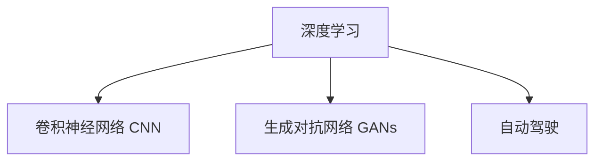

                 

# Andrej Karpathy：人工智能的未来发展规划

Andrej Karpathy，斯坦福大学教授、深度学习领域的前沿专家，以其开创性的工作对计算机视觉和自动驾驶领域产生了深远影响。作为图灵奖获得者，他的研究方法和理念一直引领着人工智能的发展方向。本文将探讨Andrej Karpathy对未来人工智能发展规划的见解，分析其核心思想和方法，并展望未来可能的突破与挑战。

## 1. 背景介绍

Andrej Karpathy于2014年加入斯坦福大学，担任计算机科学系副教授。他的研究涉及计算机视觉、深度学习、自动驾驶等多个领域，对人工智能的发展产生了重要影响。Karpathy提出的卷积神经网络(CNN)和图像生成对抗网络(Generative Adversarial Networks, GANs)等技术，已经成为人工智能领域的基本工具。此外，他还在自动驾驶领域做出了开创性工作，研发出深度神经网络驱动的自动驾驶系统。

## 2. 核心概念与联系

### 2.1 核心概念概述

Andrej Karpathy的研究集中在以下几个核心概念：

- **深度学习**：通过多层神经网络进行特征提取和任务学习，实现高效的数据建模和分析。
- **卷积神经网络(CNN)**：一种专门用于图像处理的神经网络，通过卷积操作捕捉图像中的空间结构。
- **生成对抗网络(GANs)**：由生成器和判别器组成，通过对抗训练生成高质量的合成数据。
- **自动驾驶**：结合计算机视觉、深度学习和强化学习技术，实现车辆自主导航和安全驾驶。

这些概念间相互关联，共同构成了Karpathy的深度学习与自动驾驶研究框架。

### 2.2 核心概念原理和架构的 Mermaid 流程图



在Karpathy的构想中，深度学习是计算机视觉和自动驾驶等应用的基础技术，而卷积神经网络则在此基础上，专门针对图像数据进行了优化。生成对抗网络则拓展了深度学习的应用范围，通过生成合成数据，为模型训练和数据增强提供了新的思路。自动驾驶作为深度学习的应用场景之一，展示了其在现实世界中的重要性和潜力。

## 3. 核心算法原理 & 具体操作步骤

### 3.1 算法原理概述

Andrej Karpathy的研究中，深度学习和生成对抗网络是其两大核心算法。深度学习通过多层神经网络提取数据特征，实现对复杂任务的建模；生成对抗网络则通过对抗训练生成高质量的合成数据，增强模型的泛化能力。

**深度学习**：
- **神经网络结构**：包括卷积层、池化层、全连接层等。卷积层用于提取图像的空间结构，池化层用于降维和减少计算量，全连接层用于分类或回归。
- **反向传播算法**：通过链式法则计算梯度，更新神经网络权重，最小化损失函数。
- **数据增强**：通过旋转、裁剪、翻转等方式扩充训练集，避免过拟合。

**生成对抗网络(GANs)**：
- **生成器**：通过反向传播算法学习生成假数据，使其与真实数据相似。
- **判别器**：学习区分生成数据和真实数据。
- **对抗训练**：生成器和判别器交替更新，通过不断对抗提升生成数据的质量。

### 3.2 算法步骤详解

以下是Karpathy使用深度学习和GANs的主要操作步骤：

**深度学习操作步骤**：
1. **数据准备**：收集和预处理数据集，确保数据的多样性和代表性。
2. **模型构建**：设计神经网络结构，选择合适的激活函数和损失函数。
3. **模型训练**：使用反向传播算法更新模型参数，最小化损失函数。
4. **模型评估**：在验证集和测试集上评估模型性能，调整超参数以优化模型。
5. **数据增强**：对训练集进行数据增强，如旋转、翻转、裁剪等，提高模型泛化能力。

**GANs操作步骤**：
1. **网络设计**：设计生成器和判别器的网络结构，确保其具有足够的表达能力和计算能力。
2. **模型训练**：通过对抗训练更新生成器和判别器的参数，提升生成数据的质量。
3. **生成器优化**：调整生成器的损失函数，使其生成更接近真实数据的假数据。
4. **判别器优化**：调整判别器的损失函数，使其更好地区分真实数据和假数据。
5. **质量控制**：通过保存生成数据和评估指标（如Inception Score）评估生成数据的质量，迭代优化生成器。

### 3.3 算法优缺点

**深度学习的优点**：
- **自适应能力**：能够自动学习数据特征，适应复杂数据分布。
- **泛化能力**：在大规模数据集上训练后，能够较好地泛化到新数据上。
- **端到端建模**：能够直接从输入数据到输出结果进行建模，减少了中间步骤。

**深度学习的缺点**：
- **过拟合风险**：数据量不足或噪声数据可能导致模型过拟合。
- **计算成本高**：大规模神经网络的训练和推理计算成本较高。
- **黑盒模型**：模型的决策过程不透明，难以解释。

**GANs的优点**：
- **数据生成能力**：能够生成高质量的合成数据，用于数据增强和训练。
- **多模态数据处理**：适用于图像、文本等多种模态的数据生成和分析。
- **创造力**：生成对抗网络具有较强的创造力，能够生成全新的数据样本。

**GANs的缺点**：
- **模式崩溃**：生成器在训练过程中可能陷入局部最优，生成低质量数据。
- **不稳定训练**：生成器和判别器之间容易出现不稳定收敛，需要精心调整参数。
- **计算复杂**：训练GANs需要大量的计算资源和时间。

### 3.4 算法应用领域

Karpathy的深度学习和GANs技术在多个领域得到了广泛应用，以下是其主要应用领域：

1. **计算机视觉**：用于图像分类、目标检测、图像生成等任务。
2. **自动驾驶**：用于车辆视觉感知、路径规划、决策制定等。
3. **医疗影像分析**：用于医学图像分析、疾病诊断、手术辅助等。
4. **语音识别**：用于语音转文本、语音合成等。
5. **游戏设计**：用于自动游戏生成、智能对战等。
6. **自然语言处理**：用于文本生成、情感分析、对话系统等。

## 4. 数学模型和公式 & 详细讲解 & 举例说明

### 4.1 数学模型构建

以下是Andrej Karpathy在深度学习与GANs中的主要数学模型：

**深度学习模型**：
- **前向传播**：输入数据通过神经网络逐层传递，得到输出结果。
- **损失函数**：如交叉熵损失、均方误差损失等，用于衡量模型预测与真实值之间的差异。
- **反向传播**：通过链式法则计算梯度，更新模型参数。

**GANs模型**：
- **生成器**：输入随机噪声，输出生成数据。
- **判别器**：输入数据，输出是否为真实数据的概率。
- **对抗损失函数**：用于衡量生成器和判别器之间的对抗效果。

### 4.2 公式推导过程

以下是深度学习和GANs中常用的数学公式：

**深度学习**：
- 前向传播：$y = f(Wx + b)$
- 损失函数：$\mathcal{L} = -\frac{1}{n}\sum_{i=1}^{n}(y_i - \hat{y}_i)^2$
- 反向传播：$\frac{\partial \mathcal{L}}{\partial W} = \frac{\partial \mathcal{L}}{\partial y} \frac{\partial y}{\partial z} \frac{\partial z}{\partial W}$

**GANs**：
- 生成器损失：$L_G = -\mathbb{E}_{x \sim p_{data}} \log D(G(z)) + \mathbb{E}_{z \sim p(z)} \log (1 - D(G(z)))$
- 判别器损失：$L_D = \mathbb{E}_{x \sim p_{data}} \log D(x) + \mathbb{E}_{z \sim p(z)} \log (1 - D(G(z)))$

其中，$W$、$b$、$x$、$y$分别为神经网络权重、偏置、输入和输出，$p_{data}$为真实数据分布，$p(z)$为随机噪声分布，$D$为判别器，$G$为生成器。

### 4.3 案例分析与讲解

以计算机视觉中的图像分类任务为例，Karpathy使用卷积神经网络进行模型训练。其数学模型为：

- 输入：图像$x$
- 卷积层：提取图像特征
- 池化层：降维和减少计算量
- 全连接层：输出分类结果

模型训练时，通过反向传播算法更新权重，最小化交叉熵损失函数。具体步骤如下：
1. 数据预处理：对图像进行归一化、标准化等操作。
2. 网络设计：设计卷积神经网络结构，选择合适的网络层数和激活函数。
3. 模型训练：通过反向传播算法更新模型参数，最小化损失函数。
4. 模型评估：在验证集和测试集上评估模型性能，调整超参数以优化模型。

## 5. 项目实践：代码实例和详细解释说明

### 5.1 开发环境搭建

为了实现深度学习和GANs的模型训练，Karpathy推荐使用PyTorch和TensorFlow等深度学习框架。以下是搭建开发环境的步骤：

1. **安装PyTorch**：
```bash
pip install torch torchvision torchaudio
```

2. **安装TensorFlow**：
```bash
pip install tensorflow
```

3. **安装TensorBoard**：
```bash
pip install tensorboard
```

4. **安装DataLoader**：
```bash
pip install torch.utils.data
```

### 5.2 源代码详细实现

以下是使用PyTorch实现卷积神经网络图像分类任务的示例代码：

```python
import torch
import torch.nn as nn
import torchvision.transforms as transforms
from torch.utils.data import DataLoader
from torchvision.datasets import CIFAR10
from torchvision.models import resnet18
from torch.optim import SGD

# 定义模型
model = resnet18()

# 定义损失函数和优化器
criterion = nn.CrossEntropyLoss()
optimizer = SGD(model.parameters(), lr=0.001, momentum=0.9)

# 定义数据预处理
transform = transforms.Compose([
    transforms.Resize(256),
    transforms.CenterCrop(224),
    transforms.ToTensor(),
    transforms.Normalize(mean=[0.485, 0.456, 0.406], std=[0.229, 0.224, 0.225])
])

# 加载数据集
trainset = CIFAR10(root='./data', train=True, download=True, transform=transform)
trainloader = DataLoader(trainset, batch_size=32, shuffle=True)

# 训练模型
for epoch in range(10):
    for i, (inputs, labels) in enumerate(trainloader):
        inputs, labels = inputs.to(device), labels.to(device)
        optimizer.zero_grad()
        outputs = model(inputs)
        loss = criterion(outputs, labels)
        loss.backward()
        optimizer.step()
```

### 5.3 代码解读与分析

代码中，我们使用PyTorch实现了卷积神经网络模型，并使用CIFAR-10数据集进行训练。具体步骤如下：

1. **模型定义**：使用resnet18预训练模型作为基础，并进行微调。
2. **损失函数和优化器**：使用交叉熵损失函数和SGD优化器进行模型训练。
3. **数据预处理**：对图像进行归一化、标准化、缩放等预处理。
4. **数据加载**：使用DataLoader加载数据集，并进行批处理和随机打乱。
5. **模型训练**：对模型进行前向传播、反向传播和参数更新，最小化损失函数。

## 6. 实际应用场景

### 6.1 自动驾驶

Karpathy在自动驾驶领域的研究，主要集中在深度学习在车辆感知和路径规划中的应用。其核心思想是通过卷积神经网络提取图像特征，通过生成对抗网络生成合成数据，提高模型的泛化能力和鲁棒性。

**深度学习在感知中的应用**：
- 使用卷积神经网络提取车辆周围环境的图像特征。
- 使用池化层降低特征图尺寸，减少计算量。
- 使用全连接层输出车辆周围物体的类别和位置信息。

**GANs在数据增强中的应用**：
- 使用生成对抗网络生成合成数据，用于数据增强和模型训练。
- 通过对抗训练生成高质量的合成数据，避免过拟合。

### 6.2 医学影像分析

Karpathy使用深度学习和GANs技术，在医学影像分析领域进行了多项研究。其核心思想是通过卷积神经网络提取图像特征，通过生成对抗网络生成合成数据，提高模型的泛化能力和鲁棒性。

**深度学习在医学影像分析中的应用**：
- 使用卷积神经网络提取医学影像的特征。
- 使用池化层降低特征图尺寸，减少计算量。
- 使用全连接层输出影像中的疾病部位和症状。

**GANs在医学影像生成中的应用**：
- 使用生成对抗网络生成合成医学影像，用于数据增强和模型训练。
- 通过对抗训练生成高质量的合成医学影像，避免过拟合。

### 6.3 自然语言处理

Karpathy在自然语言处理领域的研究，主要集中在深度学习在语言生成和情感分析中的应用。其核心思想是通过卷积神经网络提取文本特征，通过生成对抗网络生成合成文本，提高模型的泛化能力和鲁棒性。

**深度学习在语言生成中的应用**：
- 使用卷积神经网络提取文本的特征。
- 使用池化层降低特征图尺寸，减少计算量。
- 使用全连接层输出文本的生成结果。

**GANs在语言生成中的应用**：
- 使用生成对抗网络生成合成文本，用于数据增强和模型训练。
- 通过对抗训练生成高质量的合成文本，避免过拟合。

## 7. 工具和资源推荐

### 7.1 学习资源推荐

为了帮助开发者系统掌握深度学习和GANs技术，这里推荐一些优质的学习资源：

1. **深度学习基础课程**：斯坦福大学开设的CS231n课程，涵盖深度学习基础、计算机视觉等。
2. **PyTorch官方文档**：PyTorch官方文档，提供丰富的示例代码和教程。
3. **TensorFlow官方文档**：TensorFlow官方文档，涵盖深度学习框架的各个方面。
4. **TensorBoard使用教程**：TensorBoard官方文档，提供详细的可视化工具使用教程。

### 7.2 开发工具推荐

为了实现深度学习和GANs的模型训练和推理，以下是几款推荐的开发工具：

1. **PyTorch**：基于Python的深度学习框架，支持动态图和静态图，易于调试和优化。
2. **TensorFlow**：由Google主导开发的深度学习框架，支持分布式计算和高效推理。
3. **Jupyter Notebook**：交互式编程环境，支持多种编程语言和数据可视化。

### 7.3 相关论文推荐

以下是几篇深度学习和GANs领域的经典论文，推荐阅读：

1. **ImageNet Classification with Deep Convolutional Neural Networks**：Karpathy等人，提出卷积神经网络用于图像分类。
2. **Generative Adversarial Nets**：Goodfellow等人，提出生成对抗网络用于数据生成和图像生成。
3. **Auto-Driving with a Convolutional Recurrent Network**：Karpathy等人，提出卷积循环神经网络用于自动驾驶。
4. **Learning Deep Architectures for AI**：Hinton等人，提出深度学习框架用于AI领域的研究。

## 8. 总结：未来发展趋势与挑战

### 8.1 研究成果总结

Andrej Karpathy的研究不仅推动了深度学习和GANs技术的发展，还为自动驾驶、医学影像分析等领域带来了新的突破。他的研究成果和技术方法，已经成为人工智能领域的重要基石。

### 8.2 未来发展趋势

未来，深度学习和GANs技术将朝着以下几个方向发展：

1. **大规模模型**：随着计算资源和数据量的提升，未来深度学习模型将更加庞大，具备更强的表达能力和泛化能力。
2. **自适应学习**：深度学习模型将具备更强的自适应能力，能够根据任务需求自动调整模型结构和参数。
3. **跨模态学习**：深度学习模型将能够处理多模态数据，实现视觉、听觉、语言等多种数据类型的协同处理。
4. **迁移学习**：深度学习模型将在不同领域和任务之间进行迁移，提升模型的泛化能力和迁移能力。

### 8.3 面临的挑战

尽管深度学习和GANs技术已经取得了重要进展，但在未来发展过程中，仍面临诸多挑战：

1. **数据需求高**：大规模深度学习模型需要大量高质量的数据进行训练，数据的获取和标注成本较高。
2. **计算资源消耗大**：深度学习模型的训练和推理需要大量计算资源和时间，如何提高模型效率和计算性能是未来的重要课题。
3. **模型可解释性差**：深度学习模型通常被视为"黑盒"系统，难以解释其内部工作机制和决策过程。
4. **伦理和安全问题**：深度学习模型可能存在偏见和歧视，需要考虑伦理和安全问题，确保模型的公平性和透明性。

### 8.4 研究展望

未来，深度学习和GANs技术的研究方向将集中在以下几个方面：

1. **模型压缩和优化**：通过模型压缩和优化技术，提高深度学习模型的计算效率和推理速度。
2. **跨模态协同学习**：实现视觉、语言、听觉等多种模态数据的协同处理和联合建模。
3. **自适应学习算法**：研究能够自适应学习任务和数据变化，提升深度学习模型的泛化能力和迁移能力。
4. **可解释性和透明性**：研究如何提高深度学习模型的可解释性和透明性，确保其决策过程的公平性和透明性。
5. **伦理和安全研究**：研究深度学习模型的伦理和安全问题，确保其公平性、透明性和安全性。

## 9. 附录：常见问题与解答

**Q1：深度学习模型容易出现过拟合，如何解决？**

A: 深度学习模型容易出现过拟合问题，解决方法包括：
- **数据增强**：通过旋转、裁剪、翻转等方式扩充训练集，提高模型泛化能力。
- **正则化技术**：使用L2正则化、Dropout等技术，避免模型过拟合。
- **早停策略**：在验证集上监控模型性能，一旦性能不再提升，即停止训练。
- **模型简化**：通过剪枝、权重共享等方法，简化模型结构，提高泛化能力。

**Q2：GANs模型容易出现模式崩溃，如何解决？**

A: GANs模型容易出现模式崩溃问题，解决方法包括：
- **对抗训练**：通过对抗训练，提升生成器和判别器的对抗能力。
- **生成器优化**：调整生成器的损失函数，使其生成高质量的合成数据。
- **判别器优化**：调整判别器的损失函数，使其更好地区分真实数据和假数据。
- **网络设计**：改进生成器和判别器的网络结构，提高其表达能力和稳定性。

**Q3：深度学习模型如何实现迁移学习？**

A: 深度学习模型可以通过迁移学习提升在不同任务上的性能，解决方法包括：
- **预训练模型**：使用大规模无标签数据进行预训练，学习通用的语言表示。
- **微调技术**：在预训练模型的基础上，使用少量标注数据进行微调，优化模型在特定任务上的性能。
- **迁移学习框架**：使用迁移学习框架，如PyTorch、TensorFlow等，实现模型迁移和微调。

**Q4：如何提高深度学习模型的可解释性？**

A: 深度学习模型的可解释性可以通过以下方法提升：
- **可视化工具**：使用可视化工具，如TensorBoard、Visdom等，展示模型训练过程中的关键参数和结果。
- **特征提取**：使用特征提取技术，如t-SNE、PCA等，将高维特征映射到低维空间，便于解释。
- **可解释性模型**：使用可解释性模型，如LIME、SHAP等，解释模型决策过程。
- **知识图谱**：将深度学习模型与知识图谱等符号知识结合，提升模型的可解释性。

通过以上方法的结合使用，可以逐步提升深度学习模型的可解释性和透明性，使其更好地服务于实际应用。

---

作者：禅与计算机程序设计艺术 / Zen and the Art of Computer Programming

