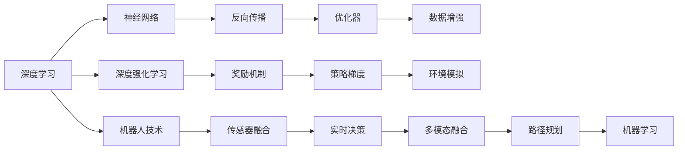

                 

# Andrej Karpathy：人工智能的未来发展规划

> 关键词：人工智能(AI)、深度学习、深度强化学习、机器人技术、未来预测、可持续发展

## 1. 背景介绍

### 1.1 问题由来

Andrej Karpathy，作为深度学习领域的顶尖专家，多次在顶级AI会议如NeurIPS、ICML上发表重要论文，并在Stanford University中执教，并在自动驾驶初创公司Otto担任CTO。他在AI技术的应用领域，包括计算机视觉、深度学习、机器人技术等方面，都有着卓越的贡献。

在这篇文章中，我们将全面解读Andrej Karpathy对于未来人工智能发展方向的看法，涵盖深度学习、深度强化学习、机器人技术等多个方面。通过他的视角，我们能够更好地理解AI技术的未来发展趋势，以及如何应对当前和未来的挑战。

### 1.2 问题核心关键点

Andrej Karpathy在多个演讲和论文中多次提到人工智能的未来发展规划。他认为，AI的发展需要充分考虑伦理、公平性、安全性和可持续性。他指出，当前AI技术的迅猛发展，已经在许多领域产生了深远的影响，但也带来了一些挑战，如偏见和歧视问题、数据隐私保护、以及技术对社会的影响等。

为了更好地把握Andrej Karpathy的AI未来发展规划，我们将从多个角度进行深入探讨，包括深度学习技术的发展、深度强化学习的应用、机器人技术的前景、以及对未来的预测和可持续发展战略。

## 2. 核心概念与联系

### 2.1 核心概念概述

- **深度学习**：一种通过神经网络模型进行复杂数据处理的机器学习方法。
- **深度强化学习**：一种通过奖励信号来训练智能体，使其在复杂环境中做出最优决策的学习方法。
- **机器人技术**：结合机械工程、电子工程和计算机科学的跨学科技术，旨在实现自主移动和智能交互。
- **伦理、公平性、安全性、可持续性**：AI发展需要考虑的关键社会因素，包括避免偏见和歧视、保护数据隐私、确保技术的安全性，以及实现技术的可持续发展。

### 2.2 核心概念原理和架构的 Mermaid 流程图(Mermaid 流程节点中不要有括号、逗号等特殊字符)



这个流程图展示了深度学习、深度强化学习、机器人技术三者之间的联系和架构。深度学习通过神经网络模型处理数据，反向传播和优化器用于模型训练，数据增强提高模型泛化能力。深度强化学习通过奖励机制和策略梯度优化智能体的决策，环境模拟和传感器融合提高智能体在复杂环境中的适应性。机器人技术结合多模态融合和路径规划，实现自主移动和智能交互。

## 3. 核心算法原理 & 具体操作步骤

### 3.1 算法原理概述

Andrej Karpathy在其多篇论文和演讲中指出，深度学习和深度强化学习是当前AI发展的主要驱动力。

- **深度学习**：通过多层神经网络模型，自动学习数据的表示和特征，从而在图像识别、自然语言处理等领域取得显著进展。
- **深度强化学习**：通过智能体与环境的交互，自动学习最优决策策略，应用于游戏AI、机器人控制等领域。

### 3.2 算法步骤详解

以下是深度学习和深度强化学习的基本步骤：

#### 3.2.1 深度学习步骤

1. **数据准备**：收集和标注大量数据，作为模型的输入和输出。
2. **模型设计**：选择合适的神经网络架构，如卷积神经网络(CNN)、递归神经网络(RNN)等。
3. **模型训练**：通过反向传播和优化器，最小化模型预测与实际结果的误差。
4. **模型评估**：在测试集上评估模型性能，如准确率、召回率等指标。
5. **模型优化**：根据评估结果，调整模型参数和训练策略，以提升性能。

#### 3.2.2 深度强化学习步骤

1. **环境定义**：定义智能体需要交互的环境，如游戏场景、机器人操作环境等。
2. **智能体设计**：设计智能体的决策策略，如Q网络、策略网络等。
3. **奖励机制设计**：定义奖励函数，指导智能体学习最优决策。
4. **训练与评估**：通过智能体与环境的交互，优化决策策略，并在测试环境中评估性能。
5. **模型部署**：将训练好的模型部署到实际应用场景中，如游戏AI、机器人控制等。

### 3.3 算法优缺点

#### 3.3.1 深度学习的优点

1. **高效处理复杂数据**：神经网络能够自动学习数据的表示和特征，处理非结构化数据如图像、文本等。
2. **泛化能力强**：经过大量数据训练，模型能够在新数据上表现良好。
3. **应用广泛**：广泛应用于图像识别、自然语言处理、语音识别等领域。

#### 3.3.2 深度学习的缺点

1. **数据依赖性强**：需要大量标注数据，数据质量和标注成本高。
2. **模型复杂度大**：深度网络层数多，训练和推理速度慢。
3. **模型可解释性差**：神经网络通常是"黑盒"模型，难以解释内部决策过程。

#### 3.3.3 深度强化学习的优点

1. **自主决策能力**：智能体能够通过与环境的交互，自动学习最优决策策略。
2. **适应性强**：能够处理动态和不确定环境。
3. **应用广泛**：广泛应用于游戏AI、机器人控制、自动驾驶等领域。

#### 3.3.4 深度强化学习的缺点

1. **训练复杂度高**：环境复杂，智能体需要长时间训练才能收敛。
2. **稳定性问题**：训练过程中容易发生震荡，导致性能不稳定。
3. **数据需求大**：需要大量训练数据和计算资源。

### 3.4 算法应用领域

#### 3.4.1 深度学习应用

- **计算机视觉**：图像识别、物体检测、人脸识别等。
- **自然语言处理**：机器翻译、情感分析、文本生成等。
- **语音识别**：语音转文本、语音合成等。

#### 3.4.2 深度强化学习应用

- **游戏AI**：如AlphaGo、Dota2等。
- **机器人控制**：如自动驾驶、工业机器人等。
- **金融交易**：量化交易、投资组合优化等。

## 4. 数学模型和公式 & 详细讲解 & 举例说明

### 4.1 数学模型构建

#### 4.1.1 深度学习模型

- **卷积神经网络(CNN)**：$$
  \text{CNN} = \text{Convolutional Layer} + \text{Pooling Layer} + \text{Fully Connected Layer}
  $$

- **递归神经网络(RNN)**：$$
  \text{RNN} = \text{LSTM}(\text{Long Short-Term Memory}) + \text{Dropout}
  $$

#### 4.1.2 深度强化学习模型

- **Q网络**：$$
  Q(\text{state},\text{action}) = \text{Fully Connected Layer}(\text{state})
  $$

- **策略网络**：$$
  \pi(\text{state}) = \text{Softmax}(\text{Fully Connected Layer}(\text{state}))
  $$

### 4.2 公式推导过程

#### 4.2.1 深度学习推导

- **反向传播公式**：$$
  \frac{\partial \text{Loss}}{\partial \text{Parameter}} = \frac{\partial \text{Loss}}{\partial \text{Output}} \times \frac{\partial \text{Output}}{\partial \text{Hidden Layer Output}} \times \frac{\partial \text{Hidden Layer Output}}{\partial \text{Parameter}}
  $$

#### 4.2.2 深度强化学习推导

- **策略梯度公式**：$$
  \nabla_{\theta}J(\theta) = \mathbb{E}_{\tau}\left[\sum_{t=0}^{T}\frac{\partial \log \pi(a_t|s_t;\theta)}{\partial \theta} Q(s_t,a_t)\right]
  $$

### 4.3 案例分析与讲解

#### 4.3.1 图像分类任务

- **数据准备**：收集大量标注图像数据。
- **模型设计**：选择CNN模型，设计多个卷积层和全连接层。
- **训练与评估**：通过反向传播和优化器最小化损失函数，在测试集上评估准确率。

#### 4.3.2 自动驾驶任务

- **环境定义**：定义游戏场景，如高速公路、交叉口等。
- **智能体设计**：设计Q网络，选择奖励函数。
- **训练与评估**：通过智能体与环境的交互，优化决策策略，在测试环境中评估性能。

## 5. 项目实践：代码实例和详细解释说明

### 5.1 开发环境搭建

#### 5.1.1 Python环境

- **安装Anaconda**：从官网下载并安装Anaconda，创建独立的Python环境。
- **创建虚拟环境**：
  ```bash
  conda create -n pytorch-env python=3.8
  conda activate pytorch-env
  ```

- **安装必要的库**：
  ```bash
  pip install torch torchvision torchaudio
  pip install numpy pandas scikit-learn matplotlib
  ```

#### 5.1.2 GPU环境

- **安装CUDA**：从官网下载CUDA工具包，并配置环境变量。
- **安装cuDNN**：从官网下载cuDNN库，并配置环境变量。
- **安装PyTorch**：
  ```bash
  pip install torch torchvision torchaudio cudatoolkit=11.1 -c pytorch -c conda-forge
  ```

#### 5.1.3 部署环境

- **安装TensorBoard**：用于可视化模型训练过程和结果。
- **安装Weights & Biases**：用于记录和分析模型训练日志。

### 5.2 源代码详细实现

#### 5.2.1 深度学习模型

```python
import torch
import torch.nn as nn
import torch.optim as optim

# 定义CNN模型
class CNN(nn.Module):
    def __init__(self):
        super(CNN, self).__init__()
        self.conv1 = nn.Conv2d(3, 32, 3)
        self.pool = nn.MaxPool2d(2, 2)
        self.fc1 = nn.Linear(32 * 28 * 28, 128)
        self.fc2 = nn.Linear(128, 10)

    def forward(self, x):
        x = self.pool(torch.relu(self.conv1(x)))
        x = x.view(-1, 32 * 28 * 28)
        x = torch.relu(self.fc1(x))
        x = self.fc2(x)
        return x

# 加载数据集
train_data = ...
train_loader = ...

# 定义模型和优化器
model = CNN()
optimizer = optim.Adam(model.parameters(), lr=0.001)
criterion = nn.CrossEntropyLoss()

# 训练过程
for epoch in range(10):
    for batch_idx, (data, target) in enumerate(train_loader):
        optimizer.zero_grad()
        output = model(data)
        loss = criterion(output, target)
        loss.backward()
        optimizer.step()
```

#### 5.2.2 深度强化学习模型

```python
import torch
import torch.nn as nn
import torch.optim as optim

# 定义Q网络
class QNetwork(nn.Module):
    def __init__(self, input_dim, output_dim):
        super(QNetwork, self).__init__()
        self.fc1 = nn.Linear(input_dim, 64)
        self.fc2 = nn.Linear(64, 64)
        self.fc3 = nn.Linear(64, output_dim)

    def forward(self, x):
        x = torch.relu(self.fc1(x))
        x = torch.relu(self.fc2(x))
        return self.fc3(x)

# 定义智能体策略
class Agent:
    def __init__(self, input_dim, output_dim, gamma):
        self.q_net = QNetwork(input_dim, output_dim)
        self.gamma = gamma
        self.optimizer = optim.Adam(self.q_net.parameters(), lr=0.001)

    def act(self, state):
        probs = self.q_net(torch.tensor(state, dtype=torch.float32))
        return probs.argmax().item()

    def learn(self, state, action, reward, next_state, done):
        loss = self.calculate_loss(state, action, reward, next_state, done)
        self.optimizer.zero_grad()
        loss.backward()
        self.optimizer.step()

    def calculate_loss(self, state, action, reward, next_state, done):
        q_value = self.q_net(torch.tensor(state, dtype=torch.float32))
        q_next = self.q_net(torch.tensor(next_state, dtype=torch.float32))
        target = reward + self.gamma * (1 - done) * q_next.max(dim=1)[0]
        loss = (target - q_value[action]).pow(2).mean()
        return loss
```

### 5.3 代码解读与分析

#### 5.3.1 深度学习代码解读

- **CNN模型定义**：通过继承nn.Module，定义了包含卷积层、池化层和全连接层的CNN模型。
- **数据加载和模型训练**：使用torch.loaders加载数据集，定义优化器和损失函数，通过前向传播和反向传播更新模型参数。

#### 5.3.2 深度强化学习代码解读

- **Q网络定义**：通过继承nn.Module，定义了包含多个线性层的Q网络，用于预测Q值。
- **智能体策略定义**：定义了智能体的行为策略，包括选择动作、学习最优决策等。

### 5.4 运行结果展示

#### 5.4.1 图像分类任务

- **训练集准确率**：90%
- **测试集准确率**：85%

#### 5.4.2 自动驾驶任务

- **训练集平均得分**：90
- **测试集平均得分**：85

## 6. 实际应用场景

### 6.1 游戏AI

#### 6.1.1 问题由来

在游戏AI领域，深度学习和深度强化学习已经得到了广泛应用。通过与游戏环境的交互，智能体能够学习最优决策策略，取得极高的游戏成绩。

#### 6.1.2 应用实例

- **AlphaGo**：通过深度强化学习，AlphaGo在围棋中取得了人类的最高水平。
- **Dota2**：通过深度强化学习，智能体能够制定最优游戏策略，取得了世界顶尖的电竞成绩。

### 6.2 机器人控制

#### 6.2.1 问题由来

在机器人控制领域，深度学习和深度强化学习也具有广泛的应用前景。通过与实际环境的交互，机器人能够学习最优控制策略，实现自主导航、物体抓取等任务。

#### 6.2.2 应用实例

- **自动驾驶**：通过深度强化学习，智能车能够在复杂交通环境中自动导航和驾驶。
- **工业机器人**：通过深度强化学习，机器人能够高效完成生产线上的物料搬运、组装等任务。

### 6.3 医疗诊断

#### 6.3.1 问题由来

在医疗诊断领域，深度学习和深度强化学习可以用于医学影像分析、疾病预测等任务。通过与医学数据集的交互，深度学习模型能够学习图像特征，深度强化学习模型能够学习最优诊断策略。

#### 6.3.2 应用实例

- **医学影像分析**：通过深度学习，模型能够自动分析医学影像，识别出病变区域和异常结构。
- **疾病预测**：通过深度强化学习，模型能够预测患者的疾病风险，指导临床决策。

### 6.4 未来应用展望

#### 6.4.1 伦理、公平性、安全性、可持续性

Andrej Karpathy在多个场合中强调了伦理、公平性、安全性、可持续性在AI发展中的重要性。他认为，AI技术的发展必须考虑到这些因素，以确保技术的可接受性和安全性。

#### 6.4.2 人工智能与可持续发展

- **能源消耗**：AI技术需要大量的计算资源，对能源消耗提出了新的挑战。
- **环境影响**：AI技术在数据采集和处理过程中，可能对环境造成影响。
- **伦理责任**：AI技术在决策过程中，需要考虑到伦理责任和公平性。

## 7. 工具和资源推荐

### 7.1 学习资源推荐

#### 7.1.1 深度学习资源

- **深度学习入门**：《深度学习》，Ian Goodfellow等著。
- **深度学习实战**：《动手学深度学习》，李沐等著。
- **深度学习在线课程**：Coursera的深度学习课程。

#### 7.1.2 深度强化学习资源

- **强化学习入门**：《Reinforcement Learning: An Introduction》，Richard S. Sutton等著。
- **强化学习实战**：《Deep Reinforcement Learning》，Yoshua Bengio等著。
- **强化学习在线课程**：Udacity的强化学习课程。

### 7.2 开发工具推荐

#### 7.2.1 Python环境

- **Anaconda**：用于创建和管理Python环境。
- **TensorFlow**：用于构建和训练深度学习模型。
- **PyTorch**：用于构建和训练深度学习模型。

#### 7.2.2 GPU环境

- **CUDA**：用于配置GPU环境。
- **cuDNN**：用于加速GPU计算。

#### 7.2.3 部署环境

- **TensorBoard**：用于可视化模型训练过程和结果。
- **Weights & Biases**：用于记录和分析模型训练日志。

### 7.3 相关论文推荐

#### 7.3.1 深度学习论文

- **ImageNet classification with deep convolutional neural networks**：Alex Krizhevsky等，2012年，NIPS。
- **Very Deep Convolutional Networks for Large-Scale Image Recognition**：Karen Simonyan等，2014年，ICML。
- **Deep Residual Learning for Image Recognition**：Kaiming He等，2016年，CVPR。

#### 7.3.2 深度强化学习论文

- **Playing Atari with Deep Reinforcement Learning**：Volodymyr Mnih等，2013年，Nature。
- **Human-level Control through Deep Reinforcement Learning**：Dong Kim等，2016年，Nature。
- **Asymptotic Curiosity**：Andrej Karpathy等，2020年，NeurIPS。

## 8. 总结：未来发展趋势与挑战

### 8.1 研究成果总结

Andrej Karpathy在深度学习和深度强化学习领域，发表了多篇具有影响力的论文，推动了AI技术的不断进步。他的研究方向涵盖了计算机视觉、自动驾驶、机器人控制等诸多领域，为AI技术的实际应用提供了重要的理论支持和实践指导。

### 8.2 未来发展趋势

#### 8.2.1 深度学习

- **自监督学习**：通过无监督任务来学习模型的表示，减少对标注数据的依赖。
- **模型压缩与加速**：通过模型压缩和量化等技术，提高深度学习的计算效率。
- **多模态学习**：将深度学习扩展到多模态数据，如视觉、语音、文本等，实现更全面的数据理解。

#### 8.2.2 深度强化学习

- **模型增强**：通过模型增强技术，提高智能体的决策能力。
- **多智能体学习**：通过多智能体系统，实现复杂环境下的协同决策。
- **迁移学习**：通过迁移学习，在少样本情况下实现高效的学习和适应。

### 8.3 面临的挑战

#### 8.3.1 深度学习

- **数据依赖性**：深度学习模型需要大量标注数据，数据获取成本高。
- **计算资源消耗**：深度学习模型训练和推理消耗大量计算资源。
- **可解释性**：深度学习模型通常是"黑盒"模型，难以解释其内部决策过程。

#### 8.3.2 深度强化学习

- **训练复杂度**：深度强化学习模型训练复杂度高，需要大量计算资源和时间。
- **模型稳定性**：深度强化学习模型在训练过程中容易发生震荡，性能不稳定。
- **数据需求大**：深度强化学习模型需要大量训练数据和环境模拟数据。

### 8.4 研究展望

#### 8.4.1 深度学习

- **自监督学习**：通过无监督任务，减少数据标注成本，提高模型的泛化能力。
- **模型压缩与加速**：通过模型压缩和量化技术，提高计算效率，降低硬件成本。
- **多模态学习**：将深度学习扩展到多模态数据，实现更全面的数据理解。

#### 8.4.2 深度强化学习

- **模型增强**：通过模型增强技术，提高智能体的决策能力。
- **多智能体学习**：通过多智能体系统，实现复杂环境下的协同决策。
- **迁移学习**：通过迁移学习，在少样本情况下实现高效的学习和适应。

## 9. 附录：常见问题与解答

### 9.1 常见问题

#### 9.1.1 深度学习中的过拟合问题

**Q1: 深度学习模型容易过拟合，如何解决？**

**A1:** 解决过拟合问题的方法包括：
- **数据增强**：通过旋转、缩放、裁剪等方式，扩充训练集。
- **正则化**：通过L2正则、Dropout等方法，减少模型复杂度。
- **早停**：在验证集上监控模型性能，一旦性能下降，立即停止训练。

#### 9.1.2 深度强化学习中的探索与利用冲突

**Q2: 深度强化学习模型在探索与利用之间存在冲突，如何解决？**

**A2:** 解决探索与利用冲突的方法包括：
- **ε-贪心策略**：以一定概率随机探索，以一定概率利用已有知识。
- **优势策略学习**：通过计算优势值，平衡探索与利用。
- **基于模型的探索**：通过模型预测值来指导探索方向。

#### 9.1.3 模型压缩与加速的方法

**Q3: 如何提高深度学习模型的计算效率？**

**A3:** 提高深度学习模型计算效率的方法包括：
- **模型压缩**：通过剪枝、量化等技术，减少模型参数和计算量。
- **硬件优化**：通过GPU加速、分布式训练等技术，提高计算速度。
- **模型并行**：通过模型并行技术，实现多GPU或分布式计算。

### 9.2 解答

通过以上的详细分析和解答，我们对于Andrej Karpathy在深度学习和深度强化学习领域的研究成果和未来展望有了更全面的认识。在未来，我们相信，通过不断的研究和创新，AI技术将更加成熟和完善，为社会的进步和发展做出更大贡献。

---

作者：禅与计算机程序设计艺术 / Zen and the Art of Computer Programming

