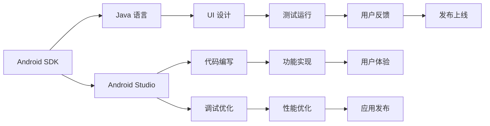

                 

# Android 开发入门：Java 和 Android Studio

> 关键词：Android 开发，Java 语言，Android Studio，UI 设计，Google Play 服务

## 1. 背景介绍

### 1.1 问题由来
随着智能手机市场的不断扩展和移动互联网的深入普及，Android 平台凭借其开放、灵活的特性，成为全球最主流的移动操作系统之一。根据 Statista 的数据，2021 年全球智能手机的市场份额中，Android 系统占据了近 80% 的份额。

与此同时，越来越多的开发者、企业和个人选择 Android 平台进行移动应用开发。掌握 Android 开发技能，不仅能够为职业生涯增色添彩，还能帮助企业快速布局移动市场，抢占先机。

然而，Android 开发体系庞大复杂，新手入门容易面临诸多困难。如何快速上手 Android 开发，构建功能丰富、性能稳定的移动应用，成为很多开发者迫切需要解决的问题。

本文旨在通过系统的介绍 Android 开发环境、核心概念、常用技术，帮助读者迅速掌握 Android 开发入门知识，为后续进阶打下坚实的基础。

### 1.2 问题核心关键点
本节将从 Android 平台特点、Android Studio 功能和主要开发流程等方面，明确 Android 开发的本质、目标和核心内容。

1. **Android 平台特点**：开源、灵活、易用，支持丰富的硬件和网络环境。
2. **Android Studio 功能**：强大的 IDE 集成开发环境，支持代码编写、测试调试、界面设计、性能优化等全流程开发。
3. **主要开发流程**：需求分析、UI 设计、代码编写、调试优化、发布上线等核心环节。

通过深入了解这些问题核心关键点，读者将能够更清晰地把握 Android 开发的整体框架和基本步骤。

## 2. 核心概念与联系

### 2.1 核心概念概述

Android 开发涉及多个核心概念，这些概念构成了 Android 开发的基础和核心。

- **Android SDK**：Android 软件开发工具包，包含开发所需的所有库、API、工具和文档。
- **Java 语言**：Android 开发的主要编程语言，提供了丰富的类库和框架，支持面向对象编程。
- **Android Studio**：官方推荐的 Android 开发 IDE，提供代码编写、调试、测试、界面设计等一体化开发工具。
- **UI 设计**：构建 Android 应用的核心，涉及布局、样式、交互等设计要素。
- **Google Play 服务**：提供身份认证、推送通知、定位服务等功能，提升应用的体验和安全性。
- **Google Mobile Services (GMS)**：Android 核心服务，提供应用程序更新、推送通知、位置服务等基础功能。
- **Android 开发工具**：如 Android 模拟器、Adb 命令行工具、Gradle 构建工具等。

这些核心概念之间相互联系，共同构成了 Android 开发的知识体系和应用框架。

### 2.2 核心概念原理和架构的 Mermaid 流程图(Mermaid 流程节点中不要有括号、逗号等特殊字符)



该图展示了 Android 开发的主要流程和关键步骤，帮助读者理解 Android 开发的整体框架和核心内容。

## 3. 核心算法原理 & 具体操作步骤

### 3.1 算法原理概述

Android 开发的算法原理主要围绕 Java 语言和 Android Studio 工具展开。Java 提供了强大的编程能力和丰富的类库，Android Studio 提供了高效、统一的开发环境，这两者的结合使得 Android 应用开发更加高效和灵活。

Android 开发的核心算法原理包括：

- **面向对象编程**：Java 的核心特性，通过封装、继承和多态实现代码模块化、复用和扩展。
- **Android 应用架构**：通过模块化、分层的架构设计，提高应用的开发效率和可维护性。
- **生命周期管理**：通过 Activity、Service、Fragment 等组件的生命周期方法，管理应用的不同阶段状态。
- **异步任务处理**：通过 AsyncTask、Intent、BroadcastReceiver 等机制，实现后台任务和非 UI 线程的通信。
- **数据存储**：通过 SQLite、ContentProvider、Room 等技术，管理和存储应用数据。
- **网络通信**：通过 Retrofit、OkHttp、 Volley 等库，实现 HTTP 请求和响应处理。

这些算法原理共同构成了 Android 开发的理论基础，是 Android 应用开发的关键所在。

### 3.2 算法步骤详解

本节将详细介绍 Android 开发的核心算法步骤和具体操作步骤。

#### 3.2.1 环境搭建

1. **安装 Java JDK**：
   - 从 [Oracle 官网](https://www.oracle.com/java/technologies/javase-jdk11-downloads.html) 下载并安装 Java JDK。
   - 设置环境变量，使 Android Studio 能够识别 Java 环境。

2. **安装 Android Studio**：
   - 从 [Android Studio 官网](https://developer.android.com/studio) 下载安装包。
   - 运行安装程序，按照提示完成安装。

3. **配置 SDK 和项目目录**：
   - 在 Android Studio 中，选择 `Configure`，选择 `Project Structure`。
   - 选择 `Android SDK` 和 `Android API` 的路径，并创建项目目录。

#### 3.2.2 代码编写

1. **创建新项目**：
   - 在 Android Studio 中，选择 `Create New Project`。
   - 填写项目名称、包名、最小 SDK 版本等信息，并选择项目目录。

2. **编写 Java 代码**：
   - 在 `MainActivity.java` 文件中，编写 Java 代码实现应用逻辑。
   - 例如：
     ```java
     import android.os.Bundle;
     import androidx.appcompat.app.AppCompatActivity;

     public class MainActivity extends AppCompatActivity {
         @Override
         protected void onCreate(Bundle savedInstanceState) {
             super.onCreate(savedInstanceState);
             setContentView(R.layout.activity_main);
         }
     }
     ```

3. **编写布局 XML 文件**：
   - 在 `activity_main.xml` 文件中，编写布局 XML 代码定义界面。
   - 例如：
     ```xml
     <LinearLayout xmlns:android="http://schemas.android.com/apk/res/android"
         android:layout_width="match_parent"
         android:layout_height="match_parent"
         android:orientation="vertical" >

         <TextView
             android:id="@+id/textView"
             android:layout_width="wrap_content"
             android:layout_height="wrap_content"
             android:text="Hello Android!" />
     </LinearLayout>
     ```

#### 3.2.3 调试和优化

1. **启动应用**：
   - 点击 `Run`，启动应用。
   - 在设备或模拟器上查看应用运行情况。

2. **调试代码**：
   - 点击 `Debug`，进入调试模式。
   - 使用断点、日志和调试器等功能，查找和修复代码错误。

3. **性能优化**：
   - 使用 Android Studio 的性能分析工具，查找内存泄漏、网络延迟等问题。
   - 优化代码，提高应用性能和响应速度。

#### 3.2.4 发布应用

1. **创建 APK 文件**：
   - 在 `Build` 菜单下，选择 `Generate Signed APK`。
   - 创建签名文件，生成 APK 文件。

2. **上传应用到 Google Play 商店**：
   - 访问 [Google Play 开发者控制台](https://play.google.com/console/developers)。
   - 创建应用项目，上传 APK 文件，填写应用信息。

3. **测试和发布**：
   - 在发布前，进行应用商店测试，确保应用符合要求。
   - 发布应用，等待审核通过，即可在商店上架。

### 3.3 算法优缺点

Android 开发的算法有其独特的优缺点，主要体现在：

**优点**：
- **开源和灵活**：Android 系统开源，支持多种硬件和网络环境。
- **丰富的生态系统**：Android 拥有庞大的开发者社区和丰富的第三方库。
- **跨平台开发**：Android Studio 支持跨平台开发，提高开发效率。

**缺点**：
- **学习曲线陡峭**：Android 开发涉及大量概念和技术，新手入门需要一定时间。
- **性能问题**：Android 应用在处理大量数据或复杂逻辑时，可能出现性能瓶颈。
- **安全性问题**：Android 应用存在一些安全隐患，如权限管理、网络安全等。

### 3.4 算法应用领域

Android 开发的应用领域非常广泛，涵盖游戏、社交、电商、金融、医疗等多个行业。通过 Android 开发，开发者可以为各类用户提供便捷、智能、高效的应用体验。

## 4. 数学模型和公式 & 详细讲解 & 举例说明

### 4.1 数学模型构建

本节将介绍 Android 开发中涉及的数学模型和公式。

**Android 应用架构**：

Android 应用架构设计采用模块化、分层的模式，主要包括以下几个层次：

1. **应用程序层**：封装应用的核心功能和业务逻辑。
2. **服务层**：提供后台任务和非 UI 线程的通信机制。
3. **界面层**：负责用户界面设计和交互处理。
4. **数据层**：管理和存储应用数据。

这些层次之间通过接口和回调机制进行通信，构建高效、可扩展的应用架构。

**生命周期管理**：

Android 组件（Activity、Service、Fragment 等）的生命周期方法，是管理应用状态的重要机制。主要包括：

1. **创建**：组件被创建并初始化。
2. **恢复**：组件从暂停或后台状态重新激活。
3. **暂停**：组件停止运行，进入后台或休眠状态。
4. **销毁**：组件被销毁并释放资源。

生命周期方法帮助开发者控制应用状态，优化资源使用。

### 4.2 公式推导过程

**Java 编程语言**：

Java 编程语言的核心特性包括：

1. **面向对象编程**：封装、继承、多态等机制，支持模块化、复用和扩展。
2. **异常处理**：try-catch-finally 等机制，提高程序的健壮性和稳定性。
3. **接口和回调**：实现组件之间的通信和交互。

**Android 应用开发**：

Android 应用开发涉及多个关键技术和框架，主要包括：

1. **Activity 和 Service**：管理应用状态和后台任务。
2. **Fragment 和 Dialog**：管理用户界面和交互。
3. **ContentProvider 和 Room**：管理和存储应用数据。
4. **Intent 和 BroadcastReceiver**：实现组件之间的通信。

这些技术和框架共同构成了 Android 开发的理论基础，是开发高性能、高稳定性应用的核心所在。

### 4.3 案例分析与讲解

**Android 应用开发案例**：

1. **简单计算器应用**：
   - 使用 Java 编写计算器逻辑。
   - 设计布局 XML 文件，实现界面。
   - 使用 Android Studio 调试和优化代码。
   - 打包 APK 文件，上传 Google Play 商店。

2. **社交应用**：
   - 使用 Firebase 进行用户身份认证和数据存储。
   - 使用 RecyclerView 展示消息列表。
   - 使用 Glide 加载图片和视频。
   - 使用 RxJava 实现异步任务和数据流处理。

通过这些案例，读者可以更好地理解 Android 开发的实际应用场景和技术细节。

## 5. 项目实践：代码实例和详细解释说明

### 5.1 开发环境搭建

#### 5.1.1 安装 Java JDK

1. **下载 Java JDK**：
   - 从 [Oracle 官网](https://www.oracle.com/java/technologies/javase-jdk11-downloads.html) 下载 Java JDK。
   - 下载完成后，双击安装程序，按照提示完成安装。

2. **配置环境变量**：
   - 打开系统属性，选择 `Environment Variables`。
   - 添加 `JAVA_HOME` 和 `PATH` 变量，指向 Java 安装目录。

#### 5.1.2 安装 Android Studio

1. **下载安装包**：
   - 从 [Android Studio 官网](https://developer.android.com/studio) 下载安装包。
   - 双击安装程序，按照提示完成安装。

2. **配置 SDK 和项目目录**：
   - 在 Android Studio 中，选择 `Configure`，选择 `Project Structure`。
   - 选择 `Android SDK` 和 `Android API` 的路径，并创建项目目录。

### 5.2 源代码详细实现

#### 5.2.1 创建新项目

1. **打开 Android Studio**：
   - 运行 Android Studio，进入主界面。

2. **创建新项目**：
   - 点击 `File`，选择 `New Project`。
   - 填写项目名称、包名、最小 SDK 版本等信息，并选择项目目录。

3. **编写 Java 代码**：
   - 在 `MainActivity.java` 文件中，编写 Java 代码实现应用逻辑。
   - 例如：
     ```java
     import android.os.Bundle;
     import androidx.appcompat.app.AppCompatActivity;

     public class MainActivity extends AppCompatActivity {
         @Override
         protected void onCreate(Bundle savedInstanceState) {
             super.onCreate(savedInstanceState);
             setContentView(R.layout.activity_main);
         }
     }
     ```

4. **编写布局 XML 文件**：
   - 在 `activity_main.xml` 文件中，编写布局 XML 代码定义界面。
   - 例如：
     ```xml
     <LinearLayout xmlns:android="http://schemas.android.com/apk/res/android"
         android:layout_width="match_parent"
         android:layout_height="match_parent"
         android:orientation="vertical" >

         <TextView
             android:id="@+id/textView"
             android:layout_width="wrap_content"
             android:layout_height="wrap_content"
             android:text="Hello Android!" />
     </LinearLayout>
     ```

#### 5.2.2 调试和优化

1. **启动应用**：
   - 点击 `Run`，启动应用。
   - 在设备或模拟器上查看应用运行情况。

2. **调试代码**：
   - 点击 `Debug`，进入调试模式。
   - 使用断点、日志和调试器等功能，查找和修复代码错误。

3. **性能优化**：
   - 使用 Android Studio 的性能分析工具，查找内存泄漏、网络延迟等问题。
   - 优化代码，提高应用性能和响应速度。

### 5.3 代码解读与分析

#### 5.3.1 代码示例

```java
import android.os.Bundle;
import androidx.appcompat.app.AppCompatActivity;

public class MainActivity extends AppCompatActivity {
    @Override
    protected void onCreate(Bundle savedInstanceState) {
        super.onCreate(savedInstanceState);
        setContentView(R.layout.activity_main);
    }
}
```

**代码解读**：
- `MainActivity` 是 Android 应用的入口类，继承自 `AppCompatActivity`。
- `onCreate` 方法在活动创建时调用，实现初始化界面和布局。
- `setContentView(R.layout.activity_main)` 设置布局文件 `activity_main.xml` 为当前界面。

#### 5.3.2 分析

1. **包名和类名**：
   - `android.os.Bundle`：定义应用数据传输机制。
   - `xplotlib.appcompat.app.AppCompatActivity`：继承自 `AppCompatActivity`，提供活动生命周期管理。
   - `public class MainActivity extends AppCompatActivity`：声明一个名为 `MainActivity` 的类，继承自 `AppCompatActivity`。

2. **生命周期方法**：
   - `protected void onCreate(Bundle savedInstanceState)`：活动创建时调用，实现初始化界面和布局。
   - `super.onCreate(savedInstanceState)`：调用父类方法，完成基本初始化。
   - `setContentView(R.layout.activity_main)`：设置布局文件 `activity_main.xml` 为当前界面。

### 5.4 运行结果展示

#### 5.4.1 运行结果

启动应用后，界面显示 "Hello Android!" 文本。界面布局由 `activity_main.xml` 文件定义，代码如下：

```xml
<LinearLayout xmlns:android="http://schemas.android.com/apk/res/android"
    android:layout_width="match_parent"
    android:layout_height="match_parent"
    android:orientation="vertical" >

    <TextView
        android:id="@+id/textView"
        android:layout_width="wrap_content"
        android:layout_height="wrap_content"
        android:text="Hello Android!" />
</LinearLayout>
```

运行结果展示了界面布局和文本内容，实现了 Android 开发的基本功能。

## 6. 实际应用场景

### 6.1 智能客服系统

智能客服系统是一种典型的人工智能应用场景，通过 Android 开发可以实现高效率、高精度的客户服务。

**系统功能**：
- **自动回复**：使用自然语言处理技术，自动生成回复内容。
- **用户识别**：通过语音识别和语义分析，识别用户身份和需求。
- **问题解答**：使用知识图谱和专家系统，提供精准的问题解答。
- **数据统计**：记录用户交互数据，生成分析报告。

**开发流程**：
1. **需求分析**：明确系统功能需求，设计系统架构。
2. **UI 设计**：设计用户界面和交互流程。
3. **代码编写**：实现系统功能和数据处理。
4. **测试优化**：进行单元测试和性能优化。
5. **发布上线**：上传应用到 Google Play 商店，上线运行。

### 6.2 金融舆情监测

金融舆情监测是一种重要的人工智能应用场景，通过 Android 开发可以实现高效率、高精度的舆情分析。

**系统功能**：
- **数据采集**：实时采集互联网上的金融新闻和评论。
- **情感分析**：使用自然语言处理技术，分析舆情情感倾向。
- **趋势预测**：使用机器学习算法，预测金融市场趋势。
- **风险预警**：根据舆情分析结果，发出风险预警。

**开发流程**：
1. **需求分析**：明确系统功能需求，设计系统架构。
2. **UI 设计**：设计用户界面和交互流程。
3. **代码编写**：实现数据采集、情感分析和趋势预测等功能。
4. **测试优化**：进行单元测试和性能优化。
5. **发布上线**：上传应用到 Google Play 商店，上线运行。

### 6.3 个性化推荐系统

个性化推荐系统是一种典型的人工智能应用场景，通过 Android 开发可以实现高效率、高精度的用户推荐。

**系统功能**：
- **用户画像**：通过数据挖掘和机器学习，构建用户画像。
- **推荐算法**：使用协同过滤、内容推荐等算法，实现个性化推荐。
- **交互界面**：设计推荐界面的展示和交互。
- **数据分析**：记录用户行为数据，进行数据分析和优化。

**开发流程**：
1. **需求分析**：明确系统功能需求，设计系统架构。
2. **UI 设计**：设计用户界面和交互流程。
3. **代码编写**：实现用户画像、推荐算法和数据分析等功能。
4. **测试优化**：进行单元测试和性能优化。
5. **发布上线**：上传应用到 Google Play 商店，上线运行。

## 7. 工具和资源推荐

### 7.1 学习资源推荐

#### 7.1.1 在线教程

1. **Android 开发教程**：
   - [Android 官方文档](https://developer.android.com/docs)：权威、详细的 Android 开发文档。
   - [Udacity 课程](https://www.udacity.com/course/android-basics-developing-android-apps--ud287)：介绍 Android 基础和开发流程。
   - [Coursera 课程](https://www.coursera.org/learn/android-development)：介绍 Android 开发和设计。

2. **Java 编程教程**：
   - [Oracle 官方文档](https://docs.oracle.com/en/java/javase/index.html)：Java 官方文档，提供详细的 Java 语言和类库介绍。
   - [Java 教程](https://www.java.com/en/developer/guides/)：Java 编程语言和开发工具介绍。
   - [Khan Academy 课程](https://www.khanacademy.org/computing/computer-programming/java)：Java 基础编程课程。

#### 7.1.2 书籍

1. **《Android 开发实战》**：
   - 作者：Matt Palazzolo，翻译：吴航。
   - 内容简介：涵盖 Android 开发的基础和高级技巧，适合初学者和进阶开发者阅读。

2. **《Java 编程思想》**：
   - 作者：Bruce Eckel。
   - 内容简介：介绍 Java 编程语言和面向对象编程的基本概念和高级技巧。

### 7.2 开发工具推荐

#### 7.2.1 IDE

1. **Android Studio**：
   - 功能：强大的开发集成环境，支持代码编写、调试、测试、界面设计等全流程开发。
   - 官网：[Android Studio](https://developer.android.com/studio)

2. **Eclipse ADT**：
   - 功能：支持 Android 开发和调试，提供丰富的插件和工具。
   - 官网：[Eclipse ADT](https://www.eclipse.org/adt/)

#### 7.2.2 开发工具

1. **Android SDK**：
   - 功能：提供 Android 开发所需的库、API、工具和文档。
   - 官网：[Android SDK](https://developer.android.com/studio/releases/sdk)

2. **Android Studio 插件**：
   - 功能：提供更多的开发工具和功能，如调试器、性能分析器等。
   - 官网：[Android Studio Plugins](https://plugins.jetbrains.com/)

### 7.3 相关论文推荐

#### 7.3.1 经典论文

1. **《Android Studio: A New Ide for Android Mobile Development》**：
   - 作者：Jeff Fannin。
   - 简介：介绍 Android Studio 的设计理念和主要功能。

2. **《Android Application Architecture》**：
   - 作者：Eduardo Pinheiro。
   - 简介：介绍 Android 应用的架构设计原则和最佳实践。

3. **《Android Development with Android Studio》**：
   - 作者：Mariano Becerra、Vittorio Dubini。
   - 简介：介绍 Android Studio 的使用方法和 Android 开发技巧。

## 8. 总结：未来发展趋势与挑战

### 8.1 研究成果总结

本节将总结 Android 开发中的重要研究成果，帮助读者理解 Android 开发的核心技术和前沿进展。

1. **Android 应用架构**：
   - 主要架构包括应用程序层、服务层、界面层和数据层。
   - 设计原则：模块化、分层次、高内聚、低耦合。

2. **Java 编程语言**：
   - 核心特性：面向对象编程、异常处理、接口和回调等。
   - 语言特点：类库丰富、跨平台支持、安全性高。

3. **Android Studio 工具**：
   - 主要功能：代码编写、调试、测试、界面设计等。
   - 开发效率：自动化工具支持、插件丰富、社区活跃。

### 8.2 未来发展趋势

Android 开发将呈现以下发展趋势：

1. **跨平台开发**：
   - 趋势：支持更多平台和设备，提高开发效率和应用性能。
   - 技术：Flutter、React Native、Xamarin 等跨平台框架。

2. **AI 和 ML 集成**：
   - 趋势：集成更多 AI 和 ML 技术，提升应用智能化水平。
   - 技术：自然语言处理、图像识别、机器学习等。

3. **性能优化**：
   - 趋势：提升应用性能和响应速度，优化内存和资源使用。
   - 技术：多线程编程、异步任务处理、性能分析工具。

4. **安全性和隐私保护**：
   - 趋势：提升应用安全性和用户隐私保护水平。
   - 技术：权限管理、数据加密、安全认证等。

5. **组件化和模块化**：
   - 趋势：提高应用的模块化和组件化程度，提升代码复用性和可维护性。
   - 技术：组件化架构、模块化开发、依赖管理工具。

### 8.3 面临的挑战

Android 开发在未来的发展中，面临以下挑战：

1. **技术迭代快**：
   - 挑战：新技术层出不穷，开发者需要不断学习新知识。
   - 应对措施：持续学习、参加培训、参与社区交流。

2. **平台多样性**：
   - 挑战：支持多种设备和平台，技术难度增加。
   - 应对措施：使用跨平台框架、优化开发流程。

3. **性能瓶颈**：
   - 挑战：应用运行在高性能设备上，性能瓶颈难以避免。
   - 应对措施：优化算法和代码、使用高效工具。

4. **安全性问题**：
   - 挑战：应用安全性问题复杂，需要综合考虑多方面因素。
   - 应对措施：加强安全管理、引入安全机制、定期审计。

5. **用户体验**：
   - 挑战：提升应用的用户体验和交互设计。
   - 应对措施：用户研究和测试、设计良好交互流程、优化界面布局。

### 8.4 研究展望

未来 Android 开发的研究方向包括：

1. **跨平台开发**：
   - 研究方向：提升跨平台开发效率和应用性能。
   - 技术：Flutter、React Native、Xamarin 等框架。

2. **AI 和 ML 集成**：
   - 研究方向：集成更多 AI 和 ML 技术，提升应用智能化水平。
   - 技术：自然语言处理、图像识别、机器学习等。

3. **性能优化**：
   - 研究方向：提升应用性能和响应速度，优化内存和资源使用。
   - 技术：多线程编程、异步任务处理、性能分析工具。

4. **安全性和隐私保护**：
   - 研究方向：提升应用安全性和用户隐私保护水平。
   - 技术：权限管理、数据加密、安全认证等。

5. **组件化和模块化**：
   - 研究方向：提高应用的模块化和组件化程度，提升代码复用性和可维护性。
   - 技术：组件化架构、模块化开发、依赖管理工具。

综上所述，Android 开发领域前景广阔，但同时也面临诸多挑战。未来研究者需要不断探索新技术、新方法，推动 Android 开发向更高效、更智能、更安全的方向发展。

## 9. 附录：常见问题与解答

**Q1: Android Studio 如何下载和安装？**

**A1:** 访问 [Android Studio 官网](https://developer.android.com/studio)，点击下载按钮，根据操作系统选择合适的下载包。双击下载文件，按照提示完成安装。

**Q2: 如何创建一个简单的 Android 应用？**

**A2:** 打开 Android Studio，选择 `Create New Project`，填写项目名称、包名、最小 SDK 版本等信息，并选择项目目录。在 `MainActivity.java` 文件中编写 Java 代码，在 `activity_main.xml` 文件中编写布局 XML 代码，点击 `Run` 启动应用。

**Q3: Android 开发常用的第三方库有哪些？**

**A3:** Android 开发常用的第三方库包括：
- Retrofit：网络请求库。
- Glide：图片加载库。
- Picasso：图片加载库。
- Room：数据库管理库。
- Glide：图片加载库。

通过学习和使用这些第三方库，可以提高开发效率，提升应用性能和用户体验。

**Q4: Android Studio 如何使用 Git 进行版本控制？**

**A4:** 打开 Android Studio，选择 `VCS -> Import Into Version Control`，选择 `Git` 作为版本控制系统。在 `android/app` 目录下使用 `git init` 初始化 Git 仓库，使用 `git add` 添加文件到仓库，使用 `git commit` 提交更改，使用 `git push` 将更改推送到远程仓库。

通过 Git 版本控制，可以方便地进行代码管理、协同开发和版本回溯。

**Q5: Android 应用如何优化性能？**

**A5:** Android 应用优化性能的方法包括：
- 减少内存使用：优化布局、减少不必要的资源加载、使用缓存机制等。
- 提升响应速度：使用异步任务处理、优化 UI 渲染、减少资源等待时间等。
- 优化网络请求：使用缓存机制、优化网络请求参数、减少请求次数等。

通过以上优化措施，可以提升 Android 应用的用户体验和性能。

---

作者：禅与计算机程序设计艺术 / Zen and the Art of Computer Programming

