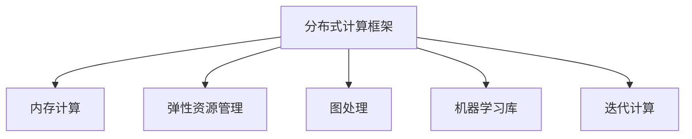

                 

# Apache Spark：大规模数据处理的利器

> 关键词：Apache Spark, 大数据处理, 分布式计算, 内存计算, 图处理, 机器学习, 迭代计算, 快速迭代, 弹性资源管理, 实时分析

## 1. 背景介绍

### 1.1 问题由来
随着互联网和数字化的迅猛发展，数据量呈指数级增长，如何高效地存储、处理和分析这些数据，成为了当今数据科学和工程领域面临的重大挑战。大数据时代，数据的种类和形式不断丰富，如日志数据、文本数据、图像数据、视频数据等，均呈现出多样性、复杂性和海量化等特点。

传统的关系型数据库和大规模批处理技术难以胜任大数据的计算需求，Spark应运而生，成为处理大规模数据的高效工具。本文将系统介绍Spark的核心概念、算法原理、操作步骤以及实际应用，通过理论分析与实践操作，深入探讨Spark在数据处理领域的优势与挑战，为大数据从业者提供全面的技术指引。

### 1.2 问题核心关键点
Spark是Apache软件基金会的开源分布式计算系统，提供了一站式的大数据处理平台。它集成了内存计算、图处理、机器学习等多种功能，支持迭代计算、快速迭代以及弹性资源管理，被广泛应用于大规模数据存储、处理与分析场景。

Spark的核心优势在于：

1. **内存计算**：Spark能够将数据存储在内存中，大幅提升数据处理速度。
2. **弹性资源管理**：Spark能够自动分配和回收资源，适应不同计算需求。
3. **分布式计算**：Spark基于分布式集群，提供并行计算能力，支持大规模数据处理。
4. **丰富的API**：Spark提供了Scala、Java、Python等多种编程语言接口，满足不同开发者的需求。
5. **社区支持**：Spark拥有一个活跃的开源社区，提供丰富的文档和示例代码。

## 2. 核心概念与联系

### 2.1 核心概念概述

为了更好地理解Spark的核心功能，本节将介绍几个关键概念：

- **分布式计算框架**：Spark是一个分布式计算框架，支持多种编程语言接口，能够在集群上分布式计算大规模数据。
- **内存计算**：Spark利用内存计算，通过将数据存储在内存中，显著提升数据处理速度。
- **弹性资源管理**：Spark通过动态资源分配机制，根据计算需求自动调整集群资源，适应不同的任务规模和负载。
- **图处理**：Spark支持图计算，通过使用图计算模型处理大规模图数据。
- **机器学习库**：Spark MLlib库提供了各种机器学习算法，支持从数据预处理到模型训练、评估的完整流程。
- **迭代计算**：Spark支持迭代算法，适用于需要多次迭代的计算任务，如深度学习训练、图算法等。

这些核心概念之间的逻辑关系可以通过以下Mermaid流程图来展示：



这个流程图展示了Spark各核心功能之间的关系：

1. **分布式计算框架**：是Spark的基础，提供了数据处理的基本架构。
2. **内存计算**：利用内存存储，显著提升数据处理速度。
3. **弹性资源管理**：根据任务需求自动调整资源，提高系统性能。
4. **图处理**：用于处理大规模图数据，如社交网络、知识图谱等。
5. **机器学习库**：提供丰富的机器学习算法，支持从数据预处理到模型训练的完整流程。
6. **迭代计算**：支持需要多次迭代的计算任务，如深度学习训练、图算法等。

这些核心概念共同构成了Spark的强大功能，使其能够高效地处理各种类型的大数据。

## 3. 核心算法原理 & 具体操作步骤
### 3.1 算法原理概述

Spark的计算模型基于弹性分布式数据集(Resilient Distributed Dataset, RDD)，通过分布式计算框架实现大规模数据处理。RDD是一种分布式集合，可以在集群上并行处理，支持多种操作，如映射、聚合、排序、连接等。

Spark的计算过程分为两个阶段：

1. **Map阶段**：将数据集划分为多个小数据块，对每个小数据块进行操作，最终合并为一个大数据块。
2. **Reduce阶段**：对Map阶段的结果进行聚合操作，最终输出结果。

Spark的内存计算和弹性资源管理机制，使其能够在处理大规模数据时，将数据存储在内存中，显著提高数据处理速度，同时自动调整资源，适应不同的计算需求。

### 3.2 算法步骤详解

Spark的核心操作步骤包括：

**Step 1: 准备数据集**
- 将原始数据导入Spark，可以使用Hadoop分布式文件系统(HDFS)、本地文件系统、Hive等数据源。
- 使用Spark的API对数据进行预处理，如过滤、采样、去重等操作。

**Step 2: 定义计算任务**
- 使用Spark的API定义计算任务，如Map函数、Reduce函数、join操作等。
- 选择合适的算法和数据结构，优化计算效率。

**Step 3: 配置资源**
- 配置Spark的资源管理器，如YARN、Mesos等。
- 设置集群资源，如CPU、内存、磁盘等。

**Step 4: 启动Spark程序**
- 使用Spark的主程序SparkSubmit或Spark Shell启动Spark程序。
- 启动后，Spark会分配资源，执行计算任务。

**Step 5: 监控任务**
- 使用Spark Web UI监控计算任务的状态。
- 调整资源配置，优化任务性能。

**Step 6: 保存和恢复结果**
- 使用Spark的API将计算结果保存为本地文件或远程数据库。
- 保存结果，以便后续使用。

通过以上操作步骤，Spark能够高效地处理大规模数据，并实时监控计算任务的状态，优化资源配置。

### 3.3 算法优缺点

Spark作为一种分布式计算框架，具有以下优点：

1. **高效内存计算**：Spark利用内存计算，提升数据处理速度。
2. **弹性资源管理**：Spark能够自动调整资源，适应不同任务需求。
3. **分布式计算**：Spark基于分布式集群，提供并行计算能力，支持大规模数据处理。
4. **丰富的API**：Spark提供多种编程语言接口，满足不同开发者的需求。
5. **社区支持**：Spark拥有一个活跃的开源社区，提供丰富的文档和示例代码。

然而，Spark也存在一些缺点：

1. **资源占用**：Spark需要大量的内存和CPU资源，可能对系统资源造成负担。
2. **数据迁移成本**：Spark需要将数据从Hadoop、Hive等数据源迁移到RDD中，增加了数据迁移成本。
3. **学习曲线陡峭**：Spark的API设计较为复杂，初学者可能难以掌握。
4. **并发控制**：Spark的并发控制机制较为复杂，可能影响性能。

尽管存在这些缺点，但Spark仍然是大数据处理领域的重要工具，其高效内存计算和弹性资源管理机制，使其在处理大规模数据时具有显著优势。

### 3.4 算法应用领域

Spark作为一种高效的大数据处理框架，适用于多种应用场景：

- **大数据存储与分析**：Spark能够处理大规模的数据存储与分析，如日志分析、客户行为分析、广告投放分析等。
- **实时数据流处理**：Spark Streaming模块支持实时数据流处理，可以处理大规模的实时数据流。
- **机器学习**：Spark MLlib库提供各种机器学习算法，支持从数据预处理到模型训练的完整流程。
- **图处理**：Spark GraphX模块支持大规模图数据处理，如图计算、社区发现、推荐系统等。
- **多语言支持**：Spark支持Scala、Java、Python等多种编程语言，满足不同开发者的需求。

## 4. 数学模型和公式 & 详细讲解  
### 4.1 数学模型构建

Spark的核心计算模型基于RDD，RDD是一个分布式集合，支持多种操作。

定义RDD为：
$$ RDD = \{(r_1, v_1), (r_2, v_2), ..., (r_n, v_n)\} $$
其中 $r_i$ 表示键值对，$v_i$ 表示值。

Spark的计算过程分为Map和Reduce两个阶段：

**Map阶段**：
$$ Map(x_i) = \{(r_1, v_{1,i}), (r_2, v_{2,i}), ..., (r_n, v_{n,i})\} $$
其中 $x_i$ 表示输入数据，$v_{i,j}$ 表示 $x_i$ 的第 $j$ 个键值对。

**Reduce阶段**：
$$ Reduce(y_i) = \{(r_1, v_{1,i}), (r_2, v_{2,i}), ..., (r_n, v_{n,i})\} $$
其中 $y_i$ 表示Map阶段的结果，$v_{i,j}$ 表示 $y_i$ 的第 $j$ 个键值对。

### 4.2 公式推导过程

以MapReduce为例，推导Map和Reduce函数的计算过程：

设输入数据为 $D = \{(x_1, y_1), (x_2, y_2), ..., (x_n, y_n)\}$，Map函数为 $f(x)$，Reduce函数为 $g(y)$，则MapReduce的计算过程如下：

1. **Map阶段**：
$$ Map(x_i) = \{(x_i, f(x_i))\} $$
其中 $f(x)$ 表示Map函数。

2. **Shuffle阶段**：对Map阶段的结果进行Shuffle操作，将相同键的数据合并到一个分区中。

3. **Reduce阶段**：
$$ Reduce(y_i) = \{(y_1, g(y_i)), (y_2, g(y_i)), ..., (y_n, g(y_i))\} $$
其中 $g(y)$ 表示Reduce函数。

通过MapReduce的计算过程，Spark能够高效地处理大规模数据，并支持多种计算任务。

### 4.3 案例分析与讲解

以Spark的机器学习库MLlib为例，介绍如何使用Spark进行机器学习任务。

**Step 1: 准备数据集**
- 将数据集导入Spark，使用Spark的API对数据进行预处理，如过滤、采样、去重等操作。

**Step 2: 定义机器学习模型**
- 使用Spark的API定义机器学习模型，如线性回归、逻辑回归、决策树等。
- 设置模型的参数，如学习率、正则化系数等。

**Step 3: 训练模型**
- 使用Spark的API训练机器学习模型，通过MapReduce计算各个样本的损失函数。
- 根据损失函数的梯度更新模型参数，进行多次迭代训练。

**Step 4: 评估模型**
- 使用Spark的API评估机器学习模型的性能，如精度、召回率、F1值等。
- 对模型进行调参，优化模型性能。

通过以上步骤，Spark能够高效地进行机器学习任务，支持从数据预处理到模型训练、评估的完整流程。

## 5. 项目实践：代码实例和详细解释说明
### 5.1 开发环境搭建

在进行Spark项目开发前，我们需要准备好开发环境。以下是使用PySpark进行Spark开发的环境配置流程：

1. 安装Python：从官网下载并安装Python 3.x版本。
2. 安装Spark：从官网下载并安装Spark，选择适合的操作系统版本。
3. 配置Spark环境：设置Spark的主配置文件，配置好Spark的运行环境。
4. 安装Hadoop：安装Hadoop分布式文件系统，以便于Spark处理Hadoop中的数据。

完成上述步骤后，即可在本地环境中开始Spark项目开发。

### 5.2 源代码详细实现

下面以Spark机器学习库MLlib为例，给出使用PySpark进行机器学习任务开发的完整代码实现。

```python
from pyspark import SparkConf, SparkContext
from pyspark.ml.regression import LinearRegression
from pyspark.sql import SparkSession

# 创建Spark环境
conf = SparkConf().setAppName("Spark ML Example")
sc = SparkContext(conf=conf)
spark = SparkSession(sc)

# 准备数据集
data = sc.parallelize([(1, 2), (3, 4), (5, 6), (7, 8)])
labels = sc.parallelize([1, 0, 1, 0])

# 定义线性回归模型
lr = LinearRegression(maxIter=10, regParam=0.3, elasticNetParam=0.8)

# 训练模型
lr_model = lr.fit(data, labels)

# 预测
preds = lr_model.transform(data)

# 评估模型
evaluator = regression.Evaluator(rawPredictionCol="prediction", labelCol="label", metricName="rmse")
rmse = evaluator.evaluate(preds)

# 输出评估结果
print("RMSE: ", rmse)
```

这段代码实现了使用Spark进行线性回归模型的训练和评估过程。可以看到，使用PySpark的API进行机器学习任务开发，只需要几行代码即可实现，非常方便高效。

### 5.3 代码解读与分析

以下是代码的详细解读和分析：

**Step 1: 准备数据集**
- `sc.parallelize`方法将数据集转换为Spark分布式集合。
- 数据集和标签分别存储在`data`和`labels`变量中。

**Step 2: 定义线性回归模型**
- `LinearRegression`类定义了一个线性回归模型，设置训练次数、正则化系数、弹性系数等参数。

**Step 3: 训练模型**
- `fit`方法使用`data`和`labels`进行模型训练，返回训练好的模型对象。

**Step 4: 预测**
- `transform`方法使用训练好的模型进行预测，返回预测结果。

**Step 5: 评估模型**
- `regression.Evaluator`类定义了一个评估器，用于计算模型的评估指标，如RMSE等。
- `evaluate`方法计算模型的RMSE值，并输出评估结果。

通过以上代码，我们可以快速完成线性回归模型的训练、预测和评估，展示了PySpark在机器学习任务开发中的强大能力。

## 6. 实际应用场景
### 6.1 智能推荐系统

Spark在智能推荐系统中的应用非常广泛，通过分析用户行为数据，为用户推荐个性化产品或内容。

**Step 1: 准备数据集**
- 收集用户的历史行为数据，如浏览记录、购买记录等。
- 将数据集导入Spark，并进行预处理。

**Step 2: 定义推荐模型**
- 使用Spark的MLlib库，定义协同过滤、矩阵分解等推荐算法。
- 设置推荐算法的参数，如用户兴趣特征、商品特征等。

**Step 3: 训练模型**
- 使用Spark的API训练推荐模型，对用户行为数据进行矩阵分解等操作。
- 对模型进行调参，优化推荐效果。

**Step 4: 生成推荐结果**
- 使用训练好的推荐模型，对新用户行为数据进行预测。
- 生成推荐结果，并将其推送给用户。

通过以上步骤，Spark能够高效地构建智能推荐系统，满足用户个性化需求。

### 6.2 金融风险管理

Spark在金融风险管理中也有广泛应用，通过分析大量交易数据，发现潜在的风险因素，并进行风险控制。

**Step 1: 准备数据集**
- 收集银行的交易数据，包括交易时间、金额、类型等信息。
- 将数据集导入Spark，并进行预处理，如去重、去噪等操作。

**Step 2: 定义风险评估模型**
- 使用Spark的MLlib库，定义各种风险评估算法，如信用评分、风险预测等。
- 设置风险评估算法的参数，如阈值、权重等。

**Step 3: 训练模型**
- 使用Spark的API训练风险评估模型，对交易数据进行特征提取和建模。
- 对模型进行调参，优化风险评估效果。

**Step 4: 风险预警**
- 使用训练好的风险评估模型，对新交易数据进行风险评估。
- 根据评估结果，进行风险预警，及时采取风险控制措施。

通过以上步骤，Spark能够高效地进行金融风险管理，提高金融机构的风险管理能力。

### 6.3 实时数据流处理

Spark Streaming模块支持实时数据流处理，可以处理大规模的实时数据流。

**Step 1: 准备数据源**
- 收集实时数据流，如社交媒体数据、传感器数据等。
- 将数据源导入Spark Streaming，并进行预处理。

**Step 2: 定义实时计算任务**
- 使用Spark Streaming的API，定义实时计算任务，如窗口统计、滑动窗口统计等。
- 设置计算任务的参数，如窗口大小、滑动步长等。

**Step 3: 启动实时计算任务**
- 使用Spark Streaming的主程序SparkSubmit启动实时计算任务。
- 实时计算任务在集群上并行处理，输出结果。

**Step 4: 监控任务**
- 使用Spark Web UI监控实时计算任务的状态。
- 调整资源配置，优化任务性能。

通过以上步骤，Spark能够高效地处理实时数据流，满足不同应用场景的需求。

### 6.4 未来应用展望

随着Spark技术的不断发展，其在数据处理领域的潜力将不断释放。未来Spark的应用场景将更加广泛，包括但不限于以下领域：

- **大数据存储与分析**：Spark能够高效地处理大规模数据，支持各种类型的数据分析任务。
- **实时数据流处理**：Spark Streaming模块支持实时数据流处理，可以处理大规模的实时数据流。
- **机器学习与人工智能**：Spark的MLlib库提供各种机器学习算法，支持从数据预处理到模型训练、评估的完整流程。
- **图处理与社交网络分析**：Spark GraphX模块支持大规模图数据处理，如图计算、社区发现、推荐系统等。
- **多语言支持**：Spark支持Scala、Java、Python等多种编程语言，满足不同开发者的需求。

## 7. 工具和资源推荐
### 7.1 学习资源推荐

为了帮助开发者系统掌握Spark的核心功能和应用技巧，这里推荐一些优质的学习资源：

1. Apache Spark官方文档：提供详细的Spark使用指南和示例代码，是学习Spark的重要参考资料。
2. Spark入门教程：一份系统介绍Spark基础知识和操作技能的教程，适合Spark初学者。
3. Spark实战：通过实际案例，介绍Spark在大数据处理中的应用，适合有一定Spark基础的学习者。
4. Spark视频教程：一系列Spark相关的视频教程，涵盖Spark基础、高级功能和实际应用等多个方面。
5. Spark社区：Apache Spark的官方社区，提供丰富的技术交流和资源分享，适合Spark开发者进行交流和学习。

通过对这些资源的学习实践，相信你一定能够快速掌握Spark的核心功能和应用技巧，并用于解决实际的大数据处理问题。

### 7.2 开发工具推荐

高效的工具支持是Spark开发的重要保障。以下是几款用于Spark开发的高效工具：

1. PySpark：Python版本的Spark API，提供便捷的编程接口，适合Python开发者使用。
2. SparkShell：Spark的命令行界面，适合快速启动Spark程序和调试任务。
3. Spark UI：Spark的Web UI界面，提供任务监控、资源管理等功能，方便开发者使用。
4. Spark提交工具：如SparkSubmit、SparkF-submit，方便将Spark程序提交到集群中进行计算。
5. Spark内存管理工具：如Spark Memory Calculator，帮助开发者优化Spark程序的内存使用。

合理利用这些工具，可以显著提升Spark开发效率，加速项目迭代和调试。

### 7.3 相关论文推荐

Spark作为大数据处理的重要技术，其发展得到了学界的广泛关注。以下是几篇关于Spark的重要论文，推荐阅读：

1. Resilient Distributed Datasets: A Fault-Tolerant Abstraction for Messy Data Processing:介绍Spark的核心数据结构RDD，以及Spark的基本计算模型。
2. Spark: Cluster Computing with Working Sets:介绍Spark的内存计算和弹性资源管理机制，分析Spark的性能特点和优势。
3. Spark Streaming: Rapidly Processing Live Data:介绍Spark Streaming模块，支持实时数据流处理。
4. Spark's Resilient Distributed Dataset: A Fault-Tolerant Abstraction for Messy Data Processing:深入介绍Spark的核心数据结构RDD，以及其分布式计算原理。
5. Spark MLlib: Machine Learning Library:介绍Spark的机器学习库MLlib，涵盖各种机器学习算法和应用场景。

这些论文代表了Spark技术的研究进展，通过阅读这些论文，可以帮助开发者深入理解Spark的核心原理和实现细节。

## 8. 总结：未来发展趋势与挑战

### 8.1 研究成果总结

Spark作为Apache软件基金会的开源分布式计算系统，提供了一站式的大数据处理平台，具有高效内存计算、弹性资源管理、分布式计算等核心优势，广泛应用于大数据存储、处理与分析场景。

### 8.2 未来发展趋势

展望未来，Spark在大数据处理领域将呈现以下几个发展趋势：

1. **增强机器学习功能**：Spark将继续增强机器学习功能，提供更丰富的机器学习算法和工具，支持从数据预处理到模型训练、评估的完整流程。
2. **支持更多编程语言**：Spark将支持更多编程语言，如R、Scala、Python等，满足不同开发者需求。
3. **优化内存使用**：Spark将优化内存使用，提升数据处理效率，适应更大规模的数据集。
4. **支持更多数据源**：Spark将支持更多数据源，如Hive、HDFS、AWS S3等，方便开发者接入不同类型的数据。
5. **增强实时处理能力**：Spark将增强实时处理能力，支持更复杂的实时数据流处理和分析。

### 8.3 面临的挑战

尽管Spark在大数据处理领域已经取得了显著进展，但仍面临一些挑战：

1. **资源占用**：Spark需要大量的内存和CPU资源，可能对系统资源造成负担。
2. **数据迁移成本**：Spark需要将数据从Hadoop、Hive等数据源迁移到RDD中，增加了数据迁移成本。
3. **学习曲线陡峭**：Spark的API设计较为复杂，初学者可能难以掌握。
4. **并发控制**：Spark的并发控制机制较为复杂，可能影响性能。

### 8.4 研究展望

面对Spark面临的挑战，未来的研究需要在以下几个方面寻求新的突破：

1. **优化内存使用**：Spark将优化内存使用，提升数据处理效率，适应更大规模的数据集。
2. **支持更多数据源**：Spark将支持更多数据源，如Hive、HDFS、AWS S3等，方便开发者接入不同类型的数据。
3. **增强实时处理能力**：Spark将增强实时处理能力，支持更复杂的实时数据流处理和分析。
4. **简化API设计**：Spark将简化API设计，降低学习曲线，提高开发效率。
5. **优化并发控制**：Spark将优化并发控制机制，提高并发性能。

## 9. 附录：常见问题与解答

**Q1：Spark的内存计算有什么优势？**

A: Spark利用内存计算，将数据存储在内存中，显著提升数据处理速度。内存计算的优势在于：

1. 数据访问速度更快，减少了I/O操作。
2. 减少了数据传输和复制，提高了计算效率。
3. 可以支持更复杂的计算操作，如迭代计算、图计算等。

**Q2：Spark如何处理大规模数据集？**

A: Spark利用分布式计算框架，支持大规模数据集的处理。Spark的计算过程分为Map和Reduce两个阶段，通过分布式集群并行处理数据。

**Q3：如何使用Spark进行机器学习任务？**

A: 使用Spark的MLlib库，可以方便地进行机器学习任务。定义机器学习模型，设置模型参数，使用Spark的API进行训练和评估，即可实现机器学习任务。

**Q4：Spark的实时数据流处理有什么优势？**

A: Spark Streaming模块支持实时数据流处理，可以处理大规模的实时数据流。Spark Streaming的优势在于：

1. 支持实时数据流处理，可以实时处理大量数据。
2. 提供窗口统计、滑动窗口统计等高效计算操作。
3. 支持分布式计算，可以并行处理大规模数据。

**Q5：Spark有哪些应用场景？**

A: Spark适用于多种应用场景，包括但不限于：

1. 大数据存储与分析
2. 实时数据流处理
3. 机器学习与人工智能
4. 图处理与社交网络分析
5. 多语言支持

通过深入理解Spark的核心概念、算法原理和操作步骤，相信你一定能够高效地使用Spark处理大规模数据，并解决实际的大数据处理问题。

---

作者：禅与计算机程序设计艺术 / Zen and the Art of Computer Programming

